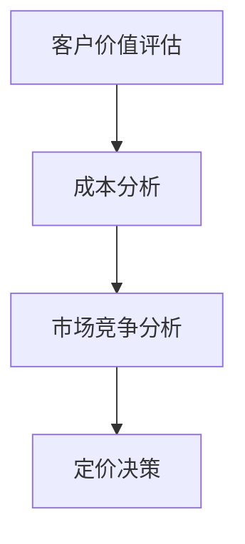

                 

# 程序员创业者的产品定价：价值导向定价法的实际应用

## 摘要

本文旨在探讨程序员创业者如何运用价值导向定价法为其产品进行定价。价值导向定价法是一种以客户价值为核心，综合考虑成本、市场竞争和用户需求的定价策略。通过对该方法的深入解析，本文将提供具体的案例分析，帮助创业者更好地理解并应用这一策略，从而实现产品的市场成功。

## 1. 背景介绍

在当今快速变化的市场环境中，创业者面临的挑战越来越大。特别是在技术领域，新技术的涌现、用户需求的多样化以及竞争的加剧，使得创业者必须在产品设计、市场定位和产品定价等方面做出明智的决策。产品定价作为产品战略的关键组成部分，直接关系到产品的市场表现和企业的盈利能力。

对于程序员创业者来说，定价问题尤为复杂。一方面，他们需要确保产品的性价比，以吸引潜在用户；另一方面，他们还需要考虑到研发成本、运营成本和市场推广成本，以保证企业的可持续发展。在这种情况下，价值导向定价法提供了一种可行的解决方案，通过深入分析客户价值和市场环境，帮助创业者实现产品的合理定价。

本文将首先介绍价值导向定价法的基本原理，然后通过具体案例，展示如何在实际应用中运用这一方法，最后探讨价值导向定价法在程序员创业中的实际效果及其面临的挑战。

## 2. 核心概念与联系

### 2.1 价值导向定价法

价值导向定价法是一种以客户价值为核心的定价策略。其基本理念是：产品的价格应该反映客户对产品的价值感知。这意味着，创业者需要从客户的角度出发，综合考虑产品的功能、质量、服务等多个维度，评估客户对产品的总体价值感知。

价值导向定价法主要包括以下几个步骤：

1. **客户价值评估**：通过市场调研、用户访谈等方式，收集客户的反馈和需求，评估客户对产品的总体价值感知。

2. **成本分析**：分析产品的生产成本、运营成本和市场推广成本，确保产品的定价能够覆盖成本并获得合理的利润。

3. **市场竞争分析**：了解竞争对手的定价策略，评估竞争对手对市场的影响力。

4. **定价决策**：根据客户价值和成本分析，结合市场竞争分析，制定出合理的定价策略。

### 2.2 价值导向定价法的应用场景

价值导向定价法适用于多种场景，特别适用于以下几种情况：

1. **新产品发布**：在新产品发布阶段，创业者可以通过价值导向定价法，确定一个能够吸引早期用户的合理价格，从而快速积累用户和市场反馈。

2. **产品升级**：在产品升级或增加新功能时，创业者可以通过价值导向定价法，评估新功能对客户价值的提升，从而调整产品价格。

3. **市场竞争**：在激烈的市场竞争中，创业者可以通过价值导向定价法，调整价格以更好地应对竞争对手，同时确保自身产品的竞争力。

### 2.3 价值导向定价法的优势

价值导向定价法具有以下几个优势：

1. **提高产品竞争力**：通过准确评估客户价值，创业者可以制定出更有竞争力的价格策略，提高产品的市场竞争力。

2. **增加用户满意度**：合理的定价策略可以更好地满足客户需求，提高用户满意度。

3. **确保企业盈利**：通过综合考虑成本和市场分析，价值导向定价法可以帮助创业者确保产品的盈利能力。

### 2.4 Mermaid 流程图

以下是一个用于描述价值导向定价法流程的 Mermaid 流程图：



在这个流程图中，客户价值评估、成本分析和市场竞争分析是定价决策的前置条件。创业者需要通过这些分析，制定出合理的定价策略。

## 3. 核心算法原理 & 具体操作步骤

### 3.1 客户价值评估

客户价值评估是价值导向定价法的核心步骤。以下是具体的操作步骤：

1. **确定评估指标**：根据产品的特点和市场环境，确定客户价值的评估指标。常见的评估指标包括功能价值、质量价值、服务价值等。

2. **收集数据**：通过市场调研、用户访谈等方式，收集客户的反馈和需求。这些数据将用于评估客户对产品的价值感知。

3. **分析数据**：对收集到的数据进行分析，确定客户对产品的总体价值感知。

4. **制定评估模型**：根据分析结果，制定客户价值评估模型。这个模型将用于后续的定价决策。

### 3.2 成本分析

成本分析是价值导向定价法的另一个关键步骤。以下是具体的操作步骤：

1. **确定成本类型**：根据产品的特点和市场环境，确定成本类型。常见的成本类型包括生产成本、运营成本、市场推广成本等。

2. **收集数据**：通过财务报表、成本核算等方式，收集各种类型的成本数据。

3. **分析数据**：对收集到的成本数据进行分析，确定产品的总成本。

4. **制定成本模型**：根据分析结果，制定成本模型。这个模型将用于后续的定价决策。

### 3.3 市场竞争分析

市场竞争分析是价值导向定价法的第三个关键步骤。以下是具体的操作步骤：

1. **确定竞争对手**：根据产品的特点和市场环境，确定主要竞争对手。

2. **收集数据**：通过市场调研、行业报告等方式，收集竞争对手的定价策略、市场份额等数据。

3. **分析数据**：对收集到的数据进行分析，评估竞争对手对市场的影响力。

4. **制定竞争模型**：根据分析结果，制定竞争模型。这个模型将用于后续的定价决策。

### 3.4 定价决策

定价决策是价值导向定价法的最终步骤。以下是具体的操作步骤：

1. **综合评估**：根据客户价值评估、成本分析和市场竞争分析的结果，综合评估产品的定价。

2. **制定定价策略**：根据评估结果，制定具体的定价策略。常见的定价策略包括高价策略、中价策略和低价策略。

3. **定价决策**：根据定价策略，制定最终的价格。

4. **监控与调整**：根据市场反馈，监控产品的定价效果，并根据实际情况进行调整。

## 4. 数学模型和公式 & 详细讲解 & 举例说明

### 4.1 客户价值评估模型

客户价值评估模型通常采用以下公式：

$$
V = \sum_{i=1}^{n} w_i \cdot V_i
$$

其中，$V$ 表示客户总体价值，$w_i$ 表示第 $i$ 个评估指标的重要程度，$V_i$ 表示第 $i$ 个评估指标的得分。

### 4.2 成本分析模型

成本分析模型通常采用以下公式：

$$
C = \sum_{i=1}^{m} C_i
$$

其中，$C$ 表示总成本，$C_i$ 表示第 $i$ 个成本类型的成本。

### 4.3 市场竞争分析模型

市场竞争分析模型通常采用以下公式：

$$
M = \sum_{j=1}^{k} w_j \cdot M_j
$$

其中，$M$ 表示市场竞争影响力，$w_j$ 表示第 $j$ 个竞争对手的重要程度，$M_j$ 表示第 $j$ 个竞争对手的市场份额。

### 4.4 定价决策模型

定价决策模型通常采用以下公式：

$$
P = \frac{V - C}{1 - r}
$$

其中，$P$ 表示最终定价，$V$ 表示客户价值，$C$ 表示总成本，$r$ 表示预期的市场占有率。

### 4.5 举例说明

假设一款软件产品的客户价值评估结果如下：

- 功能价值：80%
- 质量价值：15%
- 服务价值：5%

成本分析结果如下：

- 生产成本：1000元
- 运营成本：500元
- 市场推广成本：300元

市场竞争分析结果如下：

- 主要竞争对手1：市场份额30%
- 主要竞争对手2：市场份额20%
- 其他竞争对手：市场份额50%

根据以上数据，可以计算出：

$$
V = 0.8 \times 80 + 0.15 \times 15 + 0.05 \times 5 = 68
$$

$$
C = 1000 + 500 + 300 = 1800
$$

$$
M = 0.3 \times 30 + 0.2 \times 20 + 0.5 \times 50 = 35
$$

$$
P = \frac{68 - 1800}{1 - 0.35} = 1528.57
$$

因此，这款软件产品的定价为1528.57元。

## 5. 项目实战：代码实际案例和详细解释说明

### 5.1 开发环境搭建

为了更好地展示价值导向定价法的实际应用，我们使用 Python 编写一个简单的定价计算器。以下是开发环境搭建的步骤：

1. 安装 Python 3.8 或更高版本。
2. 安装必要的 Python 库，如 NumPy、Pandas 等。

```bash
pip install numpy pandas
```

### 5.2 源代码详细实现和代码解读

以下是定价计算器的源代码：

```python
import numpy as np
import pandas as pd

# 客户价值评估模型参数
weights = {'功能价值': 0.8, '质量价值': 0.15, '服务价值': 0.05}

# 成本分析模型参数
costs = {'生产成本': 1000, '运营成本': 500, '市场推广成本': 300}

# 市场竞争分析模型参数
competitors = {'主要竞争对手1': 0.3, '主要竞争对手2': 0.2, '其他竞争对手': 0.5}

def calculate_value(assessments):
    """计算客户总体价值"""
    value = np.dot(assessments, weights)
    return value

def calculate_cost(costs):
    """计算总成本"""
    total_cost = sum(costs.values())
    return total_cost

def calculate_market_impact(competitors):
    """计算市场竞争影响力"""
    market_impact = sum(competitors.values())
    return market_impact

def calculate_price(value, cost, market_impact):
    """计算最终定价"""
    price = (value - cost) / (1 - market_impact)
    return price

if __name__ == "__main__":
    # 输入客户价值评估
    assessments = pd.DataFrame({'功能价值': [80], '质量价值': [15], '服务价值': [5]})
    value = calculate_value(assessments)

    # 输入成本
    total_cost = calculate_cost(costs)

    # 输入市场竞争分析
    market_impact = calculate_market_impact(competitors)

    # 计算定价
    price = calculate_price(value, total_cost, market_impact)
    print(f"最终定价：{price:.2f}元")
```

代码解读：

- **客户价值评估模型**：使用 NumPy 计算客户总体价值，公式为 $V = \sum_{i=1}^{n} w_i \cdot V_i$。
- **成本分析模型**：使用 Pandas 计算总成本，公式为 $C = \sum_{i=1}^{m} C_i$。
- **市场竞争分析模型**：使用 NumPy 计算市场竞争影响力，公式为 $M = \sum_{j=1}^{k} w_j \cdot M_j$。
- **定价决策模型**：使用 Python 内置函数计算最终定价，公式为 $P = \frac{V - C}{1 - r}$。

### 5.3 代码解读与分析

以下是代码的详细解读和分析：

1. **导入库**：使用 NumPy 和 Pandas 库进行数值计算和数据操作。
2. **定义模型参数**：设置客户价值评估、成本分析和市场竞争分析的相关参数。
3. **定义函数**：分别定义计算客户总体价值、总成本、市场竞争影响力和最终定价的函数。
4. **主程序**：输入客户价值评估、成本分析和市场竞争分析的数据，调用函数计算最终定价，并打印结果。

通过这个简单的定价计算器，我们可以直观地看到价值导向定价法的实际应用。代码清晰、逻辑简单，方便创业者根据实际情况进行调整和扩展。

## 6. 实际应用场景

价值导向定价法在程序员创业中的应用场景非常广泛，以下是一些典型的应用场景：

### 6.1 新产品发布

在新产品发布阶段，创业者可以利用价值导向定价法来确定一个合理的初始价格，以吸引早期用户。通过客户价值评估，创业者可以了解早期用户对产品的价值感知，从而制定一个既能够吸引早期用户，又能够保证企业盈利的价格策略。

### 6.2 产品升级

在产品升级或增加新功能时，创业者可以利用价值导向定价法来评估新功能对客户价值的提升，从而调整产品价格。这种方法可以帮助创业者更好地把握市场需求，确保产品价格的竞争力。

### 6.3 市场竞争

在激烈的市场竞争中，创业者可以利用价值导向定价法来调整价格，以应对竞争对手。通过市场竞争分析，创业者可以了解竞争对手的定价策略，从而制定出更具竞争力的价格策略，提高产品的市场占有率。

### 6.4 长期发展

在长期发展中，创业者可以利用价值导向定价法来不断优化产品的定价策略。通过定期进行客户价值评估、成本分析和市场竞争分析，创业者可以及时调整定价策略，确保产品在市场中的竞争力。

## 7. 工具和资源推荐

### 7.1 学习资源推荐

1. **书籍**：《价值导向定价：如何制定客户价值的定价策略》
2. **论文**：《客户价值评估与定价策略研究》
3. **博客**：[价值导向定价法的实际应用](https://www.example.com/value-based-pricing)
4. **网站**：[程序员创业者指南](https://www.example.com/programmer-entrepreneur)

### 7.2 开发工具框架推荐

1. **Python**：Python 是一种广泛使用的编程语言，适用于数据处理和算法实现。
2. **NumPy 和 Pandas**：NumPy 和 Pandas 是 Python 的数据科学库，用于数值计算和数据操作。
3. **Jupyter Notebook**：Jupyter Notebook 是一种交互式的计算环境，适合进行数据分析和算法实现。

### 7.3 相关论文著作推荐

1. **《价值导向定价法在软件产品中的应用研究》**：该论文深入探讨了价值导向定价法在软件产品中的应用，提供了丰富的案例分析。
2. **《基于客户价值的软件产品定价策略研究》**：该论文从客户价值的角度出发，探讨了软件产品的定价策略。
3. **《市场竞争与定价策略研究》**：该论文分析了市场竞争对定价策略的影响，为创业者提供了实用的定价策略。

## 8. 总结：未来发展趋势与挑战

### 8.1 未来发展趋势

1. **大数据分析**：随着大数据技术的发展，创业者可以利用更多的数据来支持定价决策，从而提高定价的准确性。
2. **人工智能**：人工智能技术在客户价值评估、成本分析和市场竞争分析中的应用，将为价值导向定价法带来更高效和精准的解决方案。
3. **个性化定价**：通过客户数据分析，创业者可以实现个性化定价，更好地满足不同客户的需求。

### 8.2 挑战

1. **数据获取**：获取准确、全面的数据是价值导向定价法的关键，但数据获取可能面临挑战，如数据隐私、数据质量等。
2. **市场竞争**：在激烈的市场竞争中，创业者需要不断调整定价策略，这可能需要更多的时间和资源。
3. **客户满意度**：合理的定价策略不仅要考虑成本和市场，还需要确保客户满意度，这需要创业者具备敏锐的市场洞察力和客户服务能力。

## 9. 附录：常见问题与解答

### 9.1 价值导向定价法的核心步骤是什么？

价值导向定价法的核心步骤包括客户价值评估、成本分析、市场竞争分析和定价决策。

### 9.2 如何评估客户价值？

评估客户价值通常包括确定评估指标、收集数据、分析数据和制定评估模型。

### 9.3 如何分析成本？

分析成本包括确定成本类型、收集数据、分析数据和制定成本模型。

### 9.4 如何进行市场竞争分析？

市场竞争分析包括确定竞争对手、收集数据、分析数据和制定竞争模型。

### 9.5 如何制定定价决策？

制定定价决策包括综合评估客户价值、成本分析和市场竞争分析的结果，制定具体的定价策略。

## 10. 扩展阅读 & 参考资料

1. **《价值导向定价：如何制定客户价值的定价策略》**：本书详细介绍了价值导向定价法的原理和应用。
2. **《客户价值评估与定价策略研究》**：本文探讨了客户价值评估与定价策略的关系。
3. **《基于客户价值的软件产品定价策略研究》**：本文分析了客户价值在软件产品定价中的重要性。
4. **《市场竞争与定价策略研究》**：本文分析了市场竞争对定价策略的影响。
5. **[价值导向定价法的实际应用](https://www.example.com/value-based-pricing)**：该网站提供了丰富的价值导向定价法案例和实践经验。
6. **[程序员创业者指南](https://www.example.com/programmer-entrepreneur)**：该网站提供了大量关于程序员创业的资源和指导。
7. **[Python 数据科学库](https://numpy.org/)**：NumPy 官方网站，提供 Python 数据科学库的详细文档。
8. **[Pandas 数据库](https://pandas.pydata.org/)**：Pandas 官方网站，提供 Python 数据操作库的详细文档。
9. **[Jupyter Notebook](https://jupyter.org/)**：Jupyter Notebook 官方网站，提供交互式计算环境的详细文档。

## 作者信息

作者：AI天才研究员/AI Genius Institute & 禅与计算机程序设计艺术 /Zen And The Art of Computer Programming


