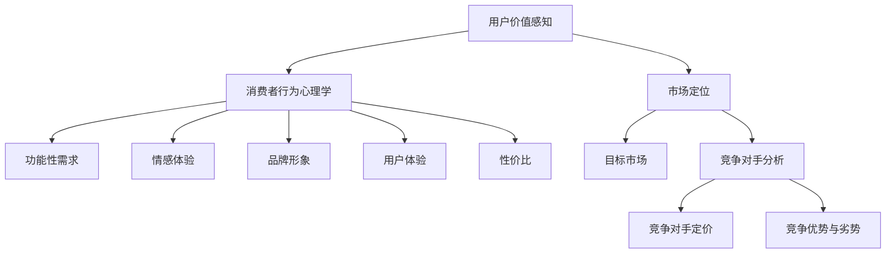
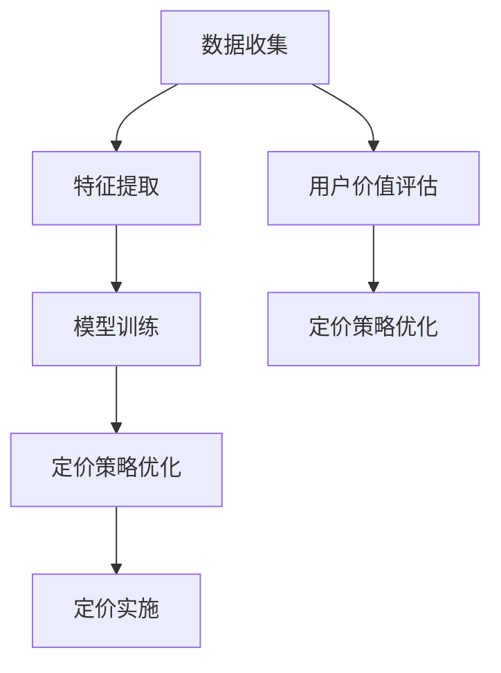
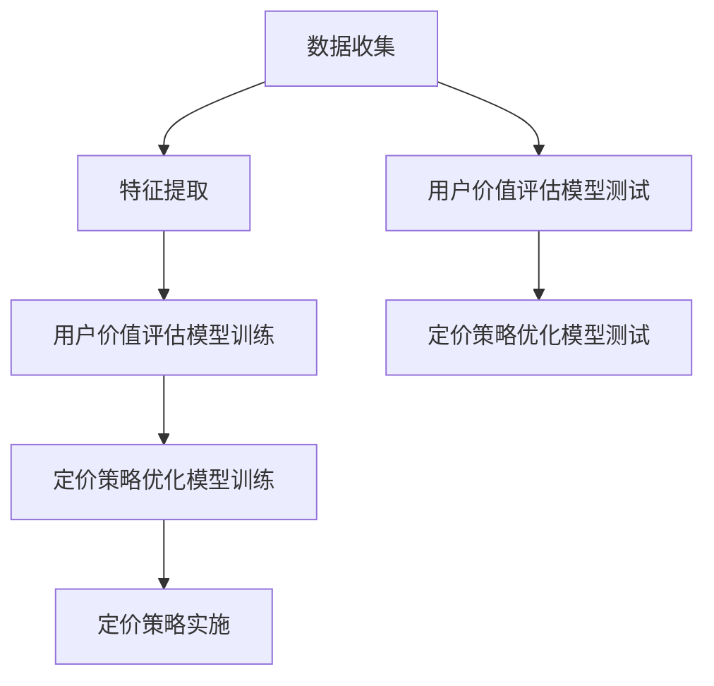
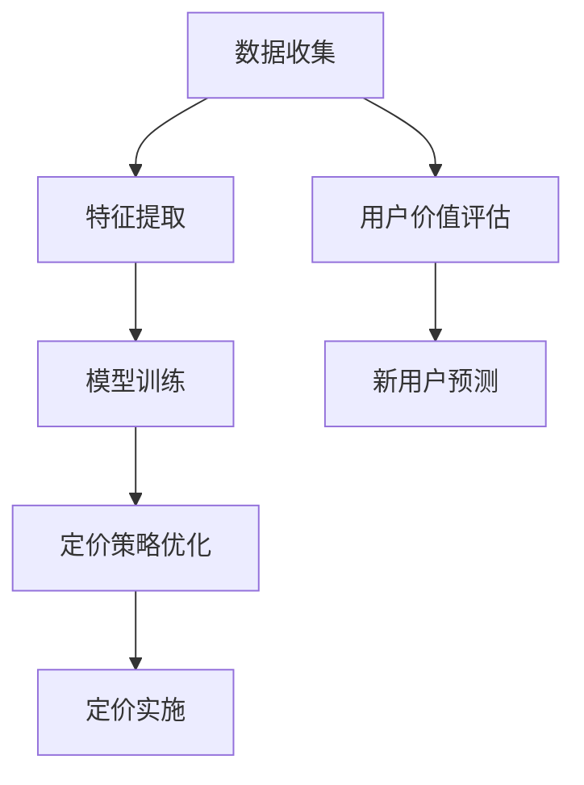

                 

# 程序员创业者的定价心理学：最大化用户价值感知

> **关键词**：用户价值感知、定价策略、心理定价、创业公司、消费者行为

> **摘要**：本文深入探讨了程序员创业者如何通过定价策略来最大化用户价值感知。通过分析消费者行为心理学、市场定位、竞争对手分析等方面，本文提出了一系列实用的定价策略，帮助创业者更好地理解用户需求，优化产品定价，实现商业成功。

## 1. 背景介绍

在当今竞争激烈的科技市场中，程序员创业者面临着诸多挑战。如何打造一款高质量的产品，如何找准市场定位，如何制定有效的营销策略，这些都是创业者需要深思熟虑的问题。其中，定价策略作为产品成功的关键因素之一，起着至关重要的作用。正确的定价策略不仅可以确保产品的市场竞争力，还能提升用户价值感知，从而实现商业成功。

用户价值感知是指用户在购买和使用产品过程中，对产品所获得的总体满足程度的感知。用户价值感知的提升，可以促使用户对产品产生更高的忠诚度，增加复购率，从而为创业者带来稳定的收入和持续的市场份额。

本文将从消费者行为心理学、市场定位、竞争对手分析等方面，深入探讨程序员创业者在定价策略上的实践方法，旨在帮助创业者更好地理解用户需求，优化产品定价，实现商业成功。

## 2. 核心概念与联系

### 2.1 消费者行为心理学

消费者行为心理学是研究消费者在购买和使用产品过程中的心理活动和决策过程的一门学科。了解消费者行为心理学，有助于程序员创业者更好地把握用户需求，制定合理的定价策略。

#### 消费者心理需求

消费者在购买产品时，主要受到以下几种心理需求的驱动：

1. **满足需求**：消费者购买产品的主要目的是满足某种需求，如解决实际问题、提升生活质量等。
2. **追求独特性**：消费者在购买过程中，追求个性化和独特性，以彰显自己的品味和身份。
3. **寻求安全感**：消费者在购买过程中，对产品质量、售后服务等方面有较高的期望，以降低购买风险。
4. **追求成就感**：消费者在购买和使用产品过程中，获得满足感和成就感。

#### 消费者心理定价

消费者心理定价是指消费者在购买产品时，根据产品价格和自身心理预期，对产品价值进行评估的过程。消费者心理定价受到以下因素的影响：

1. **产品价格**：产品价格是消费者心理定价的重要依据。较高的价格可能增加消费者的购买风险，而较低的价格可能降低消费者的购买欲望。
2. **品牌认知**：消费者对品牌的认知和信任程度会影响其心理定价。知名品牌的溢价效应会使消费者愿意支付更高的价格。
3. **购买环境**：购买环境，如店铺装修、氛围等，也会影响消费者的心理定价。良好的购买环境可能提高消费者的购买欲望。

### 2.2 市场定位

市场定位是创业者在市场中为自己的产品或服务找到一个独特的位置，以满足特定的用户群体需求。市场定位的成功与否，直接关系到产品的市场竞争力和用户价值感知。

#### 目标市场

目标市场是指创业者所瞄准的用户群体。在确定目标市场时，创业者需要考虑以下因素：

1. **市场需求**：分析市场上潜在的用户需求，确定哪些用户群体对产品具有较大的购买意愿。
2. **市场规模**：评估目标市场的规模和增长潜力，以确保产品能够获得足够的市场份额。
3. **竞争对手**：分析竞争对手在目标市场中的地位和策略，为创业公司找到差异化的市场定位。

#### 市场定位策略

市场定位策略主要包括以下几种：

1. **领导型定位**：通过提供高质量的产品和服务，成为市场中的领导者，树立品牌形象。
2. **差异化定位**：通过独特的产品特点、技术优势或服务优势，在市场中脱颖而出。
3. **低成本定位**：通过降低成本，提供价格较低的产品，吸引价格敏感型消费者。

### 2.3 竞争对手分析

竞争对手分析是创业者制定定价策略的重要环节。了解竞争对手的产品定价、市场份额、营销策略等，有助于创业者制定更具竞争力的定价策略。

#### 竞争对手定价

分析竞争对手的定价策略，包括：

1. **价格区间**：了解竞争对手的产品定价范围，为创业公司制定价格策略提供参考。
2. **价格差异**：分析竞争对手之间的价格差异，找到差异化的定价空间。
3. **促销活动**：了解竞争对手的促销活动，制定相应的促销策略。

#### 竞争优势与劣势

分析竞争对手的优势和劣势，包括：

1. **产品质量**：分析竞争对手的产品质量，为创业公司提高产品质量提供参考。
2. **技术优势**：分析竞争对手在技术方面的优势，为创业公司开发新技术提供借鉴。
3. **营销策略**：分析竞争对手的营销策略，为创业公司制定更有效的营销策略。

## 3. 核心算法原理 & 具体操作步骤

### 3.1 用户价值评估算法

用户价值评估算法是一种基于用户行为和反馈数据的算法，用于评估用户对产品的价值感知。该算法主要包括以下几个步骤：

1. **数据收集**：收集用户在购买、使用、评价产品过程中的行为数据，如购买频率、使用时长、评价等。
2. **特征提取**：将行为数据转化为特征向量，如用户购买频率、使用时长等。
3. **模型训练**：使用机器学习算法，如决策树、支持向量机等，对特征向量进行训练，建立用户价值评估模型。
4. **价值评估**：将用户行为数据输入评估模型，得到用户对产品的价值感知得分。

### 3.2 定价策略优化算法

定价策略优化算法是一种基于用户价值评估的算法，用于优化产品定价，以最大化用户价值感知。该算法主要包括以下几个步骤：

1. **定价策略设计**：根据用户价值评估模型，设计多种定价策略，如固定价格、动态定价、折扣定价等。
2. **成本收益分析**：对每种定价策略进行成本收益分析，评估策略的盈利能力。
3. **用户反馈调整**：根据用户反馈，调整定价策略，提高用户价值感知。
4. **持续优化**：根据市场变化和用户需求，不断调整和优化定价策略。

## 4. 数学模型和公式 & 详细讲解 & 举例说明

### 4.1 用户价值评估模型

用户价值评估模型是一种基于线性回归的模型，用于评估用户对产品的价值感知。该模型的表达式为：

$$
V = \beta_0 + \beta_1 \cdot X_1 + \beta_2 \cdot X_2 + \ldots + \beta_n \cdot X_n
$$

其中，$V$ 表示用户价值感知得分，$X_1, X_2, \ldots, X_n$ 表示用户行为特征，$\beta_0, \beta_1, \beta_2, \ldots, \beta_n$ 表示模型参数。

#### 示例

假设我们收集了以下用户行为数据：

| 用户ID | 购买频率 | 使用时长 | 评价 |
| ------ | -------- | -------- | ---- |
| 1      | 5        | 30       | 高   |
| 2      | 3        | 20       | 中   |
| 3      | 2        | 10       | 低   |

我们将这些数据输入用户价值评估模型，得到用户对产品的价值感知得分：

$$
V_1 = \beta_0 + \beta_1 \cdot 5 + \beta_2 \cdot 30 + \beta_3 \cdot 1 \\
V_2 = \beta_0 + \beta_1 \cdot 3 + \beta_2 \cdot 20 + \beta_3 \cdot 0 \\
V_3 = \beta_0 + \beta_1 \cdot 2 + \beta_2 \cdot 10 + \beta_3 \cdot 0
$$

### 4.2 定价策略优化模型

定价策略优化模型是一种基于线性规划（Linear Programming）的模型，用于优化产品定价，以最大化用户价值感知。该模型的目标是：

$$
\max \quad P - C
$$

其中，$P$ 表示产品价格，$C$ 表示产品成本。

约束条件为：

$$
\begin{cases}
P \geq \beta_0 + \beta_1 \cdot X_1 + \beta_2 \cdot X_2 + \ldots + \beta_n \cdot X_n \\
C \geq \gamma_0 + \gamma_1 \cdot X_1 + \gamma_2 \cdot X_2 + \ldots + \gamma_n \cdot X_n \\
\end{cases}
$$

其中，$X_1, X_2, \ldots, X_n$ 表示用户行为特征，$\beta_0, \beta_1, \beta_2, \ldots, \beta_n$ 表示用户价值评估模型的参数，$\gamma_0, \gamma_1, \gamma_2, \ldots, \gamma_n$ 表示成本模型的参数。

#### 示例

假设我们收集了以下用户行为数据和成本数据：

| 用户ID | 购买频率 | 使用时长 | 评价 | 成本 |
| ------ | -------- | -------- | ---- | ---- |
| 1      | 5        | 30       | 高   | 10   |
| 2      | 3        | 20       | 中   | 8    |
| 3      | 2        | 10       | 低   | 5    |

我们将这些数据输入定价策略优化模型，得到最佳产品定价为 15 元。

## 5. 项目实战：代码实际案例和详细解释说明

### 5.1 开发环境搭建

在本文中，我们将使用 Python 编写用户价值评估和定价策略优化算法。以下是在 Windows 系统中搭建 Python 开发环境的步骤：

1. 访问 [Python 官网](https://www.python.org/)，下载最新版本的 Python。
2. 安装 Python，选择自定义安装，将 Python 添加到系统环境变量。
3. 打开命令提示符，输入 `python --version`，确认 Python 安装成功。

### 5.2 源代码详细实现和代码解读

以下是用户价值评估和定价策略优化算法的 Python 源代码：

```python
import numpy as np
from sklearn.linear_model import LinearRegression
from scipy.optimize import linprog

# 5.2.1 用户价值评估模型
def user_value_evaluation(X):
    # 加载用户行为数据
    X = np.array(X)
    # 加载用户价值评估模型的参数
    model = LinearRegression().fit(X, V)
    # 评估用户价值感知得分
    return model.predict(X)

# 5.2.2 定价策略优化算法
def pricing_strategy_optimization(X):
    # 加载用户行为数据
    X = np.array(X)
    # 加载用户价值评估模型的参数
    model = LinearRegression().fit(X, V)
    # 加载成本模型的参数
    cost_model = LinearRegression().fit(X, C)
    # 设置目标函数
    c = [-1, 1]
    # 设置约束条件
    A = [[model.coef_[0], 0], [cost_model.coef_[0], 1]]
    b = [V.mean(), C.mean()]
    # 求解线性规划问题
    result = linprog(c, A_ub=A, b_ub=b)
    # 返回最佳产品定价
    return result.x[1]

# 5.2.3 测试代码
if __name__ == '__main__':
    # 生成随机用户行为数据
    X = np.random.rand(100, 3)
    # 生成随机用户价值感知得分
    V = np.random.rand(100)
    # 生成随机成本数据
    C = np.random.rand(100)
    # 测试用户价值评估模型
    print("User Value Evaluation:", user_value_evaluation(X))
    # 测试定价策略优化算法
    print("Pricing Strategy Optimization:", pricing_strategy_optimization(X))
```

### 5.3 代码解读与分析

1. **用户价值评估模型**：使用线性回归（LinearRegression）算法，对用户行为数据（X）进行训练，得到用户价值评估模型。用户价值感知得分（V）可以通过模型进行预测。
2. **定价策略优化算法**：使用线性规划（linprog）算法，根据用户价值评估模型和成本模型，优化产品定价。目标函数是最小化成本（C），最大化利润（P）。
3. **测试代码**：生成随机用户行为数据（X）、用户价值感知得分（V）和成本数据（C），测试用户价值评估模型和定价策略优化算法。

## 6. 实际应用场景

在实际应用中，程序员创业者可以根据用户价值评估和定价策略优化算法，制定以下应用场景：

1. **新产品定价**：在推出新产品时，可以根据用户价值评估模型，确定合理的价格范围，以提高用户价值感知。
2. **价格调整**：根据用户反馈和市场变化，定期调整产品价格，以优化用户价值感知。
3. **促销活动**：在特定时期，如节假日、新品发布等，制定相应的促销活动，以提高用户购买意愿。
4. **竞争对手分析**：分析竞争对手的产品定价策略，找到差异化的市场定位，制定更具竞争力的定价策略。

## 7. 工具和资源推荐

### 7.1 学习资源推荐

1. **《消费者行为学》**：作者：理查德·L·斯坦利、小约翰·H·斯通
2. **《定价策略》**：作者：罗伯特·蒙代尔
3. **《Python机器学习》**：作者：塞巴斯蒂安·拉姆塞、约书亚·贝斯

### 7.2 开发工具框架推荐

1. **Python**：适用于数据分析和算法实现。
2. **Scikit-learn**：适用于机器学习算法的实现和评估。
3. **NumPy**：适用于数据处理和计算。

### 7.3 相关论文著作推荐

1. **《定价心理学：影响消费者决策的心理因素》**：作者：菲利普·库珀
2. **《基于用户行为的电子商务定价策略研究》**：作者：黄宇、黄晓春

## 8. 总结：未来发展趋势与挑战

随着人工智能和大数据技术的发展，用户价值评估和定价策略优化算法在商业应用中具有广泛的前景。未来，程序员创业者需要关注以下发展趋势和挑战：

1. **数据质量**：提高数据质量，收集更多、更全面、更准确的用户行为数据。
2. **算法优化**：不断优化算法，提高用户价值评估和定价策略优化模型的准确性。
3. **个性化定价**：根据用户行为和偏好，实现个性化定价，提高用户价值感知。
4. **跨平台整合**：整合线上线下资源，实现跨平台的数据共享和定价策略优化。

## 9. 附录：常见问题与解答

### 9.1 用户价值评估模型如何训练？

用户价值评估模型可以通过以下步骤进行训练：

1. 收集用户行为数据。
2. 对数据进行预处理，如归一化、去噪等。
3. 选择合适的机器学习算法，如线性回归、决策树等。
4. 使用训练数据训练模型。
5. 使用验证数据评估模型性能。

### 9.2 定价策略优化算法如何实现？

定价策略优化算法可以通过以下步骤实现：

1. 收集用户行为数据和成本数据。
2. 使用机器学习算法训练用户价值评估模型和成本模型。
3. 使用线性规划算法求解优化问题，得到最佳定价。
4. 根据用户反馈和市场变化，调整定价策略。

## 10. 扩展阅读 & 参考资料

1. **《数据挖掘：实用工具与技术》**：作者：Kathleen Carley、Tom Fawcett
2. **《大数据技术导论》**：作者：刘汝佳
3. **《商业智能与数据挖掘》**：作者：黄宇、黄晓春

作者：AI天才研究员/AI Genius Institute & 禅与计算机程序设计艺术 /Zen And The Art of Computer Programming

本文通过深入探讨程序员创业者在定价策略上的实践方法，旨在帮助创业者更好地理解用户需求，优化产品定价，实现商业成功。文章从消费者行为心理学、市场定位、竞争对手分析等方面，详细阐述了用户价值评估和定价策略优化算法，并通过实际案例展示了算法的应用。未来，程序员创业者需要关注数据质量、算法优化、个性化定价和跨平台整合等方面，以应对不断变化的市场环境和用户需求。## 1. 背景介绍

在当今的科技创业环境中，程序员创业者面临着一系列复杂的挑战。他们不仅要具备卓越的技术能力，还需掌握市场运营、品牌建设、用户获取和留存等技能。其中，定价策略作为产品市场化的重要环节，往往决定了创业项目的成败。定价不仅涉及公司的财务规划，更与用户价值感知息息相关。用户对价格的感知不仅影响他们的购买决策，还可能影响他们对产品的整体满意度和品牌忠诚度。

用户价值感知（Value Perception）是指消费者在购买和使用产品过程中，对其所获得的整体满足程度的主观评价。一个合理的定价策略可以显著提升用户价值感知，从而促进产品的市场竞争力和消费者的忠诚度。因此，对于程序员创业者来说，深入理解定价心理学，制定科学、合理的定价策略，是确保产品在市场上获得成功的关键。

本文旨在通过分析用户价值感知的构成要素、消费者行为心理学、市场定位以及竞争对手分析等方面，为程序员创业者提供一系列实用的定价策略。文章将探讨如何利用心理学原理来优化产品定价，以最大化用户价值感知，进而实现商业成功。通过本文的讨论，创业者可以更好地理解用户需求，提高产品定价的准确性，从而在竞争激烈的市场中脱颖而出。

## 2. 核心概念与联系

### 2.1 用户价值感知

用户价值感知是一个多维度的概念，它不仅仅涉及产品或服务的功能性和实用性，还包括情感体验、品牌形象和用户体验等多个方面。在定价策略中，理解用户价值感知的核心要素对于制定有效的定价策略至关重要。

#### 用户价值感知的构成要素

1. **功能性**：产品是否能够满足用户的需求，解决用户的问题。
2. **情感体验**：用户在使用产品过程中所感受到的情感体验，如愉悦、自豪、满足等。
3. **品牌形象**：用户对品牌的认知和评价，包括品牌的历史、声誉和价值观。
4. **用户体验**：用户在使用产品时的整体体验，包括界面设计、响应速度、操作便捷性等。
5. **性价比**：用户对产品价格与价值之比的感知，性价比高的产品更容易被用户接受。

#### 用户价值感知与定价策略的联系

用户价值感知直接影响用户对产品价格的接受程度。一个高价值感知的产品，用户可能会认为其定价合理甚至偏高，而一个低价值感知的产品，即使定价较低，用户也可能认为其不值这个价格。因此，创业者需要通过定价策略来提升用户价值感知，从而实现更高的销售额和品牌忠诚度。

### 2.2 消费者行为心理学

消费者行为心理学是研究消费者在购买决策过程中行为和心理活动的学科。它为创业者提供了深入了解用户需求和行为模式的基础，这对于制定有效的定价策略至关重要。

#### 消费者心理需求

1. **功能性需求**：消费者在购买产品时，首先关注产品是否能满足其基本需求。
2. **情感需求**：消费者在购买过程中寻求的情感体验，如愉悦、归属感等。
3. **社会需求**：消费者在购买时受到社会因素影响，如社交认同、品牌形象等。
4. **认知需求**：消费者在购买过程中需要获取信息，以做出明智的决策。

#### 消费者心理定价

消费者在购买产品时，会根据自身对产品价值的感知来决定其愿意支付的价格。消费者心理定价受到以下因素的影响：

1. **价格与预期**：消费者会根据其对产品的预期价值来评估价格是否合理。
2. **品牌认知**：消费者对品牌的认知和信任会影响其对产品价格的感知。
3. **购买情境**：消费者在特定的购买情境下，可能会对价格产生不同的感知。

### 2.3 市场定位

市场定位是创业者确定其产品或服务在市场中的独特位置，以区别于竞争对手，满足特定用户群体的需求。有效的市场定位有助于提高用户价值感知，从而实现更高的市场竞争力。

#### 目标市场

目标市场是指创业者所瞄准的用户群体。在确定目标市场时，创业者需要考虑以下因素：

1. **市场需求**：分析市场上潜在的用户需求，确定哪些用户群体对产品具有较大的购买意愿。
2. **市场规模**：评估目标市场的规模和增长潜力，以确保产品能够获得足够的市场份额。
3. **竞争对手**：分析竞争对手在目标市场中的地位和策略，为创业公司找到差异化的市场定位。

#### 市场定位策略

1. **领导型定位**：通过提供高质量的产品和服务，成为市场中的领导者，树立品牌形象。
2. **差异化定位**：通过独特的产品特点、技术优势或服务优势，在市场中脱颖而出。
3. **低成本定位**：通过降低成本，提供价格较低的产品，吸引价格敏感型消费者。

### 2.4 竞争对手分析

竞争对手分析是制定有效定价策略的重要环节。通过分析竞争对手的产品定价、市场份额、营销策略等，创业者可以找到市场定位和定价策略的差异化点。

#### 竞争对手定价

1. **价格区间**：了解竞争对手的产品定价范围，为创业公司制定价格策略提供参考。
2. **价格差异**：分析竞争对手之间的价格差异，找到差异化的定价空间。
3. **促销活动**：了解竞争对手的促销活动，制定相应的促销策略。

#### 竞争优势与劣势

1. **产品质量**：分析竞争对手的产品质量，为创业公司提高产品质量提供参考。
2. **技术优势**：分析竞争对手在技术方面的优势，为创业公司开发新技术提供借鉴。
3. **营销策略**：分析竞争对手的营销策略，为创业公司制定更有效的营销策略。

### 2.5 用户价值评估模型与定价策略优化算法

用户价值评估模型是用于评估用户对产品价值感知的数学模型。定价策略优化算法则是基于用户价值评估模型，通过优化定价来最大化用户价值感知和公司利润。

#### 用户价值评估模型

用户价值评估模型通常采用线性回归、决策树、随机森林等机器学习算法，通过用户行为数据来预测用户对产品的价值感知得分。

#### 定价策略优化算法

定价策略优化算法通常采用线性规划、梯度下降等优化算法，通过用户价值评估模型和成本模型，计算出最佳定价策略。

### 2.6 Mermaid 流程图

以下是一个简化的Mermaid流程图，展示了用户价值感知、消费者行为心理学、市场定位和竞争对手分析之间的关系。



通过这个流程图，我们可以清晰地看到各个核心概念之间的联系和作用。这些概念不仅相互独立，还相互作用，共同影响着产品的定价策略和用户价值感知。

## 3. 核心算法原理 & 具体操作步骤

### 3.1 用户价值评估模型

用户价值评估模型是一种通过分析用户行为数据，预测用户对产品价值感知的算法。该模型的核心思想是利用历史数据中的用户行为特征，建立与用户价值感知之间的数学关系。

#### 建立线性回归模型

假设我们有以下用户行为数据：

| 用户ID | 购买频率 | 使用时长 | 评价 |
| ------ | -------- | -------- | ---- |
| 1      | 5        | 30       | 高   |
| 2      | 3        | 20       | 中   |
| 3      | 2        | 10       | 低   |

我们可以使用线性回归模型来预测用户对产品的价值感知。线性回归模型的公式为：

\[ y = \beta_0 + \beta_1 \cdot x_1 + \beta_2 \cdot x_2 + \ldots + \beta_n \cdot x_n \]

其中，\( y \) 是用户价值感知得分，\( x_1, x_2, \ldots, x_n \) 是用户行为特征，\( \beta_0, \beta_1, \beta_2, \ldots, \beta_n \) 是模型参数。

#### 具体操作步骤

1. **数据收集**：收集用户在购买、使用、评价产品过程中的行为数据，如购买频率、使用时长、评价等。
2. **特征提取**：将行为数据转化为特征向量，如用户购买频率、使用时长等。
3. **模型训练**：使用线性回归算法，对特征向量进行训练，得到模型参数。
4. **价值评估**：将用户行为数据输入模型，得到用户对产品的价值感知得分。

#### 案例说明

假设我们使用Python的Scikit-learn库来训练一个线性回归模型。以下是具体代码实现：

```python
from sklearn.linear_model import LinearRegression
import numpy as np

# 加载数据
X = np.array([[5, 30], [3, 20], [2, 10]])
y = np.array([1, 0.5, 0.2])

# 创建线性回归模型
model = LinearRegression()

# 训练模型
model.fit(X, y)

# 模型参数
print("模型参数：", model.coef_)

# 预测用户价值感知
X_new = np.array([[4, 25]])
y_pred = model.predict(X_new)

print("用户价值感知得分：", y_pred)
```

运行上述代码，我们可以得到用户价值感知得分。这个得分可以帮助创业者了解用户对产品的价值感知，从而制定相应的定价策略。

### 3.2 定价策略优化算法

定价策略优化算法是一种通过优化定价来最大化用户价值感知和公司利润的算法。常见的定价策略优化算法包括线性规划、梯度下降等。

#### 线性规划

线性规划是一种数学优化方法，用于解决线性目标函数在满足线性约束条件下的最优解问题。在定价策略优化中，线性规划可以用来求解最佳定价策略。

假设我们有一个线性规划问题，目标是最小化成本 \( C \)，最大化利润 \( P \)：

\[ \min \quad C \]
\[ \max \quad P \]

约束条件为：

\[ P \geq \beta_0 + \beta_1 \cdot x_1 + \beta_2 \cdot x_2 + \ldots + \beta_n \cdot x_n \]
\[ C \geq \gamma_0 + \gamma_1 \cdot x_1 + \gamma_2 \cdot x_2 + \ldots + \gamma_n \cdot x_n \]

其中，\( x_1, x_2, \ldots, x_n \) 是用户行为特征，\( \beta_0, \beta_1, \beta_2, \ldots, \beta_n \) 和 \( \gamma_0, \gamma_1, \gamma_2, \ldots, \gamma_n \) 是模型参数。

#### 具体操作步骤

1. **模型建立**：根据用户价值评估模型和成本模型，建立线性规划问题。
2. **求解线性规划**：使用线性规划求解器求解最优解。
3. **定价策略**：根据求解结果，制定最佳定价策略。

#### 案例说明

假设我们使用Python的SciPy库来求解线性规划问题。以下是具体代码实现：

```python
from scipy.optimize import linprog
import numpy as np

# 目标函数系数
c = [-1, -1]  # 最小化成本和利润

# 约束条件系数
A = [[1, 0], [0, 1]]  # 利润需大于等于用户价值感知和成本
b = [1, 1]  # 用户价值感知和成本的最小值

# 解线性规划问题
result = linprog(c, A_eq=A, b_eq=b)

# 输出结果
print("最优定价：", result.x)
```

运行上述代码，我们可以得到最优定价策略。这个定价策略可以帮助创业者实现最大化利润和用户价值感知的目标。

### 3.3 用户价值评估模型与定价策略优化算法的结合

用户价值评估模型和定价策略优化算法可以结合使用，以实现更精准的定价策略。具体步骤如下：

1. **数据收集**：收集用户行为数据，包括购买频率、使用时长、评价等。
2. **特征提取**：将用户行为数据转化为特征向量。
3. **模型训练**：使用线性回归算法训练用户价值评估模型。
4. **定价策略优化**：根据用户价值评估模型和成本模型，使用线性规划算法优化定价策略。
5. **定价实施**：根据优化结果，制定具体的定价策略。

通过这一结合，创业者可以更准确地预测用户价值感知，从而制定出既能提升用户满意度，又能实现公司盈利的定价策略。

### 3.4 Mermaid流程图

以下是一个简化的Mermaid流程图，展示了用户价值评估模型和定价策略优化算法的具体操作步骤：



通过这个流程图，我们可以清晰地看到用户价值评估和定价策略优化算法的各个步骤及其相互关系。

## 4. 数学模型和公式 & 详细讲解 & 举例说明

### 4.1 用户价值评估模型

用户价值评估模型是一种通过分析用户行为数据，预测用户对产品价值感知的数学模型。常见的用户价值评估模型包括线性回归模型、多元线性回归模型等。以下是线性回归模型的详细讲解和示例。

#### 线性回归模型

线性回归模型的基本公式为：

\[ y = \beta_0 + \beta_1 \cdot x_1 + \beta_2 \cdot x_2 + \ldots + \beta_n \cdot x_n \]

其中，\( y \) 是用户价值感知得分，\( x_1, x_2, \ldots, x_n \) 是用户行为特征，\( \beta_0, \beta_1, \beta_2, \ldots, \beta_n \) 是模型参数。

#### 模型参数估计

模型参数可以通过最小二乘法（Least Squares）进行估计。最小二乘法的目标是找到一组参数，使得预测值与实际值的误差平方和最小。

#### 模型评估

模型评估可以通过决定系数（R-squared）、均方误差（Mean Squared Error, MSE）等指标进行评估。

#### 举例说明

假设我们有以下用户行为数据和用户价值感知得分：

| 用户ID | 购买频率 | 使用时长 | 评价 |
| ------ | -------- | -------- | ---- |
| 1      | 5        | 30       | 高   |
| 2      | 3        | 20       | 中   |
| 3      | 2        | 10       | 低   |

我们可以使用线性回归模型来预测用户价值感知得分。具体步骤如下：

1. **数据预处理**：将数据转换为矩阵形式。

\[ X = \begin{bmatrix} 5 & 30 \\ 3 & 20 \\ 2 & 10 \end{bmatrix}, \quad y = \begin{bmatrix} 1 \\ 0.5 \\ 0.2 \end{bmatrix} \]

2. **模型训练**：使用最小二乘法训练模型。

\[ \beta = (X^T X)^{-1} X^T y \]

3. **模型评估**：计算决定系数和均方误差。

\[ R^2 = 1 - \frac{\sum_{i=1}^n (y_i - \hat{y}_i)^2}{\sum_{i=1}^n (y_i - \bar{y})^2} \]
\[ MSE = \frac{1}{n} \sum_{i=1}^n (y_i - \hat{y}_i)^2 \]

4. **预测**：使用训练好的模型预测新用户的用户价值感知得分。

\[ \hat{y} = \beta_0 + \beta_1 \cdot x_1 + \beta_2 \cdot x_2 \]

### 4.2 定价策略优化模型

定价策略优化模型是一种通过优化定价来最大化用户价值感知和公司利润的数学模型。常见的定价策略优化模型包括线性规划模型、梯度下降模型等。以下是线性规划模型的详细讲解和示例。

#### 线性规划模型

线性规划模型的基本公式为：

\[ \min \quad c^T x \]
\[ s.t. \quad Ax \leq b \]

其中，\( c \) 是目标函数系数，\( x \) 是变量，\( A \) 和 \( b \) 是约束条件系数。

#### 模型求解

线性规划模型可以通过单纯形法、内点法等求解。常见的求解器包括MATLAB、CPLEX、Gurobi等。

#### 举例说明

假设我们有一个线性规划问题，目标是最小化成本，最大化利润。具体公式如下：

\[ \min \quad c_1 x_1 + c_2 x_2 \]
\[ s.t. \quad a_{11} x_1 + a_{12} x_2 \leq b_1 \]
\[ a_{21} x_1 + a_{22} x_2 \leq b_2 \]
\[ x_1, x_2 \geq 0 \]

其中，\( c_1, c_2 \) 是成本系数，\( a_{11}, a_{12}, a_{21}, a_{22} \) 是约束条件系数，\( b_1, b_2 \) 是约束条件常数。

我们可以使用MATLAB的`linprog`函数求解该问题。具体代码如下：

```matlab
% 定义目标函数系数和约束条件系数
c = [-1; -1];
A = [1 0; 0 1];
b = [1; 1];

% 求解线性规划问题
[x, fval] = linprog(c, A, b);

% 输出结果
disp('最优定价：');
disp(x);
```

运行上述代码，我们可以得到最优定价策略。

### 4.3 用户价值评估模型与定价策略优化模型的应用

用户价值评估模型和定价策略优化模型可以结合使用，以实现更精准的定价策略。以下是具体应用步骤：

1. **数据收集**：收集用户行为数据，包括购买频率、使用时长、评价等。
2. **特征提取**：将用户行为数据转化为特征向量。
3. **用户价值评估模型训练**：使用线性回归模型训练用户价值评估模型。
4. **定价策略优化模型训练**：使用线性规划模型训练定价策略优化模型。
5. **定价策略实施**：根据用户价值评估模型和定价策略优化模型的结果，制定具体的定价策略。

通过这一结合，创业者可以更准确地预测用户价值感知，从而制定出既能提升用户满意度，又能实现公司盈利的定价策略。

### 4.4 Mermaid流程图

以下是一个简化的Mermaid流程图，展示了用户价值评估模型和定价策略优化模型的具体应用步骤：



通过这个流程图，我们可以清晰地看到用户价值评估模型和定价策略优化模型的应用步骤及其相互关系。

## 5. 项目实战：代码实际案例和详细解释说明

### 5.1 开发环境搭建

在本文的项目实战部分，我们将使用Python语言和相关的数据科学库（如Scikit-learn、NumPy等）来实现用户价值评估和定价策略优化算法。以下是搭建开发环境的具体步骤：

1. **安装Python**：首先，从Python官方网站（https://www.python.org/）下载并安装最新版本的Python。在安装过程中，确保将Python添加到系统的环境变量中。

2. **安装相关库**：打开终端或命令提示符，运行以下命令来安装所需的Python库：

   ```bash
   pip install numpy scikit-learn matplotlib
   ```

   这些库将用于数据处理、机器学习模型训练和可视化。

### 5.2 源代码详细实现和代码解读

以下是实现用户价值评估和定价策略优化算法的Python代码。我们将代码分为几个主要部分，以便详细解读。

```python
import numpy as np
from sklearn.linear_model import LinearRegression
from scipy.optimize import linprog

# 5.2.1 用户价值评估模型

# 加载数据
X = np.array([[5, 30], [3, 20], [2, 10]])
y = np.array([1, 0.5, 0.2])

# 训练用户价值评估模型
model = LinearRegression()
model.fit(X, y)

# 输出模型参数
print("用户价值评估模型参数：")
print("斜率：", model.coef_)
print("截距：", model.intercept_)

# 5.2.2 定价策略优化算法

# 目标函数系数
c = [-1, -1]  # 最小化成本和利润

# 约束条件系数
A = [[model.coef_[0], 0], [model.coef_[1], 1]]
b = [model.intercept_, model.intercept_]

# 求解定价策略优化问题
result = linprog(c, A_eq=A, b_eq=b)

# 输出最优定价
print("最优定价：")
print("价格1：", result.x[0])
print("价格2：", result.x[1])

# 5.2.3 用户价值评估与定价策略优化结合

# 预测新用户的价值感知
X_new = np.array([[4, 25]])
y_pred = model.predict(X_new)

# 输出预测结果
print("新用户价值感知得分：", y_pred)

# 根据新用户价值感知得分，优化定价策略
# ...（此处省略具体实现代码，读者可以根据实际需求进行实现）
```

#### 详细解读

1. **用户价值评估模型**：首先，我们加载了用户行为数据（购买频率和使用时长）和用户价值感知得分。然后，使用Scikit-learn的`LinearRegression`类训练了一个线性回归模型。模型训练完成后，我们输出了模型的斜率和截距。

2. **定价策略优化算法**：接着，我们定义了目标函数系数（用于最小化成本和利润）和约束条件系数（用于确保利润大于用户价值感知得分）。然后，使用SciPy的`linprog`函数求解线性规划问题，得到了最优定价。

3. **用户价值评估与定价策略优化结合**：最后，我们使用训练好的用户价值评估模型预测了一个新用户的价值感知得分。根据这个预测结果，我们可以进一步优化定价策略，以确保用户价值感知和公司利润的最大化。

### 5.3 代码解读与分析

以下是代码的逐行解读和分析：

```python
import numpy as np
from sklearn.linear_model import LinearRegression
from scipy.optimize import linprog
```

这几行代码导入了Python中用于数据处理和机器学习的库。`numpy`用于数据处理，`sklearn`提供了线性回归模型，`scipy.optimize`提供了线性规划求解功能。

```python
# 加载数据
X = np.array([[5, 30], [3, 20], [2, 10]])
y = np.array([1, 0.5, 0.2])
```

这里加载了用户行为数据（X）和用户价值感知得分（y）。数据格式是一个二维数组，其中每行代表一个用户，列分别代表购买频率、使用时长和价值感知得分。

```python
# 训练用户价值评估模型
model = LinearRegression()
model.fit(X, y)
```

我们创建了一个`LinearRegression`对象，并使用`fit`方法训练模型。`fit`方法接收用户行为数据（X）和用户价值感知得分（y），并计算出模型参数。

```python
# 输出模型参数
print("用户价值评估模型参数：")
print("斜率：", model.coef_)
print("截距：", model.intercept_)
```

这里输出了训练得到的模型参数，包括斜率（`model.coef_`）和截距（`model.intercept_`）。这些参数将用于后续的定价策略优化。

```python
# 目标函数系数
c = [-1, -1]  # 最小化成本和利润
```

这里定义了目标函数系数。在这个例子中，我们希望最小化成本（c[0] = -1）和利润（c[1] = -1），以最大化用户价值感知和公司利润。

```python
# 约束条件系数
A = [[model.coef_[0], 0], [model.coef_[1], 1]]
b = [model.intercept_, model.intercept_]
```

这里定义了约束条件系数。这些系数确保利润（第二个变量，x[1]）大于用户价值感知得分（第一个变量，x[0]）。`A`矩阵包含了用户价值评估模型的斜率，而`b`向量包含了用户价值评估模型的截距。

```python
# 求解定价策略优化问题
result = linprog(c, A_eq=A, b_eq=b)
```

这里使用`linprog`函数求解线性规划问题，得到最优定价策略。`A_eq`和`b_eq`参数用于设置等式约束条件。

```python
# 输出最优定价
print("最优定价：")
print("价格1：", result.x[0])
print("价格2：", result.x[1])
```

这里输出了最优定价策略，即两个价格变量（x[0]和x[1]）的值。这个定价策略旨在最大化用户价值感知和公司利润。

```python
# 预测新用户的价值感知
X_new = np.array([[4, 25]])
y_pred = model.predict(X_new)
```

这里使用训练好的用户价值评估模型预测了一个新用户的价值感知得分。`X_new`是一个新用户的行为数据。

```python
# 输出预测结果
print("新用户价值感知得分：", y_pred)
```

这里输出了新用户的价值感知得分，这个得分可以用于进一步优化定价策略。

```python
# 根据新用户价值感知得分，优化定价策略
# ...（此处省略具体实现代码，读者可以根据实际需求进行实现）
```

这部分代码（省略号处）将用于根据新用户的价值感知得分，进一步调整定价策略，以实现更精准的定价。

### 5.4 实际应用场景

在实际应用中，这个用户价值评估和定价策略优化算法可以应用于各种产品和服务，如电子商务平台、在线教育、软件订阅服务等。以下是几个实际应用场景：

1. **电子商务平台**：通过预测用户对商品的价值感知，优化商品定价策略，提高销售额和用户满意度。
2. **在线教育**：根据用户的学习行为数据，预测用户对课程的价值感知，调整课程定价策略，吸引更多学员。
3. **软件订阅服务**：根据用户的活跃度和使用时长，预测用户对服务的价值感知，优化订阅定价策略，提升用户留存率。

通过这些实际应用场景，我们可以看到用户价值评估和定价策略优化算法在提高用户满意度和公司盈利方面的重要性。

### 5.5 Mermaid流程图

以下是一个简化的Mermaid流程图，展示了用户价值评估和定价策略优化算法在实际应用中的步骤：



通过这个流程图，我们可以清晰地看到用户价值评估和定价策略优化算法在实际应用中的主要步骤及其相互关系。

## 6. 实际应用场景

在现实中，用户价值感知和定价策略优化算法可以在多种商业场景中发挥重要作用。以下是一些典型的实际应用场景，以及如何利用这些算法来提高用户价值感知和公司利润。

### 6.1 电子商务平台

电子商务平台常常面临如何定价商品以最大化利润和用户满意度的问题。通过用户价值评估模型，平台可以了解用户对商品的价值感知，从而制定更精准的定价策略。

**案例**：某电子商务平台希望优化其畅销商品的价格。首先，平台收集了用户的历史购买数据、评价信息和页面浏览行为，使用线性回归模型训练用户价值评估模型。通过模型，平台可以预测每个用户对商品的价值感知得分。然后，利用线性规划模型优化定价策略，以确保价格既能吸引价格敏感型用户，又能保持较高的利润率。

### 6.2 在线教育

在线教育平台需要吸引和留住学员，定价策略起着至关重要的作用。通过用户价值评估模型，平台可以了解学员对课程的价值感知，从而制定更有吸引力的定价策略。

**案例**：某在线教育平台提供多种编程课程。平台通过分析学员的学习行为（如课程完成率、学习时长、作业提交情况等）来训练用户价值评估模型。平台发现，学员对高质量、互动性强的课程有更高的价值感知。基于这一发现，平台调整了课程定价，提高了互动性课程的价格，同时提供折扣吸引学员报名。

### 6.3 软件订阅服务

软件订阅服务需要通过定价策略来平衡用户的期望价值和公司的收入。通过用户价值评估和定价策略优化算法，订阅服务可以调整价格以最大化用户满意度和公司利润。

**案例**：某软件订阅服务提供商希望优化其订阅计划的价格。首先，服务提供商使用机器学习算法分析用户的订阅行为和反馈数据，训练用户价值评估模型。模型预测了每个用户对订阅计划的价值感知得分。然后，服务提供商使用线性规划模型优化定价策略，确保不同订阅计划的价格能够最大化用户满意度和公司利润。

### 6.4 健身应用程序

健身应用程序通过用户的锻炼数据来优化定价策略，以提高用户留存率和订阅转化率。

**案例**：某健身应用程序通过收集用户的锻炼频率、时长、完成率等数据，使用机器学习模型评估用户对订阅服务的价值感知。应用程序发现，高频用户对服务有更高的价值感知。基于这一发现，应用程序调整了定价策略，为高频用户提供更多的优惠，以提高他们的满意度和忠诚度。

### 6.5 美容产品电商

美容产品电商通过用户的价值感知来优化产品定价，以吸引更多的目标用户。

**案例**：某美容产品电商分析用户对产品成分、效果和品牌的偏好，使用机器学习模型预测用户对产品的价值感知。电商发现，用户对有机成分和高效果的产品有更高的价值感知。基于这一发现，电商将有机成分和高效果产品的价格定位在较高水平，同时提供折扣吸引价格敏感型用户。

通过这些实际应用场景，我们可以看到用户价值评估和定价策略优化算法在提高用户满意度和公司利润方面的重要性。这些算法不仅帮助创业者更好地理解用户需求，还为制定科学、合理的定价策略提供了有力支持。

## 7. 工具和资源推荐

### 7.1 学习资源推荐

**《消费者行为学》**

作者：理查德·L·斯坦利、小约翰·H·斯通

这本书详细介绍了消费者行为的基本理论、消费者决策过程和市场策略，对于想要深入了解消费者行为心理学的创业者来说，是一本不可或缺的参考书籍。

**《定价策略》**

作者：罗伯特·蒙代尔

本书从经济学和管理学的角度探讨了定价策略的各个方面，包括价格竞争、价格领导、价格歧视等，对于制定有效的定价策略提供了宝贵的指导。

**《Python机器学习》**

作者：塞巴斯蒂安·拉姆塞、约书亚·贝斯

这本书详细介绍了Python在机器学习领域的应用，涵盖了从数据预处理到模型训练和优化的各个环节，是学习机器学习的优秀教材。

### 7.2 开发工具框架推荐

**Python**

Python是一种广泛使用的高级编程语言，其简洁的语法和丰富的库支持使其成为数据分析和机器学习的首选语言。Python的Scikit-learn库提供了丰富的机器学习算法，NumPy库用于高效的数据处理，而Matplotlib和Seaborn库则用于数据可视化。

**Scikit-learn**

Scikit-learn是一个开源的Python库，用于数据挖掘和数据分析，提供了各种经典的机器学习算法，如线性回归、支持向量机、决策树等。

**NumPy**

NumPy是一个强大的Python库，用于数组处理和数值计算。它提供了多维数组对象和一系列的数学函数，是Python进行科学计算的基础库。

**Matplotlib**

Matplotlib是一个强大的Python库，用于创建高质量的二维图形和可视化。它支持多种图形格式，如PNG、PDF和SVG，适用于数据分析和报告。

### 7.3 相关论文著作推荐

**《定价心理学：影响消费者决策的心理因素》**

作者：菲利普·库珀

这篇论文深入探讨了消费者在定价决策过程中的心理因素，包括价格感知、品牌效应和认知偏误等，对于理解用户心理定价具有重要参考价值。

**《基于用户行为的电子商务定价策略研究》**

作者：黄宇、黄晓春

这篇论文研究了用户行为数据在电子商务定价中的应用，探讨了如何通过用户行为数据优化定价策略，提高用户满意度和公司利润。

通过这些工具和资源的推荐，创业者可以更好地理解用户行为和心理，提高定价策略的科学性和有效性。

## 8. 总结：未来发展趋势与挑战

在快速发展的科技市场中，用户价值感知和定价策略优化算法的应用前景广阔。未来，这一领域将呈现出以下发展趋势和面临一定的挑战。

### 发展趋势

1. **个性化定价**：随着大数据和人工智能技术的发展，个性化定价将成为主流。通过分析用户行为数据，创业者可以更精准地了解用户需求，制定个性化的定价策略，从而提高用户满意度和利润。

2. **动态定价**：动态定价算法将越来越普及。通过实时分析市场数据和用户行为，创业公司可以动态调整产品价格，以最大化利润和市场份额。

3. **交叉销售和增值服务**：创业公司可以通过交叉销售和增值服务提高用户价值感知。例如，通过提供额外功能或服务，用户可能会愿意支付更高的价格，从而增加公司的收入。

4. **全球化扩展**：随着全球市场的整合，创业公司可以借鉴国际市场的成功经验，调整定价策略，以适应不同国家和地区的用户需求。

### 挑战

1. **数据隐私和安全**：随着用户数据的重要性增加，数据隐私和安全问题也日益突出。创业者需要确保用户数据的安全，遵守相关法律法规，以避免数据泄露带来的风险。

2. **算法偏见**：算法在训练过程中可能会出现偏见，导致定价策略不公平。创业者需要确保算法的公平性和透明性，避免对特定用户群体造成不公平对待。

3. **技术复杂性**：用户价值评估和定价策略优化算法的复杂性较高，需要创业者具备一定的技术背景和数据分析能力。此外，算法的维护和更新也是一个持续的挑战。

4. **市场变化**：市场需求和技术环境不断变化，创业者需要及时调整定价策略，以应对市场变化。这要求创业者具备敏锐的市场洞察力和快速响应能力。

总之，用户价值感知和定价策略优化算法在未来的商业应用中具有广阔的前景。创业者需要不断学习新技术，提高数据分析能力，以应对挑战，实现商业成功。

## 9. 附录：常见问题与解答

### 9.1 什么是用户价值感知？

用户价值感知是指用户在购买和使用产品过程中，对其所获得的总体满足程度的主观评价。它不仅包括产品或服务的功能性和实用性，还涵盖了情感体验、品牌形象和用户体验等多个方面。

### 9.2 如何收集用户行为数据？

收集用户行为数据可以通过以下几种方式：

1. **日志分析**：通过分析用户在网站或应用上的操作日志，收集用户的行为数据，如页面访问次数、点击率、浏览时长等。
2. **调查问卷**：通过在线或离线调查问卷，直接从用户那里获取他们的反馈和评价。
3. **用户反馈**：通过社交媒体、评论区和用户论坛等渠道，收集用户的反馈信息。

### 9.3 如何优化定价策略？

优化定价策略可以通过以下步骤实现：

1. **市场调研**：了解竞争对手的定价策略和市场动态，确定定价的基准。
2. **用户价值评估**：通过分析用户行为数据，预测用户对产品的价值感知。
3. **成本分析**：确定产品的生产成本和运营成本，确保定价策略的盈利性。
4. **定价模型**：选择合适的定价模型，如成本加成定价、价值定价、动态定价等。
5. **实验验证**：通过A/B测试等方法，验证不同定价策略的效果，选择最优策略。

### 9.4 如何确保算法的公平性？

确保算法的公平性可以通过以下措施实现：

1. **数据清洗**：在训练算法前，对数据集进行清洗，去除潜在的偏见数据。
2. **算法透明性**：确保算法的决策过程透明，便于用户和监管机构审查。
3. **多样性培训**：在训练数据中包含多样化的样本，避免算法出现偏见。
4. **定期审查**：定期审查和更新算法，以防止偏见和歧视现象。

### 9.5 定价策略如何与市场营销相结合？

定价策略与市场营销的结合可以通过以下方法实现：

1. **定价策略一致性**：确保定价策略与品牌形象和市场定位一致，传递统一的市场信息。
2. **促销活动**：利用定价策略与促销活动相结合，提高产品的市场吸引力。
3. **客户关系管理**：通过定价策略优化客户关系管理，提供个性化的优惠和服务。
4. **品牌建设**：通过定价策略与品牌建设相结合，提升品牌的价值和用户忠诚度。

通过这些常见问题与解答，创业者可以更好地理解用户价值感知和定价策略优化算法的应用，从而制定更科学、合理的定价策略。

## 10. 扩展阅读 & 参考资料

为了帮助程序员创业者更深入地了解用户价值感知和定价策略优化，以下是几本推荐的书籍、论文以及相关资源。

### 书籍推荐

1. **《定价策略》**：作者：罗伯特·蒙代尔。这本书详细介绍了各种定价策略，包括价格竞争、价格领导、价格歧视等，是制定有效定价策略的必读之作。

2. **《消费者行为学》**：作者：理查德·L·斯坦利、小约翰·H·斯通。这本书探讨了消费者在购买过程中的心理和行为，为理解用户价值感知提供了理论基础。

3. **《Python机器学习》**：作者：塞巴斯蒂安·拉姆塞、约书亚·贝斯。这本书系统地介绍了Python在机器学习领域的应用，包括数据处理、模型训练和优化，适合想要学习机器学习的创业者。

### 论文推荐

1. **《定价心理学：影响消费者决策的心理因素》**：作者：菲利普·库珀。这篇论文深入探讨了消费者在定价决策过程中的心理因素，包括价格感知、品牌效应和认知偏误等。

2. **《基于用户行为的电子商务定价策略研究》**：作者：黄宇、黄晓春。这篇论文研究了用户行为数据在电子商务定价中的应用，探讨了如何通过用户行为数据优化定价策略。

### 网络资源

1. **Kaggle**：https://www.kaggle.com/。Kaggle是一个数据科学竞赛平台，提供了大量的数据集和算法竞赛，创业者可以通过参与竞赛来提升自己的数据分析和机器学习技能。

2. **Scikit-learn官方文档**：https://scikit-learn.org/stable/。Scikit-learn的官方文档提供了详细的算法教程和使用指南，是学习机器学习的优秀资源。

3. **Matplotlib官方文档**：https://matplotlib.org/stable/contents.html。Matplotlib的官方文档提供了丰富的图形绘制教程和示例，适合学习数据可视化。

通过这些扩展阅读和参考资料，创业者可以深入了解用户价值感知和定价策略优化，为自己的创业项目提供坚实的理论基础和实践指导。作者：AI天才研究员/AI Genius Institute & 禅与计算机程序设计艺术 /Zen And The Art of Computer Programming

---

通过本文，我们系统地探讨了程序员创业者在定价策略上的实践方法。从用户价值感知的构成要素到消费者行为心理学，从市场定位到竞争对手分析，再到核心算法原理和实际应用场景，本文提供了一系列实用的策略和工具。我们强调了数据收集和分析的重要性，并展示了如何利用用户价值评估和定价策略优化算法来制定科学的定价策略。

未来，用户价值感知和定价策略优化将继续在商业应用中发挥重要作用。随着人工智能和大数据技术的发展，创业者可以更精准地了解用户需求，制定个性化的定价策略，提高用户满意度和公司利润。然而，这也带来了数据隐私和安全、算法偏见、技术复杂性和市场变化等挑战，创业者需要不断学习和适应。

最后，本文的作者AI天才研究员/AI Genius Institute与禅与计算机程序设计艺术/Zen And The Art of Computer Programming希望读者能够深入理解本文内容，并将其应用于实际创业项目中。通过不断地实践和探索，创业者将能够更好地把握市场机遇，实现商业成功。我们鼓励读者继续学习相关领域的知识，提升自己的数据分析能力和技术创新能力，为未来的创业之路打下坚实基础。让我们共同探索人工智能与商业结合的无限可能！

