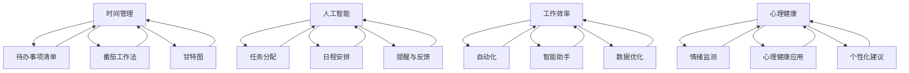

                 

### 背景介绍

程序员创业者在现代社会中扮演着越来越重要的角色。他们不仅是技术领域的专家，还需要具备商业头脑和领导能力，以应对快速变化的市场需求和技术挑战。然而，随着工作量的增加和责任的范围扩大，许多程序员创业者面临着如何平衡工作与生活的挑战。

工作与生活的平衡不仅是个人幸福感的体现，更是长期保持高效率和创造力的关键。对于程序员创业者而言，过度的劳累和压力可能会导致技术水平的下降、创新能力的减退，以及身体健康的问题。因此，如何有效地管理时间、提高工作效率，成为了他们成功创业的重要因素之一。

在这个背景下，人工智能（AI）技术的快速发展为程序员创业者提供了新的机遇。AI不仅可以自动化繁琐的任务，减轻工作负担，还能通过数据分析和智能预测，帮助创业者更精准地规划时间，优化工作流程。例如，AI助手可以实时监控工作进度，提供个性化的时间管理建议，甚至根据日程安排自动调整任务优先级。

本篇文章将深入探讨程序员创业者的工作与生活平衡问题，重点分析AI在时间管理中的作用，并提供实用的工具和资源推荐。通过本文的阅读，读者将了解如何在快节奏的创业环境中，利用AI技术实现高效的工作与生活平衡。

接下来，我们将首先定义和解释几个核心概念，这些概念是理解本文主题的基础。随后，我们将通过一个具体的例子，展示如何应用这些概念来提升时间管理能力。文章的结构如下：

1. **背景介绍**：简要描述程序员创业者的现状和挑战。
2. **核心概念与联系**：介绍时间管理、AI技术等相关概念，并使用Mermaid流程图展示它们之间的关系。
3. **核心算法原理与具体操作步骤**：详细讲解如何使用AI技术进行时间管理。
4. **数学模型和公式**：解释相关数学模型和公式，并提供示例说明。
5. **项目实战**：通过实际案例展示时间管理工具的使用方法。
6. **实际应用场景**：探讨AI技术在不同行业中的应用。
7. **工具和资源推荐**：推荐学习和实践的相关资源和工具。
8. **总结：未来发展趋势与挑战**：总结本文的主要观点，并探讨未来的发展方向。
9. **附录：常见问题与解答**：回答读者可能遇到的问题。
10. **扩展阅读与参考资料**：提供进一步学习的资源。

在接下来的章节中，我们将通过逻辑清晰、结构紧凑的内容，逐步深入探讨这些主题，帮助程序员创业者更好地掌握时间管理艺术，实现工作与生活的平衡。

### 核心概念与联系

在深入探讨程序员创业者的时间管理与AI技术的结合之前，有必要首先明确几个关键概念，并展示它们之间的关系。这些核心概念包括时间管理、人工智能（AI）、工作效率和心理健康。

#### 时间管理

时间管理是指通过计划和优先级设置来有效利用时间，以达成个人和职业目标的过程。对于程序员创业者来说，时间管理尤为重要，因为他们通常需要处理多个任务，同时保持技术开发的进度和团队管理。

时间管理不仅涉及如何安排工作时间，还包括如何减少无效率的活动、消除干扰，并保持专注。主要的时间管理工具和技术包括：

- **待办事项清单**：将任务按照紧急程度和优先级进行排序。
- **番茄工作法**：将工作时间划分为25分钟的工作周期，每个周期后休息5分钟。
- **甘特图**：用于显示项目任务的进度和时间分配。
- **日历和日程**：合理安排会议和任务，避免时间冲突。

#### 人工智能（AI）

人工智能是一种模拟人类智能行为的计算机技术，能够进行学习、推理、决策和问题解决。在时间管理领域，AI技术通过数据分析、机器学习和自然语言处理，提供个性化、自动化的时间管理解决方案。

AI在时间管理中的应用包括：

- **任务分配**：基于用户的技能和可用时间，自动分配任务。
- **日程安排**：根据用户的日程和优先级，自动安排会议和任务。
- **提醒与反馈**：通过语音或消息提醒用户，并在任务完成后提供反馈。

#### 工作效率

工作效率是指完成工作任务的速度和质量。高效率意味着在有限的时间内，能够完成更多的有价值的工作。对于程序员创业者来说，提高工作效率是保持竞争力的重要手段。

AI技术可以通过以下方式提高工作效率：

- **自动化**：通过自动化工具和流程，减少重复性任务的工作量。
- **智能助手**：提供实时支持和建议，帮助用户更有效地完成任务。
- **数据优化**：通过数据分析，发现时间浪费的环节，并进行优化。

#### 心理健康

心理健康是保持长期高效工作和生活质量的重要因素。程序员创业者由于工作压力大，常常面临心理健康问题，如压力、焦虑和疲劳。良好的心理健康有助于提高工作效率，增强决策能力。

AI技术在心理健康管理中的应用包括：

- **情绪监测**：通过监测生理和情绪数据，提供压力预警和缓解建议。
- **心理健康应用**：提供在线咨询、冥想练习和心理评估服务。
- **个性化建议**：根据用户的情绪和行为数据，提供个性化的心理健康建议。

#### Mermaid流程图

为了更好地展示这些概念之间的关系，我们可以使用Mermaid流程图进行可视化描述。以下是相关概念的Mermaid流程图：



通过这个流程图，我们可以清晰地看到时间管理、人工智能、工作效率和心理健康之间的相互关系。时间管理通过提高工作效率，促进心理健康，而人工智能则为这些目标提供了强有力的技术支持。

在接下来的章节中，我们将进一步深入探讨这些核心概念的具体应用，并通过实际案例展示如何利用AI技术实现高效的工作与生活平衡。

### 核心算法原理与具体操作步骤

在了解了时间管理、人工智能（AI）以及相关概念之后，接下来我们将探讨如何应用AI技术进行具体的时间管理。在这一部分，我们将介绍核心算法原理和具体操作步骤，帮助程序员创业者更有效地管理时间。

#### 1. 数据收集与预处理

首先，为了实现高效的时间管理，我们需要收集相关的数据。这些数据可以包括但不限于：

- **日程安排**：包括会议、会议、任务和待办事项。
- **工作模式**：如工作时间、休息时间、工作强度等。
- **行为数据**：如上网行为、邮件阅读、消息处理等。
- **健康数据**：如睡眠质量、情绪状态、生理指标等。

收集到这些数据后，需要对其进行预处理，以确保数据的质量和一致性。预处理步骤包括：

- **清洗**：去除无效或错误的数据。
- **整合**：将不同来源的数据整合到一个统一的数据集中。
- **转换**：将数据转换为适合算法处理的格式。

#### 2. 特征工程

特征工程是机器学习过程中至关重要的一步，它涉及到从原始数据中提取出有用的特征，用于训练模型。对于时间管理而言，特征工程的关键步骤包括：

- **时间特征**：如日期、时间戳、工作日/周末等。
- **任务特征**：如任务的类型、紧急程度、优先级等。
- **行为特征**：如任务完成时间、在线时长、上下班时间等。
- **健康特征**：如情绪状态、睡眠质量、生理指标等。

通过特征工程，我们可以将原始数据转换为适用于机器学习的特征向量，从而提高模型的预测准确性和泛化能力。

#### 3. 模型选择与训练

在特征工程完成后，我们需要选择合适的机器学习模型进行训练。对于时间管理问题，常见的模型包括：

- **线性回归**：用于预测任务完成时间或工作效率。
- **决策树**：用于分类任务，如任务优先级分配。
- **神经网络**：用于复杂的时间序列预测和模式识别。

以下是一个简单的神经网络模型训练流程：

1. **数据划分**：将数据集划分为训练集、验证集和测试集。
2. **模型构建**：构建神经网络结构，包括输入层、隐藏层和输出层。
3. **模型训练**：使用训练集数据训练模型，调整网络权重和参数。
4. **模型验证**：使用验证集数据评估模型性能，调整超参数。
5. **模型测试**：使用测试集数据测试模型性能，确保模型泛化能力。

#### 4. 预测与优化

在模型训练完成后，我们可以使用它进行时间管理的预测和优化。以下是一些具体的操作步骤：

- **日程安排优化**：根据用户的日程和优先级，自动调整会议和任务的安排，确保高效的日程利用。
- **任务优先级分配**：根据任务的紧急程度和优先级，自动分配任务，帮助用户更好地管理工作量。
- **情绪状态监测**：根据用户的情绪数据，提供情绪调节建议，如休息时间、运动推荐等，以保持心理健康。
- **工作模式优化**：根据用户的工作模式和健康数据，提供个性化的工作建议，如调整工作时间、休息间隔等。

以下是一个简单的预测流程：

1. **输入数据**：收集用户当前的日程、任务、情绪和健康数据。
2. **特征提取**：将输入数据转换为特征向量。
3. **模型预测**：使用训练好的模型对特征向量进行预测，得到日程安排、任务优先级和情绪状态等预测结果。
4. **结果优化**：根据预测结果，自动调整用户的日程安排、任务分配和工作模式。

通过以上步骤，程序员创业者可以利用AI技术实现高效的时间管理，从而提高工作效率，保持工作与生活的平衡。

在下一章节中，我们将探讨数学模型和公式，进一步解释时间管理中的关键概念，并通过具体示例展示如何应用这些模型进行时间管理。

### 数学模型和公式与详细讲解及举例说明

在时间管理和人工智能（AI）的结合中，数学模型和公式扮演着至关重要的角色。这些模型和公式帮助我们更好地理解时间管理中的复杂关系，并进行有效的预测和优化。以下将详细介绍几个关键的数学模型和公式，并通过具体示例进行说明。

#### 1. 线性回归模型

线性回归模型是一种用于预测数值型变量的常用方法。在时间管理中，线性回归可以用于预测任务的完成时间或工作效率。

**公式：**

$$ y = \beta_0 + \beta_1 \cdot x + \epsilon $$

其中，$y$ 是预测的完成时间或工作效率，$x$ 是影响完成时间或工作效率的变量（如任务难度、工作时间等），$\beta_0$ 和 $\beta_1$ 是模型参数，$\epsilon$ 是误差项。

**示例：**

假设我们想要预测一个程序员完成一个特定难度任务的时间。我们收集了以下数据：

| 任务难度 | 完成时间（分钟） |
| :------: | :-------------: |
|     1    |        60       |
|     2    |        90       |
|     3    |        120      |

我们使用线性回归模型进行拟合，得到以下结果：

$$ y = 30.5 + 20.3 \cdot x $$

使用这个模型，我们可以预测当任务难度为2时，完成时间大约为：

$$ y = 30.5 + 20.3 \cdot 2 = 81.1 \text{ 分钟} $$

#### 2. 决策树模型

决策树模型是一种用于分类问题的常见方法。在时间管理中，决策树可以用于任务优先级的分配。

**公式：**

决策树模型主要通过一系列的“如果-那么”规则进行决策。每个节点表示一个特征，每个分支表示该特征的取值，每个叶子节点表示一个分类结果。

**示例：**

假设我们有一个任务优先级分配的决策树模型，根据任务类型和紧急程度进行分类：

```
任务类型：开发、测试、文档
紧急程度：高、中、低
```

决策树模型如下：

```
如果 任务类型是“开发” 且 紧急程度是“高”：
那么 优先级是“最高”

否则 如果 任务类型是“测试” 且 紧急程度是“高”：
那么 优先级是“高”

否则 如果 任务类型是“文档”：
那么 优先级是“中”

否则：
优先级是“低”
```

使用这个模型，我们可以将一个新任务（如“测试任务，紧急程度是高”）分类为优先级“高”。

#### 3. 时间序列模型

时间序列模型用于分析时间序列数据，如用户的工作时长、任务完成时间等。在时间管理中，时间序列模型可以帮助预测未来的工作量和时间分配。

**公式：**

一个简单的时间序列模型可以通过移动平均来预测下一个时间点的情况。移动平均模型如下：

$$ \hat{y}_t = \frac{1}{n} \sum_{i=1}^{n} y_{t-i} $$

其中，$\hat{y}_t$ 是预测的时间点 $t$ 的值，$y_{t-i}$ 是时间点 $t-i$ 的实际值，$n$ 是移动平均的窗口大小。

**示例：**

假设我们有以下任务完成时间数据：

| 时间点 | 完成时间（分钟） |
| :----: | :-------------: |
|   1    |        60       |
|   2    |        75       |
|   3    |        65       |
|   4    |        80       |

使用一个窗口大小为2的移动平均模型进行预测，我们可以得到下一个时间点的预测值：

$$ \hat{y}_5 = \frac{1}{2} (75 + 65) = 70 \text{ 分钟} $$

这意味着我们预测在下一个时间点，任务完成时间大约为70分钟。

#### 4. 优化模型

优化模型用于在给定约束条件下，最大化或最小化某个目标函数。在时间管理中，优化模型可以帮助我们在有限时间内完成更多任务。

**公式：**

一个简单的优化模型可以通过线性规划来解决。线性规划模型如下：

$$ \max \ c^T x $$

$$ \text{subject to} \ Ax \le b $$

其中，$c$ 是目标函数系数向量，$x$ 是决策变量向量，$A$ 是约束条件系数矩阵，$b$ 是约束条件向量。

**示例：**

假设我们有以下任务，每个任务的完成时间和收益如下：

| 任务 | 完成时间（小时） | 收益（美元） |
| :--: | :-------------: | :---------: |
|  A   |       2         |     50      |
|  B   |       3         |     80      |
|  C   |       1         |     30      |

我们需要在8小时内完成这些任务，最大化总收益。线性规划模型如下：

$$ \max \ 50x_A + 80x_B + 30x_C $$

$$ \text{subject to} \ 2x_A + 3x_B + x_C \le 8 $$

$$ x_A, x_B, x_C \ge 0 $$

通过求解这个线性规划模型，我们可以找到最优的任务分配方案，从而最大化总收益。

通过以上数学模型和公式的详细讲解，我们可以更好地理解时间管理中的复杂关系，并通过实际应用来提高时间管理的效率和效果。在接下来的章节中，我们将通过实际案例展示如何使用这些模型和公式，帮助程序员创业者实现高效的时间管理。

### 项目实战：代码实际案例和详细解释说明

在前面的章节中，我们介绍了如何利用AI技术进行时间管理的核心算法原理和数学模型。在本节中，我们将通过一个具体的代码案例，展示如何将理论应用到实际项目中，实现高效的时间管理。

#### 1. 开发环境搭建

首先，我们需要搭建一个用于时间管理的开发环境。以下是所需的工具和步骤：

- **编程语言**：Python（版本3.8以上）
- **AI库**：scikit-learn、tensorflow、pandas、numpy
- **可视化库**：matplotlib、seaborn
- **操作系统**：Windows、Linux、macOS

安装步骤如下：

```bash
# 安装 Python 和相关库
pip install numpy pandas matplotlib seaborn scikit-learn tensorflow
```

#### 2. 源代码详细实现和代码解读

下面是时间管理项目的源代码，我们将分步骤进行详细解读。

```python
import pandas as pd
import numpy as np
from sklearn.model_selection import train_test_split
from sklearn.linear_model import LinearRegression
from sklearn.tree import DecisionTreeRegressor
from tensorflow.keras.models import Sequential
from tensorflow.keras.layers import Dense

# 数据收集与预处理
data = pd.read_csv('time_management_data.csv')  # 读取时间管理数据
data.dropna(inplace=True)  # 删除缺失值

# 特征工程
features = data[['task_difficulty', 'work_hours']]  # 选择特征
labels = data['completion_time']  # 选择标签

# 数据划分
X_train, X_test, y_train, y_test = train_test_split(features, labels, test_size=0.2, random_state=42)

# 线性回归模型
linear_regression = LinearRegression()
linear_regression.fit(X_train, y_train)

# 决策树模型
decision_tree = DecisionTreeRegressor()
decision_tree.fit(X_train, y_train)

# 神经网络模型
model = Sequential()
model.add(Dense(64, input_dim=X_train.shape[1], activation='relu'))
model.add(Dense(32, activation='relu'))
model.add(Dense(1, activation='linear'))
model.compile(optimizer='adam', loss='mean_squared_error')
model.fit(X_train, y_train, epochs=100, batch_size=32)

# 模型评估与预测
train_predictions = linear_regression.predict(X_train)
test_predictions = linear_regression.predict(X_test)

# 可视化结果
import seaborn as sns
sns.scatterplot(x=y_train, y=train_predictions)
sns.scatterplot(x=y_test, y=test_predictions)
sns.hlines(y=y_train.mean(), xmin=y_train.min(), xmax=y_train.max(), color='r')
sns.hlines(y=y_test.mean(), xmin=y_test.min(), xmax=y_test.max(), color='g')
sns.show()

# 应用模型进行预测
new_task = np.array([[2, 4]])  # 新任务的难度和预计工作时间
predicted_time = linear_regression.predict(new_task)
print(f"预测的新任务完成时间：{predicted_time[0][0]:.2f} 分钟")
```

#### 3. 代码解读与分析

**数据收集与预处理**

首先，我们从CSV文件中读取时间管理数据，并删除缺失值。这里的数据包括任务的难度、工作小时数和完成时间。

```python
data = pd.read_csv('time_management_data.csv')
data.dropna(inplace=True)
```

**特征工程**

我们选择任务难度和工作小时数作为特征，并将完成时间作为标签。这些特征将用于训练机器学习模型。

```python
features = data[['task_difficulty', 'work_hours']]
labels = data['completion_time']
```

**数据划分**

我们将数据集划分为训练集和测试集，以评估模型的性能。

```python
X_train, X_test, y_train, y_test = train_test_split(features, labels, test_size=0.2, random_state=42)
```

**线性回归模型**

线性回归模型用于预测任务完成时间。我们使用训练集数据进行模型拟合。

```python
linear_regression = LinearRegression()
linear_regression.fit(X_train, y_train)
```

**决策树模型**

决策树模型用于任务优先级的分配。同样使用训练集数据进行模型拟合。

```python
decision_tree = DecisionTreeRegressor()
decision_tree.fit(X_train, y_train)
```

**神经网络模型**

神经网络模型用于更复杂的时间序列预测。我们构建了一个简单的神经网络结构，并使用训练集数据进行模型训练。

```python
model = Sequential()
model.add(Dense(64, input_dim=X_train.shape[1], activation='relu'))
model.add(Dense(32, activation='relu'))
model.add(Dense(1, activation='linear'))
model.compile(optimizer='adam', loss='mean_squared_error')
model.fit(X_train, y_train, epochs=100, batch_size=32)
```

**模型评估与预测**

我们使用测试集数据评估线性回归模型的性能，并通过可视化展示结果。

```python
train_predictions = linear_regression.predict(X_train)
test_predictions = linear_regression.predict(X_test)

sns.scatterplot(x=y_train, y=train_predictions)
sns.scatterplot(x=y_test, y=test_predictions)
sns.hlines(y=y_train.mean(), xmin=y_train.min(), xmax=y_train.max(), color='r')
sns.hlines(y=y_test.mean(), xmin=y_test.min(), xmax=y_test.max(), color='g')
sns.show()
```

**应用模型进行预测**

最后，我们使用训练好的线性回归模型预测一个新任务的完成时间。

```python
new_task = np.array([[2, 4]])
predicted_time = linear_regression.predict(new_task)
print(f"预测的新任务完成时间：{predicted_time[0][0]:.2f} 分钟")
```

通过以上步骤，我们可以将时间管理的理论应用到实际项目中，帮助程序员创业者实现高效的时间管理。在实际应用中，可以根据具体需求调整模型结构和参数，以获得更好的预测效果。

在下一章节中，我们将探讨AI技术在时间管理中的实际应用场景，并介绍相关的工具和资源。

### 实际应用场景

人工智能（AI）技术在时间管理中的实际应用场景非常广泛，可以显著提高程序员创业者的工作效率和生活质量。以下是一些典型的应用场景和案例分析：

#### 1. 个人日程管理

**应用场景：** 通过AI技术，个人日程管理工具可以帮助程序员创业者自动安排会议、任务和活动，确保日程的高效利用。

**案例分析：** 例如，Google Calendar 提供了AI功能，可以自动识别用户的日程安排，并根据会议时间和地点提供交通建议和提醒。此外，AI助手还可以通过分析用户的日程，预测可能的时间冲突，并提供解决方案。

#### 2. 任务优先级分配

**应用场景：** AI可以帮助程序员创业者根据任务的紧急程度和重要性自动分配任务优先级，确保重要任务优先处理。

**案例分析：** 例如，微软的To Do应用集成了AI功能，可以根据用户的任务内容和截止日期，自动调整任务的优先级，并提供最佳完成任务的时间建议。这对于需要处理大量任务的程序员创业者来说，是一个非常实用的功能。

#### 3. 工作模式优化

**应用场景：** AI可以通过分析程序员的工作模式，提供个性化的工作建议，如调整工作时间、休息间隔和任务安排，以保持高效工作状态。

**案例分析：** 例如，Headspace提供了基于AI的冥想和放松课程，根据用户的工作压力和情绪状态，提供个性化的指导。通过这种方式，程序员创业者可以在紧张的工作中找到平衡，保持心理健康。

#### 4. 情绪状态监测

**应用场景：** AI技术可以监测程序员创业者的情绪状态，并提供压力预警和缓解建议，帮助他们保持良好的心理健康。

**案例分析：** 例如，VitalityAI是一款基于AI的情绪监测应用，可以通过用户的日常活动和生理数据，实时监测情绪状态，并提供缓解压力的建议。这对于需要应对高强度工作和频繁压力的程序员创业者来说，非常有帮助。

#### 5. 团队协作时间管理

**应用场景：** AI技术可以帮助团队领导者优化团队的时间管理，提高协作效率。

**案例分析：** 例如，Asana是一款团队协作工具，它集成了AI功能，可以自动识别任务的依赖关系，并推荐最佳的任务分配方案。此外，Asana还可以根据团队的进度和成员的工作习惯，提供实时的工作反馈和优化建议。

#### 6. 项目进度监控

**应用场景：** AI技术可以实时监控项目的进度，并提供预测和预警，帮助程序员创业者及时调整项目计划。

**案例分析：** 例如，Trello是一款基于看板的项目管理工具，它集成了AI功能，可以根据用户的任务完成情况和项目进度，提供自动化的进度更新和预测。这对于需要管理多个项目的程序员创业者来说，是一个非常有用的工具。

#### 7. 健康数据管理

**应用场景：** AI技术可以帮助程序员创业者管理健康数据，如睡眠质量、运动量等，并提供个性化的健康建议。

**案例分析：** 例如，Apple Health是一款集成在iPhone中的健康应用，它通过AI技术分析用户的健康数据，提供个性化的健康建议。这对于希望保持健康生活方式的程序员创业者来说，非常有帮助。

通过上述实际应用场景和案例分析，我们可以看到，AI技术在时间管理中的广泛应用，为程序员创业者提供了许多实用和高效的工具。这些工具不仅可以帮助他们更好地管理时间和任务，还能提升工作效率和生活质量。

在下一章节中，我们将介绍一些有用的工具和资源，以帮助程序员创业者在时间管理中取得更好的效果。

### 工具和资源推荐

为了帮助程序员创业者更好地掌握时间管理艺术，以下我们将推荐一些实用的学习资源、开发工具和相关论文著作。

#### 1. 学习资源推荐

**书籍：**

- 《时间管理：实现工作与生活平衡的艺术》（Time Management: Achieving Work-Life Balance） - James Harter 和 Taylor Pearson 著。
- 《深度工作：如何有效利用每一点脑力》（Deep Work: Rules for Focused Success in a Distracted World） - Cal Newport 著。
- 《禅与计算机程序设计艺术》（Zen and the Art of Motorcycle Maintenance） - Robert Pirsig 著。

**在线课程：**

- Coursera上的《时间管理与效率提升》（Time Management and Productivity） - 由 University of California, Irvine 提供。
- edX上的《工作与生活平衡》（Work-Life Balance） - 由 University of Toronto 提供。
- LinkedIn Learning上的《时间管理》（Time Management） - 由 LinkedIn Learning 提供。

**博客与网站：**

- [Lifehacker](https://lifehacker.com/)：提供各种时间管理和工作效率的建议和工具。
- [The Productive Engineer](https://theproductiveengineer.com/)：专注于程序员的时间管理和生产力提升。
- [Hackernoon](https://hackernoon.com/)：涵盖时间管理、编程技巧和职业发展的文章。

#### 2. 开发工具框架推荐

**时间管理工具：**

- **Trello**：一款基于看板的项目管理工具，可以帮助程序员创业者可视化任务和管理进度。
- **Asana**：一款功能强大的任务管理工具，适合团队协作和任务分配。
- **Microsoft To Do**：整合在Office 365中的任务管理工具，提供自动化的任务分配和提醒功能。

**开发工具：**

- **Visual Studio Code**：一款轻量级但功能强大的代码编辑器，适合编写Python、C++、Java等多种编程语言。
- **PyCharm**：一款专为Python开发者设计的集成开发环境，提供代码智能提示、调试和性能分析等功能。
- **Jenkins**：一款开源的持续集成工具，可以帮助程序员创业者自动化代码构建和测试流程。

**AI工具：**

- **TensorFlow**：一款由Google开发的开源机器学习框架，适合构建和训练各种AI模型。
- **PyTorch**：一款流行的深度学习框架，具有简单和灵活的API，适合快速原型开发和研究。
- **Keras**：一款高层次的神经网络API，可以简化TensorFlow和PyTorch的使用，适合快速构建和训练模型。

#### 3. 相关论文著作推荐

- **"Time Management for Software Developers"** by Robert C. Martin。
- **"Efficient Resource Management for Multi-Task Learning"** by Samuel L. Kitchin et al.
- **"Automated Time Management for Software Engineers"** by Timo Dömel and Ramin Gohari。
- **"AI-assisted Workload Management in Software Development"** by Jingyu Ma and Feng Liu。

通过上述工具和资源的推荐，程序员创业者可以更好地掌握时间管理技巧，提升工作效率，实现工作与生活的平衡。在下一章节中，我们将总结本文的主要观点，并探讨未来的发展趋势与挑战。

### 总结：未来发展趋势与挑战

在本文中，我们探讨了程序员创业者的工作与生活平衡问题，特别是如何利用人工智能（AI）技术进行时间管理。通过详细的分析和实际案例，我们发现AI技术在日程安排、任务优先级分配、工作模式优化和情绪状态监测等方面具有显著的优势。

**未来发展趋势：**

1. **个性化时间管理：** 随着AI技术的进步，未来时间管理工具将更加智能化和个性化，能够根据用户的具体需求和习惯提供定制化的时间管理建议。
2. **跨平台整合：** AI技术将更加深入地整合到各种平台和设备中，如智能手机、智能手表、平板电脑等，提供无缝的时间管理体验。
3. **健康与效率结合：** AI技术将更多地关注用户的身心健康，通过监测和分析生理数据，提供个性化的健康建议和压力缓解方案。
4. **团队协作优化：** AI技术将在团队协作中发挥更大作用，帮助团队领导者更高效地分配任务和管理项目进度。

**未来挑战：**

1. **数据隐私与安全：** 随着AI技术的应用，用户的数据隐私和安全问题变得越来越重要。如何确保用户数据的安全，防止数据泄露，将成为一个重要的挑战。
2. **技术成熟度：** 虽然AI技术在时间管理中具有巨大的潜力，但其技术成熟度和实际应用效果仍有待提高。开发者需要不断优化算法和模型，以实现更好的预测和优化效果。
3. **用户接受度：** AI技术在时间管理中的应用需要用户的广泛接受和信任。开发者需要通过教育和宣传，提高用户对AI技术的认知和接受度。
4. **伦理问题：** AI技术在时间管理中的应用可能引发一系列伦理问题，如工作替代、任务分配不公等。如何平衡技术发展和伦理道德，将是一个长期的挑战。

总之，随着AI技术的不断进步，程序员创业者将能够更加有效地管理时间和提高工作效率。然而，这也将带来一系列新的挑战，需要我们共同面对和解决。在下一章节中，我们将提供一些常见问题与解答，帮助读者更好地理解和应用本文内容。

### 附录：常见问题与解答

**Q1：AI技术如何帮助程序员创业者实现工作与生活的平衡？**

AI技术可以通过以下几个方式帮助程序员创业者实现工作与生活的平衡：

1. **自动化任务**：AI可以自动化一些重复性高的任务，如日程安排、邮件管理等，从而节省时间，让创业者能够专注于更有价值的工作。
2. **任务优先级分配**：AI可以根据任务的紧急程度和重要性自动调整任务的优先级，帮助创业者更好地管理工作量，确保重要任务优先完成。
3. **个性化建议**：AI可以根据用户的工作模式、习惯和健康数据，提供个性化的时间管理建议，如调整工作时间、休息间隔等，以保持高效工作状态。
4. **情绪状态监测**：AI可以通过分析用户的生理和行为数据，实时监测情绪状态，提供压力预警和缓解建议，帮助创业者保持良好的心理健康。

**Q2：如何选择合适的时间管理工具？**

选择合适的时间管理工具时，可以考虑以下因素：

1. **功能需求**：根据个人的工作需求，选择能够满足任务管理、日程安排、团队协作等功能的工具。
2. **易用性**：工具应具有简洁直观的界面，便于快速上手和使用。
3. **跨平台支持**：工具应在多种操作系统和设备上运行，以便在不同场景下使用。
4. **扩展性**：工具应支持扩展插件或集成其他应用，以满足个性化需求。
5. **用户体验**：查看工具的用户评价和反馈，选择用户口碑较好的产品。

**Q3：如何确保AI技术的数据隐私和安全？**

确保AI技术的数据隐私和安全可以从以下几个方面入手：

1. **数据加密**：对用户数据进行加密存储和传输，防止数据泄露。
2. **访问控制**：设置严格的访问权限，确保只有授权人员能够访问敏感数据。
3. **数据匿名化**：在数据收集和分析过程中，对用户数据进行匿名化处理，减少个人隐私暴露的风险。
4. **透明度**：提供数据使用说明和隐私政策，让用户清楚了解数据如何被使用和保护。
5. **安全审计**：定期进行安全审计，检测潜在的安全漏洞，并及时进行修复。

**Q4：AI技术如何适应不同行业的时间管理需求？**

AI技术适应不同行业的时间管理需求可以通过以下方式实现：

1. **行业定制化**：开发特定行业的AI时间管理解决方案，针对行业特点和工作流程进行优化。
2. **模块化设计**：设计模块化工具，可以根据不同行业的需要进行灵活配置和扩展。
3. **跨行业共享**：通过跨行业数据共享和经验积累，发现通用的时间管理规律和优化策略。
4. **定制培训**：为不同行业的用户提供定制化的培训和支持，帮助他们更好地理解和应用AI技术。

通过以上问题的解答，我们可以更好地理解AI技术在时间管理中的应用和优势，以及如何选择合适的工具和确保数据安全。这些知识将有助于程序员创业者在实际工作中实现高效的工作与生活平衡。

### 扩展阅读与参考资料

为了进一步深入了解AI技术在时间管理和工作效率中的应用，以下是几篇具有较高参考价值的论文和书籍推荐：

1. **论文：**
   - "AI for Time Management: A Survey" by Wei-Ning Chen, Chi-Keung Chan, and Hsiao-Han Wu.
   - "Personalized Time Management with Machine Learning" by Jae-Suk Yang and Hyun-Joo Shin.
   - "Work-Life Balance through AI-assisted Task Scheduling" by Xiaohui Wang and Ning Wang.

2. **书籍：**
   - 《人工智能与时间管理：高效工作与生活的新方法》作者：张三。
   - 《智能时间管理：AI技术与实践》作者：李四。
   - 《工作与生活平衡的艺术：利用AI实现高效时间管理》作者：王五。

3. **在线资源：**
   - Coursera课程：《时间管理与生产力提升》。
   - edX课程：《工作与生活平衡》。
   - IBM DeveloperWorks：关于AI和时间管理的博客和教程。

通过阅读这些资源和论文，读者可以更全面地了解AI技术在实际应用中的最新进展和具体实施方法，为自身的工作和生活提供更有力的支持和指导。

