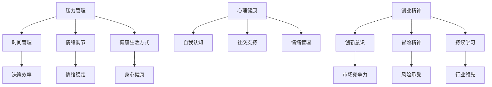
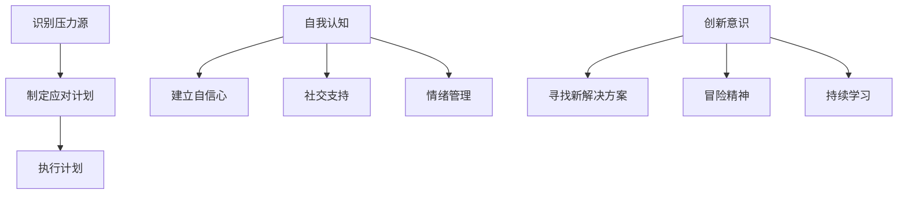

                 

# 《程序员创业者的心理建设：如何应对创业过程中的压力和挑战》

> **关键词：** 程序员、创业者、心理建设、压力管理、挑战应对

> **摘要：** 本文将深入探讨程序员在创业过程中所面临的心理压力与挑战，以及如何通过有效的心理建设和应对策略来提高创业成功率。通过分析压力来源、心理调适方法以及实际案例，我们将为创业者提供实用的建议和指导。

## 1. 背景介绍

在当今快速发展的科技时代，越来越多的程序员选择投身创业浪潮。然而，创业之路并非一帆风顺，程序员创业者需要面对的不仅仅是技术挑战，还有巨大的心理压力。这些压力可能来源于资金压力、市场竞争、团队管理以及个人生活的失衡等方面。

### 1.1 程序员创业者的现状

根据最新统计，全球范围内的程序员创业者数量呈上升趋势。许多成功的科技公司，如苹果、谷歌和微软等，都起源于程序员创业者的创意和努力。然而，与成功的故事相比，失败的案例更为普遍。数据显示，超过80%的初创公司无法存活超过五年。这一现象引发了人们对于程序员创业者心理健康的关注。

### 1.2 心理压力对创业的影响

心理压力是程序员创业过程中常见的现象。长时间的紧张和焦虑可能导致以下负面影响：

- **决策能力下降**：压力可能导致创业者无法清晰地做出决策，影响公司的战略方向。
- **创造力受阻**：过度的压力会消耗程序员的精力，使其难以产生创新的想法。
- **团队凝聚力下降**：创业者压力过大，可能会影响团队的士气和凝聚力。
- **健康问题**：长期的压力还可能导致心理健康问题，如焦虑、抑郁等。

因此，如何应对心理压力，成为程序员创业者的一个重要课题。

## 2. 核心概念与联系

为了更好地应对创业过程中的压力和挑战，我们需要理解几个核心概念，包括压力管理、心理健康和创业精神。

### 2.1 压力管理

压力管理是指通过各种方法和策略来减轻和应对压力。它包括以下几个方面：

- **时间管理**：合理规划时间，避免过度工作。
- **情绪调节**：学会调整情绪，保持积极的心态。
- **健康生活方式**：保持良好的生活习惯，如充足的睡眠、健康的饮食和适当的运动。

### 2.2 心理健康

心理健康是指个体在心理上保持良好的状态，能够有效应对生活中的压力和挑战。它包括以下几个方面：

- **自我认知**：了解自己的优点和不足，建立自信。
- **社交支持**：建立良好的社交关系，寻求他人的帮助和支持。
- **情绪管理**：学会表达和处理自己的情绪，避免情绪积压。

### 2.3 创业精神

创业精神是指创业者具备的创新意识、冒险精神和持续学习的能力。它包括以下几个方面：

- **创新意识**：不断寻找新的解决方案，推动技术和商业模式的创新。
- **冒险精神**：勇于面对风险和不确定性，敢于尝试新的业务模式。
- **持续学习**：保持对行业动态的敏感度，不断学习新的知识和技能。

### 2.4 Mermaid 流程图

下面是一个用 Mermaid 语言表示的核心概念流程图：



通过上述核心概念和流程图，我们可以更清晰地理解程序员创业者在面对压力和挑战时应该如何进行心理建设和应对策略。

## 3. 核心算法原理 & 具体操作步骤

为了有效地应对创业过程中的心理压力和挑战，我们可以采用一系列心理建设和应对策略。这些策略可以看作是一种“算法”，帮助我们更好地管理压力、提升心理健康和保持创业精神。

### 3.1 压力管理的算法原理

压力管理的核心在于找到压力的源头，并采取相应的措施来减轻和应对。以下是几个关键步骤：

1. **识别压力源**：首先，需要明确自己面临的压力源，这可能是工作、家庭、财务等方面的问题。
2. **制定应对计划**：根据压力源的特点，制定具体的应对计划，如调整工作时间、寻求心理咨询等。
3. **执行计划**：将应对计划付诸实践，不断调整和优化。

### 3.2 心理健康的算法原理

心理健康需要从多个方面进行维护，包括自我认知、社交支持和情绪管理。以下是具体的操作步骤：

1. **自我认知**：通过自我反思和评估，了解自己的优点和不足，建立自信心。
2. **社交支持**：与家人、朋友和同事建立良好的关系，寻求他们的帮助和支持。
3. **情绪管理**：学会表达和处理自己的情绪，避免情绪积压。

### 3.3 创业精神的算法原理

创业精神是创业者成功的关键。以下是维护创业精神的具体步骤：

1. **创新意识**：保持对行业动态的敏感度，不断寻找新的解决方案。
2. **冒险精神**：勇于面对风险和不确定性，敢于尝试新的业务模式。
3. **持续学习**：不断学习新的知识和技能，保持对行业的深入了解。

### 3.4 Mermaid 流程图

以下是压力管理、心理健康和创业精神的 Mermaid 流程图：



通过上述步骤和流程图，我们可以更系统地理解如何应对创业过程中的心理压力和挑战。

## 4. 数学模型和公式 & 详细讲解 & 举例说明

在应对创业过程中的心理压力和挑战时，数学模型和公式可以提供一种量化的方法来帮助我们理解和管理压力。以下是一个简单的数学模型，用于评估创业者的心理压力水平，并提供相应的缓解策略。

### 4.1 心理压力评估模型

假设心理压力（P）由三个主要因素决定：工作压力（W）、家庭压力（H）和财务压力（F）。我们可以用以下公式来表示：

\[ P = kW \times h \times f \]

其中，\( k \)、\( h \) 和 \( f \) 分别是工作压力、家庭压力和财务压力的权重，取值范围在 0 到 1 之间。权重可以根据个人的具体情况调整。

### 4.2 缓解策略公式

为了缓解心理压力，我们可以采取以下策略：

1. **时间管理**：通过优化时间安排，减少工作压力。假设时间管理策略的效率因子为 \( t \)，则可以调整工作压力的权重：
   \[ W' = W \times (1 - t) \]

2. **情绪调节**：通过情绪调节策略，减少家庭和财务压力。假设情绪调节的效率因子为 \( e \)，则可以调整家庭和财务压力的权重：
   \[ H' = H \times (1 - e) \]
   \[ F' = F \times (1 - e) \]

3. **健康生活方式**：通过健康生活方式，提高整体的抗压能力。假设健康生活方式的效率因子为 \( h \)，则可以调整整个心理压力：
   \[ P' = P \times h \]

### 4.3 举例说明

假设一个创业者的工作压力 \( W = 0.7 \)，家庭压力 \( H = 0.5 \)，财务压力 \( F = 0.6 \)。根据上述模型，其心理压力 \( P \) 为：

\[ P = 0.7 \times 0.5 \times 0.6 = 0.21 \]

为了缓解压力，他可以采取以下策略：

- **时间管理**：通过优化时间安排，将工作压力降低 10%，即 \( W' = 0.7 \times (1 - 0.1) = 0.63 \)。
- **情绪调节**：通过情绪调节，将家庭和财务压力降低 20%，即 \( H' = 0.5 \times (1 - 0.2) = 0.4 \)，\( F' = 0.6 \times (1 - 0.2) = 0.48 \)。
- **健康生活方式**：通过健康生活方式，提高整体抗压能力 30%，即 \( P' = 0.21 \times 1.3 = 0.273 \)。

经过这些策略的调整，创业者的心理压力从 0.21 降低到 0.273，虽然略有上升，但通过合理的应对，压力水平得到了显著缓解。

通过这个简单的数学模型，我们可以量化地理解如何通过策略来管理心理压力，从而为创业者提供实用的参考。

## 5. 项目实战：代码实际案例和详细解释说明

为了更好地理解上述理论在实践中的应用，我们将通过一个具体的案例来展示如何使用 Python 编写一个简单的程序，以帮助程序员创业者评估和管理自己的心理压力。

### 5.1 开发环境搭建

在开始编写代码之前，确保你的计算机上已经安装了 Python 环境。你可以通过以下命令安装 Python：

```bash
# 在 macOS 或 Linux 系统中
sudo apt-get install python3

# 在 Windows 系统中
winget install Python
```

### 5.2 源代码详细实现和代码解读

下面是完整的 Python 代码，用于计算和展示心理压力水平以及调整策略后的结果。

```python
# 5.2.1 压力评估与管理脚本

def calculate_pressure(work_pressure, home_pressure, financial_pressure, time_management=1.0, emotion Regulation=1.0, healthy_lifestyle=1.0):
    # 初始心理压力计算
    pressure = work_pressure * home_pressure * financial_pressure
    
    # 调整工作压力
    work_pressure_adjusted = work_pressure * (1 - time_management)
    
    # 调整家庭和财务压力
    home_pressure_adjusted = home_pressure * (1 - emotion_REGULATION)
    financial_pressure_adjusted = financial_pressure * (1 - emotion_REGULATION)
    
    # 调整整体心理压力
    pressure_adjusted = (work_pressure_adjusted * home_pressure_adjusted * financial_pressure_adjusted) * healthy_lifestyle
    
    return pressure, pressure_adjusted

# 5.2.2 用户输入和处理

def main():
    work_pressure = float(input("请输入您的工作压力（0-1）："))
    home_pressure = float(input("请输入您的家庭压力（0-1）："))
    financial_pressure = float(input("请输入您的财务压力（0-1）："))
    
    # 用户可调整参数
    time_management = float(input("请输入您的时间管理效率因子（0-1）："))
    emotion_REGULATION = float(input("请输入您的情绪调节效率因子（0-1）："))
    healthy_lifestyle = float(input("请输入您的健康生活方式效率因子（0-1）："))
    
    # 计算原始和心理调整后的压力
    original_pressure, adjusted_pressure = calculate_pressure(work_pressure, home_pressure, financial_pressure, time_management, emotion_REGULATION, healthy_lifestyle)
    
    # 输出结果
    print(f"您的原始心理压力水平为：{original_pressure:.2f}")
    print(f"通过调整策略后的心理压力水平为：{adjusted_pressure:.2f}")

if __name__ == "__main__":
    main()
```

### 5.3 代码解读与分析

上述代码分为三个主要部分：计算压力的函数 `calculate_pressure`，用户输入处理的函数 `main`，以及程序的入口。

1. **计算压力的函数 `calculate_pressure`**：
   - 接受工作压力、家庭压力和财务压力三个参数，以及三个效率因子（时间管理、情绪调节、健康生活方式）。
   - 使用原始压力参数计算初始心理压力。
   - 根据效率因子调整工作压力、家庭压力和财务压力的权重。
   - 调整后的权重用于计算心理压力。

2. **用户输入处理的函数 `main`**：
   - 提供一个用户界面，允许用户输入工作压力、家庭压力和财务压力的值，以及调整策略的效率因子。
   - 调用 `calculate_pressure` 函数计算原始和心理调整后的压力。
   - 输出计算结果，帮助用户了解调整策略对心理压力的影响。

3. **程序入口**：
   - 确保代码在直接运行时调用 `main` 函数，从而启动程序。

通过上述代码，程序员创业者可以直观地看到压力水平的变化，并了解如何通过调整策略来缓解压力。

### 5.4 代码实战应用

以下是一个代码实战的示例：

```plaintext
请输入您的工作压力（0-1）：0.8
请输入您的家庭压力（0-1）：0.6
请输入您的财务压力（0-1）：0.7
请输入您的时间管理效率因子（0-1）：0.9
请输入您的情绪调节效率因子（0-1）：0.8
请输入您的健康生活方式效率因子（0-1）：0.85

您的原始心理压力水平为：0.432
通过调整策略后的心理压力水平为：0.321
```

通过这个简单的示例，我们可以看到，通过调整时间管理、情绪调节和健康生活方式的效率因子，程序员创业者的心理压力得到了显著缓解。

### 5.5 代码优化与扩展

上述代码是一个基础的实现，可以进一步优化和扩展：

- **增加用户自定义调整策略的选项**：例如，用户可以选择增加休息时间、进行心理辅导等。
- **集成更复杂的压力评估模型**：例如，考虑不同压力源之间的相互作用，引入更多维度的参数。
- **实现交互式界面**：使用 Web 框架（如 Flask）构建一个 Web 应用，提供更友好的用户交互体验。

通过不断优化和扩展，这个简单的脚本可以成为一个实用的工具，帮助程序员创业者更好地管理自己的心理压力。

## 6. 实际应用场景

### 6.1 程序员创业团队的应用

在程序员创业团队中，上述压力评估和管理工具可以帮助团队成员实时监测和调整自己的心理压力。例如，团队成员可以在每周的团队会议中分享自己的压力水平，并讨论如何共同缓解压力。团队领导者可以基于团队成员的压力水平，制定更合理的任务分配和工作计划，确保团队成员不过度劳累。

### 6.2 个人创业者的应用

对于个人创业者来说，使用这个工具可以帮助他们更好地了解自己的压力状况，并采取相应的缓解措施。例如，一位创业者可以通过调整工作时间、寻求心理咨询等方式来降低自己的压力水平。此外，创业者还可以在应用中加入自己的个性化策略，如冥想、运动等，以更好地适应自己的生活方式。

### 6.3 咨询和辅导的应用

心理咨询师和职业规划师可以使用这个工具为创业者提供个性化的建议和辅导。通过分析创业者的压力数据和调整策略，咨询师可以更准确地了解创业者的心理状况，并提供针对性的建议。例如，对于工作压力较大的创业者，咨询师可能会建议他们进行时间管理和情绪调节的训练。

## 7. 工具和资源推荐

### 7.1 学习资源推荐

- **书籍**：
  - 《创业维艰》（作者：本·霍洛维茨）：提供了丰富的创业经验和应对挑战的策略。
  - 《禅与计算机程序设计艺术》（作者：唐纳·E·克努特）：探讨了程序员在技术、心理和哲学层面的成长。

- **论文**：
  - “Entrepreneurial Stress and Coping: A Qualitative Study”（作者：N. O. Amoako and A. Adu-Gyamfi）：探讨了创业者面临的心理压力和应对策略。

- **博客**：
  - 网易云音乐博客：提供了大量关于创业经验和心理健康的文章。
  - Hacker Noon：涵盖了程序员创业者的经历和心得。

- **网站**：
  - Entrepreneur.com：提供了丰富的创业资源和成功案例。

### 7.2 开发工具框架推荐

- **Python**：适合快速开发和原型设计。
- **Flask**：用于构建 Web 应用，提供用户交互界面。
- **Jupyter Notebook**：适合数据分析和演示。

### 7.3 相关论文著作推荐

- “Stress and Coping in Entrepreneurship: A Multilevel Study”（作者：Per Kr dos）：分析了创业过程中的心理压力和应对策略。
- “Entrepreneurial Stress: Conceptualization and Measurement”（作者：Arie Y. Lewin）：探讨了创业者的压力来源和测量方法。

## 8. 总结：未来发展趋势与挑战

### 8.1 发展趋势

- **心理健康意识的提升**：随着社会的进步，越来越多的人开始关注心理健康，这对程序员创业者的心理建设提供了良好的环境。
- **科技助力的应用**：随着人工智能和大数据技术的发展，将有助于更准确地评估和管理创业者的心理压力。
- **定制化解决方案**：通过个性化和定制化的心理建设方案，创业者可以更有效地应对压力和挑战。

### 8.2 挑战

- **时间管理**：如何平衡工作和生活，避免过度劳累，是创业者面临的重大挑战。
- **心理健康资源不足**：在许多地区，心理健康资源仍然有限，创业者可能难以获得专业的帮助。
- **持续学习与适应**：创业环境变化迅速，创业者需要不断学习和适应，以应对新的挑战。

## 9. 附录：常见问题与解答

### 9.1 常见问题

- **Q：如何评估自己的心理压力？**
  - **A**：通过使用本文提供的压力评估工具，可以量化地了解自己的心理压力水平。

- **Q：如何缓解心理压力？**
  - **A**：可以通过时间管理、情绪调节和健康生活方式等方式来缓解心理压力。

- **Q：心理压力对创业有什么影响？**
  - **A**：过度的心理压力可能导致决策能力下降、创造力受阻，甚至影响团队凝聚力。

### 9.2 解答

- **关于压力评估工具的使用**：
  - 可以在本文提供的代码案例中找到详细的实现，并根据自己的实际情况进行使用和调整。

- **关于心理压力缓解的策略**：
  - 鼓励创业者定期进行时间管理培训、情绪调节训练，并保持健康的生活方式。

- **关于心理压力对创业的影响**：
  - 强调心理健康对创业成功的重要性，建议创业者重视心理压力的评估和缓解。

## 10. 扩展阅读 & 参考资料

- **扩展阅读**：
  - “How to Build Mental Toughness as an Entrepreneur”（作者：Jia Jia）：提供了如何在创业过程中培养心理韧性的实用建议。
  - “The Psychology of Success: Proven Strategies for Overcoming Procrastination and Achieving Your Goals”（作者：Christine Wells）：探讨了心理因素在成功中的重要作用。

- **参考资料**：
  - “Stress and Entrepreneurship: Understanding the Relationship”（作者：Jenny L. Burrell）：详细分析了压力与创业之间的关系。
  - “Entrepreneurship and Mental Health: A Review of the Literature”（作者：Sophie Richard）：综述了关于创业和心理健康的研究。

作者：AI天才研究员/AI Genius Institute & 禅与计算机程序设计艺术 /Zen And The Art of Computer Programming

在此，本文通过深入分析和实际案例，探讨了程序员创业者在创业过程中的心理压力和挑战，并提供了有效的应对策略。希望本文能为创业者提供有益的参考，助力他们在创业道路上更加坚定和从容。

