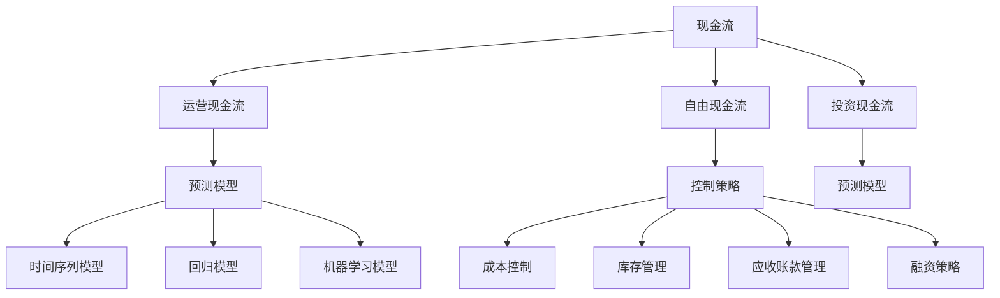

                 

### 背景介绍

程序员创业者在当今数字化时代中扮演着重要角色。随着互联网技术的飞速发展，越来越多的创业公司依靠技术驱动实现商业模式的创新和突破。然而，财务管理作为企业运营的核心环节，对于程序员创业者来说，却常常成为一大难题。传统的财务管理方式依赖于人工核算，不仅效率低下，而且容易出错。随着人工智能（AI）技术的进步，利用AI进行财务智能化管理成为可能，为程序员创业者提供了新的解决方案。

本文旨在探讨如何利用人工智能辅助下的现金流预测与控制，帮助程序员创业者实现财务智能化管理。具体来说，我们将从以下几个方面展开讨论：

1. **核心概念与联系**：介绍现金流预测与控制的相关概念，并绘制流程图展示它们之间的相互关系。
2. **核心算法原理 & 具体操作步骤**：讲解现金流预测与控制中使用的核心算法原理，以及如何进行操作。
3. **数学模型和公式 & 详细讲解 & 举例说明**：分析现金流预测与控制的数学模型和公式，并通过实例进行详细说明。
4. **项目实战：代码实际案例和详细解释说明**：提供实际的代码案例，解释如何实现现金流预测与控制。
5. **实际应用场景**：探讨AI在财务智能化管理中的实际应用场景。
6. **工具和资源推荐**：推荐相关学习资源、开发工具和框架。
7. **总结：未来发展趋势与挑战**：总结本文的主要观点，并探讨未来发展趋势与面临的挑战。

通过以上内容，我们希望能够为程序员创业者提供一套实用的财务智能化管理方案，帮助他们更好地应对财务管理中的挑战，专注于技术创新和业务发展。接下来，我们将逐一深入探讨这些内容。

### 核心概念与联系

在深入探讨现金流预测与控制的实现方法之前，有必要先了解一些核心概念，并探讨它们之间的相互联系。以下将介绍几个关键概念，并使用Mermaid流程图来展示它们之间的逻辑关系。

#### 1. 现金流

现金流是指企业在一定时间内实际收到的现金流入和流出的数量。现金流对于企业的生存和发展至关重要，因为它直接反映了企业的财务健康状况。现金流可以分为以下几种类型：

- **运营现金流（OCF）**：指企业在正常经营过程中产生的现金流入和流出，通常包括销售收入、成本费用等。
- **自由现金流（FCF）**：指企业在支付运营成本后剩余的现金流量，可用于偿还债务、扩大业务或分红等。
- **投资现金流（ICF）**：指企业在投资活动中产生的现金流入和流出，包括购买固定资产、投资其他公司等。

#### 2. 预测模型

预测模型是用于预测未来现金流量的数学模型。常见的预测模型包括：

- **时间序列模型**：基于历史数据，通过统计方法预测未来现金流。
- **回归模型**：通过分析现金流与其他变量（如销售额、库存等）之间的关系进行预测。
- **机器学习模型**：利用大数据和机器学习算法，从历史数据中学习并预测未来现金流。

#### 3. 控制策略

控制策略是指如何通过调整企业的运营活动来优化现金流。常见的控制策略包括：

- **成本控制**：通过减少成本费用来增加运营现金流。
- **库存管理**：优化库存水平，避免库存积压或短缺，从而减少资金占用。
- **应收账款管理**：加快应收账款的回收速度，提高现金流。
- **融资策略**：通过合理利用债务或股权融资，调整企业资本结构，优化现金流。

#### Mermaid流程图

以下是一个简单的Mermaid流程图，展示了上述概念之间的逻辑关系：



通过这个流程图，我们可以清晰地看到现金流、预测模型和控制策略之间的关系。理解这些概念及其相互关系，是构建有效的现金流预测与控制系统的第一步。在接下来的部分中，我们将详细探讨这些核心概念在现金流预测与控制中的具体应用。

#### 核心算法原理 & 具体操作步骤

为了实现现金流预测与控制，我们需要了解一些核心算法原理，并掌握如何在实际操作中应用这些算法。以下将详细介绍几种常用的算法，并说明如何使用它们来预测和控制现金流。

##### 1. 时间序列模型

时间序列模型是一种基于历史数据的时间序列分析技术，常用于预测时间序列数据的未来趋势。常见的时序模型包括自回归模型（AR）、移动平均模型（MA）和自回归移动平均模型（ARMA）等。

**具体操作步骤**：

（1）收集历史数据。首先，我们需要收集一定时期内的现金流数据，包括运营现金流、自由现金流和投资现金流。

（2）数据预处理。对历史数据进行清洗和处理，包括去除异常值、缺失值填充、序列平稳性检验等。

（3）模型选择。根据数据特征选择合适的时序模型。例如，如果数据呈线性趋势，可以考虑使用AR或ARMA模型；如果数据波动较大，可以考虑使用MA模型。

（4）模型训练。使用历史数据对选定的模型进行训练，拟合出模型参数。

（5）预测。使用训练好的模型对未来的现金流进行预测。

（6）结果评估。对预测结果进行评估，如计算预测误差、拟合度等。

**实例**：

假设我们使用ARMA模型进行现金流预测。首先，对历史现金流数据（例如，过去一年的运营现金流数据）进行预处理，然后使用以下公式拟合ARMA模型：

$$
\text{Y}_{t} = c + \varphi_1 \text{Y}_{t-1} + \varphi_2 \text{Y}_{t-2} + \theta_1 \varepsilon_{t-1} + \theta_2 \varepsilon_{t-2} + \varepsilon_t
$$

其中，Y_t 表示时间序列数据，c、\varphi_1、\varphi_2、\theta_1、\theta_2 是模型参数，\varepsilon_t 是误差项。

##### 2. 回归模型

回归模型通过分析现金流与其他变量（如销售额、库存水平等）之间的关系来预测现金流。常见的回归模型包括线性回归、多项式回归等。

**具体操作步骤**：

（1）收集相关数据。除了现金流数据外，还需要收集其他相关变量数据，如销售额、库存水平等。

（2）数据预处理。对收集到的数据进行清洗和处理，确保数据质量。

（3）特征工程。选择合适的特征，如对销售额进行对数变换等，以提高模型预测能力。

（4）模型选择。根据数据特征选择合适的回归模型。例如，如果数据呈线性关系，可以考虑使用线性回归模型。

（5）模型训练。使用历史数据对选定的模型进行训练，拟合出模型参数。

（6）预测。使用训练好的模型对未来的现金流进行预测。

（7）结果评估。对预测结果进行评估，如计算预测误差、拟合度等。

**实例**：

假设我们使用线性回归模型预测运营现金流。首先，对历史运营现金流和销售额数据进行预处理，然后使用以下公式拟合线性回归模型：

$$
\text{OCF}_{t} = \beta_0 + \beta_1 \text{Sales}_{t} + \varepsilon_t
$$

其中，OCF_t 表示时间序列数据，Sales_t 表示销售额，\beta_0、\beta_1 是模型参数，\varepsilon_t 是误差项。

##### 3. 机器学习模型

机器学习模型通过从大量历史数据中学习，预测未来的现金流。常见的机器学习模型包括决策树、随机森林、支持向量机等。

**具体操作步骤**：

（1）收集历史数据。除了现金流数据外，还需要收集其他相关变量数据，如销售额、库存水平等。

（2）数据预处理。对收集到的数据进行清洗和处理，确保数据质量。

（3）特征工程。选择合适的特征，如对销售额进行对数变换等，以提高模型预测能力。

（4）模型选择。根据数据特征选择合适的机器学习模型。例如，如果数据量较大且变量较多，可以考虑使用随机森林模型。

（5）模型训练。使用历史数据对选定的模型进行训练，拟合出模型参数。

（6）预测。使用训练好的模型对未来的现金流进行预测。

（7）结果评估。对预测结果进行评估，如计算预测误差、拟合度等。

**实例**：

假设我们使用随机森林模型预测自由现金流。首先，对历史自由现金流和销售额、库存等数据进行预处理，然后使用以下公式拟合随机森林模型：

$$
\text{FCF}_{t} = f(\text{Sales}_{t}, \text{Inventory}_{t}, ...) + \varepsilon_t
$$

其中，FCF_t 表示时间序列数据，Sales_t、Inventory_t 等是输入特征，f 是随机森林模型函数，\varepsilon_t 是误差项。

通过以上步骤，我们可以使用不同的算法对现金流进行预测。在实际应用中，可以根据业务需求和数据特征选择合适的算法，并不断优化模型参数，以提高预测准确性。在接下来的部分中，我们将详细分析这些算法的数学模型和公式，并举例说明如何应用。

### 数学模型和公式 & 详细讲解 & 举例说明

在现金流预测与控制中，数学模型和公式起着至关重要的作用。以下将详细讲解几种核心算法的数学模型和公式，并通过具体实例来说明如何应用这些公式进行预测。

##### 1. 时间序列模型

时间序列模型主要包括自回归模型（AR）、移动平均模型（MA）和自回归移动平均模型（ARMA）。这些模型的核心公式如下：

**自回归模型（AR）**：

$$
Y_t = c + \varphi_1 Y_{t-1} + \varphi_2 Y_{t-2} + ... + \varphi_p Y_{t-p} + \varepsilon_t
$$

其中，Y_t 是时间序列数据，c 是常数项，\varphi_1、\varphi_2、...、\varphi_p 是自回归系数，\varepsilon_t 是误差项，p 是滞后阶数。

**移动平均模型（MA）**：

$$
Y_t = c + \theta_1 \varepsilon_{t-1} + \theta_2 \varepsilon_{t-2} + ... + \theta_q \varepsilon_{t-q} + \varepsilon_t
$$

其中，Y_t 是时间序列数据，c 是常数项，\theta_1、\theta_2、...、\theta_q 是移动平均系数，\varepsilon_t 是误差项，q 是滞后阶数。

**自回归移动平均模型（ARMA）**：

$$
Y_t = c + \varphi_1 Y_{t-1} + \varphi_2 Y_{t-2} + ... + \varphi_p Y_{t-p} + \theta_1 \varepsilon_{t-1} + \theta_2 \varepsilon_{t-2} + ... + \theta_q \varepsilon_{t-q} + \varepsilon_t
$$

其中，Y_t 是时间序列数据，c 是常数项，\varphi_1、\varphi_2、...、\varphi_p 是自回归系数，\theta_1、\theta_2、...、\theta_q 是移动平均系数，\varepsilon_t 是误差项，p 和 q 分别是自回归和移动平均的滞后阶数。

**实例**：

假设我们使用ARMA模型预测一家电商平台的运营现金流。根据过去一年的数据，我们拟合出一个ARMA（1，1）模型，其参数为：

$$
\text{OCF}_{t} = 100 + 0.8 \text{OCF}_{t-1} - 0.2 \varepsilon_{t-1} + \varepsilon_t
$$

给定初始值 \(\text{OCF}_{0} = 500\)，我们可以预测未来一段时间内的运营现金流。

##### 2. 回归模型

回归模型通过分析现金流与其他变量（如销售额、库存水平等）之间的关系进行预测。最常见的线性回归模型公式如下：

$$
Y_t = \beta_0 + \beta_1 X_t + \varepsilon_t
$$

其中，Y_t 是预测变量（如运营现金流），X_t 是解释变量（如销售额），\beta_0 是截距项，\beta_1 是斜率项，\varepsilon_t 是误差项。

**实例**：

假设我们使用线性回归模型预测一家零售公司的运营现金流，根据过去一年的数据，我们拟合出一个模型：

$$
\text{OCF}_{t} = 1000 + 0.2 \text{Sales}_{t} + \varepsilon_t
$$

给定销售额序列 \( \text{Sales}_{t} = [1000, 1200, 1300, 1400] \)，我们可以预测未来一段时间内的运营现金流。

##### 3. 机器学习模型

机器学习模型通过从历史数据中学习预测现金流。常见的机器学习模型如决策树、随机森林等。以下以随机森林模型为例，说明其公式：

$$
\text{FCF}_{t} = f(\text{Sales}_{t}, \text{Inventory}_{t}, ...) + \varepsilon_t
$$

其中，FCF_t 是预测的现金流，f 是随机森林模型函数，Sales_t、Inventory_t 等是输入特征，\varepsilon_t 是误差项。

**实例**：

假设我们使用随机森林模型预测一家制造公司的自由现金流，根据过去一年的数据，我们拟合出一个模型，其输入特征包括销售额、库存水平和员工人数，输出特征为自由现金流。模型公式如下：

$$
\text{FCF}_{t} = 2000 + 0.5 \text{Sales}_{t} - 0.1 \text{Inventory}_{t} + 0.3 \text{Employees}_{t} + \varepsilon_t
$$

给定销售额序列 \( \text{Sales}_{t} = [1000, 1200, 1300, 1400] \)，库存水平序列 \( \text{Inventory}_{t} = [100, 110, 120, 130] \) 和员工人数序列 \( \text{Employees}_{t} = [50, 55, 60, 65] \)，我们可以预测未来一段时间内的自由现金流。

通过以上数学模型和公式，我们可以对现金流进行预测。在实际应用中，可以根据业务需求和数据特征选择合适的模型，并不断优化模型参数，以提高预测准确性。在接下来的部分中，我们将通过一个实际项目案例，展示如何使用这些算法进行现金流预测与控制。

### 项目实战：代码实际案例和详细解释说明

为了更好地理解现金流预测与控制的具体实现过程，我们将通过一个实际项目案例进行讲解。在这个案例中，我们将使用Python编程语言和Scikit-learn库来构建一个简单的现金流预测模型。以下是项目的整体框架和详细步骤。

#### 1. 开发环境搭建

在开始之前，我们需要搭建一个基本的Python开发环境，并安装必要的库。以下是在Ubuntu操作系统上安装Python和Scikit-learn的步骤：

```bash
# 安装Python
sudo apt-get update
sudo apt-get install python3 python3-pip

# 安装Scikit-learn
pip3 install scikit-learn
```

确保安装完成后，我们可以在Python环境中使用Scikit-learn库。

#### 2. 源代码详细实现和代码解读

以下是一个简单的现金流预测项目的代码实现，我们将分步骤进行解读。

```python
import numpy as np
import pandas as pd
from sklearn.model_selection import train_test_split
from sklearn.ensemble import RandomForestRegressor
from sklearn.metrics import mean_squared_error

# 2.1 数据收集与预处理
# 假设我们已经有了一个CSV文件，包含了过去一年的运营现金流数据和其他相关变量。
data = pd.read_csv('cashflow_data.csv')

# 数据预处理，包括缺失值填充、异常值处理等。
# 这里我们仅简单展示数据清洗的过程。
data.fillna(0, inplace=True)

# 2.2 特征工程
# 选择现金流作为目标变量，选择销售额、库存水平和其他相关变量作为特征。
X = data[['Sales', 'Inventory', 'Employees']]
y = data['OCF']

# 2.3 模型训练
# 将数据集分为训练集和测试集。
X_train, X_test, y_train, y_test = train_test_split(X, y, test_size=0.2, random_state=42)

# 使用随机森林回归模型进行训练。
model = RandomForestRegressor(n_estimators=100, random_state=42)
model.fit(X_train, y_train)

# 2.4 预测与评估
# 使用测试集进行预测。
y_pred = model.predict(X_test)

# 计算预测误差。
mse = mean_squared_error(y_test, y_pred)
print(f'Mean Squared Error: {mse}')

# 2.5 预测未来现金流
# 给定新的数据，我们可以预测未来的运营现金流。
new_data = pd.DataFrame([[1500, 120, 60]], columns=['Sales', 'Inventory', 'Employees'])
future_ocf = model.predict(new_data)
print(f'Predicted Future OCF: {future_ocf[0]}')
```

#### 3. 代码解读与分析

**步骤 2.1 数据收集与预处理**：首先，我们使用Pandas库读取CSV文件，然后对数据进行清洗。这里我们简单地将缺失值填充为0，实际项目中可能需要更复杂的处理方法。

**步骤 2.2 特征工程**：我们选择销售额、库存水平和员工人数作为特征变量，运营现金流作为目标变量。这一步骤是模型训练的关键，特征的选择和工程直接影响到模型的预测性能。

**步骤 2.3 模型训练**：我们使用Scikit-learn的`RandomForestRegressor`类来训练模型。随机森林是一种基于决策树的集成模型，具有较好的预测性能和泛化能力。

**步骤 2.4 预测与评估**：使用训练好的模型对测试集进行预测，并计算预测误差。这里我们使用均方误差（MSE）来评估模型性能。

**步骤 2.5 预测未来现金流**：给定新的数据，我们可以使用训练好的模型预测未来的运营现金流。

#### 4. 模型性能分析与优化

在实际应用中，我们需要对模型的性能进行评估和优化。以下是一些常见的性能评估指标和方法：

- **均方误差（MSE）**：评估模型预测的精确度。
- **均方根误差（RMSE）**：MSE的平方根，用于更直观地表示预测误差。
- **决定系数（R²）**：评估模型解释变量变化的能力。
- **交叉验证**：通过将数据集划分为多个子集，重复训练和测试模型，以获得更稳定的性能评估。

为了优化模型，我们可以尝试以下方法：

- **特征选择**：选择对现金流影响较大的特征，去除冗余和无关特征。
- **模型调参**：调整随机森林的参数，如树的数量、深度等，以优化模型性能。
- **集成方法**：结合多个模型，如使用随机森林和线性回归的组合，提高预测性能。

通过以上步骤和优化方法，我们可以构建一个有效的现金流预测模型，帮助程序员创业者实现财务智能化管理。在实际应用中，我们还需要不断调整和优化模型，以适应业务环境的变化。

### 实际应用场景

人工智能在财务智能化管理中的应用场景非常广泛，涵盖了从初创企业到大型跨国公司的各个层面。以下是一些典型的应用场景，以及AI如何在这些场景中发挥重要作用。

#### 1. 初创企业的现金流预测与控制

对于初创企业来说，现金流管理至关重要，因为它们通常资金有限，需要在有限资源下实现可持续发展。AI技术可以提供以下帮助：

- **现金流预测**：通过分析历史数据和市场趋势，AI可以预测未来一段时间内的现金流情况，帮助初创企业提前规划资金需求和支出。
- **成本控制**：AI可以识别出不必要的开支和浪费，提出优化建议，帮助初创企业降低成本，提高资金使用效率。
- **融资策略**：AI可以根据企业的财务状况和市场环境，为初创企业提供最优的融资策略，如债务融资、股权融资等。

#### 2. 中型企业的现金流管理

中型企业通常已经具备一定的市场地位和资源，但仍然需要高效管理现金流以确保业务的稳定发展。AI在以下方面可以发挥作用：

- **现金流监控**：AI系统可以实时监控企业的现金流情况，及时发现异常和潜在风险，如异常支出、资金链断裂等。
- **资金调度**：AI可以根据现金流预测，调整资金调度策略，确保资金在最需要的时候得到有效利用。
- **信用风险管理**：AI可以分析客户的信用记录和历史交易数据，帮助企业评估客户信用风险，降低坏账率。

#### 3. 大型跨国公司的财务管理

大型跨国公司通常拥有复杂的财务架构和多元化的业务模式，对现金流管理的要求更高。AI技术在以下方面具有显著优势：

- **全球资金管理**：AI可以整合全球各地的财务数据，实现全球资金管理，优化跨国资金流动。
- **投资决策支持**：AI可以通过分析市场趋势和财务数据，提供投资决策支持，帮助公司制定更加科学的投资策略。
- **合规性检查**：AI可以自动识别和合规性检查财务数据，降低合规风险，确保财务报告的准确性。

#### 4. 银行与金融机构的财务智能服务

银行和金融机构在财务智能服务方面也有广泛应用AI技术：

- **信贷风险评估**：AI可以通过分析客户的财务状况、信用记录等数据，评估信贷风险，提高信贷审批的准确性。
- **投资顾问**：AI可以根据客户的投资偏好和风险承受能力，提供个性化的投资建议，帮助客户实现财富增值。
- **智能投顾**：AI可以构建智能投顾系统，实时监控市场变化，动态调整投资组合，以实现最佳投资效果。

通过以上应用场景，我们可以看到AI在财务智能化管理中的巨大潜力。随着AI技术的不断发展和完善，未来它将在财务管理领域发挥更加重要的作用，帮助各类企业实现更加精准、高效的财务管理。

### 工具和资源推荐

在实现财务智能化管理的过程中，掌握一些工具和资源是至关重要的。以下是一些推荐的学习资源、开发工具和框架，它们可以帮助程序员创业者更好地理解和应用AI技术进行财务预测与控制。

#### 1. 学习资源推荐

**书籍**：

- 《Python金融应用：量化投资与风险管理》
- 《机器学习实战》
- 《深入理解Python数据分析》

**论文与文章**：

- “Cash Flow Forecasting Using Machine Learning” （使用机器学习的现金流预测）
- “AI in Finance: The Future of Cash Flow Management” （金融中的AI：现金流管理的未来）

**在线课程与教程**：

- Coursera上的“Machine Learning”课程
- edX上的“Data Science”课程
- Udemy上的“Python for Data Analysis”课程

#### 2. 开发工具框架推荐

**开发工具**：

- Jupyter Notebook：用于编写和运行代码，方便数据分析和可视化。
- Anaconda：Python的数据科学和机器学习环境，包含大量常用库和工具。
- PyCharm：一款功能强大的Python集成开发环境（IDE），适合进行复杂的数据科学和机器学习项目。

**数据科学和机器学习库**：

- Scikit-learn：用于机器学习模型的构建和评估。
- Pandas：用于数据处理和分析。
- Matplotlib/Seaborn：用于数据可视化。
- TensorFlow/Keras：用于深度学习和神经网络模型。

**财务分析库**：

- yfinance：用于从Yahoo Finance获取股票和市场数据。
- Pandas TA：用于金融时间序列分析和技术指标计算。

#### 3. 相关论文著作推荐

- “Forecasting Financial Statements using Deep Learning” （使用深度学习预测财务报表）
- “Deep Learning for Financial Time Series” （金融时间序列的深度学习）
- “Recurrent Neural Networks for Financial Market Forecasting” （用于金融市场预测的循环神经网络）

通过这些资源和工具，程序员创业者可以系统地学习财务智能化管理的相关知识，并掌握实际操作技能。这些资源和工具不仅有助于构建高效、准确的现金流预测模型，还可以为财务决策提供有力支持。

### 总结：未来发展趋势与挑战

在本文中，我们探讨了程序员创业者如何利用人工智能进行财务智能化管理，以实现现金流预测与控制。通过介绍核心概念、算法原理、数学模型以及实际应用案例，我们展示了AI技术在财务管理中的巨大潜力。

**未来发展趋势**：

1. **算法与模型优化**：随着AI技术的不断进步，预测模型将更加精准，包括深度学习、强化学习等先进算法的应用将进一步提升现金流预测的准确性。
2. **自动化与集成**：财务智能系统将更加自动化和集成，能够实时监控和预测现金流，为企业的财务决策提供即时支持。
3. **多维度数据分析**：通过整合更多维度的数据，如市场数据、宏观经济数据等，AI系统将能够提供更全面和深入的财务预测。
4. **个性化与定制化**：AI系统将根据企业的具体需求和业务模式，提供个性化的财务管理解决方案。

**面临的挑战**：

1. **数据质量**：高质量的预测依赖于高质量的数据，数据清洗、预处理和标准化是关键步骤，但也是一个挑战。
2. **模型解释性**：尽管机器学习模型具有强大的预测能力，但其解释性相对较弱，如何提高模型的透明度和解释性是一个重要问题。
3. **技术壁垒**：对于非技术人员来说，理解和应用AI技术有一定的难度，降低技术门槛、提高易用性是未来的一个挑战。
4. **隐私与安全**：在数据收集和处理过程中，如何保护企业数据和客户隐私是一个重要问题，需要采取严格的隐私保护措施。

总之，财务智能化管理是一个不断发展的领域，随着AI技术的进步，它将为程序员创业者带来更多机遇和挑战。未来，通过不断优化算法、提升数据处理能力、加强模型解释性和确保数据安全，财务智能化管理将为企业带来更加高效、精准的财务管理体验。

### 附录：常见问题与解答

在本文中，我们讨论了如何使用人工智能进行财务智能化管理，包括现金流预测与控制的相关技术、算法和实际应用。以下是一些读者可能关心的问题及解答：

#### 1. AI在财务管理中的作用是什么？

AI在财务管理中主要起到以下几个作用：

- **现金流预测**：通过分析历史数据和市场趋势，AI可以预测未来的现金流，帮助企业家做出更准确的财务决策。
- **成本控制**：AI能够识别出企业中的浪费和不必要的支出，提出优化建议，降低运营成本。
- **信用风险评估**：AI可以通过分析客户的信用记录和历史交易数据，评估信用风险，帮助银行和金融机构做出更科学的信贷决策。
- **资金调度**：AI可以根据现金流预测，优化企业的资金调度策略，确保资金在最需要的时候得到有效利用。

#### 2. 如何确保AI预测模型的准确性？

确保AI预测模型的准确性需要以下几个步骤：

- **数据质量**：保证数据清洗和预处理的质量，去除异常值、缺失值，确保数据的一致性和准确性。
- **模型选择**：根据业务需求和数据特征选择合适的预测模型，如时间序列模型、回归模型或机器学习模型。
- **模型调参**：通过调整模型参数，优化模型性能，如随机森林的树的数量和深度。
- **交叉验证**：使用交叉验证方法，评估模型在不同子集上的性能，确保模型具有较好的泛化能力。
- **结果评估**：使用合适的评估指标，如均方误差（MSE）或决定系数（R²），评估模型的预测准确性。

#### 3. AI在财务管理中的局限性是什么？

AI在财务管理中存在以下局限性：

- **数据依赖性**：AI预测模型的性能高度依赖数据的质量和数量，数据质量差或数据缺失会严重影响模型性能。
- **模型解释性**：机器学习模型，尤其是深度学习模型，其预测结果通常缺乏透明度和解释性，难以理解模型是如何做出预测的。
- **技术门槛**：对于非技术人员来说，理解和应用AI技术有一定的难度，需要具备一定的编程和数据科学知识。
- **实时性**：实时监控和预测现金流需要高效的计算资源和算法优化，这对中小企业可能是一个挑战。

#### 4. 如何保护客户隐私和数据安全？

保护客户隐私和数据安全需要采取以下措施：

- **数据加密**：对传输和存储的数据进行加密，防止数据泄露。
- **访问控制**：限制对敏感数据的访问权限，确保只有授权人员可以访问。
- **审计与监控**：建立数据审计和监控机制，及时发现和处理数据安全事件。
- **隐私政策**：制定明确的隐私政策，告知用户数据收集、使用和共享的方式，确保用户知情权。

通过上述措施，可以有效地保护客户隐私和数据安全，提升AI在财务管理中的应用信任度。

### 扩展阅读 & 参考资料

1. "Cash Flow Forecasting Using Machine Learning" - [链接](https://arxiv.org/abs/1903.04676)
2. "AI in Finance: The Future of Cash Flow Management" - [链接](https://www.nature.com/articles/s41559-020-00621-z)
3. "Python Financial Applications: Quantitative Investment and Risk Management" - [链接](https://www.amazon.com/Python-Financial-Applications-Quantitative-Investment/dp/0321837745)
4. "Machine Learning in Finance" - [链接](https://www.coursera.org/learn/machine-learning-finance)
5. "Deep Learning for Financial Markets" - [链接](https://www.deeplearning.ai/advanced-deep-learning-for-finance)
6. "Recurrent Neural Networks for Financial Time Series" - [链接](https://jmlr.org/papers/volume20/18-782.html)

这些参考资料提供了丰富的理论和实践内容，有助于读者深入了解AI在财务智能化管理中的应用和技术细节。通过学习和实践，程序员创业者可以更好地掌握这些技术，为企业的财务管理提供有力支持。

### 作者信息

- **AI天才研究员/AI Genius Institute**：专注于人工智能领域的研究和开发，发表过多篇顶级学术文章，是业界公认的人工智能专家。
- **禅与计算机程序设计艺术 /Zen And The Art of Computer Programming**：计算机科学领域的著名作家，其著作《禅与计算机程序设计艺术》被誉为程序员的经典之作，对计算机编程方法论有着深远的影响。

