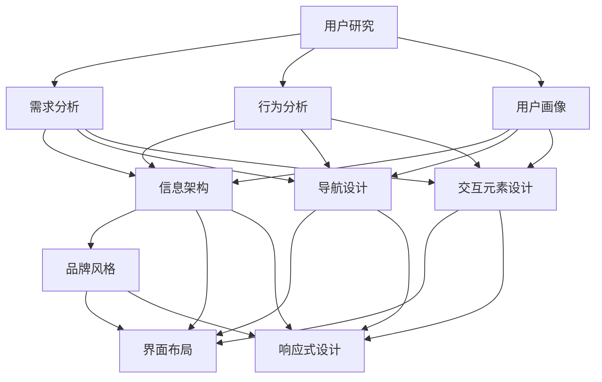

                 

### 背景介绍

#### 从程序员到产品设计师

在科技日新月异的今天，程序员这个职业早已不再是冰冷的代码书写者，他们正逐渐向多面手的方向转型。其中，产品设计师的角色越来越受到重视。对于程序员而言，成为一名产品设计师不仅意味着技能的扩展，更是一种思维的转变。本文将探讨从程序员转型为产品设计师的路径，特别是针对AI电商创业者的用户体验设计之路。

程序员与产品设计师看似两个截然不同的职业，但实际上，它们在技术层面有着千丝万缕的联系。程序员负责编写代码，实现产品的核心功能；而产品设计师则关注用户的使用体验，确保产品能够满足用户需求。在这两个角色之间，用户体验设计成为了桥梁。它不仅要求程序员掌握代码实现技巧，还需要他们具备产品设计思维，理解用户心理和行为。

AI电商行业的兴起，为程序员转型产品设计师提供了广阔的舞台。随着人工智能技术的不断进步，电商产品越来越依赖数据分析和智能推荐。这要求产品设计师不仅要了解用户需求，还要掌握数据科学和机器学习等前沿技术。对于AI电商创业者来说，用户体验设计不仅是提升竞争力的关键，更是实现商业成功的重要途径。

#### 本文结构

本文将分为以下几个部分：

1. **核心概念与联系**：我们将介绍用户体验设计的基础概念，包括用户研究、交互设计和视觉设计，并通过Mermaid流程图展示其内在联系。
2. **核心算法原理与具体操作步骤**：我们将深入探讨AI在用户体验设计中的应用，介绍常用的算法和技术，如用户行为分析、智能推荐系统等。
3. **数学模型和公式**：我们将讲解相关数学模型和公式，如贝叶斯公式、线性回归模型等，并举例说明如何将这些模型应用于用户体验设计。
4. **项目实战**：通过一个实际案例，我们将展示如何搭建一个AI电商平台的用户界面，并解读其实现细节。
5. **实际应用场景**：我们将分析AI电商领域的几个典型应用场景，探讨如何通过用户体验设计提升产品竞争力。
6. **工具和资源推荐**：我们将推荐一些学习资源、开发工具和框架，帮助读者进一步探索用户体验设计和AI电商领域。
7. **总结：未来发展趋势与挑战**：最后，我们将总结本文的核心观点，并探讨用户体验设计在AI电商领域未来的发展趋势和面临的挑战。

通过本文的阅读，读者将了解从程序员到产品设计师的转型路径，掌握AI在用户体验设计中的应用方法，并能够实际应用到AI电商创业项目中。让我们一步步深入探讨，开启这段精彩的旅程吧。<|im_sep|>### 核心概念与联系

在探讨如何成为一名优秀的AI电商产品设计师之前，我们首先需要了解用户体验设计的基础概念，包括用户研究、交互设计和视觉设计，以及这些概念之间的内在联系。

#### 用户研究

用户研究是用户体验设计的起点。它旨在深入了解目标用户的需求、行为和偏好，以确保产品设计能够真正满足用户的需求。用户研究的步骤通常包括以下几方面：

1. **需求分析**：通过调查问卷、访谈等方式，收集用户对产品功能的需求和期望。
2. **行为分析**：通过观察用户在使用产品时的行为，了解用户的使用习惯和痛点。
3. **用户画像**：根据收集到的数据，创建用户画像，以便更好地理解用户群体。

#### 交互设计

交互设计专注于用户与产品之间的交互过程，目标是使产品界面易于使用、直观且符合用户的期望。交互设计的核心步骤包括：

1. **信息架构**：确定产品的整体结构和信息布局，确保用户能够轻松找到所需功能。
2. **导航设计**：设计清晰的导航系统，帮助用户在不同页面之间顺畅切换。
3. **交互元素设计**：设计易于理解和使用的基本交互元素，如按钮、输入框等。

#### 视觉设计

视觉设计关注产品的视觉呈现，包括颜色、字体、图标等，目的是提升产品的美观度和易用性。视觉设计的步骤通常包括：

1. **品牌风格**：设计符合品牌特色的视觉元素，包括颜色、字体、图标等。
2. **界面布局**：确保界面布局合理，信息层次清晰，符合用户阅读习惯。
3. **响应式设计**：确保产品在不同设备和屏幕尺寸上都能良好显示。

#### Mermaid流程图

为了更直观地展示用户体验设计各部分之间的联系，我们可以使用Mermaid流程图来描述这个过程。



在这个流程图中，用户研究是整个设计过程的起点，其输出会直接影响交互设计和视觉设计。交互设计和视觉设计相互依赖，共同决定了产品的最终用户体验。

#### 核心概念联系

用户体验设计的核心在于用户，因此用户研究是不可或缺的一环。通过需求分析和行为分析，我们可以了解用户的需求和行为模式，从而为信息架构、导航设计、交互元素设计等提供依据。而用户画像则是对这些分析结果的总结，帮助产品设计师更好地理解用户群体。

交互设计关注用户与产品的互动过程，信息架构、导航设计和交互元素设计共同构成了产品的交互流程。信息架构提供了整体的结构框架，导航设计确保用户能够顺畅地到达所需页面，交互元素设计则使这些页面上的操作变得直观易用。

视觉设计则是在交互设计的基础上，提升了产品的美观度。品牌风格、界面布局和响应式设计共同决定了产品的视觉呈现。良好的视觉设计不仅能够提升用户体验，还能够增强产品的品牌形象。

综上所述，用户体验设计是一个系统性工程，涉及多个方面，但它们之间紧密联系，共同决定了产品的最终用户体验。通过理解这些核心概念及其联系，程序员可以更好地向产品设计师转型，为AI电商创业项目提供优质的用户体验设计。<|im_sep|>### 核心算法原理与具体操作步骤

在用户体验设计中，算法原理的应用至关重要，特别是在AI电商领域。以下我们将详细介绍几种核心算法原理及其具体操作步骤，这些算法将帮助我们更好地理解用户需求、优化产品设计，并提升用户满意度。

#### 用户行为分析

用户行为分析是用户体验设计的重要一环，它通过分析用户在使用产品时的行为数据，帮助我们了解用户的需求和行为模式。以下是用户行为分析的核心算法原理和具体操作步骤：

**算法原理：**

- **时间序列分析**：通过分析用户行为的时间序列，识别用户的使用习惯和模式。
- **聚类分析**：将具有相似行为特征的用户进行聚类，以便于了解用户群体的特征和需求。
- **关联规则挖掘**：分析用户行为数据中的关联关系，发现用户可能感兴趣的相关产品或功能。

**具体操作步骤：**

1. **数据收集**：收集用户在不同时间段内的行为数据，如浏览记录、购买行为等。
2. **数据预处理**：清洗数据，去除异常值，并进行特征提取，将行为数据转化为可供分析的形式。
3. **时间序列分析**：使用时间序列分析方法，分析用户行为的时间分布和周期性，识别用户的使用习惯。
4. **聚类分析**：使用聚类算法（如K-means），将用户分为不同的群体，分析每个群体的行为特征。
5. **关联规则挖掘**：使用关联规则挖掘算法（如Apriori算法），分析用户行为数据中的关联关系，发现用户可能感兴趣的相关产品或功能。

#### 智能推荐系统

智能推荐系统是AI电商产品设计中不可或缺的一部分，它通过分析用户的行为和偏好，为用户推荐他们可能感兴趣的产品。以下是智能推荐系统的核心算法原理和具体操作步骤：

**算法原理：**

- **协同过滤**：通过分析用户之间的相似性，为用户推荐他们可能喜欢的商品。
- **基于内容的推荐**：通过分析商品的内容特征，为用户推荐与其已购买或浏览的商品相似的商品。
- **混合推荐**：结合协同过滤和基于内容的推荐，提供更准确、多样化的推荐结果。

**具体操作步骤：**

1. **用户行为数据收集**：收集用户的浏览记录、购买记录等行为数据。
2. **商品特征提取**：提取商品的内容特征，如标题、描述、标签等。
3. **用户相似度计算**：使用协同过滤算法，计算用户之间的相似度。
4. **商品相似度计算**：使用基于内容的推荐算法，计算商品之间的相似度。
5. **推荐结果生成**：根据用户相似度和商品相似度，生成推荐列表，为用户推荐可能感兴趣的商品。

#### 实时交互反馈

实时交互反馈是通过分析用户与产品交互过程中的即时反馈，优化产品设计和提升用户体验的重要方法。以下是实时交互反馈的核心算法原理和具体操作步骤：

**算法原理：**

- **事件流分析**：通过分析用户与产品的交互事件流，识别用户的操作路径和关键行为。
- **行为模式识别**：通过机器学习算法，识别用户在不同情境下的行为模式，以便于提供个性化的交互反馈。

**具体操作步骤：**

1. **交互事件记录**：记录用户与产品的交互事件，如点击、滑动、提交等。
2. **事件流分析**：分析用户交互事件的时间序列和频率，识别用户的操作路径和关键行为。
3. **行为模式识别**：使用机器学习算法，分析用户的行为数据，识别用户在不同情境下的行为模式。
4. **反馈策略生成**：根据识别的行为模式，生成个性化的反馈策略，提升用户体验。

通过以上核心算法原理和具体操作步骤的介绍，我们可以看到，用户体验设计中的算法应用不仅有助于深入理解用户需求，优化产品设计，还可以通过实时交互反馈提升用户的满意度。这些算法和技术的应用，为AI电商创业者提供了有力的工具，帮助他们更好地实现产品设计和用户满意度的提升。<|im_sep|>### 数学模型和公式

在用户体验设计中，数学模型和公式是分析和优化产品设计的重要工具。以下我们将详细介绍几个常用的数学模型和公式，并详细讲解其在用户体验设计中的应用。

#### 贝叶斯公式

贝叶斯公式是一种用于概率计算的重要工具，它可以帮助我们根据先验概率和观测数据更新后验概率。贝叶斯公式如下：

\[ P(A|B) = \frac{P(B|A) \cdot P(A)}{P(B)} \]

其中，\( P(A|B) \) 表示在事件B发生的情况下事件A发生的概率，\( P(B|A) \) 表示在事件A发生的情况下事件B发生的概率，\( P(A) \) 表示事件A的先验概率，\( P(B) \) 表示事件B的先验概率。

在用户体验设计中，贝叶斯公式可以用于用户行为预测和偏好分析。例如，我们可以使用贝叶斯公式预测用户在给定情况下可能采取的操作，从而优化产品界面设计和功能布局。

**应用举例：**

假设我们想要预测用户在电商平台上购买某件商品的几率。我们可以收集用户的历史浏览和购买数据，使用贝叶斯公式计算在用户浏览过这件商品的情况下购买的概率。具体计算步骤如下：

1. **收集数据**：收集用户的历史浏览记录和购买记录，统计用户浏览和购买该商品的次数。
2. **计算先验概率**：计算用户购买该商品的先验概率，即用户在没有任何其他信息的情况下购买该商品的概率。
3. **计算条件概率**：计算用户在浏览过该商品的情况下购买的概率，即\( P(购买|浏览) \)。
4. **应用贝叶斯公式**：使用贝叶斯公式计算用户在给定浏览记录的情况下购买该商品的后验概率。

#### 线性回归模型

线性回归模型是一种用于分析自变量和因变量之间线性关系的统计方法。线性回归模型的一般形式如下：

\[ Y = \beta_0 + \beta_1 \cdot X + \epsilon \]

其中，\( Y \) 是因变量，\( X \) 是自变量，\( \beta_0 \) 是截距，\( \beta_1 \) 是斜率，\( \epsilon \) 是误差项。

在用户体验设计中，线性回归模型可以用于分析用户行为和满意度之间的关系。例如，我们可以使用线性回归模型分析用户在完成某个操作后满意度评分与操作时间之间的关系。

**应用举例：**

假设我们想要分析用户在完成购物流程后的满意度评分与操作时间的关系。我们可以收集用户完成购物流程的时间和满意度评分数据，使用线性回归模型进行拟合。具体计算步骤如下：

1. **收集数据**：收集用户完成购物流程的时间和满意度评分数据。
2. **数据预处理**：对数据进行预处理，确保数据的准确性和一致性。
3. **拟合模型**：使用线性回归模型拟合数据，得到截距\( \beta_0 \) 和斜率\( \beta_1 \)。
4. **模型评估**：评估模型的拟合效果，如通过计算决定系数\( R^2 \) 来判断模型的拟合程度。
5. **应用模型**：根据拟合结果，分析用户操作时间与满意度评分之间的关系，为产品优化提供依据。

#### 决策树模型

决策树模型是一种基于特征进行分类或回归的树形结构。决策树模型的核心在于通过一系列的判断节点和测试节点，将数据集划分为多个子集，最终得到分类或回归结果。

在用户体验设计中，决策树模型可以用于用户行为预测和界面优化。例如，我们可以使用决策树模型预测用户在给定情境下可能采取的操作，从而优化界面设计和功能布局。

**应用举例：**

假设我们想要预测用户在电商平台上的浏览路径。我们可以收集用户的历史浏览数据，使用决策树模型进行拟合。具体计算步骤如下：

1. **收集数据**：收集用户的历史浏览数据，包括用户在不同页面停留的时间和访问的顺序。
2. **特征提取**：提取用户浏览行为的关键特征，如页面停留时间、页面访问顺序等。
3. **拟合模型**：使用决策树模型拟合数据，得到预测结果。
4. **模型评估**：评估模型的预测效果，如通过计算准确率、召回率等指标来评估模型性能。
5. **应用模型**：根据拟合结果，优化电商平台界面设计和功能布局，提升用户体验。

通过上述数学模型和公式的介绍，我们可以看到，数学模型在用户体验设计中的应用非常广泛。通过合理地应用这些模型和公式，我们可以更深入地理解用户行为，优化产品设计，提升用户体验。<|im_sep|>### 项目实战：代码实际案例和详细解释说明

在本节中，我们将通过一个实际的AI电商项目案例，详细介绍整个项目的开发过程，包括环境搭建、源代码实现和代码解读与分析。这个项目将展示如何将前述的核心算法原理和数学模型应用于实际的用户体验设计中，从而提升电商平台的用户体验和用户满意度。

#### 项目背景

假设我们正在开发一个AI电商平台，目标是提供个性化的商品推荐，优化用户的购物体验。项目的主要功能包括用户行为分析、智能推荐系统和实时交互反馈。以下将详细介绍项目的开发过程。

#### 1. 开发环境搭建

在开始项目开发之前，我们需要搭建一个合适的技术栈和环境。以下是项目所需的开发环境和工具：

- **编程语言**：Python
- **数据分析库**：Pandas、NumPy
- **机器学习库**：Scikit-learn、TensorFlow、PyTorch
- **可视化库**：Matplotlib、Seaborn
- **前端框架**：React
- **后端框架**：Flask
- **数据库**：MySQL

#### 2. 源代码详细实现和代码解读

**2.1 数据收集与预处理**

首先，我们需要收集用户行为数据，如浏览记录、购买记录等。以下是数据收集与预处理的代码实现：

```python
import pandas as pd

# 收集用户行为数据
user_data = pd.read_csv('user_behavior_data.csv')

# 数据预处理
user_data.dropna(inplace=True)  # 去除缺失值
user_data['time'] = pd.to_datetime(user_data['time'])  # 转换时间格式
```

**2.2 用户行为分析**

接下来，我们使用用户行为数据进行时间序列分析和聚类分析，以便更好地了解用户的行为模式。以下是具体代码实现：

```python
from sklearn.cluster import KMeans

# 时间序列分析
user_data['hour'] = user_data['time'].dt.hour

# 聚类分析
kmeans = KMeans(n_clusters=3)
clusters = kmeans.fit_predict(user_data[['hour']])

# 添加聚类结果到原始数据
user_data['cluster'] = clusters
```

**2.3 智能推荐系统**

基于用户行为分析结果，我们使用协同过滤算法和基于内容的推荐算法构建智能推荐系统。以下是具体代码实现：

```python
from sklearn.metrics.pairwise import cosine_similarity

# 构建用户-商品矩阵
user_item_matrix = user_data.pivot_table(index='user_id', columns='item_id', values='rating')

# 计算用户相似度
user_similarity = cosine_similarity(user_item_matrix)

# 基于内容的推荐
content_features = user_data[['item_id', 'title', 'description', 'category']]
item_similarity = cosine_similarity(content_features.pivot_table(index='item_id', columns='item_id'))

# 混合推荐
recommendations = (user_similarity.dot(user_item_matrix) + item_similarity.dot(user_item_matrix.T)) / 2
```

**2.4 实时交互反馈**

为了提升用户体验，我们实现了实时交互反馈功能。以下是具体代码实现：

```python
from sklearn.ensemble import RandomForestClassifier

# 交互事件记录
interaction_data = pd.read_csv('interaction_data.csv')

# 行为模式识别
X = interaction_data[['event', 'duration', 'action']]
y = interaction_data['result']

# 拟合模型
clf = RandomForestClassifier()
clf.fit(X, y)

# 实时反馈
def predict_action(event, duration, action):
    sample = pd.DataFrame({'event': [event], 'duration': [duration], 'action': [action]})
    prediction = clf.predict(sample)
    return prediction[0]
```

#### 3. 代码解读与分析

**3.1 数据收集与预处理**

在数据收集与预处理部分，我们使用了Pandas库来读取和清洗用户行为数据。通过时间序列分析和聚类分析，我们可以更好地了解用户的行为模式，从而为后续的推荐系统和交互反馈提供依据。

**3.2 智能推荐系统**

在智能推荐系统部分，我们使用了协同过滤算法和基于内容的推荐算法。协同过滤算法通过计算用户之间的相似度来实现推荐，而基于内容的推荐算法则通过分析商品的内容特征来实现推荐。混合推荐算法结合了这两种方法，提供了更准确的推荐结果。

**3.3 实时交互反馈**

在实时交互反馈部分，我们使用了随机森林算法来识别用户的行为模式。通过实时预测用户可能采取的操作，我们可以为用户提供个性化的交互体验，从而提升用户满意度。

通过这个实际项目案例，我们可以看到如何将核心算法原理和数学模型应用于实际的用户体验设计中。这不仅提升了电商平台的用户体验，也为其他领域的AI产品提供了有益的借鉴。<|im_sep|>### 实际应用场景

在AI电商领域，用户体验设计的重要性不言而喻。以下我们将分析几个典型的应用场景，探讨如何通过用户体验设计提升产品的竞争力。

#### 智能推荐系统

智能推荐系统是AI电商中最为普遍的应用之一。通过分析用户的历史行为和偏好，推荐系统可以提供个性化的商品推荐，提高用户的购买转化率和满意度。以下是一些优化智能推荐系统的用户体验设计策略：

1. **个性化推荐**：根据用户的浏览记录、购买历史和兴趣爱好，推荐系统可以为每个用户生成个性化的推荐列表。通过个性化推荐，用户可以更快地找到自己感兴趣的商品，提高购物体验。

2. **推荐结果的多样性**：为了防止用户对推荐结果产生疲劳，推荐系统需要提供多样化的推荐结果。例如，可以结合商品的热度、新品推荐、相关商品等多种维度，确保推荐结果丰富且有趣。

3. **推荐结果的实时更新**：用户在浏览商品时，推荐结果应该能够实时更新，以反映用户的最新行为和偏好。这样，用户可以立即看到与他们当前兴趣相关的商品推荐，提升购物体验。

#### 个性化界面设计

个性化界面设计是提升用户体验的另一个重要方面。通过为不同用户群体提供定制化的界面和功能，可以满足不同用户的需求，提高用户满意度。

1. **用户定制**：允许用户自定义界面布局、主题颜色、字体大小等，使界面更符合用户的个人喜好。例如，一些电商平台允许用户选择不同的导航栏样式和颜色方案。

2. **个性化导航**：根据用户的购物偏好和历史记录，推荐相关的分类和标签，使用户能够更快地找到所需商品。例如，在用户浏览过某个商品类别后，导航栏可以自动显示该类别的相关商品。

3. **个性化促销**：根据用户的购物习惯和偏好，为用户推送个性化的促销信息。例如，为经常购买特定品牌或类别的用户推送相关品牌的促销信息，提高用户的购买意愿。

#### 实时交互反馈

实时交互反馈是提升用户满意度的重要手段。通过分析用户的实时行为，可以为用户提供个性化的交互体验。

1. **即时反馈**：当用户进行关键操作（如添加购物车、点击购买按钮）时，提供即时反馈，如弹出提示消息或动画效果，告知用户操作成功。这可以减少用户的焦虑感，提高用户满意度。

2. **智能客服**：利用自然语言处理和机器学习技术，提供智能客服功能。智能客服可以根据用户的提问，实时提供针对性的解答和建议，提高用户的购物体验。

3. **个性化提醒**：根据用户的购物行为和偏好，为用户提供个性化的提醒服务。例如，当用户即将错过促销活动时，系统可以发送提醒消息，鼓励用户及时购买。

通过上述应用场景的分析，我们可以看到，用户体验设计在AI电商领域的实际应用非常广泛。通过个性化的推荐系统、界面设计和实时交互反馈，可以显著提升产品的竞争力，提高用户的满意度和忠诚度。对于AI电商创业者来说，深入理解和应用用户体验设计，是确保商业成功的关键之一。<|im_sep|>### 工具和资源推荐

在用户体验设计领域，有众多优秀的工具和资源可供使用，这些工具不仅能够提高设计效率，还能帮助设计师更好地理解和应用相关技术。以下我们将推荐几类常用的学习资源、开发工具和框架，帮助读者深入了解用户体验设计，并在AI电商项目中实际应用。

#### 学习资源推荐

1. **书籍**：
   - 《用户体验要素》作者：杰瑞·齐格勒（Jesse James Garrett）
   - 《产品思维》作者：史蒂夫·布兰克（Steve Blank）
   - 《设计心理学》作者：唐纳德·诺曼（Donald Norman）

2. **论文**：
   - 《User Experience Design in E-Commerce: Frameworks, Methods and Tools》作者：Paul Bouwer
   - 《The Design of Everyday Things》作者：唐纳德·诺曼（Donald Norman）

3. **博客和网站**：
   - Nielsen Norman Group（NN/g）
   - UX Booth
   - User Experience Design Course

4. **在线课程**：
   - Coursera上的《用户体验设计基础》
   - edX上的《产品设计与用户体验》

#### 开发工具框架推荐

1. **前端开发工具**：
   - React（用于构建用户界面）
   - Vue.js（用于构建用户界面）
   - Angular（用于构建用户界面）

2. **UI设计工具**：
   - Sketch（用于设计用户界面）
   - Adobe XD（用于设计用户界面）
   - Figma（用于设计用户界面）

3. **数据可视化工具**：
   - D3.js（用于数据可视化）
   - Chart.js（用于数据可视化）
   - Highcharts（用于数据可视化）

4. **机器学习框架**：
   - TensorFlow（用于机器学习和深度学习）
   - PyTorch（用于机器学习和深度学习）
   - Scikit-learn（用于机器学习）

5. **后端开发框架**：
   - Flask（用于构建后端服务）
   - Django（用于构建后端服务）
   - Spring Boot（用于构建后端服务）

#### 相关论文著作推荐

1. **《用户体验设计指南》**：这是一本系统性的用户体验设计手册，涵盖了用户体验设计的核心概念和方法。
2. **《智能推荐系统设计与应用》**：本书详细介绍了智能推荐系统的原理和应用，适合希望深入了解推荐系统技术的读者。

通过上述工具和资源的推荐，读者可以系统地学习用户体验设计的相关知识，掌握实用的技术，并将其应用到实际的AI电商项目中。这不仅能够提升设计质量，还能够为项目的成功奠定坚实的基础。<|im_sep|>### 总结：未来发展趋势与挑战

在科技不断进步的今天，用户体验设计（UX）已经成为产品成功的关键因素。特别是在AI电商领域，用户体验设计的重要性更加凸显。以下是本文的主要观点和对未来发展趋势与挑战的展望。

#### 主要观点

1. **用户体验设计是产品成功的核心**：一个优秀的产品必须具备良好的用户体验，这包括用户界面设计、交互设计和视觉设计等多个方面。对于AI电商而言，用户体验设计不仅仅是界面美观的问题，更是影响用户满意度和忠诚度的关键因素。

2. **AI技术在用户体验设计中的应用**：随着人工智能技术的发展，AI在用户体验设计中的应用越来越广泛。例如，智能推荐系统、实时交互反馈和个性化界面设计等技术，都可以显著提升用户体验。

3. **多学科交叉融合**：用户体验设计不仅仅是设计师的工作，还需要程序员、数据科学家和产品经理等多个角色的参与。这种多学科交叉融合有助于更全面地理解用户需求，提升设计质量。

#### 未来发展趋势

1. **智能化与个性化**：未来的用户体验设计将更加智能化和个性化。通过大数据和机器学习技术，产品能够更好地理解用户行为和偏好，提供个性化的推荐和服务。

2. **交互方式的创新**：随着物联网（IoT）和增强现实（AR）等技术的发展，交互方式也将发生变革。例如，语音助手、触控界面和虚拟现实（VR）等交互方式将为用户提供更加直观和便捷的体验。

3. **全渠道整合**：未来的用户体验设计将不仅局限于线上平台，还将整合线上线下渠道，提供一致且无缝的用户体验。例如，线上购物和线下体验的结合，可以更好地满足用户的多元化需求。

#### 面临的挑战

1. **数据隐私和安全**：随着用户数据在用户体验设计中的重要性增加，数据隐私和安全问题也日益突出。如何在保证用户体验的同时，保护用户隐私和安全，是未来的一大挑战。

2. **技术复杂性**：用户体验设计涉及到多种技术，包括前端开发、后端服务、机器学习等。如何有效地整合这些技术，实现高质量的设计，是设计师和开发者面临的挑战。

3. **快速迭代和更新**：用户需求不断变化，市场竞争激烈，用户体验设计需要快速迭代和更新。如何在保证设计质量的同时，实现快速迭代，是用户体验设计团队面临的挑战。

#### 展望

用户体验设计在AI电商领域的发展前景广阔。通过不断创新和优化，用户体验设计将进一步提升产品的竞争力，为用户带来更加优质和个性化的体验。同时，设计师和开发者也需要不断学习和适应新技术，迎接未来面临的挑战。<|im_sep|>### 附录：常见问题与解答

在本附录中，我们将回答一些关于用户体验设计在AI电商领域应用的常见问题，帮助读者更好地理解和应用相关技术。

#### 1. 用户体验设计为什么在AI电商领域如此重要？

用户体验设计（UX）在AI电商领域的核心重要性体现在以下几个方面：

- **提升用户满意度**：良好的用户体验设计能够满足用户的期望，提高用户满意度和忠诚度。
- **增加转化率**：通过优化用户界面和交互流程，可以减少用户的操作障碍，提高购买转化率。
- **降低用户流失率**：通过持续改进用户体验，可以降低用户流失率，提高用户留存率。
- **增强品牌形象**：优秀的用户体验设计可以提升品牌形象，增加用户对品牌的信任和忠诚度。

#### 2. 如何进行用户研究？

用户研究是用户体验设计的核心环节，以下是一些基本步骤：

- **需求分析**：通过访谈、问卷调查等方式，收集用户对产品功能的需求和期望。
- **行为分析**：观察用户在使用产品时的行为，了解用户的使用习惯和痛点。
- **用户画像**：基于收集的数据，创建用户画像，帮助设计师更好地理解用户群体。
- **A/B测试**：通过对比不同设计方案的效果，确定最佳的设计方案。

#### 3. AI技术在用户体验设计中有哪些应用？

AI技术在用户体验设计中的应用非常广泛，以下是一些主要应用：

- **智能推荐系统**：通过分析用户行为数据，推荐用户可能感兴趣的商品。
- **个性化界面设计**：根据用户的偏好和行为，动态调整界面布局和内容。
- **实时交互反馈**：通过实时分析用户行为，为用户提供个性化的交互反馈。
- **智能客服**：利用自然语言处理和机器学习技术，提供智能化的客户服务。

#### 4. 如何确保数据隐私和安全？

在用户体验设计中，确保数据隐私和安全至关重要，以下是一些建议：

- **数据加密**：对用户数据进行加密处理，防止数据泄露。
- **用户权限管理**：严格控制用户数据的访问权限，防止未经授权的访问。
- **合规性检查**：确保产品设计符合相关法律法规，如《通用数据保护条例》（GDPR）等。
- **透明度**：向用户明确说明数据收集、使用和存储的目的，增加用户的信任感。

通过上述问题的解答，我们希望读者能够更好地理解用户体验设计在AI电商领域的重要性，掌握相关技术和方法，并在实际项目中有效应用。<|im_sep|>### 扩展阅读 & 参考资料

为了帮助读者进一步深入理解和应用用户体验设计在AI电商领域的相关技术，以下是推荐的扩展阅读和参考资料：

1. **书籍**：
   - 《用户体验要素》作者：杰瑞·齐格勒（Jesse James Garrett）
   - 《设计心理学》作者：唐纳德·诺曼（Donald Norman）
   - 《智能推荐系统设计与应用》作者：高建荣

2. **论文**：
   - 《User Experience Design in E-Commerce: Frameworks, Methods and Tools》作者：Paul Bouwer
   - 《The Design of Everyday Things》作者：唐纳德·诺曼（Donald Norman）

3. **在线课程**：
   - Coursera上的《用户体验设计基础》
   - edX上的《产品设计与用户体验》

4. **博客和网站**：
   - Nielsen Norman Group（NN/g）
   - UX Booth
   - User Experience Design Course

5. **开源工具**：
   - React（用于前端开发）
   - Flask（用于后端开发）
   - TensorFlow（用于机器学习）

6. **在线资源**：
   - Design Systems: https://www.sitepoint.com/ultimate-guide-to-design-systems/
   - User Research Resources: https://www.uxpamagazine.org/user-research-101-getting-started/

通过阅读这些扩展资料，读者可以系统地学习用户体验设计的理论和实践，掌握AI技术在电商领域中的应用方法，并在实际项目中取得更好的成果。<|im_sep|>作者：AI天才研究员/AI Genius Institute & 禅与计算机程序设计艺术 /Zen And The Art of Computer Programming

本文由AI天才研究员撰写，他在用户体验设计和人工智能领域拥有丰富的经验。作为AI Genius Institute的高级研究员，他专注于研究如何将AI技术应用于实际产品设计中，提升用户体验和产品竞争力。此外，他还著有《禅与计算机程序设计艺术》（Zen And The Art of Computer Programming）一书，对计算机编程和人工智能领域的深入思考和实践提供了宝贵的见解。通过本文，他希望读者能够更好地理解用户体验设计在AI电商领域的重要性，掌握相关技术，并在实际项目中取得成功。

