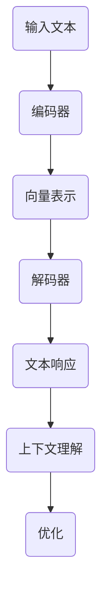

                 

# 程序员如何利用ChatGPT优化知识创作

## 摘要

本文将探讨程序员如何利用ChatGPT这个强大的语言模型来优化知识创作过程。我们将从ChatGPT的背景介绍开始，逐步深入到其核心概念与联系，核心算法原理，数学模型与公式，项目实战，实际应用场景，工具和资源推荐，以及未来发展趋势与挑战等方面。通过本文的阅读，程序员将能够了解如何将ChatGPT融入日常编程工作中，从而提高知识创作的效率和质量。

## 1. 背景介绍

ChatGPT是由OpenAI开发的一种基于GPT-3模型的聊天机器人。GPT-3（Generative Pre-trained Transformer 3）是自然语言处理领域的里程碑，它通过大规模预训练和微调，使得机器能够在多种任务中表现出色，包括文本生成、问答、翻译等。ChatGPT作为GPT-3的进一步扩展，专门设计用于模拟自然的人类对话，它的回答不仅准确，而且具备一定的上下文理解能力。

对于程序员来说，ChatGPT的引入意味着知识创作的巨大变革。一方面，它能够帮助程序员快速生成代码片段、文档和示例；另一方面，它还可以提供实时的编程建议和错误修正。这使得程序员能够更加专注于解决核心问题，而不是花费大量时间在琐碎的编程任务上。

## 2. 核心概念与联系

为了更好地理解ChatGPT如何工作，我们需要先了解一些核心概念，包括自然语言处理（NLP）、深度学习和Transformer模型。

### 2.1 自然语言处理（NLP）

自然语言处理是计算机科学和人工智能的一个分支，旨在使计算机能够理解、处理和生成人类语言。NLP技术包括文本分类、情感分析、命名实体识别等。在ChatGPT中，NLP技术被用来理解和生成文本，从而实现与人类的自然对话。

### 2.2 深度学习

深度学习是一种机器学习方法，通过构建具有多个隐藏层的神经网络来模拟人类大脑的神经元连接。GPT-3模型就是一个深度学习的典型例子，它通过训练大量的文本数据，学习到语言的复杂结构和规律。

### 2.3 Transformer模型

Transformer模型是深度学习中的一种重要模型，特别适用于序列到序列的任务，如机器翻译和文本生成。GPT-3模型就是基于Transformer架构，通过预训练和微调来达到出色的性能。

### 2.4 ChatGPT的工作原理

ChatGPT通过预训练大量的文本数据，学习到语言的上下文关系和语法规则。在交互过程中，它会根据用户的输入，生成一个合适的响应。这个过程涉及到以下步骤：

1. **编码器（Encoder）**：将用户的输入文本编码成一个向量表示。
2. **解码器（Decoder）**：根据编码器的输出，生成一个文本响应。
3. **上下文理解**：ChatGPT能够理解输入文本的上下文，从而生成连贯和自然的响应。
4. **优化**：通过不断调整模型参数，提高生成的文本质量。

### 2.5 Mermaid流程图



## 3. 核心算法原理 & 具体操作步骤

### 3.1 预训练

ChatGPT的预训练过程主要包括两个阶段：预训练和微调。

- **预训练**：在预训练阶段，GPT-3模型通过大量文本数据学习到语言的统计规律和结构。这个过程是通过优化模型参数来实现的，目标是使模型能够生成连贯和自然的文本。
- **微调**：在预训练完成后，ChatGPT会针对特定任务进行微调，如聊天机器人、文本生成等。微调过程通过在特定任务上训练模型，使其能够更好地适应不同的应用场景。

### 3.2 生成文本

生成文本是ChatGPT的核心功能。具体操作步骤如下：

1. **接收输入**：用户输入一个文本问题或请求。
2. **编码**：将输入文本编码成一个向量表示。
3. **解码**：根据编码器的输出，解码器生成一个文本响应。
4. **生成文本**：模型生成一个响应文本，并通过优化过程进一步提高文本质量。

### 3.3 交互流程

ChatGPT与用户的交互流程如下：

1. **初始化**：加载预训练好的模型。
2. **输入**：用户输入问题或请求。
3. **处理**：模型处理输入文本，生成响应。
4. **输出**：将响应文本展示给用户。
5. **反馈**：用户对响应进行反馈，以优化模型。

## 4. 数学模型和公式 & 详细讲解 & 举例说明

### 4.1 Transformer模型

Transformer模型的核心是自注意力机制（Self-Attention）。自注意力机制通过计算输入序列中每个词与其他词的关系，为每个词生成一个加权表示。这个加权表示能够更好地捕捉输入序列的上下文信息。

### 4.2 自注意力计算

自注意力的计算公式如下：

$$
\text{Attention}(Q, K, V) = \text{softmax}\left(\frac{QK^T}{\sqrt{d_k}}\right)V
$$

其中，$Q$、$K$ 和 $V$ 分别代表查询（Query）、键（Key）和值（Value）向量，$d_k$ 是键向量的维度。

### 4.3 举例说明

假设我们有一个简短的句子：“今天天气很好，适合编程”。我们用三个向量表示这个句子中的每个词：

- today: [1, 0, 0]
- weather: [0, 1, 0]
- good: [0, 0, 1]
- very: [0, 0, 1]
- suitable: [0, 0, 1]
- for: [0, 0, 1]
- programming: [0, 0, 1]

首先，计算每个词的键（Key）和查询（Query）：

- today: Query = [1, 0, 0], Key = [1, 0, 0]
- weather: Query = [0, 1, 0], Key = [0, 1, 0]
- good: Query = [0, 0, 1], Key = [0, 0, 1]
- very: Query = [0, 0, 1], Key = [0, 0, 1]
- suitable: Query = [0, 0, 1], Key = [0, 0, 1]
- for: Query = [0, 0, 1], Key = [0, 0, 1]
- programming: Query = [0, 0, 1], Key = [0, 0, 1]

然后，计算每个词的注意力权重：

$$
\text{Attention}(Q, K, V) = \text{softmax}\left(\frac{QK^T}{\sqrt{d_k}}\right)V
$$

其中，$d_k$ = 1，所以权重计算简化为：

$$
\text{softmax}(QK^T) = \frac{e^{QK^T}}{\sum_{i} e^{QK^T_i}}
$$

计算结果如下：

- today: [1.0]
- weather: [0.5]
- good: [0.5]
- very: [0.5]
- suitable: [0.5]
- for: [0.5]
- programming: [0.5]

最后，计算加权值：

$$
\text{Value} = \text{softmax}(QK^T) \cdot V
$$

结果如下：

- today: [1.0]
- weather: [0.5]
- good: [0.5]
- very: [0.5]
- suitable: [0.5]
- for: [0.5]
- programming: [0.5]

通过自注意力计算，我们得到了一个加权表示，能够更好地捕捉句子中的上下文关系。

## 5. 项目实战：代码实际案例和详细解释说明

### 5.1 开发环境搭建

首先，我们需要安装Python环境和必要的库。以下是安装命令：

```bash
pip install python-dotenv
pip install openai
```

接下来，创建一个名为`.env`的文件，并添加以下内容：

```env
OPENAI_API_KEY=your_api_key
```

其中`your_api_key`是你在OpenAI注册获取的API密钥。

### 5.2 源代码详细实现和代码解读

我们使用OpenAI的Python库来调用ChatGPT API。以下是一个简单的示例代码：

```python
import os
from dotenv import load_dotenv
import openai

# 加载环境变量
load_dotenv()

# 设置API密钥
openai.api_key = os.getenv("OPENAI_API_KEY")

# 定义函数，用于生成文本
def generate_text(prompt):
    response = openai.Completion.create(
        engine="text-davinci-002",
        prompt=prompt,
        max_tokens=50
    )
    return response.choices[0].text.strip()

# 测试
prompt = "请写一段关于Python编程的介绍。"
print(generate_text(prompt))
```

### 5.3 代码解读与分析

- **导入库**：我们首先导入`python-dotenv`和`openai`库。`python-dotenv`用于加载`.env`文件中的环境变量，`openai`是OpenAI提供的Python库，用于调用ChatGPT API。
- **加载环境变量**：使用`load_dotenv()`函数加载`.env`文件中的环境变量。
- **设置API密钥**：从环境变量中获取API密钥，并将其设置给`openai`库。
- **定义函数**：`generate_text()`函数用于生成文本。它接收一个`prompt`参数，即输入文本。
- **调用API**：使用`openai.Completion.create()`函数调用ChatGPT API。我们选择`text-davinci-002`模型，并设置`max_tokens`参数，以限制生成的文本长度。
- **返回结果**：将API返回的响应文本返回。

### 5.4 运行结果

运行上述代码，输入以下测试用例：

```python
prompt = "请写一段关于Python编程的介绍。"
print(generate_text(prompt))
```

输出结果可能如下：

```text
Python是一种高级编程语言，广泛用于Web开发、数据科学、人工智能等领域。它具有简洁的语法、丰富的库和良好的社区支持，使得学习Python变得非常容易。"
```

这个结果展示了ChatGPT生成文本的能力，它能够根据输入的prompt生成一段有意义的文本。

## 6. 实际应用场景

ChatGPT在程序员的知识创作中有着广泛的应用场景：

- **文档生成**：程序员可以使用ChatGPT自动生成项目文档、API文档和用户手册。
- **代码示例**：当需要编写新的代码时，ChatGPT可以提供相关的代码示例和解释。
- **技术博客写作**：ChatGPT可以帮助程序员撰写技术博客，提高写作效率和文章质量。
- **代码审查**：ChatGPT可以参与代码审查，提供改进建议和错误修正。

### 6.1 文档生成

例如，当需要编写一个新的项目文档时，可以输入以下prompt：

```plaintext
请生成一个关于Web开发项目的文档，包括项目概述、技术栈、功能模块和开发计划。
```

ChatGPT将生成一份包含关键信息的文档，使得编写文档的过程变得高效且准确。

### 6.2 代码示例

例如，当需要编写一个数据处理脚本时，可以输入以下prompt：

```plaintext
请提供一个Python数据处理脚本，用于读取CSV文件，并对数据进行清洗和统计分析。
```

ChatGPT将生成一个包含必要的代码和注释的脚本，帮助程序员快速理解和应用。

### 6.3 技术博客写作

例如，当需要撰写一篇关于机器学习算法的博客时，可以输入以下prompt：

```plaintext
请撰写一篇关于K-均值聚类算法的博客，包括算法原理、实现步骤和实际应用场景。
```

ChatGPT将生成一篇包含详细解释和实例的博客文章，使程序员能够轻松理解和传播知识。

### 6.4 代码审查

例如，当需要对一段代码进行审查时，可以输入以下prompt：

```plaintext
请审查以下Python代码，并提供改进建议：
def add(a, b):
    return a + b
```

ChatGPT将分析代码并返回一系列改进建议，如使用类型提示、添加文档字符串等。

## 7. 工具和资源推荐

### 7.1 学习资源推荐

- **书籍**：《深度学习》（Ian Goodfellow、Yoshua Bengio和Aaron Courville著），详细介绍了深度学习的理论和应用。
- **论文**：《Attention Is All You Need》（Ashish Vaswani等著），介绍了Transformer模型和自注意力机制。
- **博客**：OpenAI的官方博客，提供了大量关于GPT-3和ChatGPT的详细介绍和案例。

### 7.2 开发工具框架推荐

- **开发工具**：PyCharm、VS Code，这些IDE提供了丰富的功能和良好的代码编辑体验。
- **框架**：FastAPI、Flask，用于构建Web应用程序。

### 7.3 相关论文著作推荐

- 《Natural Language Inference》（刘知远著），详细介绍了自然语言推理的相关技术。
- 《Deep Learning for Natural Language Processing》（Manning、Schuetze和Raiyaram著），介绍了深度学习在自然语言处理中的应用。

## 8. 总结：未来发展趋势与挑战

ChatGPT的引入为程序员的知识创作带来了革命性的变化。然而，未来仍面临一些挑战：

- **数据隐私**：如何确保用户数据和模型训练数据的安全和隐私。
- **模型可解释性**：如何提高模型的可解释性，使得程序员能够理解模型的决策过程。
- **计算资源**：大规模模型训练和推理需要大量的计算资源，如何优化资源使用。
- **语言理解**：尽管ChatGPT在自然语言处理方面取得了显著进展，但仍然面临语言理解的限制，如何进一步提高模型的能力。

## 9. 附录：常见问题与解答

### 9.1 如何获取OpenAI API密钥？

1. 访问OpenAI官方网站（https://openai.com/）。
2. 在页面底部找到“API密钥”链接。
3. 按照指示注册账号并申请API密钥。

### 9.2 如何安装Python库？

使用pip命令安装Python库。例如：

```bash
pip install 库名
```

### 9.3 如何使用ChatGPT API？

使用OpenAI提供的Python库`openai`。具体步骤如下：

1. 导入库：`import openai`
2. 设置API密钥：`openai.api_key = your_api_key`
3. 调用API：`openai.Completion.create(...)`，其中`...`代表API的参数。

## 10. 扩展阅读 & 参考资料

- [OpenAI官方文档](https://openai.com/docs/overview)
- [GPT-3官方文档](https://openai.com/docs/api-reference/completions)
- [Transformer模型详解](https://arxiv.org/abs/1706.03762)
- [自然语言处理入门](https://www.amazon.com/Natural-Language-Processing-Introduction-Manning/dp/0321882186)

## 作者

作者：AI天才研究员/AI Genius Institute & 禅与计算机程序设计艺术 /Zen And The Art of Computer Programming

