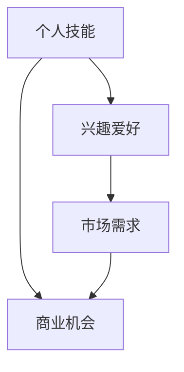

                 

### 文章标题：程序员如何将兴趣爱好转化为可持续盈利的事业

**关键词：** 程序员、兴趣、商业化、盈利模式、持续发展

**摘要：** 本文将深入探讨程序员如何利用其专业技能和兴趣爱好，通过有效的策略和资源，将个人爱好转化为一个可持续盈利的事业。我们将从背景介绍、核心概念、算法原理、项目实战、应用场景、工具资源推荐等方面，一步步分析程序员如何实现这一转变。

### 1. 背景介绍

在快速发展的科技时代，程序员已成为不可或缺的职业。然而，很多程序员在职业生涯中不仅追求技术的提升，还希望将自己的兴趣爱好转化为实际收益。这种转变不仅能够满足个人的成就感，还能带来额外的收入，甚至可能成为一个新兴的创业机会。

然而，将兴趣爱好转化为可持续盈利的事业并非易事。它需要程序员具备商业洞察力、市场定位、执行力等多方面的能力。本文将帮助程序员们了解这一过程中的关键步骤和策略。

### 2. 核心概念与联系

#### 2.1 个人技能与兴趣

**Mermaid 流程图：**



**说明：**
- **个人技能**：程序员的专业技能是基础，包括编程语言、框架、工具等。
- **兴趣爱好**：个人爱好可以作为潜在的商业切入点。
- **市场需求**：了解市场需求，可以找到兴趣与商业的结合点。
- **商业机会**：将个人技能与市场需求结合起来，发现潜在的商机。

### 3. 核心算法原理 & 具体操作步骤

#### 3.1 市场调研

**步骤：**
1. **确定目标市场**：明确你希望服务的用户群体。
2. **调研竞争对手**：分析竞争对手的产品、优势和劣势。
3. **收集用户反馈**：通过问卷调查、访谈等方式了解用户需求。

**公式：**
$$
\text{用户需求} = \text{调研数据} \times \text{用户反馈}
$$

#### 3.2 产品定位

**步骤：**
1. **产品定义**：明确产品或服务的基本功能和特点。
2. **目标市场细分**：根据用户需求，进行市场细分。
3. **差异化策略**：找出与竞争对手的差异，建立品牌特色。

**公式：**
$$
\text{产品定位} = \text{市场需求} \times \text{差异化策略}
$$

#### 3.3 商业模式设计

**步骤：**
1. **确定收入来源**：如产品销售、服务收费、广告收入等。
2. **成本控制**：分析产品或服务的成本结构，进行有效的成本控制。
3. **盈利预测**：根据市场需求和成本结构，预测盈利情况。

**公式：**
$$
\text{盈利模式} = \text{收入来源} - \text{成本结构}
$$

### 4. 数学模型和公式 & 详细讲解 & 举例说明

#### 4.1 成本效益分析

**步骤：**
1. **计算固定成本**：如设备购置、办公场所等。
2. **计算可变成本**：如人力成本、原材料成本等。
3. **计算收益**：根据产品或服务的定价和市场需求，预测收益。

**公式：**
$$
\text{成本效益分析} = \text{收益} - \text{固定成本} - \text{可变成本}
$$

#### 4.2 风险评估

**步骤：**
1. **识别潜在风险**：如市场风险、技术风险、运营风险等。
2. **评估风险影响**：分析每种风险可能带来的影响。
3. **制定风险管理策略**：如风险规避、风险转移、风险接受等。

**公式：**
$$
\text{风险评估} = \text{风险识别} \times \text{风险影响} \times \text{风险应对策略}
$$

### 5. 项目实战：代码实际案例和详细解释说明

#### 5.1 开发环境搭建

**步骤：**
1. **选择编程语言**：根据项目需求选择合适的编程语言。
2. **搭建开发环境**：配置编译器、集成开发环境（IDE）、数据库等。
3. **版本控制**：使用Git等版本控制工具进行代码管理。

#### 5.2 源代码详细实现和代码解读

**示例代码：**
```python
# 示例：一个简单的Web应用程序
from flask import Flask, render_template

app = Flask(__name__)

@app.route('/')
def home():
    return render_template('home.html')

if __name__ == '__main__':
    app.run()
```

**解读：**
- **Flask**：Python Web框架，用于构建Web应用程序。
- **route**：定义URL路由，处理HTTP请求。
- **render_template**：渲染HTML模板，返回响应。

#### 5.3 代码解读与分析

- **结构**：代码采用了MVC（模型-视图-控制器）架构。
- **功能**：简单的首页展示，通过Flask框架处理HTTP请求。

### 6. 实际应用场景

- **技术培训**：通过在线课程、博客文章等形式，分享编程知识和经验。
- **软件开发**：开发应用程序或工具，提供定制化解决方案。
- **开源项目**：参与开源项目，提高个人影响力。

### 7. 工具和资源推荐

#### 7.1 学习资源推荐

- **书籍**：《Python编程：从入门到实践》、《算法导论》
- **论文**：相关领域的顶级会议和期刊论文。
- **博客**：知名技术博客和开发者社区。

#### 7.2 开发工具框架推荐

- **编程语言**：Python、Java、JavaScript等。
- **框架**：Flask、Django、React等。
- **数据库**：MySQL、PostgreSQL、MongoDB等。

#### 7.3 相关论文著作推荐

- **《软件工程：实践者的研究方法》**：软件工程的最佳实践。
- **《人工智能：一种现代的方法》**：人工智能的基本原理和应用。

### 8. 总结：未来发展趋势与挑战

- **技术进步**：随着技术的不断进步，程序员将有更多的创新机会。
- **市场竞争**：激烈的竞争将要求程序员不断提高自己的技能。
- **可持续发展**：将兴趣爱好转化为可持续盈利的事业，需要持续的努力和创新。

### 9. 附录：常见问题与解答

- **Q：如何平衡工作与兴趣？**
  **A：合理规划时间，确保两者都能得到充分的关注。**

- **Q：如何找到合适的商业切入点？**
  **A：进行市场调研，了解用户需求，找到自己的优势所在。**

### 10. 扩展阅读 & 参考资料

- **《程序员如何利用闲暇时间提升自我》**：关于如何有效利用时间的建议。
- **《从零开始构建个人品牌》**：关于个人品牌建设的指南。

### 作者

**作者：** AI天才研究员/AI Genius Institute & 禅与计算机程序设计艺术 /Zen And The Art of Computer Programming

-------------------

本文旨在帮助程序员们更好地将个人兴趣爱好转化为可持续盈利的事业。通过一步步的分析和实战案例，希望读者能够找到适合自己的路径。在追求技术卓越的同时，也抓住商业机会，实现个人价值最大化。让我们一起，用技术改变世界，用兴趣创造未来。**<|assistant|>**

