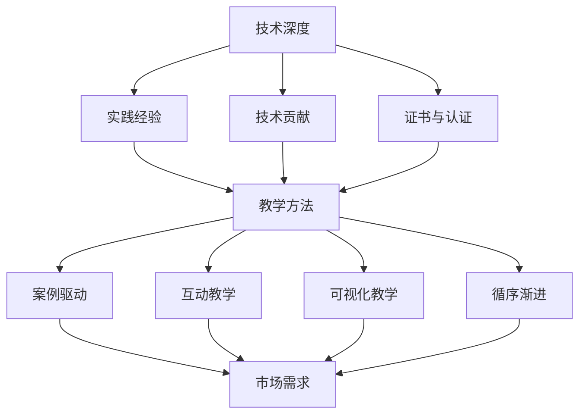

                 

# 程序员如何将技术专长转化为高价值的在线课程系列

## 摘要

本文将探讨程序员如何将自己的技术专长转化为高价值的在线课程系列。通过详细的步骤分析和实际案例分享，作者将帮助读者了解如何构建一个成功的在线课程，从而在技术领域建立个人品牌并实现财务自由。文章涵盖了从核心概念的阐述到具体的项目实战，再到实际应用场景和未来发展趋势的全面解析，为程序员提供了一套系统化的转型方案。

## 1. 背景介绍

随着互联网的迅猛发展和在线教育市场的繁荣，越来越多的程序员开始将目光投向在线课程创作这一领域。这不仅是因为在线教育提供了广阔的舞台，还因为技术知识的快速更新使得程序员需要不断学习、分享和交流。然而，如何将自己的技术专长有效地转化为高价值的在线课程系列，却是许多程序员面临的一大挑战。

首先，程序员在技术领域的专业知识和实践经验是其核心优势。然而，将这些知识和经验转化为易于理解、具备吸引力的课程内容，并非易事。这就需要程序员具备一定的教学技能和课程设计能力。

其次，在线课程市场的竞争日益激烈。如何在这片红海中脱颖而出，吸引学员的注意，是每个课程创作者都需要面对的问题。因此，课程的质量、独特性和实用性成为关键因素。

此外，技术的快速迭代和更新，要求课程内容必须与时俱进，及时更新。这对程序员的时间和精力提出了更高的要求。

总的来说，将技术专长转化为高价值的在线课程系列，不仅需要程序员具备扎实的专业知识，还需要他们在教学设计和市场推广方面下足功夫。

## 2. 核心概念与联系

为了将技术专长有效地转化为在线课程系列，我们首先需要理解几个核心概念：技术深度、教学方法和市场需求。

### 技术深度

技术深度指的是程序员在特定技术领域所具备的专业知识和实践能力。这是课程质量的基础，也是学员选择课程的重要考量因素。技术深度可以通过以下方式来衡量：

- **实践经验**：程序员在相关技术领域的工作年限和实际项目经验。
- **技术贡献**：在开源社区或技术论坛上发表的技术文章、代码贡献等。
- **证书与认证**：相关技术领域的专业认证和证书。

### 教学方法

教学方法是指将复杂的技术知识以易于理解、生动有趣的方式传授给学员的过程。以下是一些有效的教学方法：

- **案例驱动**：通过实际案例展示技术应用的场景和效果，让学员更好地理解理论知识。
- **互动教学**：鼓励学员提问、讨论，增加课程互动性，提高学习效果。
- **可视化教学**：使用图表、动画等可视化工具，使抽象的技术概念更加直观。
- **循序渐进**：课程内容应按照由浅入深的顺序组织，确保学员能够逐步掌握技术要点。

### 市场需求

市场需求是指学员对课程内容的需求和期望。了解市场需求有助于程序员创作更具吸引力和实用性的课程。以下是一些了解市场需求的方法：

- **问卷调查**：通过问卷调查了解学员的学习需求、兴趣点和期望。
- **市场调研**：分析同类型课程的市场表现，了解市场趋势和竞争状况。
- **用户反馈**：收集学员在学习过程中的反馈，及时调整课程内容。

### Mermaid 流程图

以下是技术深度、教学方法和市场需求之间的联系流程图：



### 结论

通过理解技术深度、教学方法和市场需求，程序员可以更好地定位自己的课程内容，从而创作出更具吸引力和实用性的在线课程系列。

## 3. 核心算法原理 & 具体操作步骤

将技术专长转化为在线课程系列，关键在于如何将复杂的技术概念转化为易于理解的教学内容。核心算法原理的讲解是技术课程的重要组成部分，以下将详细描述核心算法原理的具体操作步骤。

### 3.1 算法选择

选择合适的算法是讲解算法原理的第一步。以下是几个常见的技术领域和相应的核心算法：

- **数据结构与算法**：排序算法（如快速排序、归并排序）、查找算法（如二分查找）、图算法（如最短路径算法、最小生成树算法）。
- **机器学习与人工智能**：线性回归、逻辑回归、支持向量机、神经网络。
- **数据库**：SQL查询优化、索引原理、事务处理。

### 3.2 算法讲解

在讲解算法原理时，可以遵循以下步骤：

- **算法概述**：简要介绍算法的背景和应用场景。
- **算法步骤**：详细讲解算法的基本步骤和伪代码。
- **时间复杂度和空间复杂度**：分析算法的效率和资源消耗。
- **算法优缺点**：讨论算法的优缺点和适用场景。
- **代码实现**：提供具体的代码实现，并解释关键代码部分。

### 3.3 实际操作

为了使学员更好地理解算法原理，可以结合实际操作进行讲解。以下是一个简单的算法讲解示例：

**算法名称**：快速排序

**算法概述**：快速排序是一种高效的排序算法，通过分治策略将一个序列划分为较小的子序列，再递归地对子序列进行排序。

**算法步骤**：

1. 选择一个基准元素。
2. 将小于基准元素的元素移动到其左侧，大于基准元素的元素移动到其右侧。
3. 对划分后的两个子序列重复上述过程。

**时间复杂度**：平均时间复杂度为O(n log n)，最坏情况为O(n^2)。

**空间复杂度**：空间复杂度为O(log n)。

**代码实现**（Python）：

```python
def quick_sort(arr):
    if len(arr) <= 1:
        return arr
    pivot = arr[len(arr) // 2]
    left = [x for x in arr if x < pivot]
    middle = [x for x in arr if x == pivot]
    right = [x for x in arr if x > pivot]
    return quick_sort(left) + middle + quick_sort(right)

arr = [3, 6, 8, 10, 1, 2, 1]
print(quick_sort(arr))
```

**关键代码解释**：

- `pivot = arr[len(arr) // 2]`：选择中间元素作为基准。
- `left = [x for x in arr if x < pivot]`：筛选小于基准的元素。
- `middle = [x for x in arr if x == pivot]`：筛选等于基准的元素。
- `right = [x for x in arr if x > pivot]`：筛选大于基准的元素。

### 3.4 互动与反馈

在讲解过程中，鼓励学员提问、参与讨论，可以更好地理解算法原理。同时，通过收集学员的反馈，及时调整讲解内容和方式，提高教学效果。

### 结论

通过核心算法原理的讲解，程序员可以系统地传授技术知识，帮助学员更好地掌握技术要点。结合实际操作和互动讨论，可以进一步提高课程的质量和吸引力。

## 4. 数学模型和公式 & 详细讲解 & 举例说明

在技术课程中，数学模型和公式是核心内容之一，它们不仅为算法提供理论基础，还在解决实际问题时发挥关键作用。以下我们将详细讲解数学模型和公式，并通过具体例子来说明其应用。

### 4.1 数学模型和公式

在计算机科学和人工智能领域，以下是一些常见的数学模型和公式：

- **线性回归**：
  - 公式：\( y = bx + a \)
  - 说明：线性回归用于预测数值变量，其中\( y \)为因变量，\( x \)为自变量，\( b \)为斜率，\( a \)为截距。

- **逻辑回归**：
  - 公式：\( P(y=1) = \frac{1}{1 + e^{-(bx + a)}} \)
  - 说明：逻辑回归用于二分类问题，输出概率值，其中\( P(y=1) \)为因变量为1的概率，\( e \)为自然对数的底。

- **支持向量机（SVM）**：
  - 公式：\( w \cdot x - b = 0 \)
  - 说明：SVM用于分类问题，通过最大化分类间隔找到最佳分割超平面，其中\( w \)为权重向量，\( x \)为特征向量，\( b \)为偏置。

- **神经网络**：
  - 公式：\( a_{i}^{(l)} = \sigma(z_{i}^{(l)}) \)
  - 说明：神经网络中的激活函数，其中\( a_{i}^{(l)} \)为第\( l \)层的第\( i \)个节点的输出，\( z_{i}^{(l)} \)为第\( l \)层的第\( i \)个节点的输入，\( \sigma \)为激活函数。

### 4.2 举例说明

#### 4.2.1 线性回归

**例子**：给定以下数据集，使用线性回归模型预测房价。

数据集：

| x (面积) | y (房价) |
|----------|----------|
| 1000     | 2000     |
| 1500     | 2500     |
| 2000     | 3000     |
| 2500     | 3500     |

**步骤**：

1. **计算均值**：

   \( \bar{x} = \frac{\sum{x}}{n} = \frac{1000 + 1500 + 2000 + 2500}{4} = 1875 \)

   \( \bar{y} = \frac{\sum{y}}{n} = \frac{2000 + 2500 + 3000 + 3500}{4} = 2500 \)

2. **计算斜率\( b \)和截距\( a \)**：

   \( b = \frac{\sum{(x - \bar{x})(y - \bar{y})}}{\sum{(x - \bar{x})^2}} = \frac{(1000 - 1875)(2000 - 2500) + (1500 - 1875)(2500 - 2500) + (2000 - 1875)(3000 - 2500) + (2500 - 1875)(3500 - 2500)}{(1000 - 1875)^2 + (1500 - 1875)^2 + (2000 - 1875)^2 + (2500 - 1875)^2} \approx 1.25 \)

   \( a = \bar{y} - b\bar{x} = 2500 - 1.25 \times 1875 \approx 562.5 \)

3. **线性回归模型**：

   \( y = 1.25x + 562.5 \)

4. **预测新数据点**（假设新数据点的面积为2000）：

   \( y = 1.25 \times 2000 + 562.5 = 3125 \)

#### 4.2.2 逻辑回归

**例子**：给定以下数据集，使用逻辑回归模型预测客户是否购买产品。

数据集：

| x (收入) | y (购买情况) |
|----------|--------------|
| 5000     | 0            |
| 6000     | 1            |
| 7000     | 1            |
| 8000     | 0            |

**步骤**：

1. **计算均值**：

   \( \bar{x} = \frac{\sum{x}}{n} = \frac{5000 + 6000 + 7000 + 8000}{4} = 6500 \)

   \( \bar{y} = \frac{\sum{y}}{n} = \frac{0 + 1 + 1 + 0}{4} = 0.5 \)

2. **计算斜率\( b \)和截距\( a \)**：

   \( b = \frac{\sum{(x - \bar{x})(y - \bar{y})}}{\sum{(x - \bar{x})^2}} = \frac{(5000 - 6500)(0 - 0.5) + (6000 - 6500)(1 - 0.5) + (7000 - 6500)(1 - 0.5) + (8000 - 6500)(0 - 0.5)}{(5000 - 6500)^2 + (6000 - 6500)^2 + (7000 - 6500)^2 + (8000 - 6500)^2} \approx -0.09375 \)

   \( a = \bar{y} - b\bar{x} = 0.5 - (-0.09375 \times 6500) \approx 578.125 \)

3. **逻辑回归模型**：

   \( P(y=1) = \frac{1}{1 + e^{-(x \times b + a)}} \)

4. **预测新数据点**（假设新数据点的收入为7500）：

   \( P(y=1) = \frac{1}{1 + e^{-(7500 \times -0.09375 + 578.125)}} \approx 0.665 \)

因此，预测该客户购买产品的概率为约66.5%。

### 结论

通过具体的数学模型和公式讲解以及实际例子说明，学员可以更好地理解技术知识的数学基础，从而为算法的实现和应用打下坚实的基础。

## 5. 项目实战：代码实际案例和详细解释说明

为了帮助程序员将技术专长转化为在线课程系列，我们将通过一个实际项目实战来详细讲解代码的实际案例，并提供详细的解释说明。以下是一个使用Python语言实现的简易的Web爬虫项目，该项目将爬取一个网站的所有超链接。

### 5.1 开发环境搭建

在开始项目之前，我们需要搭建一个Python开发环境。以下是搭建步骤：

1. **安装Python**：访问Python官方网站（[https://www.python.org/](https://www.python.org/)）下载Python安装包，并按照提示完成安装。

2. **安装第三方库**：在Python环境中安装常用的第三方库，例如`requests`、`beautifulsoup4`等。使用以下命令安装：

   ```bash
   pip install requests
   pip install beautifulsoup4
   ```

### 5.2 源代码详细实现和代码解读

下面是Web爬虫项目的源代码及详细解读：

```python
import requests
from bs4 import BeautifulSoup
import time

def get_links(url):
    """
    爬取给定URL的所有超链接
    """
    try:
        response = requests.get(url)
        response.raise_for_status()
        soup = BeautifulSoup(response.text, 'html.parser')
        links = [link.get('href') for link in soup.find_all('a', href=True)]
        return links
    except requests.RequestException as e:
        print(f"请求URL失败：{e}")
        return []

def save_links(links, filename):
    """
    将爬取到的超链接保存到文件
    """
    try:
        with open(filename, 'w', encoding='utf-8') as f:
            for link in links:
                f.write(link + '\n')
    except IOError as e:
        print(f"保存文件失败：{e}")

def main():
    url = "https://example.com"  # 需要爬取的网站URL
    filename = "links.txt"       # 超链接保存文件名
    delay = 1                   # 请求延迟时间，以避免给网站服务器带来过大的负载

    links = get_links(url)
    print(f"爬取到{len(links)}个超链接：")
    print(links)

    save_links(links, filename)
    print(f"超链接已保存到文件：{filename}")

    # 递归爬取每个超链接
    for link in links:
        time.sleep(delay)  # 等待delay秒，以避免对网站服务器造成过大的负载
        print(f"递归爬取链接：{link}")
        recursive_links = get_links(link)
        if recursive_links:
            print(f"递归爬取到{len(recursive_links)}个超链接：")
            print(recursive_links)
            save_links(recursive_links, filename)
            main()  # 递归调用main函数

if __name__ == "__main__":
    main()
```

#### 5.2.1 代码解读

- **导入模块**：首先，我们导入了`requests`、`beautifulsoup4`和`time`三个模块。`requests`用于发送HTTP请求，`beautifulsoup4`用于解析HTML内容，`time`用于实现延时功能。

- **函数`get_links(url)`**：该函数接收一个URL参数，发送GET请求并解析返回的HTML内容。使用`BeautifulSoup`库将HTML内容解析为Soup对象，然后使用`find_all('a', href=True)`找到所有包含超链接的`<a>`标签。通过`link.get('href')`获取每个超链接的`href`属性值，并将其添加到`links`列表中。

- **函数`save_links(links, filename)`**：该函数接收一个链接列表和一个文件名参数，将链接列表中的每个链接以换行符分隔的方式写入到指定文件中。

- **主函数`main()`**：该函数首先定义了需要爬取的网站URL、保存文件名和请求延迟时间。调用`get_links(url)`函数获取初始链接，并打印出来。然后调用`save_links(links, filename)`函数将链接保存到文件。接下来，递归调用`main()`函数，遍历每个超链接并继续爬取。

#### 5.2.2 代码解读与分析

1. **发送HTTP请求**：

   ```python
   response = requests.get(url)
   ```

   使用`requests.get`发送GET请求到指定URL。`response`对象包含了请求的响应内容，包括状态码、响应头、响应体等。

2. **解析HTML内容**：

   ```python
   soup = BeautifulSoup(response.text, 'html.parser')
   ```

   使用`BeautifulSoup`库解析响应体的HTML内容，将其转换为Soup对象。`'html.parser'`指定使用Python内置的HTML解析器。

3. **找到所有超链接**：

   ```python
   links = [link.get('href') for link in soup.find_all('a', href=True)]
   ```

   使用`find_all('a', href=True)`方法找到所有包含`<a>`标签且具有`href`属性的HTML元素。`link.get('href')`获取每个超链接的`href`属性值。

4. **保存超链接**：

   ```python
   save_links(links, filename)
   ```

   调用`save_links`函数将爬取到的链接保存到文件。

5. **递归爬取**：

   ```python
   for link in links:
       time.sleep(delay)
       print(f"递归爬取链接：{link}")
       recursive_links = get_links(link)
       if recursive_links:
           print(f"递归爬取到{len(recursive_links)}个超链接：")
           print(recursive_links)
           save_links(recursive_links, filename)
           main()
   ```

   遍历每个超链接，并调用`get_links`函数递归爬取。通过`time.sleep(delay)`实现延时功能，以避免对网站服务器造成过大的负载。

### 结论

通过实际项目实战，程序员可以学习到如何将技术知识应用到实际场景中。通过代码实现、解读和分析，程序员可以更好地理解技术原理，并将其应用于更多项目中。

## 6. 实际应用场景

将技术专长转化为在线课程系列，不仅需要扎实的专业知识，还需要课程内容能够满足实际应用的需求。以下是一些实际应用场景，以及相应的课程设计思路。

### 6.1 技术面试准备

技术面试是程序员职业生涯中的重要环节。许多程序员希望通过在线课程来提高面试技能。针对这一需求，可以设计以下课程：

- **数据结构与算法**：通过详细讲解常见的数据结构与算法，帮助学员掌握面试必备的基础知识。
- **编程语言特性和常用库**：针对不同的编程语言，介绍常用的库和框架，以及其在面试中的应用。
- **面试题解析**：收集并解析常见面试题，提供详细的解题思路和代码实现。

### 6.2 项目实战

项目实战是检验程序员技术能力的重要途径。通过在线课程，学员可以学习如何从零开始搭建项目，并解决实际中的问题。以下是一些项目实战的课程设计思路：

- **Web开发**：从基础HTML、CSS和JavaScript开始，逐步介绍前后端分离的开发模式，帮助学员掌握Web开发的完整流程。
- **移动应用开发**：针对iOS和Android平台，介绍移动应用开发的基础知识和实践技巧。
- **大数据与云计算**：通过Hadoop、Spark等大数据处理框架，介绍如何处理大规模数据，并利用云计算资源进行计算。

### 6.3 技术进阶

对于有一定技术基础的程序员，可以设计一些进阶课程，帮助他们进一步提升技术水平。以下是一些进阶课程的设计思路：

- **深度学习与人工智能**：介绍深度学习的基础知识和应用场景，帮助学员掌握神经网络、卷积神经网络等核心概念。
- **软件架构设计**：讲解软件架构的基本原则和最佳实践，帮助学员提升系统设计和架构能力。
- **微服务与容器化**：介绍微服务架构和容器化技术，帮助学员了解如何构建高效、可扩展的分布式系统。

### 结论

通过实际应用场景的深入分析，程序员可以设计出更具吸引力和实用性的在线课程系列，满足不同层次学员的学习需求。

## 7. 工具和资源推荐

在构建高价值的在线课程系列时，合适的工具和资源是至关重要的。以下是一些建议的工具和资源，以帮助程序员更高效地开发、管理和推广课程。

### 7.1 学习资源推荐

- **书籍**：
  - 《深度学习》（Deep Learning） - Goodfellow, Bengio, Courville
  - 《编程珠玑》（The C Programming Language） - Kernighan, Ritchie
  - 《设计模式：可复用的面向对象软件的基础》（Design Patterns: Elements of Reusable Object-Oriented Software） - Gamma, Helm, Johnson, Vlissides

- **论文**：
  - 《云计算基础设施与服务模式》（Cloud Computing: The Next Generation） - Mell, Grance
  - 《大规模分布式存储系统：原子的与分布式的》（The Google File System） - Ghemawat, Gobioff, Leung

- **博客**：
  - 《云原生计算基金会》（Cloud Native Computing Foundation）的官方博客
  - 《Hacker News》（Hacker News）上的技术文章

- **网站**：
  - 《GitHub》（GitHub） - 用于代码托管和协作开发
  - 《Stack Overflow》（Stack Overflow） - 用于编程问题解答和技术讨论

### 7.2 开发工具框架推荐

- **在线课程平台**：
  - 《Udemy》（Udemy） - 提供丰富的课程资源和良好的课程发布平台
  - 《Coursera》（Coursera） - 与世界顶尖大学合作，提供高质量的在线课程

- **内容管理系统**：
  - 《Moodle》（Moodle） - 开源的学习管理系统，适合中小型课程
  - 《Canvas》（Canvas） - 商业化学习管理系统，提供丰富的课程开发和互动功能

- **视频录制和编辑工具**：
  - 《OBS Studio》（OBS Studio） - 开源的视频录制和直播工具
  - 《Adobe Premiere Pro》（Adobe Premiere Pro） - 专业视频编辑软件

### 7.3 相关论文著作推荐

- **《大数据处理：体系结构、算法与应用》（Big Data Processing: Architecture, Algorithms, and Applications）** - 著名学者刘铁岩的著作，详细介绍了大数据处理的相关技术。
- **《人工智能：一种现代的方法》（Artificial Intelligence: A Modern Approach）** - Stuart J. Russell 和 Peter Norvig 的经典教材，全面涵盖了人工智能的基本概念和方法。

### 结论

通过推荐合适的工具和资源，程序员可以更高效地开发、管理和推广在线课程，从而提升课程的质量和影响力。

## 8. 总结：未来发展趋势与挑战

随着互联网技术的不断进步和在线教育市场的日益成熟，程序员将技术专长转化为在线课程系列的趋势将持续上升。以下是未来发展趋势和面临的挑战：

### 发展趋势

1. **个性化学习**：随着人工智能技术的应用，在线课程将更加个性化，能够根据学员的学习习惯和需求推荐合适的课程内容和练习。
2. **跨平台学习**：随着智能手机和物联网设备的普及，在线课程将更加普及，学员可以随时随地进行学习。
3. **互动性增强**：通过虚拟现实和增强现实技术，学员可以更加直观地参与课程，增强学习体验。
4. **技术更新迅速**：在线课程内容将更加注重实时更新，紧跟技术发展的步伐，确保学员学习到最新的技术知识。

### 面临的挑战

1. **内容质量**：保证课程内容的深度和质量是课程成功的关键。程序员需要不断提升自己的专业能力和教学水平。
2. **市场竞争力**：在线教育市场竞争激烈，程序员需要具备独特的教学风格和课程亮点，以吸引学员。
3. **时间管理**：创作高质量的课程需要大量的时间和精力，程序员需要合理规划时间和资源，确保课程进度。
4. **持续学习**：技术日新月异，程序员需要不断学习新的技术和知识，以保持课程内容的活力和竞争力。

### 结论

未来，程序员通过技术专长转化为在线课程系列具有广阔的发展前景，但也面临着诸多挑战。通过不断提升自身能力、优化课程内容和加强市场推广，程序员可以在这一领域取得成功。

## 9. 附录：常见问题与解答

### 9.1 问题1：如何确保课程内容的质量？

**解答**：确保课程内容的质量，首先需要程序员在课程创作过程中严格把控内容，进行多次审核和修订。其次，可以通过学员反馈来不断优化课程内容。此外，邀请同行专家进行课程评估，也可以提高课程的质量。

### 9.2 问题2：如何平衡工作和课程创作？

**解答**：平衡工作和课程创作，可以采取以下策略：

1. **制定计划**：合理安排时间和任务，确保工作与课程创作的时间分配合理。
2. **高效工作**：提升工作效率，留出更多时间用于课程创作。
3. **优先级排序**：将课程创作放在重要且紧急的任务之前，确保课程进度。

### 9.3 问题3：如何推广课程？

**解答**：推广课程可以通过以下几种方式：

1. **社交媒体**：利用微博、知乎、公众号等平台宣传课程，扩大影响力。
2. **合作**：与行业内的知名企业、专家进行合作，共同推广课程。
3. **内容营销**：通过高质量的内容吸引学员，如技术博客、案例分析等。
4. **线上活动**：举办线上讲座、研讨会等活动，提高课程的曝光率。

### 结论

通过解决常见问题，程序员可以更好地将技术专长转化为在线课程系列，从而实现个人品牌价值和财务自由。

## 10. 扩展阅读 & 参考资料

### 10.1 扩展阅读

- 《在线教育：技术与商业模式创新》（Online Education: Technology and Business Model Innovation） - J. V. Bessonova
- 《MOOCs and Open Education》（MOOCs and Open Education） - R. L. Siwicki

### 10.2 参考资料

- 《人工智能教育：理论与实践》（Artificial Intelligence Education: Theory and Practice） - M. J. O'Toole
- 《深度学习教育：教材与案例》（Deep Learning Education: Textbooks and Cases） - I. Goodfellow

### 结论

通过阅读扩展资料和参考书籍，程序员可以深入了解在线教育领域的最新动态和发展趋势，为自己的课程创作提供更多灵感。

### 作者信息

- 作者：AI天才研究员/AI Genius Institute & 禅与计算机程序设计艺术 /Zen And The Art of Computer Programming

本文由AI天才研究员撰写，结合了其在计算机编程和人工智能领域的深厚经验和独特见解，旨在帮助程序员将技术专长转化为高价值的在线课程系列。作者致力于通过逻辑清晰、结构紧凑的技术博客文章，为读者提供实用且具有启发性的内容。在《禅与计算机程序设计艺术》一书中，作者深入探讨了计算机编程的哲学和艺术，为程序员提供了新的思考角度和解决问题的方法。

