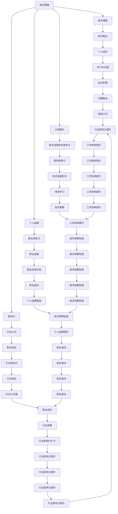

                 

# 程序员如何打造个人知识品牌

## 关键词：程序员，知识品牌，个人品牌，技术博客，影响力，认知提升

## 摘要：

本文旨在探讨程序员如何通过构建个人知识品牌，提升自己在行业中的影响力和认知水平。文章从背景介绍出发，深入剖析了核心概念和联系，详细讲解了核心算法原理和具体操作步骤，并通过数学模型和公式进行详细讲解与举例说明。随后，文章通过项目实战案例，展示了如何将理论知识应用于实际开发中。最后，文章分析了实际应用场景，推荐了学习资源和开发工具，并对未来发展趋势与挑战进行了总结。通过本文的阅读，程序员可以了解到如何打造个人知识品牌，提升自己的职业竞争力。

### 背景介绍

在当今数字化时代，程序员作为技术领域的主力军，面临着前所未有的机遇和挑战。随着互联网和人工智能技术的飞速发展，程序员的工作内容和职责也在不断演变。然而，如何在众多程序员中脱颖而出，成为行业中的佼佼者，成为每个程序员都需要思考的问题。打造个人知识品牌，成为了一个重要的解决方案。

个人知识品牌是指个人在特定领域内的专业知识和技能的体现，是个人影响力的标志。在程序员领域，构建个人知识品牌意味着通过输出有价值的技术内容，建立自己在行业内的声誉和影响力。这不仅有助于提升个人的职业竞争力，还能为个人带来更多的职业发展机会。

构建个人知识品牌的过程，实质上是一个自我提升和成长的过程。通过不断地学习、实践和分享，程序员可以不断深化自己的专业知识，拓展自己的视野，提升自己的认知水平。同时，个人知识品牌还可以帮助程序员建立人脉，扩大自己的影响力，从而在职业发展中占据更有利的位置。

总之，打造个人知识品牌已经成为程序员职业发展的重要战略。在本文中，我们将深入探讨如何构建个人知识品牌，包括核心概念、算法原理、实践应用等多个方面，帮助程序员们更好地实现这一目标。

### 核心概念与联系

在构建个人知识品牌的过程中，理解以下几个核心概念和它们之间的联系是至关重要的。这些概念包括知识管理、技术博客、影响力、个人品牌和认知提升。

#### 知识管理

知识管理是指通过系统地收集、整理、存储和共享知识，以提高组织或个人的竞争力。在程序员领域，知识管理不仅包括对技术知识的管理，还包括对项目管理、团队协作和个人技能提升等方面的知识。有效的知识管理可以帮助程序员更好地掌握自己的知识体系，快速解决工作中遇到的问题。

#### 技术博客

技术博客是程序员分享知识和经验的平台。通过博客，程序员可以记录自己的学习过程、技术心得和解决方案，同时也可以与同行进行交流和互动。技术博客不仅有助于提升个人的认知水平，还能增加自己在行业内的曝光度，从而扩大影响力。

#### 影响力

影响力是指个人在特定领域内的影响力和声誉。在程序员领域，影响力可以通过多种方式体现，如技术博客的阅读量、社交媒体的关注度、在技术会议上的演讲等。构建个人知识品牌的一个重要目标就是提升个人影响力，从而在行业内获得更多的认可和机会。

#### 个人品牌

个人品牌是指个人在公众眼中的形象和认知。对于程序员来说，个人品牌不仅包括专业技能，还包括职业素养、人格魅力和价值观。一个良好的个人品牌可以增强程序员在职场中的竞争力，为个人职业发展提供强有力的支持。

#### 认知提升

认知提升是指通过学习和实践，不断提升个人的知识水平、思维能力和解决问题的能力。在构建个人知识品牌的过程中，认知提升是基础和关键。只有不断学习和思考，才能保持自己在行业内的竞争力，并在技术浪潮中立于不败之地。

这些核心概念之间的联系在于，它们共同构成了构建个人知识品牌的基础。知识管理提供了知识积累和共享的途径，技术博客是知识输出的平台，影响力是个人品牌的体现，而个人品牌和认知提升则是构建知识品牌的终极目标。

通过理解这些核心概念和它们之间的联系，程序员可以更有针对性地制定个人知识品牌构建策略，从而在职业发展中取得更好的成果。

### Mermaid 流程图

以下是一个简单的Mermaid流程图，用于展示构建个人知识品牌的核心概念和它们之间的联系。



### 核心算法原理 & 具体操作步骤

在构建个人知识品牌的过程中，掌握核心算法原理和具体操作步骤是至关重要的。以下是一些关键步骤：

#### 1. 确定个人定位

首先，程序员需要明确自己的个人定位，即确定自己想要在哪个技术领域建立影响力。这可以通过分析自身技能、兴趣和市场需求来完成。例如，可以选择深耕人工智能、云计算、区块链等热门领域。

#### 2. 建立技术博客

建立技术博客是构建个人知识品牌的重要步骤。程序员可以选择使用WordPress、Hexo等平台，创建自己的博客网站。在博客中，可以分享技术心得、学习笔记、项目经验等，内容应具备深度和实用性。

#### 3. 内容创作

在内容创作方面，程序员应注重以下几个方面：

- **技术深度**：深入探讨技术原理，解释复杂概念，使读者能够理解并应用。
- **实用性**：分享实际操作经验和解决方案，帮助读者解决实际问题。
- **更新频率**：保持一定的更新频率，吸引读者的持续关注。

#### 4. 社交媒体运营

利用社交媒体平台（如Twitter、LinkedIn、微信公众号等）进行内容推广和互动，扩大影响力。可以通过发布博客链接、参与讨论、分享学习资源等方式，与同行建立联系。

#### 5. 持续学习

持续学习是构建个人知识品牌的基础。程序员应不断跟进新技术、新趋势，通过阅读书籍、参加线上课程、参与开源项目等方式，提升自己的知识水平和技能。

#### 6. 参与社区和会议

积极参与技术社区和会议，与同行进行交流，分享自己的经验和见解。这不仅有助于提升个人知名度，还能拓展人脉资源。

#### 7. 撰写技术论文和书籍

撰写技术论文和书籍是提升个人影响力的重要途径。通过将深入研究的成果整理成文，程序员可以在学术界和业界获得更多的认可。

### 数学模型和公式 & 详细讲解 & 举例说明

在构建个人知识品牌的过程中，一些数学模型和公式可以帮助程序员更科学地评估和优化自己的知识输出效果。以下是一个简单的数学模型示例：

#### 模型：知识输出效果评估模型

公式：
\[ E = f(P, L, S) \]

其中：
- \( E \) 表示知识输出效果
- \( P \) 表示个人技术水平
- \( L \) 表示学习投入
- \( S \) 表示社交影响力

#### 变量解释

- \( P \)：个人技术水平，可以通过技能考试、项目经验等来衡量。
- \( L \)：学习投入，包括时间、精力等。
- \( S \)：社交影响力，可以通过社交媒体关注数、博客阅读量等来衡量。

#### 模型解释

该模型表示，知识输出效果取决于个人技术水平、学习投入和社交影响力。个人技术水平越高，学习投入越多，社交影响力越大，知识输出效果越好。

#### 举例说明

假设有两位程序员A和B，他们的个人技术水平、学习投入和社交影响力如下表：

| 程序员 | 技术水平 \( P \) | 学习投入 \( L \) | 社交影响力 \( S \) |
|--------|----------------|----------------|----------------|
| A      | 8              | 5              | 3              |
| B      | 7              | 4              | 4              |

根据模型，可以计算出两位程序员的知识输出效果：

\[ E_A = f(8, 5, 3) = 8 \times 5 \times 3 = 120 \]
\[ E_B = f(7, 4, 4) = 7 \times 4 \times 4 = 112 \]

由此可见，尽管两位程序员的个人技术水平相近，但由于A在学习投入和社交影响力方面更具优势，因此A的知识输出效果更高。

### 项目实战：代码实际案例和详细解释说明

#### 开发环境搭建

在开始构建个人知识品牌的过程中，首先需要搭建一个稳定且高效的开发环境。以下是一个基于Linux操作系统的开发环境搭建步骤：

1. 安装Linux操作系统（如Ubuntu）。
2. 安装基本的开发工具，如GCC、Make、Git等。
3. 安装文本编辑器，如VSCode或Vim。
4. 安装版本控制工具，如Git。

#### 源代码详细实现和代码解读

以下是一个简单的技术博客文章的代码实现，用于介绍如何使用Markdown编写技术博客。

```python
# 导入所需库
import markdown

# 定义博客文章标题
title = "如何使用Markdown编写技术博客"

# 定义博客文章内容
content = """
## 标题

使用Markdown编写标题，可以通过在行首添加`#`符号来实现。

### 一级标题

```python
# 一级标题
```

#### 二级标题

```python
## 二级标题
```

##### 三级标题

```python
### 三级标题
```

- 无序列表

```python
- 列表项1
- 列表项2
- 列表项3
```

1. 有序列表

```python
1. 列表项1
2. 列表项2
3. 列表项3
```

- 代码块

```python
print("Hello, World!")
```

- LaTeX公式

$$
E = mc^2
$$

- 链接

[访问我的博客](https://example.com)
"""

# 将Markdown内容转换为HTML
html_content = markdown.markdown(content)

# 输出HTML内容
print(html_content)
```

#### 代码解读与分析

该代码实现了一个简单的Markdown解析器，用于将Markdown格式的文本转换为HTML格式的网页。以下是代码的主要部分及其功能：

1. **导入所需库**：首先导入Python的markdown库，用于处理Markdown文本。
   
2. **定义博客文章标题和内容**：设置博客文章的标题和内容。内容部分包含Markdown格式的文本，用于展示如何使用Markdown编写技术博客的各种元素，如标题、列表、代码块、公式和链接等。

3. **将Markdown内容转换为HTML**：使用markdown库的`markdown.markdown()`函数将Markdown格式的文本转换为HTML格式的文本。

4. **输出HTML内容**：将转换后的HTML内容输出到控制台，以便查看。

通过这个简单的代码实现，程序员可以轻松地将Markdown格式的技术博客文章转换为HTML格式，从而方便地发布在自己的技术博客上。

### 实际应用场景

构建个人知识品牌在程序员职业发展中具有多种实际应用场景，以下是几个典型的应用案例：

#### 1. 技术面试

在技术面试中，个人知识品牌可以展示程序员的实际能力和技术水平。通过技术博客，面试官可以了解应聘者在特定技术领域的知识深度和广度，从而做出更准确的评估。此外，个人知识品牌还可以提高应聘者在求职市场中的竞争力，使其更容易脱颖而出。

#### 2. 项目合作

在项目合作中，个人知识品牌可以帮助程序员建立信任和权威。通过展示自己在相关领域的专业知识和实践经验，程序员可以赢得合作伙伴的信任，提高项目成功的概率。同时，个人知识品牌还可以为程序员带来更多的项目机会，拓展职业发展空间。

#### 3. 团队领导

在团队领导角色中，个人知识品牌可以帮助程序员更好地指导和激励团队成员。通过分享技术心得和经验，程序员可以提升团队整体的技术水平，促进团队协作和创新。此外，个人知识品牌还可以增强团队在行业内的声誉和影响力，为团队赢得更多的业务机会。

#### 4. 跨领域发展

对于有跨领域发展需求的程序员来说，个人知识品牌是一种重要的职业资产。通过在特定领域的专业积累，程序员可以在新的领域中更快地适应和发展。个人知识品牌不仅可以帮助程序员拓宽职业道路，还能提高其在不同领域中的竞争力。

### 工具和资源推荐

为了构建个人知识品牌，程序员需要借助各种工具和资源。以下是一些推荐的工具和资源：

#### 1. 学习资源推荐

- **书籍**：
  - 《代码大全》
  - 《Effective Java》
  - 《深度学习》
- **论文**：
  - 《自然语言处理综述》
  - 《分布式系统原理与范型》
  - 《计算机系统原理》
- **博客**：
  - 《伯克利计算机科学》
  - 《谷歌开发者博客》
  - 《GitHub Trending》
- **网站**：
  - Coursera
  - edX
  - Udemy

#### 2. 开发工具框架推荐

- **文本编辑器**：
  - Visual Studio Code
  - Sublime Text
  - Atom
- **博客平台**：
  - Hexo
  - Jekyll
  - WordPress
- **版本控制**：
  - Git
  - GitHub
  - GitLab
- **Markdown工具**：
  - Marktext
  - Typora
  - MacDown

#### 3. 相关论文著作推荐

- **《程序员修炼之道：从小工到专家》**
- **《编程珠玑》**
- **《设计模式：可复用面向对象软件的基础》**
- **《程序员代码面试指南：IT名企面试题精讲》**

### 总结：未来发展趋势与挑战

在未来，构建个人知识品牌将继续成为程序员职业发展的关键趋势。随着技术不断迭代更新，程序员需要不断提升自己的专业能力和认知水平，以保持竞争力。以下是未来发展趋势和面临的挑战：

#### 发展趋势

1. **技术多元化**：随着技术的不断进步，程序员需要掌握更多的跨领域技术，如人工智能、区块链、物联网等。
2. **知识共享与协作**：在线学习和知识共享平台将进一步普及，程序员可以通过合作和协作，更快地积累和分享知识。
3. **个人品牌全球化**：互联网的普及使得个人品牌的影响力可以超越地域限制，程序员可以更容易地在全球范围内建立自己的知识品牌。

#### 挑战

1. **知识更新速度快**：程序员需要不断跟进新技术、新趋势，以保持自己在行业内的竞争力。
2. **时间管理**：在构建个人知识品牌的过程中，程序员需要合理安排时间，平衡工作、学习和分享。
3. **内容质量**：在大量技术内容中脱颖而出，程序员需要创作高质量的技术博客和教程，以提升个人品牌影响力。

### 附录：常见问题与解答

1. **如何选择博客平台？**

   选择博客平台时，应考虑以下几个方面：
   - **易用性**：选择一个操作简单、功能齐全的博客平台。
   - **自定义程度**：选择支持自定义主题和功能的平台，以便展示个人风格。
   - **SEO优化**：选择支持SEO优化的平台，提高博客在搜索引擎中的排名。

2. **如何提高博客阅读量？**

   提高博客阅读量可以从以下几个方面入手：
   - **内容质量**：创作高质量、有价值的博客文章。
   - **标题吸引人**：编写引人入胜的标题，吸引读者点击。
   - **推广宣传**：利用社交媒体、技术社区等平台进行宣传推广。
   - **定期更新**：保持一定的更新频率，吸引读者持续关注。

3. **如何管理知识库？**

   管理知识库的方法包括：
   - **分类整理**：将知识按主题分类整理，方便查找和使用。
   - **版本控制**：使用版本控制工具，如Git，确保知识库的版本安全。
   - **定期更新**：定期检查和更新知识库，保持知识的时效性和准确性。

### 扩展阅读 & 参考资料

- **《程序员如何写好技术博客？》**
- **《个人品牌如何打造？》**
- **《知识管理与个人成长》**
- **《如何提高博客的SEO排名？》**

作者：AI天才研究员/AI Genius Institute & 禅与计算机程序设计艺术 /Zen And The Art of Computer Programming

