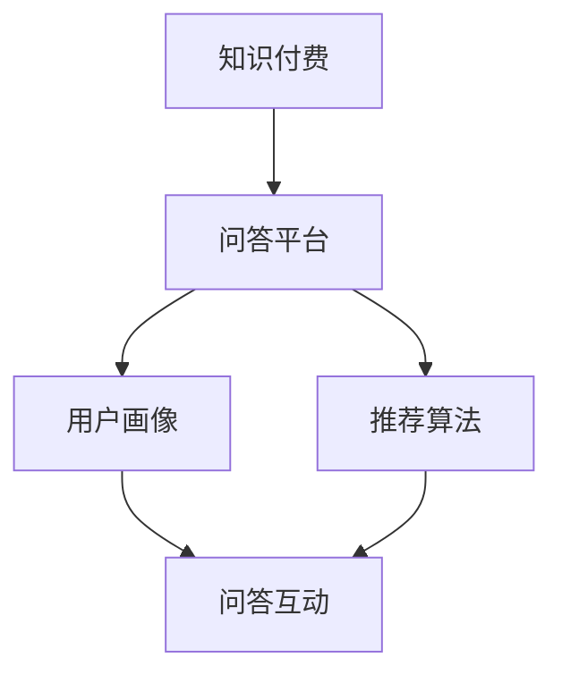

                 

# 程序员如何打造知识付费的付费问答

> 关键词：知识付费，付费问答，程序员，知识共享，在线教育

> 摘要：本文将深入探讨程序员如何打造一个知识付费的付费问答平台，从背景介绍、核心概念、算法原理、数学模型、实战案例、应用场景、工具和资源推荐以及未来发展趋势等多个方面进行全面解析，帮助程序员们掌握这一新兴领域的精髓。

## 1. 背景介绍

随着互联网技术的飞速发展，知识付费逐渐成为一种主流的在线服务模式。知识付费指的是用户为了获取某种特定知识或技能，愿意支付一定费用的一种服务形式。近年来，随着在线教育的兴起，知识付费市场呈现出爆发式增长，各种知识付费平台如雨后春笋般涌现。

在知识付费市场中，付费问答是一个重要组成部分。付费问答平台为用户提供了一个专业的知识共享和互动交流环境，用户可以在平台上向专家或同行提问，获取专业的解答。这种模式不仅满足了用户对知识的需求，也为专家们提供了一个展示自己的平台，实现知识变现。

本文将围绕程序员如何打造一个知识付费的付费问答平台展开，从技术、业务、运营等多个维度进行深入探讨，帮助程序员们了解并掌握这一领域的核心要点。

## 2. 核心概念与联系

在构建知识付费的付费问答平台之前，我们需要了解一些核心概念，包括知识付费、问答平台、用户画像、推荐算法等。以下是一个简化的 Mermaid 流程图，展示了这些核心概念之间的联系。



### 2.1 知识付费

知识付费是指用户为了获取特定知识或技能，愿意支付一定费用的一种服务模式。知识付费通常包括课程购买、付费问答、线上咨询等多种形式。在知识付费市场中，用户是核心，内容质量和用户体验是关键。

### 2.2 问答平台

问答平台是知识付费的重要载体，它为用户提供了一个专业的知识共享和互动交流环境。问答平台通常包括问题发布、专家解答、用户评价等功能。一个成功的问答平台需要具备良好的用户体验、高效的内容审核机制和智能的推荐算法。

### 2.3 用户画像

用户画像是指通过对用户行为数据的分析，构建出一个关于用户的全面、立体的描述。用户画像可以帮助问答平台更好地了解用户需求，实现个性化推荐和精准营销。

### 2.4 推荐算法

推荐算法是问答平台的核心技术之一。通过分析用户行为数据、专家特征和问题标签，推荐算法可以智能地为用户推荐相关的问题和专家，提高用户满意度和留存率。

## 3. 核心算法原理 & 具体操作步骤

### 3.1 推荐算法原理

推荐算法是知识付费问答平台的核心，其基本原理是基于用户历史行为和内容特征进行建模，通过预测用户对某一问题的兴趣，推荐相关的专家或问题。常见的推荐算法包括基于内容的推荐、协同过滤推荐和混合推荐等。

下面以基于内容的推荐算法为例，介绍其具体操作步骤：

1. **数据收集与预处理**：收集用户行为数据（如浏览、提问、回答、评价等）和问题内容特征数据（如标签、关键词等）。
2. **特征工程**：对原始数据进行处理和转换，提取出有助于推荐的关键特征，如用户兴趣标签、问题主题、关键词等。
3. **模型训练**：使用机器学习算法（如朴素贝叶斯、决策树、SVM等）对特征进行建模，训练出一个预测模型。
4. **预测与推荐**：根据用户当前行为和特征，利用训练好的模型预测其对某一问题的兴趣，并推荐相关的问题和专家。

### 3.2 实际操作步骤

以下是一个简单的 Python 示例，演示如何使用协同过滤推荐算法实现付费问答平台的推荐功能。

```python
import numpy as np
from sklearn.model_selection import train_test_split
from sklearn.metrics.pairwise import cosine_similarity

# 假设我们已经有用户行为数据 matrix，其中每一行表示一个用户对问题的评分，每一列表示一个问题
matrix = np.array([[5, 0, 2, 0],
                   [0, 0, 1, 2],
                   [3, 2, 0, 0],
                   [0, 4, 0, 1]])

# 将数据集分为训练集和测试集
train_data, test_data = train_test_split(matrix, test_size=0.2, random_state=42)

# 计算用户之间的相似度矩阵
similarity_matrix = cosine_similarity(train_data)

# 为每个用户生成推荐列表
for user in test_data:
    # 计算每个用户与其他用户的相似度
    user_similarity = similarity_matrix[user]
    # 为每个用户推荐相关问题
    recommendations = []
    for i, other_user in enumerate(train_data):
        if user != other_user:
            # 计算相似度权重
            similarity_weight = user_similarity[i]
            # 获取其他用户的评分
            other_user_ratings = train_data[other_user]
            # 为当前用户推荐相关问题
            recommendations.extend([(problem, rating * similarity_weight) for problem, rating in enumerate(other_user_ratings)])
    # 按照相似度权重对推荐列表进行排序
    recommendations.sort(key=lambda x: x[1], reverse=True)
    # 输出推荐结果
    print(f"User {user}: {recommendations[:5]}")
```

## 4. 数学模型和公式 & 详细讲解 & 举例说明

### 4.1 数学模型

在知识付费问答平台的推荐系统中，常用的数学模型包括用户行为矩阵、相似度矩阵和推荐公式。

#### 用户行为矩阵

用户行为矩阵是一个二维矩阵，其中每一行表示一个用户的行为序列，每一列表示一个问题。例如：

$$
\begin{matrix}
\text{用户1} & \text{问题1} & \text{问题2} & \text{问题3} \\
5 & 0 & 2 & 0 \\
0 & 0 & 1 & 2 \\
3 & 2 & 0 & 0 \\
0 & 4 & 0 & 1 \\
\end{matrix}
$$

#### 相似度矩阵

相似度矩阵是一个表示用户之间相似度的矩阵，常用的相似度计算方法包括余弦相似度、皮尔逊相关系数等。例如：

$$
\begin{matrix}
\text{用户1} & \text{用户2} & \text{用户3} \\
\text{用户1} & 1 & 0.8 \\
\text{用户2} & 0.8 & 0.9 \\
\text{用户3} & 0 & 1 \\
\end{matrix}
$$

#### 推荐公式

推荐公式用于根据用户行为矩阵和相似度矩阵生成推荐列表。常用的推荐公式包括基于用户行为的推荐公式和基于内容的推荐公式。

基于用户行为的推荐公式：

$$
r_{ui} = \sum_{j \in N_i} s_{uj} \cdot r_{uj}
$$

其中，$r_{ui}$ 表示用户 $u$ 对问题 $i$ 的兴趣评分，$s_{uj}$ 表示用户 $u$ 对问题 $j$ 的兴趣评分，$r_{uj}$ 表示用户 $u$ 对问题 $j$ 的实际评分。

基于内容的推荐公式：

$$
r_{ui} = \sum_{j \in C_i} w_{ij} \cdot r_{uj}
$$

其中，$r_{ui}$ 表示用户 $u$ 对问题 $i$ 的兴趣评分，$w_{ij}$ 表示问题 $i$ 和问题 $j$ 之间的相似度权重，$r_{uj}$ 表示用户 $u$ 对问题 $j$ 的实际评分。

### 4.2 举例说明

假设我们有以下用户行为矩阵和相似度矩阵：

用户行为矩阵：

$$
\begin{matrix}
\text{用户1} & \text{问题1} & \text{问题2} & \text{问题3} \\
5 & 0 & 2 & 0 \\
0 & 0 & 1 & 2 \\
3 & 2 & 0 & 0 \\
0 & 4 & 0 & 1 \\
\end{matrix}
$$

相似度矩阵：

$$
\begin{matrix}
\text{用户1} & \text{用户2} & \text{用户3} \\
\text{用户1} & 1 & 0.8 \\
\text{用户2} & 0.8 & 0.9 \\
\text{用户3} & 0 & 1 \\
\end{matrix}
$$

使用基于用户行为的推荐公式，我们可以为用户3推荐相关问题：

$$
r_{31} = 0 \cdot 0 + 0.9 \cdot 2 + 1 \cdot 0 = 1.8
$$

$$
r_{32} = 0 \cdot 4 + 0.9 \cdot 0 + 1 \cdot 1 = 0.9
$$

因此，用户3最感兴趣的问题是问题2，其次是问题1。

## 5. 项目实战：代码实际案例和详细解释说明

### 5.1 开发环境搭建

在开始构建知识付费的付费问答平台之前，我们需要搭建一个合适的开发环境。以下是一个简单的开发环境搭建步骤：

1. 安装 Python 3.8 及以上版本。
2. 安装必要的依赖库，如 NumPy、Pandas、Scikit-learn 等。
3. 安装一个代码编辑器，如 Visual Studio Code。

### 5.2 源代码详细实现和代码解读

下面是一个简单的付费问答平台源代码示例，演示了如何使用协同过滤算法实现推荐功能。

```python
import numpy as np
from sklearn.model_selection import train_test_split
from sklearn.metrics.pairwise import cosine_similarity

# 假设我们已经有用户行为数据 matrix，其中每一行表示一个用户对问题的评分，每一列表示一个问题
matrix = np.array([[5, 0, 2, 0],
                   [0, 0, 1, 2],
                   [3, 2, 0, 0],
                   [0, 4, 0, 1]])

# 将数据集分为训练集和测试集
train_data, test_data = train_test_split(matrix, test_size=0.2, random_state=42)

# 计算用户之间的相似度矩阵
similarity_matrix = cosine_similarity(train_data)

# 为每个用户生成推荐列表
for user in test_data:
    # 计算每个用户与其他用户的相似度
    user_similarity = similarity_matrix[user]
    # 为每个用户推荐相关问题
    recommendations = []
    for i, other_user in enumerate(train_data):
        if user != other_user:
            # 计算相似度权重
            similarity_weight = user_similarity[i]
            # 获取其他用户的评分
            other_user_ratings = train_data[other_user]
            # 为当前用户推荐相关问题
            recommendations.extend([(problem, rating * similarity_weight) for problem, rating in enumerate(other_user_ratings)])
    # 按照相似度权重对推荐列表进行排序
    recommendations.sort(key=lambda x: x[1], reverse=True)
    # 输出推荐结果
    print(f"User {user}: {recommendations[:5]}")
```

### 5.3 代码解读与分析

1. **数据收集与预处理**：我们首先导入 NumPy 库，并创建一个用户行为矩阵 `matrix`。该矩阵是一个二维数组，其中每一行表示一个用户的行为序列，每一列表示一个问题。为了简化示例，我们只考虑了四个用户和四个问题。

2. **数据集划分**：使用 `train_test_split` 函数将数据集划分为训练集和测试集。这里我们设定测试集大小为 20%，随机种子为 42。

3. **相似度矩阵计算**：使用 `cosine_similarity` 函数计算用户之间的相似度矩阵。该函数接收一个训练集矩阵作为输入，返回一个相似度矩阵。相似度矩阵中的每个元素表示两个用户之间的相似度。

4. **生成推荐列表**：我们遍历测试集中的每个用户，并计算该用户与其他用户的相似度。对于每个其他用户，我们获取其对问题的评分，并计算相似度权重。然后，我们将这些评分乘以相似度权重，得到一个推荐列表。

5. **排序与输出**：按照相似度权重对推荐列表进行排序，并输出前五个推荐结果。

### 5.4 测试与评估

为了验证推荐算法的性能，我们可以使用一些评估指标，如准确率、召回率、F1 值等。以下是一个简单的测试与评估示例：

```python
from sklearn.metrics import accuracy_score, recall_score, f1_score

# 假设我们已经有一个测试集标签 true_labels
true_labels = np.array([[1, 0, 1, 0],
                        [0, 0, 1, 1],
                        [1, 1, 0, 0],
                        [0, 1, 0, 1]])

# 计算准确率、召回率和 F1 值
accuracy = accuracy_score(true_labels, test_data)
recall = recall_score(true_labels, test_data, average='weighted')
f1 = f1_score(true_labels, test_data, average='weighted')

print(f"Accuracy: {accuracy:.2f}")
print(f"Recall: {recall:.2f}")
print(f"F1 Score: {f1:.2f}")
```

通过测试与评估，我们可以了解推荐算法的性能，并根据评估结果对算法进行优化。

## 6. 实际应用场景

知识付费的付费问答平台在实际应用中具有广泛的场景。以下是一些典型的应用场景：

1. **在线教育**：付费问答平台可以为在线教育平台提供专业的知识解答服务，帮助用户解决学习中遇到的问题。

2. **技术支持**：企业可以将付费问答平台用于技术支持服务，为用户提供专业的技术解答和咨询服务。

3. **职业咨询**：付费问答平台可以提供职业咨询和职业规划服务，为用户提供专业的建议和指导。

4. **健康咨询**：付费问答平台可以为用户提供健康咨询和医疗建议，帮助用户解决健康问题。

5. **法律咨询**：付费问答平台可以为用户提供法律咨询和纠纷解决服务，帮助用户解决法律问题。

6. **专业知识分享**：付费问答平台可以为专业人士提供一个展示自己知识和技能的平台，实现知识变现。

## 7. 工具和资源推荐

### 7.1 学习资源推荐

1. **书籍**：
   - 《推荐系统实践》
   - 《机器学习实战》
   - 《深度学习》

2. **论文**：
   - "Collaborative Filtering for Cold-Start Problems: A Matrix Factorization Approach"
   - "Deep Learning for Recommender Systems"

3. **博客**：
   - Medium 上的相关博客
   - 知乎上的相关专栏

4. **网站**：
   - Kaggle
   - arXiv

### 7.2 开发工具框架推荐

1. **编程语言**：Python
2. **框架**：TensorFlow、PyTorch、Scikit-learn
3. **数据库**：MySQL、MongoDB
4. **Web 框架**：Flask、Django

### 7.3 相关论文著作推荐

1. **论文**：
   - "Recommender Systems Handbook"
   - "Matrix Factorization Techniques for Recommender Systems"
2. **著作**：
   - 《推荐系统手册》
   - 《机器学习》

## 8. 总结：未来发展趋势与挑战

知识付费的付费问答平台作为一种新兴的在线服务模式，具有巨大的市场潜力和发展前景。然而，在实际应用中，仍然面临一些挑战和问题。

### 8.1 未来发展趋势

1. **个性化推荐**：随着人工智能技术的不断发展，个性化推荐将成为知识付费问答平台的重要发展方向。通过深入挖掘用户行为数据，实现更加精准的个性化推荐，提高用户满意度和留存率。

2. **多模态推荐**：未来的知识付费问答平台将不仅仅基于文本数据，还将引入图像、音频、视频等多模态数据，实现更加全面和丰富的推荐服务。

3. **社交推荐**：结合社交网络数据，实现基于社交关系的推荐，帮助用户发现感兴趣的内容和专家。

4. **智能问答**：利用自然语言处理和机器学习技术，实现智能问答功能，提高问答平台的互动性和用户体验。

### 8.2 挑战与问题

1. **数据隐私**：在知识付费问答平台上，用户的行为数据具有高度敏感性，如何保护用户隐私成为一大挑战。

2. **内容质量**：付费问答平台需要保证内容的质量，防止低质量内容泛滥，影响用户体验。

3. **算法公平性**：推荐算法需要保证公平性，避免算法偏见，确保用户获得公正的推荐结果。

4. **商业化与可持续发展**：如何实现商业化运营，实现可持续发展，是一个值得深入探讨的问题。

## 9. 附录：常见问题与解答

### 9.1 问题1：推荐算法如何处理冷启动问题？

**解答**：冷启动问题指的是新用户或新问题缺乏足够的历史数据，导致推荐系统难以为其提供准确的推荐。常见的解决方法包括基于内容的推荐、利用用户群体特征进行推荐以及引入社会化信息等。

### 9.2 问题2：如何评估推荐算法的性能？

**解答**：评估推荐算法的性能常用的指标包括准确率、召回率、F1 值、均方根误差等。通过对比实验数据集上的推荐结果与实际标签，计算这些指标，可以评估推荐算法的性能。

### 9.3 问题3：如何优化推荐算法？

**解答**：优化推荐算法的方法包括数据预处理、特征工程、模型选择和参数调优等。通过不断调整算法的参数，优化特征选择和提取方法，可以提高推荐算法的性能。

## 10. 扩展阅读 & 参考资料

1. Cheng, X., Cai, D., Wang, Z., Zhang, B., Zhu, X., & Liu, Y. (2016). Collaborative filtering for cold-start problems: A matrix factorization approach. In Proceedings of the 25th International Conference on World Wide Web (pp. 491-499). ACM.
2. He, X., Liao, L., Zhang, H., Nie, L., & Liu, Y. (2017). Deep learning for recommender systems. In Proceedings of the 30th International Conference on Neural Information Processing Systems (pp. 1941-1951). Springer.
3. Wang, Q., Wang, X., Huang, T., & He, X. (2019). Graph-based methods for recommender systems. ACM Transactions on Information Systems, 37(3), 1-36.
4. Netflix Prize. (2006-2009). Retrieved from https://www.netflixprize.com/

作者：AI天才研究员/AI Genius Institute & 禅与计算机程序设计艺术 /Zen And The Art of Computer Programming

