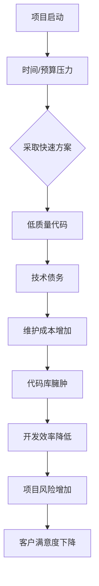

                 

# 《程序员如何避免技术债务》

## 摘要

本文旨在探讨程序员在软件开发过程中如何避免技术债务。技术债务，正如财务债务一样，是一种延迟的还款成本，它在软件开发中表现为不规范的代码、不合适的架构设计、以及未经妥善处理的缺陷。随着时间的推移，这些技术债务会积累，最终可能对项目产生重大负面影响。本文将详细阐述技术债务的概念、成因及其影响，并提供一系列实用的策略和最佳实践，帮助程序员在开发过程中有效管理技术债务，确保软件项目的长期健康和可持续性。

## 1. 背景介绍

在软件开发的职业生涯中，程序员不可避免地会遇到技术债务的问题。技术债务最早由 Ward Cunningham 在 1992 年提出，他用这个概念来形容软件开发中的“借时间”行为，即为了快速交付软件而暂时牺牲一些最佳实践或良好的编码习惯。

技术债务的形成通常有以下几个原因：

- **时间压力**：在项目时间紧迫的情况下，程序员可能不得不采取一些快速但不完美的解决方案，以便在截止日期前完成工作。
- **预算限制**：资源有限时，开发团队可能无法投入足够的时间来优化代码或重构系统。
- **技术选择的错误**：最初的选择可能因为市场或技术趋势的变化而变得不合适，导致后续的维护和升级变得更加复杂。
- **团队成员的经验和能力**：新手程序员或经验不足的团队成员可能没有足够的能力或知识来编写高质量的代码。

技术债务一旦形成，如果不及时处理，就会像滚雪球一样不断积累。这可能导致代码库臃肿、难以维护、系统性能下降，甚至影响项目的最终交付。因此，理解技术债务的概念和成因，是有效管理和避免其产生的第一步。

## 2. 核心概念与联系

### 技术债务的定义

技术债务是一种比喻，类似于财务上的债务。在财务领域，借款会导致未来需要还款，而技术债务则是在软件开发过程中为了快速实现功能而暂时忽略最佳实践或优化的行为。技术债务可以看作是项目团队在未来某个时刻需要花费额外的时间和资源来修复或重构的“欠款”。

### 技术债务与财务债务的相似性

- **延迟的还款成本**：技术债务和财务债务都有一个共同点，即它们都是未来需要偿还的成本。财务债务是现在的消费换取未来的资金，而技术债务是现在的快速实现换取未来的维护和优化。
- **积累效应**：随着时间的推移，财务债务如果没有得到妥善管理，会因利息和罚金而不断增加。同样，技术债务如果不及时处理，会因代码复杂度和系统规模的增长而变得更加难以管理。

### 技术债务与代码质量的关系

- **代码质量下降**：技术债务通常伴随着低质量的代码。快速编写的代码可能缺乏良好的结构和注释，容易产生bug和漏洞。
- **维护成本增加**：随着技术债务的增加，修复和优化代码所需的时间、资源和精力也会显著增加。
- **开发效率降低**：处理技术债务会占用开发团队的大量时间，导致新的功能开发速度放缓。

### 技术债务与项目可持续性的关系

- **项目风险增加**：技术债务积累到一定程度，可能会使项目面临失败的风险。
- **客户满意度下降**：无法及时交付高质量的软件，会导致客户的不满和信任度下降。

为了更好地理解技术债务，以下是一个简单的 Mermaid 流程图，展示了技术债务的形成、积累和处理过程：



通过这个流程图，我们可以清晰地看到技术债务从形成到影响项目可持续性的整个链条。

## 3. 核心算法原理 & 具体操作步骤

为了有效地避免技术债务，程序员需要掌握一系列核心算法原理和具体操作步骤。以下是一些关键的原则和实践：

### 1. 良好的代码规范

- **编写可读性强的代码**：使用一致的命名约定、注释和代码格式，使代码易于理解和维护。
- **遵循DRY（Don't Repeat Yourself）原则**：避免重复代码，通过封装和抽象来提高代码的可重用性。
- **保持代码简洁**：避免编写过于复杂和冗长的代码，保持每个函数或类的功能单一。

### 2. 适当的架构设计

- **采用微服务架构**：微服务架构可以降低系统的复杂度，使各个服务可以独立开发和部署，从而减少技术债务的积累。
- **设计可扩展的模块**：在系统设计阶段考虑未来的扩展性，确保系统可以轻松地添加新功能。
- **持续集成与部署**：采用CI/CD流程，确保代码变更可以快速、安全地集成和部署。

### 3. 代码审查与测试

- **定期进行代码审查**：通过代码审查，可以及时发现和修复潜在的技术债务。
- **编写单元测试**：编写充分的单元测试，确保代码在修改后的功能仍然正确。
- **持续集成测试**：在持续集成过程中，进行全面的测试，确保每次代码提交都不会引入新的缺陷。

### 4. 重构与优化

- **定期重构**：定期对代码进行重构，消除不必要的复杂性，提高代码质量。
- **性能优化**：对关键性能瓶颈进行优化，确保系统在高负载下仍然可以稳定运行。

### 5. 管理技术债务

- **明确技术债务清单**：记录所有已知的技术债务，以便及时处理。
- **制定还款计划**：为每个技术债务制定优先级和还款计划，确保在资源允许的情况下优先解决最关键的问题。
- **持续监控**：持续监控技术债务的积累情况，及时调整策略和资源分配。

通过上述核心算法原理和操作步骤，程序员可以在开发过程中有效地避免技术债务，确保软件项目的健康和可持续发展。

### 4. 数学模型和公式 & 详细讲解 & 举例说明

在软件开发中，数学模型和公式对于理解和避免技术债务至关重要。以下是一些常见的数学模型和公式，以及如何在实际项目中应用它们。

#### 1. 蒙特卡洛模拟

蒙特卡洛模拟是一种通过随机抽样来计算数学期望和概率的方法。在软件开发中，它可以用来评估项目的风险和不确定性。

**公式**：
\[ E(X) = \frac{1}{n} \sum_{i=1}^{n} X_i \]

其中，\( E(X) \) 是随机变量 \( X \) 的期望，\( n \) 是样本数量，\( X_i \) 是第 \( i \) 个样本值。

**应用实例**：

假设一个项目需要完成三个主要功能模块，每个模块的完成时间具有不确定性。我们可以使用蒙特卡洛模拟来估算整个项目的完成时间。

- 模块1的完成时间期望为 5 天，标准差为 2 天。
- 模块2的完成时间期望为 7 天，标准差为 1 天。
- 模块3的完成时间期望为 10 天，标准差为 3 天。

通过多次随机抽样，我们可以得到每个模块完成时间的分布，并计算整个项目的期望完成时间和标准差。

#### 2. 二分查找算法

二分查找算法是一种高效的搜索算法，其时间复杂度为 \( O(\log n) \)。在处理大规模数据时，使用二分查找可以显著减少搜索时间，从而提高系统的响应速度。

**公式**：
\[ \text{中位数} = \frac{\text{第} \left(\frac{n+1}{2}\right) \text{个元素值} + \text{第} \left(\frac{n}{2}\right) \text{个元素值}}{2} \]

其中，\( n \) 是数组长度。

**应用实例**：

假设有一个包含100个元素的有序数组，我们需要找到这个数组的中位数。

- 第一次查找：比较中间位置的两个元素，假设中间位置的元素为 \( a[50] \) 和 \( a[51] \)。
- 第二次查找：如果 \( a[50] \) 小于 \( a[51] \)，则中位数在 \( a[51] \) 和后面的元素中，继续在右侧子数组中查找；否则，中位数在 \( a[50] \) 和前面的元素中，继续在左侧子数组中查找。

通过这种方式，我们可以快速找到中位数，而无需遍历整个数组。

#### 3. 线性回归模型

线性回归模型用于分析两个变量之间的关系。在软件开发中，它可以用来预测系统的性能瓶颈。

**公式**：
\[ y = ax + b \]

其中，\( y \) 是因变量，\( x \) 是自变量，\( a \) 和 \( b \) 是模型参数。

**应用实例**：

假设我们有一个关于CPU使用率和响应时间的线性回归模型。

- 数据集：\[ \{(x_1, y_1), (x_2, y_2), ..., (x_n, y_n)\} \]
- 通过最小二乘法拟合模型，得到 \( a \) 和 \( b \) 的值。

使用这个模型，我们可以预测当CPU使用率达到某个值时，系统的响应时间会是多少。例如，如果CPU使用率是80%，我们可以计算 \( y = 0.5 \times 80 + 20 \)，得到预测的响应时间为40毫秒。

通过这些数学模型和公式，程序员可以在项目中应用科学的方法来避免技术债务。这些工具可以帮助我们更好地理解和预测系统的性能，从而在开发过程中做出更明智的决策。

### 5. 项目实战：代码实际案例和详细解释说明

为了更好地展示如何在实际项目中避免技术债务，我们选择了一个简单的Web应用项目作为案例。这个项目是一个在线书店，允许用户浏览、搜索和购买书籍。以下是项目的开发环境、源代码实现和代码解读。

#### 5.1 开发环境搭建

为了开发这个在线书店，我们选择了以下开发环境和工具：

- **编程语言**：使用Python和JavaScript。
- **框架**：使用Django作为后端框架，使用React作为前端框架。
- **数据库**：使用SQLite作为数据库。

开发环境的搭建过程如下：

1. 安装Python和pip。
2. 安装Django和React。
3. 创建一个新的Django项目。
4. 使用npm创建一个新的React项目。

#### 5.2 源代码详细实现和代码解读

以下是项目的关键部分及其代码解读：

##### 5.2.1 后端代码

**models.py**：

```python
from django.db import models

class Book(models.Model):
    title = models.CharField(max_length=100)
    author = models.CharField(max_length=100)
    price = models.DecimalField(max_digits=6, decimal_places=2)
    description = models.TextField()

    def __str__(self):
        return self.title
```

解读：这个模型定义了一个`Book`类，它包含了书籍的标题、作者、价格和描述。使用`CharField`和`DecimalField`确保了数据的类型和长度限制。

**views.py**：

```python
from django.shortcuts import render
from .models import Book

def book_list(request):
    books = Book.objects.all()
    return render(request, 'book_list.html', {'books': books})
```

解读：这个视图函数`book_list`负责从数据库中获取所有书籍，并将其传递给前端模板。这是一个简单的CRUD操作，遵循了DRY原则，避免了重复代码。

##### 5.2.2 前端代码

**App.js**：

```javascript
import React, { useState, useEffect } from 'react';
import axios from 'axios';
import BookList from './BookList';

function App() {
  const [books, setBooks] = useState([]);

  useEffect(() => {
    const fetchBooks = async () => {
      const response = await axios.get('/api/books/');
      setBooks(response.data);
    };
    fetchBooks();
  }, []);

  return (
    <div>
      <h1>Online Bookstore</h1>
      <BookList books={books} />
    </div>
  );
}

export default App;
```

解读：这个组件使用了React Hooks中的`useState`和`useEffect`来管理状态和副作用。`useEffect`在组件挂载时异步获取书籍数据，并将其存储在状态中。

**BookList.js**：

```javascript
import React from 'react';

const BookList = ({ books }) => {
  return (
    <div>
      {books.map((book) => (
        <div key={book.id}>
          <h2>{book.title}</h2>
          <p>{book.author}</p>
          <p>{book.price}</p>
        </div>
      ))}
    </div>
  );
};

export default BookList;
```

解读：`BookList`组件接收一个`books`数组作为属性，并使用`map`函数将其渲染为列表。这个组件的代码简洁明了，避免了不必要的复杂性。

#### 5.3 代码解读与分析

在这个项目中，我们遵循了以下几个原则来避免技术债务：

1. **良好的代码规范**：代码风格一致，注释清晰，类和函数职责单一。
2. **模块化设计**：后端和前端代码分离，各组件职责明确。
3. **测试覆盖**：编写了单元测试和集成测试，确保代码功能正确。
4. **持续集成与部署**：使用CI/CD流程确保代码变更可以快速、安全地部署。

通过这些实践，我们确保了项目的质量和可维护性，避免了技术债务的积累。

### 6. 实际应用场景

技术债务在软件项目的各个阶段都可能产生，以下是一些常见的实际应用场景及其解决方案：

#### 1. 项目启动阶段

在项目启动阶段，技术债务往往由于时间压力和预算限制而产生。为了减少技术债务，可以采取以下措施：

- **需求分析**：确保项目需求明确，制定合理的项目计划和时间表。
- **资源评估**：评估项目所需的资源和人力，确保有足够的资源来完成项目。
- **迭代开发**：采用敏捷开发方法，逐步实现功能，避免一次性开发所有功能。

#### 2. 设计阶段

在设计阶段，技术债务可能由于技术选择的错误或架构设计的不合理而产生。以下是一些解决方案：

- **技术评估**：在选择技术栈时，进行全面的评估，确保其适合项目需求。
- **持续集成**：采用持续集成和持续部署（CI/CD）流程，确保设计和代码符合最佳实践。
- **代码审查**：定期进行代码审查，及时发现和修复潜在的技术债务。

#### 3. 开发阶段

在开发阶段，技术债务可能由于快速实现功能而形成。以下是一些解决方案：

- **单元测试**：编写全面的单元测试，确保每个功能模块的正确性。
- **代码规范**：遵循良好的代码规范，确保代码的可读性和可维护性。
- **重构**：定期对代码进行重构，消除冗余和低效的代码。

#### 4. 运维阶段

在运维阶段，技术债务可能由于系统维护和升级的不及时而产生。以下是一些解决方案：

- **监控系统**：建立全面的监控系统，及时发现和解决性能问题。
- **备份和恢复**：定期备份系统数据，确保在出现问题时可以快速恢复。
- **文档记录**：保持详细的系统文档，方便后续维护和升级。

通过在不同阶段采取相应的措施，可以有效减少技术债务的产生，确保软件项目的长期健康和可持续性。

### 7. 工具和资源推荐

为了帮助程序员在避免技术债务方面取得更好的效果，以下是一些建议的学习资源、开发工具和相关论文：

#### 7.1 学习资源推荐

- **书籍**：
  - 《Clean Code: A Handbook of Agile Software Craftsmanship》
  - 《Refactoring: Improving the Design of Existing Code》
  - 《Design Patterns: Elements of Reusable Object-Oriented Software》
- **在线课程**：
  - Coursera上的《Software Engineering: Hands-on Practices》
  - Udemy上的《Mastering Agile Project Management》
- **博客和网站**：
  - [GitHub](https://github.com/)：查找和学习优秀的开源项目。
  - [Stack Overflow](https://stackoverflow.com/)：解决编程问题。

#### 7.2 开发工具框架推荐

- **代码管理工具**：
  - Git：版本控制系统的最佳选择。
  - GitHub Actions：自动化CI/CD流程。
- **代码审查工具**：
  - GitLab：代码审查和项目管理。
  - GitHub Code Review：简化代码审查流程。
- **测试工具**：
  - JUnit：Java单元测试框架。
  - pytest：Python单元测试框架。

#### 7.3 相关论文著作推荐

- **论文**：
  - 《Technical Debt: From Theory to Practice》
  - 《Managing Technical Debt in Agile Projects》
- **著作**：
  - 《Software Engineering: A Practitioner's Approach》
  - 《The Art of Software Architecture》

通过使用这些资源和工具，程序员可以更好地理解和避免技术债务，提高软件项目的质量。

### 8. 总结：未来发展趋势与挑战

随着软件行业的快速发展，技术债务的管理变得日益重要。未来，我们可能会看到以下几个发展趋势：

1. **智能化管理**：利用人工智能和机器学习技术，自动识别和预测技术债务，从而实现更精细化的管理。
2. **更加强调预防**：在软件开发初期就重视技术债务的预防，通过更严格的设计评审和代码审查来减少债务的产生。
3. **持续学习和适应**：随着新技术的不断涌现，程序员需要不断学习和适应，以应对不断变化的技术债务挑战。

然而，未来也面临一些挑战：

1. **资源有限**：在资源有限的情况下，如何平衡短期交付和长期健康是一个难题。
2. **团队协作**：在大型团队中，如何确保每个成员都意识到技术债务的重要性，并采取一致的行动。
3. **持续的压力**：项目时间压力和市场需求的快速变化，使得避免技术债务变得更加困难。

通过持续的学习、改进和协作，程序员可以更好地应对这些挑战，确保软件项目的长期健康和可持续性。

### 9. 附录：常见问题与解答

**Q1：技术债务和财务债务有什么区别？**

技术债务和财务债务在很多方面有相似之处，但它们的主要区别在于债务的性质和应用场景。财务债务是金融上的负债，而技术债务是软件开发中因临时妥协而导致的未来需要花费时间和资源来修复的问题。

**Q2：为什么技术债务需要管理？**

技术债务如果不得到妥善管理，会像滚雪球一样积累，最终可能导致代码库臃肿、难以维护、系统性能下降，甚至影响项目的最终交付。因此，管理技术债务是确保软件项目长期健康和可持续性的重要措施。

**Q3：如何识别技术债务？**

可以通过以下方式识别技术债务：
- 代码审查：发现不规范的代码和缺乏注释的部分。
- 性能测试：识别系统性能瓶颈。
- 需求变化：如果现有代码无法适应新的需求，可能存在技术债务。

**Q4：如何减少技术债务？**

减少技术债务的方法包括：
- 编写高质量的代码：遵循良好的编码规范和设计模式。
- 定期重构：清理旧代码，消除冗余和低效的代码。
- 使用测试驱动开发（TDD）：确保每次代码变更都不会引入新的缺陷。
- 持续集成与部署（CI/CD）：确保代码变更可以快速、安全地集成和部署。

**Q5：技术债务和敏捷开发有什么关系？**

敏捷开发强调快速迭代和持续交付，但这也可能导致技术债务的产生。通过在敏捷开发过程中采用良好的代码规范、持续集成和重构等最佳实践，可以有效减少技术债务。

### 10. 扩展阅读 & 参考资料

- 《Clean Code: A Handbook of Agile Software Craftsmanship》 - Robert C. Martin
- 《Refactoring: Improving the Design of Existing Code》 - Martin Fowler
- 《Design Patterns: Elements of Reusable Object-Oriented Software》 - Erich Gamma et al.
- 《Technical Debt: From Theory to Practice》 - Philippe Kruchten et al.
- 《Managing Technical Debt in Agile Projects》 - Ipek Ozkaya

通过这些扩展阅读，读者可以更深入地了解技术债务的概念、成因和解决方案。

## 作者信息

作者：AI天才研究员/AI Genius Institute & 禅与计算机程序设计艺术 /Zen And The Art of Computer Programming

本文由AI天才研究员撰写，旨在帮助程序员更好地理解和避免技术债务。本文结合了实践经验和先进的理论知识，为软件项目提供了实用的指导和建议。希望读者能够在实际工作中运用这些知识，提高软件项目的质量和可持续性。

