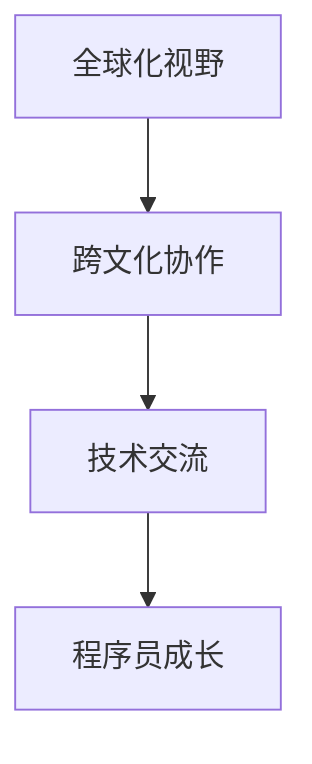

                 

# 程序员的全球化视野：机遇与挑战

> 关键词：全球化视野、程序员的职业发展、技术交流、跨文化协作、国际市场机遇

> 摘要：本文将探讨程序员的全球化视野对于职业发展的重要性，分析全球化背景下的机遇与挑战，并探讨如何应对这些挑战。通过具体的案例分析，为程序员提供实际操作建议，助力他们在全球化进程中取得成功。

## 1. 背景介绍

随着全球化的深入发展，信息技术行业已成为推动世界经济繁荣的重要引擎。各国之间的技术交流与合作日益密切，程序员作为这个行业的核心力量，其职业发展的全球化视野变得尤为重要。全球化视野不仅有助于程序员开阔眼界，提升自身技能，还能够帮助他们抓住国际市场的机遇，实现职业发展的跨越。

然而，全球化背景下的程序员面临着诸多挑战，如跨文化协作、技术差异、语言障碍等。因此，本文将从以下几个方面展开讨论：全球化视野的重要性、核心概念与联系、核心算法原理、实际应用场景、工具和资源推荐，以及未来发展趋势与挑战。

## 2. 核心概念与联系

在讨论全球化视野的重要性之前，我们先了解一些核心概念，包括全球化、跨文化协作、技术交流等。

### 2.1 全球化

全球化是指国际间经济、政治、文化等方面的相互联系与互动。在信息技术行业，全球化主要体现在国际市场的拓展、跨国企业的合作以及人才流动等方面。

### 2.2 跨文化协作

跨文化协作是指来自不同文化背景的个体或团队在共同完成某项任务时的互动。在全球化背景下，程序员需要与来自不同国家的同事合作，这就要求他们具备跨文化沟通能力。

### 2.3 技术交流

技术交流是全球化背景下程序员之间的重要活动。通过技术交流，程序员可以了解最新的技术趋势、学习方法以及实际应用经验，从而提升自身技能。

### 2.4 核心概念的联系

全球化视野、跨文化协作和技术交流这三个核心概念密切相关。全球化视野是程序员具备的国际化思维方式，跨文化协作是实现全球化视野的重要途径，而技术交流则是全球化视野和跨文化协作的具体表现。

### 2.5 Mermaid 流程图



## 3. 核心算法原理 & 具体操作步骤

在了解了核心概念与联系后，我们接下来探讨如何在实践中培养全球化视野。

### 3.1 培养全球化视野的方法

**方法一：学习国际化的编程语言**

掌握多种编程语言是培养全球化视野的基础。常见的国际化编程语言包括 Java、Python、JavaScript 等。通过学习这些语言，程序员可以更好地理解不同国家和地区的编程习惯。

**方法二：参与国际技术社区**

加入国际技术社区，如 Stack Overflow、GitHub 等，可以结识来自世界各地的程序员，了解他们的技术观点和实际应用经验。

**方法三：参加国际技术大会**

国际技术大会是程序员展示自我、学习前沿技术的绝佳平台。通过参加这些大会，程序员可以拓展人脉、了解国际市场的需求。

**方法四：跨文化协作实践**

参与跨国项目或与不同文化背景的同事合作，可以锻炼程序员的跨文化沟通能力。在实践中，程序员可以学习如何克服文化差异、提高协作效率。

### 3.2 实际操作步骤

**步骤一：制定学习计划**

制定一个详细的学习计划，包括学习目标、学习内容和学习进度。例如，学习 Java 编程语言，可以按照《Head First Java》这本书的章节顺序进行学习。

**步骤二：加入国际技术社区**

在 Stack Overflow、GitHub 等平台上注册账号，关注感兴趣的技术话题，参与讨论，提问和回答问题。

**步骤三：参加国际技术大会**

选择一个适合自己的国际技术大会，提前了解大会日程和演讲嘉宾，准备好自己的提问和讨论话题。

**步骤四：跨文化协作实践**

寻找一个跨国项目或与不同文化背景的同事合作的机会，了解项目的需求和目标，积极参与项目讨论和开发。

## 4. 数学模型和公式 & 详细讲解 & 举例说明

在培养全球化视野的过程中，数学模型和公式可以帮助程序员更好地理解技术原理和算法实现。

### 4.1 数学模型：协同过滤算法

协同过滤算法是一种常用的推荐系统算法，可以用于预测用户对未知物品的评分。其基本模型如下：

$$
R_{ui} = \frac{\sum_{j \in N(i)} r_{uj} \cdot sim(j, i)}{\sum_{j \in N(i)} sim(j, i)}
$$

其中，$R_{ui}$ 表示用户 $u$ 对物品 $i$ 的预测评分，$r_{uj}$ 表示用户 $u$ 对物品 $j$ 的实际评分，$sim(j, i)$ 表示物品 $j$ 和 $i$ 之间的相似度。

### 4.2 公式讲解

- **预测评分 $R_{ui}$**：根据用户 $u$ 对其他物品的评分和相似度计算得出。
- **相似度 $sim(j, i)$**：表示物品 $j$ 和 $i$ 之间的相似程度，常用的相似度计算方法包括余弦相似度、皮尔逊相似度等。

### 4.3 举例说明

假设用户 $u$ 对电影 $A$、$B$ 和 $C$ 的实际评分分别为 4、3 和 5，物品 $D$ 和 $E$ 的实际评分未知。现在使用协同过滤算法预测用户 $u$ 对电影 $D$ 和 $E$ 的评分。

- **计算相似度**：首先计算电影 $D$ 和 $E$ 与电影 $A$、$B$ 和 $C$ 之间的相似度。

  $$
  sim(A, D) = \frac{r_{Au} \cdot r_{Du}}{\sqrt{r_{Au}^2 + r_{Du}^2}} = \frac{4 \cdot 0}{\sqrt{4^2 + 0^2}} = 0
  $$

  $$
  sim(B, D) = \frac{r_{Bu} \cdot r_{Du}}{\sqrt{r_{Bu}^2 + r_{Du}^2}} = \frac{3 \cdot 0}{\sqrt{3^2 + 0^2}} = 0
  $$

  $$
  sim(C, D) = \frac{r_{Cu} \cdot r_{Du}}{\sqrt{r_{Cu}^2 + r_{Du}^2}} = \frac{5 \cdot 0}{\sqrt{5^2 + 0^2}} = 0
  $$

  $$
  sim(A, E) = \frac{r_{Au} \cdot r_{Eu}}{\sqrt{r_{Au}^2 + r_{Eu}^2}} = \frac{4 \cdot 0}{\sqrt{4^2 + 0^2}} = 0
  $$

  $$
  sim(B, E) = \frac{r_{Bu} \cdot r_{Eu}}{\sqrt{r_{Bu}^2 + r_{Eu}^2}} = \frac{3 \cdot 0}{\sqrt{3^2 + 0^2}} = 0
  $$

  $$
  sim(C, E) = \frac{r_{Cu} \cdot r_{Eu}}{\sqrt{r_{Cu}^2 + r_{Eu}^2}} = \frac{5 \cdot 0}{\sqrt{5^2 + 0^2}} = 0
  $$

- **预测评分**：由于所有相似度均为 0，无法预测用户 $u$ 对电影 $D$ 和 $E$ 的评分。

## 5. 项目实战：代码实际案例和详细解释说明

为了更好地理解全球化视野的重要性，我们通过一个实际的项目案例来进行分析。

### 5.1 开发环境搭建

在开始项目之前，我们需要搭建一个开发环境。这里以一个简单的跨文化协作项目为例，开发环境包括：

- 操作系统：Linux
- 编程语言：Python
- 开发工具：PyCharm

### 5.2 源代码详细实现和代码解读

以下是该项目的一个简单示例：

```python
# 导入所需的库
import requests
from bs4 import BeautifulSoup

# 定义一个函数，用于获取网页内容
def get_web_content(url):
    response = requests.get(url)
    if response.status_code == 200:
        return BeautifulSoup(response.text, 'html.parser')
    else:
        return None

# 定义一个函数，用于提取网页中的文本信息
def extract_text(soup):
    text = soup.get_text()
    return text

# 定义一个函数，用于分析文本信息
def analyze_text(text):
    # 这里可以添加文本分析的相关代码，如情感分析、关键词提取等
    pass

# 定义一个函数，用于跨文化协作
def cross_cultural_cooperation():
    # 这里可以添加与不同文化背景的同事合作的相关代码，如邮件沟通、视频会议等
    pass

# 主函数
def main():
    url = "https://www.example.com"
    soup = get_web_content(url)
    if soup:
        text = extract_text(soup)
        analyze_text(text)
        cross_cultural_cooperation()
    else:
        print("无法获取网页内容")

# 执行主函数
if __name__ == "__main__":
    main()
```

### 5.3 代码解读与分析

- **get_web_content(url)**：该函数使用 requests 库获取指定 URL 的网页内容。若请求成功，返回 BeautifulSoup 对象，否则返回 None。

- **extract_text(soup)**：该函数提取 BeautifulSoup 对象中的文本信息。这里使用 `.get_text()` 方法获取所有文本内容。

- **analyze_text(text)**：该函数用于分析文本信息，如情感分析、关键词提取等。这里暂时为空，可以根据项目需求添加相关代码。

- **cross_cultural_cooperation()**：该函数用于跨文化协作，如邮件沟通、视频会议等。这里暂时为空，可以根据项目需求添加相关代码。

- **main()**：主函数。首先获取网页内容，然后提取文本信息，接着进行分析和跨文化协作。

通过这个案例，我们可以看到全球化视野在实际项目中的应用。例如，在获取网页内容时，我们需要考虑不同国家和地区的网络环境，可能需要使用代理服务器等技术。在跨文化协作时，我们需要了解不同文化背景的沟通习惯，如邮件礼仪、会议流程等。

## 6. 实际应用场景

在全球化背景下，程序员的实际应用场景日益丰富。以下是一些典型的应用场景：

### 6.1 跨国企业 IT 支持团队

跨国企业通常拥有多个分支机构，分布在不同的国家和地区。程序员的全球化视野可以帮助他们更好地支持这些分支机构的信息技术需求。

### 6.2 国际开源项目贡献者

国际开源项目是程序员展示自我、交流技术的重要平台。具有全球化视野的程序员可以更好地理解项目需求、贡献代码，并与其他贡献者协作。

### 6.3 海外软件开发团队

随着全球化的深入，越来越多的软件开发团队采用分布式协作模式。程序员需要具备全球化视野，以应对不同国家和地区的协作需求。

### 6.4 国际技术交流与合作

通过参加国际技术大会、研讨会等活动，程序员可以拓展人脉、了解国际市场的需求，为企业的国际化发展提供支持。

## 7. 工具和资源推荐

为了更好地培养全球化视野，程序员可以借助以下工具和资源：

### 7.1 学习资源推荐

- **《全球软件开发者手册》（Global Developer Handbook）**：这是一本关于全球软件开发趋势和最佳实践的指南。
- **《国际化 Web 开发指南》（Internationalization Best Practices）**：介绍如何构建国际化 Web 应用程序的指南。

### 7.2 开发工具框架推荐

- **国际化的 Web 框架**：如 Django、Flask 等，支持多语言和多地区部署。
- **国际化数据库**：如 MySQL、PostgreSQL 等，支持多种字符集和排序规则。

### 7.3 相关论文著作推荐

- **《跨文化沟通与协作：理论与实践》（Cross-Cultural Communication and Collaboration: Theory and Practice）**：探讨跨文化沟通与协作的方法和技巧。
- **《全球化与技术创新》（Globalization and Technological Innovation）**：分析全球化背景下的技术创新趋势和挑战。

## 8. 总结：未来发展趋势与挑战

随着全球化的深入推进，程序员的全球化视野将变得越来越重要。未来，程序员将面临以下发展趋势与挑战：

### 8.1 发展趋势

- **跨国企业 IT 支持团队**：随着跨国企业的扩张，程序员在跨国企业 IT 支持团队的需求将逐渐增加。
- **国际开源项目贡献者**：国际开源项目将越来越受到重视，程序员作为贡献者的重要性将不断提升。
- **海外软件开发团队**：分布式协作模式将越来越普遍，程序员需要具备更高的全球化视野。

### 8.2 挑战

- **跨文化协作**：不同文化背景的程序员在合作过程中可能会遇到沟通障碍，需要提高跨文化沟通能力。
- **技术差异**：不同国家和地区的技术水平和发展阶段存在差异，程序员需要适应不同的技术环境。
- **语言障碍**：不同国家和地区的语言差异可能会影响程序员的沟通和协作，需要掌握多种语言。

## 9. 附录：常见问题与解答

### 9.1 常见问题

- **如何培养全球化视野？**
  - 学习国际化的编程语言，如 Java、Python、JavaScript 等。
  - 加入国际技术社区，如 Stack Overflow、GitHub 等。
  - 参加国际技术大会，拓展人脉、了解国际市场的需求。
  - 参与跨国项目或与不同文化背景的同事合作。

- **如何应对跨文化协作的挑战？**
  - 了解不同文化背景的沟通习惯，如邮件礼仪、会议流程等。
  - 提高跨文化沟通能力，如学习跨文化沟通技巧、参加相关培训等。
  - 保持开放的心态，尊重和理解不同文化。

### 9.2 解答

**如何培养全球化视野？**

培养全球化视野需要从多个方面入手：

1. **学习国际化的编程语言**：掌握多种编程语言可以帮助程序员更好地理解不同国家和地区的编程习惯，从而提升自身技能。例如，Java、Python、JavaScript 等都是国际化的编程语言。

2. **加入国际技术社区**：通过加入国际技术社区，如 Stack Overflow、GitHub 等，程序员可以结识来自世界各地的同行，了解他们的技术观点和实际应用经验。这不仅有助于拓展人脉，还能提高自己的技术水平。

3. **参加国际技术大会**：国际技术大会是程序员展示自我、学习前沿技术的绝佳平台。通过参加这些大会，程序员可以拓展人脉、了解国际市场的需求，为自己的职业发展打下坚实基础。

4. **参与跨国项目或与不同文化背景的同事合作**：在全球化背景下，程序员需要具备跨文化沟通能力。通过参与跨国项目或与不同文化背景的同事合作，程序员可以锻炼自己的跨文化沟通能力，提高协作效率。

**如何应对跨文化协作的挑战？**

应对跨文化协作的挑战需要从以下几个方面入手：

1. **了解不同文化背景的沟通习惯**：不同文化背景的沟通习惯可能存在差异。例如，在某些文化中，邮件沟通需要使用正式的语言和礼貌的称呼，而在其他文化中，则可能更倾向于使用非正式的沟通方式。了解这些差异有助于避免沟通误解，提高协作效率。

2. **提高跨文化沟通能力**：跨文化沟通能力是程序员在全球化背景下必备的技能。可以通过学习跨文化沟通技巧、参加相关培训等方式提高自己的跨文化沟通能力。

3. **保持开放的心态，尊重和理解不同文化**：在跨文化协作中，保持开放的心态、尊重和理解不同文化是至关重要的。这不仅有助于建立良好的合作关系，还能提高团队的凝聚力和协作效率。

## 10. 扩展阅读 & 参考资料

- **《全球软件开发者手册》（Global Developer Handbook）**
- **《国际化 Web 开发指南》（Internationalization Best Practices）**
- **《跨文化沟通与协作：理论与实践》（Cross-Cultural Communication and Collaboration: Theory and Practice）**
- **《全球化与技术创新》（Globalization and Technological Innovation）**
- **Stack Overflow：[https://stackoverflow.com/](https://stackoverflow.com/)**
- **GitHub：[https://github.com/](https://github.com/)**
- **《禅与计算机程序设计艺术》（Zen And The Art of Computer Programming）**

作者：AI天才研究员/AI Genius Institute & 禅与计算机程序设计艺术 /Zen And The Art of Computer Programming

