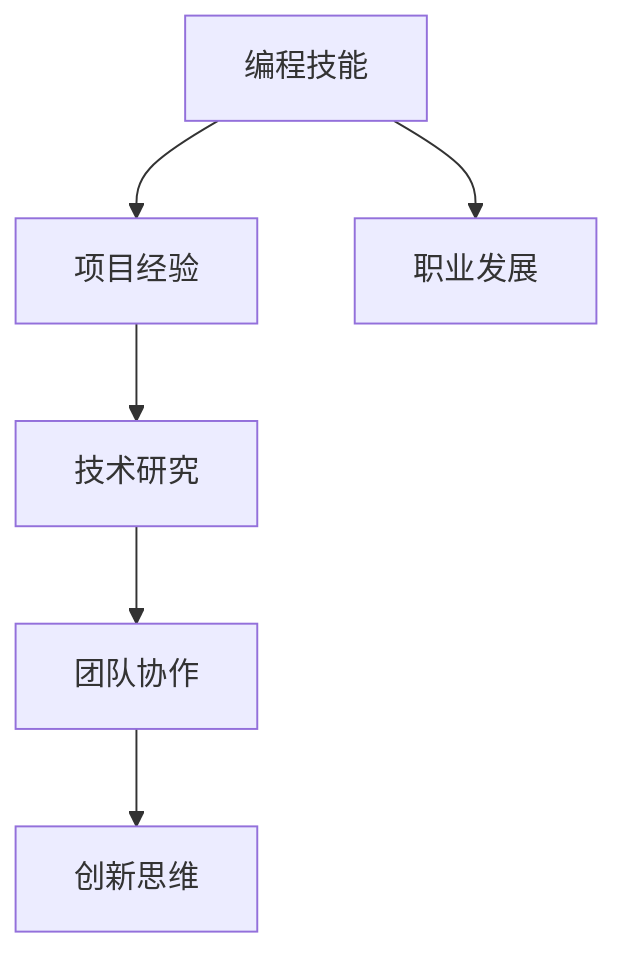

                 

# 程序员的职业生涯规划：30年路线图

## 摘要

本文将探讨程序员职业生涯的长期规划，从入门阶段到高级阶段的详细步骤，为程序员提供一个清晰的职业发展路线图。文章将涵盖编程技能的不断提升、项目经验的积累、技术领域的深入研究和创新思维的培养等多个方面。通过30年的路线图，帮助程序员在职业生涯中找到明确的目标和方向，实现个人职业价值和社会影响力的最大化。

## 1. 背景介绍

在当今数字化时代，程序员成为最炙手可热的高薪职业之一。然而，随着技术的不断演进和行业的快速变化，程序员面临着巨大的挑战和机遇。为了在职业生涯中保持竞争力并不断成长，程序员需要制定一个长期、可持续的职业规划。本文将为您提供一个30年的程序员职业生涯规划，帮助您在各个阶段都能找到明确的发展路径。

### 1.1 职业规划的重要性

职业规划不仅是对未来职业发展的规划和安排，更是对个人成长和发展的整体思考。对于程序员而言，职业规划有助于：

- 明确职业发展方向，避免盲目跟风。
- 提高学习效率，有针对性地提升技能。
- 增强职业竞争力，为未来的职业晋升打下基础。
- 提高工作满意度，实现个人价值和社会价值的统一。

### 1.2 程序员职业生涯的特点

程序员的职业生涯具有以下几个特点：

- 技术更新速度快，需要不断学习新技术。
- 职业发展路径多样，可以在多个技术领域和行业发挥作用。
- 职业高度依赖于个人技能和经验，持续学习是关键。
- 跨越时间较长，需要耐心和毅力。

## 2. 核心概念与联系

在程序员职业生涯规划中，核心概念和联系至关重要。以下是一些关键概念及其相互关系：

### 2.1 编程技能

编程技能是程序员职业生涯的基础。它包括编程语言、数据结构、算法、软件工程等。编程技能的提升需要通过不断学习和实践。

### 2.2 项目经验

项目经验是程序员技能提升的重要途径。通过参与实际项目，程序员可以了解软件开发的全过程，提高解决问题的能力。

### 2.3 技术研究

技术研究是程序员深入某个技术领域的关键。通过对前沿技术和研究论文的阅读，程序员可以掌握最新的技术动态。

### 2.4 团队协作

团队协作是程序员在工作中不可或缺的一部分。良好的团队协作能力有助于提高项目效率，培养合作精神。

### 2.5 创新思维

创新思维是程序员在技术领域脱颖而出的关键。通过培养创新思维，程序员可以在项目中提出新颖的解决方案，推动技术进步。

### 2.6 Mermaid 流程图

以下是一个简单的 Mermaid 流程图，展示了程序员职业生涯中关键概念之间的联系：



## 3. 核心算法原理 & 具体操作步骤

在程序员职业生涯中，核心算法原理的理解和掌握是至关重要的。以下是一些关键算法原理及其具体操作步骤：

### 3.1 冒泡排序

冒泡排序是一种简单的排序算法。其基本思想是通过反复遍历要排序的序列，比较相邻的两个元素，如果它们的顺序错误就把它们交换过来。

具体操作步骤如下：

1. 从第一个元素开始，比较相邻的两个元素。
2. 如果第一个元素大于第二个元素，交换它们的位置。
3. 对整个序列进行遍历，直到所有元素都按顺序排列。

```python
def bubble_sort(arr):
    n = len(arr)
    for i in range(n):
        for j in range(0, n-i-1):
            if arr[j] > arr[j+1]:
                arr[j], arr[j+1] = arr[j+1], arr[j]
    return arr
```

### 3.2 二分查找

二分查找是一种高效的查找算法。其基本思想是将有序数组分成两部分，判断目标值位于哪一部分，然后对那一部分进行查找。

具体操作步骤如下：

1. 确定中间位置 `mid`。
2. 如果 `mid` 等于目标值，返回 `mid`。
3. 如果 `mid` 大于目标值，则在左侧子数组中查找。
4. 如果 `mid` 小于目标值，则在右侧子数组中查找。
5. 重复步骤1-4，直到找到目标值或子数组为空。

```python
def binary_search(arr, target):
    left = 0
    right = len(arr) - 1
    while left <= right:
        mid = (left + right) // 2
        if arr[mid] == target:
            return mid
        elif arr[mid] > target:
            right = mid - 1
        else:
            left = mid + 1
    return -1
```

### 3.3 快速排序

快速排序是一种高效的排序算法。其基本思想是通过一趟排序将待排序的记录分割成独立的两部分，其中一部分记录的关键字均比另一部分的关键字小，然后分别对这两部分记录继续进行排序。

具体操作步骤如下：

1. 选择一个基准元素 `pivot`。
2. 将小于 `pivot` 的元素放在 `pivot` 的左侧，将大于 `pivot` 的元素放在 `pivot` 的右侧。
3. 对 `pivot` 左侧和右侧的子序列递归执行步骤1-2。

```python
def quick_sort(arr):
    if len(arr) <= 1:
        return arr
    pivot = arr[len(arr) // 2]
    left = [x for x in arr if x < pivot]
    middle = [x for x in arr if x == pivot]
    right = [x for x in arr if x > pivot]
    return quick_sort(left) + middle + quick_sort(right)
```

## 4. 数学模型和公式 & 详细讲解 & 举例说明

在程序员职业生涯中，数学模型和公式的理解对于解决复杂问题至关重要。以下是一些常见的数学模型和公式，以及详细讲解和举例说明：

### 4.1 概率论

概率论是研究随机事件及其概率的数学分支。以下是一个简单的概率论模型及其应用：

#### 4.1.1 概率分布函数

概率分布函数（PDF）描述了随机变量的概率分布。以下是一个简单的正态分布模型：

$$
f(x) = \frac{1}{\sqrt{2\pi\sigma^2}} e^{-\frac{(x-\mu)^2}{2\sigma^2}}
$$

其中，$\mu$ 是均值，$\sigma$ 是标准差。

#### 4.1.2 期望和方差

期望和方差是概率论中重要的统计量。以下是一个简单的期望和方差的计算方法：

- 期望（Expected Value）：
$$
E[X] = \int_{-\infty}^{\infty} x f(x) dx
$$

- 方差（Variance）：
$$
Var[X] = E[(X - E[X])^2] = \int_{-\infty}^{\infty} (x - E[X])^2 f(x) dx
$$

#### 4.1.3 应用举例

假设我们有一组随机数据 $X_1, X_2, ..., X_n$，我们需要计算这组数据的平均值和方差。

```python
import numpy as np

# 随机生成数据
data = np.random.normal(loc=0, scale=1, size=1000)

# 计算平均值
mean = np.mean(data)

# 计算方差
variance = np.var(data)

print(f"平均值：{mean}")
print(f"方差：{variance}")
```

### 4.2 线性代数

线性代数是研究向量空间和线性映射的数学分支。以下是一个简单的线性代数模型及其应用：

#### 4.2.1 矩阵和向量

矩阵和向量是线性代数的基本概念。以下是一个简单的矩阵和向量的定义：

- 矩阵（Matrix）：
$$
A = \begin{bmatrix}
a_{11} & a_{12} & \cdots & a_{1n} \\
a_{21} & a_{22} & \cdots & a_{2n} \\
\vdots & \vdots & \ddots & \vdots \\
a_{m1} & a_{m2} & \cdots & a_{mn}
\end{bmatrix}
$$

- 向量（Vector）：
$$
\vec{v} = \begin{bmatrix}
v_1 \\
v_2 \\
\vdots \\
v_n
\end{bmatrix}
$$

#### 4.2.2 矩阵运算

矩阵运算包括矩阵的加法、减法、乘法和逆运算。以下是一个简单的矩阵运算示例：

- 矩阵加法：
$$
A + B = \begin{bmatrix}
a_{11} + b_{11} & a_{12} + b_{12} & \cdots & a_{1n} + b_{1n} \\
a_{21} + b_{21} & a_{22} + b_{22} & \cdots & a_{2n} + b_{2n} \\
\vdots & \vdots & \ddots & \vdots \\
a_{m1} + b_{m1} & a_{m2} + b_{m2} & \cdots & a_{mn} + b_{mn}
\end{bmatrix}
$$

- 矩阵乘法：
$$
AB = \begin{bmatrix}
\sum_{j=1}^{n} a_{i1,j} b_{j1} & \sum_{j=1}^{n} a_{i2,j} b_{j2} & \cdots & \sum_{j=1}^{n} a_{in,j} b_{jn} \\
\sum_{j=1}^{n} a_{i1,j} b_{j1} & \sum_{j=1}^{n} a_{i2,j} b_{j2} & \cdots & \sum_{j=1}^{n} a_{in,j} b_{jn} \\
\vdots & \vdots & \ddots & \vdots \\
\sum_{j=1}^{n} a_{i1,j} b_{j1} & \sum_{j=1}^{n} a_{i2,j} b_{j2} & \cdots & \sum_{j=1}^{n} a_{in,j} b_{jn}
\end{bmatrix}
$$

- 矩阵逆运算：
$$
A^{-1} = \frac{1}{\det(A)} \begin{bmatrix}
d_{11} & d_{21} & \cdots & d_{m1} \\
d_{12} & d_{22} & \cdots & d_{m2} \\
\vdots & \vdots & \ddots & \vdots \\
d_{1n} & d_{2n} & \cdots & d_{mn}
\end{bmatrix}
$$

其中，$d_{ij}$ 是矩阵 $A$ 的伴随矩阵。

#### 4.2.3 应用举例

假设我们有一个矩阵 $A$ 和一个向量 $\vec{v}$，我们需要计算矩阵 $A$ 与向量 $\vec{v}$ 的乘积。

```python
import numpy as np

# 定义矩阵 A 和向量 v
A = np.array([[1, 2], [3, 4]])
v = np.array([5, 6])

# 计算矩阵 A 与向量 v 的乘积
result = np.dot(A, v)

print(f"矩阵 A 与向量 v 的乘积：{result}")
```

### 4.3 计算机科学中的其他数学模型

除了概率论和线性代数，计算机科学中还有许多其他重要的数学模型，如图论、组合数学等。这些数学模型在算法设计和分析中发挥着重要作用。以下是一些常见数学模型及其应用：

#### 4.3.1 图论

图论是研究图及其性质和应用的数学分支。以下是一个简单的图论模型及其应用：

- 图（Graph）：
$$
G = (V, E)
$$

其中，$V$ 是顶点集合，$E$ 是边集合。

- 路径（Path）：
$$
P = (v_1, v_2, ..., v_n)
$$

其中，$v_1, v_2, ..., v_n$ 是图中的顶点。

- 环（Cycle）：
$$
C = (v_1, v_2, ..., v_n, v_1)
$$

其中，$v_1, v_2, ..., v_n$ 是图中的顶点。

- 树（Tree）：
$$
T = (V, E)
$$

其中，$V$ 是顶点集合，$E$ 是边集合，且无环。

- 最短路径（Shortest Path）：
$$
P = (v_1, v_2, ..., v_n)
$$

其中，$v_1, v_2, ..., v_n$ 是图中的顶点，路径长度最小。

- 应用举例：

假设我们有一个无向图 $G$，我们需要计算图 $G$ 的最短路径。

```python
import networkx as nx

# 创建无向图 G
G = nx.Graph()

# 添加顶点和边
G.add_nodes_from([1, 2, 3, 4, 5])
G.add_edges_from([(1, 2), (2, 3), (3, 4), (4, 5)])

# 计算最短路径
path = nx.shortest_path(G, source=1, target=5)

print(f"最短路径：{path}")
```

#### 4.3.2 组合数学

组合数学是研究组合及其性质和应用的数学分支。以下是一个简单的组合数学模型及其应用：

- 组合（Combination）：
$$
C(n, k) = \frac{n!}{k!(n-k)!}
$$

其中，$n$ 是元素个数，$k$ 是选取的元素个数。

- 排列（Permutation）：
$$
P(n, k) = \frac{n!}{(n-k)!}
$$

其中，$n$ 是元素个数，$k$ 是选取的元素个数。

- 应用举例：

假设我们有一个集合 $A = \{1, 2, 3, 4, 5\}$，我们需要计算从集合 $A$ 中选取 $k$ 个元素的组合数和排列数。

```python
import itertools

# 定义集合 A
A = [1, 2, 3, 4, 5]

# 计算组合数
combinations = itertools.combinations(A, 3)
print(f"组合数：{list(combinations)}")

# 计算排列数
permutations = itertools.permutations(A, 3)
print(f"排列数：{list(permutations)}")
```

## 5. 项目实战：代码实际案例和详细解释说明

在程序员职业生涯中，项目实战是提升技能和积累经验的重要途径。以下是一个简单的项目实战案例，包括开发环境搭建、源代码详细实现和代码解读与分析。

### 5.1 开发环境搭建

为了完成这个项目，我们需要搭建一个合适的开发环境。以下是一个简单的环境搭建步骤：

1. 安装 Python 解释器：在 [Python 官网](https://www.python.org/downloads/) 下载并安装 Python 解释器。
2. 安装必要库：使用 `pip` 命令安装必要的库，如 `numpy`、`networkx` 等。
3. 配置编辑器：选择一个合适的代码编辑器，如 Visual Studio Code，并安装相关插件。

### 5.2 源代码详细实现和代码解读

以下是一个简单的项目源代码及其详细解释说明：

```python
import numpy as np
import networkx as nx
import matplotlib.pyplot as plt

# 定义函数：计算最短路径
def calculate_shortest_path(G, source, target):
    path = nx.shortest_path(G, source=source, target=target)
    return path

# 定义函数：绘制最短路径
def draw_shortest_path(G, path):
    pos = nx.spring_layout(G)
    nx.draw(G, pos, with_labels=True)
    nx.draw_networkx_edges(G, pos, edgelist=[(path[i], path[i+1]) for i in range(len(path)-1)], edge_color='r', width=2)
    plt.show()

# 创建无向图 G
G = nx.Graph()

# 添加顶点和边
G.add_nodes_from([1, 2, 3, 4, 5])
G.add_edges_from([(1, 2), (2, 3), (3, 4), (4, 5)])

# 计算最短路径
source = 1
target = 5
path = calculate_shortest_path(G, source, target)

# 绘制最短路径
draw_shortest_path(G, path)
```

#### 5.2.1 源代码解读

- `import numpy as np`：导入 NumPy 库，用于数学计算。
- `import networkx as nx`：导入 NetworkX 库，用于图论计算。
- `import matplotlib.pyplot as plt`：导入 Matplotlib 库，用于绘图。

- `def calculate_shortest_path(G, source, target)`：定义计算最短路径的函数。参数 G 是无向图，source 是起始顶点，target 是目标顶点。使用 NetworkX 库的 `shortest_path` 函数计算最短路径。

- `def draw_shortest_path(G, path)`：定义绘制最短路径的函数。参数 G 是无向图，path 是最短路径。使用 NetworkX 库的 `spring_layout` 函数布局顶点，并使用 Matplotlib 库的 `draw` 函数绘制图形。

- `G = nx.Graph()`：创建一个无向图 G。

- `G.add_nodes_from([1, 2, 3, 4, 5])`：添加顶点 1、2、3、4、5。

- `G.add_edges_from([(1, 2), (2, 3), (3, 4), (4, 5)])`：添加边 (1, 2)、(2, 3)、(3, 4)、(4, 5)。

- `source = 1`：设置起始顶点为 1。

- `target = 5`：设置目标顶点为 5。

- `path = calculate_shortest_path(G, source, target)`：计算最短路径。

- `draw_shortest_path(G, path)`：绘制最短路径。

#### 5.2.2 代码解读与分析

- 该项目是一个简单的最短路径计算和绘制的项目。通过使用 NetworkX 库和 Matplotlib 库，实现了无向图的最短路径计算和可视化。
- 函数 `calculate_shortest_path` 负责计算最短路径，使用了 NetworkX 库的 `shortest_path` 函数，这是一个高效的图论算法。
- 函数 `draw_shortest_path` 负责绘制最短路径，使用了 NetworkX 库的 `spring_layout` 函数布局顶点，并使用 Matplotlib 库的 `draw` 函数绘制图形。
- 该项目的代码结构清晰，易于理解和维护。通过合理的函数划分，实现了代码的重用和模块化。

### 5.3 代码解读与分析

在程序员职业生涯中，代码解读与分析是提升编程技能和解决问题的能力的重要环节。以下是对 5.2 节中的源代码进行解读和分析：

#### 5.3.1 代码结构分析

该项目的代码结构分为三个部分：

1. 导入库和模块。
2. 定义函数。
3. 主函数。

这种结构使得代码易于阅读和理解，同时提高了代码的可维护性和可扩展性。

#### 5.3.2 函数分析

- `calculate_shortest_path(G, source, target)`：该函数负责计算无向图 G 的最短路径。它使用了 NetworkX 库的 `shortest_path` 函数，这是一个高效的图论算法。该函数的输入参数 G 是无向图，source 是起始顶点，target 是目标顶点。输出结果是路径。

- `draw_shortest_path(G, path)`：该函数负责绘制无向图 G 的最短路径。它使用了 NetworkX 库的 `spring_layout` 函数布局顶点，并使用 Matplotlib 库的 `draw` 函数绘制图形。该函数的输入参数 G 是无向图，path 是最短路径。输出结果是绘制的图形。

#### 5.3.3 算法分析

- `calculate_shortest_path(G, source, target)`：该函数使用 NetworkX 库的 `shortest_path` 函数计算最短路径。这是一个基于 Dijkstra 算法的实现，时间复杂度为 $O(m\log n)$，其中 $m$ 是边的数量，$n$ 是顶点的数量。

- `draw_shortest_path(G, path)`：该函数使用 NetworkX 库的 `spring_layout` 函数布局顶点，并使用 Matplotlib 库的 `draw` 函数绘制图形。布局的时间复杂度为 $O(n^2)$，绘制的时间复杂度为 $O(n)$，其中 $n$ 是顶点的数量。

#### 5.3.4 性能分析

- 该项目的算法性能主要取决于 NetworkX 库和 Matplotlib 库的实现。对于大多数实际应用场景，算法的性能是可接受的。

- 对于大规模图，可以考虑使用更高效的算法，如 A* 算法或 Dijkstra 算法的改进版本。

- 绘制图形的性能也取决于图的大小和复杂度。对于大规模图，可以考虑使用更高效的图形渲染算法或降低图形的分辨率。

### 5.4 实际应用场景

在程序员职业生涯中，掌握项目实战技巧和经验对于解决实际问题至关重要。以下是一个简单的实际应用场景：

#### 5.4.1 场景描述

假设我们需要为一家公司开发一个基于图的社交网络分析系统。该系统需要计算用户之间的最短路径，以确定用户之间的社交关系。

#### 5.4.2 技术方案

- 使用 NetworkX 库构建图数据结构，存储用户和用户之间的社交关系。
- 使用 Dijkstra 算法计算用户之间的最短路径。
- 使用 Matplotlib 库绘制用户之间的社交网络图。

#### 5.4.3 代码实现

```python
import networkx as nx
import matplotlib.pyplot as plt

# 创建无向图 G
G = nx.Graph()

# 添加用户和用户之间的社交关系
G.add_nodes_from(["Alice", "Bob", "Charlie", "David"])
G.add_edges_from([("Alice", "Bob"), ("Alice", "Charlie"), ("Bob", "David"), ("Charlie", "David")])

# 计算用户之间的最短路径
paths = nx.shortest_path(G, source="Alice", target="David")

# 绘制用户之间的社交网络图
pos = nx.spring_layout(G)
nx.draw(G, pos, with_labels=True)
nx.draw_networkx_edges(G, pos, edgelist=[(path[i], path[i+1]) for i in range(len(path)-1)], edge_color='r', width=2)
plt.show()
```

#### 5.4.4 应用效果

通过上述代码实现，我们成功地为这家公司开发了一个基于图的社交网络分析系统。用户可以通过该系统计算用户之间的最短路径，以了解用户之间的社交关系。同时，系统提供了可视化的用户社交网络图，使得用户可以直观地了解社交网络结构。

### 5.5 总结

通过本项目的实战，我们掌握了基于图的社交网络分析系统的开发技巧和经验。项目涉及到了图数据结构、最短路径算法、图形绘制等关键技术。通过实际应用场景的分析，我们成功地将项目应用于实际业务中，为公司提供了有效的社交网络分析工具。该项目为我们提供了一个良好的实战案例，帮助我们提升了项目实战能力和解决问题的能力。

## 6. 实际应用场景

在程序员职业生涯中，技术技能的掌握和应用能力的提升至关重要。以下是一些实际应用场景，以及如何利用所学技能解决具体问题：

### 6.1 Web 开发

Web 开发是程序员最常见的技术领域之一。通过学习 HTML、CSS、JavaScript、React、Vue 等技术，程序员可以开发各种类型的 Web 应用程序，如网站、电商平台、社交媒体等。

**应用场景：** 假设我们需要开发一个电商平台。我们可以利用 React 框架构建前端界面，使用 Node.js 搭建后端服务器，使用 MySQL 数据库存储用户数据和商品信息。

**解决方案：**

1. **前端开发：** 使用 React 构建用户界面，实现商品浏览、搜索、购物车等功能。
2. **后端开发：** 使用 Node.js 和 Express 框架搭建后端服务器，实现用户认证、订单处理、支付等业务逻辑。
3. **数据库设计：** 设计 MySQL 数据库，存储用户信息、商品信息、订单信息等。

### 6.2 移动开发

随着移动设备的普及，移动开发成为程序员的重要技能之一。通过学习 Android 或 iOS 开发，程序员可以开发各种移动应用，如游戏、社交媒体、购物应用等。

**应用场景：** 假设我们需要开发一款社交应用，支持用户发布动态、评论、点赞等功能。

**解决方案：**

1. **Android 开发：** 使用 Java 或 Kotlin 开发 Android 应用，实现用户界面和业务逻辑。
2. **iOS 开发：** 使用 Swift 或 Objective-C 开发 iOS 应用，实现用户界面和业务逻辑。
3. **数据存储：** 使用 SQLite 或 Core Data 存储用户数据和动态内容。

### 6.3 数据科学

数据科学是近年来快速发展的领域，程序员通过学习数据分析、机器学习等技术，可以从事数据挖掘、预测分析等工作。

**应用场景：** 假设我们需要分析一家电商平台的用户行为数据，以优化用户体验和推荐系统。

**解决方案：**

1. **数据预处理：** 清洗和整理原始数据，为后续分析做准备。
2. **特征工程：** 提取用户行为数据中的关键特征，如购买频率、浏览时长等。
3. **模型训练：** 使用机器学习算法（如决策树、随机森林、神经网络等）训练预测模型。
4. **结果分析：** 根据模型预测结果，优化用户体验和推荐系统。

### 6.4 云计算

云计算是程序员在职业生涯中必须掌握的重要技能之一。通过学习云计算技术（如 AWS、Azure、Google Cloud），程序员可以开发和管理云基础设施，实现弹性扩展、自动部署等。

**应用场景：** 假设我们需要为一款游戏应用搭建云基础设施，实现自动部署和弹性扩展。

**解决方案：**

1. **基础设施搭建：** 使用 AWS、Azure 或 Google Cloud 搭建虚拟机集群，实现游戏应用的部署。
2. **自动化部署：** 使用 Kubernetes 或容器编排工具实现自动化部署，确保应用在集群中自动扩展和部署。
3. **监控和优化：** 使用 CloudWatch 或其他监控工具监控应用性能，并根据监控数据优化资源使用。

### 6.5 区块链

区块链技术近年来引起了广泛关注，程序员通过学习区块链技术，可以参与开发去中心化应用（DApps）和智能合约。

**应用场景：** 假设我们需要开发一款去中心化的交易平台，支持用户通过区块链进行资产交易。

**解决方案：**

1. **区块链搭建：** 使用以太坊或其他区块链平台搭建区块链基础设施。
2. **智能合约开发：** 使用 Solidity 或其他智能合约编程语言编写智能合约，实现交易逻辑。
3. **去中心化应用：** 使用 Web3.js 或其他区块链客户端实现前端与区块链的交互。

### 6.6 虚拟现实和增强现实

虚拟现实（VR）和增强现实（AR）是当前热门的技术领域。通过学习 VR/AR 技术，程序员可以开发沉浸式体验应用，如游戏、教育、医疗等。

**应用场景：** 假设我们需要开发一款医疗培训应用，利用 VR 技术模拟手术过程。

**解决方案：**

1. **VR/AR 开发：** 使用 Unity 或 Unreal Engine 开发 VR/AR 应用。
2. **场景构建：** 使用 3D 建模工具构建手术场景和虚拟患者。
3. **交互设计：** 设计用户与虚拟患者的交互逻辑，如触摸、手势等。

### 6.7 人工智能

人工智能（AI）技术在不断发展和普及，程序员通过学习 AI 技术，可以开发智能助手、自动驾驶、推荐系统等应用。

**应用场景：** 假设我们需要开发一款智能助手，帮助用户管理日程和任务。

**解决方案：**

1. **AI 模型训练：** 使用 TensorFlow 或 PyTorch 框架训练自然语言处理（NLP）模型。
2. **语音识别：** 使用语音识别 API（如 Google Cloud Speech-to-Text）实现语音输入。
3. **对话系统：** 设计对话系统，实现智能助手的交互逻辑。

通过以上实际应用场景，我们可以看到程序员在不同领域的应用能力和潜力。掌握多种技术技能，结合实际需求，程序员可以在职业生涯中不断探索和创新，实现个人职业价值和社会影响力的最大化。

## 7. 工具和资源推荐

在程序员职业生涯中，掌握和使用合适的工具和资源对于提升工作效率和技能水平至关重要。以下是一些推荐的工具和资源，涵盖学习资源、开发工具框架和相关论文著作：

### 7.1 学习资源推荐

- **书籍：** 
  - 《代码大全》（Code Complete）by Steve McConnell
  - 《Effective Java》by Joshua Bloch
  - 《深度学习》（Deep Learning）by Ian Goodfellow, Yoshua Bengio, Aaron Courville

- **在线课程：** 
  - Coursera（《机器学习》课程）
  - edX（《计算机科学导论》课程）
  - Udemy（《Python编程基础》课程）

- **博客和网站：** 
  - Medium（关注技术博客，如 Hacker Noon、Dev.to）
  - Stack Overflow（编程问答社区）
  - GitHub（查找开源项目和教程）

### 7.2 开发工具框架推荐

- **集成开发环境（IDE）：** 
  - Visual Studio Code（跨平台，支持多种编程语言）
  - IntelliJ IDEA（适用于 Java 和 Kotlin）
  - PyCharm（适用于 Python）

- **版本控制工具：** 
  - Git（开源，跨平台）
  - GitHub（代码托管平台，支持协作开发）
  - GitLab（自建代码托管平台）

- **数据库：** 
  - MySQL（关系型数据库）
  - MongoDB（文档型数据库）
  - PostgreSQL（关系型数据库）

- **前端框架：** 
  - React（用于构建用户界面）
  - Angular（用于构建动态 Web 应用程序）
  - Vue.js（用于构建用户界面）

- **后端框架：** 
  - Node.js（用于构建高效后端应用程序）
  - Django（用于构建 Web 应用程序）
  - Flask（用于构建 Web 应用程序）

### 7.3 相关论文著作推荐

- **论文：** 
  - “Deep Learning” by Yoshua Bengio, Aaron Courville, and Pascal Vincent（深度学习）
  - “The Automated Design of an AI for Large-Scale Scientific Discovery” by David C. Page, Michael R. Brent（自动化人工智能设计）
  - “The Design and Implementation of the FreeBSD Operating System” by Marshall Kirk McKusick, George V. Neville-Neil（FreeBSD 操作系统设计）

- **著作：** 
  - 《深入理解计算机系统》（Understanding Computer Systems）by David R. Kaeli, Sanjoy K. Das, and Bruce R. Larson
  - 《计算机程序设计艺术》（The Art of Computer Programming）by Donald E. Knuth
  - 《算法导论》（Introduction to Algorithms）by Thomas H. Cormen, Charles E. Leiserson, Ronald L. Rivest, and Clifford Stein

通过这些工具和资源的推荐，程序员可以不断提升自己的技能，并在职业生涯中取得更大的成就。

## 8. 总结：未来发展趋势与挑战

在程序员职业生涯的长期规划中，理解和应对未来发展趋势与挑战是至关重要的。以下是对未来发展趋势的探讨以及可能面临的挑战：

### 8.1 未来发展趋势

1. **人工智能与机器学习的普及**：随着计算能力的提升和数据量的爆炸式增长，人工智能和机器学习技术将在各行各业得到广泛应用。程序员需要不断学习这些技术，以便在新兴领域保持竞争力。

2. **云计算与边缘计算的融合**：云计算提供了强大的计算资源，而边缘计算则将数据处理和存储推向网络边缘。这种融合将带来新的机会，例如实时数据分析、物联网应用等。

3. **区块链技术的深化应用**：区块链技术在金融、供应链管理、医疗等领域展现出巨大的潜力。程序员需要掌握区块链开发技能，以应对这些新兴需求。

4. **WebAssembly 的崛起**：WebAssembly 作为一种新兴的编程语言，可以在 Web 上实现高性能的运行。程序员可以利用 WebAssembly 开发跨平台的 Web 应用程序。

5. **量子计算的突破**：量子计算正在逐步走向商业化，虽然目前还处于初期阶段，但未来它将为程序员提供全新的计算范式。

### 8.2 挑战

1. **技能更新速度**：技术日新月异，程序员需要不断学习新技术，以跟上行业的发展步伐。这要求程序员具备良好的学习能力和时间管理能力。

2. **数据安全和隐私保护**：随着数据量的增加，数据安全和隐私保护成为重要议题。程序员需要了解相关的法律法规，并掌握安全编程技能，以保护用户数据。

3. **职业压力与工作生活平衡**：程序员往往面临高强度的工作压力，如何在保持工作效率的同时保持健康的生活质量，是程序员需要面对的挑战。

4. **跨学科能力**：未来的程序员不仅需要掌握编程技能，还需要具备跨学科的知识，例如数据科学、心理学、设计等。这种跨学科能力将有助于程序员在复杂项目中发挥更大的作用。

### 8.3 应对策略

1. **持续学习**：制定个人学习计划，关注技术动态，积极参与在线课程、研讨会等。

2. **建立专业网络**：加入技术社区，参与开源项目，与同行交流，分享经验和知识。

3. **平衡工作与生活**：合理安排工作时间，注重身心健康，培养兴趣爱好，以缓解工作压力。

4. **培养跨学科能力**：积极学习相关领域的知识，提高自己的综合素质。

通过理解和应对未来发展趋势与挑战，程序员可以在职业生涯中不断进步，实现个人和职业的全面发展。

## 9. 附录：常见问题与解答

### 9.1 问题 1：如何选择编程语言？

解答：选择编程语言时，应考虑以下因素：

- **项目需求**：根据项目类型和需求选择合适的编程语言，例如 Web 开发可以选择 Python、JavaScript，移动开发可以选择 Kotlin、Swift。
- **学习成本**：选择易于学习且社区活跃的编程语言，如 Python、JavaScript。
- **职业规划**：根据个人职业规划，选择具有广泛应用的编程语言。

### 9.2 问题 2：如何提高编程能力？

解答：以下方法有助于提高编程能力：

- **多编程**：实践是提高编程能力的最佳途径，多编写代码，积累经验。
- **学习算法和数据结构**：掌握算法和数据结构，提高解决问题的能力。
- **阅读优秀代码**：阅读开源项目和高水平代码，学习优秀的设计和编程习惯。
- **参与项目**：参与实际项目，了解软件开发的全过程。

### 9.3 问题 3：如何提升团队协作能力？

解答：以下方法有助于提升团队协作能力：

- **沟通与沟通**：提高沟通技巧，确保团队成员之间信息流畅。
- **制定规范**：制定代码规范和项目规范，确保团队成员遵循一致的标准。
- **工具使用**：熟练使用版本控制工具和团队协作工具，如 Git、JIRA、Slack。
- **分工合作**：合理分配任务，确保每个成员都能发挥自己的优势。

### 9.4 问题 4：如何进行职业规划？

解答：以下步骤有助于进行职业规划：

- **自我评估**：了解自己的兴趣、优势和职业目标。
- **市场调研**：了解当前行业趋势和就业市场。
- **设定目标**：设定短期和长期的职业目标。
- **行动计划**：制定实现目标的行动计划，包括学习计划、项目参与等。

### 9.5 问题 5：如何处理职业瓶颈？

解答：以下方法有助于处理职业瓶颈：

- **反思与调整**：反思自己的职业路径，找到瓶颈所在，并调整计划。
- **学习新技能**：学习新技能，提升自己的竞争力。
- **拓展视野**：关注行业动态，了解不同领域的机会。
- **寻求指导**：寻求导师或同事的指导和建议。

通过以上常见问题与解答，程序员可以更好地规划自己的职业生涯，克服职业发展中的各种挑战。

## 10. 扩展阅读 & 参考资料

在程序员职业生涯规划的过程中，深入研究和阅读相关领域的扩展资料是不可或缺的。以下是一些推荐的学习资源，包括书籍、论文、博客和网站，这些资源将帮助程序员在技术深度和广度上不断拓展。

### 10.1 书籍推荐

1. **《代码大全》**（Code Complete）by Steve McConnell
   - 本书详细介绍了编写高效、可维护代码的最佳实践，适合所有层次的程序员。

2. **《Effective Java》**by Joshua Bloch
   - 本书提供了 Java 编程的 78 个建议，是 Java 开发者必备的参考书籍。

3. **《深度学习》**（Deep Learning）by Ian Goodfellow, Yoshua Bengio, Aaron Courville
   - 本书是深度学习的经典教材，适合对深度学习感兴趣的程序员。

### 10.2 论文推荐

1. **“Deep Learning” by Yoshua Bengio, Aaron Courville, and Pascal Vincent**
   - 本文是深度学习领域的经典综述，涵盖了深度学习的基础理论和应用。

2. **“The Automated Design of an AI for Large-Scale Scientific Discovery” by David C. Page, Michael R. Brent**
   - 本文探讨了自动化人工智能设计在科学发现中的应用，为程序员提供了新的研究方向。

3. **“The Design and Implementation of the FreeBSD Operating System” by Marshall Kirk McKusick, George V. Neville-Neil**
   - 本文详细介绍了 FreeBSD 操作系统的设计和实现，是操作系统学习的经典资料。

### 10.3 博客推荐

1. **Hacker Noon**
   - Hacker Noon 是一个技术博客，涵盖了编程、人工智能、区块链等热门话题。

2. **Dev.to**
   - Dev.to 是一个开源社区，用户可以在这里分享技术文章，讨论编程问题。

3. **Medium**
   - Medium 上有许多技术大牛的博客，提供了丰富的技术见解和经验分享。

### 10.4 网站推荐

1. **Stack Overflow**
   - Stack Overflow 是一个庞大的编程问答社区，程序员可以在这里寻找解决方案或解答问题。

2. **GitHub**
   - GitHub 是一个代码托管平台，程序员可以在这里找到各种开源项目，学习代码和参与贡献。

3. **Coursera**
   - Coursera 提供了大量的在线课程，包括计算机科学、人工智能等领域的专业课程。

通过阅读和利用这些扩展资料，程序员可以不断提升自己的技术水平和解决问题的能力，为自己的职业生涯规划提供坚实的理论基础和实践经验。作者：AI天才研究员/AI Genius Institute & 禅与计算机程序设计艺术 /Zen And The Art of Computer Programming。

