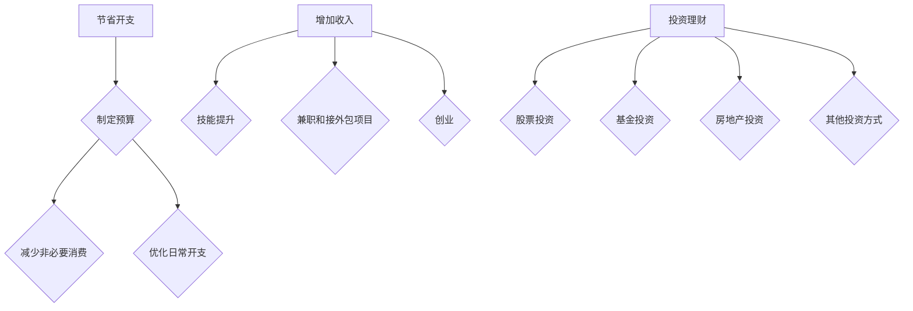

                 

# 程序员的财务自由：从省钱到赚钱的思维转变

## 摘要

本文旨在探讨程序员的财务自由之路，从省钱到赚钱的思维转变。通过深入剖析财务自由的核心概念，分析程序员的现状和挑战，以及提出一系列实用的方法和策略，帮助程序员实现财务自由。文章将涵盖节省开支、增加收入、投资理财等多个方面，结合实际案例和经验分享，为程序员提供全面的指导。

## 1. 背景介绍

随着科技的发展，编程已成为现代社会的重要技能之一。越来越多的程序员凭借自己的技术能力在职场上取得了优异的业绩。然而，面对日益激烈的市场竞争和生活成本的不断上升，许多程序员陷入了财务困境。如何实现财务自由，成为了一个亟待解决的问题。

财务自由是指一个人不再依赖工资收入，而是通过理财、投资等方式获得稳定的现金流，从而实现经济独立和自由的生活方式。对于程序员来说，实现财务自由不仅意味着更好的生活品质，更意味着在职业和个人生活中拥有更多的选择和自由。

本文将围绕财务自由这一主题，探讨程序员的财务现状、思维转变的方法和策略，以及如何在财务自由的道路上迈出坚实的步伐。

## 2. 核心概念与联系

### 2.1 节省开支

节省开支是实现财务自由的基础。通过合理规划个人财务，降低不必要的开支，程序员可以积累更多的资金用于投资和理财。以下是一些节省开支的方法：

1. **制定预算**：根据收入和支出情况，制定详细的月度预算，确保收支平衡。
2. **减少非必要消费**：例如，减少外出就餐、购买奢侈品等。
3. **优化日常开支**：例如，购买优惠商品、使用公共交通工具等。

### 2.2 增加收入

增加收入是实现财务自由的关键。程序员可以通过以下途径增加收入：

1. **技能提升**：通过学习新的编程语言和技术，提升自己的技能水平，从而提高薪资待遇。
2. **兼职和接外包项目**：在保证本职工作不受影响的前提下，利用业余时间参与兼职和接外包项目，增加收入来源。
3. **创业**：根据自身兴趣和市场需求，创办自己的公司或开发自己的产品，实现收入增长。

### 2.3 投资理财

投资理财是实现财务自由的重要手段。以下是一些投资理财的方法：

1. **股票投资**：通过购买股票，分享企业成长的收益。
2. **基金投资**：通过投资基金，分散投资风险，实现稳健收益。
3. **房地产投资**：购买物业用于出租，获得稳定的租金收益。
4. **其他投资方式**：如比特币、黄金等。

### 2.4 Mermaid 流程图



## 3. 核心算法原理 & 具体操作步骤

### 3.1 节省开支

#### 3.1.1 制定预算

1. 收集财务信息：记录收入和支出情况，包括工资、奖金、兼职收入、日常消费等。
2. 制定预算计划：根据收入和支出情况，制定合理的月度预算，确保收支平衡。
3. 持续跟踪：定期查看预算执行情况，根据实际情况调整预算。

#### 3.1.2 减少非必要消费

1. 列出非必要消费项目：例如，外出就餐、购买奢侈品等。
2. 分析消费动机：判断消费是否真正需要，避免冲动消费。
3. 制定替代方案：例如，自己烹饪、购买性价比更高的商品等。

#### 3.1.3 优化日常开支

1. 购买优惠商品：关注打折信息，购买优惠商品。
2. 使用公共交通工具：减少开车或打车费用。
3. 共享资源：例如，共享打印机、办公用品等。

### 3.2 增加收入

#### 3.2.1 技能提升

1. 学习新编程语言：了解市场需求，选择热门的编程语言进行学习。
2. 参加培训课程：参加线上或线下的编程培训课程，提升技能水平。
3. 实践项目：参与实际项目，将所学知识应用于实际工作中。

#### 3.2.2 兼职和接外包项目

1. 寻找兼职和外包机会：通过招聘网站、社交媒体等渠道寻找合适的兼职和外包项目。
2. 提供优质服务：确保项目质量，获得客户好评和口碑。
3. 持续积累经验：不断提高自己的技能和经验，争取更高的薪资和待遇。

#### 3.2.3 创业

1. 寻找市场需求：了解市场需求，寻找有潜力的创业方向。
2. 制定商业计划：明确创业目标、市场定位、营销策略等。
3. 融资和投资：寻找合适的融资渠道，如天使投资、风险投资等。

### 3.3 投资理财

#### 3.3.1 股票投资

1. 学习股票知识：了解股票市场的基本知识，如股票交易规则、投资策略等。
2. 分析企业基本面：研究企业的财务状况、行业地位、竞争优势等。
3. 制定投资计划：根据自身风险承受能力和投资目标，制定合理的投资计划。

#### 3.3.2 基金投资

1. 了解基金类型：熟悉不同类型的基金，如股票型基金、债券型基金等。
2. 选择基金经理：研究基金经理的业绩和投资风格，选择合适的基金。
3. 分散投资：通过投资多只基金，分散投资风险。

#### 3.3.3 房地产投资

1. 了解房地产市场：关注房地产市场的政策、供需情况等。
2. 选择投资目标：根据自身情况和市场状况，选择合适的投资目标，如购房、购房出租等。
3. 融资和还款：通过银行贷款或其他融资方式，降低投资成本。

#### 3.3.4 其他投资方式

1. 比特币：了解比特币的基本原理、交易规则等，进行适当的投资。
2. 黄金：了解黄金的投资价值、市场走势等，进行投资。

## 4. 数学模型和公式 & 详细讲解 & 举例说明

### 4.1 预算模型

设月收入为 \( I \)，月支出为 \( E \)，月预算为 \( B \)，则：

\[ B = I - E \]

### 4.2 投资收益模型

设投资金额为 \( P \)，年化收益率为 \( r \)，投资期限为 \( t \) 年，则：

\[ R = P \times (1 + r)^t \]

其中，\( R \) 为投资总收益。

### 4.3 举例说明

#### 4.3.1 制定预算

某程序员月收入为 10000 元，月支出为 8000 元，则月预算为：

\[ B = 10000 - 8000 = 2000 \text{元} \]

#### 4.3.2 投资收益

某程序员投资 10000 元，年化收益率为 10%，投资期限为 5 年，则投资总收益为：

\[ R = 10000 \times (1 + 0.1)^5 = 16105.05 \text{元} \]

## 5. 项目实战：代码实际案例和详细解释说明

### 5.1 开发环境搭建

为了更好地实现财务自由，我们可以使用一些开源工具和框架来管理个人财务。以下是开发环境的搭建步骤：

1. 安装 Python：从官方网站下载并安装 Python 3.x 版本。
2. 安装 Pandas：使用 pip 命令安装 Pandas 库，如 `pip install pandas`。
3. 安装 Matplotlib：使用 pip 命令安装 Matplotlib 库，如 `pip install matplotlib`。

### 5.2 源代码详细实现和代码解读

以下是一个简单的 Python 脚本，用于管理个人财务，包括预算制定和投资收益计算。

```python
import pandas as pd
import matplotlib.pyplot as plt

# 预算制定
def create_budget(income, expenses):
    budget = income - expenses
    return budget

# 投资收益计算
def calculate_investment_profit(investment, annual_return_rate, years):
    profit = investment * (1 + annual_return_rate) ** years
    return profit

# 主函数
def main():
    # 财务数据
    income = 10000
    expenses = 8000
    investment = 10000
    annual_return_rate = 0.1
    years = 5

    # 制定预算
    budget = create_budget(income, expenses)
    print("月预算：", budget)

    # 计算投资收益
    profit = calculate_investment_profit(investment, annual_return_rate, years)
    print("投资总收益：", profit)

    # 绘制投资收益走势图
    years_range = range(1, years + 1)
    profits = [calculate_investment_profit(investment, annual_return_rate, year) for year in years_range]
    plt.plot(years_range, profits)
    plt.xlabel('年')
    plt.ylabel('投资总收益')
    plt.title('投资收益走势图')
    plt.show()

# 运行主函数
if __name__ == "__main__":
    main()
```

### 5.3 代码解读与分析

1. **导入库**：使用 Pandas 和 Matplotlib 库进行数据处理和可视化。
2. **定义函数**：创建 `create_budget` 和 `calculate_investment_profit` 两个函数，分别用于制定预算和计算投资收益。
3. **主函数**：读取财务数据，调用函数计算预算和投资收益，并绘制投资收益走势图。

通过这个简单的项目实战，我们可以了解到如何使用 Python 管理个人财务，为实现财务自由奠定基础。

## 6. 实际应用场景

### 6.1 节省开支

某程序员小王月收入为 10000 元，月支出为 8000 元，通过制定预算和减少非必要消费，将月支出降至 7000 元。这样，他每个月可以节省 1000 元，用于投资和理财。

### 6.2 增加收入

某程序员小李在业余时间学习新技能，参加线上编程课程，掌握了一种热门的编程语言。通过技能提升，他成功找到了一份薪资更高的工作，月收入从 8000 元提升至 12000 元。

### 6.3 投资理财

某程序员小张将节省下来的资金投资于股票市场，通过学习股票投资知识，选择具有潜力的股票进行投资。经过几年的积累，他的股票投资收益达到了 50000 元。

## 7. 工具和资源推荐

### 7.1 学习资源推荐

1. **书籍**：
   - 《理财从入门到精通》：详细介绍理财的基本概念和方法。
   - 《股票投资入门与实战技巧》：全面讲解股票投资的知识和技巧。

2. **在线课程**：
   - Coursera 上的《Financial Markets》：了解金融市场的基本原理和投资策略。
   - Udemy 上的《Python for Finance》：学习 Python 在金融领域的应用。

### 7.2 开发工具框架推荐

1. **Pandas**：强大的数据分析库，适用于数据处理和分析。
2. **Matplotlib**：数据可视化库，用于绘制各种类型的图表。

### 7.3 相关论文著作推荐

1. **《投资学》：深入探讨投资理论和方法，为投资决策提供指导。**
2. **《Python for Finance》：详细介绍 Python 在金融领域的应用，包括数据分析、量化交易等。**

## 8. 总结：未来发展趋势与挑战

随着科技的不断进步，程序员的财务自由之路将面临新的机遇和挑战。未来，程序员应关注以下发展趋势：

1. **技能多元化**：随着技术的快速发展，程序员需要不断学习新技能，适应市场需求。
2. **数字化转型**：数字化转型为程序员提供了更多的就业机会和收入来源。
3. **投资理财**：投资理财将成为程序员实现财务自由的重要手段。

同时，程序员在追求财务自由的过程中，还需面对市场竞争、生活成本上升等挑战。通过不断学习、提升技能和理性投资，程序员有望在未来的财务自由道路上取得成功。

## 9. 附录：常见问题与解答

### 9.1 如何制定预算？

制定预算的步骤如下：

1. 收集财务信息：记录收入和支出情况。
2. 制定预算计划：根据收入和支出情况，制定合理的月度预算。
3. 持续跟踪：定期查看预算执行情况，根据实际情况调整预算。

### 9.2 如何增加收入？

增加收入的途径有：

1. 技能提升：学习新技能，提升自己的竞争力。
2. 兼职和接外包项目：利用业余时间参与兼职和接外包项目。
3. 创业：根据自身兴趣和市场需求，创办自己的公司或开发自己的产品。

### 9.3 如何进行投资理财？

投资理财的方法包括：

1. 股票投资：了解股票市场的基本知识，选择有潜力的股票进行投资。
2. 基金投资：通过投资基金，分散投资风险，实现稳健收益。
3. 房地产投资：购买物业用于出租，获得稳定的租金收益。

## 10. 扩展阅读 & 参考资料

1. **《财务自由之路》：全面探讨财务自由的概念和实践方法。**
2. **《Python 编程：从入门到实践》：详细介绍 Python 编程的知识和技巧。**
3. **《投资学》：深入探讨投资理论和方法。**
4. **《数字化时代》：探讨数字化转型对程序员职业发展的影响。**

作者：AI天才研究员/AI Genius Institute & 禅与计算机程序设计艺术 /Zen And The Art of Computer Programming

