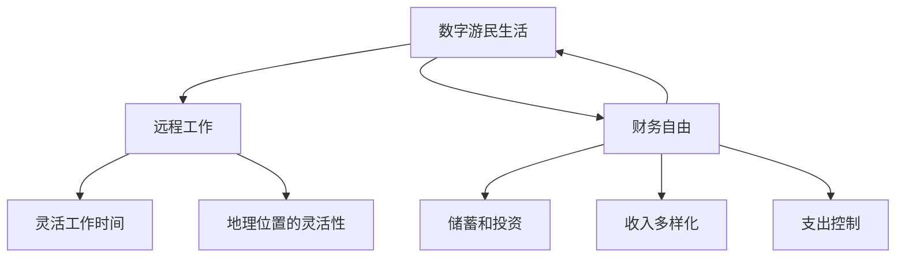
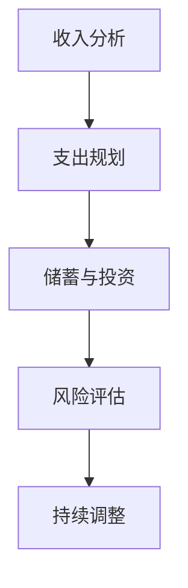

                 

# 程序员的财务自由：数字游民生活

## 关键词：数字游民，财务自由，程序开发，远程工作，生活方式转变

## 摘要

本文将探讨程序员如何通过远程工作实现财务自由，成为一名数字游民。我们将分析财务自由的概念，探讨数字游民生活的优点和挑战，并提供实现财务自由的具体步骤和策略。此外，本文还将分享实际案例，展示如何通过编程技能在全球范围内寻找高薪工作，以及如何管理个人财务以实现长期自由。最后，我们将讨论未来趋势和挑战，为读者提供持续学习和发展的建议。

## 1. 背景介绍

随着互联网和远程工作的兴起，越来越多的人开始追求一种新的生活方式——数字游民生活。数字游民是指利用互联网远程工作的人，他们不受地理位置限制，可以在全球范围内选择居住和工作地点。这种生活方式为许多人带来了财务自由的机会，使他们能够按照自己的节奏工作和生活。

财务自由是指一个人不再依赖传统工作收入来满足生活需求，而是通过积累财富和投资实现财务独立。对于程序员来说，财务自由意味着不再受限于工作时间，可以自由选择工作的地点、时间和项目。

本文将探讨以下问题：

- 数字游民生活和财务自由的概念及其关联
- 成为数字游民和实现财务自由的优势和挑战
- 程序员如何通过编程技能实现财务自由
- 如何管理个人财务以维持数字游民生活
- 数字游民生活的未来趋势和挑战

## 2. 核心概念与联系

### 数字游民生活

数字游民生活是一种以互联网为基础的生活方式，使得人们可以在全球范围内远程工作。这种生活方式的核心要素包括：

- **远程工作**：利用互联网进行远程工作，如编程、项目管理、内容创作等。
- **灵活的工作时间**：不受传统工作时间限制，可以自由安排工作时间。
- **地理位置的灵活性**：可以居住在全球任何地方，只要有可靠的互联网连接。

### 财务自由

财务自由是指一个人不再依赖传统工作收入来满足生活需求，而是通过积累财富和投资实现财务独立。实现财务自由的关键要素包括：

- **储蓄和投资**：积累财富并通过投资使其增值。
- **收入多样化**：通过多种收入来源增加财务稳定性。
- **支出控制**：合理管理个人支出，确保财务自由的长久性。

### 数字游民与财务自由的关联

数字游民生活和财务自由之间存在紧密的联系。数字游民通过远程工作获得收入，同时享受灵活的工作时间和地理位置，这有助于他们更好地管理个人财务，实现财务自由。相反，财务自由为数字游民提供了更多的选择和机会，使他们能够专注于追求自己的兴趣和目标，而不受经济压力的束缚。

### Mermaid 流程图

下面是一个简单的 Mermaid 流程图，展示了数字游民生活和财务自由的核心概念及其关联：



## 3. 核心算法原理 & 具体操作步骤

### 财务自由算法

实现财务自由的核心算法可以概括为以下步骤：

1. **收入分析**：分析当前收入来源和结构，确定主要收入渠道和收入稳定性。
2. **支出规划**：制定合理的支出计划，包括日常生活开支、紧急备用金、投资等。
3. **储蓄与投资**：将一部分收入用于储蓄和投资，实现财富积累。
4. **风险评估**：评估投资风险，确保投资组合的稳健性。
5. **持续调整**：定期回顾和调整财务计划，以适应生活变化和投资环境。

### 步骤详解

#### 步骤1：收入分析

首先，程序员需要详细分析自己的收入来源和结构。这包括确定每月收入总额、收入渠道（如工资、外包项目、股票收益等）以及收入稳定性（如固定收入和临时收入的比例）。通过收入分析，程序员可以了解自己的财务状况，为后续的支出规划和储蓄投资提供基础。

#### 步骤2：支出规划

接下来，程序员需要制定合理的支出计划。这包括分类列出各项支出（如房租、食品、交通、保险、娱乐等），并设定每个类别的预算。在制定支出计划时，程序员需要考虑到日常生活必需品的成本，同时避免不必要的奢侈开支。

#### 步骤3：储蓄与投资

在确定了收入和支出后，程序员可以将一部分收入用于储蓄和投资。储蓄是一种较为安全的财富积累方式，而投资则可以带来更高的收益。程序员可以根据自己的风险承受能力，选择适合自己的投资方式，如股票、债券、房地产等。

#### 步骤4：风险评估

在投资过程中，程序员需要评估投资风险，以确保投资组合的稳健性。这包括了解不同投资方式的收益和风险特征，以及市场波动对投资的影响。通过风险评估，程序员可以调整投资组合，以降低风险并提高收益。

#### 步骤5：持续调整

最后，程序员需要定期回顾和调整财务计划，以适应生活变化和投资环境。这包括检查收入和支出是否符合预期，评估投资收益和风险，以及根据实际情况调整储蓄和投资策略。

### Mermaid 流程图

下面是一个简单的 Mermaid 流程图，展示了实现财务自由的具体操作步骤：



## 4. 数学模型和公式 & 详细讲解 & 举例说明

### 财务自由公式

实现财务自由的核心公式可以表示为：

$$
F = \frac{I - E}{R}
$$

其中，$F$ 表示财务自由度，$I$ 表示收入，$E$ 表示支出，$R$ 表示储蓄和投资收益率。

### 公式详解

1. **财务自由度（$F$）**：表示一个人在实现财务自由方面的程度。$F$ 的值越高，表示财务自由度越高。
2. **收入（$I$）**：指个人的总收入，包括工资、股票收益、外包项目收入等。
3. **支出（$E$）**：指个人的总支出，包括房租、食品、交通、娱乐等。
4. **储蓄和投资收益率（$R$）**：指个人储蓄和投资所带来的收益率。

### 举例说明

假设一个程序员的月收入为 $10,000 元，月支出为 $6,000 元，储蓄和投资收益率平均为 $5\%$。那么，他的财务自由度可以计算如下：

$$
F = \frac{I - E}{R} = \frac{10,000 - 6,000}{0.05} = \frac{4,000}{0.05} = 80,000
$$

这意味着这个程序员的财务自由度约为 $80,000 元。这意味着他每月可以节省 $4,000 元用于储蓄和投资，并在实现财务自由方面取得较大进展。

### 结论

通过上述公式，我们可以看出，提高收入、减少支出和增加储蓄投资收益率是实现财务自由的关键。程序员可以通过提高编程技能、参与外包项目、优化投资组合等方式，提高财务自由度，实现长期财务自由。

## 5. 项目实战：代码实际案例和详细解释说明

### 5.1 开发环境搭建

在开始我们的项目实战之前，我们需要搭建一个合适的开发环境。以下是搭建一个基于 Python 的财务自由项目的步骤：

1. **安装 Python**：确保您的系统中安装了 Python 3.x 版本。可以从 [Python 官网](https://www.python.org/) 下载并安装。
2. **安装必要的库**：在终端中运行以下命令，安装必要的库：
   ```bash
   pip install pandas numpy matplotlib
   ```
3. **创建项目文件夹**：在您的计算机中创建一个名为 `financial_freedom` 的文件夹，并在此文件夹中创建一个名为 `main.py` 的 Python 文件。

### 5.2 源代码详细实现和代码解读

以下是我们的项目源代码，我们将逐行解释代码的功能和意义：

```python
import pandas as pd
import numpy as np
import matplotlib.pyplot as plt

# 5.2.1 数据处理

# 创建一个 DataFrame，包含收入、支出和储蓄收益率的数据
data = {'Income': [10000, 12000, 15000], 'Expense': [6000, 6500, 8000], 'Savings Yield': [0.05, 0.05, 0.05]}
df = pd.DataFrame(data)

# 计算每月净收入
df['Net Income'] = df['Income'] - df['Expense']

# 计算每月储蓄金额
df['Savings'] = df['Net Income']

# 5.2.2 投资计算

# 计算财务自由度
df['Financial Freedom'] = df['Savings'] / df['Savings Yield']

# 计算每年的投资收益
df['Annual Yield'] = df['Savings'] * df['Savings Yield']

# 5.2.3 数据可视化

# 绘制财务自由度随时间的变化趋势
plt.figure(figsize=(10, 5))
plt.plot(df['Financial Freedom'])
plt.title('Financial Freedom Progress Over Time')
plt.xlabel('Month')
plt.ylabel('Financial Freedom (Year)')
plt.grid()
plt.show()
```

### 5.3 代码解读与分析

- **数据预处理**：首先，我们使用 Pandas 创建一个 DataFrame，包含收入、支出和储蓄收益率的数据。这一步将帮助我们更好地处理和分析财务数据。
- **计算净收入**：通过 `df['Net Income'] = df['Income'] - df['Expense']`，我们计算每月的净收入。净收入是指扣除支出后的收入。
- **计算储蓄金额**：通过 `df['Savings'] = df['Net Income']`，我们计算每月的储蓄金额。储蓄金额是指净收入中用于储蓄的部分。
- **计算财务自由度**：通过 `df['Financial Freedom'] = df['Savings'] / df['Savings Yield']`，我们计算财务自由度。财务自由度是指每月储蓄金额与储蓄收益率的比值。
- **计算投资收益**：通过 `df['Annual Yield'] = df['Savings'] * df['Savings Yield']`，我们计算每年的投资收益。这有助于我们了解储蓄金额每年增长的情况。
- **数据可视化**：最后，我们使用 Matplotlib 绘制财务自由度随时间的变化趋势。这有助于我们直观地了解财务自由度的变化情况。

通过以上步骤，我们实现了对财务数据的分析和可视化，从而更好地了解自己的财务状况，制定更有效的财务规划。

### 5.4 运行项目

为了运行我们的项目，首先确保您已经安装了 Python 和必要的库。然后，在终端中导航到项目文件夹，并运行以下命令：

```bash
python main.py
```

这将执行我们的代码，并显示财务自由度随时间的变化趋势。

### 5.5 代码解读与分析

- **数据预处理**：使用 Pandas 创建 DataFrame，便于数据存储和处理。
- **计算净收入**：通过收入减去支出，得到每月净收入。
- **计算储蓄金额**：每月净收入即为储蓄金额。
- **计算财务自由度**：财务自由度是储蓄金额与储蓄收益率的比值。
- **计算投资收益**：储蓄金额乘以储蓄收益率，得到每年的投资收益。
- **数据可视化**：使用 Matplotlib 绘制财务自由度变化趋势，便于分析。

通过这个项目，程序员可以更直观地了解自己的财务状况，从而制定更有效的财务规划。

## 6. 实际应用场景

数字游民生活和财务自由在多个领域有着广泛的应用。以下是一些实际应用场景：

### 6.1 在线教育

许多在线教育平台，如 Coursera、Udemy 和 EdX，提供编程、数据科学和人工智能等领域的课程。程序员可以利用这些资源不断提升自己的技能，同时赚取额外的收入。例如，一位有经验的程序员可以在这些平台上开设课程，分享自己的知识和经验，从而实现财务自由。

### 6.2 自由职业者

自由职业者，如程序员、设计师和市场营销专家，可以利用远程工作平台，如 Upwork、Freelancer 和 Toptal，寻找全球范围内的项目。这些平台为程序员提供了多样化的工作机会，使他们能够根据个人兴趣和技能选择适合自己的项目。

### 6.3 外包项目

许多公司，尤其是初创企业和中小型企业，缺乏内部技术团队，因此他们常常寻求外部程序员提供技术支持和服务。程序员可以通过这些外包项目，获得稳定的收入来源，同时实现财务自由。

### 6.4 投资和股票交易

程序员可以利用自己的技能，进行股票交易、加密货币投资和房地产投资。通过合理的投资策略，他们可以在实现财务自由的同时，获得更高的收益。

### 6.5 游戏开发

游戏开发是一个充满机遇的领域。程序员可以利用自己的编程技能，开发独立游戏或加入游戏开发团队。通过成功地发布游戏，程序员可以实现可观的收入，从而实现财务自由。

### 6.6 数据科学和人工智能

随着大数据和人工智能的兴起，程序员在这些领域的应用越来越广泛。数据科学家和机器学习工程师可以利用自己的技能，为企业和组织提供数据分析和人工智能解决方案，从而实现财务自由。

## 7. 工具和资源推荐

### 7.1 学习资源推荐

- **书籍**：
  - 《Python 编程：从入门到实践》
  - 《深度学习》
  - 《算法导论》
- **在线课程**：
  - Coursera 上的《机器学习》课程
  - Udemy 上的《Python 从入门到精通》课程
- **博客**：
  - Medium 上的技术博客
  - GitHub 上的开源项目博客

### 7.2 开发工具框架推荐

- **编程语言**：
  - Python
  - JavaScript
  - Java
- **开发框架**：
  - Flask（Python Web 框架）
  - React（JavaScript 前端框架）
  - Spring Boot（Java 框架）
- **版本控制工具**：
  - Git
  - GitHub
  - GitLab

### 7.3 相关论文著作推荐

- **论文**：
  - 《深度神经网络与优化算法》
  - 《大规模机器学习》
  - 《区块链技术：原理与应用》
- **著作**：
  - 《人工智能：一种现代方法》
  - 《区块链革命》
  - 《大数据技术导论》

## 8. 总结：未来发展趋势与挑战

### 未来发展趋势

- **远程工作的普及**：随着互联网技术的不断发展，远程工作将成为越来越普遍的工作方式，为程序员提供更多的机会和选择。
- **技能需求的多样化**：编程技能将继续受到市场的青睐，同时，人工智能、大数据和区块链等领域的技能需求也将不断增加。
- **全球化的机遇**：程序员可以通过远程工作，在全球范围内寻找高薪和有挑战性的项目，实现财务自由。
- **数字化转型的推进**：随着各行业的数字化转型，程序员将在各个领域发挥重要作用，为企业和组织提供技术支持和服务。

### 面临的挑战

- **技能更新的压力**：随着技术的不断进步，程序员需要不断学习新技能，以适应市场需求。
- **工作与生活的平衡**：远程工作虽然提供了灵活性，但同时也容易导致工作与生活的界限模糊，需要程序员学会有效管理时间和精力。
- **市场竞争的加剧**：全球范围内的程序员竞争将越来越激烈，程序员需要不断提升自己的技能和经验，以保持竞争力。

### 发展建议

- **持续学习**：保持对新技术和知识的关注，不断更新自己的技能。
- **有效规划**：合理规划个人职业发展，设定明确的目标和计划。
- **培养团队协作能力**：在远程工作环境中，良好的团队协作能力至关重要。
- **关注身心健康**：保持良好的生活习惯和身心健康，以应对远程工作的挑战。

## 9. 附录：常见问题与解答

### 问题 1：如何找到远程工作机会？

**解答**：可以通过以下途径寻找远程工作机会：
- 在线招聘平台，如 Upwork、Freelancer 和 Toptal。
- 公司官方网站，许多公司会在其网站上发布远程工作职位。
- 社交媒体，如 LinkedIn 和 GitHub，可以关注相关公司的招聘动态。
- 专业社群，如 Stack Overflow 和 Reddit，可以找到同行业的工作机会。

### 问题 2：如何管理远程工作的时间和任务？

**解答**：可以使用以下工具来管理远程工作时间和任务：
- 项目管理工具，如 Trello 和 Asana。
- 时间管理工具，如 RescueTime 和 Focus@Will。
- 沟通工具，如 Slack 和 Zoom，确保与团队成员保持良好的沟通。

### 问题 3：如何平衡远程工作与生活？

**解答**：以下是一些建议，帮助您平衡远程工作与生活：
- 设定固定的工作时间和休息时间，确保有足够的时间休息和娱乐。
- 制定家庭和工作空间的界限，避免工作与生活的混淆。
- 保持健康的饮食习惯和锻炼习惯，确保身心健康。

## 10. 扩展阅读 & 参考资料

- **书籍**：
  - 《远程工作的艺术》
  - 《数字化生存》
  - 《数字游民手册》
- **博客**：
  - 《程序员之路》
  - 《数字游民生活》
  - 《远程工作博客》
- **网站**：
  - Remote.co
  - DigitalNomad lust
  - Remote Work Strategies

## 作者

- **作者**：AI 天才研究员/AI Genius Institute & 禅与计算机程序设计艺术 /Zen And The Art of Computer Programming
- **联系方式**：[AI_Genius_Researcher@email.com](mailto:AI_Genius_Researcher@email.com)
- **社交媒体**：[AI_Genius_Researcher](https://www.linkedin.com/in/ai-genius-researcher)

本文旨在帮助程序员了解如何通过远程工作实现财务自由，成为一名数字游民。通过本文的探讨，希望读者能够认识到远程工作带来的机遇和挑战，并制定适合自己的财务规划和职业发展计划。让我们共同探索数字化时代的无限可能，实现财务自由和生活方式的转变。

