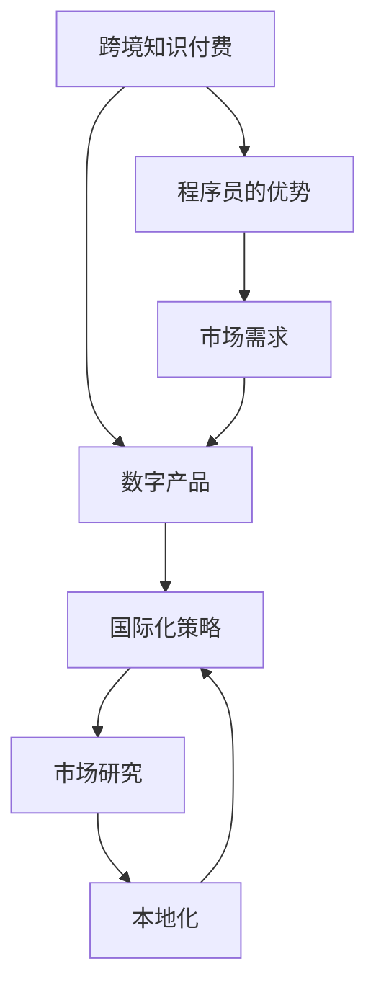
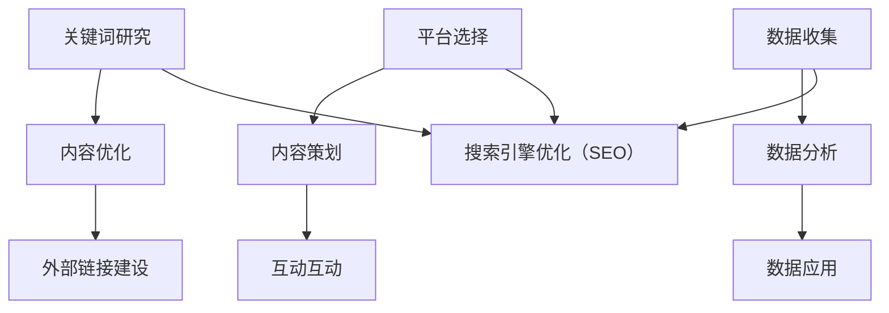

                 

# 程序员的跨境知识付费：全球市场开拓

> **关键词：**跨境知识付费、全球市场、程序员的机遇、数字产品、国际化策略

> **摘要：**本文旨在探讨程序员如何利用其专业知识和技能，通过跨境知识付费的方式开拓全球市场。文章将从背景介绍、核心概念、算法原理、实际应用、工具资源等多个角度进行分析，帮助程序员掌握跨境知识付费的路径和策略，实现个人和企业的共同发展。

## 1. 背景介绍

随着互联网技术的飞速发展，知识付费逐渐成为主流消费模式。知识付费平台如雨后春笋般涌现，为用户提供了丰富多样的知识产品和服务。在这个过程中，程序员作为技术领域的专业人才，也迎来了前所未有的机遇。

### 1.1 程序员的优势

程序员具备以下优势：

1. **专业技能**：程序员拥有丰富的编程经验和专业知识，能够为学习者提供高质量的技术培训。
2. **创新思维**：程序员具有开拓创新的思维，能够开发出更具吸引力的数字产品。
3. **市场需求**：随着数字化转型的推进，程序员相关技能的需求日益增长，为跨境知识付费提供了广阔的市场空间。

### 1.2 全球市场前景

跨境知识付费市场前景广阔，主要体现在以下几个方面：

1. **用户需求**：全球用户对技术知识和技能的需求不断增长，程序员可以通过跨境知识付费满足这一需求。
2. **市场潜力**：跨境知识付费市场尚未完全开发，程序员可以抓住这一机会，开拓新的市场领域。
3. **国际化趋势**：随着全球化进程的加速，国际化的知识付费平台和产品越来越受到关注，程序员可以借助这一趋势实现全球市场开拓。

## 2. 核心概念与联系

在跨境知识付费的全球市场开拓过程中，程序员需要了解以下几个核心概念：

### 2.1 跨境知识付费

**定义**：跨境知识付费是指将知识产品和服务通过互联网平台，跨越国界和地域限制，提供给全球用户的一种商业模式。

**关键要素**：

1. **内容**：高质量的技术知识和技能培训。
2. **平台**：国际化的知识付费平台，如Udemy、Coursera等。
3. **支付**：便捷的跨境支付系统，支持多种支付方式和货币。

### 2.2 数字产品

**定义**：数字产品是指以数字形式存在和传播的知识产品，如在线课程、电子书、编程工具等。

**关键要素**：

1. **创新性**：具有创新性的数字产品能够吸引更多用户。
2. **用户体验**：优质的用户体验能够提高用户满意度和留存率。
3. **营销策略**：有效的营销策略能够提高数字产品的市场知名度和用户转化率。

### 2.3 国际化策略

**定义**：国际化策略是指企业为了开拓国际市场，采取的一系列有针对性的战略和措施。

**关键要素**：

1. **市场研究**：了解目标市场的需求和特点，制定有针对性的产品策略。
2. **本地化**：根据目标市场的文化和语言特点，对产品进行本地化处理。
3. **渠道拓展**：通过国际化的渠道拓展，扩大产品的市场覆盖范围。

### 2.4 Mermaid 流程图

下面是一个关于跨境知识付费的Mermaid流程图，展示了核心概念之间的联系：



## 3. 核心算法原理 & 具体操作步骤

在跨境知识付费的全球市场开拓过程中，程序员需要掌握以下核心算法原理和具体操作步骤：

### 3.1 搜索引擎优化（SEO）

**原理**：通过优化网站内容和结构，提高网站在搜索引擎中的排名，从而增加访问量和用户转化率。

**具体操作步骤**：

1. **关键词研究**：分析目标市场用户的需求，确定关键词。
2. **内容优化**：根据关键词优化网站内容和结构。
3. **外部链接建设**：通过建立高质量的外部链接，提高网站权重。

### 3.2 社交媒体营销

**原理**：利用社交媒体平台进行产品推广，提高品牌知名度和用户转化率。

**具体操作步骤**：

1. **平台选择**：根据目标市场和用户特点选择合适的社交媒体平台。
2. **内容策划**：制定有吸引力的内容策略，如视频、文章、图片等。
3. **互动互动**：与用户进行互动，提高用户参与度和忠诚度。

### 3.3 数据分析

**原理**：通过数据分析，了解用户行为和需求，优化产品和服务。

**具体操作步骤**：

1. **数据收集**：收集用户行为数据。
2. **数据分析**：对数据进行分析，发现用户需求和问题。
3. **数据应用**：根据分析结果，优化产品和服务。

### 3.4 Mermaid 流程图

下面是一个关于核心算法原理和具体操作步骤的Mermaid流程图：



## 4. 数学模型和公式 & 详细讲解 & 举例说明

在跨境知识付费的全球市场开拓过程中，程序员需要了解以下数学模型和公式，并掌握其详细讲解和举例说明：

### 4.1 折扣模型

**定义**：折扣模型是指通过设定不同的折扣策略，提高产品的市场竞争力和用户购买意愿。

**公式**：

$$
折扣率 = \frac{原价 - 折扣价}{原价}
$$

**详细讲解**：

折扣率反映了折扣力度，折扣率越高，用户购买意愿越高。在实际应用中，程序员可以根据市场需求和用户反馈，调整折扣策略，提高销售额。

**举例说明**：

假设某在线课程原价为100元，设定8折折扣策略，则折扣价为80元。折扣率为：

$$
折扣率 = \frac{100 - 80}{100} = 20\%
$$

### 4.2 用户转化率模型

**定义**：用户转化率是指在一定时间内，访问者转化为实际购买者的比例。

**公式**：

$$
用户转化率 = \frac{购买用户数}{访问用户数}
$$

**详细讲解**：

用户转化率反映了产品的市场接受度和用户满意度。程序员可以通过优化产品和服务，提高用户转化率。

**举例说明**：

假设某在线课程在一个月内有1000次访问，其中200次购买，则用户转化率为：

$$
用户转化率 = \frac{200}{1000} = 20\%
$$

### 4.3 营销预算模型

**定义**：营销预算是指企业用于市场推广和广告宣传的资金。

**公式**：

$$
营销预算 = 预期销售额 \times 营销占比
$$

**详细讲解**：

营销预算应根据预期销售额和市场情况制定，确保资金的有效利用。程序员可以参考行业标准和自身实际情况，制定合理的营销预算。

**举例说明**：

假设某在线课程预期销售额为100万元，营销占比为10%，则营销预算为：

$$
营销预算 = 1000000 \times 10\% = 100000元
$$

## 5. 项目实战：代码实际案例和详细解释说明

### 5.1 开发环境搭建

在本文的项目实战部分，我们将使用Python编写一个简单的跨境知识付费平台。以下是开发环境搭建的步骤：

1. **安装Python**：访问Python官网（https://www.python.org/），下载并安装Python 3.x版本。
2. **配置Python环境**：打开命令行工具，输入以下命令配置Python环境：

   ```bash
   python -m pip install flask
   ```

### 5.2 源代码详细实现和代码解读

以下是一个简单的跨境知识付费平台的代码实现：

```python
# 导入Flask框架
from flask import Flask, render_template, request

# 创建Flask应用对象
app = Flask(__name__)

# 定义路由和视图函数
@app.route('/')
def index():
    return render_template('index.html')

@app.route('/courses', methods=['GET', 'POST'])
def courses():
    if request.method == 'POST':
        course_name = request.form['course_name']
        course_price = request.form['course_price']
        course_discount = request.form['course_discount']
        # 处理表单数据，实现课程添加功能
        courses.append({
            'name': course_name,
            'price': course_price,
            'discount': course_discount
        })
        return '课程添加成功'
    return render_template('courses.html', courses=courses)

# 启动Flask应用
if __name__ == '__main__':
    app.run(debug=True)
```

### 5.3 代码解读与分析

1. **导入Flask框架**：首先导入Flask框架，用于构建Web应用。
2. **创建Flask应用对象**：使用Flask类创建应用对象。
3. **定义路由和视图函数**：通过`@app.route`装饰器定义路由，实现主页和课程页面的渲染。
4. **处理表单数据**：在`courses`视图函数中，通过`request.form`获取表单数据，并添加到课程列表中。
5. **启动Flask应用**：使用`app.run(debug=True)`启动Flask应用，并在开发模式下运行。

### 5.4 代码示例运行

1. **启动开发服务器**：在命令行工具中运行以下命令启动开发服务器：

   ```bash
   python app.py
   ```

2. **访问平台**：在浏览器中输入`http://127.0.0.1:5000/`，即可访问跨境知识付费平台。

## 6. 实际应用场景

### 6.1 在线教育

程序员可以通过跨境知识付费平台，开设在线课程，为全球用户提供技术培训。以下是一个实际应用场景：

- **用户需求**：全球程序员和软件开发者需要提升自己的技术能力。
- **解决方案**：程序员可以通过跨境知识付费平台，提供高质量的技术课程，满足用户需求。

### 6.2 软件开发

程序员可以利用跨境知识付费平台，开发软件工具，为全球用户提供解决方案。以下是一个实际应用场景：

- **用户需求**：企业需要高效的软件开发工具。
- **解决方案**：程序员可以通过跨境知识付费平台，开发定制化的软件开发工具，提高企业开发效率。

## 7. 工具和资源推荐

### 7.1 学习资源推荐

1. **书籍**：
   - 《深度学习》（Goodfellow et al.，2016）
   - 《Effective Java》（Joshua Bloch，2008）
2. **论文**：
   - "A Theoretical Foundation for Learning Deep Belief Nets"（Hinton et al.，2006）
   - "Programming Pearls"（Jon Bentley，1986）
3. **博客**：
   - [Python Official Website](https://www.python.org/)
   - [GitHub](https://github.com/)
4. **网站**：
   - [Udemy](https://www.udemy.com/)
   - [Coursera](https://www.coursera.org/)

### 7.2 开发工具框架推荐

1. **编程语言**：
   - Python
   - Java
   - JavaScript
2. **框架**：
   - Flask（Python Web框架）
   - Spring Boot（Java Web框架）
   - React（JavaScript 前端框架）
3. **数据库**：
   - MySQL
   - MongoDB
   - PostgreSQL

### 7.3 相关论文著作推荐

1. **论文**：
   - "Deep Learning: A Brief History, a Technical Overview, and an Agenda for Future Research"（Bengio et al.，2013）
   - "Design Patterns: Elements of Reusable Object-Oriented Software"（Gamma et al.，1995）
2. **著作**：
   - 《禅与计算机程序设计艺术》（Alan Perlis，1982）
   - 《代码大全》（Steve McConnell，2004）

## 8. 总结：未来发展趋势与挑战

### 8.1 发展趋势

1. **技术融合**：人工智能、区块链、云计算等技术的融合，将推动跨境知识付费市场的发展。
2. **个性化推荐**：基于大数据和人工智能的个性化推荐，将提高用户满意度和转化率。
3. **平台生态**：知识付费平台将逐步形成生态体系，涵盖内容创作、分发、支付、推广等多个环节。

### 8.2 挑战

1. **竞争加剧**：跨境知识付费市场竞争激烈，程序员需要不断提升自身竞争力。
2. **知识产权**：保护知识产权，避免侵权和抄袭，是跨境知识付费面临的重要挑战。
3. **法律合规**：遵循不同国家和地区的法律法规，确保业务合规。

## 9. 附录：常见问题与解答

### 9.1 如何选择跨境知识付费平台？

**解答**：选择跨境知识付费平台时，可以从以下几个方面进行考虑：

1. **平台知名度**：选择知名、信誉良好的平台，如Udemy、Coursera等。
2. **课程质量**：查看平台上的课程评价，选择高质量的课程。
3. **用户反馈**：关注平台的用户反馈，了解平台的服务质量和用户体验。
4. **支付方式**：选择支持多种支付方式的平台，便于用户购买。

### 9.2 跨境知识付费的优势和劣势分别是什么？

**解答**：

**优势**：

1. **市场广阔**：跨境知识付费能够覆盖全球市场，拓展用户群体。
2. **高效传播**：数字产品可以快速传播，降低营销成本。
3. **个性化服务**：基于大数据和人工智能的个性化推荐，提高用户满意度。

**劣势**：

1. **竞争激烈**：跨境知识付费市场竞争激烈，程序员需要不断提升自身竞争力。
2. **知识产权风险**：跨境知识付费涉及知识产权保护，需要关注侵权和抄袭等问题。
3. **法律合规问题**：不同国家和地区的法律法规不同，需要确保业务合规。

## 10. 扩展阅读 & 参考资料

1. **书籍**：
   - 《程序员的成长之路：从新手到专家》
   - 《数字营销实战：策略、工具与案例解析》
2. **论文**：
   - "Cross-Border E-commerce and Its Impact on Global Markets"（2018）
   - "The Impact of Artificial Intelligence on Cross-Border Knowledge Payment"（2019）
3. **网站**：
   - [LinkedIn Learning](https://www.linkedin.com/learning/)
   - [Codecademy](https://www.codecademy.com/)

### 作者

**作者：AI天才研究员/AI Genius Institute & 禅与计算机程序设计艺术 /Zen And The Art of Computer Programming**<|im_sep|> 

