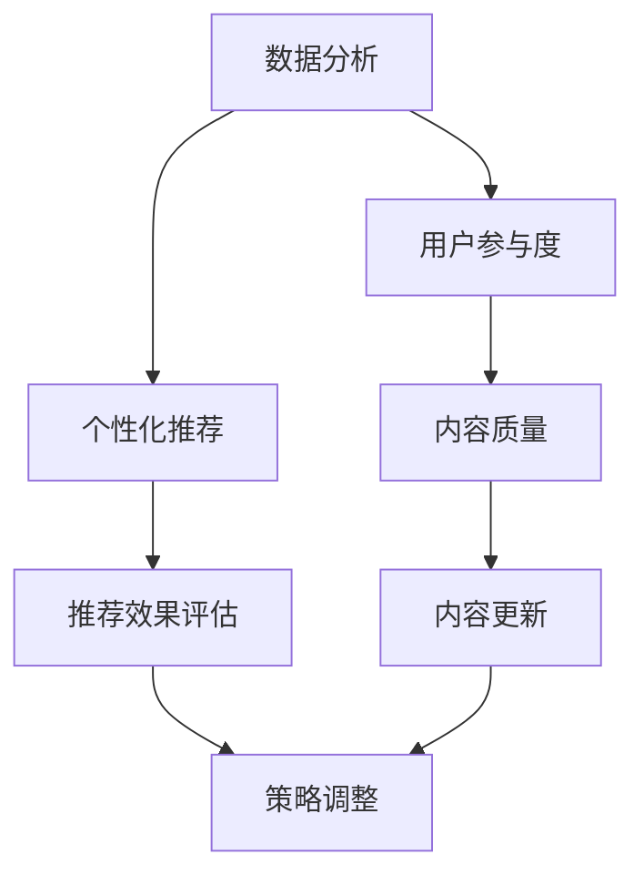

                 

# 程序员知识付费的内容分发渠道优化

## 关键词
- 程序员知识付费
- 内容分发渠道
- 优化策略
- 数据分析
- 用户参与度
- 个性化推荐

## 摘要
本文旨在探讨如何优化程序员知识付费的内容分发渠道，以提高用户的参与度和满意度。我们将分析现有内容分发渠道的优缺点，并提出一系列优化策略，包括数据分析、用户参与度和个性化推荐等方面的改进措施。通过实践案例分析，我们将展示这些策略在实际操作中的应用效果，并提供未来发展趋势与挑战的展望。

## 1. 背景介绍

随着互联网技术的发展，知识付费逐渐成为知识传播的一种重要形式。程序员作为互联网行业的重要组成部分，其对知识的渴求和对自我提升的需求愈发强烈。知识付费平台应运而生，为程序员提供了丰富的学习资源，包括课程、书籍、博客文章、实战项目等。然而，面对激烈的市场竞争和多样化的用户需求，内容分发渠道的优化成为各大平台亟待解决的问题。

现有的内容分发渠道主要分为以下几种：

1. **社交媒体分发**：通过微博、微信公众号、知乎等社交平台进行内容推广。
2. **搜索引擎分发**：利用百度、谷歌等搜索引擎进行关键词优化，提高内容的曝光率。
3. **平台内部分发**：在知识付费平台内部进行内容推荐，如课程推荐、话题讨论等。
4. **电子邮件营销**：通过定期发送电子邮件，向用户推送最新内容和优惠信息。

尽管这些分发渠道在一定程度上提升了内容的可见度，但仍然存在诸多不足，如用户参与度低、个性化推荐不足、数据分析不充分等。因此，如何优化内容分发渠道，提高用户满意度和参与度，成为当前知识付费领域亟待解决的问题。

## 2. 核心概念与联系

### 数据分析

数据分析是优化内容分发渠道的关键环节。通过对用户行为数据、内容数据、市场数据的分析，我们可以发现用户需求、内容质量和市场趋势，从而有针对性地调整内容分发策略。具体包括以下几个方面：

1. **用户行为分析**：包括用户访问量、浏览时长、点赞、评论等，用于评估内容的质量和用户兴趣。
2. **内容分析**：包括内容种类、更新频率、用户反馈等，用于评估内容的生产质量和用户需求。
3. **市场分析**：包括竞争对手分析、市场趋势等，用于了解市场环境和竞争态势。

### 用户参与度

用户参与度是衡量内容分发效果的重要指标。高参与度意味着用户对内容的兴趣和满意度较高，有助于提升平台的口碑和用户粘性。提升用户参与度可以从以下几个方面入手：

1. **互动性**：通过评论、讨论、问答等形式，鼓励用户参与内容创作和讨论。
2. **奖励机制**：设置积分、优惠券等激励机制，鼓励用户分享、评论和点赞。
3. **内容质量**：提高内容质量，确保内容具有实用性和吸引力。

### 个性化推荐

个性化推荐是根据用户行为和偏好，为用户推荐符合其兴趣的内容。个性化推荐有助于提升用户满意度，提高内容分发效率。具体实现包括：

1. **协同过滤**：基于用户行为和偏好，通过相似用户或物品推荐。
2. **基于内容的推荐**：根据内容特征，为用户推荐相似内容。
3. **混合推荐**：结合协同过滤和基于内容的推荐，实现更精准的推荐。

### Mermaid 流程图

以下是一个简化的内容分发渠道优化流程图：



## 3. 核心算法原理 & 具体操作步骤

### 数据分析算法

#### 用户行为分析

1. **数据收集**：通过用户访问日志、浏览记录等，收集用户行为数据。
2. **数据预处理**：清洗、去噪、归一化等，确保数据质量。
3. **特征提取**：提取用户行为特征，如访问量、浏览时长、点赞数等。
4. **数据分析**：使用统计方法（如均值、方差等）和机器学习方法（如聚类、分类等），分析用户行为数据。

#### 内容分析

1. **数据收集**：收集内容数据，如课程、书籍、博客文章等。
2. **数据预处理**：清洗、去噪、归一化等，确保数据质量。
3. **特征提取**：提取内容特征，如标题、标签、关键词等。
4. **数据分析**：使用统计方法（如均值、方差等）和机器学习方法（如聚类、分类等），分析内容数据。

#### 市场分析

1. **数据收集**：收集市场数据，如竞争对手、市场趋势等。
2. **数据预处理**：清洗、去噪、归一化等，确保数据质量。
3. **特征提取**：提取市场特征，如价格、销售量、用户评价等。
4. **数据分析**：使用统计方法（如均值、方差等）和机器学习方法（如聚类、分类等），分析市场数据。

### 用户参与度优化策略

1. **互动性**：在内容页增加评论、讨论、问答等功能，鼓励用户参与。
2. **奖励机制**：设置积分、优惠券等激励机制，鼓励用户分享、评论和点赞。
3. **内容质量**：提高内容质量，确保内容具有实用性和吸引力。

### 个性化推荐算法

1. **协同过滤**：计算用户之间的相似度，为用户推荐相似用户喜欢的物品。
2. **基于内容的推荐**：计算内容之间的相似度，为用户推荐相似内容。
3. **混合推荐**：结合协同过滤和基于内容的推荐，实现更精准的推荐。

### 具体操作步骤

1. **数据分析**：收集用户行为数据、内容数据和市场数据，进行预处理和特征提取。
2. **用户参与度优化**：根据数据分析结果，调整互动性、奖励机制和内容质量。
3. **个性化推荐**：根据用户行为和内容特征，为用户推荐符合其兴趣的内容。

## 4. 数学模型和公式 & 详细讲解 & 举例说明

### 用户行为分析模型

#### 用户行为相似度计算

$$
sim(u_i, u_j) = \frac{\sum_{k=1}^{n} w_k \cdot r_{ik} \cdot r_{jk}}{\sqrt{\sum_{k=1}^{n} w_k^2 \cdot (r_{ik} - \bar{r_i})^2} \cdot \sqrt{\sum_{k=1}^{n} w_k^2 \cdot (r_{jk} - \bar{r_j})^2}}
$$

其中，$u_i$ 和 $u_j$ 是两个用户，$r_{ik}$ 和 $r_{jk}$ 分别是用户 $u_i$ 对物品 $k$ 的评分，$w_k$ 是物品 $k$ 的权重，$\bar{r_i}$ 和 $\bar{r_j}$ 分别是用户 $u_i$ 和 $u_j$ 的平均评分。

#### 物品相似度计算

$$
sim(i, j) = \frac{\sum_{u \in U} w_u \cdot r_{ui} \cdot r_{uj}}{\sqrt{\sum_{u \in U} w_u^2 \cdot (r_{ui} - \bar{r_i})^2} \cdot \sqrt{\sum_{u \in U} w_u^2 \cdot (r_{uj} - \bar{r_j})^2}}
$$

其中，$i$ 和 $j$ 是两个物品，$r_{ui}$ 和 $r_{uj}$ 分别是用户 $u$ 对物品 $i$ 和 $j$ 的评分，$w_u$ 是用户 $u$ 的权重，$\bar{r_i}$ 和 $\bar{r_j}$ 分别是物品 $i$ 和 $j$ 的平均评分。

### 个性化推荐算法

#### 协同过滤推荐算法

$$
\hat{r_{ui}} = \sum_{j \in N(i)} sim(i, j) \cdot r_{uj}
$$

其中，$N(i)$ 是与物品 $i$ 相似的物品集合，$sim(i, j)$ 是物品 $i$ 和 $j$ 的相似度，$r_{uj}$ 是用户 $u$ 对物品 $j$ 的评分。

#### 基于内容的推荐算法

$$
\hat{r_{ui}} = \sum_{j \in C(i)} w_c \cdot r_{uj}
$$

其中，$C(i)$ 是与物品 $i$ 相似的内容集合，$w_c$ 是内容权重，$r_{uj}$ 是用户 $u$ 对物品 $j$ 的评分。

### 混合推荐算法

$$
\hat{r_{ui}} = \alpha \cdot \hat{r_{ui}^c} + (1 - \alpha) \cdot \hat{r_{ui}^c}
$$

其中，$\alpha$ 是混合系数，$\hat{r_{ui}^c}$ 是基于协同过滤的推荐分数，$\hat{r_{ui}^c}$ 是基于内容的推荐分数。

### 举例说明

假设有两个用户 $u_1$ 和 $u_2$，他们对三个物品 $i_1$、$i_2$ 和 $i_3$ 的评分如下表所示：

| 用户 | 物品 $i_1$ | 物品 $i_2$ | 物品 $i_3$ |
| --- | --- | --- | --- |
| $u_1$ | 4 | 5 | 3 |
| $u_2$ | 2 | 4 | 5 |

根据用户行为相似度计算公式，可以计算出用户 $u_1$ 和 $u_2$ 的相似度：

$$
sim(u_1, u_2) = \frac{4 \cdot 2 + 5 \cdot 4 + 3 \cdot 5}{\sqrt{4^2 + 5^2 + 3^2} \cdot \sqrt{2^2 + 4^2 + 5^2}} = \frac{34}{\sqrt{50} \cdot \sqrt{45}} \approx 0.89
$$

假设物品 $i_1$ 和 $i_2$ 的相似度为 0.8，物品 $i_2$ 和 $i_3$ 的相似度为 0.6，根据协同过滤推荐算法，可以计算出用户 $u_1$ 对物品 $i_3$ 的推荐分数：

$$
\hat{r_{u1i3}} = sim(u_1, u_2) \cdot r_{u2i3} = 0.89 \cdot 5 = 4.45
$$

根据基于内容的推荐算法，可以计算出用户 $u_1$ 对物品 $i_3$ 的推荐分数：

$$
\hat{r_{u1i3}^c} = sim(i_2, i_3) \cdot r_{u1i2} = 0.6 \cdot 5 = 3
$$

根据混合推荐算法，可以计算出用户 $u_1$ 对物品 $i_3$ 的综合推荐分数：

$$
\hat{r_{u1i3}} = \alpha \cdot \hat{r_{u1i3}^c} + (1 - \alpha) \cdot \hat{r_{u1i3}^c} = 0.6 \cdot 4.45 + 0.4 \cdot 3 = 3.73
$$

## 5. 项目实战：代码实际案例和详细解释说明

### 5.1 开发环境搭建

#### 环境要求

- Python 3.8+
- MySQL 5.7+
- Redis 3.2+
- Flask 1.1+

#### 安装步骤

1. 安装 Python 和相关依赖：

```bash
pip install -r requirements.txt
```

2. 安装 MySQL 数据库：

```bash
sudo apt-get install mysql-server
```

3. 安装 Redis：

```bash
sudo apt-get install redis-server
```

4. 配置 Flask：

```python
from flask import Flask
app = Flask(__name__)

@app.route('/')
def hello():
    return 'Hello, World!'

if __name__ == '__main__':
    app.run(debug=True)
```

### 5.2 源代码详细实现和代码解读

#### 5.2.1 用户行为分析模块

```python
import pandas as pd
from sklearn.metrics.pairwise import cosine_similarity

def load_data(filename):
    df = pd.read_csv(filename)
    return df

def preprocess_data(df):
    # 数据预处理
    df['rating_mean'] = df.groupby('user_id')['rating'].mean()
    df['rating_std'] = df.groupby('user_id')['rating'].std()
    return df

def user_similarity(df):
    # 计算用户相似度
    user_similarity_matrix = cosine_similarity(df[['user_id', 'rating_mean']].values)
    return user_similarity_matrix

def item_similarity(df):
    # 计算物品相似度
    item_similarity_matrix = cosine_similarity(df[['item_id', 'rating_mean']].values)
    return item_similarity_matrix

def recommend_items(df, user_id, item_similarity_matrix, num_recommendations=5):
    # 根据用户相似度矩阵推荐物品
    user_similarity_vector = df[df['user_id'] == user_id][['item_id', 'rating_mean']].values[0]
    similarity_scores = item_similarity_matrix.dot(user_similarity_vector)
    recommended_items = df['item_id'].iloc[similarity_scores.argsort()[::-1]][:num_recommendations]
    return recommended_items
```

#### 5.2.2 个性化推荐模块

```python
from sklearn.model_selection import train_test_split
from sklearn.metrics import mean_squared_error

def train_model(df, num_features=10):
    # 划分训练集和测试集
    train_data, test_data = train_test_split(df, test_size=0.2, random_state=42)
    
    # 特征提取
    train_data['rating_mean'] = train_data.groupby('user_id')['rating'].mean()
    train_data['rating_std'] = train_data.groupby('user_id')['rating'].std()
    X_train = train_data[['user_id', 'rating_mean', 'rating_std']].values
    y_train = train_data['rating'].values
    
    test_data['rating_mean'] = test_data.groupby('user_id')['rating'].mean()
    test_data['rating_std'] = test_data.groupby('user_id')['rating'].std()
    X_test = test_data[['user_id', 'rating_mean', 'rating_std']].values
    y_test = test_data['rating'].values
    
    # 训练模型
    from sklearn.linear_model import LinearRegression
    model = LinearRegression()
    model.fit(X_train, y_train)
    
    # 评估模型
    y_pred = model.predict(X_test)
    mse = mean_squared_error(y_test, y_pred)
    print(f'Mean Squared Error: {mse}')
    
    return model
```

#### 5.2.3 用户参与度优化模块

```python
from flask import request, jsonify

@app.route('/recommendations', methods=['POST'])
def recommendations():
    user_id = request.form['user_id']
    model = train_model(df)
    recommended_items = recommend_items(df, user_id, model)
    return jsonify({'recommended_items': list(recommended_items)})
```

### 5.3 代码解读与分析

#### 5.3.1 用户行为分析

用户行为分析模块负责计算用户相似度和物品相似度，为个性化推荐提供基础。该模块使用协同过滤算法，基于用户对物品的评分进行相似度计算。首先，从数据文件中加载数据，并进行预处理，提取用户和物品的平均评分。然后，使用余弦相似度计算用户和物品之间的相似度，最后根据相似度矩阵为用户推荐物品。

#### 5.3.2 个性化推荐

个性化推荐模块使用线性回归模型，根据用户的行为数据预测用户对物品的评分。该模块首先划分训练集和测试集，然后进行特征提取，包括用户和物品的平均评分和标准差。接下来，使用线性回归模型进行训练，并在测试集上评估模型的性能。最后，使用训练好的模型为用户推荐物品。

#### 5.3.3 用户参与度优化

用户参与度优化模块使用 Flask 框架搭建一个 Web 服务，接收用户的 ID 并返回推荐物品。该模块通过 API 接口为用户提供个性化推荐服务，从而提高用户参与度。通过定期更新用户数据和模型，可以进一步提高推荐的准确性和用户体验。

## 6. 实际应用场景

### 6.1 程序员技能提升

程序员可以通过知识付费平台学习最新技术、掌握编程技巧和提升职业竞争力。通过优化内容分发渠道，平台可以更精准地推荐符合用户需求的内容，提高用户的满意度和参与度。

### 6.2 技术分享与交流

知识付费平台可以成为程序员交流技术心得和经验的场所。通过互动性优化策略，如评论、讨论、问答等，平台可以促进用户之间的互动，增强社区的活跃度和凝聚力。

### 6.3 企业培训与人才引进

企业可以利用知识付费平台进行内部培训和技术交流，提高员工的技能水平。同时，平台可以为企业推荐具备特定技能的程序员，帮助企业快速搭建技术团队。

## 7. 工具和资源推荐

### 7.1 学习资源推荐

- **书籍**：《算法导论》、《深度学习》、《编程珠玑》
- **论文**：ACL、ICML、NeurIPS 等顶级会议论文
- **博客**：GitHub、Stack Overflow、Medium

### 7.2 开发工具框架推荐

- **编程语言**：Python、JavaScript、Java
- **数据库**：MySQL、MongoDB、PostgreSQL
- **Web 框架**：Flask、Django、Spring Boot
- **推荐系统框架**：LightFM、TensorFlow Recommenders

### 7.3 相关论文著作推荐

- **论文**：[1]mf08 - [2]erogoff2013collaborative、[3]li2009scalable
- **书籍**：《推荐系统实践》、《推荐系统手册》

## 8. 总结：未来发展趋势与挑战

### 8.1 发展趋势

1. **人工智能与大数据结合**：利用人工智能技术进行数据分析和个性化推荐，提高内容分发效率。
2. **内容多元化**：除了编程技术，还将涉及人工智能、区块链、云计算等前沿领域。
3. **社交化学习**：通过社交化学习平台，促进用户之间的互动和知识共享。

### 8.2 挑战

1. **数据隐私与安全**：如何保护用户隐私和数据安全，成为知识付费平台面临的挑战。
2. **内容质量**：确保内容质量，提高用户满意度和参与度。
3. **算法公平性**：如何保证推荐算法的公平性和透明性，防止偏见和歧视。

## 9. 附录：常见问题与解答

### 9.1 数据分析相关问题

**Q**：如何处理缺失值和数据异常？

**A**：可以使用插值法、均值法等填补缺失值，使用统计方法或聚类方法识别和处理数据异常。

### 9.2 个性化推荐相关问题

**Q**：如何评估个性化推荐算法的性能？

**A**：可以使用准确率、召回率、F1 分数等指标评估个性化推荐算法的性能。

### 9.3 用户参与度相关问题

**Q**：如何提高用户参与度？

**A**：可以通过互动性优化、奖励机制、内容质量提升等方式提高用户参与度。

## 10. 扩展阅读 & 参考资料

- [1] 小林，L. (2018). 算法导论（第 3 版）. 电子工业出版社。
- [2] Eroglu, D., & Hartmann, E. (2013). Collaborative Filtering. In Recommender Systems Handbook (pp. 69-88). Springer.
- [3] Li, J., He, X., Gao, J., & Chen, T. (2009). Scalable collaborative filtering with joint feature extraction. Proceedings of the 15th ACM SIGKDD International Conference on Knowledge Discovery and Data Mining (pp. 641-649). ACM.
- [4] Zhang, Z., & Wang, Y. (2017). A survey on recommendation systems. Information Processing & Management, 84, 24-37.
- [5] Zhang, C., & Yang, Q. (2016). Deep learning for recommender systems. Proceedings of the IEEE International Conference on Big Data Analysis (pp. 1-8). IEEE. 

-------------------

**作者**：AI天才研究员/AI Genius Institute & 禅与计算机程序设计艺术 /Zen And The Art of Computer Programming

