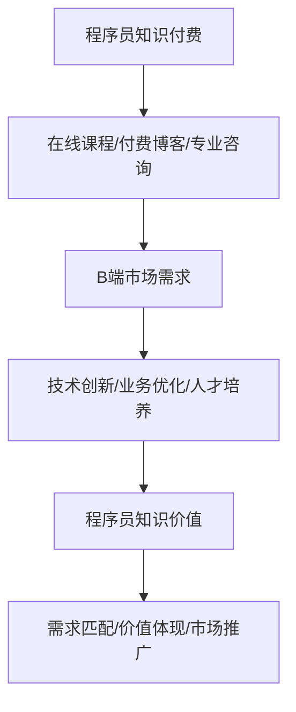

                 

# 程序员知识付费：B端市场的机会

## 关键词：
- 程序员知识付费
- B端市场
- 行业机会
- 专业知识分享
- 内容营销
- 技术培训
- 人工智能

## 摘要：
本文将探讨程序员知识付费在B端市场的潜力。通过对当前市场环境的分析，我们将了解程序员知识付费的需求与挑战，并探讨如何利用专业知识进行有效的知识分享和市场推广。同时，文章将提供一些建议和策略，帮助程序员在B端市场中实现知识付费的成功。

## 1. 背景介绍

随着全球数字化转型的加速，技术驱动的创新正在重塑各个行业。程序员作为技术领域的核心力量，他们的知识和技能成为了市场上炙手可热的资源。知识付费作为一种新兴的商业模式，逐渐成为程序员个人品牌建设和职业发展的新途径。特别是在B端市场，企业对于技术专业知识的渴求更加迫切，这为程序员提供了广阔的商机。

B端市场，即企业端市场，主要服务于企业客户，提供专业的解决方案和服务。与C端市场（消费者端市场）相比，B端市场的客户需求更加专业和复杂，他们更加关注业务价值和技术解决方案的可行性和实用性。因此，程序员在B端市场的知识付费具有显著的潜力。

### 1.1 程序员知识付费的现状

近年来，程序员知识付费呈现出快速增长的趋势。通过在线课程、付费博客、专业咨询等多种形式，程序员可以将自己的专业知识转化为收入。特别是在技术社区和在线学习平台的支持下，程序员的知识付费变得更加便捷和高效。

在线课程平台，如Coursera、Udemy、edX等，已经成为程序员知识付费的主要载体。这些平台提供了丰富的编程课程和实战项目，吸引了大量的学习者。同时，一些专业的技术博客和社区，如GitHub、Stack Overflow、InfoQ等，也为程序员提供了展示和分享专业知识的平台。

### 1.2 B端市场的特点

B端市场的特点主要体现在以下几个方面：

1. **客户需求明确**：B端客户通常具有明确的业务需求和技术目标，他们需要专业的技术团队提供定制化的解决方案。
2. **决策过程复杂**：B端客户的决策过程相对较长，涉及多个部门和层级，决策者需要充分了解项目的技术细节和商业价值。
3. **高价值服务**：B端市场注重长期合作关系，提供高价值的服务，如技术咨询、系统集成、业务流程优化等。
4. **市场竞争激烈**：B端市场中的竞争主要来自于技术和服务的差异化，企业需要通过不断创新和提高服务质量来保持竞争力。

## 2. 核心概念与联系

为了更好地理解程序员知识付费在B端市场的机会，我们需要探讨一些核心概念，并分析它们之间的联系。

### 2.1 知识付费的概念

知识付费是指用户为了获取特定知识或技能，愿意支付相应的费用。在程序员领域，知识付费的形式包括在线课程、付费博客、专业咨询等。知识付费的兴起源于用户对于高质量内容的渴求和对于个人职业发展的需求。

### 2.2 B端市场的需求

B端市场的需求主要表现在以下几个方面：

1. **技术创新**：随着技术的不断进步，B端客户需要不断更新和提升自身的技术能力，以应对快速变化的市场环境。
2. **业务优化**：B端客户希望通过技术手段优化业务流程，提高效率，降低成本，实现业务增长。
3. **人才培养**：B端客户需要专业的人才来推动技术创新和业务优化，因此对程序员的专业知识和技能有很高的要求。

### 2.3 程序员的知识价值

程序员的知识价值主要体现在以下几个方面：

1. **技术能力**：程序员具备丰富的编程经验和专业的技术知识，能够解决复杂的编程问题和业务挑战。
2. **创新能力**：程序员具备创新思维和解决问题的能力，能够为企业带来技术创新和业务优化。
3. **咨询价值**：程序员可以作为技术顾问，为企业提供专业的技术建议和解决方案。

### 2.4 知识付费与B端市场的联系

程序员知识付费与B端市场的联系主要体现在以下几个方面：

1. **需求匹配**：B端市场对程序员的专业知识有强烈的需求，程序员可以通过知识付费满足这一需求。
2. **价值体现**：程序员的知识付费能够帮助企业提升技术能力和业务水平，实现商业价值。
3. **市场推广**：通过知识付费，程序员可以扩大自己的影响力，提高个人品牌价值，从而在B端市场中获得更多的机会。

### 2.5 Mermaid 流程图



## 3. 核心算法原理 & 具体操作步骤

在程序员知识付费的背景下，B端市场提供了丰富的机会。为了充分利用这些机会，程序员需要掌握一些核心算法原理和具体操作步骤。

### 3.1 数据分析算法

数据分析是B端市场中的重要一环。程序员可以通过数据分析算法，帮助B端客户挖掘业务数据中的价值。以下是一些常用的数据分析算法：

1. **回归分析**：用于预测业务数据的趋势和关系，帮助B端客户制定战略规划。
2. **聚类分析**：用于发现数据中的相似性，帮助企业进行市场细分和客户定位。
3. **关联规则分析**：用于发现数据之间的关联关系，帮助企业优化业务流程和产品设计。

### 3.2 数据库管理算法

数据库管理是程序员知识付费中的重要组成部分。程序员需要掌握以下数据库管理算法：

1. **索引优化**：通过索引优化，提高数据库查询效率，满足B端客户对高性能数据查询的需求。
2. **存储优化**：通过存储优化，减少数据库的存储空间占用，提高数据访问速度。
3. **事务管理**：通过事务管理，保证数据库操作的一致性和可靠性，满足B端客户对数据安全的需求。

### 3.3 机器学习算法

机器学习算法在B端市场中具有广泛的应用。程序员可以通过以下机器学习算法，为B端客户解决业务问题：

1. **监督学习**：通过已有数据训练模型，预测新数据的结果，帮助企业进行业务预测和决策。
2. **无监督学习**：通过分析数据之间的关系，帮助企业发现新的业务机会和潜在风险。
3. **强化学习**：通过不断学习和调整策略，帮助企业实现自动化决策和优化。

### 3.4 具体操作步骤

以下是程序员在B端市场中进行知识付费的具体操作步骤：

1. **需求分析**：了解B端客户的需求，确定需要解决的问题和目标。
2. **方案设计**：根据需求分析，设计合适的解决方案，包括技术方案和业务方案。
3. **实施交付**：按照设计方案，实施解决方案，确保达到客户预期效果。
4. **持续优化**：根据客户反馈，不断优化解决方案，提高业务价值。

## 4. 数学模型和公式 & 详细讲解 & 举例说明

在程序员知识付费的过程中，数学模型和公式发挥着重要的作用。它们可以帮助程序员更好地理解和应用各种算法，从而为B端客户解决实际问题。以下是一些常用的数学模型和公式，以及它们的详细讲解和举例说明。

### 4.1 回归分析模型

回归分析是一种用于预测变量之间关系的统计方法。以下是一个简单的线性回归模型：

$$
y = \beta_0 + \beta_1 \cdot x
$$

其中，$y$ 是因变量，$x$ 是自变量，$\beta_0$ 是截距，$\beta_1$ 是斜率。

**详细讲解**：

线性回归模型表示因变量$y$ 与自变量$x$ 之间存在线性关系。通过拟合线性回归模型，我们可以得到斜率$\beta_1$ 和截距$\beta_0$ 的值，从而预测新的$y$ 值。

**举例说明**：

假设一家电商公司想要预测其下一季度的销售额。通过收集过去五年的销售数据，公司可以使用线性回归模型预测下一季度的销售额。根据回归模型，公司可以制定相应的销售策略，提高销售额。

### 4.2 聚类分析模型

聚类分析是一种无监督学习方法，用于将数据分为多个类别。以下是一种常用的聚类算法——K均值聚类：

$$
C = \{c_1, c_2, ..., c_k\}
$$

其中，$C$ 是聚类结果，$c_i$ 是第$i$ 个聚类中心。

**详细讲解**：

K均值聚类算法通过初始化$k$ 个聚类中心，然后不断迭代，直到聚类中心不再发生较大变化。每个数据点都会被分配到距离其最近的聚类中心所属的类别。

**举例说明**：

假设一家零售公司想要对客户进行市场细分。通过使用K均值聚类算法，公司可以将客户分为不同的类别，从而制定个性化的营销策略，提高客户满意度。

### 4.3 关联规则分析模型

关联规则分析是一种用于发现数据之间关联关系的方法。以下是一种常用的关联规则算法——Apriori算法：

$$
\text{支持度} = \frac{\text{包含}X \cup Y\text{的交易数}}{\text{总交易数}}
$$

$$
\text{置信度} = \frac{\text{包含}X \cup Y \cup Z\text{的交易数}}{\text{包含}X \cup Y\text{的交易数}}
$$

其中，$X$、$Y$、$Z$ 是数据集中的项目。

**详细讲解**：

Apriori算法通过计算不同项目集合的支持度和置信度，发现数据之间的关联关系。支持度表示某个项目集合在数据中出现的频率，置信度表示项目集合之间的关联程度。

**举例说明**：

假设一家超市想要分析其销售数据，以发现顾客购买行为之间的关联。通过使用Apriori算法，超市可以发现某些商品之间的关联，从而制定促销策略，提高销售额。

### 4.4 机器学习模型

机器学习模型是程序员知识付费中的重要工具。以下是一种常用的机器学习模型——决策树：

$$
\text{决策树} = \text{if } x \text{ satisfies condition } c \text{ then } y \text{ else } \text{决策树}
$$

其中，$x$ 是输入特征，$c$ 是条件，$y$ 是输出结果。

**详细讲解**：

决策树通过一系列条件判断，将输入特征划分为不同的类别。每个条件判断都会产生一个新的分支，最终形成一个树状结构。

**举例说明**：

假设一家保险公司想要预测客户的理赔风险。通过训练决策树模型，保险公司可以根据客户的特征数据，预测其理赔风险等级，从而制定相应的风险管理策略。

## 5. 项目实战：代码实际案例和详细解释说明

为了更好地理解程序员知识付费在B端市场的应用，我们将通过一个实际的项目案例，详细讲解代码实现过程和关键技术的应用。

### 5.1 开发环境搭建

在开始项目之前，我们需要搭建一个适合开发的编程环境。以下是一个基本的开发环境搭建步骤：

1. 安装Python环境：下载并安装Python，确保版本为3.8及以上。
2. 安装数据库：选择合适的数据库（如MySQL、PostgreSQL等），并安装。
3. 安装依赖库：在Python环境中安装必要的依赖库，如pandas、numpy、scikit-learn等。

### 5.2 源代码详细实现和代码解读

以下是一个使用Python实现线性回归模型的示例代码，用于预测电商公司的销售额：

```python
import pandas as pd
from sklearn.linear_model import LinearRegression

# 读取数据
data = pd.read_csv('sales_data.csv')

# 数据预处理
X = data[['year', 'month']]
y = data['sales']

# 拆分数据集
from sklearn.model_selection import train_test_split
X_train, X_test, y_train, y_test = train_test_split(X, y, test_size=0.2, random_state=42)

# 训练模型
model = LinearRegression()
model.fit(X_train, y_train)

# 预测结果
y_pred = model.predict(X_test)

# 评估模型
from sklearn.metrics import mean_squared_error
mse = mean_squared_error(y_test, y_pred)
print('均方误差：', mse)

# 使用模型预测下一季度销售额
next_month = [[2023, 1]]  # 下一季度为2023年1月
next_sales = model.predict(next_month)
print('下一季度销售额预测：', next_sales)
```

**代码解读**：

1. 导入必要的库：首先，我们导入pandas库用于数据操作，以及scikit-learn库中的线性回归模型。
2. 读取数据：从CSV文件中读取销售数据，并将其分为特征集$X$ 和标签集$y$。
3. 数据预处理：将特征集$X$ 拆分为训练集和测试集，用于训练和评估模型。
4. 训练模型：使用训练集数据，训练线性回归模型。
5. 预测结果：使用测试集数据，预测销售额，并计算均方误差，评估模型性能。
6. 模型应用：使用训练好的模型，预测下一季度的销售额。

### 5.3 代码解读与分析

以下是对上述代码的进一步解读和分析：

1. **数据读取和预处理**：
   - 读取CSV文件，获取销售数据。
   - 将数据分为特征集和标签集，为后续建模做准备。
   - 拆分数据集为训练集和测试集，用于模型训练和评估。

2. **模型训练和预测**：
   - 使用训练集数据，训练线性回归模型。
   - 使用测试集数据，预测销售额，并计算均方误差，评估模型性能。
   - 将训练好的模型应用于实际业务场景，预测下一季度的销售额。

3. **模型评估**：
   - 通过计算均方误差（MSE），评估模型预测的准确性。
   - 均方误差越小，模型预测越准确。

4. **模型应用**：
   - 将训练好的模型应用于实际业务场景，帮助企业制定销售策略。

### 5.4 项目实战总结

通过以上项目实战，我们可以看到程序员知识付费在B端市场的实际应用。在这个案例中，程序员利用线性回归模型，帮助企业预测销售额，从而制定销售策略。这充分展示了程序员知识付费在B端市场中的价值。

## 6. 实际应用场景

程序员知识付费在B端市场具有广泛的应用场景。以下是一些典型的实际应用场景：

### 6.1 技术咨询服务

企业常常需要针对特定的技术问题寻求专业建议。程序员可以通过提供技术咨询服务，帮助企业解决技术难题。例如，企业可能在开发过程中遇到了性能瓶颈，程序员可以提供性能优化方案，帮助企业提高系统性能。

### 6.2 系统集成服务

企业需要将不同的系统进行集成，以实现业务流程的自动化和优化。程序员可以为企业提供系统集成服务，确保各个系统之间的无缝对接。例如，一家电商企业可能需要将订单系统、库存系统和支付系统进行集成，程序员可以提供技术支持，确保系统的高效运行。

### 6.3 业务流程优化

企业常常希望通过技术手段优化业务流程，提高效率。程序员可以为企业提供业务流程优化方案，帮助企业在各个环节降低成本，提高运营效率。例如，一家制造企业可以通过自动化流程，提高生产效率，降低生产成本。

### 6.4 技术培训

企业需要不断更新员工的技术能力，以应对快速变化的市场环境。程序员可以为企业提供定制化的技术培训课程，帮助员工掌握最新的技术知识和技能。例如，一家互联网公司可以邀请程序员讲师，为企业内部员工提供前端开发、后端开发、人工智能等课程。

### 6.5 技术研发外包

一些企业可能不具备完整的技术研发能力，可以选择将技术研发外包给专业团队。程序员团队可以为企业提供定制化的技术研发服务，帮助企业实现技术突破和业务创新。例如，一家初创企业可能需要开发一款创新型产品，可以选择与程序员团队合作，快速实现产品原型。

## 7. 工具和资源推荐

为了更好地开展程序员知识付费业务，我们需要了解一些相关的工具和资源。以下是一些建议：

### 7.1 学习资源推荐

1. **书籍**：
   - 《深度学习》（Deep Learning） - Ian Goodfellow、Yoshua Bengio、Aaron Courville
   - 《Python编程：从入门到实践》 - Eric Matthes
   - 《数据挖掘：实用机器学习工具与技术》 - 谭话、李航

2. **论文**：
   - 《深度神经网络的非线性结构》（Nonlinear Structure of Deep Neural Networks） - Yarin Gal、Zoubin Ghahramani
   - 《大规模机器学习》 - Jeff Dean、Andrew Ng
   - 《基于深度学习的图像分类》 - Andrew Ng

3. **博客**：
   - Medium上的技术博客，如“AI unleashed”和“Data Science Dispatches”等。
   - 博客园、CSDN等中文技术博客，提供丰富的编程和人工智能相关内容。

4. **在线课程**：
   - Coursera、Udemy、edX等在线教育平台，提供各种编程和机器学习课程。

### 7.2 开发工具框架推荐

1. **集成开发环境（IDE）**：
   - PyCharm、Visual Studio Code、Eclipse等。
   - Jupyter Notebook，适用于数据分析和机器学习。

2. **版本控制工具**：
   - Git，用于代码版本管理和协作开发。
   - GitHub、GitLab等，提供在线代码托管和协作平台。

3. **数据库管理系统**：
   - MySQL、PostgreSQL、MongoDB等，适用于不同场景的数据存储和管理。

4. **机器学习框架**：
   - TensorFlow、PyTorch、Scikit-learn等，提供丰富的机器学习算法和工具。

### 7.3 相关论文著作推荐

1. **《深度学习》**：Ian Goodfellow、Yoshua Bengio、Aaron Courville
2. **《Python编程：从入门到实践》**：Eric Matthes
3. **《数据挖掘：实用机器学习工具与技术》**：谭话、李航
4. **《大规模机器学习》**：Jeff Dean、Andrew Ng
5. **《基于深度学习的图像分类》**：Andrew Ng

## 8. 总结：未来发展趋势与挑战

程序员知识付费在B端市场中具有巨大的潜力。随着全球数字化转型的推进，企业对于技术专业知识的渴求将不断增加。程序员可以通过知识付费，实现个人职业发展和财富增长。

### 8.1 发展趋势

1. **在线教育的发展**：在线教育平台将为程序员提供更广阔的知识分享渠道，促进知识付费的普及。
2. **人工智能的普及**：人工智能技术的发展，将推动程序员在数据分析和自动化领域的应用，为知识付费提供更多机会。
3. **定制化服务的需求**：企业对于定制化技术解决方案的需求日益增长，程序员可以通过提供个性化服务，满足这一需求。

### 8.2 挑战

1. **竞争激烈**：随着程序员知识付费市场的不断扩大，竞争也将越来越激烈，程序员需要不断提升自身的技术能力和服务质量。
2. **知识产权保护**：知识付费涉及到知识产权的问题，程序员需要保护自己的知识产权，避免侵权行为。
3. **市场推广困难**：程序员需要投入更多时间和精力进行市场推广，提高个人品牌知名度，吸引更多客户。

### 8.3 应对策略

1. **持续学习**：程序员需要不断更新知识，掌握最新技术，以保持竞争力。
2. **创新思维**：程序员可以通过创新思维，提供独特的技术解决方案，吸引客户。
3. **市场定位**：明确自己的市场定位，专注于特定领域，提供专业化的服务。

## 9. 附录：常见问题与解答

### 9.1 程序员知识付费有哪些形式？

程序员知识付费的形式包括在线课程、付费博客、专业咨询、技术培训等。

### 9.2 B端市场有哪些特点？

B端市场的特点包括客户需求明确、决策过程复杂、高价值服务、市场竞争激烈。

### 9.3 程序员如何开展知识付费业务？

程序员可以通过以下步骤开展知识付费业务：

1. 确定自己的专业领域和市场定位。
2. 撰写高质量的内容，如博客、教程、课程等。
3. 选择合适的平台，如在线教育平台、博客社区等。
4. 进行市场推广，提高个人品牌知名度。
5. 提供优质的服务，积累口碑。

## 10. 扩展阅读 & 参考资料

1. **《程序员如何实现知识付费》**：一本关于程序员知识付费的实战指南，涵盖了知识付费的各个领域和策略。
2. **《B端市场营销策略》**：一本关于B端市场营销的书籍，提供了B端市场的营销策略和案例分析。
3. **《在线教育行业发展报告》**：一份关于在线教育行业发展的权威报告，分析了在线教育市场的趋势和机遇。

---

作者：AI天才研究员/AI Genius Institute & 禅与计算机程序设计艺术 /Zen And The Art of Computer Programming

