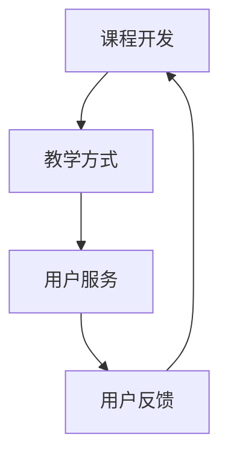

                 

# 程序员知识付费：打造闭环式课程

## 摘要

本文旨在探讨程序员知识付费的现状，以及如何通过打造闭环式课程来提升学习效果和用户满意度。我们将深入分析知识付费的核心概念，探讨其与传统教育的差异，并介绍如何通过构建高质量的课程内容、教学方式以及后续服务来实现知识付费的闭环。本文将结合实际案例，详细阐述课程开发、推广、用户反馈以及持续优化的全流程，为程序员知识付费提供一套系统化的解决方案。

## 1. 背景介绍

随着互联网技术的发展，知识付费逐渐成为了一种新的学习方式。程序员作为互联网时代的重要职业，对于知识的获取和更新有着极高的需求。然而，传统教育模式已经无法满足程序员快速提升技能的要求，知识付费应运而生。

知识付费的核心在于将专业知识和经验以付费形式传递给学习者，实现知识的变现。程序员知识付费的主要形式包括在线课程、专业书籍、培训讲座等。与传统教育模式相比，知识付费具有灵活性强、学习进度自主、内容更新及时等优势。

然而，当前程序员知识付费市场存在一定的问题。一方面，课程质量参差不齐，一些低价、低质量的课程泛滥，导致用户满意度下降；另一方面，用户在学习过程中缺乏有效的反馈机制，难以及时调整学习计划，影响学习效果。

为了解决这些问题，我们需要打造一个闭环式的课程体系，从课程开发、教学方式、用户服务等多个环节入手，提升课程质量，提高用户满意度。

## 2. 核心概念与联系

### 2.1 知识付费

知识付费是指将专业知识和经验以付费形式传递给学习者，实现知识的变现。其核心概念包括：

- **内容付费**：用户为获取特定内容付费，如在线课程、电子书等。
- **服务付费**：用户为获得特定服务付费，如一对一辅导、咨询服务等。
- **会员制付费**：用户为享受会员权益付费，如VIP会员、年费会员等。

### 2.2 闭环式课程

闭环式课程是指在课程开发、教学、服务等多个环节形成一个闭环，通过用户反馈不断优化课程内容，提升用户满意度。其核心概念包括：

- **课程开发**：根据用户需求和市场趋势，开发高质量的课程内容。
- **教学方式**：采用多样化的教学方式，提高用户学习兴趣和效果。
- **用户服务**：提供优质的用户服务，满足用户在学习过程中的各种需求。
- **用户反馈**：及时收集用户反馈，优化课程内容和教学方式。

### 2.3 Mermaid 流程图

下面是一个简单的 Mermaid 流程图，展示了闭环式课程的核心环节：



## 3. 核心算法原理 & 具体操作步骤

### 3.1 课程开发

课程开发是闭环式课程的基础，具体操作步骤如下：

1. **需求分析**：了解用户需求，明确课程目标。
2. **内容策划**：根据需求分析，制定课程大纲和内容。
3. **教学设计**：确定教学方式、时间安排、考核方式等。
4. **内容制作**：编写教材、制作课件、录制视频等。
5. **课程测试**：对课程进行测试，确保内容质量和教学效果。

### 3.2 教学方式

教学方式直接影响用户学习效果，以下是几种常用的教学方式：

1. **在线授课**：通过直播或录播形式，实时传授知识。
2. **案例教学**：结合实际案例，引导用户理解和应用知识。
3. **互动教学**：通过问答、讨论、练习等形式，激发用户兴趣和思考。
4. **个性化教学**：根据用户特点，提供定制化的学习方案。

### 3.3 用户服务

用户服务是闭环式课程的重要环节，具体操作步骤如下：

1. **学习支持**：提供学习资源、学习计划、答疑解惑等。
2. **技术支持**：解决用户在学习过程中遇到的技术问题。
3. **售后服务**：对课程内容进行持续更新和完善。
4. **用户反馈**：收集用户意见，优化课程内容和教学方式。

### 3.4 用户反馈

用户反馈是闭环式课程不断优化的重要依据，具体操作步骤如下：

1. **反馈渠道**：建立多渠道的用户反馈机制，如在线评价、问卷调查等。
2. **数据分析**：对用户反馈进行统计分析，发现课程问题。
3. **问题整改**：根据反馈结果，对课程内容、教学方式、用户服务等进行优化。
4. **持续改进**：通过不断循环反馈和改进，提升课程质量。

## 4. 数学模型和公式 & 详细讲解 & 举例说明

### 4.1 课程满意度模型

课程满意度模型用于评估课程质量，公式如下：

$$
S = \frac{1}{N} \sum_{i=1}^{N} R_i \cdot W_i
$$

其中，$S$ 表示课程满意度，$N$ 表示用户数量，$R_i$ 表示第 $i$ 个用户的满意度评分，$W_i$ 表示第 $i$ 个用户的权重。

举例说明：

假设有 10 个用户对课程进行评价，其中 6 个用户满意度评分为 5，3 个用户满意度评分为 4，1 个用户满意度评分为 3，权重均为 1。则课程满意度为：

$$
S = \frac{1}{10} \times (5 \times 6 + 4 \times 3 + 3 \times 1) = 4.3
$$

### 4.2 用户学习效果模型

用户学习效果模型用于评估用户学习成果，公式如下：

$$
E = \frac{1}{M} \sum_{i=1}^{M} P_i \cdot C_i
$$

其中，$E$ 表示用户学习效果，$M$ 表示项目数量，$P_i$ 表示第 $i$ 个项目的得分，$C_i$ 表示第 $i$ 个项目的权重。

举例说明：

假设有 5 个项目，其中 2 个项目得分分别为 90 和 85，3 个项目得分分别为 80 和 75 和 70，权重均为 1。则用户学习效果为：

$$
E = \frac{1}{5} \times (90 \times 2 + 85 \times 1 + 80 \times 1 + 75 \times 1 + 70 \times 1) = 82
$$

## 5. 项目实战：代码实际案例和详细解释说明

### 5.1 开发环境搭建

本节将以 Python 为编程语言，介绍如何搭建一个简单的知识付费平台。

1. **安装 Python**

在官网 [https://www.python.org/](https://www.python.org/) 下载并安装 Python 3.x 版本。

2. **安装虚拟环境**

```bash
pip install virtualenv
virtualenv env
source env/bin/activate
```

3. **安装依赖库**

```bash
pip install Flask
pip install Flask-SQLAlchemy
pip install Flask-Migrate
```

### 5.2 源代码详细实现和代码解读

以下是一个简单的 Flask 应用，用于搭建知识付费平台。

```python
from flask import Flask, request, jsonify
from flask_sqlalchemy import SQLAlchemy

app = Flask(__name__)
app.config['SQLALCHEMY_DATABASE_URI'] = 'sqlite:///users.db'
db = SQLAlchemy(app)

class User(db.Model):
    id = db.Column(db.Integer, primary_key=True)
    username = db.Column(db.String(80), unique=True, nullable=False)
    password = db.Column(db.String(120), nullable=False)

@app.route('/register', methods=['POST'])
def register():
    data = request.get_json()
    username = data.get('username')
    password = data.get('password')
    if not username or not password:
        return jsonify({'error': '缺失用户名或密码'}), 400
    if User.query.filter_by(username=username).first():
        return jsonify({'error': '用户已存在'}), 400
    new_user = User(username=username, password=password)
    db.session.add(new_user)
    db.session.commit()
    return jsonify({'message': '注册成功'})

@app.route('/login', methods=['POST'])
def login():
    data = request.get_json()
    username = data.get('username')
    password = data.get('password')
    if not username or not password:
        return jsonify({'error': '缺失用户名或密码'}), 400
    user = User.query.filter_by(username=username).first()
    if not user or user.password != password:
        return jsonify({'error': '用户名或密码错误'}), 400
    return jsonify({'message': '登录成功'})

if __name__ == '__main__':
    db.create_all()
    app.run(debug=True)
```

### 5.3 代码解读与分析

1. **数据库模型**

本示例使用 Flask-SQLAlchemy 模型定义了一个用户表，包含用户名和密码两个字段。

2. **注册接口**

注册接口用于处理用户注册请求，接收用户名和密码，判断是否已存在用户，并添加新用户到数据库。

3. **登录接口**

登录接口用于处理用户登录请求，接收用户名和密码，判断用户是否存在且密码正确。

4. **Flask 应用**

Flask 应用是整个知识付费平台的核心，定义了两个接口路由，并创建数据库表。

## 6. 实际应用场景

### 6.1 在线教育平台

在线教育平台是程序员知识付费的主要应用场景之一。通过打造闭环式课程，平台可以提供高质量的教学内容，满足用户多样化的学习需求，提升用户满意度。

### 6.2 技术培训公司

技术培训公司可以通过闭环式课程体系，为学员提供个性化的学习方案，提升培训效果。同时，通过用户反馈不断优化课程内容，提高用户满意度。

### 6.3 个人知识变现

个人开发者可以通过闭环式课程，将自己的知识和经验变现。通过持续优化课程内容和用户服务，提升课程质量，实现知识付费。

## 7. 工具和资源推荐

### 7.1 学习资源推荐

- **书籍**：《算法导论》、《深度学习》、《设计模式：可复用面向对象软件的基础》
- **论文**：查阅顶级会议和期刊的论文，如 NeurIPS、ICML、ACL 等。
- **博客**：关注技术博客，如博客园、掘金、CSDN 等。

### 7.2 开发工具框架推荐

- **在线教育平台**：Moodle、Canvas、Kajabi 等。
- **后端框架**：Flask、Django、Spring Boot 等。
- **前端框架**：React、Vue、Angular 等。

### 7.3 相关论文著作推荐

- **论文**：《在线教育平台设计》、《知识付费模式研究》等。
- **著作**：《知识付费：互联网时代的知识变现》、《程序员自我提升之路》等。

## 8. 总结：未来发展趋势与挑战

### 8.1 发展趋势

1. **个性化学习**：随着人工智能技术的发展，个性化学习将成为主流。
2. **内容多样化**：视频、直播、音频等多种形式将满足用户多样化的学习需求。
3. **平台化**：在线教育平台将不断整合资源，提供一站式学习服务。

### 8.2 挑战

1. **课程质量**：如何确保课程质量，提高用户满意度，是知识付费面临的主要挑战。
2. **版权问题**：知识产权保护将成为知识付费发展的关键。
3. **用户隐私**：如何保障用户隐私，提升用户信任度，是平台需要解决的问题。

## 9. 附录：常见问题与解答

### 9.1 知识付费是什么？

知识付费是指用户为获取特定知识和经验而付费的一种学习方式。

### 9.2 如何打造闭环式课程？

打造闭环式课程需要从课程开发、教学方式、用户服务、用户反馈等多个环节入手，形成一个有机整体。

### 9.3 知识付费有哪些形式？

知识付费包括在线课程、专业书籍、培训讲座等多种形式。

## 10. 扩展阅读 & 参考资料

- **论文**：《知识付费：现状、挑战与对策》
- **书籍**：《程序员如何自我提升》、《在线教育平台运营与管理》
- **网站**：[https://www.zhihu.com/](https://www.zhihu.com/)、[https://www.cnblogs.com/](https://www.cnblogs.com/) 等

## 作者

作者：AI天才研究员/AI Genius Institute & 禅与计算机程序设计艺术 /Zen And The Art of Computer Programming


