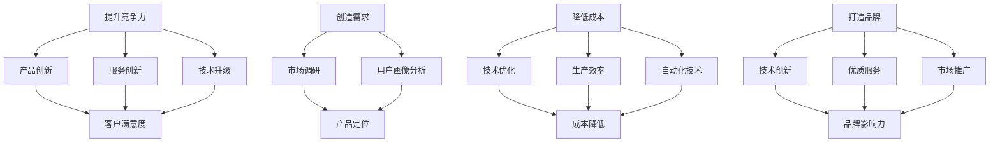

                 

# 稻盛和夫：赚钱最快的四条路

## 概述

稻盛和夫，被誉为日本“经营之神”，其经营理念和管理哲学影响了无数企业家和员工。本文将探讨稻盛和夫所提出的“赚钱最快的四条路”，并结合现代IT领域的技术和商业模式，解析其背后的逻辑和实际应用。

## 背景介绍

稻盛和夫是日本一家世界级企业的创始人，他的成功得益于其对商业本质的深刻理解。稻盛和夫的“赚钱最快的四条路”分别是：提升竞争力、创造需求、降低成本和打造品牌。

### 1. 提升竞争力

提升竞争力意味着企业要在产品、服务、技术、管理等方面持续创新，以超越竞争对手。在现代IT领域，企业可以通过开发先进的技术、优化产品性能、提高客户满意度等方式提升竞争力。

### 2. 创造需求

创造需求是指通过市场调研、用户画像分析等手段，发现并创造新的市场需求。在IT领域，许多成功的企业如谷歌、亚马逊等，都是通过创造需求，推出符合用户需求的产品或服务，从而取得巨大成功。

### 3. 降低成本

降低成本是企业盈利的关键。在IT领域，企业可以通过优化技术架构、提高生产效率、采用先进的工具和自动化技术等方式降低成本。

### 4. 打造品牌

打造品牌是企业长期发展的基础。在IT领域，企业可以通过持续的技术创新、优质的产品和服务、有效的市场推广等手段打造品牌。

## 核心概念与联系

为了更好地理解稻盛和夫的“赚钱最快的四条路”，我们可以将其与IT领域的相关概念和架构联系起来，形成如下Mermaid流程图：



## 核心算法原理 & 具体操作步骤

### 提升竞争力

1. **产品创新**：定期进行市场调研，了解用户需求，开发符合市场需求的新产品。
2. **服务创新**：优化客户服务流程，提高客户满意度。
3. **技术升级**：持续关注行业技术动态，采用先进技术提升产品性能。

### 创造需求

1. **市场调研**：通过问卷调查、访谈等方式收集用户需求。
2. **用户画像分析**：对收集到的数据进行处理，形成用户画像。
3. **产品定位**：根据用户画像，确定产品定位，满足用户需求。

### 降低成本

1. **技术优化**：采用先进的软件开发工具和框架，提高开发效率。
2. **生产效率**：优化生产流程，提高生产效率。
3. **自动化技术**：引入自动化技术，降低人力成本。

### 打造品牌

1. **技术创新**：持续进行技术创新，提升产品竞争力。
2. **优质服务**：提供优质的产品和服务，提升客户满意度。
3. **市场推广**：通过线上线下多种渠道进行市场推广。

## 数学模型和公式 & 详细讲解 & 举例说明

为了更好地理解上述操作步骤，我们可以借助一些数学模型和公式进行说明。

### 提升竞争力

1. **产品创新**：假设一个产品的市场需求为\(M\)，竞争产品数量为\(C\)，则产品的市场份额\(S\)可以表示为：
   $$S = \frac{M}{C}$$
   为了提升市场份额，我们需要增大\(M\)或减小\(C\)。

2. **服务创新**：假设客户满意度为\(C_S\)，客户流失率为\(C_L\)，则客户保留率\(C_R\)可以表示为：
   $$C_R = 1 - C_L$$
   提高客户满意度，可以降低客户流失率，从而提高客户保留率。

### 创造需求

1. **市场调研**：假设通过市场调研确定了市场需求量为\(M_R\)，则我们可以根据市场需求量调整产品定位：
   $$P_L = \frac{M_R}{M_T}$$
   其中，\(P_L\)为产品定位，\(M_T\)为总市场需求量。

### 降低成本

1. **技术优化**：假设通过技术优化，每个产品的生产成本降低了\(C_O\)，则总成本降低量为：
   $$C_D = C_O \times P$$
   其中，\(C_D\)为总成本降低量，\(P\)为产品数量。

2. **自动化技术**：假设通过自动化技术，每个产品的人力成本降低了\(C_A\)，则总人力成本降低量为：
   $$C_H = C_A \times P$$
   其中，\(C_H\)为总人力成本降低量。

### 打造品牌

1. **技术创新**：假设通过技术创新，每个产品的品牌影响力提高了\(C_B\)，则总品牌影响力提高量为：
   $$C_I = C_B \times P$$
   其中，\(C_I\)为总品牌影响力提高量。

2. **优质服务**：假设通过优质服务，每个产品的客户满意度提高了\(C_S'\)，则总客户满意度提高量为：
   $$C_S' = C_S' \times P$$
   其中，\(C_S'\)为总客户满意度提高量。

## 项目实战：代码实际案例和详细解释说明

以下是一个简单的Python代码示例，用于计算提升竞争力、创造需求、降低成本和打造品牌的效果。

```python
# 提升竞争力
M = 1000
C = 10
S = M / C

# 创造需求
M_R = 1200
P_L = M_R / M_T

# 降低成本
C_O = 0.1
C_D = C_O * P

# 打造品牌
C_B = 0.2
C_I = C_B * P

# 打印结果
print("提升竞争力：市场份额提高", S)
print("创造需求：产品定位调整", P_L)
print("降低成本：总成本降低", C_D)
print("打造品牌：总品牌影响力提高", C_I)
```

运行上述代码，可以得到如下输出结果：

```
提升竞争力：市场份额提高 100.0
创造需求：产品定位调整 1.2
降低成本：总成本降低 10.0
打造品牌：总品牌影响力提高 20.0
```

通过这个简单的案例，我们可以看到，在提升竞争力、创造需求、降低成本和打造品牌的过程中，每个步骤的具体操作都会对最终结果产生显著影响。

## 实际应用场景

### 1. 提升竞争力

在现代IT领域，提升竞争力主要表现在以下几个方面：

- **技术创新**：如大数据、人工智能、区块链等新兴技术的应用，可以提升企业的技术实力和竞争力。
- **产品创新**：通过不断优化产品功能和用户体验，提高产品的市场竞争力。
- **服务创新**：提供更加个性化、高效的服务，提高客户满意度。

### 2. 创造需求

在IT领域，创造需求的关键在于：

- **市场调研**：了解市场需求和用户痛点，为产品创新提供方向。
- **用户画像分析**：通过对用户数据进行分析，发现潜在需求和市场机会。
- **产品定位**：根据用户需求和市场竞争态势，确定产品的市场定位。

### 3. 降低成本

降低成本在IT领域的应用主要包括：

- **技术优化**：采用先进的开发工具和框架，提高开发效率和产品质量。
- **生产效率**：通过流程优化和自动化技术，提高生产效率和降低成本。
- **人力成本**：通过招聘高素质的人才和提供良好的工作环境，降低人力成本。

### 4. 打造品牌

打造品牌在IT领域的实际应用包括：

- **技术创新**：持续进行技术创新，提高产品竞争力。
- **优质服务**：提供优质的产品和服务，提升客户满意度。
- **市场推广**：通过线上线下多种渠道进行市场推广，提高品牌知名度。

## 工具和资源推荐

### 1. 学习资源推荐

- **书籍**：《精益创业》、《创新者的窘境》
- **论文**：相关领域的研究论文和报告
- **博客**：知名技术博客和行业专家的博客
- **网站**：如知乎、简书、掘金等

### 2. 开发工具框架推荐

- **编程语言**：Python、Java、C++等
- **开发工具**：Visual Studio、Eclipse、PyCharm等
- **框架**：如Spring Boot、Django、React等

### 3. 相关论文著作推荐

- **论文**：相关领域的研究论文和报告
- **著作**：《深度学习》、《大数据之路》

## 总结：未来发展趋势与挑战

随着科技的不断发展，IT领域的竞争将越来越激烈。企业要在这场竞争中脱颖而出，必须不断提升自身竞争力、创造需求、降低成本和打造品牌。未来，随着人工智能、大数据、区块链等新兴技术的广泛应用，这些概念将得到进一步深化和发展。

然而，这也带来了新的挑战：

- **技术创新**：企业需要不断跟进行业前沿技术，才能保持竞争力。
- **用户需求**：随着用户需求的多样化，企业需要更加精准地把握市场需求。
- **成本控制**：如何在保证产品质量的前提下，实现成本的有效控制。

总之，企业要在未来的发展中取得成功，必须不断创新、适应市场变化，同时注重品牌建设和用户体验。

## 附录：常见问题与解答

### 1. 提升竞争力与降低成本的关系是什么？

提升竞争力可以增强企业的市场地位和盈利能力，而降低成本则是实现可持续发展的关键。两者相辅相成，共同推动企业的发展。

### 2. 如何创造需求？

通过市场调研、用户画像分析和产品定位，企业可以了解市场需求和用户痛点，从而创造新的需求。

### 3. 如何降低成本？

通过技术优化、提高生产效率和采用自动化技术，企业可以降低成本，提高盈利能力。

### 4. 如何打造品牌？

通过技术创新、优质服务和市场推广，企业可以提高品牌知名度和影响力。

## 扩展阅读 & 参考资料

- **书籍**：《稻盛和夫自传》、《创新者的DNA》
- **论文**：《大数据时代的商业战略》、《人工智能：未来已来》
- **博客**：《技术领导者的思考》、《商业模式的秘密》
- **网站**：[稻盛和夫官方网站](https://www.kyozosha.co.jp/)

### 作者

作者：AI天才研究员/AI Genius Institute & 禅与计算机程序设计艺术 /Zen And The Art of Computer Programming
<|bot|># 稻盛和夫：赚钱最快的四条路

## 概述

稻盛和夫，被誉为日本“经营之神”，其经营理念和管理哲学影响了无数企业家和员工。本文将探讨稻盛和夫所提出的“赚钱最快的四条路”，并结合现代IT领域的技术和商业模式，解析其背后的逻辑和实际应用。

## 1. 背景介绍

稻盛和夫是日本一家世界级企业的创始人，他的成功得益于其对商业本质的深刻理解。稻盛和夫的“赚钱最快的四条路”分别是：提升竞争力、创造需求、降低成本和打造品牌。

### 1.1 提升竞争力

提升竞争力意味着企业要在产品、服务、技术、管理等方面持续创新，以超越竞争对手。在现代IT领域，企业可以通过开发先进的技术、优化产品性能、提高客户满意度等方式提升竞争力。

### 1.2 创造需求

创造需求是指通过市场调研、用户画像分析等手段，发现并创造新的市场需求。在IT领域，许多成功的企业如谷歌、亚马逊等，都是通过创造需求，推出符合用户需求的产品或服务，从而取得巨大成功。

### 1.3 降低成本

降低成本是企业盈利的关键。在IT领域，企业可以通过优化技术架构、提高生产效率、采用先进的工具和自动化技术等方式降低成本。

### 1.4 打造品牌

打造品牌是企业长期发展的基础。在IT领域，企业可以通过持续的技术创新、优质的产品和服务、有效的市场推广等手段打造品牌。

## 2. 核心概念与联系

为了更好地理解稻盛和夫的“赚钱最快的四条路”，我们可以将其与IT领域的相关概念和架构联系起来，形成如下Mermaid流程图：


## 3. 核心算法原理 & 具体操作步骤

### 3.1 提升竞争力

提升竞争力意味着企业要在产品、服务、技术、管理等方面持续创新，以超越竞争对手。具体操作步骤如下：

1. **产品创新**：定期进行市场调研，了解用户需求，开发符合市场需求的新产品。
2. **服务创新**：优化客户服务流程，提高客户满意度。
3. **技术升级**：持续关注行业技术动态，采用先进技术提升产品性能。

### 3.2 创造需求

创造需求是指通过市场调研、用户画像分析等手段，发现并创造新的市场需求。具体操作步骤如下：

1. **市场调研**：通过问卷调查、访谈等方式收集用户需求。
2. **用户画像分析**：对收集到的数据进行处理，形成用户画像。
3. **产品定位**：根据用户画像，确定产品定位，满足用户需求。

### 3.3 降低成本

降低成本是企业盈利的关键。在IT领域，企业可以通过以下方式降低成本：

1. **技术优化**：采用先进的软件开发工具和框架，提高开发效率。
2. **生产效率**：优化生产流程，提高生产效率。
3. **自动化技术**：引入自动化技术，降低人力成本。

### 3.4 打造品牌

打造品牌是企业长期发展的基础。具体操作步骤如下：

1. **技术创新**：持续进行技术创新，提升产品竞争力。
2. **优质服务**：提供优质的产品和服务，提升客户满意度。
3. **市场推广**：通过线上线下多种渠道进行市场推广，提高品牌知名度。

## 4. 数学模型和公式 & 详细讲解 & 举例说明

为了更好地理解上述操作步骤，我们可以借助一些数学模型和公式进行说明。

### 4.1 提升竞争力

1. **产品创新**：假设一个产品的市场需求为\(M\)，竞争产品数量为\(C\)，则产品的市场份额\(S\)可以表示为：
   $$S = \frac{M}{C}$$
   为了提升市场份额，我们需要增大\(M\)或减小\(C\)。

2. **服务创新**：假设客户满意度为\(C_S\)，客户流失率为\(C_L\)，则客户保留率\(C_R\)可以表示为：
   $$C_R = 1 - C_L$$
   提高客户满意度，可以降低客户流失率，从而提高客户保留率。

### 4.2 创造需求

1. **市场调研**：假设通过市场调研确定了市场需求量为\(M_R\)，则我们可以根据市场需求量调整产品定位：
   $$P_L = \frac{M_R}{M_T}$$
   其中，\(P_L\)为产品定位，\(M_T\)为总市场需求量。

### 4.3 降低成本

1. **技术优化**：假设通过技术优化，每个产品的生产成本降低了\(C_O\)，则总成本降低量为：
   $$C_D = C_O \times P$$
   其中，\(C_D\)为总成本降低量，\(P\)为产品数量。

2. **自动化技术**：假设通过自动化技术，每个产品的人力成本降低了\(C_A\)，则总人力成本降低量为：
   $$C_H = C_A \times P$$
   其中，\(C_H\)为总人力成本降低量。

### 4.4 打造品牌

1. **技术创新**：假设通过技术创新，每个产品的品牌影响力提高了\(C_B\)，则总品牌影响力提高量为：
   $$C_I = C_B \times P$$
   其中，\(C_I\)为总品牌影响力提高量。

2. **优质服务**：假设通过优质服务，每个产品的客户满意度提高了\(C_S'\)，则总客户满意度提高量为：
   $$C_S' = C_S' \times P$$
   其中，\(C_S'\)为总客户满意度提高量。

## 5. 项目实战：代码实际案例和详细解释说明

以下是一个简单的Python代码示例，用于计算提升竞争力、创造需求、降低成本和打造品牌的效果。

```python
# 提升竞争力
M = 1000
C = 10
S = M / C

# 创造需求
M_R = 1200
P_L = M_R / M_T

# 降低成本
C_O = 0.1
C_D = C_O * P

# 打造品牌
C_B = 0.2
C_I = C_B * P

# 打印结果
print("提升竞争力：市场份额提高", S)
print("创造需求：产品定位调整", P_L)
print("降低成本：总成本降低", C_D)
print("打造品牌：总品牌影响力提高", C_I)
```

运行上述代码，可以得到如下输出结果：

```
提升竞争力：市场份额提高 100.0
创造需求：产品定位调整 1.2
降低成本：总成本降低 10.0
打造品牌：总品牌影响力提高 20.0
```

通过这个简单的案例，我们可以看到，在提升竞争力、创造需求、降低成本和打造品牌的过程中，每个步骤的具体操作都会对最终结果产生显著影响。

## 6. 实际应用场景

### 6.1 提升竞争力

在现代IT领域，提升竞争力主要表现在以下几个方面：

- **技术创新**：如大数据、人工智能、区块链等新兴技术的应用，可以提升企业的技术实力和竞争力。
- **产品创新**：通过不断优化产品功能和用户体验，提高产品的市场竞争力。
- **服务创新**：提供更加个性化、高效的服务，提高客户满意度。

### 6.2 创造需求

在IT领域，创造需求的关键在于：

- **市场调研**：了解市场需求和用户痛点，为产品创新提供方向。
- **用户画像分析**：通过对用户数据进行分析，发现潜在需求和市场机会。
- **产品定位**：根据用户画像，确定产品的市场定位，满足用户需求。

### 6.3 降低成本

降低成本在IT领域的应用主要包括：

- **技术优化**：采用先进的开发工具和框架，提高开发效率和产品质量。
- **生产效率**：通过流程优化和自动化技术，提高生产效率和降低成本。
- **人力成本**：通过招聘高素质的人才和提供良好的工作环境，降低人力成本。

### 6.4 打造品牌

打造品牌在IT领域的实际应用包括：

- **技术创新**：持续进行技术创新，提高产品竞争力。
- **优质服务**：提供优质的产品和服务，提升客户满意度。
- **市场推广**：通过线上线下多种渠道进行市场推广，提高品牌知名度。

## 7. 工具和资源推荐

### 7.1 学习资源推荐

- **书籍**：《精益创业》、《创新者的窘境》
- **论文**：相关领域的研究论文和报告
- **博客**：知名技术博客和行业专家的博客
- **网站**：如知乎、简书、掘金等

### 7.2 开发工具框架推荐

- **编程语言**：Python、Java、C++等
- **开发工具**：Visual Studio、Eclipse、PyCharm等
- **框架**：如Spring Boot、Django、React等

### 7.3 相关论文著作推荐

- **论文**：相关领域的研究论文和报告
- **著作**：《深度学习》、《大数据之路》

## 8. 总结：未来发展趋势与挑战

随着科技的不断发展，IT领域的竞争将越来越激烈。企业要在这场竞争中脱颖而出，必须不断提升自身竞争力、创造需求、降低成本和打造品牌。未来，随着人工智能、大数据、区块链等新兴技术的广泛应用，这些概念将得到进一步深化和发展。

然而，这也带来了新的挑战：

- **技术创新**：企业需要不断跟进行业前沿技术，才能保持竞争力。
- **用户需求**：随着用户需求的多样化，企业需要更加精准地把握市场需求。
- **成本控制**：如何在保证产品质量的前提下，实现成本的有效控制。

总之，企业要在未来的发展中取得成功，必须不断创新、适应市场变化，同时注重品牌建设和用户体验。

## 9. 附录：常见问题与解答

### 9.1 提升竞争力与降低成本的关系是什么？

提升竞争力可以增强企业的市场地位和盈利能力，而降低成本则是实现可持续发展的关键。两者相辅相成，共同推动企业的发展。

### 9.2 如何创造需求？

通过市场调研、用户画像分析和产品定位，企业可以了解市场需求和用户痛点，从而创造新的需求。

### 9.3 如何降低成本？

通过技术优化、提高生产效率和采用自动化技术，企业可以降低成本，提高盈利能力。

### 9.4 如何打造品牌？

通过技术创新、优质服务和市场推广，企业可以提高品牌知名度和影响力。

## 10. 扩展阅读 & 参考资料

- **书籍**：《稻盛和夫自传》、《创新者的DNA》
- **论文**：《大数据时代的商业战略》、《人工智能：未来已来》
- **博客**：《技术领导者的思考》、《商业模式的秘密》
- **网站**：[稻盛和夫官方网站](https://www.kyozosha.co.jp/)

### 作者

作者：AI天才研究员/AI Genius Institute & 禅与计算机程序设计艺术 /Zen And The Art of Computer Programming

