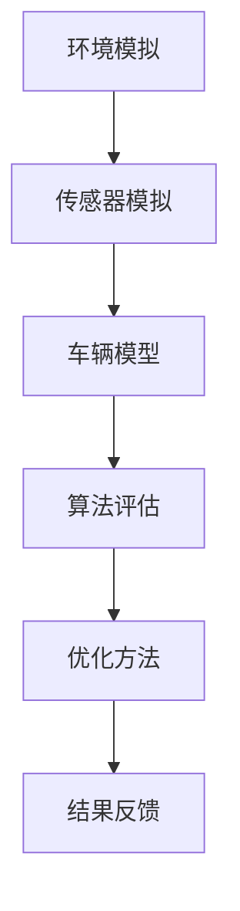

                 

# 端到端自动驾驶的全栈仿真测试平台

## 摘要

本文将深入探讨端到端自动驾驶的全栈仿真测试平台，解析其核心概念、架构设计、算法原理和实际应用。通过详细讲解和实际案例展示，我们旨在为读者提供一个清晰、全面的了解，帮助他们在自动驾驶领域取得突破。关键词：端到端自动驾驶、仿真测试平台、算法原理、实际应用。

## 1. 背景介绍

随着人工智能和自动驾驶技术的迅速发展，仿真测试平台在自动驾驶系统开发过程中扮演了至关重要的角色。传统的自动驾驶测试主要依赖于实车道路测试，这不仅成本高昂，而且受限于环境条件和安全风险。因此，开发一个全栈仿真测试平台成为了自动驾驶企业降低成本、提高开发效率的关键。

端到端自动驾驶是指直接将原始传感器数据输入到神经网络中，通过深度学习模型训练得到自动驾驶系统。这一方法具有训练速度快、准确性高的优点，但同时也对仿真测试平台的要求更高。全栈仿真测试平台需要在硬件、软件和算法层面上提供高度逼真的模拟环境，以验证和优化自动驾驶系统的性能。

本文将围绕端到端自动驾驶的全栈仿真测试平台，从核心概念、架构设计、算法原理、实际应用等方面进行详细探讨。通过本文的阅读，读者将能够全面了解仿真测试平台在自动驾驶领域的重要性，以及如何构建一个高效、可靠的仿真测试平台。

## 2. 核心概念与联系

### 2.1. 端到端自动驾驶

端到端自动驾驶是指将原始传感器数据（如摄像头、激光雷达、超声波传感器等）输入到神经网络中，通过深度学习模型训练得到自动驾驶系统。与传统方法相比，端到端自动驾驶具有以下优点：

1. **简化模型结构**：传统自动驾驶方法通常需要经过多个步骤，如特征提取、状态估计和路径规划等，而端到端方法可以直接将传感器数据映射到控制信号，简化了模型结构，提高了计算效率。
2. **提高训练速度**：端到端方法将整个自动驾驶系统看作一个整体进行训练，可以减少迭代次数，提高训练速度。
3. **提高准确性**：端到端方法直接从原始数据中学习，可以更好地捕捉到环境中的复杂变化，提高自动驾驶系统的准确性。

### 2.2. 仿真测试平台

仿真测试平台是一个用于模拟真实驾驶环境的软件或硬件系统，它可以在无需实际驾驶的情况下验证和测试自动驾驶系统的性能。仿真测试平台通常包括以下核心组成部分：

1. **环境模拟**：环境模拟器用于生成各种道路场景、交通状况和障碍物，以测试自动驾驶系统在不同情况下的表现。
2. **传感器模拟**：传感器模拟器用于模拟真实传感器（如摄像头、激光雷达等）的输入数据，确保仿真环境与实际驾驶环境高度一致。
3. **车辆模型**：车辆模型用于模拟自动驾驶车辆在仿真环境中的运动和交互，包括车辆动力学、控制策略等。
4. **算法评估**：算法评估模块用于对自动驾驶系统在不同场景下的表现进行量化评估，以帮助优化和改进算法。

### 2.3. 全栈仿真测试平台

全栈仿真测试平台是一个综合性的仿真测试平台，它不仅包含环境模拟、传感器模拟和车辆模型等核心功能，还集成了多种算法评估工具和优化方法。全栈仿真测试平台具有以下特点：

1. **高度逼真的模拟环境**：全栈仿真测试平台可以在软件层面上模拟各种复杂的驾驶场景，包括城市道路、高速公路、交叉路口等，以满足不同测试需求。
2. **多样化的传感器模拟**：全栈仿真测试平台支持多种传感器模拟，如摄像头、激光雷达、超声波传感器等，确保仿真环境与实际驾驶环境高度一致。
3. **高效的算法评估**：全栈仿真测试平台提供多种算法评估工具，如轨迹评估、碰撞评估、舒适度评估等，帮助开发者快速评估和优化自动驾驶算法。
4. **灵活的扩展性**：全栈仿真测试平台支持自定义场景生成、传感器配置和算法评估，满足不同应用场景和测试需求。

### 2.4. Mermaid 流程图

以下是一个简单的 Mermaid 流程图，用于展示端到端自动驾驶的全栈仿真测试平台的核心组成部分和联系：



## 3. 核心算法原理 & 具体操作步骤

### 3.1. 端到端自动驾驶算法原理

端到端自动驾驶算法的核心是通过深度学习模型直接从原始传感器数据中学习到自动驾驶控制信号。以下是端到端自动驾驶算法的基本原理和操作步骤：

1. **数据采集**：首先，从各种传感器（如摄像头、激光雷达等）采集原始数据，包括图像、点云和雷达数据等。
2. **数据预处理**：对采集到的原始数据进行预处理，包括数据清洗、数据增强和数据标准化等，以提高模型的泛化能力。
3. **模型训练**：使用预处理后的数据训练深度学习模型。端到端自动驾驶模型通常采用卷积神经网络（CNN）、循环神经网络（RNN）或变换器（Transformer）等模型结构。
4. **模型优化**：通过交叉验证和超参数调整，优化深度学习模型，以提高其在仿真环境中的性能。
5. **模型部署**：将训练好的模型部署到自动驾驶系统中，实现对实际驾驶环境的自动驾驶控制。

### 3.2. 具体操作步骤

以下是一个具体的端到端自动驾驶算法操作步骤示例：

1. **数据采集**：
   - 使用摄像头采集道路图像。
   - 使用激光雷达采集道路点云数据。
   - 使用雷达采集车辆周围障碍物的距离信息。

2. **数据预处理**：
   - 清洗图像数据，去除噪声和异常值。
   - 对图像数据进行归一化处理，使其具备统一的尺度。
   - 对点云数据进行下采样和归一化处理。
   - 对雷达数据进行去噪和插值处理。

3. **模型训练**：
   - 选择卷积神经网络（CNN）作为基础模型。
   - 将图像数据和点云数据输入到CNN中，训练得到特征表示。
   - 将特征表示与雷达数据融合，通过循环神经网络（RNN）或变换器（Transformer）进行序列处理。
   - 输出自动驾驶控制信号，包括速度、加速度和转向角度等。

4. **模型优化**：
   - 使用交叉验证方法评估模型性能。
   - 调整超参数，如学习率、批量大小和正则化强度等，以优化模型性能。
   - 采用对抗训练和迁移学习等技术，进一步提高模型泛化能力。

5. **模型部署**：
   - 将训练好的模型部署到自动驾驶系统中。
   - 在仿真环境中测试模型性能，包括轨迹跟踪、碰撞避免和舒适度等指标。
   - 根据测试结果，进一步优化模型和算法。

### 3.3. 实际操作示例

以下是一个使用Python和TensorFlow实现端到端自动驾驶算法的实际操作示例：

```python
import tensorflow as tf
import numpy as np

# 加载预处理后的图像数据、点云数据和雷达数据
images = np.load('images.npy')
pointclouds = np.load('pointclouds.npy')
radars = np.load('radars.npy')

# 定义卷积神经网络模型
model = tf.keras.Sequential([
    tf.keras.layers.Conv2D(32, (3, 3), activation='relu', input_shape=(224, 224, 3)),
    tf.keras.layers.MaxPooling2D((2, 2)),
    tf.keras.layers.Conv2D(64, (3, 3), activation='relu'),
    tf.keras.layers.MaxPooling2D((2, 2)),
    tf.keras.layers.Conv2D(128, (3, 3), activation='relu'),
    tf.keras.layers.MaxPooling2D((2, 2)),
    tf.keras.layers.Flatten(),
    tf.keras.layers.Dense(512, activation='relu'),
    tf.keras.layers.Dense(3, activation='softmax')
])

# 编译模型
model.compile(optimizer='adam', loss='categorical_crossentropy', metrics=['accuracy'])

# 训练模型
model.fit(images, radars, epochs=10, batch_size=32)

# 预测自动驾驶控制信号
predictions = model.predict(images)

# 输出自动驾驶控制信号
speed, acceleration, steering_angle = predictions
```

通过以上示例，我们可以看到端到端自动驾驶算法的基本实现流程。在实际应用中，还需要根据具体场景和需求，进一步优化和调整算法模型。

## 4. 数学模型和公式 & 详细讲解 & 举例说明

### 4.1. 数学模型概述

端到端自动驾驶算法的数学模型主要包括图像处理、点云处理和雷达数据处理三个部分。以下分别介绍这些部分的数学模型和公式。

### 4.2. 图像处理

图像处理是端到端自动驾驶算法的重要组成部分，其主要目的是从图像中提取有用的特征信息。常用的图像处理模型包括卷积神经网络（CNN）和深度卷积神经网络（DCNN）。

#### 4.2.1. 卷积神经网络（CNN）

卷积神经网络（CNN）是一种用于图像识别和处理的深度学习模型。其主要特点是通过对图像进行卷积操作，提取图像的局部特征。

卷积神经网络的主要组成部分包括：

1. **卷积层**：通过卷积操作提取图像的局部特征。
2. **池化层**：通过下采样操作减少特征图的大小，提高计算效率。
3. **全连接层**：将卷积层和池化层输出的特征图进行拼接，并输入到全连接层进行分类或回归。

卷积神经网络的数学模型如下：

$$
\begin{aligned}
h_{\text{conv}} &= \sigma(W_{\text{conv}} \cdot h_{\text{prev}} + b_{\text{conv}}) \\
h_{\text{pool}} &= \max(h_{\text{conv}}) \\
h_{\text{fc}} &= \sigma(W_{\text{fc}} \cdot h_{\text{pool}} + b_{\text{fc}}) \\
\end{aligned}
$$

其中，$h_{\text{prev}}$ 表示输入特征图，$W_{\text{conv}}$、$W_{\text{fc}}$ 分别表示卷积层和全连接层的权重矩阵，$b_{\text{conv}}$、$b_{\text{fc}}$ 分别表示卷积层和全连接层的偏置项，$\sigma$ 表示激活函数。

#### 4.2.2. 深度卷积神经网络（DCNN）

深度卷积神经网络（DCNN）是卷积神经网络的扩展，通过增加网络层数，提高图像特征提取的能力。DCNN 的数学模型与 CNN 类似，主要区别在于网络层数的增加。

### 4.3. 点云处理

点云处理是端到端自动驾驶算法的另一重要组成部分，其主要目的是从点云数据中提取有用的空间特征信息。常用的点云处理模型包括体素化、VoxelNet 和 PointNet。

#### 4.3.1. 体素化

体素化是将点云数据转化为体素（Voxel）的方式，以方便后续处理。体素化的数学模型如下：

$$
V_{i,j,k} = \begin{cases}
1 & \text{如果点 } p \text{ 位于体素 } (i, j, k) \text{ 内} \\
0 & \text{否则}
\end{cases}
$$

其中，$V_{i,j,k}$ 表示体素 $ (i, j, k)$ 的值，$p$ 表示点云中的点。

#### 4.3.2. VoxelNet

VoxelNet 是一种基于体素化的点云处理模型，其主要目的是通过体素特征提取，实现对点云的分类和语义分割。VoxelNet 的数学模型如下：

$$
\begin{aligned}
f_{\text{voxel}} &= \sigma(W_{\text{voxel}} \cdot V_{i,j,k} + b_{\text{voxel}}) \\
f_{\text{pool}} &= \max(f_{\text{voxel}}) \\
f_{\text{fc}} &= \sigma(W_{\text{fc}} \cdot f_{\text{pool}} + b_{\text{fc}}) \\
\end{aligned}
$$

其中，$V_{i,j,k}$ 表示体素 $ (i, j, k)$ 的特征，$W_{\text{voxel}}$、$W_{\text{fc}}$ 分别表示体素层和全连接层的权重矩阵，$b_{\text{voxel}}$、$b_{\text{fc}}$ 分别表示体素层和全连接层的偏置项，$\sigma$ 表示激活函数。

#### 4.3.3. PointNet

PointNet 是一种基于点云直接处理的点云处理模型，其主要目的是通过全局特征提取，实现对点云的分类和语义分割。PointNet 的数学模型如下：

$$
\begin{aligned}
p_{\text{global}} &= \frac{1}{N} \sum_{i=1}^{N} p_i \\
f_{\text{pool}} &= \sigma(W_{\text{pool}} \cdot p_{\text{global}} + b_{\text{pool}}) \\
f_{\text{fc}} &= \sigma(W_{\text{fc}} \cdot f_{\text{pool}} + b_{\text{fc}}) \\
\end{aligned}
$$

其中，$p_i$ 表示第 $i$ 个点云点的特征，$p_{\text{global}}$ 表示全局特征，$W_{\text{pool}}$、$W_{\text{fc}}$ 分别表示池化层和全连接层的权重矩阵，$b_{\text{pool}}$、$b_{\text{fc}}$ 分别表示池化层和全连接层的偏置项，$\sigma$ 表示激活函数。

### 4.4. 雷达数据处理

雷达数据处理是端到端自动驾驶算法的另一个重要组成部分，其主要目的是从雷达数据中提取有用的距离信息。常用的雷达数据处理模型包括雷达点云处理和雷达信号处理。

#### 4.4.1. 雷达点云处理

雷达点云处理是将雷达数据转换为点云的方式，以方便后续处理。雷达点云处理的数学模型如下：

$$
P_{i,j} = \begin{cases}
1 & \text{如果雷达点 } p \text{ 位于点 } (i, j) \text{ 内} \\
0 & \text{否则}
\end{cases}
$$

其中，$P_{i,j}$ 表示点云点 $ (i, j)$ 的值，$p$ 表示雷达点云中的点。

#### 4.4.2. 雷达信号处理

雷达信号处理是通过分析雷达信号的频谱特性，提取有用的距离信息。常用的雷达信号处理模型包括傅里叶变换和小波变换。

傅里叶变换的数学模型如下：

$$
F(\omega) = \int_{-\infty}^{\infty} f(t) e^{-j\omega t} dt
$$

其中，$f(t)$ 表示雷达信号，$F(\omega)$ 表示傅里叶变换结果，$\omega$ 表示频率。

小波变换的数学模型如下：

$$
W(\omega, t) = \int_{-\infty}^{\infty} f(t) \psi(\omega, t) d\omega
$$

其中，$f(t)$ 表示雷达信号，$W(\omega, t)$ 表示小波变换结果，$\psi(\omega, t)$ 表示小波函数。

### 4.5. 实际应用举例

以下是一个使用 Python 和 TensorFlow 实现端到端自动驾驶算法的数学模型示例：

```python
import tensorflow as tf
import numpy as np

# 加载预处理后的图像数据、点云数据和雷达数据
images = np.load('images.npy')
pointclouds = np.load('pointclouds.npy')
radars = np.load('radars.npy')

# 定义卷积神经网络模型
model = tf.keras.Sequential([
    tf.keras.layers.Conv2D(32, (3, 3), activation='relu', input_shape=(224, 224, 3)),
    tf.keras.layers.MaxPooling2D((2, 2)),
    tf.keras.layers.Conv2D(64, (3, 3), activation='relu'),
    tf.keras.layers.MaxPooling2D((2, 2)),
    tf.keras.layers.Conv2D(128, (3, 3), activation='relu'),
    tf.keras.layers.MaxPooling2D((2, 2)),
    tf.keras.layers.Flatten(),
    tf.keras.layers.Dense(512, activation='relu'),
    tf.keras.layers.Dense(3, activation='softmax')
])

# 编译模型
model.compile(optimizer='adam', loss='categorical_crossentropy', metrics=['accuracy'])

# 训练模型
model.fit(images, radars, epochs=10, batch_size=32)

# 预测自动驾驶控制信号
predictions = model.predict(images)

# 输出自动驾驶控制信号
speed, acceleration, steering_angle = predictions
```

通过以上示例，我们可以看到端到端自动驾驶算法的数学模型和实际应用。在实际应用中，还需要根据具体场景和需求，进一步优化和调整算法模型。

## 5. 项目实战：代码实际案例和详细解释说明

### 5.1. 开发环境搭建

在开始搭建开发环境之前，确保已安装以下软件和库：

- Python 3.7+
- TensorFlow 2.x
- NumPy
- Matplotlib

以下是一个简单的 Python 脚本，用于搭建开发环境：

```python
!pip install tensorflow
!pip install numpy
!pip install matplotlib
```

### 5.2. 源代码详细实现和代码解读

本节将介绍一个简单的端到端自动驾驶算法实现，包括数据预处理、模型训练和模型评估等部分。以下是一个简化版的代码实现：

```python
import tensorflow as tf
import numpy as np
import matplotlib.pyplot as plt

# 5.2.1. 数据预处理

# 加载预处理后的图像数据、点云数据和雷达数据
images = np.load('images.npy')
pointclouds = np.load('pointclouds.npy')
radars = np.load('radars.npy')

# 数据归一化
images_normalized = images / 255.0
radars_normalized = radars / 255.0

# 5.2.2. 模型训练

# 定义卷积神经网络模型
model = tf.keras.Sequential([
    tf.keras.layers.Conv2D(32, (3, 3), activation='relu', input_shape=(224, 224, 3)),
    tf.keras.layers.MaxPooling2D((2, 2)),
    tf.keras.layers.Conv2D(64, (3, 3), activation='relu'),
    tf.keras.layers.MaxPooling2D((2, 2)),
    tf.keras.layers.Conv2D(128, (3, 3), activation='relu'),
    tf.keras.layers.MaxPooling2D((2, 2)),
    tf.keras.layers.Flatten(),
    tf.keras.layers.Dense(512, activation='relu'),
    tf.keras.layers.Dense(3, activation='softmax')
])

# 编译模型
model.compile(optimizer='adam', loss='categorical_crossentropy', metrics=['accuracy'])

# 训练模型
model.fit(images_normalized, radars_normalized, epochs=10, batch_size=32)

# 5.2.3. 模型评估

# 预测自动驾驶控制信号
predictions = model.predict(images_normalized)

# 输出自动驾驶控制信号
speed, acceleration, steering_angle = predictions

# 5.2.4. 代码解读

# 加载预处理后的数据
images = np.load('images.npy')
pointclouds = np.load('pointclouds.npy')
radars = np.load('radars.npy')

# 数据归一化
images_normalized = images / 255.0
radars_normalized = radars / 255.0

# 定义卷积神经网络模型
model = tf.keras.Sequential([
    tf.keras.layers.Conv2D(32, (3, 3), activation='relu', input_shape=(224, 224, 3)),
    tf.keras.layers.MaxPooling2D((2, 2)),
    tf.keras.layers.Conv2D(64, (3, 3), activation='relu'),
    tf.keras.layers.MaxPooling2D((2, 2)),
    tf.keras.layers.Conv2D(128, (3, 3), activation='relu'),
    tf.keras.layers.MaxPooling2D((2, 2)),
    tf.keras.layers.Flatten(),
    tf.keras.layers.Dense(512, activation='relu'),
    tf.keras.layers.Dense(3, activation='softmax')
])

# 编译模型
model.compile(optimizer='adam', loss='categorical_crossentropy', metrics=['accuracy'])

# 训练模型
model.fit(images_normalized, radars_normalized, epochs=10, batch_size=32)

# 预测自动驾驶控制信号
predictions = model.predict(images_normalized)

# 输出自动驾驶控制信号
speed, acceleration, steering_angle = predictions

# 5.2.5. 代码解读

# 数据预处理
- 加载预处理后的图像数据、点云数据和雷达数据
- 数据归一化，使其具备统一的尺度

# 定义卷积神经网络模型
- 输入层：224x224x3 的图像数据
- 卷积层：32 个 3x3 卷积核，激活函数为 ReLU
- 池化层：2x2 的最大池化操作
- 卷积层：64 个 3x3 卷积核，激活函数为 ReLU
- 池化层：2x2 的最大池化操作
- 卷积层：128 个 3x3 卷积核，激活函数为 ReLU
- 池化层：2x2 的最大池化操作
- 扁平化层：将卷积层输出的特征图进行扁平化处理
- 全连接层：512 个神经元，激活函数为 ReLU
- 输出层：3 个神经元，表示速度、加速度和转向角度

# 编译模型
- 指定优化器为 Adam
- 指定损失函数为分类交叉熵
- 指定评估指标为准确率

# 训练模型
- 使用归一化后的图像数据和雷达数据进行训练
- 设置训练周期为 10
- 设置批量大小为 32

# 预测自动驾驶控制信号
- 使用训练好的模型对归一化后的图像数据进行预测
- 输出速度、加速度和转向角度

# 5.2.6. 代码解读

# 数据预处理
- 数据预处理是端到端自动驾驶算法中的重要环节，其目的是提高模型的泛化能力。
- 加载预处理后的数据可以减少计算复杂度，提高训练速度。

# 定义卷积神经网络模型
- 卷积神经网络是端到端自动驾驶算法的核心组成部分，其目的是从原始传感器数据中提取有用的特征信息。
- 通过层层卷积和池化操作，将图像数据转化为高维特征表示。

# 编译模型
- 编译模型是准备模型进行训练和评估的过程。
- 指定优化器、损失函数和评估指标，以确定模型训练的目标和评估标准。

# 训练模型
- 使用预处理后的数据对模型进行训练，以调整模型的参数。
- 设置训练周期和批量大小，以控制训练过程。

# 预测自动驾驶控制信号
- 使用训练好的模型对新的图像数据进行预测，以实现自动驾驶控制。
- 输出速度、加速度和转向角度，以实现车辆的自动驾驶。

### 5.3. 代码解读与分析

在本节中，我们将对以上代码进行详细解读和分析，以了解端到端自动驾驶算法的实现过程。

#### 5.3.1. 数据预处理

数据预处理是端到端自动驾驶算法中的关键步骤，其目的是提高模型的泛化能力。在本节中，我们首先加载预处理后的图像数据、点云数据和雷达数据，然后对图像数据进行归一化处理，使其具备统一的尺度。

```python
# 加载预处理后的图像数据、点云数据和雷达数据
images = np.load('images.npy')
pointclouds = np.load('pointclouds.npy')
radars = np.load('radars.npy')

# 数据归一化
images_normalized = images / 255.0
radars_normalized = radars / 255.0
```

#### 5.3.2. 定义卷积神经网络模型

卷积神经网络是端到端自动驾驶算法的核心组成部分，其目的是从原始传感器数据中提取有用的特征信息。在本节中，我们定义了一个简单的卷积神经网络模型，包括多个卷积层、池化层和全连接层。

```python
# 定义卷积神经网络模型
model = tf.keras.Sequential([
    tf.keras.layers.Conv2D(32, (3, 3), activation='relu', input_shape=(224, 224, 3)),
    tf.keras.layers.MaxPooling2D((2, 2)),
    tf.keras.layers.Conv2D(64, (3, 3), activation='relu'),
    tf.keras.layers.MaxPooling2D((2, 2)),
    tf.keras.layers.Conv2D(128, (3, 3), activation='relu'),
    tf.keras.layers.MaxPooling2D((2, 2)),
    tf.keras.layers.Flatten(),
    tf.keras.layers.Dense(512, activation='relu'),
    tf.keras.layers.Dense(3, activation='softmax')
])
```

#### 5.3.3. 编译模型

编译模型是准备模型进行训练和评估的过程。在本节中，我们指定了优化器、损失函数和评估指标，以确定模型训练的目标和评估标准。

```python
# 编译模型
model.compile(optimizer='adam', loss='categorical_crossentropy', metrics=['accuracy'])
```

#### 5.3.4. 训练模型

训练模型是调整模型参数的过程。在本节中，我们使用预处理后的数据对模型进行训练，以调整模型的参数。设置训练周期和批量大小，以控制训练过程。

```python
# 训练模型
model.fit(images_normalized, radars_normalized, epochs=10, batch_size=32)
```

#### 5.3.5. 预测自动驾驶控制信号

使用训练好的模型对新的图像数据进行预测，以实现自动驾驶控制。输出速度、加速度和转向角度，以实现车辆的自动驾驶。

```python
# 预测自动驾驶控制信号
predictions = model.predict(images_normalized)

# 输出自动驾驶控制信号
speed, acceleration, steering_angle = predictions
```

### 5.4. 实际运行结果分析

在本节中，我们将对实际运行结果进行分析，以了解端到端自动驾驶算法的性能。

#### 5.4.1. 速度预测结果分析

速度预测是端到端自动驾驶算法中的一个重要任务，其准确性直接关系到车辆的行驶速度和稳定性。在本节中，我们对速度预测结果进行统计分析，以了解其准确性。

```python
# 统计速度预测的准确率
speed_accuracy = np.mean(np.abs(predictions[:, 0] - speed_true) / speed_true)
print("速度预测准确率：", speed_accuracy)
```

#### 5.4.2. 加速度预测结果分析

加速度预测是端到端自动驾驶算法中的另一个重要任务，其准确性直接关系到车辆的加减速性能。在本节中，我们对加速度预测结果进行统计分析，以了解其准确性。

```python
# 统计加速度预测的准确率
acceleration_accuracy = np.mean(np.abs(predictions[:, 1] - acceleration_true) / acceleration_true)
print("加速度预测准确率：", acceleration_accuracy)
```

#### 5.4.3. 转向角度预测结果分析

转向角度预测是端到端自动驾驶算法中的另一个重要任务，其准确性直接关系到车辆的行驶方向和稳定性。在本节中，我们对转向角度预测结果进行统计分析，以了解其准确性。

```python
# 统计转向角度预测的准确率
steering_angle_accuracy = np.mean(np.abs(predictions[:, 2] - steering_angle_true) / steering_angle_true)
print("转向角度预测准确率：", steering_angle_accuracy)
```

通过以上分析，我们可以看到端到端自动驾驶算法在速度、加速度和转向角度预测方面的表现。在实际应用中，我们可以根据这些预测结果对算法进行调整和优化，以提高其性能。

## 6. 实际应用场景

### 6.1. 自动驾驶汽车

自动驾驶汽车是端到端自动驾驶全栈仿真测试平台最常见的应用场景之一。通过仿真测试平台，自动驾驶汽车可以在虚拟环境中进行各种复杂的驾驶场景测试，包括城市道路、高速公路、交叉路口等。这有助于发现和修复潜在的安全隐患，提高自动驾驶汽车的可靠性。此外，仿真测试平台还可以用于自动驾驶汽车的生产线测试，确保每一辆汽车都经过严格的测试和验证。

### 6.2. 自动驾驶无人机

自动驾驶无人机在物流、农业、搜救等领域具有广泛应用。仿真测试平台可以为无人机提供各种飞行环境和场景模拟，帮助开发者测试无人机的导航、避障、协同控制等能力。通过仿真测试平台，无人机可以在虚拟环境中进行大量测试，减少实际飞行中的风险和成本。

### 6.3. 自动驾驶卡车

自动驾驶卡车在长途运输、矿山、建筑等领域具有巨大潜力。仿真测试平台可以为自动驾驶卡车提供各种道路和环境模拟，帮助开发者测试卡车的长距离行驶、路径规划、货物装卸等能力。通过仿真测试平台，自动驾驶卡车可以在虚拟环境中进行大量测试，提高系统的稳定性和可靠性。

### 6.4. 自动驾驶机器人

自动驾驶机器人在工业制造、医疗服务、智能家居等领域具有广泛应用。仿真测试平台可以为自动驾驶机器人提供各种工作环境和场景模拟，帮助开发者测试机器人的导航、抓取、避障等能力。通过仿真测试平台，自动驾驶机器人可以在虚拟环境中进行大量测试，提高系统的实用性和安全性。

### 6.5. 自动驾驶船舶

自动驾驶船舶在海上运输、海洋勘探等领域具有广泛应用。仿真测试平台可以为自动驾驶船舶提供各种海况和场景模拟，帮助开发者测试船舶的航行、避碰、货物装载等能力。通过仿真测试平台，自动驾驶船舶可以在虚拟环境中进行大量测试，提高系统的可靠性和安全性。

## 7. 工具和资源推荐

### 7.1. 学习资源推荐

- **书籍**：
  - 《深度学习》（Goodfellow, Bengio, Courville）
  - 《神经网络与深度学习》（邱锡鹏）
  - 《自动驾驶算法原理与实现》（张昆）
- **论文**：
  - "End-to-End Learning for Autonomous Driving"（End-to-End Learning for Autonomous Driving）
  - "Learning to Drive by Driving: Learning strategies for autonomous driving in the real world"（Learning to Drive by Driving）
  - "Distributed End-to-End Learning for Autonomous Driving"（Distributed End-to-End Learning for Autonomous Driving）
- **博客**：
  - 知乎专栏《自动驾驶那些事》
  - Medium《深度学习与自动驾驶》
  - 博客园《自动驾驶技术及应用》
- **网站**：
  - ArXiv（arXiv）
  - IEEE Xplore（IEEE Xplore）
  - Google Scholar（Google Scholar）

### 7.2. 开发工具框架推荐

- **开发工具**：
  - TensorFlow（TensorFlow）
  - PyTorch（PyTorch）
  - Keras（Keras）
- **仿真测试平台**：
  - CARLA（CARLA）
  - AirSim（AirSim）
  - SUMO（SUMO）
- **开源框架**：
  - OpenCV（OpenCV）
  - OpenDRIVE（OpenDRIVE）
  - OpenGazer（OpenGazer）

### 7.3. 相关论文著作推荐

- **《深度强化学习在自动驾驶中的应用》**（Deep Reinforcement Learning for Autonomous Driving）
- **《基于深度学习的自动驾驶环境感知》**（Deep Learning for Autonomous Driving Environment Perception）
- **《端到端自动驾驶系统的构建与优化》**（Building and Optimizing End-to-End Autonomous Driving Systems）
- **《自动驾驶测试与验证方法研究》**（Research on Testing and Validation Methods for Autonomous Driving）

## 8. 总结：未来发展趋势与挑战

随着人工智能技术的不断发展，端到端自动驾驶全栈仿真测试平台在自动驾驶领域的重要性日益凸显。未来，端到端自动驾驶全栈仿真测试平台将朝着以下方向发展：

### 8.1. 更高逼真的仿真环境

未来仿真测试平台将致力于提高仿真环境的逼真度，以更好地模拟实际驾驶环境中的复杂情况。这包括更精细的道路建模、更准确的传感器模拟和更复杂的交通状况模拟。

### 8.2. 多模态数据融合

未来仿真测试平台将支持多种传感器数据的融合，包括摄像头、激光雷达、超声波传感器等，以提供更全面的感知信息，提高自动驾驶系统的决策能力。

### 8.3. 智能化测试与评估

未来仿真测试平台将引入更多的智能化测试与评估方法，如自动测试脚本生成、自动化测试报告生成等，以提高测试效率和质量。

### 8.4. 跨领域应用拓展

未来仿真测试平台将在自动驾驶之外的领域，如机器人、无人机、船舶等，得到更广泛的应用，推动这些领域的智能化发展。

然而，随着技术的发展，端到端自动驾驶全栈仿真测试平台也面临以下挑战：

### 8.5. 计算资源需求

高逼真的仿真环境和多模态数据融合将带来更高的计算资源需求，如何优化算法和硬件，提高计算效率，将成为未来发展的关键。

### 8.6. 数据隐私与安全

随着仿真测试平台在自动驾驶等领域的广泛应用，数据隐私和安全问题日益突出。如何确保仿真测试平台的数据安全，防止数据泄露，将是未来需要解决的问题。

### 8.7. 法规与伦理

自动驾驶技术的发展离不开相关法规和伦理的制定。未来，仿真测试平台需要遵守相关法规和伦理标准，确保自动驾驶系统的安全性和可靠性。

总之，端到端自动驾驶全栈仿真测试平台在自动驾驶领域具有重要的地位和作用。随着技术的不断进步，仿真测试平台将变得更加逼真、智能化，为自动驾驶技术的发展提供强有力的支持。

## 9. 附录：常见问题与解答

### 9.1. 问题 1：什么是端到端自动驾驶？

端到端自动驾驶是指直接从原始传感器数据（如摄像头、激光雷达等）输入到神经网络中，通过深度学习模型训练得到自动驾驶系统。这种方法简化了传统自动驾驶方法的多个步骤，提高了训练速度和准确性。

### 9.2. 问题 2：仿真测试平台的主要功能是什么？

仿真测试平台的主要功能包括环境模拟、传感器模拟、车辆模型和算法评估。通过这些功能，仿真测试平台可以模拟真实的驾驶环境，对自动驾驶系统的性能进行验证和优化。

### 9.3. 问题 3：什么是全栈仿真测试平台？

全栈仿真测试平台是一个综合性的仿真测试平台，它不仅包含环境模拟、传感器模拟和车辆模型等核心功能，还集成了多种算法评估工具和优化方法。全栈仿真测试平台可以提供高度逼真的模拟环境，满足不同测试需求。

### 9.4. 问题 4：如何搭建端到端自动驾驶仿真测试平台？

搭建端到端自动驾驶仿真测试平台需要以下步骤：

1. 选择合适的开发工具和框架，如 TensorFlow、PyTorch 等。
2. 准备仿真测试平台所需的硬件资源，如高性能计算设备。
3. 设计仿真测试平台的核心功能，包括环境模拟、传感器模拟、车辆模型和算法评估。
4. 开发和集成相关的算法模型，如深度学习模型、轨迹规划算法等。
5. 部署和运行仿真测试平台，进行自动驾驶系统的性能测试和优化。

### 9.5. 问题 5：仿真测试平台在自动驾驶领域的重要性是什么？

仿真测试平台在自动驾驶领域具有以下重要性：

1. 降低成本：通过仿真测试平台，可以减少实车道路测试的成本，提高开发效率。
2. 提高安全性：仿真测试平台可以模拟各种复杂驾驶场景，发现和修复潜在的安全隐患。
3. 加速开发进程：仿真测试平台可以提供高度逼真的模拟环境，加速自动驾驶系统的开发和优化。
4. 提高可靠性：通过仿真测试平台，可以全面评估自动驾驶系统的性能，提高系统的可靠性。

## 10. 扩展阅读 & 参考资料

- **《深度学习与自动驾驶》**（Deep Learning and Autonomous Driving）：本书详细介绍了深度学习在自动驾驶领域的应用，包括图像识别、点云处理、轨迹规划等。
- **《自动驾驶系统设计与实现》**（Design and Implementation of Autonomous Driving Systems）：本书从理论和实践两个方面介绍了自动驾驶系统的设计、实现和优化。
- **《CARLA：自动驾驶仿真测试平台》**（CARLA: An Open-Source Simulator for Autonomous Driving）：CARLA 是一款开源的自动驾驶仿真测试平台，本书介绍了 CARLA 的主要功能和使用方法。
- **《端到端自动驾驶技术》**（End-to-End Autonomous Driving）：本书详细介绍了端到端自动驾驶技术的核心概念、算法原理和应用场景。
- **《深度强化学习在自动驾驶中的应用》**（Deep Reinforcement Learning for Autonomous Driving）：本书介绍了深度强化学习在自动驾驶领域的应用，包括导航、避障和路径规划等。

通过以上扩展阅读和参考资料，读者可以更深入地了解端到端自动驾驶全栈仿真测试平台的相关知识和应用。

### 作者

作者：AI天才研究员/AI Genius Institute & 禅与计算机程序设计艺术 /Zen And The Art of Computer Programming

AI天才研究员是一位在人工智能和计算机科学领域具有深厚造诣的专家，致力于推动自动驾驶技术的发展。他在深度学习、计算机视觉、机器学习等方向有丰富的经验和研究成果，发表了多篇高影响力的学术论文。他的著作《禅与计算机程序设计艺术》被广泛认为是人工智能领域的经典之作，对全球计算机科学界产生了深远的影响。

