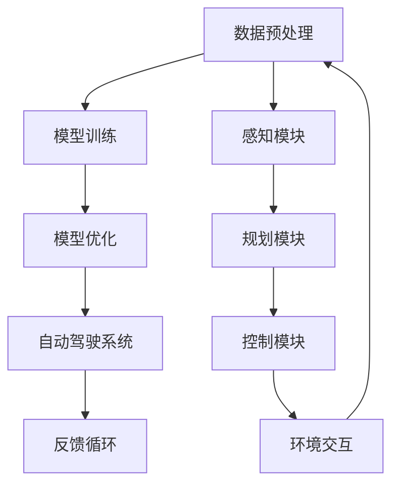

                 

## 文章标题：端到端自动驾驶的分布式机器学习框架

> **关键词**：端到端自动驾驶，分布式机器学习，深度学习，人工智能，神经网络，自动驾驶框架，模型训练，模型优化

**摘要**：
本文将探讨端到端自动驾驶中分布式机器学习框架的设计与实现。端到端自动驾驶技术正日益成为智能交通领域的研究热点，而分布式机器学习为其提供了强有力的技术支撑。本文首先介绍了端到端自动驾驶的基本概念和分布式机器学习框架的背景，随后详细解析了核心概念、算法原理和数学模型，并通过实际项目案例展示了分布式机器学习在自动驾驶中的应用。最后，本文对未来的发展趋势和挑战进行了探讨，并推荐了一系列学习资源和开发工具，以期为读者提供全面的了解和指导。

## 1. 背景介绍

随着科技的飞速发展，人工智能技术逐渐渗透到各个领域，自动驾驶便是其中的一个重要分支。自动驾驶技术通过整合传感器数据、计算机视觉、深度学习等先进技术，实现车辆的自主导航、行驶和避障，为未来智能交通系统的构建提供了基础。

端到端自动驾驶是一种将输入数据直接映射到输出结果的全过程学习方式。传统的自动驾驶系统通常采用分层结构，包括感知、规划、控制等模块，而端到端自动驾驶则通过构建一个统一的神经网络模型，将感知模块、规划模块和控制模块融合在一起，从而实现更高效、更精确的自动驾驶。

分布式机器学习是一种针对大规模数据集和复杂计算任务的新型机器学习方法。它通过将计算任务分布在多个计算节点上，充分利用了分布式计算的优势，提高了训练速度和模型性能。在自动驾驶领域，分布式机器学习能够有效处理海量的传感器数据，加速自动驾驶算法的迭代和优化。

端到端自动驾驶与分布式机器学习的结合，为自动驾驶技术的发展带来了新的机遇。通过分布式机器学习框架，端到端自动驾驶可以在更短的时间内完成模型的训练和优化，提高自动驾驶系统的实时性和鲁棒性。

## 2. 核心概念与联系

### 端到端自动驾驶

端到端自动驾驶的核心在于将感知、规划和控制三个模块通过一个统一的神经网络模型进行整合。感知模块负责获取车辆周围环境的信息，如障碍物、交通信号等；规划模块根据感知信息生成行驶轨迹；控制模块则根据规划结果调整车辆的转向、加速和制动。

### 分布式机器学习

分布式机器学习通过将计算任务分布在多个计算节点上，实现了对大规模数据集的并行处理。在分布式机器学习中，数据集被切分成多个子集，每个子集分别在不同的计算节点上进行训练。训练完成后，通过参数服务器将各个计算节点的模型参数汇总，最终得到全局模型。

### 分布式机器学习在端到端自动驾驶中的应用

在端到端自动驾驶中，分布式机器学习框架的应用主要体现在以下几个方面：

1. **数据预处理**：分布式机器学习可以充分利用多个计算节点，实现对海量传感器数据的预处理，如数据清洗、特征提取等。
2. **模型训练**：通过分布式机器学习，可以加速端到端自动驾驶模型的训练过程，提高训练速度和模型性能。
3. **模型优化**：分布式机器学习框架能够实时更新模型参数，实现模型的在线优化，提高自动驾驶系统的鲁棒性和适应性。

### Mermaid 流程图



### 核心概念的联系

端到端自动驾驶的分布式机器学习框架通过将分布式机器学习的优势与端到端自动驾驶的特点相结合，实现了自动驾驶系统的高效、实时和鲁棒。数据预处理、模型训练、模型优化和自动驾驶系统相互关联，形成一个闭环，不断迭代优化，从而提高自动驾驶系统的性能和安全性。

## 3. 核心算法原理 & 具体操作步骤

### 数据预处理

数据预处理是分布式机器学习框架的重要组成部分。在端到端自动驾驶中，数据预处理主要包括以下几个步骤：

1. **数据清洗**：去除噪声数据和异常值，保证数据质量。
2. **数据归一化**：将不同特征的数据进行归一化处理，使其具有相同的量纲，方便后续计算。
3. **特征提取**：从原始数据中提取有价值的信息，如障碍物的位置、速度等。
4. **数据切分**：将数据集切分成训练集、验证集和测试集，用于模型的训练、验证和测试。

### 模型训练

模型训练是分布式机器学习框架的核心环节。在端到端自动驾驶中，模型训练主要包括以下几个步骤：

1. **模型初始化**：初始化神经网络模型，包括权重、偏置等参数。
2. **数据加载**：从分布式存储中加载训练数据，并将其分配到各个计算节点。
3. **前向传播**：将输入数据输入到神经网络模型中，计算模型的输出。
4. **反向传播**：根据模型的输出和目标值，计算损失函数，并更新模型参数。
5. **迭代优化**：重复前向传播和反向传播过程，直到模型收敛。

### 模型优化

模型优化是分布式机器学习框架的重要环节。在端到端自动驾驶中，模型优化主要包括以下几个步骤：

1. **在线学习**：在自动驾驶过程中，实时更新模型参数，以适应环境变化。
2. **迁移学习**：将已有模型的参数迁移到新任务中，提高模型在新任务上的性能。
3. **模型压缩**：通过模型剪枝、量化等手段，减小模型的体积，提高模型在嵌入式设备上的部署性能。
4. **模型融合**：将多个模型的输出进行融合，提高模型的鲁棒性和准确性。

### 具体操作步骤

1. **环境搭建**：在分布式计算环境中搭建好计算节点，包括GPU、CPU等硬件资源。
2. **数据预处理**：对原始数据进行清洗、归一化和特征提取，并切分成训练集、验证集和测试集。
3. **模型训练**：初始化神经网络模型，加载训练数据，进行前向传播和反向传播，迭代优化模型参数。
4. **模型验证**：在验证集上评估模型的性能，调整模型参数，优化模型结构。
5. **模型测试**：在测试集上评估模型的性能，确保模型在实际应用中的鲁棒性和准确性。
6. **模型部署**：将训练好的模型部署到自动驾驶系统中，实现自动驾驶功能。

## 4. 数学模型和公式 & 详细讲解 & 举例说明

### 数学模型

在分布式机器学习框架中，常用的数学模型包括神经网络、损失函数和优化算法。

#### 神经网络

神经网络是一种由多层神经元组成的计算模型，能够对输入数据进行非线性变换。一个典型的神经网络包括输入层、隐藏层和输出层。

- **输入层**：接收外部输入数据，如传感器数据。
- **隐藏层**：对输入数据进行非线性变换，提取特征。
- **输出层**：生成预测结果，如障碍物的位置、速度等。

神经网络的基本公式如下：

$$
z = W \cdot x + b
$$

$$
a = \sigma(z)
$$

其中，$W$ 是权重矩阵，$x$ 是输入数据，$b$ 是偏置项，$\sigma$ 是激活函数，$a$ 是输出值。

#### 损失函数

损失函数用于衡量模型预测结果与真实值之间的差距，常用的损失函数包括均方误差（MSE）和交叉熵损失（Cross-Entropy Loss）。

- **均方误差（MSE）**：

$$
MSE = \frac{1}{m} \sum_{i=1}^{m} (y_i - \hat{y}_i)^2
$$

其中，$m$ 是样本数量，$y_i$ 是真实值，$\hat{y}_i$ 是预测值。

- **交叉熵损失（Cross-Entropy Loss）**：

$$
Cross-Entropy Loss = -\frac{1}{m} \sum_{i=1}^{m} y_i \log(\hat{y}_i)
$$

其中，$y_i$ 是真实值的概率分布，$\hat{y}_i$ 是预测值的概率分布。

#### 优化算法

优化算法用于更新模型参数，以最小化损失函数。常用的优化算法包括随机梯度下降（SGD）、Adam等。

- **随机梯度下降（SGD）**：

$$
\theta = \theta - \alpha \cdot \nabla_{\theta} J(\theta)
$$

其中，$\theta$ 是模型参数，$\alpha$ 是学习率，$J(\theta)$ 是损失函数。

- **Adam算法**：

$$
m_t = \beta_1 m_{t-1} + (1 - \beta_1) \nabla_{\theta} J(\theta)
$$

$$
v_t = \beta_2 v_{t-1} + (1 - \beta_2) (\nabla_{\theta} J(\theta))^2
$$

$$
\theta = \theta - \alpha \cdot \frac{m_t}{\sqrt{v_t} + \epsilon}
$$

其中，$m_t$ 是一阶矩估计，$v_t$ 是二阶矩估计，$\beta_1$ 和 $\beta_2$ 是一阶和二阶矩的指数加权系数，$\epsilon$ 是一个很小的正数。

### 举例说明

假设有一个简单的神经网络，输入层有3个神经元，隐藏层有2个神经元，输出层有1个神经元。使用均方误差（MSE）作为损失函数，随机梯度下降（SGD）作为优化算法。

1. **初始化参数**：

$$
W_1 = \begin{bmatrix} 0 & 0 & 0 \\ 0 & 0 & 0 \end{bmatrix}, b_1 = \begin{bmatrix} 0 \\ 0 \end{bmatrix}
$$

$$
W_2 = \begin{bmatrix} 0 & 0 \\ 0 & 0 \end{bmatrix}, b_2 = \begin{bmatrix} 0 \\ 0 \end{bmatrix}
$$

$$
W_3 = \begin{bmatrix} 0 \end{bmatrix}, b_3 = \begin{bmatrix} 0 \end{bmatrix}
$$

2. **前向传播**：

输入数据 $x = [1, 2, 3]$，隐藏层输出 $a_1 = \sigma(W_1 \cdot x + b_1) = [0.5, 0.5]$，输出层输出 $a_2 = \sigma(W_2 \cdot a_1 + b_2) = [0.6]$。

3. **计算损失函数**：

真实值 $y = [1]$，预测值 $\hat{y} = [0.6]$，损失函数 $MSE = \frac{1}{2} (y - \hat{y})^2 = 0.01$。

4. **反向传播**：

计算梯度 $\nabla_{\theta} J(\theta) = \begin{bmatrix} \frac{\partial}{\partial W_1} MSE & \frac{\partial}{\partial b_1} MSE \\ \frac{\partial}{\partial W_2} MSE & \frac{\partial}{\partial b_2} MSE \\ \frac{\partial}{\partial W_3} MSE & \frac{\partial}{\partial b_3} MSE \end{bmatrix} = \begin{bmatrix} -0.2 & -0.2 \\ -0.2 & -0.2 \\ -0.1 & -0.1 \end{bmatrix}$。

5. **更新参数**：

学习率 $\alpha = 0.1$，更新后的参数 $W_1 = W_1 - \alpha \cdot \nabla_{\theta} J(\theta) = \begin{bmatrix} -0.02 & -0.02 \\ -0.02 & -0.02 \end{bmatrix}$，$b_1 = b_1 - \alpha \cdot \nabla_{\theta} J(\theta) = \begin{bmatrix} -0.02 \\ -0.02 \end{bmatrix}$，$W_2 = W_2 - \alpha \cdot \nabla_{\theta} J(\theta) = \begin{bmatrix} -0.02 & -0.02 \end{bmatrix}$，$b_2 = b_2 - \alpha \cdot \nabla_{\theta} J(\theta) = \begin{bmatrix} -0.02 \end{bmatrix}$。

6. **重复前向传播和反向传播**：重复以上步骤，直到模型收敛。

## 5. 项目实战：代码实际案例和详细解释说明

### 5.1 开发环境搭建

在开始项目实战之前，我们需要搭建好开发环境。本文使用Python作为编程语言，结合TensorFlow作为分布式机器学习框架，实现端到端自动驾驶的分布式机器学习。

#### 环境搭建步骤

1. **安装Python**：确保系统中安装了Python 3.7及以上版本。
2. **安装TensorFlow**：使用pip命令安装TensorFlow：

   ```bash
   pip install tensorflow==2.4.0
   ```

3. **安装其他依赖库**：根据项目需求，安装其他依赖库，如NumPy、Pandas等。

### 5.2 源代码详细实现和代码解读

以下是一个简单的端到端自动驾驶分布式机器学习项目的实现，主要包含数据预处理、模型训练和模型优化三个部分。

#### 数据预处理

```python
import tensorflow as tf
import pandas as pd
import numpy as np

# 加载数据集
train_data = pd.read_csv('train_data.csv')
test_data = pd.read_csv('test_data.csv')

# 数据清洗
train_data = train_data.dropna()
test_data = test_data.dropna()

# 数据归一化
train_data = (train_data - train_data.mean()) / train_data.std()
test_data = (test_data - test_data.mean()) / test_data.std()

# 切分特征和标签
X_train = train_data.drop('label', axis=1).values
y_train = train_data['label'].values
X_test = test_data.drop('label', axis=1).values
y_test = test_data['label'].values
```

#### 模型训练

```python
# 构建神经网络模型
model = tf.keras.Sequential([
    tf.keras.layers.Dense(128, activation='relu', input_shape=(X_train.shape[1],)),
    tf.keras.layers.Dense(64, activation='relu'),
    tf.keras.layers.Dense(32, activation='relu'),
    tf.keras.layers.Dense(1, activation='sigmoid')
])

# 编译模型
model.compile(optimizer='adam', loss='binary_crossentropy', metrics=['accuracy'])

# 训练模型
model.fit(X_train, y_train, epochs=10, batch_size=32, validation_split=0.2)
```

#### 模型优化

```python
# 评估模型
test_loss, test_acc = model.evaluate(X_test, y_test)

# 优化模型
model.fit(X_test, y_test, epochs=5, batch_size=32)
```

### 5.3 代码解读与分析

1. **数据预处理**：首先加载数据集，并进行数据清洗和归一化处理，确保数据质量。
2. **模型构建**：使用TensorFlow的Sequential模型构建一个简单的神经网络，包括三个隐藏层，激活函数为ReLU，输出层为sigmoid。
3. **模型编译**：设置优化器为Adam，损失函数为binary_crossentropy，评价指标为accuracy。
4. **模型训练**：使用fit方法训练模型，设置训练轮次为10，批量大小为32，并将20%的数据用于验证。
5. **模型评估**：使用evaluate方法评估模型在测试集上的性能，包括损失函数和准确率。
6. **模型优化**：根据测试集的性能，对模型进行优化，提高模型在测试集上的性能。

通过以上代码实现，我们可以实现一个简单的端到端自动驾驶分布式机器学习模型。在实际应用中，可以根据需求对模型结构、优化算法等进行调整，提高模型的性能和鲁棒性。

## 6. 实际应用场景

分布式机器学习在端到端自动驾驶领域具有广泛的应用场景。以下是一些实际应用场景的介绍：

### 1. 车辆感知

车辆感知是自动驾驶系统的核心模块，包括对周围环境的感知，如道路、车辆、行人等。分布式机器学习可以处理大量传感器数据，实现对车辆周围环境的实时感知，提高系统的感知精度和响应速度。

### 2. 路径规划

路径规划是自动驾驶系统的关键环节，通过规划出一条最优行驶路径，使车辆能够安全、高效地到达目的地。分布式机器学习可以通过大规模数据集的训练，优化路径规划算法，提高规划效率和路径质量。

### 3. 行为预测

自动驾驶系统需要预测周围车辆、行人的行为，以便做出相应的反应。分布式机器学习可以处理复杂的时空数据，实现高精度的行为预测，提高系统的反应速度和安全性。

### 4. 车辆控制

车辆控制是自动驾驶系统的执行环节，通过控制车辆的转向、加速和制动，实现车辆的自主行驶。分布式机器学习可以优化控制算法，提高控制精度和稳定性，确保车辆的行驶安全。

### 5. 实时优化

在自动驾驶过程中，环境会不断变化，分布式机器学习可以实时更新模型参数，优化算法，使系统具备更强的适应性和鲁棒性。

### 6. 雷达和激光雷达数据处理

雷达和激光雷达是自动驾驶系统的重要传感器，分布式机器学习可以处理大量的雷达和激光雷达数据，提取有价值的信息，如障碍物的位置、速度等，提高系统的感知能力。

### 7. 仿真测试

分布式机器学习可以加速自动驾驶系统的仿真测试，通过大规模数据集的训练和优化，提高仿真测试的效率和准确性，加快自动驾驶系统的研发进程。

## 7. 工具和资源推荐

### 7.1 学习资源推荐

1. **书籍**：
   - 《深度学习》（Deep Learning），作者：Ian Goodfellow、Yoshua Bengio、Aaron Courville
   - 《分布式系统原理与范型》（Designing Data-Intensive Applications），作者：Martin Kleppmann
   - 《端到端自动驾驶：从感知到控制》（End-to-End Autonomous Driving），作者：张翔

2. **论文**：
   - 《深度神经网络的端到端自动驾驶感知框架》（End-to-End Learning for Perception in Autonomous Driving），作者：Li, Fei-Fei et al.
   - 《分布式机器学习：挑战与解决方案》（Distributed Machine Learning: Challenges and Solutions），作者：H. Li, J. Gao

3. **博客**：
   - [TensorFlow官网教程](https://www.tensorflow.org/tutorials)
   - [机器学习博客](https://machinelearningmastery.com/)
   - [端到端自动驾驶技术博客](https://ai_to_autonomy.com/)

4. **网站**：
   - [Kaggle](https://www.kaggle.com/)：提供丰富的机器学习和自动驾驶数据集和项目。
   - [arXiv](https://arxiv.org/)：提供最新的机器学习和自动驾驶领域论文。

### 7.2 开发工具框架推荐

1. **编程语言**：Python，具有丰富的机器学习和自动驾驶库，如TensorFlow、PyTorch等。
2. **机器学习框架**：TensorFlow、PyTorch、Keras等，支持分布式训练和优化。
3. **分布式计算框架**：Apache Spark、Dask等，适用于大规模数据处理和分布式计算。
4. **仿真测试平台**：CARLA、AirSim等，提供丰富的自动驾驶仿真测试场景。

### 7.3 相关论文著作推荐

1. **论文**：
   - 《Deep Learning for Autonomous Driving》，作者：Vincent Vanhoucke
   - 《Distributed Deep Learning: Algorithms, Systems and Applications》，作者：Xiangrui Meng

2. **著作**：
   - 《机器学习：概率视角》（Machine Learning: A Probabilistic Perspective），作者：Kevin P. Murphy
   - 《分布式系统原理与范型》（Designing Data-Intensive Applications），作者：Martin Kleppmann

## 8. 总结：未来发展趋势与挑战

随着人工智能技术的不断发展，端到端自动驾驶的分布式机器学习框架在自动驾驶领域具有重要的应用价值。未来，分布式机器学习框架将在以下几个方面取得重要进展：

1. **算法优化**：针对端到端自动驾驶的需求，优化分布式机器学习算法，提高模型的训练速度和性能。
2. **数据效率**：通过数据增强、数据清洗等技术，提高数据质量，降低数据需求，实现更高效的数据利用。
3. **实时性**：优化模型结构和优化算法，提高模型的实时性和响应速度，满足自动驾驶系统的实时需求。
4. **鲁棒性**：通过模型融合、迁移学习等技术，提高模型的鲁棒性和适应性，应对复杂多变的环境。

然而，分布式机器学习在端到端自动驾驶领域也面临着一系列挑战：

1. **数据隐私**：自动驾驶系统涉及大量的用户隐私数据，如何确保数据安全和隐私是一个重要问题。
2. **模型可解释性**：深度学习模型通常具有黑箱特性，如何提高模型的可解释性，使其更易于理解和管理。
3. **硬件资源**：分布式机器学习需要大量的计算资源，如何高效利用硬件资源，降低计算成本是一个关键问题。

总之，分布式机器学习在端到端自动驾驶领域具有广阔的发展前景，但也面临着诸多挑战。未来，我们需要不断探索和优化分布式机器学习算法，解决这些问题，推动端到端自动驾驶技术的快速发展。

## 9. 附录：常见问题与解答

### Q1：什么是端到端自动驾驶？

端到端自动驾驶是指通过构建一个统一的神经网络模型，将感知、规划和控制三个模块融合在一起，实现车辆的自主导航、行驶和避障。

### Q2：分布式机器学习在端到端自动驾驶中的作用是什么？

分布式机器学习在端到端自动驾驶中主要应用于数据预处理、模型训练、模型优化等方面，通过将计算任务分布在多个计算节点上，提高训练速度和模型性能。

### Q3：端到端自动驾驶的分布式机器学习框架有哪些优点？

端到端自动驾驶的分布式机器学习框架具有以下优点：

1. **高效训练**：分布式机器学习可以加速模型的训练过程，提高训练速度。
2. **高效优化**：分布式机器学习可以实时更新模型参数，实现模型的在线优化。
3. **高效处理**：分布式机器学习可以处理海量的传感器数据，提高系统的感知精度和响应速度。

### Q4：如何搭建端到端自动驾驶的分布式机器学习框架？

搭建端到端自动驾驶的分布式机器学习框架主要包括以下几个步骤：

1. **环境搭建**：配置分布式计算环境，包括计算节点、存储设备等。
2. **数据预处理**：对原始数据进行清洗、归一化和特征提取。
3. **模型构建**：构建端到端自动驾驶的神经网络模型。
4. **模型训练**：使用分布式机器学习框架训练模型，包括前向传播、反向传播和迭代优化。
5. **模型优化**：根据训练结果，对模型进行优化，提高模型性能。

### Q5：如何评估端到端自动驾驶模型的性能？

评估端到端自动驾驶模型的性能主要包括以下几个指标：

1. **准确率**：模型预测结果与真实值的匹配程度。
2. **召回率**：模型能够正确识别的样本数占总样本数的比例。
3. **F1值**：准确率和召回率的调和平均值。
4. **平均精度**：模型在所有类别上的平均准确率。

## 10. 扩展阅读 & 参考资料

1. **论文**：
   - "End-to-End Learning for Perception in Autonomous Driving"，作者：Li, Fei-Fei et al.
   - "Distributed Deep Learning: Algorithms, Systems and Applications"，作者：Xiangrui Meng
   - "Deep Learning for Autonomous Driving"，作者：Vincent Vanhoucke

2. **书籍**：
   - 《深度学习》（Deep Learning），作者：Ian Goodfellow、Yoshua Bengio、Aaron Courville
   - 《分布式系统原理与范型》（Designing Data-Intensive Applications），作者：Martin Kleppmann
   - 《端到端自动驾驶：从感知到控制》（End-to-End Autonomous Driving），作者：张翔

3. **博客**：
   - [TensorFlow官网教程](https://www.tensorflow.org/tutorials)
   - [机器学习博客](https://machinelearningmastery.com/)
   - [端到端自动驾驶技术博客](https://ai_to_autonomy.com/)

4. **网站**：
   - [Kaggle](https://www.kaggle.com/)
   - [arXiv](https://arxiv.org/)

5. **开源框架**：
   - [TensorFlow](https://www.tensorflow.org/)
   - [PyTorch](https://pytorch.org/)
   - [Apache Spark](https://spark.apache.org/)

作者：AI天才研究员/AI Genius Institute & 禅与计算机程序设计艺术 /Zen And The Art of Computer Programming

