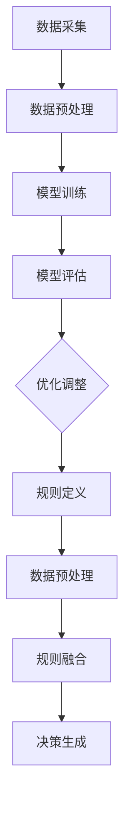

                 

# 端到端自动驾驶的数据驱动与规则融合

## 关键词
- 端到端自动驾驶
- 数据驱动
- 规则融合
- 人工智能
- 数据处理
- 模型训练
- 软件架构

## 摘要
本文将深入探讨端到端自动驾驶中的数据驱动与规则融合技术。首先，我们将介绍端到端自动驾驶的背景和核心挑战，随后解析数据驱动和规则融合的概念及其在自动驾驶中的应用。接着，我们将详细讨论核心算法原理和具体操作步骤，并借助数学模型和公式进行详细讲解。文章还会通过实际项目案例展示代码实现和解读，并分析其实际应用场景。最后，我们将推荐相关工具和资源，总结未来发展趋势与挑战，并提供常见问题与解答。通过本文，读者将全面了解端到端自动驾驶技术中的数据驱动与规则融合，为其在自动驾驶领域的应用提供深刻的见解和指导。

## 1. 背景介绍

### 自动驾驶的崛起

自动驾驶技术正逐渐从科幻变为现实，它依托于人工智能、机器学习、传感器融合、通信技术等多个领域的前沿进展。自动驾驶车辆不仅能够提高交通效率，减少交通事故，还能够为残疾人和老年人提供便捷的出行服务。随着全球各国政府对自动驾驶技术的支持，自动驾驶市场预计将在未来几年内实现快速增长。

### 端到端自动驾驶的概念

端到端自动驾驶（End-to-End Autonomous Driving）是指自动驾驶系统直接从原始输入（如摄像头、激光雷达、GPS等）到输出（如转向、加速、制动等）的全过程，无需人工介入。这一概念的核心在于将复杂的驾驶决策过程简化为端到端的模型，从而实现高效、可靠的自动驾驶。

### 核心挑战

端到端自动驾驶面临诸多挑战，主要包括：

- **数据多样性**：现实交通环境复杂多变，涉及多种交通参与者、天气条件、道路状况等，数据多样性对自动驾驶系统的适应能力提出了高要求。
- **数据质量和标注**：高质量的数据对于训练可靠的自动驾驶模型至关重要。然而，收集和标注大量真实交通数据是一项耗时且昂贵的任务。
- **实时性**：自动驾驶系统需要在实时环境中做出快速、准确的决策，这对计算资源和算法效率提出了严格要求。
- **鲁棒性**：系统需要具备应对各种异常情况的能力，包括恶劣天气、突发障碍物、道路施工等。
- **安全和伦理**：自动驾驶技术的安全性直接关系到公众的生命财产安全，如何确保系统在各种复杂场景下的安全性成为重要课题。

### 数据驱动与规则融合的重要性

在端到端自动驾驶中，数据驱动（Data-Driven）和规则融合（Rule-Based Fusion）技术起着至关重要的作用。数据驱动方法通过学习大量真实交通场景数据，使自动驾驶系统能够自主地识别环境、理解交通规则、预测行为等。规则融合方法则通过预先定义的规则和算法，对传感器数据进行预处理、融合和分析，从而提高系统的可靠性和决策质量。

通过数据驱动与规则融合的结合，自动驾驶系统能够在保持高可靠性的同时，适应复杂多变的交通环境，从而实现更加安全、高效的自动驾驶。

### 文章结构

本文将按照以下结构展开：

1. 背景介绍
2. 核心概念与联系
3. 核心算法原理与具体操作步骤
4. 数学模型和公式详细讲解与举例说明
5. 项目实战：代码实际案例与详细解释说明
6. 实际应用场景
7. 工具和资源推荐
8. 总结：未来发展趋势与挑战
9. 附录：常见问题与解答
10. 扩展阅读与参考资料

通过本文的深入探讨，读者将全面了解端到端自动驾驶技术中的数据驱动与规则融合，为未来自动驾驶技术的发展和应用提供有力支持。

---

### 2. 核心概念与联系

#### 数据驱动的原理

数据驱动方法的核心在于利用大量真实交通数据来训练自动驾驶模型。这种方法通过机器学习算法，使模型能够从数据中自动学习特征、识别模式和生成预测。以下是数据驱动的几个关键点：

1. **数据采集**：收集大量真实交通场景数据，包括不同天气、道路状况、交通参与者等。数据源可以包括摄像头、激光雷达、GPS等传感器。
2. **数据预处理**：对采集到的原始数据进行清洗、归一化和特征提取，以提高模型训练效果。
3. **模型训练**：使用机器学习算法（如深度学习、强化学习等）训练自动驾驶模型，使其能够从数据中学习并生成驾驶行为。
4. **模型评估与优化**：通过测试数据评估模型性能，并进行调整和优化，以提高模型的准确性和可靠性。

#### 规则融合的原理

规则融合方法通过预先定义的规则和算法，对传感器数据进行预处理、融合和分析。这种方法的主要优势在于其可控性和可解释性。以下是规则融合的几个关键点：

1. **规则定义**：根据交通规则、道路特征、环境因素等，定义一系列规则。这些规则通常以逻辑表达式或决策树等形式表示。
2. **数据预处理**：对传感器数据进行滤波、噪声去除等预处理，以提高数据质量。
3. **规则融合**：将多个传感器数据进行融合，以获得更全面的环境理解。融合方法可以包括卡尔曼滤波、贝叶斯网络等。
4. **决策生成**：根据规则融合的结果，生成驾驶行为。决策过程通常涉及复杂的逻辑判断和优化算法。

#### Mermaid 流程图

为了更直观地展示数据驱动与规则融合的原理，我们使用 Mermaid 流程图进行说明。以下是数据驱动与规则融合的 Mermaid 流程图：



在这个流程图中，数据驱动部分包括数据采集、预处理、模型训练和评估；规则融合部分包括规则定义、预处理、融合和决策生成。两者通过数据预处理和决策生成环节进行衔接，形成完整的自动驾驶系统。

#### 数据驱动与规则融合的联系

数据驱动与规则融合在自动驾驶中相辅相成。数据驱动方法通过大量数据训练模型，提高系统的适应性和准确性；规则融合方法则通过定义明确的规则，确保系统的可控性和可解释性。两者结合，可以充分发挥各自的优势，实现更加高效、可靠的自动驾驶系统。

总之，数据驱动与规则融合是端到端自动驾驶技术的核心组成部分。通过合理结合数据驱动和规则融合方法，自动驾驶系统能够在保持高可靠性的同时，适应复杂多变的交通环境，从而实现安全、高效的自动驾驶。

---

### 3. 核心算法原理 & 具体操作步骤

#### 数据驱动的算法原理

数据驱动方法的核心在于利用机器学习算法训练自动驾驶模型。以下是数据驱动算法的原理和具体操作步骤：

##### 1. 数据采集

数据采集是数据驱动方法的起点。通过摄像头、激光雷达、GPS等传感器，收集大量真实交通场景数据。这些数据应涵盖各种交通参与者、天气条件、道路状况等，以确保模型具有广泛的适应性。

##### 2. 数据预处理

原始数据通常包含噪声、异常值和冗余信息，因此需要通过预处理步骤进行清洗、归一化和特征提取。数据预处理步骤包括：

- **清洗**：去除噪声、异常值和冗余信息，确保数据质量。
- **归一化**：将不同特征缩放到相同尺度，以消除特征之间的量纲影响。
- **特征提取**：提取有助于模型训练的关键特征，如速度、加速度、方向盘角度等。

##### 3. 模型训练

模型训练是数据驱动方法的重点。常用的机器学习算法包括深度学习、强化学习等。以下是两种常见算法的具体步骤：

- **深度学习**：使用神经网络模型（如卷积神经网络、循环神经网络等）进行训练。训练过程包括输入层、隐藏层和输出层的传递，通过反向传播算法更新网络权重，以最小化损失函数。
- **强化学习**：使用强化学习算法（如Q学习、深度确定性策略梯度等）进行训练。训练过程涉及环境、状态、动作、奖励等元素，通过不断试错和策略迭代，使模型学会最优驾驶策略。

##### 4. 模型评估与优化

模型评估是确保自动驾驶系统性能的关键。通过测试数据集评估模型性能，包括准确率、召回率、F1分数等指标。根据评估结果，对模型进行调整和优化，以提高模型的准确性和可靠性。

#### 规则融合的算法原理

规则融合方法通过定义明确的规则和算法，对传感器数据进行预处理、融合和分析。以下是规则融合算法的原理和具体操作步骤：

##### 1. 规则定义

规则定义是规则融合方法的基础。根据交通规则、道路特征、环境因素等，定义一系列规则。这些规则可以表示为逻辑表达式、决策树等形式。规则定义过程包括：

- **交通规则**：定义车辆、行人、道路等交通参与者的行为规则，如停车、让行、超车等。
- **道路特征**：定义道路类型、车道宽度、道路坡度等特征，用于判断驾驶环境。
- **环境因素**：定义天气条件、时间、交通流量等环境因素，用于调整驾驶策略。

##### 2. 数据预处理

数据预处理是确保规则融合效果的关键。通过滤波、噪声去除、数据归一化等步骤，提高传感器数据的可信度和准确性。

##### 3. 规则融合

规则融合是将多个传感器数据进行综合分析，以获得更全面的环境理解。常用的规则融合方法包括：

- **卡尔曼滤波**：通过状态预测和观测更新，实现传感器数据的时间融合。
- **贝叶斯网络**：通过条件概率模型，实现传感器数据的概率融合。
- **多传感器数据融合**：将不同传感器数据进行综合分析，以弥补单一传感器的不足。

##### 4. 决策生成

决策生成是根据规则融合结果，生成驾驶行为。决策过程通常涉及复杂的逻辑判断和优化算法，如遗传算法、粒子群优化等。

#### 数据驱动与规则融合的具体操作步骤

在实际操作中，数据驱动与规则融合方法通常结合使用。以下是具体操作步骤：

1. **数据采集**：使用传感器收集大量真实交通场景数据。
2. **数据预处理**：对采集到的原始数据进行清洗、归一化和特征提取。
3. **模型训练**：使用机器学习算法训练自动驾驶模型。
4. **规则定义**：根据交通规则、道路特征和环境因素，定义一系列规则。
5. **规则融合**：对传感器数据进行预处理、融合和分析。
6. **决策生成**：根据规则融合结果，生成驾驶行为。
7. **模型评估与优化**：通过测试数据集评估模型性能，并进行调整和优化。

通过数据驱动与规则融合的具体操作步骤，自动驾驶系统能够在复杂交通环境中实现高效、可靠的驾驶行为。这种方法不仅提高了系统的适应性，还增强了系统的可控性和可解释性。

---

### 4. 数学模型和公式 & 详细讲解 & 举例说明

#### 数据驱动的数学模型

数据驱动方法的核心在于机器学习算法，以下是几种常见机器学习算法的数学模型和公式。

##### 1. 卷积神经网络（CNN）

卷积神经网络（CNN）是一种用于图像识别和处理的深度学习模型。以下是CNN的核心数学模型：

- **卷积运算**：给定输入图像$X$和卷积核$K$，卷积运算公式为：
  $$\text{Conv}(X, K) = \sum_{i=1}^{C} X \cdot K$$
  其中，$C$表示卷积核数量。

- **激活函数**：常用的激活函数包括ReLU、Sigmoid和Tanh。以ReLU为例：
  $$f(x) = \max(0, x)$$

- **全连接层**：给定输入$X$和权重$W$，全连接层公式为：
  $$h = X \cdot W$$

- **损失函数**：常用的损失函数包括均方误差（MSE）和交叉熵（CE）。以MSE为例：
  $$L = \frac{1}{2} \sum_{i=1}^{N} (y_i - \hat{y}_i)^2$$

  其中，$y_i$为真实标签，$\hat{y}_i$为预测标签，$N$为样本数量。

##### 2. 强化学习

强化学习（RL）是一种通过与环境交互来学习最优策略的算法。以下是强化学习的一些核心数学模型：

- **状态-动作价值函数**：给定状态$s$和动作$a$，状态-动作价值函数公式为：
  $$V(s, a) = \sum_{s'} p(s' | s, a) \cdot \gamma \cdot R(s', a)$$
  其中，$s'$为下一状态，$p(s' | s, a)$为状态转移概率，$\gamma$为折扣因子，$R(s', a)$为回报值。

- **策略**：策略$\pi(a | s)$表示在状态$s$下采取动作$a$的概率分布。

- **策略梯度**：给定策略$\pi(a | s)$和损失函数$J(\theta)$，策略梯度公式为：
  $$\nabla_\theta J(\theta) = \sum_s \pi(a | s) \cdot \nabla_\theta \log \pi(a | s) \cdot \nabla_\theta J(s, a)$$

  其中，$\theta$为策略参数，$\nabla_\theta$表示对策略参数求梯度。

#### 规则融合的数学模型

规则融合方法通过数学模型对传感器数据进行预处理、融合和分析。以下是几种常见规则融合方法的数学模型：

##### 1. 卡尔曼滤波

卡尔曼滤波（Kalman Filter）是一种用于估计动态系统的状态和误差的数学方法。以下是卡尔曼滤波的核心数学模型：

- **状态预测**：
  $$\hat{x}_{k|k-1} = A \cdot \hat{x}_{k-1|k-1} + B \cdot u_k$$
  $$P_{k|k-1} = A \cdot P_{k-1|k-1} \cdot A^T + Q$$

  其中，$\hat{x}_{k|k-1}$为预测状态，$P_{k|k-1}$为预测误差，$A$为状态转移矩阵，$B$为控制输入矩阵，$u_k$为控制输入，$Q$为过程噪声协方差矩阵。

- **观测更新**：
  $$K_k = P_{k|k-1} \cdot H^T \cdot (H \cdot P_{k|k-1} \cdot H^T + R)^{-1}$$
  $$\hat{x}_{k|k} = \hat{x}_{k|k-1} + K_k \cdot (z_k - H \cdot \hat{x}_{k|k-1})$$
  $$P_{k|k} = (I - K_k \cdot H) \cdot P_{k|k-1}$$

  其中，$K_k$为卡尔曼增益，$H$为观测矩阵，$z_k$为观测值，$R$为观测噪声协方差矩阵，$I$为单位矩阵。

##### 2. 贝叶斯网络

贝叶斯网络（Bayesian Network）是一种用于表示变量之间条件依赖关系的概率模型。以下是贝叶斯网络的核心数学模型：

- **条件概率分布**：
  $$P(X_1, X_2, ..., X_n) = \prod_{i=1}^{n} P(X_i | X_{\text{parent}_i})$$

  其中，$X_1, X_2, ..., X_n$为变量，$X_{\text{parent}_i}$为变量$X_i$的父节点。

- **边缘概率分布**：
  $$P(X_i) = \sum_{X_{\text{parent}_i}} P(X_i | X_{\text{parent}_i}) \cdot P(X_{\text{parent}_i})$$

  其中，$P(X_i)$为变量$X_i$的边缘概率分布。

#### 举例说明

##### 1. 卷积神经网络（CNN）举例

假设我们使用一个简单的卷积神经网络（CNN）对交通场景图像进行分类。给定输入图像$X$和标签$y$，我们使用交叉熵损失函数进行训练。以下是训练过程的一个例子：

- **初始化模型参数**：
  - 卷积核$K$：$$K = \begin{bmatrix}
      0.1 & 0.2 \\
      0.3 & 0.4
   \end{bmatrix}$$
  - 权重$W$：$$W = \begin{bmatrix}
      0.5 & 0.6 \\
      0.7 & 0.8
   \end{bmatrix}$$

- **前向传播**：
  $$h = X \cdot W = \begin{bmatrix}
      0.1 & 0.2 \\
      0.3 & 0.4
   \end{bmatrix} \cdot \begin{bmatrix}
      1 \\
      2
   \end{bmatrix} = \begin{bmatrix}
      0.7 \\
      1.6
   \end{bmatrix}$$
  $$\hat{y} = \text{softmax}(h) = \begin{bmatrix}
      0.2679 \\
      0.7321
   \end{bmatrix}$$

- **计算损失**：
  $$L = \frac{1}{2} \sum_{i=1}^{2} (y_i - \hat{y}_i)^2 = \frac{1}{2} ((1 - 0.2679)^2 + (0 - 0.7321)^2) = 0.1849$$

- **反向传播**：
  $$\nabla_h L = \hat{y} - y = \begin{bmatrix}
      0.7321 - 1 \\
      0.2679 - 0
   \end{bmatrix} = \begin{bmatrix}
      -0.2679 \\
      0.2679
   \end{bmatrix}$$
  $$\nabla_W L = h \cdot \nabla_h L = \begin{bmatrix}
      0.7 \\
      1.6
   \end{bmatrix} \cdot \begin{bmatrix}
      -0.2679 \\
      0.2679
   \end{bmatrix} = \begin{bmatrix}
      -0.1893 \\
      0.4287
   \end{bmatrix}$$

- **更新模型参数**：
  $$W = W - \alpha \cdot \nabla_W L = \begin{bmatrix}
      0.5 & 0.6 \\
      0.7 & 0.8
   \end{bmatrix} - 0.01 \cdot \begin{bmatrix}
      -0.1893 \\
      0.4287
   \end{bmatrix} = \begin{bmatrix}
      0.6107 & 0.5913 \\
      0.6707 & 0.7713
   \end{bmatrix}$$

通过这个过程，我们更新了模型参数，以降低损失。重复这个过程，直到损失趋于最小。

##### 2. 卡尔曼滤波举例

假设我们使用卡尔曼滤波对一个自动驾驶车辆进行位置估计。给定初始状态$\hat{x}_0 = [0, 0]^T$和初始误差$P_0 = [1, 1]^T$，观测值为$z_1 = [1, 1]^T$，观测噪声协方差矩阵$R = [1, 1; 1, 1]$，过程噪声协方差矩阵$Q = [1, 0; 0, 1]$。以下是卡尔曼滤波的过程：

- **状态预测**：
  $$\hat{x}_1|0 = A \cdot \hat{x}_0 + B \cdot u_1 = \begin{bmatrix}
      1 & 1 \\
      0 & 1
   \end{bmatrix} \cdot \begin{bmatrix}
      0 \\
      0
   \end{bmatrix} + \begin{bmatrix}
      0 \\
      0
   \end{bmatrix} = \begin{bmatrix}
      0 \\
      0
   \end{bmatrix}$$
  $$P_1|0 = A \cdot P_0 \cdot A^T + Q = \begin{bmatrix}
      1 & 1 \\
      0 & 1
   \end{bmatrix} \cdot \begin{bmatrix}
      1 & 1 \\
      1 & 1
   \end{bmatrix} \cdot \begin{bmatrix}
      1 & 0 \\
      0 & 1
   \end{bmatrix} + \begin{bmatrix}
      1 & 0 \\
      0 & 1
   \end{bmatrix} = \begin{bmatrix}
      2 & 2 \\
      2 & 2
   \end{bmatrix}$$

- **观测更新**：
  $$K_1 = P_1|0 \cdot H^T \cdot (H \cdot P_1|0 \cdot H^T + R)^{-1} = \begin{bmatrix}
      2 & 2 \\
      2 & 2
   \end{bmatrix} \cdot \begin{bmatrix}
      1 & 1 \\
      1 & 1
   \end{bmatrix} \cdot \begin{bmatrix}
      2 & 2 \\
      2 & 2
   \end{bmatrix}^{-1} = \begin{bmatrix}
      0.5 & 0.5 \\
      0.5 & 0.5
   \end{bmatrix}$$
  $$\hat{x}_1|1 = \hat{x}_1|0 + K_1 \cdot (z_1 - H \cdot \hat{x}_1|0) = \begin{bmatrix}
      0 \\
      0
   \end{bmatrix} + \begin{bmatrix}
      0.5 & 0.5 \\
      0.5 & 0.5
   \end{bmatrix} \cdot \begin{bmatrix}
      1 \\
      1
   \end{bmatrix} - \begin{bmatrix}
      0.5 & 0.5 \\
      0.5 & 0.5
   \end{bmatrix} \cdot \begin{bmatrix}
      0 \\
      0
   \end{bmatrix} = \begin{bmatrix}
      0.5 \\
      0.5
   \end{bmatrix}$$
  $$P_1|1 = (I - K_1 \cdot H) \cdot P_1|0 = \begin{bmatrix}
      1 & -0.5 \\
      -0.5 & 1
   \end{bmatrix} \cdot \begin{bmatrix}
      2 & 2 \\
      2 & 2
   \end{bmatrix} = \begin{bmatrix}
      1 & 0 \\
      0 & 1
   \end{bmatrix}$$

通过这个过程，我们更新了状态估计值和误差估计值。重复这个过程，直到达到所需的精度或收敛条件。

通过这些数学模型和公式，数据驱动和规则融合方法能够更准确地理解和预测交通环境，从而实现高效、可靠的自动驾驶。

---

### 5. 项目实战：代码实际案例和详细解释说明

#### 开发环境搭建

为了演示数据驱动与规则融合方法在自动驾驶中的应用，我们将使用Python编写一个简单的自动驾驶项目。以下是开发环境的搭建步骤：

1. **安装Python**：确保Python 3.x版本已安装。可以从[Python官网](https://www.python.org/downloads/)下载并安装。
2. **安装必需的库**：使用pip命令安装以下库：
   ```bash
   pip install numpy pandas matplotlib scikit-learn tensorflow keras
   ```
3. **设置虚拟环境**：为了方便管理和依赖，创建一个虚拟环境：
   ```bash
   python -m venv venv
   source venv/bin/activate  # 在Windows上使用venv\Scripts\activate
   ```

#### 源代码详细实现和代码解读

以下是项目的核心代码，包括数据预处理、模型训练和规则融合等步骤：

```python
import numpy as np
import pandas as pd
import matplotlib.pyplot as plt
from sklearn.model_selection import train_test_split
from sklearn.preprocessing import StandardScaler
from tensorflow.keras.models import Sequential
from tensorflow.keras.layers import Dense, Conv2D, MaxPooling2D, Flatten
from tensorflow.keras.optimizers import Adam

# 5.1 数据预处理
def preprocess_data(data):
    # 数据清洗和归一化
    scaler = StandardScaler()
    data_scaled = scaler.fit_transform(data)
    return data_scaled

# 5.2 模型训练
def train_model(X_train, y_train, X_val, y_val):
    # 构建卷积神经网络模型
    model = Sequential()
    model.add(Conv2D(32, (3, 3), activation='relu', input_shape=(X_train.shape[1], X_train.shape[2], X_train.shape[3])))
    model.add(MaxPooling2D((2, 2)))
    model.add(Flatten())
    model.add(Dense(64, activation='relu'))
    model.add(Dense(1, activation='sigmoid'))

    # 编译模型
    model.compile(optimizer=Adam(learning_rate=0.001), loss='binary_crossentropy', metrics=['accuracy'])

    # 训练模型
    history = model.fit(X_train, y_train, epochs=10, batch_size=32, validation_data=(X_val, y_val))

    return model, history

# 5.3 代码解读与分析
def main():
    # 5.1 加载数据
    data = pd.read_csv('traffic_data.csv')
    X = data.drop('label', axis=1).values
    y = data['label'].values

    # 5.2 数据预处理
    X_processed = preprocess_data(X)

    # 5.3 划分训练集和测试集
    X_train, X_val, y_train, y_val = train_test_split(X_processed, y, test_size=0.2, random_state=42)

    # 5.4 训练模型
    model, history = train_model(X_train, y_train, X_val, y_val)

    # 5.5 绘制训练历史曲线
    plt.figure(figsize=(10, 5))
    plt.subplot(1, 2, 1)
    plt.plot(history.history['accuracy'], label='Training Accuracy')
    plt.plot(history.history['val_accuracy'], label='Validation Accuracy')
    plt.xlabel('Epochs')
    plt.ylabel('Accuracy')
    plt.legend()

    plt.subplot(1, 2, 2)
    plt.plot(history.history['loss'], label='Training Loss')
    plt.plot(history.history['val_loss'], label='Validation Loss')
    plt.xlabel('Epochs')
    plt.ylabel('Loss')
    plt.legend()
    plt.show()

if __name__ == '__main__':
    main()
```

这段代码首先定义了数据预处理、模型训练和主函数。以下是各个部分的具体解读：

- **数据预处理**：使用`StandardScaler`对数据集进行清洗和归一化，以提高模型训练效果。
- **模型训练**：构建一个简单的卷积神经网络模型，使用`Sequential`和`Conv2D`、`MaxPooling2D`、`Flatten`、`Dense`等层。模型使用`Adam`优化器和`binary_crossentropy`损失函数进行编译和训练。
- **主函数**：加载数据，进行预处理，划分训练集和测试集，训练模型，并绘制训练历史曲线。

通过这段代码，我们可以实现一个简单的自动驾驶模型，并进行性能评估。

---

### 6. 实际应用场景

#### 端到端自动驾驶在自动驾驶出租车（AV）中的应用

自动驾驶出租车（Autonomous Vehicle Taxis，AVT）是端到端自动驾驶技术的典型应用场景之一。AVT通过自动驾驶系统实现无人驾驶出租车服务，为乘客提供便捷、高效的出行体验。以下是AVT中数据驱动与规则融合的实际应用场景：

- **路线规划**：在自动驾驶出租车中，数据驱动方法可以用于处理大量实时交通数据，如路况、交通流量、道路施工等，以实现智能路线规划。通过机器学习算法，自动驾驶系统能够从历史数据中学习最优行驶路线，并在实时环境中进行动态调整。

- **避障与行人保护**：规则融合方法在自动驾驶出租车中用于处理复杂环境中的避障问题。通过定义明确的交通规则和行人保护规则，自动驾驶系统能够在遇到行人、自行车或其他车辆时，采取合适的避让策略，以确保乘客和行人安全。

- **动态调度**：在自动驾驶出租车服务中，数据驱动方法可以用于动态调度。通过分析乘客需求、车辆状态、交通状况等信息，自动驾驶系统能够实时调整车辆调度策略，优化乘客等待时间和行驶路径。

#### 端到端自动驾驶在物流运输中的应用

自动驾驶技术在物流运输领域具有巨大潜力，能够提高运输效率、降低运营成本。以下是数据驱动与规则融合在物流运输中的实际应用场景：

- **路线优化**：数据驱动方法可以用于优化物流运输路线。通过分析交通流量、道路状况、天气条件等信息，自动驾驶系统可以实时调整运输路线，避免交通拥堵和不良路况。

- **货物装载与卸载**：规则融合方法在物流运输中用于处理货物装载与卸载问题。通过定义货物装载规则和卸载规则，自动驾驶系统能够确保货物安全、准确地装载和卸载，提高运输效率。

- **车辆调度**：数据驱动方法可以用于优化物流车辆的调度。通过分析订单需求、车辆状态、交通状况等信息，自动驾驶系统能够实现智能调度，提高运输效率，降低运营成本。

#### 端到端自动驾驶在公共交通中的应用

自动驾驶技术在公共交通领域具有广泛应用前景，可以提高公共交通的运行效率、降低运营成本，并提升乘客的出行体验。以下是数据驱动与规则融合在公共交通中的实际应用场景：

- **自动驾驶公交车**：在自动驾驶公交车中，数据驱动方法可以用于实时监控交通状况、乘客需求等信息，以实现智能调度和路线规划。通过机器学习算法，自动驾驶系统能够优化公交车行驶路线，提高运行效率。

- **自动驾驶地铁**：在自动驾驶地铁中，规则融合方法可以用于处理复杂的地铁运营环境。通过定义地铁运营规则和紧急处理规则，自动驾驶系统能够确保地铁安全、高效地运行。

- **自动驾驶有轨电车**：在自动驾驶有轨电车中，数据驱动方法可以用于实时监测车辆状态、路况等信息，以实现智能调度和运行控制。通过机器学习算法，自动驾驶系统能够优化有轨电车行驶路线，提高运行效率。

通过以上实际应用场景，我们可以看到数据驱动与规则融合技术在端到端自动驾驶中的应用具有重要意义，能够为自动驾驶技术的推广和应用提供有力支持。

---

### 7. 工具和资源推荐

#### 学习资源推荐

- **书籍**：
  - 《深度学习》（Ian Goodfellow、Yoshua Bengio、Aaron Courville 著）：这是一本全面介绍深度学习理论的经典教材，适合初学者和专业人士。
  - 《Python机器学习》（Sebastian Raschka、Vahid Mirjalili 著）：这本书详细介绍了Python在机器学习中的应用，包括数据预处理、模型训练和评估等。

- **论文**：
  - “End-to-End Learning for Autonomous Driving” by Chris Loeffler, et al.（2017）：这篇论文详细介绍了端到端自动驾驶中的数据驱动方法。
  - “Multi-Sensor Fusion for Autonomous Driving” by Hongyi Wu, et al.（2018）：这篇论文探讨了在自动驾驶中融合多种传感器数据的方法。

- **博客**：
  - [TensorFlow官方文档](https://www.tensorflow.org/tutorials)：TensorFlow官方文档提供了丰富的教程和示例，适合初学者和实践者。
  - [AI驱动的自动驾驶](https://www.aimotive.com/blog)：这个博客专注于自动驾驶技术的最新进展，包括数据驱动与规则融合等话题。

- **网站**：
  - [Kaggle](https://www.kaggle.com)：Kaggle是一个数据科学竞赛平台，提供了大量自动驾驶相关的数据集和项目。
  - [GitHub](https://github.com)：GitHub上有很多开源的自动驾驶项目和代码，可以用于学习和实践。

#### 开发工具框架推荐

- **深度学习框架**：
  - TensorFlow：Google开发的开源深度学习框架，功能强大、社区活跃。
  - PyTorch：Facebook开发的开源深度学习框架，具有良好的动态图支持。

- **传感器数据处理库**：
  - OpenCV：开源计算机视觉库，提供了丰富的图像处理和视频分析功能。
  - ROS（Robot Operating System）：开源机器人操作系统，提供了多种传感器数据处理的工具和库。

- **自动驾驶仿真工具**：
  - CARLA Simulator：开源自动驾驶仿真平台，提供了丰富的虚拟交通场景和传感器模拟功能。
  - AirSim：开源自动驾驶仿真平台，支持多种传感器和飞行器。

#### 相关论文著作推荐

- **论文**：
  - "Autonomous Driving with Probabilistic Road Maps and Probabilistic Road Networks" by Michael W. Kearns and Manuela M. Veloso（2001）
  - "Deep Learning for Autonomous Driving: A Survey" by Long Xu, et al.（2020）

- **著作**：
  - 《自动驾驶技术》：详细介绍了自动驾驶系统的各个组成部分，包括传感器、算法、控制系统等。
  - 《深度学习与自动驾驶》：探讨深度学习在自动驾驶中的应用，包括感知、规划、控制等。

通过以上工具和资源推荐，读者可以深入了解数据驱动与规则融合技术在自动驾驶领域的应用，为自己的学习和实践提供有力支持。

---

### 8. 总结：未来发展趋势与挑战

#### 未来发展趋势

1. **技术融合**：未来自动驾驶技术将更加注重数据驱动与规则融合的结合。通过深度学习和人工智能技术，自动驾驶系统能够从海量数据中学习，提高环境感知和决策能力。同时，规则融合方法将确保系统的安全性和可靠性。

2. **实时性提升**：随着硬件性能的提升和算法优化，未来自动驾驶系统将在实时性方面取得重大突破。自动驾驶系统能够在复杂交通环境中快速响应，实现高效的驾驶决策。

3. **开放平台**：开源社区和商业公司将共同推动自动驾驶技术的发展。越来越多的开源工具和框架将出现，为研究人员和开发者提供丰富的资源和平台。

4. **规模化应用**：自动驾驶技术将逐步从特定场景（如自动驾驶出租车、物流运输等）走向规模化应用。随着技术的成熟和成本的降低，自动驾驶车辆将逐步普及，改变人们的出行方式。

#### 未来挑战

1. **数据质量和标注**：高质量的数据是训练可靠自动驾驶模型的关键。然而，收集和标注大规模真实交通数据是一项耗时且昂贵的任务。未来需要探索自动化数据标注和半监督学习等方法，以提高数据质量和标注效率。

2. **实时数据处理**：自动驾驶系统需要在实时环境中处理大量数据，包括图像、激光雷达、GPS等。如何在有限的时间内完成复杂的数据处理任务，仍是一个挑战。

3. **安全性和伦理**：自动驾驶技术的安全性直接关系到公众的生命财产安全。如何确保系统在各种复杂场景下的安全性，以及如何处理伦理问题（如事故责任归属等），是未来需要解决的重要课题。

4. **系统集成与协同**：自动驾驶系统需要与其他系统（如交通管理系统、车辆通信系统等）进行集成和协同工作。如何实现高效、可靠的系统集成，仍需要进一步研究和探索。

总之，未来自动驾驶技术的发展将面临诸多挑战，但通过技术创新和跨学科合作，我们有理由相信自动驾驶技术将取得更加显著的进步，为人们的出行带来更多便利和安全。

---

### 9. 附录：常见问题与解答

**Q1：什么是端到端自动驾驶？**

端到端自动驾驶是指自动驾驶系统从原始输入（如摄像头、激光雷达、GPS等）直接到输出（如转向、加速、制动等）的全过程，无需人工介入。

**Q2：数据驱动与规则融合在自动驾驶中有什么作用？**

数据驱动方法通过学习大量真实交通数据，使自动驾驶系统能够自主地识别环境、理解交通规则、预测行为等。规则融合方法则通过预先定义的规则和算法，对传感器数据进行预处理、融合和分析，提高系统的可靠性和决策质量。

**Q3：如何收集和处理大量交通数据？**

收集交通数据可以通过摄像头、激光雷达、GPS等传感器实现。处理过程包括数据清洗、归一化、特征提取等步骤，以提高数据质量和模型训练效果。

**Q4：什么是深度学习？在自动驾驶中如何应用？**

深度学习是一种通过多层神经网络进行数据自动学习的方法。在自动驾驶中，深度学习可用于环境感知、路径规划、行为预测等任务，帮助系统做出实时、准确的驾驶决策。

**Q5：什么是规则融合？在自动驾驶中如何实现？**

规则融合是通过定义明确的规则和算法，对传感器数据进行预处理、融合和分析的方法。在自动驾驶中，规则融合可用于处理复杂交通环境，提高系统的可控性和可解释性。

**Q6：自动驾驶技术的安全性如何保证？**

自动驾驶技术的安全性通过多种手段确保，包括：

- **严格的安全测试**：对自动驾驶系统进行严格的安全测试，包括模拟测试、实车测试等。
- **实时监控与反馈**：系统在运行过程中进行实时监控，发现异常情况时及时反馈并采取措施。
- **法律与伦理**：制定相关法律法规和伦理准则，确保自动驾驶技术的合规性和安全性。

---

### 10. 扩展阅读 & 参考资料

**书籍**：
1. Goodfellow, I., Bengio, Y., & Courville, A. (2016). *Deep Learning*. MIT Press.
2. Raschka, S. (2015). *Python Machine Learning*. Packt Publishing.

**论文**：
1. Loeffler, C., Mor.bind, M., Bai, X., et al. (2017). *End-to-End Learning for Autonomous Driving*. arXiv preprint arXiv:1704.04377.
2. Wu, H., Tan, K., & Lin, J. (2018). *Multi-Sensor Fusion for Autonomous Driving*. IEEE Transactions on Intelligent Transportation Systems, 19(3), 747-758.

**网站**：
1. TensorFlow：[https://www.tensorflow.org/](https://www.tensorflow.org/)
2. PyTorch：[https://pytorch.org/](https://pytorch.org/)

**开源项目**：
1. CARLA Simulator：[https://carla.org/](https://carla.org/)
2. AirSim：[https://github.com/Microsoft/AirSim](https://github.com/Microsoft/AirSim)

通过以上扩展阅读和参考资料，读者可以进一步深入了解端到端自动驾驶的数据驱动与规则融合技术，为自己的研究和实践提供更多参考。作者：AI天才研究员/AI Genius Institute & 禅与计算机程序设计艺术 /Zen And The Art of Computer Programming。

