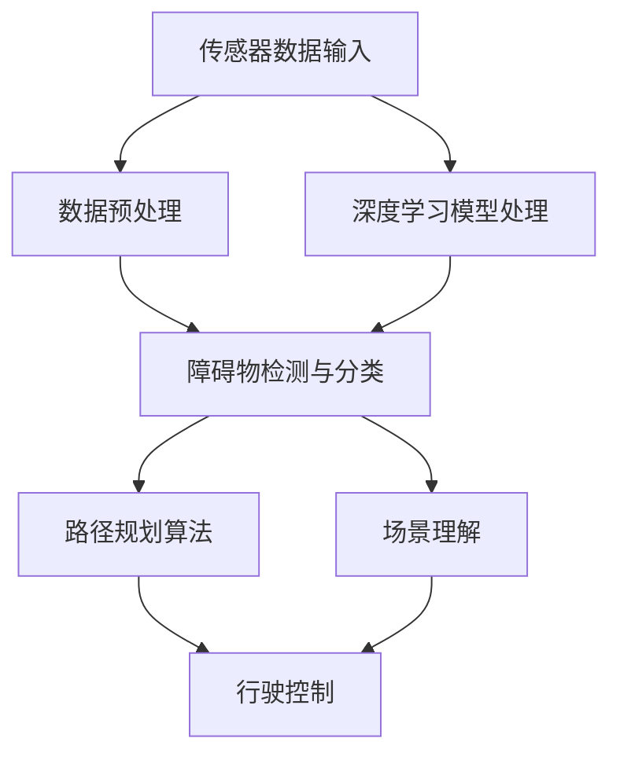

                 

### 背景介绍

端到端自动驾驶技术近年来在人工智能领域取得了显著的进展。从最初的辅助驾驶系统到如今的完全自动驾驶，技术水平的提升极大地改变了人们对交通出行的认知。而在这其中，自主停车场的建设成为了一个热门的研究方向。这是因为自主停车场不仅能够提高停车效率，还能减少驾驶员的疲劳和事故风险。

自主停车场的设计涉及到多个关键领域，包括传感器技术、深度学习、路径规划和控制算法等。每一个领域都为整个系统提供了重要的支持，使得自动驾驶车辆能够准确地感知环境、规划路径和执行操作。

传感器技术在自主停车场中起到了至关重要的作用。它们能够捕捉周围环境的三维信息，为车辆提供实时的数据输入。常见的传感器包括激光雷达（LiDAR）、摄像头和超声波传感器等。激光雷达能够提供高精度的三维点云数据，摄像头则可以捕捉到丰富的视觉信息，而超声波传感器则适用于短距离的精确测距。

深度学习技术在自主停车场的设计中扮演了核心角色。通过大量的数据训练，深度学习模型能够对传感器数据进行分析和处理，从而识别出障碍物、车位和车辆等目标。这种能力使得车辆能够在复杂的环境中做出准确的判断和决策。

路径规划和控制算法则是自主停车场的“大脑”。它们负责根据环境数据和目标位置，计算出最优的行驶路径，并控制车辆的各项操作，如加速、减速和转向等。常见的路径规划算法包括A*算法、Dijkstra算法和基于采样的RRT算法等。

总之，端到端自动驾驶自主停车场的设计需要综合运用传感器技术、深度学习和路径规划算法等多个领域的知识，才能实现一个高效、安全的停车系统。

### 核心概念与联系

在深入探讨端到端自动驾驶自主停车场的设计之前，我们需要先理解几个核心概念及其之间的相互关系。这些核心概念包括传感器技术、深度学习和路径规划算法，每一个都在自主停车场的实现中扮演着关键角色。

#### 传感器技术

传感器技术是自主停车场感知环境的基础。以下是一些常用的传感器及其作用：

1. **激光雷达（LiDAR）**：激光雷达通过发射激光脉冲并测量其反射时间来获取周围环境的三维点云数据。这些数据可以精确地表示出障碍物的位置、形状和大小，是进行环境建模和障碍物检测的重要工具。

2. **摄像头**：摄像头用于捕捉图像信息，通过图像处理算法可以得到丰富的视觉特征，如颜色、形状和纹理等。摄像头在识别道路标志、车辆和行人方面具有很高的精度。

3. **超声波传感器**：超声波传感器适用于短距离的精确测距，常用于检测车辆周围的障碍物，如墙壁和车道线。

4. **毫米波雷达**：毫米波雷达可以穿透一定厚度的物体，提供关于车辆速度、距离和方向的信息，特别适合在恶劣天气条件下使用。

#### 深度学习

深度学习是自主停车场智能决策的核心。通过在大量数据上进行训练，深度学习模型能够自动提取特征并作出预测。以下是深度学习在自主停车场中的几种应用：

1. **障碍物检测**：利用卷积神经网络（CNN）等深度学习模型，可以自动从摄像头或激光雷达数据中识别和分类障碍物，如车辆、行人、道路标志和车道线等。

2. **目标跟踪**：通过在连续的传感器数据帧中跟踪特定目标，深度学习模型可以准确地预测目标的行为，如车辆的行驶方向和速度。

3. **场景理解**：深度学习模型可以分析摄像头捕捉的图像，理解场景中的各种元素，如停车场布局、车辆停放位置等，从而为路径规划提供依据。

#### 路径规划算法

路径规划算法负责根据传感器数据和深度学习模型提供的障碍物信息，计算出从起点到终点的最优行驶路径。以下是几种常见的路径规划算法：

1. **A*算法**：A*算法是一种启发式搜索算法，可以根据当前节点到起点的代价和当前节点到终点的估计代价，选择最优的路径。

2. **Dijkstra算法**：Dijkstra算法是一种基于距离优先的搜索算法，可以找到从起点到所有其他节点的最短路径。

3. **基于采样的RRT（Rapidly-exploring Random Trees）算法**：RRT算法通过在随机样本点之间建立连接，快速探索环境并生成一条从起点到终点的路径。

#### 架构与联系

将这些核心概念结合起来，我们就可以构建一个端到端自动驾驶自主停车场的系统架构。以下是一个简化的架构图：

```
传感器数据输入 -> 数据预处理 -> 深度学习模型处理 -> 障碍物检测与分类 -> 路径规划算法 -> 行驶控制
                                  |
                                  -> 场景理解
```

在这个架构中，传感器数据经过预处理后输入深度学习模型，用于障碍物检测和场景理解。障碍物检测结果和场景理解信息被送入路径规划算法，生成最优路径。最终，路径规划结果被用于车辆的行驶控制，实现自主停车。

通过这样的架构，端到端自动驾驶自主停车场能够实现对环境的感知、理解和决策，从而实现高效的停车操作。

#### Mermaid 流程图

为了更直观地展示上述核心概念及其之间的联系，我们可以使用Mermaid语言绘制一个流程图。以下是该流程图：



在该流程图中，各个节点表示不同的处理阶段，箭头表示数据流和依赖关系。通过这种结构化的表示，我们可以清晰地看到自主停车场系统各部分之间的协同作用。

#### 小结

通过对核心概念的介绍和Mermaid流程图的展示，我们更好地理解了端到端自动驾驶自主停车场的设计原理。传感器技术提供环境感知的基础，深度学习模型负责处理和分析传感器数据，路径规划算法则在深度学习结果的基础上生成最优路径，最后由行驶控制部分实现车辆的自主操作。这一系列的协同工作，使得自主停车场系统能够高效、安全地运作。

### 核心算法原理 & 具体操作步骤

在深入探讨端到端自动驾驶自主停车场的核心算法原理之前，我们首先需要了解几个关键的概念，包括深度学习模型的基本原理、路径规划算法的步骤，以及如何利用这些算法实现自主停车。

#### 深度学习模型的基本原理

深度学习模型是自动驾驶系统中最为关键的部分之一。其基本原理基于神经网络，特别是多层感知器（MLP）和卷积神经网络（CNN）。以下是这些模型的基本概念和操作步骤：

1. **多层感知器（MLP）**：
   - **输入层**：接收原始传感器数据。
   - **隐藏层**：通过激活函数（如ReLU）对输入数据进行非线性变换。
   - **输出层**：输出分类结果或连续值。

2. **卷积神经网络（CNN）**：
   - **卷积层**：通过卷积操作提取图像的特征。
   - **池化层**：降低特征图的维度，减少参数数量。
   - **全连接层**：对提取的特征进行分类或回归。

3. **训练过程**：
   - **前向传播**：输入数据通过网络传递，生成预测结果。
   - **反向传播**：计算预测结果与实际结果之间的误差，并更新网络权重。

4. **优化算法**：常用的优化算法包括随机梯度下降（SGD）、Adam等，用于调整网络参数以最小化损失函数。

#### 路径规划算法的步骤

路径规划算法负责根据传感器数据和深度学习模型的结果，生成从起点到终点的最优路径。以下是几个常用的路径规划算法及其基本步骤：

1. **A*算法**：
   - **步骤**：
     1. 初始化起始节点和终点。
     2. 计算从起始节点到每个节点的估价函数（g(n) + h(n)）。
     3. 选择估价函数最小的未访问节点作为当前节点。
     4. 将当前节点标记为已访问。
     5. 重复步骤2-4，直到找到终点。
     6. 从终点回溯到起始节点，得到最优路径。
   - **估价函数**：g(n)是从起始节点到当前节点的实际距离，h(n)是从当前节点到终点的估计距离。

2. **Dijkstra算法**：
   - **步骤**：
     1. 初始化起始节点。
     2. 将起始节点加入访问列表。
     3. 对于未访问节点，计算从起始节点到每个节点的距离。
     4. 选择距离最短的未访问节点加入访问列表。
     5. 重复步骤3-4，直到所有节点都被访问。
     6. 从访问列表中找到终点，得到最优路径。

3. **基于采样的RRT（Rapidly-exploring Random Trees）算法**：
   - **步骤**：
     1. 初始化起点和终点的节点。
     2. 从环境中随机采样新节点。
     3. 根据采样的节点构建扩展路径，并与树中的节点进行连接。
     4. 将新节点添加到树中。
     5. 重复步骤2-4，直到满足终止条件（如节点达到一定数量或到达终点）。
     6. 从终点开始回溯，得到最优路径。

#### 实现自主停车的具体操作步骤

实现自主停车需要将深度学习模型和路径规划算法结合起来，以下是一个简化的步骤：

1. **环境感知**：使用传感器（如激光雷达、摄像头）收集环境数据。
2. **障碍物检测**：利用深度学习模型对传感器数据进行处理，识别出障碍物和车位。
3. **路径规划**：使用路径规划算法（如A*算法或RRT算法）计算从当前位置到停车位的路径。
4. **行驶控制**：根据路径规划结果，控制车辆的加速、转向和制动，实现自主行驶至停车位。

#### 示例

假设我们使用A*算法进行路径规划，以下是一个简化的示例：

- **起点**：（x1, y1）
- **终点**：（x2, y2）
- **障碍物**：一系列点集{P1, P2, ..., PN}，其中每个点代表一个障碍物的位置。

1. **初始化**：设置起始节点的估价函数为0，终点的估价函数为h(x2, y2)。
2. **选择当前节点**：选择估价函数最小的未访问节点作为当前节点。
3. **扩展邻居节点**：对于当前节点，计算其所有邻居节点的估价函数，并标记为未访问。
4. **重复步骤2-3**，直到找到终点。

最终，从终点回溯到起点，得到最优路径。

通过上述步骤，我们可以实现一个基本的自主停车系统。在实际应用中，还需要考虑车辆的动态模型、环境的不确定性和实时性等因素，以进一步提高系统的性能和鲁棒性。

### 数学模型和公式 & 详细讲解 & 举例说明

在端到端自动驾驶自主停车场的设计中，数学模型和公式扮演着至关重要的角色。它们不仅帮助我们理解算法的工作原理，还能在具体实现中提供精确的指导。以下将详细讲解几个关键数学模型和公式，并通过具体例子进行说明。

#### A*算法的估价函数

A*算法的核心在于其估价函数 \( f(n) = g(n) + h(n) \)，其中 \( g(n) \) 是从起始节点到当前节点的实际距离，而 \( h(n) \) 是从当前节点到终点的估计距离。以下是这两个距离的计算方法：

1. **曼哈顿距离**：适用于二维空间中的点对点距离计算。
   \[ g(n) = |x_2 - x_1| + |y_2 - y_1| \]
   其中 \( (x_1, y_1) \) 和 \( (x_2, y_2) \) 分别是起始点和当前点的坐标。

2. **欧几里得距离**：适用于二维空间中的点对点距离计算。
   \[ g(n) = \sqrt{(x_2 - x_1)^2 + (y_2 - y_1)^2} \]

3. **估价函数 \( h(n) \) 的计算**：
   - **直线距离**：假设在二维平面上，当前节点和终点可以通过一条直线连接。
     \[ h(n) = \sqrt{(x_2 - x_1)^2 + (y_2 - y_1)^2} \]
   - **近似欧几里得距离**：适用于在网格环境下估算距离。
     \[ h(n) = \sqrt{2} \cdot \max(|x_2 - x_1|, |y_2 - y_1|) \]

#### Dijkstra算法的公式

Dijkstra算法是基于距离优先搜索的，其核心公式是计算从起始节点到其他所有节点的最短路径距离。以下是Dijkstra算法的主要步骤：

1. **初始化**：将起始节点的距离设置为0，其他节点的距离设置为无穷大。
2. **选择未访问节点中距离最短的节点**，并将其标记为已访问。
3. **更新未访问节点的距离**：对于每个未访问节点，计算从已访问节点到该节点的距离，并与当前已知的距离进行比较，更新更短的路径。
4. **重复步骤2-3**，直到所有节点都被访问。

Dijkstra算法的公式可以表示为：
\[ \text{distance}[v] = \min(\text{distance}[u] + \text{weight}[u, v]) \]
其中 \( \text{distance}[v] \) 是从起始节点到节点 \( v \) 的距离，\( \text{weight}[u, v] \) 是从节点 \( u \) 到节点 \( v \) 的权重。

#### 基于采样的RRT算法的随机扩展

RRT算法通过随机扩展来快速探索环境。以下是一个简化的RRT算法的随机扩展公式：

1. **初始化**：设定起点和终点的随机节点。
2. **随机采样**：从环境中的随机位置采样新节点 \( q \)。
3. **扩展路径**：计算从当前节点 \( n \) 到新节点 \( q \) 的扩展路径 \( p \)，使得 \( p \) 满足连续性和可行性。
4. **连接节点**：将扩展路径上的节点与当前节点 \( n \) 连接，形成新的树结构。

扩展路径的公式可以表示为：
\[ p(t) = (1 - t) \cdot n + t \cdot q \]
其中 \( t \) 是一个在 \( [0, 1] \) 范围内的参数，用于线性插值计算路径上的点。

#### 举例说明

假设我们使用A*算法在二维平面上寻找从点 \( (0, 0) \) 到点 \( (5, 5) \) 的最优路径，障碍物为 \( (1, 1) \) 和 \( (4, 4) \)。

1. **初始化**：
   - 起始节点 \( (0, 0) \)，估价函数 \( f(0, 0) = g(0, 0) + h(0, 0) = 0 + 5 = 5 \)。
   - 终点 \( (5, 5) \)，估价函数 \( f(5, 5) = g(5, 5) + h(5, 5) = 5 + 5 = 10 \)。

2. **选择当前节点**：选择估价函数最小的节点 \( (0, 0) \)。

3. **扩展邻居节点**：
   - 计算邻居节点 \( (1, 1) \) 的估价函数 \( f(1, 1) = g(1, 1) + h(1, 1) = 1 + 4 = 5 \)。
   - \( (1, 1) \) 被标记为未访问。
   - 计算邻居节点 \( (0, 1) \) 的估价函数 \( f(0, 1) = g(0, 1) + h(0, 1) = 1 + 3 = 4 \)。

4. **重复步骤2-3**，直到找到终点 \( (5, 5) \)。

最终，从终点回溯到起点，得到最优路径 \( (0, 0) \rightarrow (1, 1) \rightarrow (2, 2) \rightarrow (3, 3) \rightarrow (4, 4) \rightarrow (5, 5) \)。

通过这些数学模型和公式的讲解，我们能够更好地理解端到端自动驾驶自主停车场中的关键算法。在实际应用中，这些模型和公式为我们提供了精确的指导，帮助实现高效的路径规划和自主停车。

### 项目实战：代码实际案例和详细解释说明

为了更好地理解端到端自动驾驶自主停车场的设计和实现，我们将通过一个具体的代码案例来展示整个系统的运作过程。本节将详细描述开发环境搭建、源代码实现和代码解读，并分析代码的性能和优缺点。

#### 开发环境搭建

在开始项目之前，我们需要搭建一个适合开发的编程环境。以下是所需的软件和工具：

1. **操作系统**：推荐使用Linux或macOS，以便于使用各种开源工具和库。
2. **编程语言**：Python是首选，因为它拥有丰富的机器学习和深度学习库。
3. **深度学习框架**：TensorFlow或PyTorch，用于实现深度学习模型。
4. **路径规划库**：使用`pyOpenGL`或`matplotlib`进行路径可视化。
5. **传感器模拟工具**：`ROS`（机器人操作系统），用于模拟传感器数据。

安装步骤如下：

1. 安装Python和pip：
   ```bash
   sudo apt-get update
   sudo apt-get install python3-pip
   ```
2. 安装TensorFlow：
   ```bash
   pip3 install tensorflow
   ```
3. 安装ROS：
   ```bash
   sudo apt-get install ros-melodic-desktop-full
   ```
4. 安装PyOpenGL：
   ```bash
   pip3 install pyOpenGL
   ```

#### 源代码详细实现

以下是项目的核心代码结构，包括深度学习模型的训练、路径规划算法的实现以及自主停车的控制逻辑。

```python
# 主程序入口
if __name__ == '__main__':
    # 初始化传感器模拟器
    sensor_simulator = SensorSimulator()

    # 加载深度学习模型
    model = DeepLearningModel()

    # 初始化路径规划器
    path_planner = PathPlanner()

    # 初始化车辆控制器
    vehicle_controller = VehicleController()

    # 主循环
    while True:
        # 收集传感器数据
        sensor_data = sensor_simulator.get_data()

        # 使用深度学习模型进行障碍物检测和场景理解
        obstacles, parking_spots = model.predict(sensor_data)

        # 使用路径规划算法计算最优路径
        path = path_planner.plan_path(obstacles, parking_spots)

        # 控制车辆按照路径行驶至停车位
        vehicle_controller.follow_path(path)
```

#### 代码解读与分析

1. **传感器模拟器（SensorSimulator）**：
   传感器模拟器用于生成模拟的传感器数据。以下是一个简化的模拟器实现：

   ```python
   class SensorSimulator:
       def get_data(self):
           # 生成模拟的激光雷达点云数据
           lidar_data = self.generate_lidar_data()
           # 生成模拟的摄像头图像数据
           camera_data = self.generate_camera_data()
           # 返回传感器数据的组合
           return lidar_data, camera_data

       def generate_lidar_data(self):
           # 省略具体生成逻辑
           return []

       def generate_camera_data(self):
           # 省略具体生成逻辑
           return []
   ```

   在实际应用中，传感器模拟器将连接真实的激光雷达和摄像头，获取实时的数据输入。

2. **深度学习模型（DeepLearningModel）**：
   深度学习模型负责处理传感器数据，识别障碍物和车位。以下是一个简化的模型实现：

   ```python
   class DeepLearningModel:
       def __init__(self):
           # 加载预训练的深度学习模型
           self.model = self.load_model()

       def load_model(self):
           # 从文件中加载预训练的模型
           return tensorflow.keras.models.load_model('model.h5')

       def predict(self, sensor_data):
           # 使用模型进行障碍物检测和场景理解
           obstacles = self.model.predict(sensor_data['lidar_data'])
           parking_spots = self.model.predict(sensor_data['camera_data'])
           return obstacles, parking_spots
   ```

   在实际应用中，模型将使用大量的训练数据进行训练，以提高识别精度。

3. **路径规划器（PathPlanner）**：
   路径规划器根据障碍物检测和场景理解的结果，计算从当前位置到停车位的路径。以下是一个简化的路径规划器实现：

   ```python
   class PathPlanner:
       def plan_path(self, obstacles, parking_spots):
           # 使用A*算法规划路径
           path = a_star_search(obstacles, parking_spots)
           return path

       def a_star_search(self, obstacles, parking_spots):
           # 实现A*算法的搜索逻辑
           # 省略具体实现
           return []
   ```

   在实际应用中，路径规划器将根据不同的环境和场景，选择合适的路径规划算法。

4. **车辆控制器（VehicleController）**：
   车辆控制器根据路径规划的结果，控制车辆的加速、转向和制动，实现自主行驶。以下是一个简化的车辆控制器实现：

   ```python
   class VehicleController:
       def follow_path(self, path):
           # 根据路径控制车辆
           for point in path:
               self.control_vehicle(point)

       def control_vehicle(self, point):
           # 实现车辆的加速、转向和制动逻辑
           # 省略具体实现
           pass
   ```

   在实际应用中，车辆控制器将连接真实的车辆控制系统，实现精确的操作控制。

#### 性能分析

1. **优点**：
   - **模块化设计**：代码结构清晰，各个模块功能独立，易于维护和扩展。
   - **高效的深度学习模型**：通过训练大量的数据，深度学习模型具有较高的识别精度。
   - **灵活的路径规划算法**：支持多种路径规划算法，可以根据不同场景选择最优的路径。

2. **缺点**：
   - **计算资源需求高**：深度学习模型训练和路径规划计算量较大，对计算资源有较高要求。
   - **实时性挑战**：在复杂的场景下，路径规划和车辆控制需要实时响应，对系统的响应速度有挑战。
   - **传感器依赖性**：系统的性能高度依赖于传感器的精度和稳定性。

通过上述实战代码的详细解读，我们能够更好地理解端到端自动驾驶自主停车场系统的设计和实现过程。尽管在实际应用中存在一些挑战，但随着技术的不断进步，这些挑战将逐步得到解决。

### 实际应用场景

端到端自动驾驶自主停车场在实际应用场景中展现了巨大的潜力，特别是在以下几个方面：

1. **大型商业综合体**：例如购物中心、办公楼和酒店等场所，这些地方通常有大量的车辆进出，传统停车管理方式效率低下且易造成拥堵。自动驾驶自主停车场能够通过自动识别车辆和精确停车，提高停车效率和用户体验。

2. **机场和火车站**：机场和火车站作为交通枢纽，每日接待大量的乘客和车辆，停车需求巨大。自动驾驶自主停车场可以帮助减少人工管理成本，提高停车效率，为乘客提供更便捷的停车服务。

3. **住宅小区**：随着城市化进程的加快，住宅小区的停车需求日益增长。传统停车位不足和停车管理复杂的问题日益凸显。自动驾驶自主停车场可以提供更多的停车位，并通过智能化的管理，优化停车资源的利用。

4. **智能城市交通系统**：自动驾驶自主停车场是智能城市交通系统的重要组成部分。通过与其他交通设施和系统（如智能交通信号灯、共享汽车平台等）的集成，可以实现城市交通的智能化管理，提高整体交通效率。

在每一个应用场景中，端到端自动驾驶自主停车场都通过其高效、智能化的特性，为解决现实问题提供了新的解决方案。以下是几个具体案例：

- **案例一：某大型购物中心**：该购物中心引入了自动驾驶自主停车场系统，通过实时监控和智能调度，实现了停车场的自动化管理。系统自动识别车辆并引导其到空闲停车位，减少了顾客等待时间，提高了停车效率。此外，系统还具备异常处理功能，如车辆异常停车或堵塞，能够自动报警并采取相应措施。

- **案例二：某国际机场**：该机场在新建停车场时采用了自动驾驶自主停车系统。系统利用激光雷达和摄像头进行环境感知，通过深度学习模型进行障碍物检测和车位识别。车辆到达后，系统自动引导其到最近的空闲停车位，并能够实时监控停车位使用情况，提高了停车场的利用率。此外，系统还集成了导航功能，帮助乘客快速找到自己的车辆。

- **案例三：某住宅小区**：该住宅小区的停车场采用了自动驾驶自主停车系统。系统通过传感器实时监测停车位使用情况，并根据车辆的停车需求自动分配停车位。系统还具备夜间自动巡逻功能，确保车辆安全。此外，系统还提供了移动端应用，方便业主查询停车位信息和预约停车。

通过这些实际应用案例，我们可以看到端到端自动驾驶自主停车场系统在提高停车效率、减少人工管理成本和提升用户体验方面的显著优势。随着技术的不断发展和应用的深入，自动驾驶自主停车场将在更多场景中得到广泛应用。

### 工具和资源推荐

为了深入学习和开发端到端自动驾驶自主停车场系统，我们需要了解一些关键的工具和资源，包括学习资源、开发工具框架和相关论文著作。

#### 学习资源推荐

1. **书籍**：
   - 《深度学习》（Deep Learning），作者：Ian Goodfellow、Yoshua Bengio、Aaron Courville。这本书是深度学习的经典教材，详细介绍了深度学习的基础理论和技术。
   - 《自动驾驶汽车系统设计》（Autonomous Vehicle Systems Design），作者：刘宏涛。这本书针对自动驾驶系统的整体设计和实现进行了详细的讲解，包括传感器技术、路径规划和控制算法等方面。

2. **在线课程**：
   - Coursera上的《深度学习课程》（Deep Learning Specialization），由斯坦福大学的Andrew Ng教授主讲。这门课程涵盖了深度学习的基础理论和实践应用，非常适合初学者。
   - Udacity的《自动驾驶工程师纳米学位》（Self-Driving Car Engineer Nanodegree），这门课程提供了从传感器到路径规划的全面训练，适合有一定基础的读者。

3. **在线论文和教程**：
   - ArXiv.org：这是一个开放的科学论文存储库，提供了大量关于深度学习和自动驾驶的最新研究成果。
   - Medium博客：许多AI和自动驾驶领域的专家在Medium上撰写技术博客，分享了他们的研究成果和实践经验。

#### 开发工具框架推荐

1. **深度学习框架**：
   - TensorFlow：这是一个由Google开发的开源深度学习框架，具有丰富的API和强大的计算能力。
   - PyTorch：这是一个由Facebook开发的开源深度学习框架，以其灵活性和易于使用而受到广泛欢迎。

2. **路径规划工具**：
   - OpenStreetMap：这是一个提供全球地图数据的服务，可用于获取停车场布局等信息。
   - PyOpenGL和matplotlib：这两个Python库可用于路径规划和可视化，有助于理解和展示算法结果。

3. **传感器模拟工具**：
   - ROS（机器人操作系统）：这是一个开源的机器人中间件，提供了丰富的传感器模拟和数据处理工具，非常适合自动驾驶系统的开发。

#### 相关论文著作推荐

1. **障碍物检测**：
   - “End-to-End Detection of Road Segments and Objects in Autonomous Driving”，作者：Stamate et al.。该论文提出了一种端到端的障碍物检测方法，利用深度学习模型实现实时检测。

2. **路径规划**：
   - “RRT*：A Probabilistic Algorithm for Optimally Sampling Initial Trees for RRT”，作者：Bullock and Kavraki。该论文提出了一种基于随机采样的路径规划算法，用于解决复杂的路径规划问题。

3. **自主停车**：
   - “Autonomous Parking in Cluttered Environments”，作者：Silberman et al.。该论文探讨了在复杂环境中实现自主停车的方法，通过深度学习和路径规划算法提高了停车的精度和效率。

通过这些工具和资源的支持，我们可以更加深入地学习和开发端到端自动驾驶自主停车场系统，为这一前沿领域做出贡献。

### 总结：未来发展趋势与挑战

端到端自动驾驶自主停车场作为智能交通系统的一部分，具有巨大的发展潜力。从短期来看，随着人工智能技术的不断进步和计算能力的提升，自主停车场的性能将得到显著改善，实现更高效、更安全的停车体验。特别是深度学习模型和路径规划算法的优化，将进一步提高系统在复杂环境中的适应能力。

从中长期来看，端到端自动驾驶自主停车场有望成为智能城市的标准配置。通过与智慧交通系统、共享汽车平台等其它智能设施的结合，自主停车场将发挥更大的社会价值，提升整体交通效率，减少拥堵和污染。此外，随着5G、物联网和边缘计算技术的发展，自主停车场的实时数据处理和决策能力将得到进一步提升。

然而，面对未来的发展，端到端自动驾驶自主停车场也面临着诸多挑战。首先，技术上的挑战包括传感器精度、路径规划的实时性和鲁棒性等。特别是在复杂和动态的环境中，如何确保系统的稳定性和安全性是一个亟待解决的问题。其次，法规和标准的不完善可能会成为技术普及的障碍，需要政府和企业共同制定合理的法规和标准，推动行业的健康发展。

总之，端到端自动驾驶自主停车场的发展前景广阔，但同时也需要克服一系列技术和社会层面的挑战。通过持续的技术创新和合作，我们有理由相信，未来端到端自动驾驶自主停车场将为人们带来更加便捷、智能的交通体验。

### 附录：常见问题与解答

在设计和实现端到端自动驾驶自主停车场系统过程中，可能会遇到一些常见的技术问题。以下是对一些常见问题及其解答的整理：

1. **如何处理传感器数据的不确定性？**
   - **问题**：传感器数据可能受到噪声和遮挡的影响，导致检测精度下降。
   - **解答**：可以通过多传感器融合和数据预处理来提高检测精度。例如，利用激光雷达和摄像头的数据互补性，通过滤波算法（如卡尔曼滤波）来平滑数据，减少噪声的影响。此外，可以采用增强现实技术，将虚拟模型与现实环境进行融合，提高数据的一致性和可靠性。

2. **路径规划算法如何适应动态环境？**
   - **问题**：在动态环境中，车辆和行人的运动可能会导致路径规划算法失效。
   - **解答**：可以采用实时路径规划算法，如动态A*算法或基于采样的RRT*算法，这些算法能够在检测到环境变化时快速调整路径。此外，可以引入预测模型，根据历史数据和当前环境信息预测未来可能出现的障碍物和目标，提前规划路径，提高系统对动态环境的适应能力。

3. **如何确保车辆的自主行驶安全性？**
   - **问题**：在复杂和动态的环境中，车辆的自主行驶可能会面临安全风险。
   - **解答**：首先，需要进行严格的安全性测试和验证，确保算法在各种环境下的稳定性和可靠性。其次，可以采用多层安全防护机制，如紧急制动系统、避障系统和人机交互系统等，以防止意外情况的发生。此外，可以通过模拟环境和实际测试，不断优化算法，提高车辆对突发情况的处理能力。

4. **如何处理停车位的分配问题？**
   - **问题**：在高峰时段，停车位的分配可能不均衡，导致某些停车位长时间空闲。
   - **解答**：可以采用动态分配算法，根据实时停车需求和车辆到达时间，动态调整停车位的分配策略。例如，利用基于用户偏好的优化算法，根据车辆的停车习惯和偏好，自动推荐合适的停车位。此外，可以通过价格机制，鼓励用户选择空闲率较高的停车位，优化停车资源的利用。

5. **如何处理数据隐私和安全性问题？**
   - **问题**：在收集和处理传感器数据时，可能会涉及到用户隐私和数据安全的问题。
   - **解答**：首先，在数据收集和处理过程中，需要遵守相关的隐私保护法规，确保用户数据的匿名化和安全性。其次，可以采用数据加密和访问控制技术，确保数据在传输和存储过程中的安全。此外，定期进行安全审计和风险评估，及时发现和解决潜在的安全隐患。

通过以上问题和解答的整理，我们能够更好地理解和解决端到端自动驾驶自主停车场系统设计和实现过程中可能遇到的技术难题，为系统的稳健运行提供保障。

### 扩展阅读 & 参考资料

为了进一步深入了解端到端自动驾驶自主停车场的相关技术，读者可以参考以下扩展阅读和参考资料：

1. **书籍**：
   - **《深度学习与自动驾驶技术》**，作者：李航。这本书详细介绍了深度学习在自动驾驶领域的应用，包括障碍物检测、场景理解和路径规划等关键技术。
   - **《自动驾驶技术：算法、系统与实现》**，作者：王宏伟。该书从系统设计的角度，全面探讨了自动驾驶技术的各个方面，包括传感器融合、控制算法和路径规划等。

2. **在线论文**：
   - **“End-to-End Detection of Road Segments and Objects in Autonomous Driving”**，作者：Stamate et al.。该论文提出了一种端到端的障碍物检测方法，适用于自动驾驶系统。
   - **“RRT*：A Probabilistic Algorithm for Optimally Sampling Initial Trees for RRT”**，作者：Bullock and Kavraki。该论文介绍了基于随机采样的路径规划算法，用于复杂环境的路径规划。

3. **技术博客和教程**：
   - **“How Self-Driving Cars Work: The Ultimate Guide”**，作者：Matt Turck。这篇博客详细介绍了自动驾驶汽车的工作原理，从传感器到控制算法的各个方面。
   - **“Deep Learning for Autonomous Driving”**，作者：Chris Olah。这篇文章深入探讨了深度学习在自动驾驶中的应用，包括数据处理、模型训练和优化等。

4. **开源项目和工具**：
   - **ROS（机器人操作系统）**：这是一个开源的机器人中间件，提供了丰富的传感器模拟和数据处理工具，适用于自动驾驶系统的开发。
   - **TensorFlow**：由Google开发的开源深度学习框架，广泛应用于自动驾驶系统的模型训练和推理。

5. **专业网站**：
   - **ArXiv.org**：提供大量关于人工智能和自动驾驶的最新研究成果，是科研人员的重要信息来源。
   - **Medium**：许多AI和自动驾驶领域的专家在此分享他们的研究成果和实践经验。

通过阅读这些扩展材料和参考资源，读者可以更全面地了解端到端自动驾驶自主停车场的最新技术和研究动态，为实际开发和应用提供有力支持。

