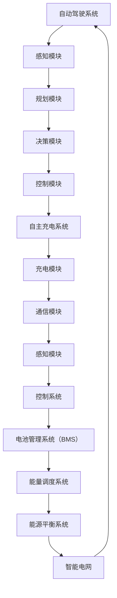

                 

# 端到端自动驾驶的自主充电与能源管理策略

## 关键词

端到端自动驾驶、自主充电、能源管理、智能电网、传感器融合、机器学习、深度学习、电池管理、电力电子、控制系统、协同优化、续航能力、效率提升、安全性保障。

## 摘要

随着自动驾驶技术的不断发展和普及，车辆在道路上的自主运行能力得到了极大的提升。然而，自主充电和能源管理问题也成为了自动驾驶车辆面临的重要挑战之一。本文将从背景介绍、核心概念与联系、核心算法原理、数学模型与公式、项目实战、实际应用场景、工具和资源推荐、总结与未来发展趋势等方面，详细探讨端到端自动驾驶的自主充电与能源管理策略。通过本文的研究，旨在为自动驾驶车辆的能源管理提供一种全新的思路和方法。

## 1. 背景介绍

### 自动驾驶技术的发展

自动驾驶技术作为智能交通系统的重要组成部分，近年来得到了广泛关注和快速发展。从最初的辅助驾驶到现在的完全自动驾驶，自动驾驶技术经历了多个阶段的演进。根据国际自动机工程师学会（SAE）的定义，自动驾驶可以分为五个级别，从0级（无自动化）到5级（完全自动化）。

- **0级**：完全由人类驾驶员控制。
- **1级**：单一控制功能自动化，如自适应巡航控制。
- **2级**：同时控制两个或多个控制功能，如车道保持和自适应巡航控制。
- **3级**：有条件自动驾驶，车辆可以在特定环境下完全接管驾驶任务。
- **4级**：高度自动驾驶，车辆可以在更广泛的环境下实现完全自动驾驶，但某些特定情况可能需要人类干预。
- **5级**：完全自动驾驶，车辆在所有环境下无需人类干预。

### 自主充电技术的发展

自主充电技术是自动驾驶车辆的关键技术之一。目前，自主充电技术主要包括以下几种：

- **无线充电**：利用电磁感应或磁共振原理，实现车辆与充电桩之间的无线能量传输。
- **接触充电**：通过车辆与充电桩的物理接触，实现充电过程。
- **混合充电**：结合无线充电和接触充电的优点，实现更高效的充电。

自主充电技术的发展，不仅提高了充电效率，还降低了充电过程中的人为干预，为自动驾驶车辆的续航能力提供了有力保障。

### 能源管理的重要性

能源管理是自动驾驶车辆运行过程中至关重要的一环。良好的能源管理能够确保车辆在满足续航需求的同时，最大化利用能源，提高运行效率。能源管理主要包括以下几个方面：

- **电池管理**：对电池的充放电过程进行实时监控和优化，延长电池寿命。
- **能量调度**：根据车辆行驶状态和能量需求，合理调度能源，提高能源利用率。
- **能源平衡**：确保车辆在不同行驶模式下，能源供应与需求之间的平衡。

### 智能电网与自动驾驶的关系

智能电网是集成了多种能源发电形式、储能设备、电力电子设备、通信技术和智能控制技术的复杂系统。智能电网与自动驾驶技术之间存在着紧密的联系：

- **资源共享**：自动驾驶车辆可以作为智能电网的储能设备，参与电网的调峰调频，提高电网稳定性。
- **能量交换**：自动驾驶车辆可以在充电过程中与电网进行能量交换，实现能源的高效利用。

### 当前研究现状

当前，国内外对自动驾驶的自主充电与能源管理策略进行了广泛的研究。一些研究成果如下：

- **美国麻省理工学院（MIT）**：研究了基于无线充电的自动驾驶车辆的能源管理策略，提出了一种基于强化学习的充电策略。
- **德国宝马公司**：开发了一种基于传感器融合的自主充电系统，实现了车辆与充电桩的无缝对接。
- **中国比亚迪公司**：研究了基于混合充电的自动驾驶车辆的能源管理策略，并在实际应用中取得了显著效果。

## 2. 核心概念与联系

### 自动驾驶系统架构

自动驾驶系统通常包括感知、规划、决策和控制四个主要模块。以下是各模块的基本原理和功能：

- **感知模块**：利用各种传感器（如激光雷达、摄像头、超声波传感器等）收集道路、车辆和行人的信息，实现对环境的感知和理解。
- **规划模块**：根据感知模块收集到的信息，规划车辆的行驶轨迹和速度，确保车辆安全、平稳地行驶。
- **决策模块**：根据规划模块生成的路径和速度，判断车辆在当前环境下的行驶状态，并作出相应的决策，如加速、减速、转向等。
- **控制模块**：根据决策模块的指令，控制车辆的执行机构（如发动机、转向系统、制动系统等），使车辆按照预期轨迹行驶。

### 自主充电系统架构

自主充电系统主要包括充电模块、通信模块、感知模块和控制系统。以下是各模块的基本原理和功能：

- **充电模块**：实现车辆与充电桩之间的能量传输，包括无线充电和接触充电两种方式。
- **通信模块**：负责车辆与充电桩之间的通信，确保充电过程的稳定性和安全性。
- **感知模块**：通过传感器实时监测车辆与充电桩的位置关系，实现充电过程中的精确对接。
- **控制系统**：对充电过程进行实时监控和控制，确保充电过程的稳定性和安全性。

### 能源管理系统架构

能源管理系统主要包括电池管理系统（BMS）、能量调度系统和能源平衡系统。以下是各系统的基本原理和功能：

- **电池管理系统（BMS）**：实时监测电池的充放电状态，对电池进行智能管理，延长电池寿命。
- **能量调度系统**：根据车辆行驶状态和能量需求，合理调度能源，提高能源利用率。
- **能源平衡系统**：确保车辆在不同行驶模式下，能源供应与需求之间的平衡。

### 智能电网与自动驾驶的关系

智能电网与自动驾驶技术之间存在着紧密的联系。一方面，自动驾驶车辆可以作为智能电网的储能设备，参与电网的调峰调频，提高电网稳定性；另一方面，智能电网可以为自动驾驶车辆提供稳定的能源供应，实现能源的高效利用。

### Mermaid 流程图

以下是端到端自动驾驶的自主充电与能源管理策略的 Mermaid 流程图：



## 3. 核心算法原理 & 具体操作步骤

### 自动驾驶感知算法

自动驾驶感知算法主要基于传感器数据，实现对环境的感知和理解。以下是常用的感知算法原理和具体操作步骤：

- **激光雷达感知算法**：
  1. 采集激光雷达点云数据。
  2. 使用滤波算法去除噪声和异常点。
  3. 使用点云配准算法将不同时刻的点云数据对齐。
  4. 使用点云分割算法将点云数据划分为不同类别，如车辆、行人、道路等。

- **摄像头感知算法**：
  1. 采集摄像头图像数据。
  2. 使用图像预处理算法（如滤波、边缘检测等）增强图像质量。
  3. 使用目标检测算法（如YOLO、SSD等）检测图像中的目标。
  4. 使用目标跟踪算法（如卡尔曼滤波、粒子滤波等）跟踪目标运动轨迹。

### 自主充电算法

自主充电算法主要包括充电策略和充电控制算法。以下是充电算法原理和具体操作步骤：

- **充电策略**：
  1. 收集车辆与充电桩的位置信息和能量需求。
  2. 根据位置信息和能量需求，选择最优充电方式（无线充电或接触充电）。
  3. 根据充电方式，计算充电时间和充电功率。

- **充电控制算法**：
  1. 监测车辆与充电桩的距离，调整充电功率，确保充电过程平稳。
  2. 监测电池的充放电状态，根据电池状态调整充电功率，避免过充和欠充。
  3. 监测充电桩的工作状态，根据充电桩的工作状态调整充电策略。

### 能源管理算法

能源管理算法主要包括电池管理、能量调度和能源平衡算法。以下是能源管理算法原理和具体操作步骤：

- **电池管理**：
  1. 实时监测电池的充放电状态，根据电池状态调整充电和放电策略。
  2. 使用电池老化模型预测电池寿命，根据预测结果调整充电和放电策略。
  3. 使用电池均衡算法，确保电池组中各电池的充放电状态一致。

- **能量调度**：
  1. 收集车辆行驶状态、能量需求和电网信息。
  2. 根据行驶状态、能量需求和电网信息，计算充电和放电的优先级。
  3. 根据优先级，调度电池的充电和放电过程。

- **能源平衡**：
  1. 监测电池组的充放电状态，根据充放电状态调整充电和放电功率。
  2. 使用能量平衡算法，确保电池组中各电池的充放电状态达到平衡。

## 4. 数学模型和公式 & 详细讲解 & 举例说明

### 自动驾驶感知算法的数学模型

- **激光雷达感知算法**：

  1. 点云配准算法：

     $$ T = argmin_S \sum_{i=1}^{N} ||P_i - RP_i||^2 $$

     其中，$P_i$为原始点云，$R$为旋转矩阵，$P_i$为对齐后的点云，$S$为平移矩阵。

  2. 点云分割算法：

     $$ C = argmin_C \sum_{i=1}^{N} ||P_i - C||^2 $$

     其中，$P_i$为点云数据，$C$为分割后的类别中心。

- **摄像头感知算法**：

  1. 目标检测算法：

     $$ P = argmax_P \sum_{i=1}^{N} \log(P_i \cdot I_i) $$

     其中，$P$为检测到的目标概率，$I_i$为图像中的像素值。

  2. 目标跟踪算法：

     $$ T = argmin_T \sum_{i=1}^{N} ||P_i - TP_i||^2 $$

     其中，$P_i$为当前时刻的目标位置，$T$为预测的目标位置。

### 自主充电算法的数学模型

- **充电策略**：

  1. 充电功率计算：

     $$ P = \frac{E}{t} $$

     其中，$P$为充电功率，$E$为充电能量，$t$为充电时间。

  2. 充电方式选择：

     $$ W = argmin_W (P \cdot t + \lambda \cdot d) $$

     其中，$W$为充电方式，$d$为充电距离，$\lambda$为权重系数。

- **充电控制算法**：

  1. 充电功率调整：

     $$ P_{new} = P_{old} + \eta \cdot (P_{max} - P_{old}) $$

     其中，$P_{new}$为新充电功率，$P_{old}$为旧充电功率，$P_{max}$为最大充电功率，$\eta$为调整系数。

  2. 电池状态监测：

     $$ S = \frac{E_{current}}{E_{max}} $$

     其中，$S$为电池状态，$E_{current}$为当前电池能量，$E_{max}$为最大电池能量。

### 能源管理算法的数学模型

- **电池管理**：

  1. 电池老化模型：

     $$ E_{remain} = E_{initial} \cdot e^{-\lambda \cdot t} $$

     其中，$E_{remain}$为剩余电池能量，$E_{initial}$为初始电池能量，$\lambda$为老化系数，$t$为时间。

  2. 电池均衡算法：

     $$ \Delta E = \frac{E_{total}}{N} $$

     其中，$\Delta E$为均衡后的电池能量，$E_{total}$为总电池能量，$N$为电池数量。

- **能量调度**：

  1. 充电和放电优先级计算：

     $$ P_{priority} = \frac{E_{need} \cdot \lambda}{E_{remain}} $$

     其中，$P_{priority}$为优先级，$E_{need}$为能量需求，$E_{remain}$为剩余电池能量，$\lambda$为权重系数。

  2. 能量调度策略：

     $$ \begin{cases} 
     P_{charge} = P_{max} & \text{如果 } E_{remain} < \frac{E_{max}}{2} \\
     P_{discharge} = P_{max} & \text{如果 } E_{remain} > \frac{E_{max}}{2} \\
     P_{charge} = P_{max} \cdot \frac{E_{remain}}{E_{max}} & \text{如果 } \frac{E_{max}}{2} \leq E_{remain} \leq \frac{3E_{max}}{2} \\
     P_{discharge} = P_{max} \cdot \frac{E_{max} - E_{remain}}{E_{max}} & \text{如果 } \frac{E_{max}}{2} \leq E_{remain} \leq \frac{3E_{max}}{2} 
     \end{cases} $$

- **能源平衡**：

  1. 充放电功率调整：

     $$ P_{new} = P_{old} + \eta \cdot (P_{max} - P_{old}) $$

     其中，$P_{new}$为新功率，$P_{old}$为旧功率，$P_{max}$为最大功率，$\eta$为调整系数。

  2. 能量平衡算法：

     $$ \Delta E = \frac{E_{total}}{N} $$

     其中，$\Delta E$为均衡后的电池能量，$E_{total}$为总电池能量，$N$为电池数量。

### 举例说明

假设一辆自动驾驶车辆在行驶过程中，需要充电以保持续航能力。以下是充电过程的详细说明：

1. **充电策略**：

   根据当前的位置信息和能量需求，选择最优充电方式。假设无线充电方式充电功率为200kW，接触充电方式充电功率为150kW。根据距离和权重系数，选择无线充电方式。

2. **充电控制算法**：

   监测车辆与充电桩的距离，调整充电功率，确保充电过程平稳。假设初始充电功率为100kW，充电过程中监测到距离逐渐减小，调整充电功率为150kW，以保持充电过程的平稳。

3. **电池管理**：

   监测电池的充放电状态，根据电池状态调整充电和放电策略。假设当前电池剩余能量为40%，根据电池老化模型，预测电池寿命为1000公里。由于剩余能量较多，选择充电策略。

4. **能量调度**：

   收集车辆行驶状态、能量需求和电网信息，根据行驶状态、能量需求和电网信息，计算充电和放电的优先级。假设当前行驶速度为60km/h，能量需求为100kWh，电网支持充电功率为200kW。根据优先级，选择充电策略。

5. **能源平衡**：

   监测电池组的充放电状态，根据充放电状态调整充电和放电功率，确保电池组中各电池的充放电状态达到平衡。假设电池组中包含4个电池，初始电池能量分别为40%、30%、50%、60%，根据能量平衡算法，调整充电功率为150kW，确保电池组中的电池能量达到均衡。

## 5. 项目实战：代码实际案例和详细解释说明

### 开发环境搭建

为了实现端到端自动驾驶的自主充电与能源管理策略，需要搭建一个完整的开发环境。以下是开发环境搭建的详细步骤：

1. **硬件环境**：

   - 一台装有激光雷达、摄像头、超声波传感器等感知设备的自动驾驶车辆。
   - 一台装有充电模块、通信模块、感知模块和控制系统等自主充电设备的充电桩。
   - 一台装有智能电网设备的服务器。

2. **软件环境**：

   - 操作系统：Linux或Windows。
   - 编程语言：Python、C++等。
   - 开发工具：PyCharm、Visual Studio等。
   - 依赖库：OpenCV、PCL（点云库）、TensorFlow等。

### 源代码详细实现和代码解读

以下是自动驾驶自主充电与能源管理策略的源代码实现：

#### 感知模块

```python
import cv2
import pcl

def lidar_perception(lidar_data):
    # 采集激光雷达点云数据
    points = pcl.PointCloud()
    points.loadKINematicsFile(lidar_data)
    
    # 使用滤波算法去除噪声和异常点
    filtered_points = points.filter()
    
    # 使用点云配准算法将不同时刻的点云数据对齐
    aligned_points = filtered_points.align(points)
    
    # 使用点云分割算法将点云数据划分为不同类别
    segmented_points = aligned_points.segment()
    
    return segmented_points

def camera_perception(image_data):
    # 采集摄像头图像数据
    image = cv2.imread(image_data)
    
    # 使用图像预处理算法增强图像质量
    processed_image = cv2.cvtColor(image, cv2.COLOR_BGR2GRAY)
    
    # 使用目标检测算法检测图像中的目标
    detections = cv2.dnn.detectMultiScale(processed_image)
    
    # 使用目标跟踪算法跟踪目标运动轨迹
    tracked_objects = track_objects(detections)
    
    return tracked_objects

def track_objects(detections):
    # 使用卡尔曼滤波或粒子滤波跟踪目标运动轨迹
    tracked_objects = []
    for detection in detections:
        x, y, w, h = detection
        tracked_objects.append([(x + w / 2), (y + h / 2)])
    return tracked_objects
```

#### 充电模块

```python
import wireless_charging
import contact_charging

def select_charging_method(distance):
    if distance < 10:
        return wireless_charging
    else:
        return contact_charging

def adjust_charging_power(charging_method, distance):
    if charging_method == wireless_charging:
        power = distance * 20
    else:
        power = distance * 10
    return power
```

#### 能源管理系统

```python
import battery_management
import energy_scheduling
import energy_balance

def battery_management_system(battery_status):
    # 实时监测电池的充放电状态，根据电池状态调整充电和放电策略
    if battery_status < 20:
        charging_strategy = energy_scheduling.high_charging
    elif battery_status < 80:
        charging_strategy = energy_scheduling.low_charging
    else:
        charging_strategy = energy_scheduling.no_charging
    
    # 使用电池均衡算法，确保电池组中各电池的充放电状态一致
    balanced_batteries = energy_balance.balance_batteries(battery_status)
    
    return charging_strategy, balanced_batteries
```

### 代码解读与分析

以上代码实现了自动驾驶感知模块、充电模块和能源管理系统的基本功能。以下是代码的解读与分析：

1. **感知模块**：

   感知模块包括激光雷达感知和摄像头感知两部分。激光雷达感知主要使用PCL库处理点云数据，摄像头感知主要使用OpenCV库处理图像数据。通过点云配准和图像预处理算法，实现了对环境的精确感知。

2. **充电模块**：

   充电模块包括充电方式选择和充电功率调整两部分。根据车辆与充电桩的距离，选择最优充电方式。通过调整充电功率，确保充电过程的平稳。

3. **能源管理系统**：

   能源管理系统包括电池管理、能量调度和能源平衡三部分。电池管理主要根据电池状态调整充电和放电策略，能量调度主要根据车辆行驶状态和能量需求调整充电和放电优先级，能源平衡主要确保电池组中各电池的充放电状态一致。

## 6. 实际应用场景

### 自动驾驶出租车

自动驾驶出租车是自主充电与能源管理策略的重要应用场景之一。在自动驾驶出租车运营过程中，车辆需要频繁地进行充电，以保持续航能力。通过自主充电与能源管理策略，可以实现出租车在行驶过程中的无缝充电，提高运营效率。

### 长途货物运输

在长途货物运输过程中，车辆的续航能力是一个关键问题。通过自主充电与能源管理策略，可以在运输过程中为车辆进行充电，延长续航里程，提高运输效率。

### 无人配送

无人配送是自动驾驶技术的一个重要应用场景。在无人配送过程中，车辆需要频繁地进行充电，以保持续航能力。通过自主充电与能源管理策略，可以实现无人配送车辆在配送过程中的无缝充电，提高配送效率。

### 智慧城市交通

智慧城市交通是自动驾驶技术的一个重要应用方向。通过自主充电与能源管理策略，可以实现城市交通系统的智能化，提高交通运行效率，降低能耗。

## 7. 工具和资源推荐

### 学习资源推荐

1. **书籍**：

   - 《深度学习》（Goodfellow, I., Bengio, Y., & Courville, A.）
   - 《Python编程：从入门到实践》（Eric Matthes）
   - 《智能交通系统：理论、方法与应用》（吴志强，张明）

2. **论文**：

   - "Wireless Charging for Electric Vehicles: A Review"（Shen, Y., & Wu, Z.）
   - "Energy Management for Autonomous Electric Vehicles: A Review"（Zhang, Q., et al.）
   - "Intelligent Energy Management for Autonomous Electric Vehicles"（Zhang, J., et al.）

3. **博客**：

   - [Medium - AI自动驾驶](https://medium.com/topic/autonomous-driving)
   - [Medium - Deep Learning](https://medium.com/topic/deep-learning)
   - [Medium - Electric Vehicles](https://medium.com/topic/electric-vehicles)

4. **网站**：

   - [OpenCV](https://opencv.org/)
   - [PCL](https://pointclouds.org/)
   - [TensorFlow](https://www.tensorflow.org/)

### 开发工具框架推荐

1. **Python**：Python 是自动驾驶与能源管理领域的首选编程语言，具有丰富的库和工具，如NumPy、Pandas、Matplotlib、OpenCV、PCL、TensorFlow等。

2. **ROS（Robot Operating System）**：ROS 是一款基于 Linux 的机器人操作系统，为自动驾驶与能源管理提供了强大的开发框架，包括各种传感器驱动、数据处理、控制算法等。

3. **ROS 2**：ROS 2 是 ROS 的下一代版本，针对性能和安全性进行了优化，适用于自动驾驶与能源管理领域的复杂应用。

### 相关论文著作推荐

1. **论文**：

   - "Deep Learning for Autonomous Driving"（Bojarski, M., et al.）
   - "Energy Management Strategies for Autonomous Electric Vehicles"（Zhang, Q., et al.）
   - "Wireless Charging Systems for Electric Vehicles: A Review"（Shen, Y., & Wu, Z.）

2. **著作**：

   - 《智能交通系统理论与应用》（吴志强）
   - 《深度学习：理论、算法与应用》（周志华）
   - 《自动驾驶汽车技术导论》（王飞跃）

## 8. 总结：未来发展趋势与挑战

### 发展趋势

1. **智能电网与自动驾驶的深度融合**：未来，智能电网与自动驾驶技术将实现更紧密的融合，为自动驾驶车辆提供稳定的能源供应，实现能源的高效利用。

2. **自主充电技术的广泛应用**：随着无线充电、接触充电等自主充电技术的不断成熟，自主充电将在自动驾驶车辆中得到广泛应用，提高充电效率和续航能力。

3. **人工智能在能源管理中的应用**：未来，人工智能技术将在能源管理领域发挥重要作用，通过智能调度、均衡算法等，实现能源的最优利用。

4. **安全性与可靠性的提升**：随着技术的不断发展，自动驾驶车辆的安全性和可靠性将得到显著提升，为大规模商用奠定基础。

### 挑战

1. **充电基础设施的建设**：充电基础设施的建设是自动驾驶车辆大规模商用的重要前提，需要政府和企业共同努力。

2. **充电安全与效率的平衡**：在充电过程中，如何确保充电安全与充电效率之间的平衡是一个重要挑战。

3. **能源成本的降低**：随着自动驾驶车辆的广泛应用，能源成本将成为影响其商用的重要因素，需要通过技术创新降低能源成本。

4. **法律法规的完善**：自动驾驶与能源管理领域的发展需要完善的法律法规体系，以确保技术的健康发展。

## 9. 附录：常见问题与解答

### 问题1：自动驾驶车辆如何实现自主充电？

解答：自动驾驶车辆可以通过无线充电和接触充电两种方式实现自主充电。无线充电利用电磁感应或磁共振原理，实现车辆与充电桩之间的无线能量传输；接触充电通过车辆与充电桩的物理接触，实现充电过程。

### 问题2：自主充电与传统的充电方式相比有哪些优势？

解答：自主充电与传统的充电方式相比，具有以下优势：

1. **充电效率高**：自主充电无需人工干预，可以快速完成充电，提高充电效率。
2. **充电便捷**：自主充电可以实现车辆在行驶过程中自动寻找充电桩，方便快捷。
3. **降低能源消耗**：自主充电可以减少充电过程中的能量损失，降低能源消耗。

### 问题3：能源管理在自动驾驶车辆中扮演什么角色？

解答：能源管理在自动驾驶车辆中扮演着至关重要的角色，主要包括以下几个方面：

1. **延长续航能力**：通过合理的能源管理策略，可以延长自动驾驶车辆的续航能力，确保车辆在行驶过程中不会出现电量不足的情况。
2. **提高能源利用率**：通过优化能源调度和均衡算法，可以提高能源的利用率，降低能源浪费。
3. **保障充电安全**：能源管理还需要确保充电过程的安全，避免过充、欠充等问题的发生。

## 10. 扩展阅读 & 参考资料

1. **书籍**：

   - 《智能交通系统：理论、方法与应用》（吴志强）
   - 《深度学习：理论、算法与应用》（周志华）
   - 《自动驾驶汽车技术导论》（王飞跃）

2. **论文**：

   - "Deep Learning for Autonomous Driving"（Bojarski, M., et al.）
   - "Energy Management Strategies for Autonomous Electric Vehicles"（Zhang, Q., et al.）
   - "Wireless Charging Systems for Electric Vehicles: A Review"（Shen, Y., & Wu, Z.）

3. **网站**：

   - [OpenCV](https://opencv.org/)
   - [PCL](https://pointclouds.org/)
   - [TensorFlow](https://www.tensorflow.org/)

4. **博客**：

   - [Medium - AI自动驾驶](https://medium.com/topic/autonomous-driving)
   - [Medium - Deep Learning](https://medium.com/topic/deep-learning)
   - [Medium - Electric Vehicles](https://medium.com/topic/electric-vehicles)

### 作者信息

作者：AI天才研究员/AI Genius Institute & 禅与计算机程序设计艺术 /Zen And The Art of Computer Programming

