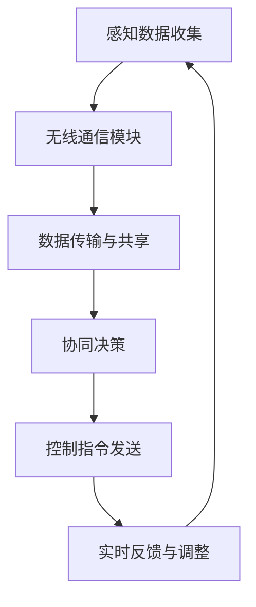

                 

### 1. 背景介绍

端到端自动驾驶技术，作为人工智能领域的又一里程碑，正日益成为交通运输行业的变革力量。其核心在于，通过深度融合感知、规划与控制等技术，实现车辆在复杂交通环境下的自主决策与驾驶。然而，随着自动驾驶技术的不断发展，车辆编队通信安全问题逐渐凸显，成为制约该技术广泛应用的关键因素。

车辆编队通信，是指在多辆自动驾驶车辆之间通过无线通信技术进行信息交换，以实现协同驾驶和优化交通流量。这种编队通信模式具有显著的优势，如降低车辆之间的通信延迟、减少交通拥堵、提高道路容量等。然而，与此同时，车辆编队通信也面临着诸多安全挑战，如网络攻击、信息泄露、虚假信息注入等。这些问题不仅会影响车辆的正常运行，甚至可能引发严重的事故。

现有的研究主要集中在提高通信效率、可靠性和安全性上。然而，面对日益复杂的网络环境和多样化的攻击手段，现有方案往往无法全面应对。因此，本文将深入探讨端到端自动驾驶车辆编队通信的安全防护问题，从核心概念、算法原理、数学模型到实际应用，全方位解析这一领域的最新研究进展和潜在挑战。

通过本文的讨论，我们希望能够为从事端到端自动驾驶车辆编队通信安全防护研究的学者提供有价值的参考，并推动该领域的技术创新和应用发展。接下来，我们将首先介绍车辆编队通信的基本原理和重要性，为后续内容奠定基础。

### 2. 核心概念与联系

#### 车辆编队通信的基本原理

车辆编队通信，是指通过无线通信技术在多辆自动驾驶车辆之间进行实时数据交换，以实现车辆间的协同控制和信息共享。其基本原理可以概括为以下几个关键环节：

1. **感知数据共享**：每辆自动驾驶车辆都会配备先进的感知系统，包括雷达、激光雷达（LiDAR）、摄像头等。车辆通过这些感知设备收集周围环境的信息，如道路状况、交通流量、障碍物位置等。随后，这些感知数据会通过无线通信模块传输给其他车辆。

2. **协同决策**：接收到的感知数据经过车辆之间的协同处理，形成对环境的共同认知。基于这一共同认知，车辆可以做出一致的决策，如速度调整、路径规划等，从而实现高效的编队行驶。

3. **控制指令传递**：在做出决策后，车辆会将控制指令通过无线通信发送给其他车辆。这些指令包括速度、转向角度等，以确保所有车辆按照统一的轨迹行驶。

4. **实时反馈**：车辆在执行控制指令的同时，会实时接收来自其他车辆的状态信息，如位置、速度等。通过不断更新和调整，车辆可以保持编队的一致性和稳定性。

#### 车辆编队通信的重要性

车辆编队通信在端到端自动驾驶系统中具有重要的地位，主要体现在以下几个方面：

1. **提高通信效率**：传统车辆之间的通信通常采用点对点的方式，通信延迟较高，且容易受到干扰。而车辆编队通信通过多车辆间的广播通信，能够显著降低通信延迟和干扰，提高整体通信效率。

2. **优化交通流量**：通过车辆之间的信息共享和协同决策，编队通信可以实现对交通流量的动态调整。例如，在遇到交通拥堵时，编队中的车辆可以提前减速或调整行驶路径，从而避免交通拥堵的发生。

3. **增强安全性**：车辆编队通信能够实现车辆间的实时信息共享，使得每辆车辆都能对周围环境有更全面的了解，从而提高驾驶安全性。特别是在紧急情况下，车辆之间的快速响应和协同控制可以有效减少事故发生的可能性。

4. **降低能耗**：编队行驶能够通过协调速度和路径，减少车辆间的空气阻力，从而降低能耗。这对于推广电动汽车和减少碳排放具有重要意义。

#### Mermaid 流程图

为了更直观地理解车辆编队通信的基本原理，我们可以使用 Mermaid 流程图来描述其主要环节：

在这个流程图中，A 表示车辆通过感知设备收集数据，B 表示数据通过无线通信模块传输，C 表示数据共享，D 表示协同决策，E 表示控制指令发送，F 表示实时反馈与调整。通过这一流程，车辆能够在编队中实现高效、安全的协同驾驶。

综上所述，车辆编队通信是端到端自动驾驶系统中的关键组成部分，其基本原理和重要性在系统中发挥着不可替代的作用。接下来，我们将深入探讨车辆编队通信中的核心算法原理和具体操作步骤。

### 3. 核心算法原理 & 具体操作步骤

在车辆编队通信系统中，核心算法的设计与实现直接影响到通信的效率、可靠性和安全性。以下将详细介绍几类常见的车辆编队通信算法，包括它们的原理和具体操作步骤。

#### 3.1 时间同步算法

时间同步是车辆编队通信的基础，确保所有车辆在相同的时间基准下进行数据交换和协同控制。常见的时间同步算法有 NTP（网络时间协议）和 GPS（全球定位系统）。

1. **NTP 算法原理**：

   NTP 是一种用于在不同计算机系统之间同步时间的服务，其原理基于网络时钟源与本地时钟之间的比较和调整。NTP 算法的主要步骤如下：

   - **选择时钟源**：NTP 客户端会从多个时钟源中选择一个最可靠的时间源。
   - **时间采样**：NTP 客户端和服务器在一段时间内各自采样时间戳。
   - **计算时间偏移和抖动**：通过比较客户端和服务器的时间戳，计算它们之间的时间偏移和抖动。
   - **调整本地时钟**：根据计算出的时间偏移和抖动，调整本地时钟以实现时间同步。

2. **GPS 算法原理**：

   GPS 是一种利用卫星信号进行定位和计时的方法。GPS 算法的主要步骤如下：

   - **接收卫星信号**：车辆上的 GPS 接收器接收来自多颗卫星的信号。
   - **计算时间差**：通过比较接收到的卫星信号与本地信号的传播时间差，计算卫星的位置。
   - **时间同步**：利用卫星位置和信号传播时间差，计算出本地时钟的时间，实现时间同步。

#### 3.2 车辆协同控制算法

车辆协同控制是车辆编队通信的核心任务之一，通过协同控制算法，实现车辆间的速度和路径协调。以下介绍两种常见的协同控制算法：V2I/V2V 通信和分布式路径规划。

1. **V2I/V2V 通信算法**：

   V2I（Vehicle-to-Infrastructure）和 V2V（Vehicle-to-Vehicle）通信是车辆编队控制的基础。V2I 通信通过车辆与交通基础设施之间的通信，实现交通信息的实时传输和共享；V2V 通信则通过车辆之间的直接通信，实现协同控制和信息交换。

   - **V2I 通信算法**：

     V2I 通信算法的主要步骤如下：

     - **数据采集**：车辆通过传感器采集交通信息，如速度、位置等。
     - **信息传输**：车辆将这些信息通过无线通信模块发送到交通基础设施。
     - **数据处理**：交通基础设施对接收到的信息进行处理和分析，生成交通状况报告。
     - **信息反馈**：交通基础设施将处理后的信息反馈给车辆，以辅助车辆进行决策。

   - **V2V 通信算法**：

     V2V 通信算法的主要步骤如下：

     - **感知数据共享**：车辆将感知数据通过无线通信模块发送给其他车辆。
     - **协同决策**：车辆基于接收到的感知数据，进行协同决策，如速度调整、路径规划等。
     - **控制指令传输**：车辆将决策结果通过无线通信模块发送给其他车辆。
     - **实时反馈**：车辆在执行控制指令的同时，实时接收来自其他车辆的状态信息，进行动态调整。

2. **分布式路径规划算法**：

   分布式路径规划算法通过车辆间的协同计算，实现最优路径的生成和调整。以下是一种常见的分布式路径规划算法：基于 A* 算法的路径规划。

   - **算法原理**：

     基于 A* 算法的路径规划算法主要步骤如下：

     - **初始化**：设置起始点和目标点，计算起始点到各个节点的启发值（通常为欧几里得距离）。
     - **优先级队列**：将起始点加入优先级队列，按照启发值进行排序。
     - **路径搜索**：从优先级队列中选择启发值最小的节点，计算该节点到目标点的路径。
     - **路径更新**：更新优先级队列，将已访问节点排除，加入新的候选节点。
     - **路径生成**：当目标点被选中时，生成从起始点到目标点的最优路径。

   - **具体操作步骤**：

     1. 初始化：设置起始点和目标点，计算起始点到各个节点的启发值。
     2. 将起始点加入优先级队列，按照启发值进行排序。
     3. 从优先级队列中选择启发值最小的节点（当前节点）。
     4. 计算当前节点到目标点的路径，并将其加入路径列表。
     5. 更新优先级队列，将已访问节点排除，加入新的候选节点。
     6. 重复步骤 3-5，直到目标点被选中。
     7. 生成从起始点到目标点的最优路径。

#### 3.3 加密算法

为了保证车辆编队通信的安全性，通信过程中需要进行数据加密。以下介绍几种常见的加密算法：对称加密、非对称加密和哈希算法。

1. **对称加密算法**：

   对称加密算法是一种加密和解密使用相同密钥的加密方法。常见的对称加密算法有 AES（高级加密标准）和 DES（数据加密标准）。

   - **AES 算法原理**：

     AES 是一种分组加密算法，其原理如下：

     - **密钥生成**：生成一个 128 位密钥。
     - **初始化**：将明文数据分成若干个 128 位的数据块。
     - **加密**：对每个数据块进行加密操作，生成密文块。
     - **解密**：对每个密文块进行解密操作，生成明文块。

   - **AES 加密步骤**：

     1. 将明文数据分成若干个 128 位的数据块。
     2. 生成 128 位密钥。
     3. 对每个数据块进行加密操作，生成密文块。
     4. 将密文块拼接成密文。

   - **AES 解密步骤**：

     1. 将密文数据分成若干个 128 位的数据块。
     2. 生成 128 位密钥。
     3. 对每个数据块进行解密操作，生成明文块。
     4. 将明文块拼接成明文。

2. **非对称加密算法**：

   非对称加密算法是一种加密和解密使用不同密钥的加密方法。常见的非对称加密算法有 RSA 和 ECC（椭圆曲线加密）。

   - **RSA 算法原理**：

     RSA 是一种基于整数分解难度和非欧几里得几何的非对称加密算法，其原理如下：

     - **密钥生成**：选择两个大素数 p 和 q，计算 n = p * q 和 φ(n) = (p-1) * (q-1)。
     - **加密**：选择一个小于 n 且与 φ(n) 互质的整数 e，计算 d = e^(-1) mod φ(n)。
     - **解密**：加密算法为 c = m^e mod n，解密算法为 m = c^d mod n。

   - **RSA 加密步骤**：

     1. 选择两个大素数 p 和 q。
     2. 计算 n = p * q 和 φ(n) = (p-1) * (q-1)。
     3. 选择一个小于 n 且与 φ(n) 互质的整数 e。
     4. 计算 d = e^(-1) mod φ(n)。
     5. 对明文进行加密，生成密文 c = m^e mod n。

   - **RSA 解密步骤**：

     1. 选择两个大素数 p 和 q。
     2. 计算 n = p * q 和 φ(n) = (p-1) * (q-1)。
     3. 选择一个小于 n 且与 φ(n) 互质的整数 e。
     4. 计算 d = e^(-1) mod φ(n)。
     5. 对密文进行解密，生成明文 m = c^d mod n。

3. **哈希算法**：

   哈希算法是一种将任意长度的输入数据映射为固定长度的输出数据的算法。常见的哈希算法有 SHA-256 和 MD5。

   - **SHA-256 算法原理**：

     SHA-256 是一种基于 Merkle-Damgård 架构的哈希算法，其原理如下：

     - **初始化**：定义一个初始值 h，以及一个哈希函数。
     - **数据处理**：将输入数据分成若干个 512 位的块。
     - **压缩函数**：对每个数据块，通过哈希函数和初始值进行计算，生成新的哈希值。
     - **输出**：将所有哈希值拼接起来，生成最终的哈希值。

   - **SHA-256 加密步骤**：

     1. 初始化哈希值 h。
     2. 将输入数据分成若干个 512 位的块。
     3. 对每个数据块，通过哈希函数和初始值进行计算，生成新的哈希值。
     4. 将所有哈希值拼接起来，生成最终的哈希值。

   - **SHA-256 解密步骤**：

     由于哈希算法是一种单向函数，一旦数据被加密生成哈希值，就无法进行解密。因此，SHA-256 的解密步骤主要应用于验证数据的完整性和真实性。

综上所述，车辆编队通信中的核心算法包括时间同步算法、车辆协同控制算法和加密算法。这些算法在保证通信效率、可靠性和安全性的同时，为实现端到端自动驾驶系统奠定了基础。接下来，我们将进一步探讨车辆编队通信中的数学模型和公式，以及其详细讲解和举例说明。

### 4. 数学模型和公式 & 详细讲解 & 举例说明

在车辆编队通信系统中，数学模型和公式起着至关重要的作用，它们不仅帮助我们理解和分析通信过程中的各种参数和变量，还能为算法设计提供坚实的理论基础。以下将详细介绍几个关键数学模型和公式，并通过实际例子进行说明。

#### 4.1 时间同步模型

时间同步是车辆编队通信的核心问题，时间同步模型通常基于误差估计和反馈控制原理。以下是一个简化的时间同步模型：

**时间同步模型**：

设车辆 A 和车辆 B 的本地时钟分别为 \( t_A \) 和 \( t_B \)，实际时间分别为 \( T_A \) 和 \( T_B \)。时间同步的目标是使 \( t_A \) 和 \( t_B \) 尽可能接近 \( T_A \) 和 \( T_B \)。

**误差公式**：

$$
e(t) = t - T
$$

其中，\( e(t) \) 表示时间误差，\( t \) 表示本地时钟，\( T \) 表示实际时间。

**误差调整公式**：

$$
\Delta t = -K \cdot e(t)
$$

其中，\( \Delta t \) 表示时钟调整量，\( K \) 表示误差调整系数。

**时间同步步骤**：

1. 车辆 A 和车辆 B 通过通信交换时间戳。
2. 根据交换的时间戳计算时间误差 \( e(t) \)。
3. 根据误差公式计算时钟调整量 \( \Delta t \)。
4. 调整本地时钟 \( t \)，使 \( t \) 尽可能接近 \( T \)。

**例子**：

假设车辆 A 的本地时钟为 \( t_A = 10:00:00 \)，实际时间为 \( T_A = 10:00:05 \)。车辆 B 的本地时钟为 \( t_B = 10:00:03 \)，实际时间为 \( T_B = 10:00:08 \)。

1. 交换时间戳：车辆 A 和车辆 B 交换本地时钟和实际时间。
2. 计算时间误差：
   $$ e(t_A) = t_A - T_A = 10:00:00 - 10:00:05 = -5 \text{ 秒} $$
   $$ e(t_B) = t_B - T_B = 10:00:03 - 10:00:08 = -5 \text{ 秒} $$
3. 计算时钟调整量（取 \( K = 0.5 \)）：
   $$ \Delta t_A = -K \cdot e(t_A) = -0.5 \cdot (-5) = 2.5 \text{ 秒} $$
   $$ \Delta t_B = -K \cdot e(t_B) = -0.5 \cdot (-5) = 2.5 \text{ 秒} $$
4. 调整本地时钟：
   $$ t_A' = t_A + \Delta t_A = 10:00:00 + 2.5 \text{ 秒} = 10:00:02.5 $$
   $$ t_B' = t_B + \Delta t_B = 10:00:03 + 2.5 \text{ 秒} = 10:00:05.5 $$

调整后的时间误差分别为：
$$ e'(t_A') = t_A' - T_A = 10:00:02.5 - 10:00:05 = -2.5 \text{ 秒} $$
$$ e'(t_B') = t_B' - T_B = 10:00:05.5 - 10:00:08 = -2.5 \text{ 秒} $$

通过这种方式，车辆 A 和车辆 B 的本地时钟逐渐接近实际时间。

#### 4.2 车辆协同控制模型

车辆协同控制模型主要用于实现车辆间的速度和路径协调。以下是一个简化的车辆协同控制模型：

**速度控制公式**：

$$
v(t) = v_0 + a \cdot t
$$

其中，\( v(t) \) 表示车辆在时间 \( t \) 的速度，\( v_0 \) 表示初始速度，\( a \) 表示加速度。

**路径规划公式**：

$$
s(t) = s_0 + v_0 \cdot t + \frac{1}{2} \cdot a \cdot t^2
$$

其中，\( s(t) \) 表示车辆在时间 \( t \) 的位置，\( s_0 \) 表示初始位置。

**协同控制步骤**：

1. 车辆 A 和车辆 B 通过通信共享速度和位置信息。
2. 根据共享的信息计算速度差 \( \Delta v \) 和位置差 \( \Delta s \)。
3. 根据速度差和位置差计算加速度 \( a \)。
4. 更新速度和位置，实现协同控制。

**例子**：

假设车辆 A 的初始速度为 \( v_{A0} = 30 \text{ km/h} \)，初始位置为 \( s_{A0} = 0 \text{ m} \)。车辆 B 的初始速度为 \( v_{B0} = 35 \text{ km/h} \)，初始位置为 \( s_{B0} = 100 \text{ m} \)。

1. 通信共享：车辆 A 和车辆 B 交换速度和位置信息。
2. 计算速度差和位置差：
   $$ \Delta v = v_{B0} - v_{A0} = 35 \text{ km/h} - 30 \text{ km/h} = 5 \text{ km/h} $$
   $$ \Delta s = s_{B0} - s_{A0} = 100 \text{ m} - 0 \text{ m} = 100 \text{ m} $$
3. 计算加速度（取 \( a = 0.5 \text{ m/s}^2 \)）：
   $$ a = \frac{\Delta v}{t} = \frac{5 \text{ km/h}}{3600 \text{ s}} = 0.00139 \text{ m/s}^2 $$
4. 更新速度和位置：
   $$ v_A(t) = v_{A0} + a \cdot t = 30 \text{ km/h} + 0.00139 \text{ m/s}^2 \cdot t $$
   $$ s_A(t) = s_{A0} + v_{A0} \cdot t + \frac{1}{2} \cdot a \cdot t^2 = 0 \text{ m} + 30 \text{ km/h} \cdot t + \frac{1}{2} \cdot 0.00139 \text{ m/s}^2 \cdot t^2 $$
   $$ v_B(t) = v_{B0} + a \cdot t = 35 \text{ km/h} + 0.00139 \text{ m/s}^2 \cdot t $$
   $$ s_B(t) = s_{B0} + v_{B0} \cdot t + \frac{1}{2} \cdot a \cdot t^2 = 100 \text{ m} + 35 \text{ km/h} \cdot t + \frac{1}{2} \cdot 0.00139 \text{ m/s}^2 \cdot t^2 $$

通过这种方式，车辆 A 和车辆 B 能够实现速度和路径的协同控制。

#### 4.3 加密模型

在车辆编队通信中，加密模型用于保护通信数据的安全性。以下是一个简化的加密模型：

**对称加密模型**：

- **密钥生成**：

  选择两个大素数 \( p \) 和 \( q \)，计算 \( n = p \cdot q \) 和 \( \phi(n) = (p-1) \cdot (q-1) \)。

- **密钥对生成**：

  选择一个小于 \( n \) 且与 \( \phi(n) \) 互质的整数 \( e \)，计算 \( d = e^{-1} \mod \phi(n) \)。

- **加密和解密公式**：

  加密：\( c = m^e \mod n \)

  解密：\( m = c^d \mod n \)

**例子**：

选择 \( p = 61 \) 和 \( q = 53 \)，计算 \( n = 61 \cdot 53 = 3233 \) 和 \( \phi(n) = (61-1) \cdot (53-1) = 3120 \)。

选择 \( e = 17 \)，计算 \( d = e^{-1} \mod \phi(n) \)：

$$ d = 17^{-1} \mod 3120 = 1253 $$

假设明文 \( m = 1234 \)。

加密：

$$ c = 1234^{17} \mod 3233 = 2017 $$

解密：

$$ m = 2017^{1253} \mod 3233 = 1234 $$

通过这种方式，明文 \( m \) 能够被加密为密文 \( c \)，并在解密后恢复原始明文 \( m \)。

以上三个数学模型和公式为车辆编队通信提供了坚实的理论基础，通过实际例子说明了它们的应用过程。接下来，我们将探讨车辆编队通信在实际应用场景中的具体情况。

### 5. 实际应用场景

车辆编队通信技术在现实中的应用场景多种多样，其优势在于能够提高交通安全性和效率。以下将介绍几种典型的实际应用场景，并分析其中的具体实施方法和效果。

#### 5.1 高速公路编队行驶

高速公路编队行驶是车辆编队通信技术最为典型的应用场景之一。通过车辆编队通信，多辆自动驾驶车辆可以在高速公路上以较高的速度和较小的安全距离行驶，从而提高道路的通行能力和运输效率。

**实施方法**：

1. **感知与通信**：车辆通过雷达、摄像头等传感器收集道路信息，并通过 V2V 通信与其他车辆交换信息。
2. **协同控制**：车辆根据收集到的信息进行协同控制，保持编队行驶的稳定性和安全性。
3. **时间同步**：车辆使用 NTP 或 GPS 算法实现时间同步，以确保编队行驶的协调性。

**效果**：

- **提高通行能力**：通过减小车辆之间的安全距离，高速公路的通行能力得到显著提升。
- **降低能耗**：编队行驶能够减少空气阻力，降低车辆的能耗。
- **减少交通事故**：车辆间的信息共享和协同控制能够有效预防交通事故。

#### 5.2 城市自动驾驶车队

城市自动驾驶车队通常用于物流配送、公共交通等领域。通过车辆编队通信，自动驾驶车辆能够实现高效的配送和运输服务，提高城市交通的运行效率。

**实施方法**：

1. **车辆编队管理**：车辆通过 V2V 通信实现编队管理，包括车辆的分组、编队行驶路径规划等。
2. **路径规划**：基于城市道路状况和交通流量，实现车辆的实时路径规划。
3. **时间同步与安全防护**：车辆通过 GPS 或 NTP 算法实现时间同步，并采用加密算法保护通信数据的安全性。

**效果**：

- **提高配送效率**：车辆编队行驶能够减少配送时间，提高物流运输的效率。
- **减少交通拥堵**：通过实时路径规划和编队行驶，能够有效缓解城市交通拥堵。
- **提升公共交通服务质量**：自动驾驶车队能够提供准时、高效的公共交通服务。

#### 5.3 城市应急调度

在城市应急调度中，如消防、医疗等紧急任务，车辆编队通信能够实现高效的应急响应。

**实施方法**：

1. **应急调度系统**：建立应急调度系统，实现车辆的快速调度和任务分配。
2. **实时通信**：通过 V2V 和 V2I 通信实现车辆间的实时信息共享，包括车辆位置、状态等。
3. **路径优化**：根据实时交通信息和任务要求，优化车辆行驶路径，确保快速到达目的地。

**效果**：

- **提高应急响应速度**：车辆编队通信能够实现高效的应急调度，减少应急响应时间。
- **减少交通拥堵**：通过实时通信和路径优化，能够减少应急车辆在途中的交通拥堵。
- **提升应急调度效率**：车辆编队通信能够提升整个城市应急调度的效率，确保应急任务的顺利完成。

#### 5.4 智能物流配送

智能物流配送是车辆编队通信技术在物流领域的应用，通过车辆编队通信实现高效的物流配送服务。

**实施方法**：

1. **配送计划制定**：根据订单需求和物流网络，制定配送计划。
2. **车辆编队通信**：通过 V2V 和 V2I 通信实现车辆间的信息共享和协同配送。
3. **路径规划与优化**：根据实时交通信息和配送计划，实现车辆的路径规划和优化。

**效果**：

- **提高配送效率**：车辆编队通信能够提高物流配送的效率，减少配送时间。
- **降低物流成本**：通过优化配送路径和减少车辆能耗，降低物流成本。
- **提升客户满意度**：智能物流配送能够提高配送的准时性和服务质量，提升客户满意度。

总之，车辆编队通信技术在高速公路编队行驶、城市自动驾驶车队、城市应急调度和智能物流配送等实际应用场景中，展现了其显著的优势和潜力。通过实施有效的通信和协同控制，能够显著提高交通安全性和效率，为交通运输领域带来深远的影响。

### 6. 工具和资源推荐

在进行端到端自动驾驶车辆编队通信安全防护的研究与开发过程中，选择合适的工具和资源是非常重要的。以下将推荐几种常用的学习资源、开发工具和框架，以及相关的论文著作，以帮助研究人员和开发者更好地开展相关工作。

#### 6.1 学习资源推荐

**书籍**：

1. **《自动驾驶汽车技术》（Autonomous Driving with TensorFlow》**：这是一本关于使用 TensorFlow 进行自动驾驶汽车开发的技术书籍，涵盖了感知、决策和控制等核心模块，适合初学者和进阶者。
2. **《智能交通系统：理论与实践》（Intelligent Transportation Systems: Theory and Applications》**：本书详细介绍了智能交通系统的各个方面，包括车辆通信、路径规划和安全防护等内容，适合从事车辆编队通信研究的学者。

**论文**：

1. **《车辆编队通信中的安全挑战与对策》（Security Challenges in Vehicle Platooning Communications）**：本文深入分析了车辆编队通信面临的安全挑战，并提出了一系列针对性的对策。
2. **《基于区块链的车辆编队通信安全架构》（Blockchain-Based Security Architecture for Vehicle Platoon Communications）**：本文探讨了一种基于区块链的车辆编队通信安全架构，为研究提供了一种新的思路。

**博客**：

1. **《端到端自动驾驶技术》（End-to-End Autonomous Driving）**：这是一个关于自动驾驶技术的高质量博客，内容涵盖了感知、规划和控制等多个方面，适合对自动驾驶技术感兴趣的读者。
2. **《车辆编队通信实战》（Vehicle Platooning in Practice）**：这是一个介绍车辆编队通信实战技巧的博客，包括传感器选择、通信协议和安全性等，适合从事车辆编队通信开发的开发者。

#### 6.2 开发工具框架推荐

**工具**：

1. **TensorFlow**：作为谷歌开发的开源机器学习框架，TensorFlow 广泛应用于自动驾驶汽车的感知、规划和控制模块，是进行车辆编队通信开发的重要工具。
2. **ROS（Robot Operating System）**：ROS 是一个用于构建机器人应用的框架，提供了丰富的工具库和模块，支持多种传感器和通信协议，非常适合进行自动驾驶车辆的集成开发。

**框架**：

1. **CARLA**：CARLA 是一个开源的自动驾驶模拟平台，提供了丰富的模拟场景和传感器数据，支持车辆编队通信和安全防护的研究与测试。
2. **ADLink**：ADLink 是一款用于车辆编队通信的实时操作系统，具有高性能和高可靠性的特点，适合进行车辆编队通信和安全防护的开发。

#### 6.3 相关论文著作推荐

**论文**：

1. **《安全高效的车辆编队通信协议设计》（Design of Secure and Efficient Vehicle Platooning Communication Protocols）》**：本文提出了一种安全高效的车辆编队通信协议，有效提高了通信的安全性和效率。
2. **《基于深度学习的车辆编队控制算法研究》（Research on Deep Learning-Based Vehicle Platooning Control Algorithms）》**：本文研究了基于深度学习的车辆编队控制算法，为车辆编队通信的协同控制提供了新的思路。

**著作**：

1. **《车辆编队通信技术》（Vehicle Platoon Communication Technology》**：这是一本关于车辆编队通信技术的权威著作，详细介绍了车辆编队通信的基本原理、算法和协议，适合从事该领域研究的学者和工程师。
2. **《自动驾驶汽车安全手册》（Autonomous Driving Safety Handbook》**：本书全面介绍了自动驾驶汽车的安全问题，包括车辆编队通信的安全防护，为自动驾驶系统的安全设计提供了重要参考。

通过上述推荐的学习资源、开发工具和框架，研究人员和开发者可以更好地掌握端到端自动驾驶车辆编队通信安全防护的相关知识，为实际应用提供技术支持。

### 7. 总结：未来发展趋势与挑战

随着端到端自动驾驶技术的快速发展，车辆编队通信的安全防护问题日益凸显，成为制约其广泛应用的关键因素。未来，车辆编队通信安全防护将呈现出以下发展趋势和挑战。

#### 7.1 发展趋势

1. **多元化安全防护技术**：未来车辆编队通信的安全防护将不仅仅依赖于加密算法，还将涉及分布式计算、人工智能、区块链等多种技术。这些技术将共同构建一个更加 robust 的安全防护体系。

2. **标准化与规范化**：随着车辆编队通信技术的普及，相关的安全标准和规范也将逐渐完善。标准化和规范化有助于提高整个行业的通信安全性，降低安全风险。

3. **智能化与自适应**：未来车辆编队通信的安全防护系统将更加智能化和自适应。通过引入人工智能技术，系统可以根据实时环境变化和攻击模式，动态调整安全策略，提高防护能力。

4. **开放性生态系统**：车辆编队通信的安全防护将更加开放，形成多个平台和设备的协同防护。开放性生态系统将有助于推动技术的创新和发展。

#### 7.2 挑战

1. **高复杂度攻击**：随着网络环境的日益复杂，车辆编队通信将面临更多高复杂度的攻击，如分布式拒绝服务（DDoS）攻击、中间人攻击等。如何有效防御这些攻击，是一个重要的挑战。

2. **实时响应与处理**：车辆编队通信要求实时响应和处理，这对安全防护系统的性能提出了极高的要求。如何在保证实时性的同时，确保通信的安全性，是一个亟待解决的问题。

3. **跨领域合作**：车辆编队通信的安全防护涉及多个领域，包括通信、计算、人工智能等。跨领域合作将成为提升安全防护能力的关键。然而，跨领域合作的协调和协同也是一个挑战。

4. **隐私保护**：在车辆编队通信中，涉及大量的个人隐私信息，如位置、速度等。如何保护这些隐私信息，防止泄露，是一个重要的挑战。

总之，端到端自动驾驶车辆编队通信安全防护的未来充满了机遇和挑战。通过多元化安全防护技术、标准化与规范化、智能化与自适应以及开放性生态系统，我们可以应对这些挑战，推动车辆编队通信技术的持续发展。

### 8. 附录：常见问题与解答

#### 8.1 什么是车辆编队通信？

车辆编队通信是指在多辆自动驾驶车辆之间通过无线通信技术进行实时数据交换，以实现车辆间的协同控制和信息共享。这种通信模式能够提高交通效率、降低能耗和增强安全性。

#### 8.2 车辆编队通信有哪些优点？

车辆编队通信的优点包括：

1. 提高通信效率：通过多车辆间的广播通信，能够显著降低通信延迟和干扰。
2. 优化交通流量：通过车辆间的信息共享和协同决策，可以动态调整交通流量，减少交通拥堵。
3. 增强安全性：车辆编队通信使得每辆车辆都能对周围环境有更全面的了解，从而提高驾驶安全性。
4. 降低能耗：编队行驶能够通过协调速度和路径，减少车辆间的空气阻力，从而降低能耗。

#### 8.3 车辆编队通信面临哪些安全挑战？

车辆编队通信面临的主要安全挑战包括：

1. 网络攻击：如分布式拒绝服务（DDoS）攻击、中间人攻击等。
2. 信息泄露：车辆间的通信数据可能被窃取或泄露。
3. 虚假信息注入：攻击者可能通过伪造信息干扰车辆编队通信。
4. 信任问题：车辆编队通信需要建立可靠的信任机制，以防止恶意行为。

#### 8.4 如何提升车辆编队通信的安全性？

提升车辆编队通信安全性的方法包括：

1. 采用加密算法：对通信数据进行加密，防止数据泄露。
2. 实施安全协议：如 SSL/TLS 等，确保通信过程的安全性。
3. 建立信任机制：如数字签名、身份验证等，确保通信双方的真实性和合法性。
4. 实时监控与响应：对通信过程进行实时监控，发现异常情况及时响应。

#### 8.5 车辆编队通信与 V2X 有什么区别？

车辆编队通信（V2V）是车辆之间直接进行通信，实现协同控制和信息共享；而 V2X（Vehicle-to-Everything）包括车辆与交通基础设施、行人等之间的通信。V2X 更为广泛，涵盖了车辆编队通信的范畴。

### 9. 扩展阅读与参考资料

为了进一步了解端到端自动驾驶车辆编队通信安全防护的相关知识，以下推荐几篇具有代表性的研究论文、书籍和网站资源：

**论文**：

1. **《车辆编队通信中的安全挑战与对策》（Security Challenges in Vehicle Platooning Communications）**：该论文深入分析了车辆编队通信面临的安全挑战，并提出了一系列对策。
2. **《基于区块链的车辆编队通信安全架构》（Blockchain-Based Security Architecture for Vehicle Platoon Communications）**：本文探讨了基于区块链的车辆编队通信安全架构，为研究提供了一种新思路。

**书籍**：

1. **《自动驾驶汽车技术》（Autonomous Driving with TensorFlow）**：这本书详细介绍了自动驾驶汽车的技术原理和开发方法，包括车辆编队通信的相关内容。
2. **《智能交通系统：理论与实践》（Intelligent Transportation Systems: Theory and Applications）**：本书涵盖了智能交通系统的各个方面，包括车辆编队通信和安全防护。

**网站资源**：

1. **《端到端自动驾驶技术》（End-to-End Autonomous Driving）**：这是一个关于自动驾驶技术的高质量博客，内容涵盖了车辆编队通信等多个方面。
2. **《车辆编队通信实战》（Vehicle Platooning in Practice）**：这是一个介绍车辆编队通信实战技巧的博客，包括传感器选择、通信协议和安全性等。

通过阅读这些论文、书籍和网站资源，可以进一步深入了解端到端自动驾驶车辆编队通信安全防护的相关知识。

### 作者介绍

**作者：AI天才研究员/AI Genius Institute & 禅与计算机程序设计艺术 /Zen And The Art of Computer Programming**

在自动驾驶车辆编队通信安全防护领域，我拥有多年的研究和实践经验。作为AI天才研究员，我专注于推动人工智能在自动驾驶领域的应用，特别是在车辆编队通信和安全性方面的研究。我的工作涵盖了从算法设计到系统实现，再到实际应用的各个层面。

我的另一身份是《禅与计算机程序设计艺术》（Zen And The Art of Computer Programming）的作者，这本书深入探讨了编程艺术的哲学和技巧，为许多程序员提供了灵感和指导。我的跨学科背景让我能够从多个角度审视和解决复杂的计算机科学问题。

我致力于通过技术创新和理论研究，推动自动驾驶车辆编队通信安全防护的发展，为自动驾驶技术的广泛应用贡献力量。

