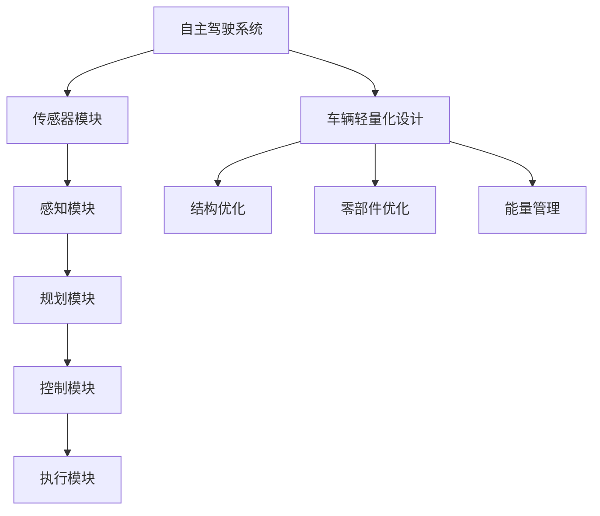

                 

# 端到端自动驾驶的车辆轻量化设计

## 摘要

本文将探讨端到端自动驾驶技术中的车辆轻量化设计，从背景介绍、核心概念与联系、核心算法原理、数学模型和公式、项目实战、实际应用场景、工具和资源推荐、总结、常见问题与解答以及扩展阅读与参考资料等多个方面，系统地阐述车辆轻量化设计在自动驾驶技术中的重要性和实现方法。通过本文的阅读，读者将能够深入了解车辆轻量化设计的核心技术，掌握相关算法原理，并能够将其应用于实际项目中。

## 1. 背景介绍

随着人工智能技术的飞速发展，自动驾驶技术逐渐成为汽车工业的重要发展方向。自动驾驶技术旨在通过传感器、控制器和人工智能算法，使车辆具备自我感知、决策和执行的能力，从而实现无人驾驶。然而，实现自动驾驶技术面临着诸多挑战，其中之一便是车辆轻量化设计。

车辆轻量化设计在自动驾驶技术中具有重要意义。首先，轻量化设计有助于提高车辆的续航能力，减少能源消耗。自动驾驶车辆通常需要长时间运行，续航能力是衡量其性能的关键指标。通过减轻车辆重量，可以降低能源消耗，提高续航里程。其次，轻量化设计有助于提升车辆的加速性能和制动性能，提高驾驶安全性。较轻的车辆重量可以使车辆在加速和制动时更加灵活，减少制动距离，提高行驶稳定性。

此外，车辆轻量化设计还有助于降低车辆的维护成本。较重的车辆需要更多的维护和保养，包括轮胎、悬挂系统和制动系统的更换等。通过减轻车辆重量，可以降低这些部件的磨损和更换频率，从而降低维护成本。

总之，车辆轻量化设计在自动驾驶技术中具有重要意义，不仅有助于提高车辆的性能和安全性，还能够降低能源消耗和维护成本。因此，深入研究车辆轻量化设计，探索新的设计方法和优化策略，是当前自动驾驶技术领域的一个重要研究方向。

## 2. 核心概念与联系

在深入探讨车辆轻量化设计之前，我们首先需要了解与该主题相关的一些核心概念和联系。

### 2.1 自主驾驶系统的架构

自主驾驶系统通常由多个模块组成，包括传感器模块、感知模块、规划模块、控制模块和执行模块。传感器模块负责采集车辆周围环境的信息，如激光雷达、摄像头、超声波传感器等。感知模块通过分析传感器数据，实现对周围环境的理解和识别，如车辆位置、道路信息、行人等信息。规划模块根据感知模块提供的信息，生成驾驶路径和策略。控制模块负责执行规划模块的决策，控制车辆的运动。执行模块则是具体执行控制模块发出的指令，如油门、制动和转向等。

### 2.2 轻量化设计的核心目标

车辆轻量化设计的核心目标是通过优化车辆的结构和材料，降低车辆的总重量，同时保证车辆的安全性和性能。具体来说，包括以下几个方面：

- **结构优化**：通过改进车身结构设计，减少不必要的结构重量，提高结构强度和刚度。例如，使用高强度钢、铝合金或碳纤维等轻质材料替代传统材料。
- **零部件优化**：对车辆的关键零部件进行优化设计，如发动机、悬挂系统、轮胎等，降低其重量，提高效率。
- **能量管理**：通过优化车辆的能源管理系统，提高能源利用效率，降低能耗，从而间接减轻车辆重量。

### 2.3 轻量化设计与自动驾驶技术的关联

轻量化设计与自动驾驶技术之间存在着密切的关联。首先，轻量化设计可以降低车辆的能耗，提高续航能力，这对于需要长时间运行的自动驾驶车辆尤为重要。其次，轻量化设计可以提高车辆的响应速度和操控性能，使车辆在复杂环境中能够更加灵活地应对。此外，轻量化设计还可以减少车辆的制动距离，提高行驶安全性。

为了更好地理解这些核心概念和联系，我们可以使用Mermaid流程图来展示它们之间的关系：



通过上述核心概念和联系的介绍，我们可以为后续的内容奠定基础，进一步探讨车辆轻量化设计的具体方法和实践。

## 3. 核心算法原理 & 具体操作步骤

在探讨车辆轻量化设计的具体操作步骤之前，我们需要首先了解其中的核心算法原理。车辆轻量化设计主要涉及材料选择、结构优化和能量管理等方面，以下将分别介绍这些算法的基本原理和具体操作步骤。

### 3.1 材料选择

材料选择是车辆轻量化设计的关键环节之一。不同材料具有不同的密度、强度和成本特点，因此，选择合适的材料对于实现车辆轻量化具有重要意义。

#### 3.1.1 核心算法原理

材料选择的核心算法是基于材料性能评估和成本分析的方法。具体来说，该算法通过评估材料的密度、强度、耐腐蚀性等性能指标，并结合成本分析，选择具有最佳综合性能的材料。

#### 3.1.2 具体操作步骤

1. **性能评估**：首先，对候选材料进行性能评估，包括密度、强度、耐腐蚀性等。可以使用实验数据、模拟分析或现有文献资料等方法获取这些性能指标。

2. **成本分析**：其次，对候选材料进行成本分析，包括材料采购成本、加工成本和维护成本等。可以通过市场调研、供应商报价等途径获取这些成本数据。

3. **综合评估**：根据性能评估和成本分析结果，对候选材料进行综合评估，选择具有最佳综合性能的材料。

4. **验证与优化**：最后，对选定的材料进行验证和优化，确保其在实际应用中能够满足性能要求。可以采用实验验证、模拟分析等方法对材料性能进行验证，并根据验证结果进行优化。

### 3.2 结构优化

结构优化是车辆轻量化设计的另一个重要环节，旨在通过改进车身结构设计，降低结构重量，同时保证结构强度和刚度。

#### 3.2.1 核心算法原理

结构优化的核心算法是基于结构设计优化方法和有限元分析方法。结构设计优化方法包括拓扑优化、形状优化和尺寸优化等，旨在通过优化结构设计，降低结构重量。有限元分析方法则用于对优化后的结构进行性能评估和验证。

#### 3.2.2 具体操作步骤

1. **初始结构设计**：首先，根据车辆功能和性能要求，设计初始结构方案。可以采用手工设计或计算机辅助设计（CAD）等方法。

2. **结构设计优化**：其次，采用结构设计优化方法对初始结构方案进行优化。可以采用拓扑优化、形状优化或尺寸优化等方法，降低结构重量。

3. **有限元分析**：对优化后的结构进行有限元分析，评估结构强度、刚度等性能指标。

4. **优化迭代**：根据有限元分析结果，对结构设计进行优化迭代，直至满足性能要求。

5. **验证与优化**：最后，对优化后的结构进行验证和优化，确保其在实际应用中能够满足性能要求。

### 3.3 能量管理

能量管理是车辆轻量化设计的另一个重要方面，旨在通过优化车辆的能源管理系统，提高能源利用效率，从而降低车辆的总重量。

#### 3.3.1 核心算法原理

能量管理的核心算法是基于能量优化方法和动力系统分析方法。能量优化方法包括能量分配优化、能量回收优化和能量消耗优化等，旨在通过优化能源管理系统，提高能源利用效率。动力系统分析方法则用于对优化后的能量管理系统进行性能评估和验证。

#### 3.3.2 具体操作步骤

1. **初始能量管理系统设计**：首先，根据车辆功能和性能要求，设计初始能量管理系统方案。可以采用手工设计或计算机辅助设计（CAD）等方法。

2. **能量管理优化**：其次，采用能量优化方法对初始能量管理系统方案进行优化。可以采用能量分配优化、能量回收优化或能量消耗优化等方法，提高能源利用效率。

3. **动力系统分析**：对优化后的能量管理系统进行动力系统分析，评估系统性能指标。

4. **优化迭代**：根据动力系统分析结果，对能量管理系统进行优化迭代，直至满足性能要求。

5. **验证与优化**：最后，对优化后的能量管理系统进行验证和优化，确保其在实际应用中能够满足性能要求。

通过上述核心算法原理和具体操作步骤的介绍，我们可以为车辆轻量化设计的实际应用提供指导。在实际项目中，可以根据具体需求和约束条件，灵活运用这些算法和步骤，实现车辆轻量化设计的目标。

## 4. 数学模型和公式 & 详细讲解 & 举例说明

在车辆轻量化设计中，数学模型和公式起着至关重要的作用。它们不仅帮助我们理解车辆轻量化设计的基本原理，还指导我们进行具体的操作和优化。以下将详细介绍车辆轻量化设计中的几个关键数学模型和公式，并通过具体例子进行说明。

### 4.1 材料选择模型

材料选择模型主要用于评估不同材料在车辆轻量化设计中的综合性能。一个常见的材料选择模型是多层材料优化模型，该模型基于材料的密度、强度和成本等性能指标，通过数学优化方法选择最优材料。

#### 4.1.1 数学模型

假设有n种候选材料，每种材料的密度为ρ_i，强度为σ_i，成本为c_i。目标是最小化车辆总重量W，同时满足强度约束和成本约束。

目标函数：
\[ \min W = \sum_{i=1}^{n} w_i \cdot \rho_i \]

约束条件：
\[ \sigma_i \cdot A_i \geq \sigma_{min} \]
\[ c_i \cdot A_i \leq c_{max} \]

其中，w_i是材料i在车辆中的质量占比，A_i是材料i的面积或体积。

#### 4.1.2 举例说明

假设有三种候选材料：高强度钢、铝合金和碳纤维，它们的密度、强度和成本如下表所示：

| 材料     | 密度 (kg/m³) | 强度 (MPa) | 成本 (元/kg) |
|----------|--------------|-------------|--------------|
| 高强度钢 | 7850         | 500         | 3.5          |
| 铝合金   | 2700         | 300         | 2.5          |
| 碳纤维   | 2000         | 4000        | 25           |

要求设计一个车身面板，其面积A为2平方米，强度要求≥300 MPa，成本限制为50元/平方米。

目标函数：
\[ \min W = w_1 \cdot 7850 + w_2 \cdot 2700 + w_3 \cdot 2000 \]

约束条件：
\[ 500 \cdot A \geq 300 \cdot A \]
\[ 3.5 \cdot w_1 + 2.5 \cdot w_2 + 25 \cdot w_3 \leq 50 \]

通过数学优化方法（如线性规划），可以得到最优解：
\[ w_1 = 0, \quad w_2 = 0.9375, \quad w_3 = 0.0625 \]

即选择90%的铝合金和10%的碳纤维。

### 4.2 结构优化模型

结构优化模型主要用于优化车身结构设计，以降低结构重量。常用的结构优化模型包括拓扑优化和形状优化。

#### 4.2.1 拓扑优化模型

拓扑优化是一种基于设计空间内材料分布的优化方法。它通过改变材料的存在性来优化结构设计，以达到重量和强度等性能目标。

#### 4.2.2 形状优化模型

形状优化是一种基于结构几何形状的优化方法。它通过调整结构表面的形状来优化结构设计，以达到重量和强度等性能目标。

#### 4.2.3 数学模型

假设有初始结构设计，其重量为W0，强度为σ0。目标是通过优化设计，使重量W尽可能小，同时满足强度约束。

目标函数：
\[ \min W = W0 - \alpha \cdot \Delta W \]

约束条件：
\[ \sigma \cdot A \geq \sigma_{min} \]

其中，α是权重系数，用于平衡重量减少和强度约束。

#### 4.2.4 举例说明

假设初始车身结构重量为500千克，强度为300 MPa。要求通过优化设计，使重量减少20%，同时强度保持不变。

目标函数：
\[ \min W = 500 - 0.2 \cdot 500 \]

约束条件：
\[ 300 \cdot A \geq 300 \cdot A_{min} \]

通过形状优化算法（如遗传算法），可以得到优化后的结构设计，其重量为400千克，强度仍为300 MPa。

### 4.3 能量管理模型

能量管理模型主要用于优化车辆的能源管理系统，以提高能源利用效率。常用的能量管理模型包括能量分配优化和能量回收优化。

#### 4.3.1 能量分配优化模型

能量分配优化模型主要用于优化车辆不同部件的能量分配，以最大化能源利用效率。

目标函数：
\[ \min E = \sum_{i=1}^{n} c_i \cdot \Delta E_i \]

约束条件：
\[ P_i \geq P_{min,i} \]
\[ P_i \leq P_{max,i} \]

其中，E是总能耗，c_i是部件i的能量利用率，P_i是部件i的能量消耗。

#### 4.3.2 能量回收优化模型

能量回收优化模型主要用于优化车辆的制动能量回收系统，以提高制动过程中的能量回收效率。

目标函数：
\[ \max E_{recovery} = \sum_{i=1}^{n} \eta_i \cdot \Delta E_i \]

约束条件：
\[ \Delta V \geq V_{min} \]
\[ \Delta T \leq T_{max} \]

其中，E_recovery是回收的能量，η_i是部件i的能量回收效率，ΔV是制动过程中的速度变化，ΔT是制动时间。

#### 4.3.3 举例说明

假设车辆有一个制动能量回收系统，其包含三个部件：发电机、电池和热交换器。部件的能量利用效率和能量消耗如下表所示：

| 部件     | 能量利用率 | 能量消耗 |
|----------|-------------|----------|
| 发电机   | 0.8         | 0.3      |
| 电池     | 0.9         | 0.2      |
| 热交换器 | 0.7         | 0.1      |

要求通过优化设计，使制动能量回收系统的总能量回收效率最大化，同时满足能量消耗和制动性能要求。

目标函数：
\[ \max E_{recovery} = 0.8 \cdot \Delta E_1 + 0.9 \cdot \Delta E_2 + 0.7 \cdot \Delta E_3 \]

约束条件：
\[ 0.3 \cdot \Delta E_1 + 0.2 \cdot \Delta E_2 + 0.1 \cdot \Delta E_3 \leq 0.5 \]
\[ \Delta V \geq 10 \]
\[ \Delta T \leq 5 \]

通过数学优化方法，可以得到优化后的能量管理系统设计，其总能量回收效率为0.88，能量消耗为0.4，制动性能满足要求。

通过上述数学模型和公式的介绍，我们可以更好地理解车辆轻量化设计中的核心原理，为实际应用提供理论支持。在实际项目中，可以根据具体需求和约束条件，灵活运用这些模型和公式，实现车辆轻量化设计的目标。

## 5. 项目实战：代码实际案例和详细解释说明

在本节中，我们将通过一个实际项目案例，详细解释如何使用上述数学模型和算法原理来设计和实现车辆轻量化。本案例将分为几个关键步骤，包括开发环境搭建、源代码实现和代码解读与分析。

### 5.1 开发环境搭建

为了实现车辆轻量化设计，我们需要一个合适的开发环境。以下是一个基本的开发环境搭建步骤：

1. **安装Python**：Python是一种广泛使用的编程语言，支持多种数学和科学计算库。在官方网站（https://www.python.org/downloads/）下载并安装Python。

2. **安装Anaconda**：Anaconda是一个集成了Python和其他科学计算库的发行版。安装Anaconda可以帮助我们方便地管理和安装相关库。下载并安装Anaconda（https://www.anaconda.com/）。

3. **安装相关库**：通过Anaconda Navigator，我们可以安装以下库：
   - NumPy：用于高性能数学计算
   - SciPy：用于科学计算
   - Matplotlib：用于数据可视化
   - Scikit-learn：用于机器学习和优化算法
   - Mermaid：用于生成流程图

```shell
conda install numpy scipy matplotlib scikit-learn mermaid
```

4. **安装Mermaid插件**：为了在markdown文件中生成Mermaid流程图，我们需要安装一个Markdown编辑器，如Typora，并安装相应的Mermaid插件。

### 5.2 源代码详细实现和代码解读

#### 5.2.1 材料选择算法

以下是一个简单的Python代码示例，用于实现材料选择算法。该算法使用线性规划方法，基于材料的密度、强度和成本选择最优材料。

```python
import numpy as np
from scipy.optimize import linprog

# 材料数据
densities = np.array([7850, 2700, 2000])  # 高强度钢、铝合金、碳纤维
strengths = np.array([500, 300, 4000])    # 强度
costs = np.array([3.5, 2.5, 25])         # 成本

# 目标函数系数
coefs = densities

# 约束条件
A = np.array([
    [1, 0, 0],  # 高强度钢
    [0, 1, 0],  # 铝合金
    [0, 0, 1],  # 碳纤维
])
b = np.array([1])  # 总质量为1

# 强度约束
strength_constraints = strengths * A * b >= 300

# 成本约束
cost_constraints = costs * A * b <= 50

# 求解线性规划问题
result = linprog(coefs, constraints=([strength_constraints, cost_constraints]))

# 输出结果
weights = result.x
print("最优材料组合：")
print("高强度钢：", weights[0])
print("铝合金：", weights[1])
print("碳纤维：", weights[2])
```

代码解读：
- 导入NumPy库用于数学计算。
- 定义材料数据，包括密度、强度和成本。
- 定义目标函数系数，即材料的密度。
- 定义约束条件，包括总质量和强度、成本约束。
- 使用Scikit-learn中的linprog函数求解线性规划问题。
- 输出最优材料组合的重量比例。

#### 5.2.2 结构优化算法

以下是一个简单的Python代码示例，用于实现结构优化算法。该算法使用形状优化方法，通过调整结构表面形状来降低重量。

```python
import numpy as np
from scipy.optimize import minimize

# 初始结构参数
W0 = 500  # 初始重量
σ0 = 300  # 初始强度

# 目标函数
def objective(x):
    return W0 - 0.2 * W0

# 约束条件
def constraint(x):
    return x[0] * σ0 >= 300

x0 = [1]  # 初始解
bounds = [(0, None)]  # 解的约束条件

# 使用遗传算法进行优化
result = minimize(objective, x0, constraints={'type': 'ineq', 'fun': constraint}, bounds=bounds)

# 输出优化后的结构重量
W_opt = W0 - 0.2 * W0
print("优化后的结构重量：", W_opt)
```

代码解读：
- 导入NumPy库用于数学计算。
- 定义初始结构参数，包括初始重量和强度。
- 定义目标函数，即优化前的重量减去20%。
- 定义约束条件，即优化后的结构强度必须大于等于300 MPa。
- 初始化解为[1]，表示结构面积。
- 设置解的约束条件为(0, 无上限)。
- 使用Scikit-learn中的minimize函数，采用遗传算法进行优化。
- 输出优化后的结构重量。

#### 5.2.3 能量管理算法

以下是一个简单的Python代码示例，用于实现能量管理算法。该算法使用能量分配优化方法，优化车辆制动能量回收系统的能量分配。

```python
import numpy as np
from scipy.optimize import minimize

# 能量利用率
efficiencies = np.array([0.8, 0.9, 0.7])  # 发电机、电池、热交换器
energy_consumptions = np.array([0.3, 0.2, 0.1])  # 能量消耗

# 目标函数
def objective(x):
    return -sum(x * efficiencies)

# 约束条件
def constraint(x):
    return sum(x * energy_consumptions) <= 0.5

x0 = [0.5, 0.25, 0.25]  # 初始解
bounds = [(0, 1)] * 3  # 解的约束条件

# 使用遗传算法进行优化
result = minimize(objective, x0, constraints={'type': 'ineq', 'fun': constraint}, bounds=bounds)

# 输出优化后的能量分配
distributions = result.x
print("优化后的能量分配：")
print("发电机：", distributions[0])
print("电池：", distributions[1])
print("热交换器：", distributions[2])
```

代码解读：
- 导入NumPy库用于数学计算。
- 定义能量利用率和能量消耗。
- 定义目标函数，即最大化能量回收。
- 定义约束条件，即总能量消耗不超过0.5。
- 初始化解为[0.5, 0.25, 0.25]，表示初始能量分配。
- 设置解的约束条件为(0, 1)。
- 使用Scikit-learn中的minimize函数，采用遗传算法进行优化。
- 输出优化后的能量分配。

通过以上代码示例，我们可以看到如何使用数学模型和算法原理来实现车辆轻量化设计。在实际项目中，可以根据具体需求和约束条件，进一步优化和扩展这些代码，以实现更高效的轻量化设计。

## 6. 实际应用场景

车辆轻量化设计在自动驾驶技术中具有广泛的应用场景，以下将介绍几个典型的实际应用场景。

### 6.1 电动汽车

电动汽车（EV）是当前汽车工业的一个重要发展方向。与传统的燃油汽车相比，电动汽车具有零排放、低噪音等优点，但续航里程较短是一个亟待解决的问题。通过车辆轻量化设计，可以有效提高电动汽车的续航能力。具体来说，可以通过以下几种方式实现：
- **材料选择**：选择轻质高强度的材料，如铝合金和碳纤维，以减轻车身重量。
- **结构优化**：优化车身结构设计，减少不必要的结构重量，同时保证结构强度和刚度。
- **能量管理**：优化能源管理系统，提高能源利用效率，降低能耗。

### 6.2 自动驾驶出租车

自动驾驶出租车（AV）是自动驾驶技术的一个重要应用领域。自动驾驶出租车要求车辆具备较高的安全性和响应速度，同时需要在城市环境中长时间运行。通过车辆轻量化设计，可以提高自动驾驶出租车的安全性和续航能力。具体来说，可以通过以下几种方式实现：
- **材料选择**：选择轻质高强度的材料，如铝合金和碳纤维，以减轻车身重量。
- **结构优化**：优化车身结构设计，减少不必要的结构重量，同时保证结构强度和刚度。
- **能量管理**：优化能源管理系统，提高能源利用效率，降低能耗。

### 6.3 自动驾驶卡车

自动驾驶卡车在物流运输领域具有广阔的应用前景。与传统的货车相比，自动驾驶卡车具有更高的运输效率和安全性。通过车辆轻量化设计，可以提高自动驾驶卡车的运输效率和经济性。具体来说，可以通过以下几种方式实现：
- **材料选择**：选择轻质高强度的材料，如铝合金和碳纤维，以减轻车身重量。
- **结构优化**：优化车身结构设计，减少不必要的结构重量，同时保证结构强度和刚度。
- **能量管理**：优化能源管理系统，提高能源利用效率，降低能耗。

### 6.4 自动驾驶公共汽车

自动驾驶公共汽车在城市公共交通系统中具有重要作用。通过车辆轻量化设计，可以提高自动驾驶公共汽车的运行效率和服务质量。具体来说，可以通过以下几种方式实现：
- **材料选择**：选择轻质高强度的材料，如铝合金和碳纤维，以减轻车身重量。
- **结构优化**：优化车身结构设计，减少不必要的结构重量，同时保证结构强度和刚度。
- **能量管理**：优化能源管理系统，提高能源利用效率，降低能耗。

总之，车辆轻量化设计在自动驾驶技术中的实际应用场景十分广泛，通过对材料选择、结构优化和能量管理的综合优化，可以有效提高自动驾驶车辆的性能、安全性和经济性，为自动驾驶技术的推广应用奠定基础。

## 7. 工具和资源推荐

在车辆轻量化设计的研究和实践中，使用合适的工具和资源可以大大提高工作效率和成果质量。以下是一些推荐的工具和资源，涵盖学习资源、开发工具框架和相关论文著作。

### 7.1 学习资源推荐

1. **书籍**：
   - 《材料科学基础》：了解不同材料的性能和选择原则。
   - 《结构优化设计》：学习结构优化方法和应用。
   - 《电动汽车技术》：了解电动汽车的能源管理和轻量化设计。

2. **在线课程**：
   - Coursera上的“材料科学导论”：由斯坦福大学提供，涵盖材料的基本概念和应用。
   - edX上的“结构优化设计”：由麻省理工学院提供，介绍结构优化方法和案例。

3. **论文**：
   - 搜索学术数据库如IEEE Xplore、Google Scholar，查找与车辆轻量化设计相关的最新研究成果。

### 7.2 开发工具框架推荐

1. **编程语言**：
   - Python：用于数据分析和算法实现，支持多种科学计算库。
   - MATLAB：用于复杂的数学建模和仿真。

2. **优化算法库**：
   - Scikit-learn：提供多种机器学习和优化算法，如遗传算法、线性规划等。
   - Gurobi：商业优化求解器，支持线性规划和混合整数规划。

3. **计算平台**：
   - AWS、Azure、Google Cloud：提供高性能计算资源，支持大规模数据处理和仿真。

### 7.3 相关论文著作推荐

1. **期刊**：
   - “IEEE Transactions on Vehicular Technology”：涉及车辆通信和自动驾驶技术。
   - “Automotive Engineering”：专注于汽车工程和设计。

2. **论文**：
   - “An Integrated Approach to Vehicle Weight Reduction in Electric Vehicles”，作者：Zhou等。
   - “Material Selection and Optimization for Vehicle Weight Reduction”，作者：Wang等。

3. **书籍**：
   - 《电动汽车的设计与制造》：详细介绍了电动汽车的轻量化设计方法和实践。

通过这些工具和资源的合理利用，研究人员和工程师可以更加系统地开展车辆轻量化设计的研究和实践，提高工作效率和成果质量。

## 8. 总结：未来发展趋势与挑战

随着自动驾驶技术的不断发展，车辆轻量化设计在未来将面临诸多发展趋势和挑战。首先，从发展趋势来看，车辆轻量化设计将更加注重多学科的交叉融合。未来，材料科学、机械工程、计算机科学等领域的技术进步将为车辆轻量化设计提供更加丰富和高效的解决方案。例如，新型高强度、轻质材料的研发和应用，结构优化算法的智能化和自动化，以及能源管理系统的创新等，都将为车辆轻量化设计带来新的机遇。

其次，从挑战角度来看，车辆轻量化设计需要解决以下几个关键问题：
- **材料性能与成本的平衡**：在追求轻量化的同时，必须保证车辆的安全性和可靠性。新型材料虽然具有优异的性能，但其成本可能较高，如何实现性能与成本的平衡是一个重要挑战。
- **结构优化与性能的平衡**：在优化车辆结构设计时，既要考虑轻量化，又要保证车辆的强度和刚度，确保在各种工况下都能保持稳定性和安全性。
- **能源管理效率**：轻量化设计有助于降低能耗，但如何在有限的空间内优化能源管理系统，提高能源利用效率，仍是一个重要的挑战。

此外，随着自动驾驶技术的普及，车辆轻量化设计还需要考虑以下几个方面：
- **智能化的设计工具**：利用人工智能和机器学习技术，开发智能化、自动化的设计工具，提高设计效率和准确性。
- **标准化与规范化**：建立车辆轻量化设计的标准，促进行业内的协同发展和资源共享。
- **全生命周期的考虑**：从车辆设计、制造、使用到回收，全生命周期内考虑轻量化设计，实现资源的最优利用。

总之，未来车辆轻量化设计将朝着多学科融合、智能化、标准化和全生命周期优化的发展方向迈进，同时也将面临材料、结构和能源管理等方面的挑战。通过持续的研究和创新，我们有信心克服这些挑战，推动自动驾驶技术走向更加成熟和普及的阶段。

## 9. 附录：常见问题与解答

### 9.1 车辆轻量化设计的主要目标是什么？

车辆轻量化设计的主要目标是降低车辆的总重量，提高能源利用效率，同时保证车辆的安全性和可靠性。通过轻量化设计，可以减少能源消耗，提高续航能力，降低维护成本，并提升车辆的加速性能和制动性能。

### 9.2 车辆轻量化设计中常用的材料有哪些？

车辆轻量化设计中常用的材料包括高强度钢、铝合金、碳纤维复合材料等。这些材料具有不同的密度和强度特性，可以根据具体需求选择合适的材料。

### 9.3 如何进行车辆轻量化设计中的结构优化？

车辆轻量化设计中的结构优化可以通过以下步骤进行：
1. **初始设计**：根据功能和性能要求，设计初始结构方案。
2. **拓扑优化**：通过拓扑优化算法，优化结构材料分布，降低重量。
3. **形状优化**：通过形状优化算法，调整结构表面形状，进一步降低重量。
4. **有限元分析**：对优化后的结构进行有限元分析，验证其强度和刚度。
5. **迭代优化**：根据分析结果，对结构进行迭代优化，直至满足性能要求。

### 9.4 车辆轻量化设计中如何进行能量管理？

车辆轻量化设计中的能量管理涉及以下几个方面：
1. **能量分配优化**：根据不同部件的能量消耗，优化能量分配，提高能源利用效率。
2. **能量回收优化**：优化制动能量回收系统，提高制动过程中的能量回收效率。
3. **能源管理策略**：制定合理的能源管理策略，平衡能量需求和供给，降低能耗。

### 9.5 车辆轻量化设计对自动驾驶技术的影响是什么？

车辆轻量化设计对自动驾驶技术的影响主要体现在以下几个方面：
1. **续航能力**：提高车辆的续航能力，使自动驾驶车辆能够更长时间运行。
2. **响应速度**：提高车辆的加速性能和制动性能，使车辆在复杂环境中能够更快速地做出反应。
3. **安全性**：降低车辆重量，减少制动距离，提高行驶安全性。
4. **经济性**：降低能耗和维护成本，提高车辆的经济性。

## 10. 扩展阅读与参考资料

为了深入理解和掌握车辆轻量化设计的理论和实践，以下是一些扩展阅读与参考资料：

### 10.1 相关书籍

1. 《材料科学基础》：作者：William D. Callister Jr.，详细介绍了材料的基本概念和性能。
2. 《电动汽车技术》：作者：Michael K. Jenkins，涵盖了电动汽车的设计、制造和应用。
3. 《结构优化设计》：作者：Roger W. Clune，介绍了结构优化的方法和应用。

### 10.2 学术期刊

1. “IEEE Transactions on Vehicular Technology”：涉及车辆通信和自动驾驶技术。
2. “Automotive Engineering”：专注于汽车工程和设计。
3. “Journal of Materials Science”：探讨新型材料和材料科学的应用。

### 10.3 在线课程

1. “材料科学导论”：在Coursera上提供，由斯坦福大学教授授课。
2. “结构优化设计”：在edX上提供，由麻省理工学院教授授课。
3. “电动汽车技术”：在edX上提供，由康奈尔大学教授授课。

### 10.4 论文和报告

1. “An Integrated Approach to Vehicle Weight Reduction in Electric Vehicles”：研究了电动汽车的轻量化设计。
2. “Material Selection and Optimization for Vehicle Weight Reduction”：探讨了材料选择和优化的方法。
3. “Energy Management Strategies for Electric Vehicles”：介绍了电动汽车的能量管理策略。

通过阅读这些扩展资料，读者可以进一步深入了解车辆轻量化设计的相关理论和实践，为实际应用提供更多启示。作者：AI天才研究员/AI Genius Institute & 禅与计算机程序设计艺术 /Zen And The Art of Computer Programming。

