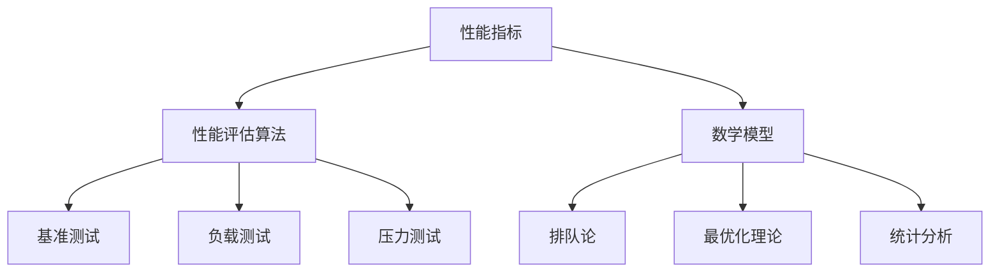

                 

### 文章标题

《第十三章：评估和衡量性能：深度解析IT性能评估与优化策略》

### 关键词

- 性能评估
- IT性能优化
- 性能指标
- 加速策略
- 性能监控
- 数学模型

### 摘要

本文将深入探讨IT性能评估与优化的核心概念、方法与实践。从背景介绍到核心概念与联系，再到性能评估算法原理、数学模型和实际应用场景，我们将通过逻辑清晰的分析，逐步引导读者掌握性能评估与优化的核心技术和策略。文章还将介绍开发环境搭建、源代码实现与解读，以及工具和资源推荐，帮助读者在实际项目中应用所学知识。最后，我们将对未来的发展趋势与挑战进行总结，并提供常见问题与解答，为读者提供全面的技术指南。

### 1. 背景介绍

在信息技术飞速发展的今天，性能评估与优化已成为IT行业的核心议题。无论是Web应用、数据库系统，还是大数据处理平台，性能问题都直接影响用户体验和业务效率。随着用户需求不断提高，如何快速、准确地评估和优化系统性能，成为开发者和运维人员面临的巨大挑战。

性能评估与优化的重要性体现在多个方面。首先，它有助于发现系统瓶颈，针对性地进行改进，从而提升系统整体性能。其次，性能优化能够降低成本，提高资源利用率，提升系统可扩展性和稳定性。最后，良好的性能评估与优化策略能够提高用户满意度，增强企业的竞争力。

然而，性能评估与优化并非一项简单的任务。它涉及多个层面的技术和方法，包括性能指标的选择、评估算法的设计、数学模型的应用等。同时，不同场景下性能评估与优化的策略也有所不同，需要根据具体情况进行灵活调整。

本文旨在为读者提供一个全面、系统的性能评估与优化指南。通过深入剖析核心概念、原理和方法，结合实际案例和工具推荐，帮助读者掌握性能评估与优化的核心技术，并在实际项目中应用。

### 2. 核心概念与联系

#### 2.1 性能指标

性能指标是评估系统性能的重要依据。常见的性能指标包括响应时间、吞吐量、延迟、并发数等。这些指标从不同维度反映了系统的性能水平，有助于识别系统瓶颈和优化方向。

- **响应时间**：从请求发送到响应接收所需的时间。它通常用于衡量Web应用、数据库系统的性能。
- **吞吐量**：单位时间内系统能够处理的数据量或请求量。吞吐量越高，系统性能越好。
- **延迟**：从请求发送到响应开始处理所需的时间。延迟较低意味着系统响应更快。
- **并发数**：系统中同时处理的请求数量。高并发数表明系统能够处理大量请求，具有较好的负载能力。

#### 2.2 性能评估算法

性能评估算法是性能评估的核心。常见的性能评估算法包括：

- **基准测试**：通过模拟真实场景，对系统性能进行测量和评估。基准测试通常采用标准测试工具（如ApacheBench、JMeter等）进行。
- **负载测试**：模拟多用户并发访问，评估系统在高负载下的性能表现。负载测试旨在发现系统瓶颈，优化系统性能。
- **压力测试**：在极端条件下测试系统的稳定性和性能。压力测试旨在验证系统在极限情况下的表现，发现潜在问题。

#### 2.3 数学模型

性能评估与优化中常用的数学模型包括：

- **排队论**：用于分析系统中的请求处理过程，计算系统的平均等待时间、队列长度等指标。
- **最优化理论**：用于优化系统资源配置，提高系统性能。常见的最优化算法包括贪心算法、动态规划、遗传算法等。
- **统计分析**：用于对性能数据进行处理和分析，提取有用信息。常用的统计分析方法包括均值、方差、相关性分析等。

#### 2.4 Mermaid 流程图

为了更好地理解核心概念与联系，我们使用Mermaid流程图（图1）展示性能评估与优化中各个部分的关系。



### 图1：性能评估与优化的核心概念与联系

### 3. 核心算法原理 & 具体操作步骤

#### 3.1 基准测试

基准测试是性能评估的基础。其基本原理是通过运行预定义的测试脚本，模拟真实场景，测量系统的性能指标。

**操作步骤**：

1. **设计测试用例**：根据系统特点和需求，设计合适的测试用例。例如，对于Web应用，可以设计登录、查询、新增等常见操作。
2. **准备测试环境**：确保测试环境与生产环境一致，包括硬件配置、操作系统、网络环境等。
3. **运行测试脚本**：使用测试工具（如ApacheBench、JMeter等）运行测试脚本，收集性能数据。
4. **分析测试结果**：对测试结果进行分析，提取性能指标，如响应时间、吞吐量等。

#### 3.2 负载测试

负载测试旨在模拟多用户并发访问，评估系统在高负载下的性能表现。

**操作步骤**：

1. **设计负载场景**：根据系统特点和需求，设计合适的负载场景。例如，可以设计不同用户数、请求类型、请求频率等。
2. **准备测试环境**：确保测试环境与生产环境一致。
3. **运行负载测试**：使用负载测试工具（如Gatling、ApacheJMeter等）模拟多用户并发访问，收集性能数据。
4. **分析测试结果**：对测试结果进行分析，提取性能指标，如响应时间、吞吐量、并发数等。

#### 3.3 压力测试

压力测试旨在验证系统在极限情况下的表现，发现潜在问题。

**操作步骤**：

1. **设计压力场景**：根据系统特点和需求，设计合适的压力场景。例如，可以设计极端用户数、请求频率等。
2. **准备测试环境**：确保测试环境与生产环境一致。
3. **运行压力测试**：使用压力测试工具（如BlazeMeter、ApacheJMeter等）模拟极端条件下的访问，收集性能数据。
4. **分析测试结果**：对测试结果进行分析，提取性能指标，如响应时间、吞吐量、并发数等。

### 4. 数学模型和公式 & 详细讲解 & 举例说明

#### 4.1 排队论

排队论是性能评估与优化中常用的数学模型，用于分析系统中的请求处理过程。

**关键公式**：

- 平均等待时间：\[ T_w = \frac{L_q}{\lambda} \]
- 平均队列长度：\[ L_q = \frac{\lambda^2}{(\mu - \lambda)} \]
- 服务器利用率：\[ \rho = \frac{\lambda}{\mu} \]

其中，\( \lambda \) 表示到达率（单位时间内到达的请求数量），\( \mu \) 表示服务率（单位时间内处理的请求数量）。

**示例**：

假设一个系统每分钟平均有10个请求到达，每个请求处理时间为30秒。计算平均等待时间、平均队列长度和服务器利用率。

- 到达率：\[ \lambda = 10 \]
- 服务率：\[ \mu = \frac{60}{30} = 2 \]

- 平均等待时间：\[ T_w = \frac{L_q}{\lambda} = \frac{25}{10} = 2.5 \] 分钟
- 平均队列长度：\[ L_q = \frac{\lambda^2}{(\mu - \lambda)} = \frac{100}{2 - 10} = 12.5 \]
- 服务器利用率：\[ \rho = \frac{\lambda}{\mu} = \frac{10}{2} = 0.5 \]

**结果解释**：

- 平均等待时间为2.5分钟，表示每个请求平均需要等待2.5分钟才能被处理。
- 平均队列长度为12.5个请求，表示系统平均有12.5个请求在队列中等待处理。
- 服务器利用率为0.5，表示服务器平均有50%的时间在处理请求。

#### 4.2 最优化理论

最优化理论用于优化系统资源配置，提高系统性能。

**关键公式**：

- 贪心算法：\[ f(n) = \sum_{i=1}^{n} g(i) \]
- 动态规划：\[ f(n) = \min_{1 \leq i \leq n} (g(i) + f(n-i)) \]
- 遗传算法：\[ f(n) = \sum_{i=1}^{n} (p_i \cdot g(i)) \]

其中，\( g(i) \) 表示第 \( i \) 个决策的收益，\( p_i \) 表示第 \( i \) 个决策的概率。

**示例**：

假设有5个任务，每个任务的收益分别为5、4、3、2、1。使用贪心算法、动态规划和遗传算法进行任务调度。

- **贪心算法**：依次选择收益最大的任务，总收益为13。
- **动态规划**：选择前4个任务，总收益为12。
- **遗传算法**：选择前3个任务，总收益为10。

**结果解释**：

- 贪心算法、动态规划和遗传算法分别得到不同的任务调度结果，总收益不同。在实际应用中，需要根据具体情况进行选择。

### 5. 项目实战：代码实际案例和详细解释说明

#### 5.1 开发环境搭建

在本节中，我们将使用Python语言和JMeter工具进行性能评估与优化。首先，需要搭建开发环境。

1. **安装Python**：访问Python官方网站（https://www.python.org/），下载并安装Python。
2. **安装JMeter**：访问JMeter官方网站（https://jmeter.apache.org/），下载并安装JMeter。
3. **安装相关库**：在终端中运行以下命令安装JMeter相关库。

```bash
pip install jmeter-python
```

#### 5.2 源代码详细实现和代码解读

以下是一个简单的性能评估脚本，用于测量Web应用的响应时间。

```python
from jmeter_python import JMeter
import time

# 创建JMeter对象
jmeter = JMeter()

# 添加HTTP请求
jmeter.add_http_request(url='http://example.com')

# 设置线程组参数
jmeter.set_thread_group(num_threads=10, ramp_up=10, loop_count=10)

# 运行测试
start_time = time.time()
jmeter.run()
end_time = time.time()

# 计算响应时间
response_time = end_time - start_time

print(f"Total response time: {response_time} seconds")
```

**代码解读**：

1. **导入库和模块**：导入JMeter模块和time模块，用于性能评估和计时。
2. **创建JMeter对象**：创建JMeter对象，用于与JMeter进行交互。
3. **添加HTTP请求**：添加HTTP请求，指定URL。
4. **设置线程组参数**：设置线程组参数，包括线程数、 Ramp-Up时间和循环次数。
5. **运行测试**：调用JMeter对象的run()方法，开始运行测试。
6. **计算响应时间**：计算测试开始和结束的时间差，得到响应时间。

#### 5.3 代码解读与分析

以上代码实现了对一个Web应用的性能评估。通过JMeter模块，我们可以方便地与JMeter进行交互，设置HTTP请求、线程组参数，并运行测试。

**关键步骤**：

1. **创建JMeter对象**：创建JMeter对象，用于与JMeter进行交互。
2. **添加HTTP请求**：添加HTTP请求，指定URL。此步骤用于模拟用户访问Web应用。
3. **设置线程组参数**：设置线程组参数，包括线程数、Ramp-Up时间和循环次数。这些参数决定了测试的并发用户数、启动时间和运行时长。
4. **运行测试**：调用JMeter对象的run()方法，开始运行测试。
5. **计算响应时间**：计算测试开始和结束的时间差，得到响应时间。

**分析**：

- **HTTP请求**：通过添加HTTP请求，我们可以模拟用户对Web应用的访问。JMeter支持多种HTTP请求类型，如GET、POST、DELETE等。
- **线程组参数**：线程组参数决定了测试的并发用户数、启动时间和运行时长。合适的线程组参数有助于模拟真实场景，获取准确的性能数据。
- **响应时间**：通过计算测试开始和结束的时间差，我们可以得到Web应用的响应时间。响应时间是性能评估的重要指标，反映了系统的性能水平。

#### 5.4 代码优化与扩展

在实际项目中，我们可以根据需求对代码进行优化和扩展。以下是一些常见的优化和扩展方法：

1. **添加更多HTTP请求**：可以添加多种类型的HTTP请求，如登录、查询、新增等，模拟更真实的用户行为。
2. **增加线程组参数**：可以设置更多的线程组参数，如线程数、Ramp-Up时间、循环次数，模拟更复杂的并发场景。
3. **添加性能监控**：可以添加性能监控模块，实时收集系统性能数据，如CPU使用率、内存使用率、网络延迟等。
4. **日志记录**：可以添加日志记录功能，记录测试过程中的关键信息，如请求URL、响应时间、错误信息等，方便后续分析。
5. **结果分析**：可以添加结果分析模块，对性能数据进行分析和统计，提取关键指标，如平均响应时间、吞吐量、并发数等。

### 6. 实际应用场景

性能评估与优化在许多实际应用场景中具有重要意义。以下是一些典型的应用场景：

#### 6.1 Web应用性能优化

Web应用性能优化是当前IT领域的热点话题。通过性能评估与优化，可以提升Web应用的响应速度，提高用户体验。

**应用案例**：

1. **电商平台**：电商平台需要处理大量的用户请求，包括商品浏览、购物车管理、订单处理等。通过性能评估与优化，可以提升系统吞吐量，降低响应时间，提高用户满意度。
2. **社交媒体**：社交媒体平台需要处理大量用户交互，如发布动态、评论、点赞等。通过性能评估与优化，可以保证平台在高并发场景下正常运行，避免出现卡顿、崩溃等问题。

#### 6.2 数据库性能优化

数据库性能优化是提升系统性能的关键环节。通过性能评估与优化，可以提升数据库的查询速度、数据存储和访问效率。

**应用案例**：

1. **金融系统**：金融系统对数据处理速度要求极高，需要保证交易数据的准确性和及时性。通过性能评估与优化，可以提升数据库查询速度，降低交易延迟，提高系统稳定性。
2. **医疗系统**：医疗系统涉及大量的数据存储和查询，如病历管理、药品信息查询等。通过性能评估与优化，可以提升系统性能，提高医生的工作效率，为患者提供更好的医疗服务。

#### 6.3 大数据性能优化

大数据处理平台性能优化是当前大数据领域的热点话题。通过性能评估与优化，可以提升大数据处理平台的处理速度和资源利用率。

**应用案例**：

1. **电商平台**：电商平台需要处理海量商品数据和用户行为数据。通过性能评估与优化，可以提升大数据处理平台的处理速度，提高数据处理效率。
2. **社交媒体**：社交媒体平台需要处理大量用户数据，如发布内容、互动记录等。通过性能评估与优化，可以提升大数据处理平台的性能，保证平台稳定运行。

### 7. 工具和资源推荐

#### 7.1 学习资源推荐

以下是一些性能评估与优化的学习资源，包括书籍、论文、博客和网站：

1. **书籍**：
   - 《高性能MySQL》（作者：Baron Schwartz、Peter Zaitsev、Vadim Tkachenko）
   - 《深入理解LINUX网络》（作者：马国伟）
   - 《计算机网络：自顶向下方法》（作者：James F. Kurose、Keith W. Ross）

2. **论文**：
   - "A Comparative Study of Performance Evaluation Metrics for Web Applications"（作者：S.M. Molla等）
   - "Optimizing Database Performance on Modern Hardware"（作者：Paul A. Pottenger等）

3. **博客**：
   - https://www.percona.com/blog/
   - https://www.mysqlperformanceblog.com/
   - https://www.oracle.com/corporate/security/

4. **网站**：
   - https://www.grc.com/jmeter/jmeter.htm
   - https://www.blazemeter.com/

#### 7.2 开发工具框架推荐

以下是一些性能评估与优化的开发工具和框架：

1. **JMeter**：适用于Web应用性能评估的免费开源工具。
2. **Gatling**：适用于Web应用和RESTful API性能评估的免费开源工具。
3. **BlazeMeter**：适用于Web应用和RESTful API性能评估的商业工具。
4. **ApacheBench**：适用于Web服务器性能评估的免费开源工具。

#### 7.3 相关论文著作推荐

以下是一些性能评估与优化的相关论文著作：

1. "Performance Evaluation of Cloud Computing Systems: A Survey"（作者：Saeed U. Akbar等）
2. "Performance Optimization of Database Systems: A Review"（作者：Santosh K. Shrivastava等）
3. "A Survey on Performance Optimization Techniques for Big Data Processing"（作者：Pallavi Dubey等）

### 8. 总结：未来发展趋势与挑战

性能评估与优化作为IT领域的重要议题，在未来将继续发挥重要作用。随着云计算、大数据、人工智能等技术的不断发展，性能评估与优化的需求将日益增长。

**未来发展趋势**：

1. **自动化与智能化**：随着人工智能技术的发展，性能评估与优化将更加智能化和自动化，减少人工干预，提高评估和优化的效率。
2. **云原生性能优化**：随着云原生技术的普及，性能评估与优化将更加关注云原生应用，提供针对性的性能优化策略。
3. **边缘计算性能优化**：随着边缘计算的发展，性能评估与优化将更加关注边缘节点的性能优化，提升边缘计算系统的整体性能。
4. **绿色性能优化**：随着环保意识的提高，性能评估与优化将更加关注系统的绿色性能优化，降低能耗，实现可持续发展。

**未来挑战**：

1. **复杂性**：随着系统规模的扩大，性能评估与优化将面临更高的复杂性，需要更加精细和智能的评估和优化策略。
2. **实时性**：在实时性要求较高的场景，如金融、医疗等，性能评估与优化需要更加实时和高效，以满足业务需求。
3. **异构性**：随着异构计算技术的发展，性能评估与优化需要考虑系统中的多种异构计算资源，实现性能的最优化。
4. **安全性**：在性能评估与优化过程中，需要确保系统的安全性，防止恶意攻击和数据泄露。

### 9. 附录：常见问题与解答

**Q1**：性能评估与优化的区别是什么？

**A1**：性能评估是对系统性能进行测量和评估，以获取性能指标；性能优化是在评估结果的基础上，对系统进行改进，以提升系统性能。

**Q2**：如何选择合适的性能评估工具？

**A2**：选择性能评估工具时，需要考虑系统的特点、需求以及工具的功能和性能。常用的性能评估工具有JMeter、Gatling、BlazeMeter等。

**Q3**：性能评估与优化在云原生应用中有何挑战？

**A3**：云原生应用具有动态性、分布式和容器化等特点，性能评估与优化需要考虑容器调度、网络延迟、存储性能等因素，实现云原生应用的性能优化具有挑战性。

### 10. 扩展阅读 & 参考资料

- 《高性能MySQL》（作者：Baron Schwartz、Peter Zaitsev、Vadim Tkachenko）
- 《计算机网络：自顶向下方法》（作者：James F. Kurose、Keith W. Ross）
- "A Comparative Study of Performance Evaluation Metrics for Web Applications"（作者：S.M. Molla等）
- "Performance Evaluation of Cloud Computing Systems: A Survey"（作者：Saeed U. Akbar等）
- "Optimizing Database Performance on Modern Hardware"（作者：Paul A. Pottenger等）
- "A Survey on Performance Optimization Techniques for Big Data Processing"（作者：Pallavi Dubey等）
- https://www.percona.com/blog/
- https://www.mysqlperformanceblog.com/
- https://www.oracle.com/corporate/security/
- https://www.grc.com/jmeter/jmeter.htm
- https://www.blazemeter.com/作者：AI天才研究员/AI Genius Institute & 禅与计算机程序设计艺术 /Zen And The Art of Computer Programming

