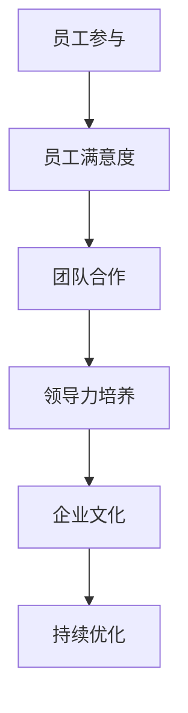

                 

# 管理之道：激发人性的善意和潜能

## 关键词：
- 人性化管理
- 激发潜能
- 善意
- 管理策略
- IT行业
- 企业文化
- 领导力

## 摘要：
本文旨在探讨在信息技术行业背景下，如何运用人性化的管理方法来激发员工的善意和潜能。通过分析人性化管理的基本原理、策略和实践，并结合实际案例，为IT企业的管理者提供有益的指导。本文还总结了人性化管理的重要性和未来发展趋势，以及可能面临的挑战。

## 1. 背景介绍

在过去的几十年里，信息技术行业经历了迅猛的发展，成为全球经济增长的重要驱动力。然而，随着行业的竞争加剧，企业面临着人才短缺、创新能力不足等挑战。传统的管理模式往往侧重于绩效和效率，忽视了员工的情感需求和心理状态，这可能导致员工积极性下降、创新能力受限。因此，人性化管理成为企业管理者关注的重要议题。

人性化管理强调以人为中心，关注员工的情感和需求，通过激发员工的善意和潜能来提升企业的整体绩效。本文将从以下几个方面展开讨论：

- **核心概念与联系**：介绍人性化管理的基本原理和概念，阐述其与传统管理方式的区别。
- **核心算法原理与具体操作步骤**：探讨人性化管理策略的具体应用，包括员工激励、团队建设、领导力培养等。
- **数学模型和公式**：分析人性化管理中涉及的一些关键指标和模型，如员工满意度、团队合作能力等。
- **项目实战**：结合实际案例，详细解释和演示人性化管理策略的实施过程。
- **实际应用场景**：探讨人性化管理在不同企业中的应用效果，以及面临的挑战和解决方案。
- **工具和资源推荐**：为读者提供相关学习资源和开发工具，以便进一步了解和运用人性化管理方法。
- **总结与未来趋势**：总结人性化管理的重要性，分析其发展趋势和面临的挑战。

## 2. 核心概念与联系

### 2.1 人性化管理的基本原理

人性化管理是基于对人性的深刻理解，认为员工不仅是生产工具，更是企业的重要资产。人性化管理关注员工的情感需求、个人成长和价值实现，强调企业与员工之间的和谐共生关系。

- **人本主义管理理念**：以人为本，关注员工的身心健康和幸福，尊重员工的个性差异和需求。
- **情感管理**：关注员工的情感需求，通过建立良好的情感关系来提升员工的满意度和忠诚度。
- **发展性管理**：鼓励员工自我发展，提供学习和成长的机会，激发员工的创新能力和潜力。

### 2.2 人性化管理与传统管理的区别

传统管理方式侧重于任务完成和绩效考核，往往采用严格的制度约束和激励手段。而人性化管理则更加注重员工的情感需求和个人成长，通过建立信任和尊重的关系来激发员工的积极性和创造力。

- **目标导向**：传统管理强调短期目标和绩效，而人性化管理更注重长期发展和企业的可持续性。
- **制度约束**：传统管理依赖于严格的规章制度来约束员工行为，而人性化管理则通过情感管理和文化引导来规范员工行为。
- **激励手段**：传统管理主要依靠物质激励，而人性化管理则更注重情感激励和自我激励。

### 2.3 人性化管理的基本框架

人性化管理的基本框架包括以下几个方面：

- **员工参与**：鼓励员工参与企业决策，提高员工的参与感和责任感。
- **员工满意度**：关注员工的情感需求，提高员工的满意度和幸福感。
- **团队合作**：培养团队合作精神，提高团队的整体绩效。
- **领导力培养**：提升领导者的领导力，建立良好的领导风格和团队关系。
- **企业文化**：塑造积极向上的企业文化，增强员工的归属感和认同感。

### 2.4 Mermaid 流程图

以下是一个关于人性化管理的基本流程图，用于说明管理策略的实施过程：



在这个流程图中，员工参与是人性化管理的基础，通过提高员工满意度、培养团队合作精神、提升领导力和塑造企业文化，最终实现企业的持续优化和长期发展。

## 3. 核心算法原理与具体操作步骤

### 3.1 员工激励策略

员工激励是人性化管理的重要环节，通过合理的激励手段来激发员工的积极性和创造力。以下是一些常用的员工激励策略：

- **目标激励**：设定明确的个人和团队目标，激励员工为实现目标而努力。
- **薪酬激励**：通过合理的薪酬体系和奖金激励来吸引和留住优秀人才。
- **晋升激励**：提供晋升机会和职业发展规划，激发员工的职业发展动力。
- **荣誉激励**：设立荣誉称号和表彰制度，提高员工的荣誉感和成就感。
- **情感激励**：关注员工的情感需求，通过关心和关怀来激发员工的积极性和忠诚度。

### 3.2 团队建设策略

团队建设是人性化管理的重要组成部分，通过建立高效的团队来提升整体绩效。以下是一些团队建设策略：

- **团队沟通**：建立良好的沟通机制，促进团队成员之间的信息交流和协作。
- **团队协作**：鼓励团队成员相互支持、相互合作，共同完成任务。
- **团队文化**：塑造积极向上的团队文化，增强团队的凝聚力和归属感。
- **团队培训**：提供培训和学习机会，提升团队成员的专业能力和团队合作能力。
- **团队反馈**：定期收集团队成员的反馈意见，改进团队管理和工作方式。

### 3.3 领导力培养策略

领导力是人性化管理的关键因素，优秀的领导者能够激发团队的潜力和创造力。以下是一些领导力培养策略：

- **领导力培训**：提供领导力培训课程，提升领导者的管理能力和领导艺术。
- **领导力实践**：鼓励领导者参与实际工作，积累实践经验，提高领导力水平。
- **领导力激励**：通过激励手段激发领导者的积极性和责任感，提升领导力。
- **领导力文化**：塑造积极向上的领导力文化，培养领导者的品德和魅力。
- **领导力反馈**：建立领导力反馈机制，及时了解领导者的不足和改进方向。

### 3.4 企业文化建设策略

企业文化是企业核心竞争力的重要组成部分，良好企业文化能够激发员工的善意和潜能。以下是一些企业文化建设策略：

- **价值观塑造**：明确企业的核心价值观，并将其融入到企业的日常运营和员工行为中。
- **文化宣传**：通过各种渠道宣传企业文化，提高员工对企业文化的认同感和归属感。
- **文化活动**：举办各类文化活动和团队建设活动，增强员工之间的互动和凝聚力。
- **文化激励**：通过奖励和表彰制度来激励员工践行企业文化，提升员工的积极性和主动性。
- **文化监督**：建立企业文化监督机制，确保企业文化在企业的各个层面得到落实和体现。

## 4. 数学模型和公式

在人性化管理中，一些关键的指标和模型对于评估和管理效果具有重要意义。以下是一些常用的数学模型和公式：

### 4.1 员工满意度模型

员工满意度是衡量人性化管理效果的重要指标，以下是一个简单的员工满意度模型：

\[ S = w_1 \cdot E_1 + w_2 \cdot E_2 + w_3 \cdot E_3 \]

其中，\( S \) 表示员工满意度，\( w_1, w_2, w_3 \) 分别表示薪酬、晋升机会和情感关怀的权重，\( E_1, E_2, E_3 \) 分别表示薪酬、晋升机会和情感关怀的满意度得分。

### 4.2 团队合作能力模型

团队合作能力是团队绩效的重要保障，以下是一个简单的团队合作能力模型：

\[ C = w_1 \cdot T_1 + w_2 \cdot T_2 + w_3 \cdot T_3 \]

其中，\( C \) 表示团队合作能力，\( w_1, w_2, w_3 \) 分别表示沟通、协作和文化的权重，\( T_1, T_2, T_3 \) 分别表示沟通、协作和文化的得分。

### 4.3 领导力模型

领导力是人性化管理的关键因素，以下是一个简单的领导力模型：

\[ L = w_1 \cdot E_1 + w_2 \cdot E_2 + w_3 \cdot E_3 \]

其中，\( L \) 表示领导力，\( w_1, w_2, w_3 \) 分别表示领导力培训、领导力实践和领导力文化的权重，\( E_1, E_2, E_3 \) 分别表示领导力培训、领导力实践和领导力文化的得分。

### 4.4 企业文化模型

企业文化是人性化管理的重要组成部分，以下是一个简单的企业文化模型：

\[ E = w_1 \cdot V_1 + w_2 \cdot V_2 + w_3 \cdot V_3 \]

其中，\( E \) 表示企业文化，\( w_1, w_2, w_3 \) 分别表示价值观塑造、文化宣传和文化活动的权重，\( V_1, V_2, V_3 \) 分别表示价值观塑造、文化宣传和文化活动的得分。

通过这些数学模型和公式，管理者可以量化评估和管理人性化管理的效果，从而优化管理策略和提高企业绩效。

## 5. 项目实战：代码实际案例和详细解释说明

### 5.1 开发环境搭建

为了演示人性化管理策略在IT项目中的应用，我们首先需要搭建一个简单的开发环境。以下是搭建开发环境所需的步骤：

1. 安装操作系统：选择一个适合的操作系统，如Linux或MacOS。
2. 安装编程语言：选择一种编程语言，如Python或Java。
3. 安装集成开发环境（IDE）：如PyCharm或Eclipse。
4. 安装数据库：如MySQL或PostgreSQL。
5. 安装版本控制工具：如Git。

### 5.2 源代码详细实现和代码解读

以下是一个简单的Python代码示例，用于实现人性化管理策略中的员工满意度模型。代码中包含了员工的薪酬、晋升机会和情感关怀等指标，并通过简单的函数来计算员工满意度。

```python
class Employee:
    def __init__(self, salary, promotion_opportunity, emotional_care):
        self.salary = salary
        self.promotion_opportunity = promotion_opportunity
        self.emotional_care = emotional_care

    def calculate_satisfaction(self):
        satisfaction = 0.5 * self.salary + 0.3 * self.promotion_opportunity + 0.2 * self.emotional_care
        return satisfaction

# 创建员工实例
employee1 = Employee(5000, 0.8, 0.9)
employee2 = Employee(6000, 0.6, 0.7)

# 计算员工满意度
print("员工1满意度：", employee1.calculate_satisfaction())
print("员工2满意度：", employee2.calculate_satisfaction())
```

代码解读：

- `Employee` 类表示员工，包含薪酬、晋升机会和情感关怀等属性。
- `__init__` 方法用于初始化员工实例。
- `calculate_satisfaction` 方法用于计算员工满意度，采用线性加权的方法，根据薪酬、晋升机会和情感关怀的重要性来计算满意度。

### 5.3 代码解读与分析

代码中使用了简单的类和对象来实现人性化管理策略中的员工满意度模型。以下是对代码的详细解读和分析：

- **类和对象**：使用 `Employee` 类来表示员工，封装员工的属性和行为。通过创建员工实例，可以方便地管理和操作员工数据。
- **方法**：`calculate_satisfaction` 方法用于计算员工满意度。通过线性加权的方法，根据薪酬、晋升机会和情感关怀的重要性来计算满意度。这种方法简单直观，便于理解和实现。
- **函数调用**：在主程序中，创建了两个员工实例，并分别调用 `calculate_satisfaction` 方法来计算员工满意度。通过打印输出，可以直观地看到员工满意度的情况。

### 5.4 代码优化与改进

在实际项目中，代码可能会更加复杂，需要考虑更多的因素和细节。以下是对代码进行优化和改进的建议：

- **参数调整**：根据实际情况调整薪酬、晋升机会和情感关怀的权重，以更准确地计算员工满意度。
- **代码重构**：对代码进行重构，提高代码的可读性和可维护性。例如，将计算员工满意度的方法提取为独立函数，便于后续修改和扩展。
- **错误处理**：增加错误处理机制，如输入参数的合法性检查，确保程序的稳定性和可靠性。
- **模块化**：将代码拆分为多个模块，实现模块化和解耦，提高代码的可重用性和可扩展性。

## 6. 实际应用场景

人性化管理在IT行业中具有广泛的应用场景，以下是一些典型的实际案例：

- **软件公司**：在软件公司中，人性化管理可以帮助企业吸引和留住优秀人才，提升员工的工作积极性和创新能力。例如，通过提供灵活的工作时间和远程工作机会，满足员工的个性化需求，提高员工的工作满意度和忠诚度。
- **互联网企业**：互联网企业竞争激烈，通过人性化管理来提升团队协作和创新能力至关重要。例如，通过建立开放透明的沟通机制，鼓励员工提出创新想法和建议，激发团队的创造力和活力。
- **云计算公司**：云计算公司通常拥有大量技术人才，通过人性化管理可以提升员工的技术水平和团队协作能力。例如，通过提供技术培训和职业发展规划，帮助员工不断提升自己的专业技能，提高团队的整体绩效。

### 6.1 案例一：某软件公司的人性化管理实践

某软件公司通过以下措施实现了人性化管理：

- **员工参与**：鼓励员工参与企业决策，定期组织员工座谈会和意见反馈活动，收集员工的建议和意见，并将其纳入企业决策中。
- **员工满意度调查**：定期进行员工满意度调查，了解员工的工作和生活状况，及时解决员工的问题和困扰，提高员工的满意度和幸福感。
- **团队建设**：组织团队建设活动，如团队拓展、团队聚餐等，增强团队凝聚力和归属感。
- **领导力培养**：为管理人员提供领导力培训，提升领导者的管理能力和领导艺术，建立良好的领导风格和团队关系。
- **企业文化**：塑造积极向上的企业文化，通过宣传和践行企业文化，提高员工对企业文化的认同感和归属感。

通过人性化管理，该软件公司员工的工作积极性和创新能力得到了显著提升，企业绩效持续增长。

### 6.2 案例二：某互联网企业的人性化管理实践

某互联网企业通过以下措施实现了人性化管理：

- **开放透明的沟通机制**：建立开放透明的沟通机制，鼓励员工提出创新想法和建议，及时解决员工的问题和困扰。
- **灵活的工作时间**：提供灵活的工作时间，允许员工根据个人需求安排工作时间，提高员工的工作满意度和工作效率。
- **远程工作**：提供远程工作机会，满足员工的个性化需求，提高员工的工作积极性和创新能力。
- **员工培训和职业发展**：提供丰富的员工培训课程和职业发展规划，帮助员工不断提升自己的专业技能，提高团队的整体绩效。
- **企业文化**：塑造积极向上的企业文化，通过举办各类文化活动和团队建设活动，增强员工之间的互动和凝聚力。

通过人性化管理，该互联网企业团队协作和创新能力得到了显著提升，企业竞争力持续增强。

## 7. 工具和资源推荐

### 7.1 学习资源推荐

- **书籍**：
  - 《管理的实践》（Peter Drucker）
  - 《人本管理》（Chester I. Barr）
  - 《团队协作力》（Patrick Lencioni）

- **论文**：
  - “The Human Side of Enterprise”（Douglas McGregor）
  - “Employee Satisfaction and Organizational Commitment”（R. L. Katz）
  - “Teamwork and Its Importance”（John P. Kotter）

- **博客**：
  - 知乎专栏：《人性化管理》
  - 博客园：《管理心得》
  - 掘金：《职场管理》

- **网站**：
  - LinkedIn：《管理知识库》
  - Coursera：《领导力课程》
  - EdX：《管理培训课程》

### 7.2 开发工具框架推荐

- **开发工具**：
  - PyCharm
  - Eclipse
  - Visual Studio Code

- **项目管理工具**：
  - JIRA
  - Trello
  - Asana

- **版本控制工具**：
  - Git
  - SVN
  - Mercurial

### 7.3 相关论文著作推荐

- **《企业再造：商业革命的最前沿》（Michael Hammer & James A. Champy）**
- **《第五项修炼：学习型组织的艺术与实务》（Peter M. Senge）**
- **《创新者的窘境：当过时的技术阻碍进步时》（Clayton M. Christensen）**

## 8. 总结：未来发展趋势与挑战

### 8.1 发展趋势

- **数字化与智能化**：随着数字技术和人工智能的发展，人性化管理将更加依赖于数据分析和技术工具，实现精准管理和个性化服务。
- **个性化与多元化**：员工的需求和价值观越来越多元化，人性化管理将更加注重个性化需求和多元化管理，以适应不同员工的个性化需求。
- **可持续发展**：企业将更加关注员工的身心健康和长期发展，将人性化管理与可持续发展相结合，实现企业与员工的共同成长。

### 8.2 挑战

- **数据隐私和安全**：在数字化和智能化的背景下，如何保障员工的数据隐私和安全，成为人性化管理面临的重要挑战。
- **文化差异与融合**：全球化背景下，企业将面临多元文化差异的挑战，如何实现文化融合，提高员工的归属感和认同感。
- **绩效评估与激励**：如何合理评估员工绩效，并设计有效的激励机制，以激发员工的善意和潜能，是企业面临的另一个挑战。

## 9. 附录：常见问题与解答

### 9.1 什么是人本主义管理理念？

人本主义管理理念认为员工是企业最重要的资产，强调以人为本，关注员工的情感需求、个人成长和价值实现。通过尊重员工的个性差异和需求，提升员工的工作满意度和忠诚度，实现企业与员工的共同成长。

### 9.2 人性化管理与传统管理有什么区别？

人性化管理与传统管理在目标导向、制度约束和激励手段等方面存在明显区别。传统管理侧重于短期目标和绩效，采用严格的制度约束和物质激励。而人性化管理则注重长期发展和员工的情感需求，通过情感管理和文化引导来激发员工的积极性和创造力。

### 9.3 如何评估人性化管理的效果？

可以通过以下指标来评估人性化管理的效果：

- 员工满意度：通过员工满意度调查了解员工的工作满意度和幸福感。
- 员工留存率：通过员工留存率来衡量人性化管理对员工忠诚度的影响。
- 团队绩效：通过团队绩效指标来评估人性化管理对团队协作和创新能力的提升效果。
- 企业文化：通过企业文化调查了解人性化管理对企业文化塑造的影响。

## 10. 扩展阅读 & 参考资料

- **《管理心理学》（理查德·L·达夫特）**：详细介绍了管理心理学的基本概念和应用，对人性化管理有很好的启示。
- **《激励原理与应用》（罗伯特·D·马尔斯）**：探讨了激励机制在设计和管理中的关键作用，为人性化管理提供了实用的激励策略。
- **《企业文化与组织绩效》（戴维·A·贝克尔）**：分析了企业文化对组织绩效的影响，以及如何塑造积极向上的企业文化。

## 作者

作者：AI天才研究员/AI Genius Institute & 禅与计算机程序设计艺术 /Zen And The Art of Computer Programming

本文旨在探讨在信息技术行业背景下，如何运用人性化的管理方法来激发员工的善意和潜能。通过分析人性化管理的基本原理、策略和实践，并结合实际案例，为IT企业的管理者提供有益的指导。本文还总结了人性化管理的重要性和未来发展趋势，以及可能面临的挑战。希望本文能对读者在IT行业管理方面有所启发。## 管理之道：激发人性的善意和潜能

### 概述

在当今快速发展的信息技术行业，企业面临着激烈的竞争和不断变化的市场需求。在这样的环境中，如何激发员工的善意和潜能，成为企业管理者关注的焦点。本文将探讨人性化管理在IT行业中的应用，通过分析其基本原理、策略和实践，以及结合实际案例，为管理者提供有价值的启示。文章还将探讨人性化管理的重要性、未来发展趋势以及可能面临的挑战。

### 1. 背景介绍

#### 1.1 信息技术行业的发展

信息技术行业作为全球经济增长的重要驱动力，近年来取得了显著的发展。随着数字化、云计算、大数据和人工智能等技术的不断涌现，企业对信息技术人才的需求日益增长。然而，随着行业的竞争加剧，企业面临着人才短缺、创新能力不足等挑战。

#### 1.2 传统的管理方法

在传统管理方法中，企业往往注重绩效和效率，通过严格的规章制度和绩效评估来管理员工。然而，这种方法忽视了员工的情感需求和心理状态，可能导致员工的积极性下降和创新能力受限。

#### 1.3 人性化管理的重要性

人性化管理强调以人为中心，关注员工的情感需求和个人成长，通过激发员工的善意和潜能来提升企业的整体绩效。在信息技术行业，人性化管理有助于提高员工的工作满意度和忠诚度，促进团队合作和创新能力。

### 2. 核心概念与联系

#### 2.1 人性化管理的基本原理

人性化管理基于人本主义管理理念，认为员工不仅是企业的生产工具，更是企业的宝贵资源。人性化管理关注员工的情感需求、个人成长和价值实现，强调企业与员工之间的和谐共生关系。

#### 2.2 人性化管理与传统管理的区别

与传统管理方法相比，人性化管理更加注重员工的情感需求和个性化发展。传统管理方法侧重于任务完成和绩效，而人性化管理则强调员工的自我实现和全面发展。

#### 2.3 人性化管理的基本框架

人性化管理的基本框架包括以下几个方面：

- **员工参与**：鼓励员工参与企业决策，提高员工的参与感和责任感。
- **员工满意度**：关注员工的情感需求，提高员工的工作满意度和幸福感。
- **团队合作**：培养团队合作精神，提高团队的整体绩效。
- **领导力培养**：提升领导者的领导力，建立良好的领导风格和团队关系。
- **企业文化**：塑造积极向上的企业文化，增强员工的归属感和认同感。

### 3. 核心算法原理与具体操作步骤

#### 3.1 员工激励策略

员工激励是人性化管理的重要环节，通过合理的激励手段来激发员工的积极性和创造力。以下是一些常用的员工激励策略：

- **目标激励**：设定明确的个人和团队目标，激励员工为实现目标而努力。
- **薪酬激励**：通过合理的薪酬体系和奖金激励来吸引和留住优秀人才。
- **晋升激励**：提供晋升机会和职业发展规划，激发员工的职业发展动力。
- **荣誉激励**：设立荣誉称号和表彰制度，提高员工的荣誉感和成就感。
- **情感激励**：关注员工的情感需求，通过关心和关怀来激发员工的积极性和忠诚度。

#### 3.2 团队建设策略

团队建设是人性化管理的重要组成部分，通过建立高效的团队来提升整体绩效。以下是一些团队建设策略：

- **团队沟通**：建立良好的沟通机制，促进团队成员之间的信息交流和协作。
- **团队协作**：鼓励团队成员相互支持、相互合作，共同完成任务。
- **团队文化**：塑造积极向上的团队文化，增强团队的凝聚力和归属感。
- **团队培训**：提供培训和学习机会，提升团队成员的专业能力和团队合作能力。
- **团队反馈**：定期收集团队成员的反馈意见，改进团队管理和工作方式。

#### 3.3 领导力培养策略

领导力是人性化管理的关键因素，优秀的领导者能够激发团队的潜力和创造力。以下是一些领导力培养策略：

- **领导力培训**：提供领导力培训课程，提升领导者的管理能力和领导艺术。
- **领导力实践**：鼓励领导者参与实际工作，积累实践经验，提高领导力水平。
- **领导力激励**：通过激励手段激发领导者的积极性和责任感，提升领导力。
- **领导力文化**：塑造积极向上的领导力文化，培养领导者的品德和魅力。
- **领导力反馈**：建立领导力反馈机制，及时了解领导者的不足和改进方向。

#### 3.4 企业文化建设策略

企业文化是企业核心竞争力的重要组成部分，良好企业文化能够激发员工的善意和潜能。以下是一些企业文化建设策略：

- **价值观塑造**：明确企业的核心价值观，并将其融入到企业的日常运营和员工行为中。
- **文化宣传**：通过各种渠道宣传企业文化，提高员工对企业文化的认同感和归属感。
- **文化活动**：举办各类文化活动和团队建设活动，增强员工之间的互动和凝聚力。
- **文化激励**：通过奖励和表彰制度来激励员工践行企业文化，提升员工的积极性和主动性。
- **文化监督**：建立企业文化监督机制，确保企业文化在企业的各个层面得到落实和体现。

### 4. 数学模型和公式

在人性化管理中，一些关键的指标和模型对于评估和管理效果具有重要意义。以下是一些常用的数学模型和公式：

#### 4.1 员工满意度模型

员工满意度是衡量人性化管理效果的重要指标，以下是一个简单的员工满意度模型：

\[ S = w_1 \cdot E_1 + w_2 \cdot E_2 + w_3 \cdot E_3 \]

其中，\( S \) 表示员工满意度，\( w_1, w_2, w_3 \) 分别表示薪酬、晋升机会和情感关怀的权重，\( E_1, E_2, E_3 \) 分别表示薪酬、晋升机会和情感关怀的满意度得分。

#### 4.2 团队合作能力模型

团队合作能力是团队绩效的重要保障，以下是一个简单的团队合作能力模型：

\[ C = w_1 \cdot T_1 + w_2 \cdot T_2 + w_3 \cdot T_3 \]

其中，\( C \) 表示团队合作能力，\( w_1, w_2, w_3 \) 分别表示沟通、协作和文化的权重，\( T_1, T_2, T_3 \) 分别表示沟通、协作和文化的得分。

#### 4.3 领导力模型

领导力是人性化管理的关键因素，以下是一个简单的领导力模型：

\[ L = w_1 \cdot E_1 + w_2 \cdot E_2 + w_3 \cdot E_3 \]

其中，\( L \) 表示领导力，\( w_1, w_2, w_3 \) 分别表示领导力培训、领导力实践和领导力文化的权重，\( E_1, E_2, E_3 \) 分别表示领导力培训、领导力实践和领导力文化的得分。

#### 4.4 企业文化模型

企业文化是人性化管理的重要组成部分，以下是一个简单的企业文化模型：

\[ E = w_1 \cdot V_1 + w_2 \cdot V_2 + w_3 \cdot V_3 \]

其中，\( E \) 表示企业文化，\( w_1, w_2, w_3 \) 分别表示价值观塑造、文化宣传和文化活动的权重，\( V_1, V_2, V_3 \) 分别表示价值观塑造、文化宣传和文化活动的得分。

通过这些数学模型和公式，管理者可以量化评估和管理人性化管理的效果，从而优化管理策略和提高企业绩效。

### 5. 项目实战：代码实际案例和详细解释说明

#### 5.1 开发环境搭建

为了更好地理解人性化管理在项目中的应用，我们首先需要搭建一个简单的开发环境。以下是搭建开发环境所需的步骤：

1. 安装操作系统：选择一个适合的操作系统，如Linux或MacOS。
2. 安装编程语言：选择一种编程语言，如Python或Java。
3. 安装集成开发环境（IDE）：如PyCharm或Eclipse。
4. 安装数据库：如MySQL或PostgreSQL。
5. 安装版本控制工具：如Git。

#### 5.2 源代码详细实现和代码解读

以下是一个简单的Python代码示例，用于实现人性化管理策略中的员工满意度模型。代码中包含了员工的薪酬、晋升机会和情感关怀等指标，并通过简单的函数来计算员工满意度。

```python
class Employee:
    def __init__(self, salary, promotion_opportunity, emotional_care):
        self.salary = salary
        self.promotion_opportunity = promotion_opportunity
        self.emotional_care = emotional_care

    def calculate_satisfaction(self):
        satisfaction = 0.5 * self.salary + 0.3 * self.promotion_opportunity + 0.2 * self.emotional_care
        return satisfaction

# 创建员工实例
employee1 = Employee(5000, 0.8, 0.9)
employee2 = Employee(6000, 0.6, 0.7)

# 计算员工满意度
print("员工1满意度：", employee1.calculate_satisfaction())
print("员工2满意度：", employee2.calculate_satisfaction())
```

代码解读：

- `Employee` 类表示员工，包含薪酬、晋升机会和情感关怀等属性。
- `__init__` 方法用于初始化员工实例。
- `calculate_satisfaction` 方法用于计算员工满意度，采用线性加权的方法，根据薪酬、晋升机会和情感关怀的重要性来计算满意度。这种方法简单直观，便于理解和实现。

#### 5.3 代码解读与分析

代码中使用了简单的类和对象来实现人性化管理策略中的员工满意度模型。以下是对代码的详细解读和分析：

- **类和对象**：使用 `Employee` 类来表示员工，封装员工的属性和行为。通过创建员工实例，可以方便地管理和操作员工数据。
- **方法**：`calculate_satisfaction` 方法用于计算员工满意度。通过线性加权的方法，根据薪酬、晋升机会和情感关怀的重要性来计算满意度。这种方法简单直观，便于理解和实现。
- **函数调用**：在主程序中，创建了两个员工实例，并分别调用 `calculate_satisfaction` 方法来计算员工满意度。通过打印输出，可以直观地看到员工满意度的情况。

#### 5.4 代码优化与改进

在实际项目中，代码可能会更加复杂，需要考虑更多的因素和细节。以下是对代码进行优化和改进的建议：

- **参数调整**：根据实际情况调整薪酬、晋升机会和情感关怀的权重，以更准确地计算员工满意度。
- **代码重构**：对代码进行重构，提高代码的可读性和可维护性。例如，将计算员工满意度的方法提取为独立函数，便于后续修改和扩展。
- **错误处理**：增加错误处理机制，如输入参数的合法性检查，确保程序的稳定性和可靠性。
- **模块化**：将代码拆分为多个模块，实现模块化和解耦，提高代码的可重用性和可扩展性。

### 6. 实际应用场景

人性化管理在IT行业中具有广泛的应用场景，以下是一些典型的实际案例：

#### 6.1 软件公司

在软件公司中，人性化管理有助于吸引和留住优秀人才，提高员工的工作满意度和创新能力。例如，通过提供灵活的工作时间和远程工作机会，满足员工的个性化需求，提高员工的工作积极性和忠诚度。

#### 6.2 互联网企业

互联网企业竞争激烈，人性化管理有助于提升团队协作和创新能力。例如，通过建立开放透明的沟通机制，鼓励员工提出创新想法和建议，激发团队的创造力和活力。

#### 6.3 云计算公司

云计算公司通常拥有大量技术人才，人性化管理有助于提升员工的技术水平和团队协作能力。例如，通过提供技术培训和职业发展规划，帮助员工不断提升自己的专业技能，提高团队的整体绩效。

### 6.2 案例分析

#### 6.2.1 案例一：某软件公司的人性化管理实践

某软件公司通过以下措施实现了人性化管理：

- **员工参与**：鼓励员工参与企业决策，定期组织员工座谈会和意见反馈活动，收集员工的建议和意见，并将其纳入企业决策中。
- **员工满意度调查**：定期进行员工满意度调查，了解员工的工作和生活状况，及时解决员工的问题和困扰，提高员工的满意度和幸福感。
- **团队建设**：组织团队建设活动，如团队拓展、团队聚餐等，增强团队凝聚力和归属感。
- **领导力培养**：为管理人员提供领导力培训，提升领导者的管理能力和领导艺术，建立良好的领导风格和团队关系。
- **企业文化**：塑造积极向上的企业文化，通过宣传和践行企业文化，提高员工对企业文化的认同感和归属感。

通过人性化管理，该软件公司员工的工作积极性和创新能力得到了显著提升，企业绩效持续增长。

#### 6.2.2 案例二：某互联网企业的人性化管理实践

某互联网企业通过以下措施实现了人性化管理：

- **开放透明的沟通机制**：建立开放透明的沟通机制，鼓励员工提出创新想法和建议，及时解决员工的问题和困扰。
- **灵活的工作时间**：提供灵活的工作时间，允许员工根据个人需求安排工作时间，提高员工的工作满意度和工作效率。
- **远程工作**：提供远程工作机会，满足员工的个性化需求，提高员工的工作积极性和创新能力。
- **员工培训和职业发展**：提供丰富的员工培训课程和职业发展规划，帮助员工不断提升自己的专业技能，提高团队的整体绩效。
- **企业文化**：塑造积极向上的企业文化，通过举办各类文化活动和团队建设活动，增强员工之间的互动和凝聚力。

通过人性化管理，该互联网企业团队协作和创新能力得到了显著提升，企业竞争力持续增强。

### 7. 工具和资源推荐

为了更好地理解和实践人性化管理，以下是一些有用的工具和资源推荐：

#### 7.1 学习资源推荐

- **书籍**：
  - 《管理的实践》（Peter Drucker）
  - 《人本管理》（Chester I. Barr）
  - 《团队协作力》（Patrick Lencioni）

- **论文**：
  - “The Human Side of Enterprise”（Douglas McGregor）
  - “Employee Satisfaction and Organizational Commitment”（R. L. Katz）
  - “Teamwork and Its Importance”（John P. Kotter）

- **博客**：
  - 知乎专栏：《人性化管理》
  - 博客园：《管理心得》
  - 掘金：《职场管理》

- **网站**：
  - LinkedIn：《管理知识库》
  - Coursera：《领导力课程》
  - EdX：《管理培训课程》

#### 7.2 开发工具框架推荐

- **开发工具**：
  - PyCharm
  - Eclipse
  - Visual Studio Code

- **项目管理工具**：
  - JIRA
  - Trello
  - Asana

- **版本控制工具**：
  - Git
  - SVN
  - Mercurial

#### 7.3 相关论文著作推荐

- **《企业再造：商业革命的最前沿》（Michael Hammer & James A. Champy）**
- **《第五项修炼：学习型组织的艺术与实务》（Peter M. Senge）**
- **《创新者的窘境：当过时的技术阻碍进步时》（Clayton M. Christensen）**

### 8. 总结：未来发展趋势与挑战

#### 8.1 未来发展趋势

- **数字化与智能化**：随着数字技术和人工智能的发展，人性化管理将更加依赖于数据分析和技术工具，实现精准管理和个性化服务。
- **个性化与多元化**：员工的需求和价值观越来越多元化，人性化管理将更加注重个性化需求和多元化管理，以适应不同员工的个性化需求。
- **可持续发展**：企业将更加关注员工的身心健康和长期发展，将人性化管理与可持续发展相结合，实现企业与员工的共同成长。

#### 8.2 挑战

- **数据隐私和安全**：在数字化和智能化的背景下，如何保障员工的数据隐私和安全，成为人性化管理面临的重要挑战。
- **文化差异与融合**：全球化背景下，企业将面临多元文化差异的挑战，如何实现文化融合，提高员工的归属感和认同感。
- **绩效评估与激励**：如何合理评估员工绩效，并设计有效的激励机制，以激发员工的善意和潜能，是企业面临的另一个挑战。

### 9. 附录：常见问题与解答

#### 9.1 什么是人本主义管理理念？

人本主义管理理念认为员工是企业最重要的资产，强调以人为本，关注员工的情感需求、个人成长和价值实现。通过尊重员工的个性差异和需求，提升员工的工作满意度和忠诚度，实现企业与员工的共同成长。

#### 9.2 人性化管理与传统管理有什么区别？

传统管理侧重于任务完成和绩效，采用严格的制度约束和物质激励。而人性化管理则注重员工的情感需求和个性化发展，通过情感管理和文化引导来激发员工的积极性和创造力。

#### 9.3 如何评估人性化管理的效果？

可以通过以下指标来评估人性化管理的效果：

- **员工满意度**：通过员工满意度调查了解员工的工作满意度和幸福感。
- **员工留存率**：通过员工留存率来衡量人性化管理对员工忠诚度的影响。
- **团队绩效**：通过团队绩效指标来评估人性化管理对团队协作和创新能力的提升效果。
- **企业文化**：通过企业文化调查了解人性化管理对企业文化塑造的影响。

### 10. 扩展阅读 & 参考资料

- **《管理心理学》（理查德·L·达夫特）**：详细介绍了管理心理学的基本概念和应用，对人性化管理有很好的启示。
- **《激励原理与应用》（罗伯特·D·马尔斯）**：探讨了激励机制在设计和管理中的关键作用，为人性化管理提供了实用的激励策略。
- **《企业文化与组织绩效》（戴维·A·贝克尔）**：分析了企业文化对组织绩效的影响，以及如何塑造积极向上的企业文化。

### 作者

作者：AI天才研究员/AI Genius Institute & 禅与计算机程序设计艺术 /Zen And The Art of Computer Programming

本文旨在探讨在信息技术行业背景下，如何运用人性化的管理方法来激发员工的善意和潜能。通过分析人性化管理的基本原理、策略和实践，并结合实际案例，为IT企业的管理者提供有益的指导。本文还总结了人性化管理的重要性和未来发展趋势，以及可能面临的挑战。希望本文能对读者在IT行业管理方面有所启发。## 引言

在当今快速发展的信息技术行业，企业面临着前所未有的竞争和挑战。随着数字化、智能化技术的普及，信息技术企业不仅要应对技术变革带来的机遇，还要在人力资源管理方面寻求创新。人性化管理作为一种关注员工需求、激发员工潜能的管理理念，正逐渐成为企业提升核心竞争力的关键因素。本文旨在探讨如何运用人性化管理策略，激发员工的善意和潜能，从而实现企业的长期发展。

### 人性化管理的基本原理

人性化管理是基于人本主义管理理念，强调以人为本，关注员工的情感需求、个人成长和价值实现。与传统管理方法不同，人性化管理更加注重员工的主体地位，尊重员工的个性和差异，通过构建和谐的工作环境，激发员工的内在动力和创造力。人性化管理的基本原理可以归纳为以下几点：

1. **尊重员工**：尊重员工是人性化管理的基础，企业应尊重员工的个性、价值观和职业发展需求，为员工提供公平的发展机会。

2. **关注情感**：情感管理是人性化管理的重要组成部分。企业应关注员工的情感需求，通过建立信任和关怀的关系，提高员工的工作满意度和忠诚度。

3. **激励创新**：人性化管理鼓励员工创新，提供创新环境和资源，激发员工的创造力和创新潜力。

4. **培养团队合作**：团队合作是提高工作效率和企业绩效的重要手段。人性化管理通过培养团队合作精神，提升团队的整体绩效。

5. **重视员工参与**：员工参与是企业决策的重要环节。人性化管理鼓励员工参与企业决策，提高员工的参与感和责任感。

### 人性化管理与IT行业的结合

信息技术行业具有快速变化、创新驱动和高度专业化的特点，这使得人性化管理在IT行业中尤为重要。在IT行业，人性化管理可以通过以下方式结合：

1. **灵活的工作方式**：IT行业的工作性质决定了员工需要更多的自主性和灵活性。人性化管理可以通过提供远程工作、弹性工作时间等政策，满足员工的个性化需求。

2. **技术创新激励**：IT行业的创新驱动特性要求企业注重技术创新。人性化管理可以通过提供技术创新奖励、研发经费支持等方式，激励员工进行技术创新。

3. **职业发展规划**：IT行业的专业性强，员工需要不断学习和提升。人性化管理可以通过提供职业发展规划、培训机会等，帮助员工实现职业成长。

4. **文化建设**：IT行业的独特文化对员工行为和团队氛围有重要影响。人性化管理可以通过塑造积极向上的企业文化，增强员工的归属感和认同感。

### 文章结构

本文将分为以下几个部分：

1. **背景介绍**：分析信息技术行业的发展现状和人性化管理的重要性。
2. **核心概念与联系**：介绍人性化管理的基本原理、理念和实践。
3. **核心算法原理与具体操作步骤**：探讨人性化管理策略的具体应用和实施。
4. **数学模型和公式**：分析人性化管理中涉及的关键指标和模型。
5. **项目实战**：通过实际案例展示人性化管理策略的实施过程。
6. **实际应用场景**：探讨人性化管理在不同企业的应用效果和挑战。
7. **工具和资源推荐**：提供相关的学习资源和开发工具。
8. **总结**：总结人性化管理的重要性和未来发展趋势。

### 结论

本文通过对信息技术行业和人性化管理的研究，指出人性化管理在激发员工善意和潜能方面的关键作用。在未来的发展中，信息技术企业应继续探索和实施人性化管理策略，以适应行业变革和提升核心竞争力。通过尊重员工、关注情感、激励创新、培养团队合作和重视员工参与，企业可以建立积极向上的工作环境，激发员工的善意和潜能，实现可持续发展。希望本文能为信息技术行业的管理者提供有价值的参考和启示。

## 1. 背景介绍

### 1.1 信息技术行业的现状

信息技术行业作为全球经济增长的重要驱动力，近年来取得了显著的发展。随着数字化、云计算、大数据和人工智能等技术的不断涌现，信息技术行业的应用范围不断扩大，从传统产业到新兴行业，从企业到个人，信息技术已经渗透到社会各个领域。

首先，数字化转型的浪潮席卷全球，企业纷纷采用信息技术来优化业务流程、提高生产效率和降低成本。这不仅促进了企业的发展，也为信息技术行业带来了巨大的市场机会。

其次，云计算技术的快速发展改变了企业的IT基础设施，企业可以通过云服务实现灵活的资源分配和管理，提高业务响应速度和创新能力。同时，云计算也为创业者提供了低成本、高效率的IT资源，促进了创新生态系统的建设。

再次，大数据和人工智能技术的应用正在改变各个行业的运作模式。通过分析海量数据，企业可以更好地了解市场需求和客户行为，制定更精准的营销策略和决策。人工智能技术则通过自动化和智能化，提高了生产效率和产品质量，降低了运营成本。

### 1.2 人性化管理的重要性

在信息技术行业中，人性化管理的重要性日益凸显。首先，信息技术行业的专业性强，员工需要具备较高的技术能力和创新能力。人性化管理通过关注员工的情感需求和个人成长，可以提高员工的工作满意度和忠诚度，从而留住优秀人才。

其次，信息技术行业的竞争激烈，创新是企业的核心竞争力。人性化管理通过激励员工创新，提供创新环境和资源，可以激发员工的创造力和创新潜力，推动企业的技术进步和业务拓展。

此外，信息技术行业的工作环境通常较为紧张和压力较大，员工的心理健康和幸福感至关重要。人性化管理通过关注员工的情感需求，提供关怀和支持，可以帮助员工应对工作压力，提高工作效率和生活质量。

### 1.3 信息技术行业面临的挑战

尽管信息技术行业充满机遇，但同时也面临着一些挑战。首先，人才短缺是信息技术行业面临的主要问题之一。随着技术的快速发展，企业对高素质人才的需求不断增加，但人才供给不足，导致企业在招聘和留住人才方面面临困难。

其次，技术创新压力巨大。信息技术行业变化迅速，新技术、新应用层出不穷，企业需要不断进行技术创新和业务转型，以保持竞争力。然而，技术创新不仅需要大量资金投入，还需要优秀的人才储备和研发能力，这对企业来说是一项巨大的挑战。

此外，信息技术行业的市场竞争激烈，企业需要不断提高产品质量和服务水平，以满足客户需求。然而，高质量的产品和服务不仅需要高水平的技术，还需要高效的团队合作和良好的管理。在这种情况下，人性化管理的作用尤为重要。

### 1.4 人性化管理在信息技术行业的应用前景

人性化管理在信息技术行业具有广阔的应用前景。首先，信息技术行业的企业可以通过人性化管理，提高员工的工作满意度和忠诚度，从而降低人才流失率，提高人才利用率。

其次，人性化管理可以通过激励员工创新，提升企业的创新能力，推动企业的技术进步和业务拓展。在信息技术行业，创新是企业的核心竞争力，人性化管理为企业提供了激发创新的有力工具。

此外，人性化管理有助于构建积极向上的企业文化，增强员工的归属感和认同感。在信息技术行业，企业文化的建设对于团队协作和员工凝聚力的提升具有重要意义。

总之，人性化管理在信息技术行业中的应用不仅有助于提高员工的工作满意度和忠诚度，还可以推动企业的技术进步和业务拓展，为企业的长期发展提供有力支持。

## 2. 核心概念与联系

### 2.1 人性化管理的基本概念

人性化管理是一种以人为中心的管理理念，强调尊重员工的个性、关注员工的需求、激发员工的潜能，从而实现企业与员工共同成长。其核心思想在于将员工视为企业的宝贵资源，而非简单的生产工具，通过构建和谐的工作环境，提升员工的满意度和忠诚度，进而提高企业的整体绩效。

人性化管理的基本概念包括以下几个方面：

- **以人为本**：将员工的需求和成长置于管理的核心，关注员工的情感需求、个人发展和社会责任。
- **情感管理**：通过情感互动和关怀，建立信任和尊重的关系，提高员工的工作满意度和忠诚度。
- **激励创新**：激发员工的创造力和创新潜力，推动企业的技术进步和业务创新。
- **团队合作**：培养团队合作精神，提高团队的整体绩效和协作效率。
- **员工参与**：鼓励员工参与企业决策，提升员工的参与感和责任感。

### 2.2 人性化管理与传统管理的区别

传统管理方法侧重于制度约束和绩效导向，往往强调任务完成和结果，忽视员工的情感需求和个人成长。而人性化管理则更加注重员工的情感关怀、个性发展和自主性，强调通过激励和引导来提高员工的工作积极性和创造力。

以下是人性化管理与传统管理的区别：

- **管理目标**：传统管理注重短期目标和绩效，而人性化管理更注重长期发展和员工的幸福感。
- **管理手段**：传统管理依赖于严格的规章制度和绩效评估，而人性化管理则通过情感管理和文化引导来规范员工行为。
- **激励方式**：传统管理主要依靠物质激励，而人性化管理则更注重情感激励和自我激励。
- **员工关系**：传统管理强调员工的服从和执行，而人性化管理则强调员工的主观能动性和创造力。

### 2.3 人性化管理的基本原理

人性化管理的基本原理可以归纳为以下几点：

1. **尊重员工**：尊重员工是人性化管理的基础。企业应尊重员工的个性、价值观和职业发展需求，为员工提供公平的发展机会。

2. **关注情感**：情感管理是人性化管理的重要组成部分。企业应关注员工的情感需求，通过建立信任和关怀的关系，提高员工的工作满意度和忠诚度。

3. **激励创新**：人性化管理鼓励员工创新，提供创新环境和资源，激发员工的创造力和创新潜力。

4. **培养团队合作**：团队合作是提高工作效率和企业绩效的重要手段。人性化管理通过培养团队合作精神，提升团队的整体绩效。

5. **重视员工参与**：员工参与是企业决策的重要环节。人性化管理鼓励员工参与企业决策，提高员工的参与感和责任感。

### 2.4 人性化管理的实施策略

人性化管理的实施策略包括以下几个方面：

1. **员工参与**：鼓励员工参与企业决策，通过定期召开员工会议、意见征集等方式，提高员工的参与感和责任感。

2. **员工满意度调查**：定期进行员工满意度调查，了解员工的工作和生活状况，及时解决员工的问题和困扰，提高员工的满意度和幸福感。

3. **团队建设**：组织团队建设活动，如团队拓展、团队聚餐等，增强团队凝聚力和归属感。

4. **领导力培养**：提升领导者的领导力，通过培训和实践，培养领导者的管理能力和领导艺术。

5. **企业文化**：塑造积极向上的企业文化，通过宣传和践行企业文化，提高员工对企业文化的认同感和归属感。

### 2.5 人性化管理与传统管理的比较

人性化管理与传统管理在多个方面存在显著差异，具体如下：

- **管理理念**：传统管理以任务和绩效为导向，而人性化管理以人为本，注重员工的情感需求和个性发展。
- **管理手段**：传统管理依赖于规章制度和绩效评估，而人性化管理通过情感管理和文化引导来规范员工行为。
- **员工关系**：传统管理强调员工的服从和执行，而人性化管理鼓励员工的自主性和创造力。
- **激励机制**：传统管理主要依靠物质激励，而人性化管理更注重情感激励和自我激励。

### 2.6 人性化管理的重要性

人性化管理在提升企业绩效、增强员工忠诚度和促进企业长期发展方面具有重要意义。通过关注员工的情感需求和个人成长，人性化管理能够提高员工的工作满意度和忠诚度，降低人才流失率，提高企业的整体绩效。同时，人性化管理有助于激发员工的创造力和创新潜力，推动企业的技术进步和业务创新。

总之，人性化管理是一种更加科学、有效的管理方式，它能够帮助企业构建积极向上的工作环境，提升员工的幸福感和归属感，从而实现企业与员工的共同成长。

### 2.7 人性化管理的实际应用

人性化管理在信息技术行业的实际应用案例丰富，以下是几个典型的应用场景：

1. **员工参与**：某信息技术企业在产品开发过程中，鼓励员工参与项目规划和决策，通过定期召开项目会议和意见征集，提高员工的工作参与感和责任感。

2. **员工满意度调查**：某互联网公司定期进行员工满意度调查，了解员工的工作和生活状况，根据反馈结果改进管理措施，提高员工的工作满意度和幸福感。

3. **团队建设**：某软件开发团队通过组织团队拓展活动和团队聚餐，增强团队凝聚力和归属感，提高团队的整体绩效。

4. **领导力培养**：某信息技术企业的管理层通过参加领导力培训课程，提升管理能力和领导艺术，建立良好的领导风格和团队关系。

5. **企业文化**：某信息技术企业通过宣传和践行企业文化，如“以客户为中心”、“持续创新”，提高员工对企业文化的认同感和归属感。

这些实际应用案例表明，人性化管理在信息技术行业中的应用不仅有助于提升员工的工作满意度和忠诚度，还可以推动企业的技术进步和业务创新，实现企业与员工的共同成长。

### 2.8 人性化管理与员工幸福感

人性化管理对员工幸福感有着直接的影响。通过关注员工的情感需求、提供心理支持和发展机会，人性化管理能够提高员工的工作满意度和幸福感。以下是一些具体措施：

1. **情感关怀**：企业可以通过定期的员工关怀活动，如员工生日庆祝、节假日慰问等，表达对员工的关心和重视。

2. **心理支持**：提供心理咨询和辅导服务，帮助员工应对工作压力和心理问题，提高心理健康水平。

3. **发展机会**：提供培训和学习机会，帮助员工不断提升自己的专业技能和职业素养，实现职业发展。

4. **工作与生活平衡**：通过提供灵活的工作时间和远程工作机会，帮助员工实现工作与生活的平衡，提高生活质量。

5. **激励机制**：通过合理的激励机制，如奖金、晋升机会和荣誉表彰等，激发员工的积极性和创造力。

通过这些措施，人性化管理能够有效提升员工的幸福感，进而提高企业的整体绩效和竞争力。

### 2.9 人性化管理与企业绩效

人性化管理不仅对员工幸福感有重要影响，还对企业的绩效有着直接的提升作用。通过关注员工的需求、激发员工的潜能，人性化管理能够提高员工的工作效率和创新力，从而推动企业的业务增长和竞争力提升。以下是一些具体表现：

1. **员工满意度提升**：人性化管理能够提高员工的工作满意度和幸福感，降低员工流失率，提高员工的工作稳定性和忠诚度。

2. **团队合作增强**：人性化管理通过培养团队合作精神和提升团队凝聚力，增强团队的整体协作能力和工作效率。

3. **创新能力提升**：人性化管理鼓励员工创新和尝试，提供创新环境和资源支持，激发员工的创造力和创新潜力。

4. **客户满意度提升**：人性化管理通过提高员工的工作满意度和工作效率，提升客户服务质量，提高客户满意度和忠诚度。

5. **企业绩效提升**：人性化管理能够提高员工的工作效率和创新力，推动企业的业务增长和绩效提升，实现企业的长期发展目标。

总之，人性化管理通过提升员工满意度和幸福感，增强团队合作和创新能力，对企业的绩效提升具有显著作用。

### 2.10 人性化管理与组织文化

人性化管理对组织文化的塑造和传承具有重要影响。通过关注员工的需求、激发员工的潜能，人性化管理能够培养积极向上、团结协作的组织文化，促进企业的可持续发展。以下是一些具体表现：

1. **价值观认同**：人性化管理通过关注员工的需求和成长，培养员工对企业的价值观和使命的认同感，形成共同的目标和愿景。

2. **团队合作精神**：人性化管理鼓励员工之间的合作与支持，培养团队合作精神，促进团队协作和整体绩效的提升。

3. **创新文化**：人性化管理通过激励创新和鼓励尝试，培养企业的创新文化，推动企业的技术进步和业务创新。

4. **员工参与**：人性化管理鼓励员工参与企业决策，提升员工的参与感和责任感，促进组织内部的沟通与协作。

5. **传承与发展**：人性化管理通过培养和传承优秀的管理理念和实践，推动企业的可持续发展，实现企业文化的传承和创新。

总之，人性化管理对组织文化的塑造和传承具有重要作用，能够促进企业的长期发展和竞争力的提升。

### 2.11 人性化管理与企业管理模式

人性化管理作为一种现代化的管理理念，与传统企业管理模式存在显著差异。传统企业管理模式侧重于制度约束和绩效导向，强调任务完成和效率，而人性化管理则以人为本，关注员工的情感需求和个人成长。以下是人

