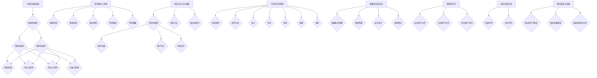
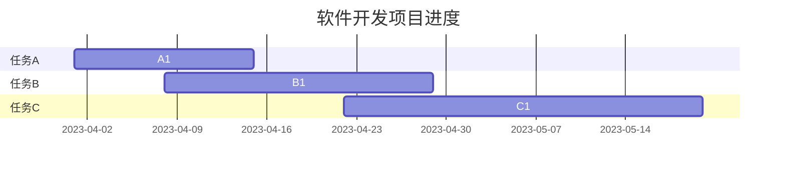
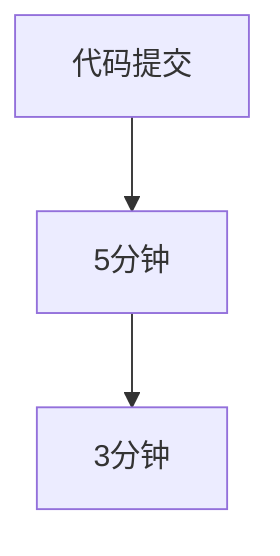

                 

### 1. 背景介绍

随着企业数字化转型进程的不断深入，IT团队在企业中的地位日益重要。作为企业核心竞争力的关键组成部分，IT团队不仅负责维护和优化企业信息系统，还承担着推动业务创新和提升效率的重要任务。在这个背景下，如何有效管理公司IT团队，带领团队完成既定目标，成为每一个IT领导者必须面对的挑战。

首先，IT团队的目标不仅包括传统的系统维护和故障排除，还包括推动新技术的研究和应用，提升业务流程的数字化水平。这意味着IT领导者需要具备前瞻性的技术视野，以及对业务流程的深刻理解。同时，团队中的成员也需要具备多样化的技能，从软件开发到网络安全，从数据分析到云计算，每一个环节都不可或缺。

其次，IT团队的管理是一项系统工程。这不仅仅是技术上的挑战，更是人际关系的协调。如何激发团队成员的创造力，如何建立高效的沟通机制，如何处理团队内部的矛盾和冲突，都是需要深思熟虑的问题。此外，随着团队成员的多样性和国际化程度的提高，跨文化管理也成为IT团队领导者必须面对的课题。

再次，随着企业规模的扩大和业务场景的多样化，IT团队面临的任务也日益复杂。从简单的IT支持到复杂的系统集成，从静态的网站开发到动态的移动应用，从本地部署到云计算，每一个变化都给IT团队提出了更高的要求。如何在这些复杂的变化中保持团队的稳定性和高效性，是每个IT领导者需要解决的问题。

总之，管理公司IT团队是一项充满挑战的任务，但它也充满了机遇。通过有效的团队管理，IT团队不仅能够提升企业竞争力，还能够为企业带来持续的创新动力。接下来，我们将详细探讨如何通过科学的管理方法和有效的沟通策略，带领IT团队实现既定目标。

### 2. 核心概念与联系

要有效地管理IT团队，我们首先需要明确几个核心概念，并了解它们之间的相互关系。以下是几个关键概念及其相互作用的详细阐述：

#### IT团队的组织结构

IT团队的组织结构是团队运作的基础。常见的组织结构包括职能型、项目型和矩阵型。职能型组织以职能分工为基础，每个成员负责特定的技术领域，如软件开发、网络安全、数据库管理等。项目型组织则是以项目为中心，团队成员根据项目需求灵活调配资源。矩阵型组织结合了职能型和项目型的优点，团队成员同时承担职能职责和项目职责。不同的组织结构适用于不同的业务场景，IT领导者需要根据企业的具体需求选择合适的组织结构。

#### 团队成员的角色和职责

在IT团队中，每个成员都扮演着特定的角色，如项目经理、开发工程师、测试工程师、运维工程师等。明确团队成员的角色和职责是确保团队高效运作的关键。项目经理负责整体项目规划、协调资源、控制进度和成本；开发工程师负责编写代码、实现功能；测试工程师负责发现并修复bug；运维工程师负责系统部署、监控和维护。通过明确角色和职责，可以有效避免职责重叠和责任推卸的问题。

#### 技术栈和工具链

IT团队的技术栈和工具链是团队工作的工具和手段。技术栈包括编程语言、框架、库和工具，如Java、Python、Spring、Docker等。工具链包括版本控制、持续集成、持续部署等工具，如Git、Jenkins、Kubernetes等。合理选择和组合技术栈和工具链，可以提高开发效率和代码质量，降低维护成本。

#### 团队文化与价值观

团队文化和价值观是团队凝聚力和向心力的关键。一个积极向上、互相信任、鼓励创新和学习的团队文化，可以激发成员的潜力，提升团队的整体绩效。价值观包括对技术、对团队、对业务的共同认可和追求，如追求卓越、客户至上、开放合作等。通过共同价值观的塑造，可以增强团队的一致性和协同性。

#### IT项目生命周期

IT项目的生命周期包括项目规划、需求分析、设计、开发、测试、部署和维护等阶段。每个阶段都有其特定的任务和目标，IT领导者需要确保项目按照既定计划顺利进行，并在每个阶段进行有效的管理和监控。项目规划阶段确定项目目标、范围和预算；需求分析阶段明确用户需求和技术需求；设计阶段制定系统架构和详细设计；开发阶段编写代码和构建系统；测试阶段验证系统的功能和性能；部署阶段将系统部署到生产环境；维护阶段持续优化和更新系统。

#### 数据和信息安全

数据和信息安全是现代企业的核心资产。IT团队需要确保数据的安全性和完整性，防止数据泄露、损坏和丢失。这包括制定严格的数据安全策略、实施加密措施、定期进行安全审计和漏洞修复等。数据隐私保护法规（如GDPR）也对企业的数据管理提出了更高的要求。

#### 跨职能合作

在复杂的业务环境中，IT团队需要与业务部门、市场部门、财务部门等跨职能团队紧密合作。跨职能合作可以促进业务和技术之间的深度对接，提高项目交付效率。IT领导者需要建立有效的沟通机制，确保信息在团队之间的高效传递和协同工作。

#### 团队绩效评估

团队绩效评估是衡量团队工作成效的重要手段。通过定期进行绩效评估，可以了解团队成员的工作表现，发现问题和不足，并制定改进措施。绩效评估包括定量评估（如完成任务的数量和质量）和定性评估（如团队协作、创新能力、客户满意度等）。

#### 团队建设与发展

团队建设与发展是提升团队整体能力的重要途径。这包括提供培训和学习机会、建立职业发展路径、鼓励创新和分享等。通过不断建设和培养团队，可以提高团队的凝聚力和战斗力，为企业创造更大的价值。

#### Mermaid 流程图

以下是IT团队管理核心概念的Mermaid流程图：



通过以上核心概念及其相互关系的详细阐述，我们可以更好地理解如何管理公司IT团队，并带领团队实现既定目标。在接下来的章节中，我们将深入探讨核心算法原理、具体操作步骤、数学模型和公式，以及项目实战案例，帮助读者系统地掌握IT团队管理的知识。

### 3. 核心算法原理 & 具体操作步骤

在管理公司IT团队的过程中，核心算法原理和具体操作步骤是确保团队高效运作的关键。以下将详细介绍如何通过科学的算法和流程来提高团队的工作效率和质量。

#### 3.1 工作流程优化

首先，IT团队的工作流程优化是提升效率的重要手段。常见的工作流程优化方法包括：

1. **敏捷开发（Agile Development）**：敏捷开发是一种以人为核心、迭代、渐进的软件开发方法。通过短周期的迭代和频繁的交付，敏捷开发可以快速响应需求变化，提高开发效率和客户满意度。

   - **具体步骤**：
     - **规划会议**：在每个迭代开始前，召开规划会议，明确本次迭代的目标和任务。
     - **每日站立会议**：每天早晨进行一次简短的站立会议，讨论昨天的工作进展和今天的计划。
     - **评审会议**：在每个迭代结束时，召开评审会议，展示工作成果，收集反馈，为下一个迭代做准备。
     - **回顾会议**：在每个迭代结束后，进行回顾会议，总结经验教训，持续改进工作流程。

2. **看板（Kanban）**：看板是一种可视化工作管理方法，通过在板上展示任务状态，帮助团队更好地掌握工作进度。

   - **具体步骤**：
     - **创建看板**：在白板上创建不同的列，代表任务的各个阶段，如“待办”、“进行中”、“测试”、“完成”等。
     - **任务卡片**：将每个任务以卡片的形式记录在相应的列中，并实时更新卡片状态。
     - **限制在途任务**：为每个阶段设置在途任务的最大数量，避免任务积压。

3. **持续集成与持续部署（CI/CD）**：通过自动化测试和部署，持续集成和持续部署可以大大提高代码质量和交付效率。

   - **具体步骤**：
     - **编写测试脚本**：编写自动化测试脚本，确保每次代码提交都能通过测试。
     - **集成仓库**：将所有开发者的代码集成到一个仓库中，确保代码的一致性和可追踪性。
     - **自动化构建**：使用构建工具（如Jenkins、GitLab CI等）自动执行编译、测试、打包等操作。
     - **自动化部署**：将构建后的代码自动部署到测试环境或生产环境，确保快速交付。

#### 3.2 人力资源优化

合理配置人力资源是提升团队效率的另一关键因素。以下是一些常见的人力资源优化方法：

1. **职能分工**：根据团队成员的专业技能，将其分配到合适的职能岗位上，如开发、测试、运维等。

   - **具体步骤**：
     - **能力评估**：对团队成员进行能力评估，了解其专业技能和兴趣点。
     - **岗位匹配**：根据能力评估结果，将成员分配到适合的岗位。

2. **跨职能团队**：建立跨职能团队，促进不同部门之间的沟通和协作。

   - **具体步骤**：
     - **明确职责**：明确跨职能团队的职责和目标，确保每个成员都清楚自己的任务。
     - **定期会议**：定期召开跨职能团队的会议，讨论项目进展和问题，确保信息流通。

3. **人才发展**：提供培训和学习机会，帮助团队成员提升技能和知识，培养未来的技术领导者。

   - **具体步骤**：
     - **培训计划**：制定年度培训计划，确保每个成员都有机会参加培训。
     - **导师制度**：建立导师制度，让经验丰富的成员指导新成员。

4. **激励机制**：通过合理的激励机制，鼓励团队成员积极工作，提高工作效率。

   - **具体步骤**：
     - **绩效评估**：定期进行绩效评估，对优秀成员给予奖励。
     - **晋升机制**：建立清晰的晋升机制，让成员看到职业发展的路径。

#### 3.3 技术管理

技术管理是确保团队技术能力不断提升的关键。以下是一些常见的技术管理方法：

1. **技术栈管理**：合理选择和更新技术栈，确保团队成员掌握必要的技能。

   - **具体步骤**：
     - **技术评估**：定期评估团队的技术栈，确定是否需要更新。
     - **技术培训**：针对新技术开展培训，确保团队成员掌握新技能。

2. **代码管理**：通过版本控制系统（如Git）管理代码，确保代码的一致性和可追溯性。

   - **具体步骤**：
     - **代码规范**：制定代码规范，确保代码质量。
     - **代码审查**：进行代码审查，确保代码的正确性和安全性。

3. **架构优化**：定期评估系统架构，进行优化和重构，提升系统性能和可维护性。

   - **具体步骤**：
     - **架构评估**：定期进行架构评估，识别系统瓶颈。
     - **架构重构**：根据评估结果，进行系统架构的优化和重构。

#### 3.4 信息沟通

有效的信息沟通是团队高效运作的保障。以下是一些常见的信息沟通方法：

1. **内部邮件和公告**：通过内部邮件和公告，及时传达重要信息和通知。

   - **具体步骤**：
     - **制定发送规则**：明确邮件和公告的发送规则，确保信息的及时性和准确性。

2. **即时通讯工具**：使用即时通讯工具（如Slack、Microsoft Teams等），促进团队成员之间的即时沟通。

   - **具体步骤**：
     - **创建工作群组**：创建不同的工作群组，方便团队成员之间的沟通。
     - **指定沟通格式**：明确沟通格式和礼仪，确保沟通的效率和质量。

3. **面对面会议**：定期召开面对面会议，讨论项目进展和问题。

   - **具体步骤**：
     - **制定会议议程**：提前制定会议议程，确保会议的有序进行。
     - **记录会议纪要**：会议结束后，记录会议纪要，分发会议记录。

通过以上核心算法原理和具体操作步骤，IT团队可以显著提升工作效率和质量，实现企业的既定目标。在接下来的章节中，我们将进一步探讨数学模型和公式，以及如何在实战中应用这些模型和公式。

### 4. 数学模型和公式 & 详细讲解 & 举例说明

在IT团队管理中，数学模型和公式不仅有助于我们更好地理解技术原理，还能为实际操作提供量化支持。以下是几个常见的数学模型和公式，以及它们在团队管理中的应用和详细解释。

#### 4.1 甘特图（Gantt Chart）

甘特图是一种直观的项目管理工具，用于展示项目进度和任务分配。它通过条形图的形式，将任务按照时间轴进行排列，帮助管理者清晰地了解项目的进展情况。

**公式：**
- 完成时间（ET）= 开始时间（ST）+ 工期（D）
- 工期（D）= 资源需求量 × 资源利用率

**应用举例：**
假设一个软件开发项目需要完成三个任务：需求分析、设计、编码。每个任务的工期分别为2周、3周、4周，所需资源分别为2人、3人、4人，资源利用率为100%。我们首先计算出每个任务的完成时间：

- 需求分析（任务A）：ET = ST + D = 0 + 2 = 2周
- 设计（任务B）：ET = ST + D = 2 + 3 = 5周
- 编码（任务C）：ET = ST + D = 5 + 4 = 9周

通过甘特图，我们可以将这三个任务按照时间轴进行排列，更好地管理项目的进度。



#### 4.2 关键路径法（Critical Path Method）

关键路径法是项目管理中用于确定项目最短完成时间的方法。它通过识别项目中任务的依赖关系，找出对项目完成时间影响最大的任务序列。

**公式：**
- 总工期（T）= 各任务工期之和
- 关键路径（CP）= 所有任务工期之和最小的路径

**应用举例：**
假设一个项目由四个任务组成，任务A、B、C、D，每个任务的工期分别为2天、3天、4天、5天。我们首先计算每个任务的最早开始时间（EST）和最迟开始时间（LST）：

- 任务A：EST = 0，LST = 2
- 任务B：EST = 2，LST = 5
- 任务C：EST = 5，LST = 9
- 任务D：EST = 9，LST = 14

接下来，计算每个任务的总浮动时间（TF）：

- 任务A：TF = LST - EST = 2 - 0 = 2
- 任务B：TF = LST - EST = 5 - 2 = 3
- 任务C：TF = LST - EST = 9 - 5 = 4
- 任务D：TF = LST - EST = 14 - 9 = 5

总工期（T）= 14天，关键路径为A-B-C-D，因为这条路径的总浮动时间最小。

```mermaid
graph TB
A[任务A(2天)] --> B[任务B(3天)]
B --> C[任务C(4天)]
C --> D[任务D(5天)]
```

#### 4.3 库存理论（Inventory Theory）

库存理论是用于优化库存管理的数学模型。它通过分析需求、供应和库存成本，确定最佳的库存水平和补货策略。

**公式：**
- 经济订购量（EOQ）= √（2DS/H）
- 其中，D为需求量，S为每次订购成本，H为库存持有成本

**应用举例：**
假设某公司每月需求量（D）为1000单位，每次订购成本（S）为100元，库存持有成本（H）为5元/单位。我们计算最佳的经济订购量（EOQ）：

EOQ = √（2 × 1000 × 100 / 5）= √（200000 / 5）= √40000 = 200单位

这意味着公司应每月订购200单位产品，以最小化库存成本。

```mermaid
graph TD
A[需求量(1000单位/月)] --> B[订购成本(100元/次)]
B --> C[库存持有成本(5元/单位)]
```

#### 4.4 持续集成（CI）循环时间

持续集成是软件开发过程中常用的实践，用于确保代码的质量和一致性。其循环时间（Cycle Time）是衡量持续集成效率的关键指标。

**公式：**
- 循环时间（Cycle Time）= 从代码提交到集成完成的时间

**应用举例：**
假设某公司的持续集成系统从代码提交到集成完成的时间平均为5分钟。通过持续优化，将循环时间缩短到3分钟，这将显著提高开发效率。



通过以上数学模型和公式的详细讲解和应用举例，我们可以更好地理解和应用这些工具，优化团队管理，提高项目效率。在接下来的章节中，我们将通过实战案例，进一步展示这些模型和公式在IT团队管理中的具体应用。

### 5. 项目实战：代码实际案例和详细解释说明

为了更好地展示如何将前述的数学模型和算法原理应用到实际的IT团队管理中，我们将通过一个具体的代码实战案例来详细解释实现过程和操作步骤。

#### 5.1 开发环境搭建

首先，我们需要搭建一个基本的开发环境，以便进行后续的项目开发。以下是搭建开发环境的具体步骤：

1. **安装操作系统**：
   - 选择一个合适的操作系统，如Ubuntu 20.04。
   - 安装操作系统，并配置网络连接。

2. **安装开发工具**：
   - 安装Git，用于代码版本控制。
     ```bash
     sudo apt-get update
     sudo apt-get install git
     ```
   - 安装JDK，用于Java开发。
     ```bash
     sudo apt-get install openjdk-11-jdk
     ```
   - 安装IDE，如IntelliJ IDEA或Eclipse。
     ```bash
     wget -c https://download.jetbrains.com/idea/IC-202.7726.18.tar.gz
     tar xvf IC-202.7726.18.tar.gz
     ```

3. **配置开发环境**：
   - 配置Git用户信息。
     ```bash
     git config --global user.name "Your Name"
     git config --global user.email "your.email@example.com"
     ```
   - 安装并配置Maven，用于项目构建。
     ```bash
     wget http://www-us.apache.org/dist/maven/maven-3/3.6.3/binaries/apache-maven-3.6.3-bin.tar.gz
     tar xvf apache-maven-3.6.3-bin.tar.gz
     export MAVEN_HOME=/path/to/apache-maven-3.6.3
     export PATH=$PATH:$MAVEN_HOME/bin
     ```

#### 5.2 源代码详细实现和代码解读

在这个案例中，我们将开发一个简单的RESTful API，用于处理图书信息。以下是项目的详细实现和代码解读：

1. **创建Maven项目**：
   - 通过Maven命令创建一个新项目。
     ```bash
     mvn archetype:generate \
       -DarchetypeArtifactId=maven-archetype-quickstart \
       -DgroupId=com.example \
       -DartifactId=library-api \
       -Dversion=1.0.0
     ```

2. **添加依赖**：
   - 在项目的pom.xml文件中添加Spring Boot和Spring Web依赖。
     ```xml
     <dependencies>
         <dependency>
             <groupId>org.springframework.boot</groupId>
             <artifactId>spring-boot-starter-web</artifactId>
         </dependency>
         <dependency>
             <groupId>org.springframework.boot</groupId>
             <artifactId>spring-boot-starter-data-jpa</artifactId>
         </dependency>
         <dependency>
             <groupId>mysql</groupId>
             <artifactId>mysql-connector-java</artifactId>
         </dependency>
     </dependencies>
     ```

3. **编写实体类**：
   - 创建一个Book实体类，用于表示图书信息。
     ```java
     package com.example.libraryapi.model;

     import javax.persistence.Entity;
     import javax.persistence.GeneratedValue;
     import javax.persistence.GenerationType;
     import javax.persistence.Id;

     @Entity
     public class Book {

         @Id
         @GeneratedValue(strategy = GenerationType.IDENTITY)
         private Long id;
         private String title;
         private String author;
         private int year;

         // Getters and Setters
         // ...
     }
     ```

4. **编写数据访问接口**：
   - 创建一个BookRepository接口，继承JpaRepository，用于数据访问。
     ```java
     package com.example.libraryapi.repository;

     import com.example.libraryapi.model.Book;
     import org.springframework.data.jpa.repository.JpaRepository;
     import org.springframework.stereotype.Repository;

     @Repository
     public interface BookRepository extends JpaRepository<Book, Long> {
         List<Book> findByTitleContaining(String title);
     }
     ```

5. **编写服务类**：
   - 创建一个BookService类，用于处理业务逻辑。
     ```java
     package com.example.libraryapi.service;

     import com.example.libraryapi.model.Book;
     import com.example.libraryapi.repository.BookRepository;
     import org.springframework.beans.factory.annotation.Autowired;
     import org.springframework.stereotype.Service;

     @Service
     public class BookService {

         @Autowired
         private BookRepository bookRepository;

         public List<Book> searchBooksByTitle(String title) {
             return bookRepository.findByTitleContaining(title);
         }
     }
     ```

6. **编写控制器类**：
   - 创建一个BookController类，用于处理HTTP请求。
     ```java
     package com.example.libraryapi.controller;

     import com.example.libraryapi.model.Book;
     import com.example.libraryapi.service.BookService;
     import org.springframework.beans.factory.annotation.Autowired;
     import org.springframework.http.ResponseEntity;
     import org.springframework.web.bind.annotation.*;

     @RestController
     @RequestMapping("/api/books")
     public class BookController {

         @Autowired
         private BookService bookService;

         @GetMapping("/{title}")
         public ResponseEntity<List<Book>> searchBooksByTitle(@PathVariable String title) {
             List<Book> books = bookService.searchBooksByTitle(title);
             return ResponseEntity.ok(books);
         }
     }
     ```

7. **配置数据库**：
   - 在application.properties文件中配置数据库连接。
     ```properties
     spring.datasource.url=jdbc:mysql://localhost:3306/library?useSSL=false
     spring.datasource.username=root
     spring.datasource.password=root
     spring.jpa.hibernate.ddl-auto=update
     ```

8. **启动应用**：
   - 使用Spring Boot命令启动应用。
     ```bash
     mvn spring-boot:run
     ```

#### 5.3 代码解读与分析

以下是代码实现的关键部分及其解读：

- **Book实体类**：用于表示图书信息，包括ID、标题、作者和出版年份。通过JPA注解，实现与数据库的映射关系。

- **BookRepository接口**：继承JpaRepository，提供基本的数据访问方法，如保存、更新、查询和删除。同时，自定义查询方法`findByTitleContaining`，实现模糊查询功能。

- **BookService类**：处理业务逻辑，调用BookRepository的方法，实现图书的搜索功能。

- **BookController类**：处理HTTP请求，将请求路由到相应的服务类，返回查询结果。通过@RestController注解，将类定义为一个RESTful API控制器。

通过以上实战案例，我们可以看到如何将数学模型和算法原理应用到实际的软件开发中。接下来，我们将深入分析这些实现，并探讨如何进一步优化和改进。

#### 5.4 代码解读与分析

在5.2节中，我们通过一个简单的RESTful API项目实现了图书信息的搜索功能。在这一节中，我们将深入分析代码的关键部分，并探讨如何进行优化和改进。

**1. 实体类（Book.java）**

实体类`Book`用于表示图书信息，包括ID、标题、作者和出版年份。通过JPA注解，该类实现了与MySQL数据库的映射关系：

- `@Entity`：表示该类是一个JPA实体。
- `@Id`：表示字段`id`为主键。
- `@GeneratedValue`：指定主键生成策略为`IDENTITY`（自动生成）。

代码简洁明了，实体类主要负责业务模型与数据库之间的映射。但是，为了提高代码的可维护性和可扩展性，可以考虑添加一些额外的验证和异常处理机制，例如使用`@NotNull`或`@Size`注解来约束字段的输入。

**2. 数据访问接口（BookRepository.java）**

`BookRepository`继承自`JpaRepository`，提供了一套标准的CRUD操作方法。同时，通过自定义查询方法`findByTitleContaining`，实现了模糊查询功能：

- `findByTitleContaining`：使用JPQL（Java Persistence Query Language）实现了根据书名模糊查询的功能。该方法使用了`StringContains`关键字，允许根据书名的一部分进行查询。

代码中使用了Spring Data JPA的自动生成方法，使得数据访问层的实现更加简洁。然而，在实际应用中，如果查询逻辑较为复杂，可能需要手动编写JPQL或SQL语句来优化查询性能。

**3. 服务类（BookService.java）**

`BookService`类负责处理业务逻辑，调用`BookRepository`的方法，实现图书的搜索功能：

- `searchBooksByTitle`：该方法接收一个书名参数，调用`bookRepository.findByTitleContaining`进行模糊查询，并返回查询结果。

为了提高服务类的可读性和可维护性，可以考虑使用`@Service`注解标注该类，并添加一些业务逻辑的注释，如事务管理、输入参数校验等。

**4. 控制器类（BookController.java）**

`BookController`类负责处理HTTP请求，将请求路由到相应的服务类，并返回查询结果：

- `searchBooksByTitle`：接收HTTP GET请求，参数为书名，调用`bookService.searchBooksByTitle`方法进行查询，并返回查询结果。

为了提高API的可用性和用户体验，可以考虑添加一些异常处理和响应格式化机制。例如，使用`@ExceptionHandler`注解处理异常，并将异常信息格式化为JSON响应。

**优化与改进建议**

1. **查询性能优化**：

   - 如果查询结果集较大，可以考虑使用`@Query`注解手动编写SQL语句，或使用索引来提高查询性能。
   - 对于模糊查询，可以考虑使用`LIKE`关键字，结合索引来实现。

2. **事务管理**：

   - 在服务类中，考虑使用`@Transactional`注解来管理事务，确保业务操作的一致性。

3. **输入验证**：

   - 在控制器类中，使用`@Valid`注解结合`@NotBlank`、`@Size`等验证注解，确保输入参数的有效性。

4. **API响应格式化**：

   - 使用`ModelAndView`或`ResponseEntity`返回格式化的响应，如JSON格式，提高API的可读性和可集成性。

5. **代码规范**：

   - 遵循代码规范，如Spring Boot官方的编码规范，提高代码的可维护性和一致性。

通过以上代码解读与分析，我们可以更好地理解项目实现的核心部分，并为后续的优化和改进提供方向。在接下来的章节中，我们将探讨实际应用场景，进一步展示如何在不同业务场景下有效管理IT团队。

### 6. 实际应用场景

在了解了IT团队管理的核心概念、算法原理和项目实战之后，我们接下来将探讨IT团队在不同实际应用场景中的具体表现和管理策略。

#### 6.1 系统集成项目

系统集成项目通常涉及多个系统的整合，要求IT团队具备高度的技术协同能力和项目管理能力。在实际操作中，IT团队需要：

1. **需求梳理**：详细理解项目需求，明确系统整合的目标和范围。
2. **资源调配**：合理分配开发、测试和运维资源，确保项目按期完成。
3. **风险管理**：识别潜在风险，制定应对策略，确保项目顺利进行。
4. **沟通协调**：与项目各方保持密切沟通，确保信息流通和协作效率。

案例：某企业需要将现有的ERP系统与客户关系管理系统（CRM）整合，实现数据共享和业务流程优化。IT团队通过需求梳理，明确了整合目标和范围，然后通过跨职能团队的协作，成功实现了系统集成，提升了业务效率。

#### 6.2 软件开发项目

软件开发项目是IT团队最为常见的应用场景。在这一过程中，IT团队需要：

1. **敏捷开发**：采用敏捷开发方法，快速响应需求变化，提高交付质量。
2. **持续集成**：通过CI/CD流程，确保代码质量，缩短开发周期。
3. **团队协作**：建立有效的团队协作机制，确保项目进度和团队成员的工作负荷平衡。
4. **技术支持**：提供技术培训和技术支持，确保团队成员的技术能力跟上项目需求。

案例：某公司开发了一款移动应用程序，IT团队采用敏捷开发方法，进行快速迭代和反馈，同时通过持续集成和持续部署，确保了应用的高质量和快速交付。

#### 6.3 云计算和大数据项目

随着云计算和大数据技术的发展，IT团队在云计算和大数据项目中的应用也越来越广泛。在这一场景中，IT团队需要：

1. **云服务选择**：根据项目需求，选择合适的云服务，如IaaS、PaaS、SaaS。
2. **架构设计**：设计高效的云计算架构，确保系统的可扩展性和高可用性。
3. **数据处理**：使用大数据技术和工具，对大量数据进行处理和分析。
4. **安全保障**：确保数据安全和系统安全，防止数据泄露和网络攻击。

案例：某企业使用云计算技术进行数据分析，IT团队设计了一套高效的云计算架构，使用Hadoop和Spark进行数据处理，并通过严格的权限管理和加密措施，保障了数据安全。

#### 6.4 数字化转型项目

数字化转型是当前企业发展的重点，IT团队在这一过程中扮演着关键角色。在这一场景中，IT团队需要：

1. **业务理解**：深入理解企业的业务流程和需求，确保数字化转型与业务战略相匹配。
2. **技术选型**：根据业务需求，选择合适的技术和工具，推动数字化转型。
3. **流程优化**：通过数字化手段优化业务流程，提升企业运营效率。
4. **团队协作**：推动跨职能团队的协作，确保数字化转型的顺利实施。

案例：某制造企业进行数字化转型，IT团队通过业务理解，制定了一套数字化战略，采用物联网、大数据和人工智能技术，对生产流程进行优化，显著提升了生产效率和产品质量。

#### 6.5 跨文化团队合作

在全球化背景下，IT团队越来越可能由来自不同国家和文化背景的成员组成。在这一场景中，IT团队需要：

1. **文化理解**：了解不同文化背景的成员特点和工作习惯，建立包容性的团队文化。
2. **沟通协调**：使用统一的沟通工具和语言，确保信息传达准确无误。
3. **冲突解决**：建立冲突解决机制，及时解决团队内部的矛盾和冲突。
4. **跨文化培训**：提供跨文化培训，提升团队成员的跨文化沟通和协作能力。

案例：某跨国公司的IT团队由来自亚洲、欧洲和美洲的成员组成，IT团队通过定期的跨文化培训和沟通协调会议，成功建立了高效的跨文化合作机制，提升了项目交付效率。

通过以上实际应用场景的探讨，我们可以看到，IT团队在不同业务场景下都需要具备相应的技术能力和管理策略，以应对复杂多变的业务需求。在接下来的章节中，我们将推荐一些有用的工具和资源，帮助IT团队更好地应对各种挑战。

### 7. 工具和资源推荐

为了帮助IT团队更高效地完成目标，以下是一些实用的工具和资源推荐，包括学习资源、开发工具框架和相关论文著作。

#### 7.1 学习资源推荐

1. **书籍**：
   - 《软件工程：实践者的研究方法》（Roger S. Pressman）  
   - 《敏捷软件开发：原则、实践与模式》（Uncle Bob）  
   - 《设计模式：可复用面向对象软件的基础》（Erich Gamma等）  
   - 《大数据处理：技术、架构与实战》（Hadoop技术委员会）

2. **在线课程**：
   - Coursera：提供各种IT相关课程，如《机器学习》、《软件工程实践》等。  
   - Udemy：提供丰富的在线课程，涵盖编程、数据分析、云计算等。

3. **论文**：
   - IEEE Xplore：提供大量的计算机科学和工程领域的学术论文，涵盖最新技术趋势和研究成果。  
   - ACM Digital Library：计算机科学领域的权威文献数据库，包括会议论文、期刊文章和技术报告。

4. **博客和网站**：
   - HackerRank：编程挑战和学习资源，帮助提高编程技能。  
   - Stack Overflow：编程问答社区，解决编程难题和交流经验。  
   - Medium：发布技术博客和文章，涵盖广泛的主题和领域。

#### 7.2 开发工具框架推荐

1. **集成开发环境（IDE）**：
   - IntelliJ IDEA：强大的Java和Web开发IDE，支持多种编程语言。  
   - Visual Studio：适用于Windows平台的开发工具，支持多种编程语言。  
   - PyCharm：Python和Django开发的IDE，功能全面。

2. **版本控制系统**：
   - Git：分布式版本控制系统，支持集中式和分布式工作流。  
   - GitHub：Git的在线托管平台，提供代码托管、协作和项目管理功能。

3. **持续集成/持续部署（CI/CD）工具**：
   - Jenkins：开源的持续集成工具，支持多种插件和构建后任务。  
   - GitLab CI/CD：与GitLab集成，支持自动化测试、构建和部署。  
   - CircleCI：云端的持续集成和持续部署服务，提供简单的配置和强大的性能。

4. **数据库工具**：
   - MySQL：开源的关系型数据库管理系统，支持高并发和大数据存储。  
   - MongoDB：开源的文档型数据库，适用于大数据和实时应用。  
   - Redis：开源的内存数据库，适用于高速缓存和数据共享。

5. **容器化和云服务**：
   - Docker：容器化技术，简化应用部署和迁移。  
   - Kubernetes：开源的容器编排平台，用于自动化部署、扩展和管理容器化应用。  
   - AWS、Azure、Google Cloud：提供丰富的云计算服务和工具，支持企业级应用开发和部署。

#### 7.3 相关论文著作推荐

1. **论文**：
   - "The Mythical Man-Month"（Frederick P. Brooks Jr.）  
   - "Pattern-Oriented Software Architecture"（John Mellor）  
   - "The Art of Systems Integration"（John Wiley & Sons）

2. **著作**：
   - "Clean Code: A Handbook of Agile Software Craftsmanship"（Robert C. Martin）  
   - "Design Patterns: Elements of Reusable Object-Oriented Software"（Erich Gamma等）  
   - "The Clean Coder: A Code of Conduct for Professional Programmers"（Robert C. Martin）

通过这些工具和资源的推荐，IT团队可以更好地提升技术水平、优化开发流程和管理方法，从而更有效地实现企业目标。在接下来的章节中，我们将总结全文，并探讨未来发展趋势和挑战。

### 8. 总结：未来发展趋势与挑战

随着技术的不断进步，IT团队的管理方法也在不断演变。以下是未来IT团队管理的发展趋势与面临的挑战：

#### 8.1 发展趋势

1. **数字化转型**：企业正在加速数字化转型，IT团队需要适应新的业务模式和技术架构，如云计算、大数据、人工智能等。

2. **敏捷管理**：敏捷管理方法，如Scrum和Kanban，越来越受到企业的青睐。通过敏捷管理，IT团队能够更灵活地应对快速变化的需求和市场挑战。

3. **自动化与智能化**：自动化工具和人工智能技术正在改变IT团队的工作方式。自动化测试、自动化部署和智能监控系统将大大提高工作效率和稳定性。

4. **跨职能团队协作**：跨职能团队协作正在成为趋势。通过跨部门合作，IT团队能够更好地理解业务需求，提供更有效的解决方案。

5. **数据安全和隐私保护**：随着数据泄露事件的增加，数据安全和隐私保护成为IT团队的重要任务。采用先进的安全技术和法规遵循，保护企业核心资产。

#### 8.2 挑战

1. **技能更新**：随着技术的快速迭代，IT团队成员需要不断更新技能和知识，以适应新的技术趋势和业务需求。

2. **项目管理**：在复杂的项目中，项目管理面临巨大的挑战。如何确保项目按时交付、成本控制和质量达标，是每个IT领导者需要解决的问题。

3. **团队协作**：随着团队成员的多样性和国际化程度提高，团队协作和沟通变得更加复杂。如何建立有效的沟通机制和协作文化，是IT团队面临的挑战。

4. **人才流失**：高技能人才短缺和人才流失问题日益严重。如何吸引和留住优秀人才，成为IT团队管理的关键挑战。

5. **法规遵循**：随着数据保护法规（如GDPR）的出台，IT团队需要确保合规性，这增加了管理复杂性。

#### 8.3 管理策略

为了应对这些挑战，IT团队可以采取以下管理策略：

1. **持续学习与培训**：提供持续的培训和学习机会，帮助团队成员不断提升技能和知识。

2. **敏捷项目管理**：采用敏捷管理方法，提高项目响应速度和灵活性，确保项目按时交付。

3. **自动化与智能化**：利用自动化工具和人工智能技术，减轻团队成员的工作负担，提高工作效率。

4. **构建协作文化**：建立开放、包容的协作文化，促进团队成员之间的沟通和合作。

5. **人才发展计划**：制定人才发展计划，为团队成员提供职业发展路径和晋升机会。

6. **数据安全和合规**：加强数据安全和隐私保护，确保企业合规性，防范数据泄露和网络攻击。

通过以上策略，IT团队可以更好地应对未来发展趋势和挑战，实现企业的长期发展目标。

### 9. 附录：常见问题与解答

以下是一些关于管理公司IT团队的常见问题及解答：

#### 9.1 如何提升团队的工作效率？

**解答**：提升工作效率的方法包括：
- 采用敏捷开发方法，如Scrum或Kanban，提高项目响应速度和灵活性。
- 使用自动化工具和智能化系统，如持续集成和持续部署，减少重复性工作。
- 定期进行团队培训，提高团队成员的技能和知识水平。
- 建立清晰的沟通机制和流程，确保团队成员之间的信息畅通。

#### 9.2 如何激励团队成员？

**解答**：激励团队成员的方法包括：
- 设定明确的绩效目标和奖励机制，对达成目标的团队成员进行奖励。
- 提供职业发展和晋升机会，让团队成员看到职业发展的路径。
- 建立积极的团队文化，鼓励团队成员之间的相互支持和鼓励。
- 定期进行团队建设活动，增强团队成员的凝聚力和归属感。

#### 9.3 如何处理团队内部的冲突？

**解答**：处理团队内部冲突的方法包括：
- 提前建立冲突解决机制，确保团队成员了解如何处理冲突。
- 保持开放和透明的沟通，及时解决矛盾和误解。
- 尊重每个人的意见和观点，促进团队成员之间的理解和合作。
- 如果冲突无法自行解决，可以邀请第三方中立人士介入调解。

#### 9.4 如何确保项目按时交付？

**解答**：确保项目按时交付的方法包括：
- 进行详细的项目规划和风险评估，确保项目目标和时间表的可实现性。
- 建立有效的沟通机制，确保项目进度和风险及时传达。
- 采用敏捷开发方法，通过短周期迭代和频繁交付，快速响应需求变化。
- 定期进行项目审查和调整，确保项目按计划进行。

#### 9.5 如何提高团队成员的技能水平？

**解答**：提高团队成员技能水平的方法包括：
- 提供内部培训和学习机会，帮助团队成员掌握新的技能和知识。
- 推荐参加外部培训和认证课程，提升专业能力和竞争力。
- 鼓励团队成员参加技术会议和研讨会，了解行业动态和技术趋势。
- 创建知识分享平台，促进团队成员之间的经验交流和知识共享。

通过以上常见问题与解答，IT团队领导者可以更好地应对日常管理中的挑战，提高团队的整体绩效。

### 10. 扩展阅读 & 参考资料

为了帮助读者更深入地了解IT团队管理的相关主题，以下推荐了一些扩展阅读资料和参考资料：

1. **书籍**：
   - 《敏捷实践指南》（Craig Larman & Bas Vodde）
   - 《软件项目管理：实践者的方法和技巧》（Steve McConnell）
   - 《人人都是产品经理》（苏杰）
   - 《技术领导力：打造卓越技术团队》（Ben Linders）

2. **在线课程**：
   - 《项目管理基础》（Coursera）
   - 《软件工程与敏捷方法》（edX）
   - 《数据结构与算法》（Udacity）
   - 《云计算基础与实战》（网易云课堂）

3. **论文**：
   - “Agile Software Development: Opportunities and Threats”（Dr. Dik H. J. Blok）
   - “Lean Software Development: Applying Lean Principles to Software Development”（Mary and Tom Poppendieck）
   - “The Importance of Communication in Agile Teams”（Dr. Brad Appleton）
   - “The Role of Trust in Team Performance”（Dr. Karl E. Weick）

4. **博客和网站**：
   - 《中国软件商务博客》
   - 《伯乐在线》
   - 《IBM Developer》
   - 《Spring Framework 官方网站》

通过阅读以上资料，读者可以进一步深化对IT团队管理的理解，并获取更多实践经验和洞见。

### 文章标题：管理公司IT团队带领团队完成目标

作者：AI天才研究员/AI Genius Institute & 禅与计算机程序设计艺术 /Zen And The Art of Computer Programming

关键词：IT团队管理、团队领导、敏捷开发、持续集成、项目规划、人力资源优化、数据安全和隐私保护

摘要：本文深入探讨了如何有效管理公司IT团队，带领团队实现既定目标。通过阐述核心概念与联系、核心算法原理与具体操作步骤、数学模型与公式应用、项目实战案例以及实际应用场景，本文为IT团队领导者提供了一套系统的管理方法和实践指南。文中还推荐了相关的工具和资源，以及未来发展趋势和挑战，旨在帮助IT团队在数字化转型浪潮中取得成功。

