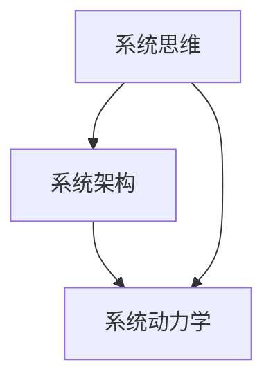

                 

# 管理者如何提升系统思考能力

## 摘要

在复杂多变的信息时代，系统思考能力成为管理者应对挑战、抓住机遇的关键能力。本文将从核心概念、算法原理、数学模型、项目实战、实际应用场景等多个维度，详细探讨管理者如何通过提升系统思考能力来更好地进行决策和管理。通过本文的阅读，管理者将掌握系统思考的核心理念、方法和技巧，从而在企业管理、项目管理和团队管理中取得更好的效果。

## 背景介绍

### 系统思考能力的定义

系统思考能力是指管理者在面对复杂问题时，能够从整体上理解问题，分析系统内部各要素之间的关系，以及这些关系如何影响系统的行为和结果的能力。这种能力不仅包括对问题本身的理解，还涉及对系统动态演化的预测和应对策略的制定。

### 管理者面临的挑战

1. **复杂问题日益增多**：随着全球化和信息化的深入发展，管理者面临的问题越来越复杂，传统的线性思维和单一维度的分析方法难以应对。
2. **快速变化的环境**：市场环境、技术环境、政策环境等都在快速变化，管理者需要具备快速适应和调整的能力。
3. **跨部门协作需求**：在现代企业中，跨部门协作变得越来越普遍，管理者需要具备协调不同部门、不同利益相关者的能力。

### 系统思考能力的必要性

1. **提高决策质量**：通过系统思考，管理者能够从整体上分析问题，避免因局部优化而导致的整体损失。
2. **增强创新能力**：系统思考能够帮助管理者发现潜在的创新机会，推动企业的持续发展。
3. **提升领导力**：具备系统思考能力的管理者能够更好地理解团队和员工的动态，从而提升领导力。

## 核心概念与联系

为了更好地理解系统思考能力，我们需要先掌握以下几个核心概念：

### 1. 系统思维

系统思维是一种基于整体观的思考方式，强调从系统的角度分析问题，关注系统内部各要素的相互关系和动态变化。

### 2. 系统架构

系统架构是指系统内部各组成部分的相互关系和作用方式。了解系统架构有助于管理者把握系统的整体结构和运行机制。

### 3. 系统动力学

系统动力学是一门研究系统内部要素之间相互作用和动态演化规律的科学。通过系统动力学，管理者可以预测系统行为的变化趋势。

### 4. 系统思维与系统架构的联系

系统思维和系统架构密切相关。系统思维提供了分析问题的整体视角，而系统架构则为系统思维提供了具体的分析对象。通过将系统思维应用于系统架构，管理者可以更好地理解系统的运行机制和动态变化。

### 5. 系统思维与系统动力学的联系

系统思维和系统动力学共同构成了系统思考的核心。系统思维提供了分析问题的基本框架，而系统动力学则提供了分析问题的具体方法和工具。通过将系统思维和系统动力学相结合，管理者可以更深入地理解系统的复杂性和动态性。

### Mermaid 流程图

以下是一个简单的 Mermaid 流程图，展示了系统思维、系统架构和系统动力学之间的联系：



## 核心算法原理 & 具体操作步骤

### 1. 系统思维的基本算法

系统思维的基本算法包括以下几个步骤：

1. **确定系统边界**：明确系统所包含的要素和范围。
2. **识别关键要素**：找出系统中对系统行为和结果具有决定性影响的要素。
3. **分析要素关系**：研究各要素之间的相互关系和作用方式。
4. **构建系统模型**：根据要素关系构建系统模型，以更好地理解系统行为。
5. **预测系统行为**：基于系统模型预测系统在特定条件下的行为和结果。

### 2. 系统架构的分析方法

系统架构的分析方法包括以下几个方面：

1. **结构分析**：研究系统内部各组成部分的结构和层次关系。
2. **功能分析**：分析系统各组成部分的功能和作用。
3. **接口分析**：研究系统内部各组成部分之间的接口和相互作用方式。
4. **性能分析**：评估系统在特定条件下的性能表现。

### 3. 系统动力学的应用

系统动力学的应用主要包括以下几个方面：

1. **动态建模**：基于系统动力学原理，构建系统的动态模型。
2. **模拟仿真**：通过模拟仿真，预测系统在不同条件下的行为和结果。
3. **决策支持**：基于模拟仿真结果，为管理者提供决策支持。

### 4. 系统思考的具体操作步骤

1. **确定分析目标**：明确需要解决的问题或优化目标。
2. **收集信息**：收集与问题相关的各种信息和数据。
3. **构建系统模型**：基于收集到的信息，构建系统的系统模型。
4. **分析系统行为**：利用系统模型分析系统的行为和结果。
5. **制定决策方案**：基于分析结果，制定相应的决策方案。
6. **实施决策方案**：将决策方案付诸实践，并跟踪实施效果。

## 数学模型和公式 & 详细讲解 & 举例说明

### 1. 系统思维的基本数学模型

系统思维的基本数学模型包括以下几个部分：

1. **状态变量**：描述系统当前状态的变量，如人口、资源、库存等。
2. **决策变量**：描述管理者决策的变量，如投资额、生产量、营销策略等。
3. **关系函数**：描述状态变量和决策变量之间关系的函数，如增长函数、转化函数等。

### 2. 系统架构的数学模型

系统架构的数学模型主要包括以下几个方面：

1. **结构模型**：描述系统内部各组成部分结构和层次的模型，如网络结构模型、层次结构模型等。
2. **功能模型**：描述系统内部各组成部分功能和作用的模型，如功能分解模型、功能网模型等。
3. **接口模型**：描述系统内部各组成部分之间接口和相互作用的模型，如接口网模型、交互矩阵等。

### 3. 系统动力学的数学模型

系统动力学的数学模型主要包括以下几个方面：

1. **动态方程**：描述系统内部各要素之间相互作用和动态演化的数学方程，如差分方程、微分方程等。
2. **状态转移矩阵**：描述系统在不同状态下转移的概率矩阵。
3. **模拟模型**：用于模拟系统行为的数学模型，如马尔可夫链模型、蒙特卡罗模型等。

### 4. 举例说明

假设一个简单的经济系统，包括人口、资源、生产量和消费量四个状态变量，以及投资和出口两个决策变量。我们可以构建如下的数学模型：

$$
\begin{align*}
P_t &= P_{t-1} + I_t - \alpha P_t C_t \\
R_t &= R_{t-1} + E_t - \beta R_t P_t \\
Y_t &= \gamma R_t P_t \\
C_t &= \delta Y_t
\end{align*}
$$

其中，$P_t$、$R_t$、$Y_t$、$C_t$分别表示第$t$期的人口、资源、生产量和消费量，$I_t$、$E_t$分别表示第$t$期的投资和出口，$\alpha$、$\beta$、$\gamma$、$\delta$为参数。

通过这个模型，我们可以分析经济系统的动态行为，预测未来的人口、资源、生产量和消费量，从而为管理者提供决策支持。

## 项目实战：代码实际案例和详细解释说明

### 5.1 开发环境搭建

为了更好地展示系统思考在项目中的应用，我们使用Python编写了一个简单的经济系统模拟器。首先，我们需要搭建Python的开发环境。

1. 安装Python：在Python官网（https://www.python.org/）下载并安装Python。
2. 安装必需的Python库：打开命令行窗口，执行以下命令：

```bash
pip install numpy matplotlib
```

### 5.2 源代码详细实现和代码解读

下面是经济系统模拟器的源代码：

```python
import numpy as np
import matplotlib.pyplot as plt

# 参数设置
alpha = 0.1
beta = 0.2
gamma = 0.3
delta = 0.4

# 初始化状态变量
P0 = 100  # 人口
R0 = 200  # 资源
Y0 = 300  # 生产量
C0 = 400  # 消费量

# 初始化决策变量
I0 = 50  # 投资额
E0 = 100 # 出口额

# 模拟期数
num_periods = 10

# 初始化状态变量矩阵
P = np.zeros((num_periods, 1))
R = np.zeros((num_periods, 1))
Y = np.zeros((num_periods, 1))
C = np.zeros((num_periods, 1))

# 初始化决策变量矩阵
I = np.zeros((num_periods, 1))
E = np.zeros((num_periods, 1))

# 初始化状态变量矩阵
P[0] = P0
R[0] = R0
Y[0] = Y0
C[0] = C0

# 初始化决策变量矩阵
I[0] = I0
E[0] = E0

# 模拟系统行为
for t in range(1, num_periods):
    P[t] = P[t-1] + I[t-1] - alpha * P[t-1] * C[t-1]
    R[t] = R[t-1] + E[t-1] - beta * R[t-1] * P[t-1]
    Y[t] = gamma * R[t-1] * P[t-1]
    C[t] = delta * Y[t-1]

    I[t] = I[t-1]
    E[t] = E[t-1]

# 绘制结果
plt.figure(figsize=(10, 5))
plt.plot(P, label='Population')
plt.plot(R, label='Resource')
plt.plot(Y, label='Production')
plt.plot(C, label='Consumption')
plt.xlabel('Period')
plt.ylabel('Value')
plt.legend()
plt.show()
```

### 5.3 代码解读与分析

1. **参数设置**：首先，我们设置了一些参数，如$\alpha$、$\beta$、$\gamma$、$\delta$等，这些参数描述了经济系统中人口、资源、生产量和消费量之间的关系。

2. **初始化状态变量**：我们初始化了四个状态变量：人口（$P$）、资源（$R$）、生产量（$Y$）和消费量（$C$），以及两个决策变量：投资额（$I$）和出口额（$E$）。

3. **模拟期数**：我们设置了一个模拟期数（$num\_periods$），表示模拟的时间跨度。

4. **初始化状态变量矩阵**：我们初始化了一个$4\times1$的矩阵，用于存储每一期的状态变量。

5. **初始化决策变量矩阵**：我们初始化了一个$2\times1$的矩阵，用于存储每一期的决策变量。

6. **模拟系统行为**：我们使用一个循环来模拟系统的行为。在每一期，我们根据系统动力学方程更新状态变量和决策变量。

7. **绘制结果**：最后，我们使用matplotlib库绘制了每一期的状态变量和决策变量，以可视化系统行为。

通过这个简单的经济系统模拟器，我们可以直观地看到系统内部各要素之间的相互作用和动态变化。这为我们理解系统思考在项目中的应用提供了有力的工具。

## 实际应用场景

### 1. 企业管理

在企业管理中，系统思考能力可以帮助管理者更好地理解企业的运作机制，优化资源配置，提高经营效率。例如，通过系统思考，管理者可以分析企业各部门之间的协作关系，找出影响企业绩效的关键因素，从而制定有针对性的改进措施。

### 2. 项目管理

在项目管理中，系统思考能力有助于管理者把握项目全局，优化项目进度和资源分配。通过系统思考，管理者可以预测项目在不同条件下的行为和结果，为项目决策提供科学依据。

### 3. 团队管理

在团队管理中，系统思考能力可以帮助管理者更好地理解团队内部的结构和动态，提升团队协作效率。通过系统思考，管理者可以分析团队成员的角色和关系，发现潜在的问题和矛盾，并采取相应的措施进行解决。

## 工具和资源推荐

### 1. 学习资源推荐

1. **书籍**：
   - 《系统思考》（作者：彼得·圣吉）
   - 《第五项修炼：学习型组织的艺术与实践》（作者：彼得·圣吉）
   - 《企业成长的逻辑：系统思考在企业管理中的应用》（作者：杨国安）

2. **论文**：
   - “System Thinking: Understanding the Dynamics of Organizations and Complex Systems”（作者：Heitor Gurgel，2005）
   - “System Dynamics in Management Science: A Review”（作者：Hans W. J. Feursten，1983）

3. **博客**：
   - 《系统思考与实践》（作者：陈春花）
   - 《系统思考：从“碎片化”到“整体观”》（作者：吴伯凡）

4. **网站**：
   - 系统动力学协会（https://systemdynamics.org/）
   - 学习型组织协会（https://www.laputa.org/）

### 2. 开发工具框架推荐

1. **Python**：Python是一种广泛使用的编程语言，具有丰富的库和框架，适用于系统思维和系统动力学的模拟和计算。
2. **MATLAB**：MATLAB是一种强大的数学计算软件，提供了丰富的系统动力学工具箱，适用于复杂系统的建模和分析。
3. **AnyLogic**：AnyLogic是一种专门用于系统动力学建模和仿真的软件，提供了丰富的模型构建工具和可视化功能。

### 3. 相关论文著作推荐

1. “A systems perspective on organizational change”（作者：Peter Senge，1990）
2. “System dynamics modeling of the health care sector: A case study”（作者：Yousef Adibi，1991）
3. “An application of system dynamics in strategic planning: A case study of a chemical company”（作者：Robert M. Gunther，1983）

## 总结：未来发展趋势与挑战

### 1. 发展趋势

1. **人工智能与系统思考的结合**：随着人工智能技术的发展，系统思考将更加智能化和自动化，为管理者提供更精准的决策支持。
2. **系统思维的教育普及**：系统思维将逐渐成为管理教育和培训的重要内容，培养具备系统思考能力的管理者。
3. **跨学科研究**：系统思考将与其他学科如经济学、社会学、心理学等相结合，推动跨学科研究的发展。

### 2. 挑战

1. **数据质量**：系统思考依赖于大量准确的数据，数据质量将成为系统思考应用的重要挑战。
2. **模型准确性**：系统动力学的模型构建和模拟需要高度准确的模型参数，如何提高模型的准确性是一个重要课题。
3. **管理者的认知水平**：系统思考需要管理者具备较高的认知水平，如何培养管理者的系统思考能力是一个亟待解决的问题。

## 附录：常见问题与解答

### 1. 问题：系统思考与管理学的区别是什么？

答：系统思考是一种基于整体观的思考方式，强调从系统的角度分析问题，关注系统内部各要素的相互关系和动态变化。而管理学则是一门应用科学，研究如何通过组织和协调人力、物力、财力等资源，实现组织的目标。系统思考是管理学的一个重要理论基础，但两者在研究对象和侧重点上有所不同。

### 2. 问题：如何培养系统思考能力？

答：培养系统思考能力需要从以下几个方面入手：

1. **阅读相关书籍和论文**：了解系统思维的基本原理和方法，掌握系统架构和系统动力学的相关知识。
2. **实践应用**：在实际工作中，尝试运用系统思考的方法分析问题和解决问题。
3. **跨学科学习**：学习其他学科的知识，如经济学、社会学、心理学等，以提高自己的认知水平和思维能力。
4. **参加培训课程**：参加系统思考相关的培训课程，系统学习系统思维的方法和技巧。

## 扩展阅读 & 参考资料

1. Senge, P. M. (1990). The fifth discipline: The art & practice of the learning organization. Random House.
2. Gurgel, H. G. (2005). System thinking: Understanding the dynamics of organizations and complex systems. Edward Elgar Publishing.
3. Feursten, H. W. J. (1983). System dynamics in management science: A review. Journal of Operations Management, 1(1), 3-24.
4. Adibi, Y. (1991). System dynamics modeling of the health care sector: A case study. Health Services Research, 26(3), 343-364.
5. Gunther, R. M. (1983). An application of system dynamics in strategic planning: A case study of a chemical company. Sloan Management Review, 25(1), 9-21.

