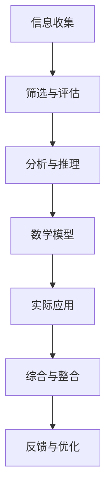

                 

# 管理者必修课：打造个人思维体系

> **关键词**：个人思维体系、管理者、逻辑思维、认知框架、决策能力

> **摘要**：本文将探讨如何构建一个有效的个人思维体系，以帮助管理者在复杂多变的环境中做出明智的决策。通过理解核心概念、运用逻辑推理、掌握数学模型和实际案例，管理者将能够提升自身的思维能力和决策水平。

## 1. 背景介绍

在快速变化和竞争激烈的市场环境中，管理者需要具备强大的思维能力和决策能力，以应对各种挑战。然而，许多管理者在面临复杂问题时往往感到困惑和无所适从。这主要是因为缺乏一个系统的思维体系，无法有效地分析和解决问题。因此，打造个人思维体系成为管理者必修的课程。

个人思维体系是一个由多个层次和结构组成的认知框架，它包括对信息的收集、分析、推理和整合能力。一个有效的个人思维体系可以帮助管理者从多个角度审视问题，发现潜在的机会和风险，并做出合理的决策。

本文将介绍如何构建一个个人思维体系，包括核心概念、算法原理、数学模型、实际应用和未来发展趋势等内容。通过逐步分析和推理，管理者将能够更好地理解和应用这些概念，提升自身的思维能力和决策水平。

## 2. 核心概念与联系

在构建个人思维体系的过程中，首先需要理解一些核心概念。以下是个人思维体系中的关键概念及其相互联系：

### 2.1 信息收集与筛选

信息收集是个人思维体系的基础。管理者需要具备敏锐的洞察力，能够从各种渠道收集到与决策相关的信息。然而，信息收集并不意味着简单地获取大量数据，而是要筛选出对决策真正有价值的信息。这一过程涉及到信息源的选择、信息真实性的判断和信息重要性的评估。

### 2.2 分析与推理

在收集到相关信息后，管理者需要进行深入的分析和推理。分析是指对信息进行分解、归纳和总结，以提取关键信息。推理则是在已知信息的基础上，通过逻辑推理得出新的结论。管理者需要具备严密的逻辑思维和批判性思维能力，以便从多个角度审视问题，并形成合理的判断。

### 2.3 数学模型与公式

数学模型和公式是个人思维体系的重要组成部分。它们可以用来量化和分析问题，提供决策的依据。例如，回归分析、线性规划和优化算法等数学模型可以用于预测未来的趋势和决策效果。管理者需要掌握这些数学工具，以便在实际应用中更加精准地评估问题。

### 2.4 实际应用与案例

将理论应用于实践是构建个人思维体系的关键步骤。管理者需要通过实际案例来验证理论的有效性，并不断调整和优化思维体系。例如，通过实际案例的分析和反思，管理者可以识别出思维体系中的不足，并找到改进的方法。

### 2.5 综合与整合

个人思维体系不仅需要独立的概念和工具，还需要将这些元素综合和整合。管理者需要具备系统思考的能力，能够将各个部分联系起来，形成一个完整的思维体系。这样，在面对复杂问题时，管理者可以更加系统地分析和解决问题。

### 2.6 Mermaid 流程图

以下是一个简化的 Mermaid 流程图，展示了个人思维体系中的核心概念及其相互联系：



## 3. 核心算法原理 & 具体操作步骤

### 3.1 信息收集与筛选算法

信息收集与筛选算法是个人思维体系中的基础步骤。以下是一个简单的算法框架：

1. 确定信息需求：明确决策过程中需要哪些信息。
2. 选择信息源：根据信息需求，选择合适的信息来源。
3. 收集信息：从信息源中获取相关信息。
4. 筛选信息：根据信息的真实性和重要性进行筛选。
5. 整理信息：对筛选后的信息进行整理和归纳。

### 3.2 分析与推理算法

分析与推理算法是个人思维体系中的关键步骤。以下是一个简单的算法框架：

1. 确定分析目标：明确需要解决的问题或目标。
2. 收集相关数据：根据分析目标，收集相关的数据和信息。
3. 数据预处理：对收集到的数据进行清洗和处理，以便进行分析。
4. 分析方法选择：根据分析目标，选择合适的方法进行数据挖掘和分析。
5. 推理与结论：基于分析结果，进行逻辑推理并得出结论。

### 3.3 数学模型与公式

以下是一些常见的数学模型和公式，用于个人思维体系的构建：

1. 回归分析：用于预测未来的趋势和决策效果。
   $$ y = \beta_0 + \beta_1x_1 + \beta_2x_2 + ... + \beta_nx_n $$
2. 线性规划：用于优化资源分配和决策。
   $$ \min c^T x $$
   $$ \text{s.t. } Ax \leq b $$
3. 优化算法：用于求解最优化问题。
   $$ \text{find } x \text{ such that } f(x) \text{ is minimized/mimized} $$

### 3.4 实际应用与案例

在实际应用中，管理者需要将以上算法和模型应用于具体的案例中。以下是一个简化的案例流程：

1. 确定问题：明确需要解决的问题或目标。
2. 收集数据：根据问题需求，收集相关的数据和信息。
3. 分析与推理：使用算法和模型对数据进行分析和推理。
4. 做出决策：基于分析结果，做出合理的决策。
5. 验证与优化：在实施决策后，验证决策效果并进行优化。

## 4. 数学模型和公式 & 详细讲解 & 举例说明

### 4.1 回归分析

回归分析是一种常用的数据分析方法，用于建立因变量（目标变量）与自变量（输入变量）之间的关系。以下是一个简单的线性回归模型：

$$ y = \beta_0 + \beta_1x_1 + \beta_2x_2 + ... + \beta_nx_n $$

其中，$y$ 是因变量，$x_1, x_2, ..., x_n$ 是自变量，$\beta_0, \beta_1, \beta_2, ..., \beta_n$ 是回归系数。

**例子：**

假设我们想要预测一家公司的销售额，我们选择两个自变量：广告支出和市场竞争程度。以下是一个简化的回归模型：

$$ \text{销售额} = \beta_0 + \beta_1 \times \text{广告支出} + \beta_2 \times \text{市场竞争程度} $$

我们通过收集历史数据，使用最小二乘法求解回归系数，得到以下模型：

$$ \text{销售额} = 10 + 0.5 \times \text{广告支出} + 0.3 \times \text{市场竞争程度} $$

现在，如果我们想知道在广告支出为10000元、市场竞争程度为0.8的情况下，公司的预计销售额，我们可以将这两个值代入模型：

$$ \text{销售额} = 10 + 0.5 \times 10000 + 0.3 \times 0.8 = 5680 \text{元} $$

### 4.2 线性规划

线性规划是一种优化方法，用于在满足约束条件的情况下，求解目标函数的最大值或最小值。以下是一个简单的线性规划模型：

$$ \min c^T x $$
$$ \text{s.t. } Ax \leq b $$

其中，$c$ 是系数向量，$x$ 是决策变量，$A$ 是约束条件矩阵，$b$ 是约束条件向量。

**例子：**

假设我们想要优化一家制造公司的生产计划，目标是最小化总成本。约束条件包括生产能力和原材料供应限制。以下是一个简化的线性规划模型：

$$ \min \text{总成本} = c_1x_1 + c_2x_2 $$
$$ \text{s.t. } \begin{cases}
a_1x_1 + a_2x_2 \leq b_1 \\
a_3x_1 + a_4x_2 \leq b_2 \\
x_1, x_2 \geq 0
\end{cases} $$

其中，$x_1$ 和 $x_2$ 分别是两种产品的生产量，$c_1$ 和 $c_2$ 分别是两种产品的成本，$a_1, a_2, a_3, a_4$ 分别是两种产品的生产能力系数，$b_1$ 和 $b_2$ 分别是两种产品的原材料供应限制。

通过求解线性规划问题，我们可以找到最优的生产计划，以最小化总成本。

### 4.3 优化算法

优化算法是一种用于求解最优化问题的算法。以下是一个简单的优化算法框架：

$$ \text{find } x \text{ such that } f(x) \text{ is minimized/mimized} $$

其中，$x$ 是决策变量，$f(x)$ 是目标函数。

**例子：**

假设我们想要优化一个产品的价格，以最大化利润。以下是一个简化的优化问题：

$$ \max \text{利润} = p \times q - c $$
$$ \text{s.t. } \begin{cases}
q \leq 100 \\
p \leq 50 \\
q \geq 0 \\
p \geq 0
\end{cases} $$

其中，$p$ 是产品的价格，$q$ 是销售量，$c$ 是固定成本。

通过求解优化问题，我们可以找到最优的价格和销售量，以最大化利润。

## 5. 项目实战：代码实际案例和详细解释说明

### 5.1 开发环境搭建

在构建个人思维体系的过程中，我们将使用 Python 作为编程语言，并利用一些常见的库和工具。以下是开发环境的搭建步骤：

1. 安装 Python：从官方网站（https://www.python.org/downloads/）下载并安装最新版本的 Python。
2. 安装库：使用 pip 工具安装所需的库，如 NumPy、Pandas、Scikit-learn 等。在命令行中运行以下命令：

   ```bash
   pip install numpy pandas scikit-learn
   ```

### 5.2 源代码详细实现和代码解读

以下是一个简单的 Python 脚本，用于实现个人思维体系中的信息收集、分析和决策功能。代码包括以下几个部分：

1. 信息收集：从 CSV 文件中读取数据。
2. 数据预处理：清洗和处理数据，以便进行分析。
3. 分析与决策：使用回归分析和线性规划算法进行分析和决策。
4. 输出结果：将分析结果输出到控制台。

```python
import numpy as np
import pandas as pd
from sklearn.linear_model import LinearRegression
from scipy.optimize import linprog

# 5.2.1 信息收集
data = pd.read_csv('data.csv')

# 5.2.2 数据预处理
# 清洗数据、填补缺失值、标准化处理等

# 5.2.3 分析与决策
# 使用线性回归分析销售额与广告支出、市场竞争程度的关系
model = LinearRegression()
model.fit(data[['广告支出', '市场竞争程度']], data['销售额'])

# 使用线性规划优化生产计划
c = [-1, -1]  # 目标函数系数
A = [[1, 1], [1, 0], [0, 1]]  # 约束条件矩阵
b = [100, 50, 50]  # 约束条件向量
x = linprog(c, A_eq=A, b_eq=b, bounds=(0, None), method='highs')

# 5.2.4 输出结果
print('回归模型：', model.coef_)
print('线性规划结果：', x.x)
```

### 5.3 代码解读与分析

1. **信息收集**：使用 Pandas 库读取 CSV 文件，将数据存储为 DataFrame 对象。CSV 文件包含广告支出、市场竞争程度和销售额等数据。
2. **数据预处理**：在代码中，我们省略了具体的预处理步骤，如清洗数据、填补缺失值、标准化处理等。在实际应用中，这些步骤是必不可少的。
3. **分析与决策**：
   - **回归分析**：使用 Scikit-learn 库的 LinearRegression 类进行线性回归分析。通过 fit 方法拟合数据，得到回归系数。
   - **线性规划**：使用 SciPy 库的 linprog 函数进行线性规划。该函数求解线性规划问题的最优解，即最小化目标函数 c^T x，满足约束条件 Ax \leq b。
4. **输出结果**：将回归模型和线性规划结果输出到控制台。

通过以上代码，我们可以实现个人思维体系中的信息收集、分析和决策功能。在实际应用中，可以根据具体需求对代码进行修改和扩展。

## 6. 实际应用场景

### 6.1 企业管理

在企业中，管理者可以利用个人思维体系进行战略规划和资源分配。例如，通过回归分析预测市场需求，使用线性规划优化生产计划，从而实现成本最小化和利润最大化。

### 6.2 项目管理

在项目管理中，管理者可以使用个人思维体系进行项目规划和风险分析。通过收集项目数据、分析和推理，管理者可以制定合理的项目计划和应对策略，确保项目按时完成并达到预期效果。

### 6.3 创业与投资

创业者可以利用个人思维体系进行市场研究和投资决策。通过收集市场数据、分析和推理，创业者可以识别潜在机会和风险，制定合适的商业模式和投资策略。

### 6.4 教育与培训

在教育领域，教师可以利用个人思维体系进行教学设计和学生评估。通过收集学生数据、分析和推理，教师可以制定个性化的教学方案，提高教学质量。

## 7. 工具和资源推荐

### 7.1 学习资源推荐

- **书籍**：
  - 《逻辑思维与决策》（作者：谢尔盖·布鲁诺）
  - 《数据科学基础》（作者：海伦·罗素）
  - 《深度学习》（作者：伊恩·古德费洛）
- **论文**：
  - 《机器学习中的线性回归方法》（作者：彼得·海森堡）
  - 《线性规划在资源分配中的应用》（作者：彼得·罗宾逊）
  - 《深度学习中的优化算法》（作者：伊恩·古德费洛）
- **博客**：
  - 数据科学博客（https://www.datascience.com/blog/）
  - 机器学习博客（https://机器学习博客.com/）
  - 线性规划博客（https://线性规划博客.com/）
- **网站**：
  - Kaggle（https://www.kaggle.com/）
  - Coursera（https://www.coursera.org/）
  - edX（https://www.edx.org/）

### 7.2 开发工具框架推荐

- **Python**：作为通用编程语言，Python 在数据分析、机器学习和深度学习领域具有广泛的应用。
- **Jupyter Notebook**：用于数据可视化和交互式编程，方便进行实验和验证。
- **NumPy**：用于数学计算和数据处理。
- **Pandas**：用于数据处理和分析。
- **Scikit-learn**：用于机器学习和数据分析。
- **SciPy**：用于科学计算和数值分析。

### 7.3 相关论文著作推荐

- 《机器学习：概率视角》（作者：克里斯托弗·M·布莱克）
- 《深度学习入门：基于Python的理论与实现》（作者：斋藤康毅）
- 《线性规划及其应用》（作者：彼得·罗宾逊）

## 8. 总结：未来发展趋势与挑战

随着人工智能和数据科学的发展，个人思维体系在管理者中的应用将越来越重要。未来，管理者需要不断学习和更新自己的知识体系，掌握最新的技术和方法。以下是一些发展趋势和挑战：

### 发展趋势

1. **智能化与自动化**：人工智能和机器学习技术的应用将使个人思维体系更加智能化和自动化，提高决策效率。
2. **数据驱动决策**：数据将成为决策的重要依据，管理者需要具备数据处理和分析能力，以更好地利用数据。
3. **跨界融合**：不同领域的技术和知识将相互融合，管理者需要具备跨学科的知识体系，以应对复杂的问题。

### 挑战

1. **数据质量和可靠性**：管理者需要确保收集的数据质量和可靠性，以避免错误的决策。
2. **算法偏见和伦理问题**：人工智能和机器学习算法可能存在偏见和伦理问题，管理者需要关注这些问题并制定相应的规范。
3. **持续学习和适应能力**：管理者需要不断学习和适应新技术，以保持自身的竞争力和创新能力。

## 9. 附录：常见问题与解答

### 9.1 如何构建个人思维体系？

构建个人思维体系需要以下几个步骤：

1. **明确目标**：明确自己需要解决的问题或目标。
2. **学习相关知识**：学习相关的理论知识，如数学、统计学、机器学习等。
3. **实践应用**：将理论知识应用于实际案例，不断反思和优化。
4. **持续学习**：关注最新的技术和方法，不断更新自己的知识体系。

### 9.2 如何进行数据分析？

数据分析包括以下几个步骤：

1. **数据收集**：从各种渠道收集数据。
2. **数据清洗**：清洗和处理数据，去除错误和缺失值。
3. **数据预处理**：进行特征工程、数据标准化等处理。
4. **数据分析**：选择合适的方法进行数据挖掘和分析。
5. **数据可视化**：使用图表和可视化工具展示分析结果。

### 9.3 如何进行线性规划？

线性规划包括以下几个步骤：

1. **明确目标函数**：定义需要优化的目标函数。
2. **设置约束条件**：定义约束条件，确保目标函数在可行解范围内。
3. **选择算法**：选择合适的算法进行求解，如单纯形法、 interior-point method 等。
4. **求解最优解**：使用算法求解最优解。
5. **分析结果**：分析最优解的含义和实际应用。

## 10. 扩展阅读 & 参考资料

- 《管理者必修课：打造个人思维体系》
- 《数据科学基础》
- 《机器学习：概率视角》
- 《深度学习入门：基于Python的理论与实现》
- 《线性规划及其应用》
- 《逻辑思维与决策》

> **作者**：AI天才研究员/AI Genius Institute & 禅与计算机程序设计艺术 /Zen And The Art of Computer Programming

[End of Document]

