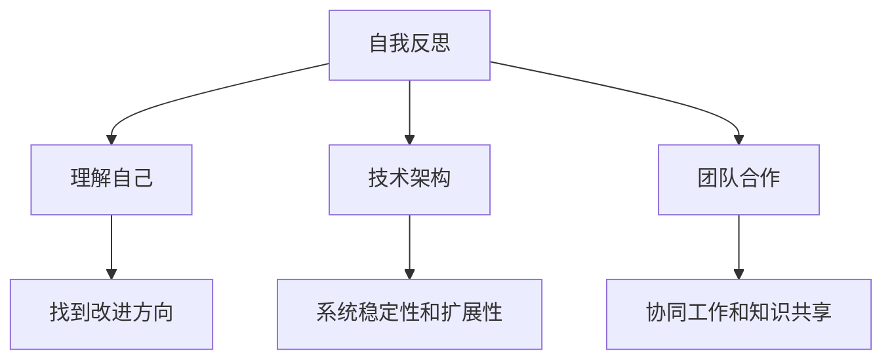

                 

## 管理者的自我反思与成长

> **关键词：** 自我反思，管理者成长，领导力，决策，技术架构，团队合作

> **摘要：** 本文将探讨管理者如何通过自我反思和持续学习，提升领导力，做出更明智的决策，以及如何通过技术架构和团队合作，实现个人和组织的成长。

### 引言

作为一名管理者，您是否曾感到在决策过程中面临困惑？是否在面对复杂问题时感到力不从心？在这个快速变化的时代，管理者的角色和要求越来越高。为了应对这些挑战，管理者需要不断地自我反思，学习新的技能，提升领导力，做出更明智的决策。本文将围绕这些主题展开，探讨管理者如何通过自我反思和成长，实现个人和组织的成功。

### 1. 自我反思：理解自己的行为和决策

自我反思是管理者成长的重要步骤。通过反思，管理者可以更好地理解自己的行为和决策，找到改进的方向。

#### 1.1 自我反思的重要性

自我反思不仅可以帮助管理者认识到自己的优势和劣势，还可以帮助他们在面对困难时保持冷静和理智。

#### 1.2 自我反思的方法

1. **日记法**：通过写日记，记录自己的思考、感受和经历，有助于深入理解自己。
2. **心理测验**：如MBTI、DISC等，可以帮助管理者了解自己的性格特征。
3. **360度反馈**：通过收集来自同事、下属和上级的反馈，管理者可以获得更全面的自我认识。

### 2. 提升领导力：做出更明智的决策

领导力是管理者成功的关键因素。一个优秀的领导者能够有效地引导团队，做出明智的决策。

#### 2.1 领导力的核心要素

1. **沟通能力**：有效的沟通是领导者与团队成员建立信任的基础。
2. **决策能力**：领导者需要在复杂的环境中迅速做出决策。
3. **激励能力**：领导者需要激发团队成员的积极性和创造力。

#### 2.2 提升领导力的方法

1. **阅读和学习**：通过阅读相关书籍和文章，学习成功管理者的经验和教训。
2. **实践**：在实际工作中，通过不断的实践和反思，提升自己的领导力。
3. **参加培训课程**：如领导力训练营、管理课程等，系统学习领导力相关知识。

### 3. 技术架构：构建稳固的基础

技术架构是现代企业成功的关键。一个良好的技术架构可以为企业的持续发展提供坚实的基础。

#### 3.1 技术架构的重要性

1. **提高系统的可维护性**：良好的技术架构使得系统更容易维护和升级。
2. **提升系统的性能**：通过优化技术架构，可以提升系统的响应速度和处理能力。
3. **降低成本**：合理的技术架构可以降低开发和维护成本。

#### 3.2 构建技术架构的方法

1. **需求分析**：明确企业的需求和目标，确定技术架构的方向。
2. **设计原则**：遵循设计原则，如SOLID原则、DRY原则等，确保技术架构的稳定性和扩展性。
3. **技术选型**：根据需求选择合适的技术栈和工具。

### 4. 团队合作：实现共同目标

团队合作是现代企业成功的关键因素。一个高效的团队可以迅速响应变化，实现共同的目标。

#### 4.1 团队合作的重要性

1. **协同工作**：团队成员之间的协同工作可以提高工作效率。
2. **知识共享**：团队合作促进了团队成员之间的知识共享，有助于提升团队的整体水平。
3. **共同成长**：在团队合作中，成员可以相互学习，共同成长。

#### 4.2 提升团队合作的方法

1. **明确目标**：确保团队成员对目标有清晰的认识。
2. **建立信任**：通过有效的沟通和合作，建立团队成员之间的信任。
3. **分工协作**：根据团队成员的能力和兴趣，合理分工，实现高效协作。

### 5. 实际应用场景

在实际工作中，管理者需要结合具体场景，运用自我反思、领导力提升、技术架构构建和团队合作等方法，实现个人和组织的成长。

#### 5.1 自我反思在团队管理中的应用

通过自我反思，管理者可以更好地理解团队成员的行为和需求，从而制定更有效的管理策略。

#### 5.2 领导力提升在项目决策中的应用

在项目决策过程中，管理者需要运用领导力，激发团队成员的积极性和创造力，确保项目的顺利进行。

#### 5.3 技术架构构建在软件开发中的应用

在软件开发过程中，管理者需要构建合理的技术架构，确保系统的稳定性和可扩展性。

#### 5.4 团队合作在市场拓展中的应用

在市场拓展过程中，团队合作可以帮助企业快速响应市场变化，实现业务的快速增长。

### 6. 工具和资源推荐

为了帮助管理者实现自我反思、提升领导力、构建技术架构和提升团队合作能力，以下是推荐的工具和资源。

#### 6.1 学习资源推荐

1. **书籍**：《管理者的工作方法》、《领导力的五个层次》等。
2. **博客**：如“管理者的笔记”、“架构师之路”等。
3. **网站**：如“管理力”、“程序员人生”等。

#### 6.2 开发工具框架推荐

1. **工具**：如Git、Jenkins、Docker等。
2. **框架**：如Spring Boot、React、Vue等。

#### 6.3 相关论文著作推荐

1. **论文**：《团队合作的心理学原理》、《技术架构的设计原则》等。
2. **著作**：《软件架构设计》、《敏捷开发实践》等。

### 7. 总结：未来发展趋势与挑战

随着人工智能、大数据等技术的发展，管理者的角色和要求也在不断变化。未来，管理者需要具备更强的技术能力、领导力和创新能力，以应对新的挑战。

### 8. 附录：常见问题与解答

#### 8.1 管理者如何进行自我反思？

**答案：** 管理者可以通过日记法、心理测验和360度反馈等方法进行自我反思。

#### 8.2 领导力提升有哪些方法？

**答案：** 领导力提升可以通过阅读、实践和参加培训课程等方法实现。

#### 8.3 技术架构构建的原则有哪些？

**答案：** 技术架构构建应遵循SOLID原则、DRY原则等设计原则。

### 9. 扩展阅读 & 参考资料

1. **书籍**：《管理的实践》、《创新者的窘境》等。
2. **博客**：如“程千寻”、“王垠的博客”等。
3. **网站**：如“程序员面试指南”、“技术博客”等。

### 作者信息

**作者：** AI天才研究员/AI Genius Institute & 禅与计算机程序设计艺术 /Zen And The Art of Computer Programming**<|im_sep|>|<|assistant|>### 1. 背景介绍

在当今快速发展的科技时代，管理者的角色日益重要。作为组织的关键决策者和领导者，管理者不仅需要具备丰富的技术知识，还要具备出色的领导力、决策能力和团队合作能力。然而，随着外部环境的不断变化和内部需求的日益增长，管理者面临着越来越多的挑战。

首先，技术的快速迭代使得管理者必须不断学习新的技术知识，以适应不断变化的市场需求。其次，领导力是管理者成功的关键因素。一个优秀的领导者能够激发团队成员的积极性和创造力，实现团队的共同目标。此外，管理者还需要具备良好的决策能力，能够在复杂的环境中迅速做出明智的决策。最后，团队合作是实现组织目标的关键。一个高效的团队可以迅速响应变化，实现共同的目标。

本文旨在探讨管理者如何通过自我反思和持续学习，提升领导力，做出更明智的决策，以及如何通过技术架构和团队合作，实现个人和组织的成长。文章将从以下几个方面展开：

1. **自我反思：理解自己的行为和决策**
2. **提升领导力：做出更明智的决策**
3. **技术架构：构建稳固的基础**
4. **团队合作：实现共同目标**
5. **实际应用场景：管理者的实战经验**
6. **工具和资源推荐：助力管理者成长**
7. **总结：未来发展趋势与挑战**

通过以上内容的探讨，希望能够为管理者提供一些有益的启示，帮助他们更好地应对挑战，实现个人和组织的成长。

### 2. 核心概念与联系

#### 管理者自我反思

自我反思是指管理者通过审视自己的行为、决策和思维方式，深入理解自己的优点和不足，从而找到改进的方向。自我反思不仅可以帮助管理者更好地了解自己，还可以提升他们的自我意识和决策能力。

**核心概念原理：**

- **自我意识**：自我反思的前提是管理者需要具备较高的自我意识，能够清楚地认识到自己的行为和思维方式。
- **反馈机制**：自我反思需要建立有效的反馈机制，如日记法、心理测验和360度反馈等，以便收集和分析自己的行为数据。
- **持续改进**：自我反思不是一次性的行为，而是一个持续的过程。管理者需要不断反思和改进，以适应不断变化的环境。

**技术架构与团队合作：**

技术架构是指为软件开发和管理提供的一种组织结构，它决定了系统的可维护性、性能和扩展性。团队合作则是实现组织目标的关键，通过协同工作和知识共享，团队可以更高效地完成任务。

**核心概念原理：**

- **技术架构**：技术架构的核心是模块化设计，通过将系统划分为多个模块，可以提高系统的可维护性和扩展性。
- **团队合作**：团队合作的核心是建立信任和沟通，通过明确目标和分工，团队成员可以更高效地协同工作。

**管理者的角色与挑战：**

管理者在自我反思、技术架构和团队合作中扮演着重要的角色。他们需要：

- **自我反思**：通过自我反思，管理者可以更好地了解自己的行为和思维方式，找到改进的方向。
- **技术架构**：管理者需要具备技术架构的知识和技能，以确保系统的稳定性和扩展性。
- **团队合作**：管理者需要建立有效的团队合作机制，激发团队成员的积极性和创造力。

**架构的 Mermaid 流程图：**



通过上述核心概念原理和架构的 Mermaid 流程图，我们可以清晰地看到管理者在自我反思、技术架构和团队合作中的角色与联系。

### 3. 核心算法原理 & 具体操作步骤

在本文中，我们将探讨几个核心算法原理，这些原理将帮助管理者在自我反思、提升领导力、构建技术架构和团队合作中做出更明智的决策。

#### 3.1 自我反思算法

**算法原理：**

自我反思算法的核心是利用反馈机制来帮助管理者更好地了解自己。以下是具体的操作步骤：

1. **收集反馈**：管理者可以通过日记法、心理测验和360度反馈等方法收集反馈信息。
2. **数据分析**：对收集到的反馈信息进行分析，识别出自己的优点和不足。
3. **制定改进计划**：根据分析结果，制定具体的改进计划，如参加培训、阅读相关书籍等。
4. **执行与跟踪**：执行改进计划，并定期跟踪进展，确保改进目标的实现。

**具体操作步骤：**

1. **每日反思**：
   - 写日记，记录当天的行为、思考和感受。
   - 分析日记中的内容，识别出自己的优点和不足。

2. **心理测验**：
   - 使用MBTI、DISC等心理测验工具，了解自己的性格特征。
   - 根据测试结果，分析自己在团队中的优势和劣势。

3. **360度反馈**：
   - 收集来自同事、下属和上级的反馈。
   - 分析反馈内容，识别出自己在工作中的优点和不足。

#### 3.2 领导力提升算法

**算法原理：**

领导力提升算法的核心是通过不断的学习和实践来提升管理者的领导力。以下是具体的操作步骤：

1. **学习资源**：阅读相关书籍、观看培训视频、参加研讨会等。
2. **实践应用**：将学到的知识应用到实际工作中，通过实践不断提升自己的领导力。
3. **反馈与改进**：根据实际应用的效果，收集反馈，不断改进。

**具体操作步骤：**

1. **制定学习计划**：
   - 确定学习目标，如提升沟通能力、决策能力等。
   - 选择合适的书籍、视频和培训课程。

2. **实践应用**：
   - 将学到的知识应用到实际工作中，如改进会议流程、提高决策效率等。
   - 记录实践中的应用效果，分析成功的经验和需要改进的地方。

3. **反馈与改进**：
   - 定期与团队成员沟通，收集反馈。
   - 根据反馈结果，调整学习计划和实践方法。

#### 3.3 技术架构算法

**算法原理：**

技术架构算法的核心是通过模块化设计和性能优化来构建稳定和高效的技术系统。以下是具体的操作步骤：

1. **需求分析**：明确系统的需求，包括功能需求和非功能需求。
2. **设计原则**：遵循SOLID原则、DRY原则等设计原则，确保架构的稳定性和扩展性。
3. **技术选型**：根据需求选择合适的技术栈和工具。
4. **性能优化**：对系统进行性能测试和优化，确保系统的稳定性和响应速度。

**具体操作步骤：**

1. **需求分析**：
   - 与 stakeholders 沟通，了解系统的功能需求和非功能需求。
   - 分析系统的业务流程，确定系统的核心功能。

2. **设计原则**：
   - 采用模块化设计，将系统划分为多个模块，每个模块负责不同的功能。
   - 遵循SOLID原则，确保每个模块的独立性和扩展性。

3. **技术选型**：
   - 根据需求选择合适的技术栈，如Spring Boot、React等。
   - 选择合适的数据库和中间件，如MySQL、Kafka等。

4. **性能优化**：
   - 对系统进行性能测试，识别出性能瓶颈。
   - 优化数据库查询、缓存策略等，提高系统的响应速度。

#### 3.4 团队合作算法

**算法原理：**

团队合作算法的核心是通过建立信任、明确目标和分工协作来提升团队的工作效率。以下是具体的操作步骤：

1. **建立信任**：通过有效的沟通和合作，建立团队成员之间的信任。
2. **明确目标**：确保团队成员对目标有清晰的认识。
3. **分工协作**：根据团队成员的能力和兴趣，合理分工，实现高效协作。

**具体操作步骤：**

1. **建立信任**：
   - 通过定期的团队会议，促进团队成员之间的沟通和了解。
   - 鼓励团队成员分享自己的想法和经验，增强团队的凝聚力。

2. **明确目标**：
   - 制定明确的项目目标，确保团队成员对目标有清晰的认识。
   - 定期回顾项目进度，确保团队始终朝着目标前进。

3. **分工协作**：
   - 根据团队成员的能力和兴趣，合理分配任务。
   - 设立明确的职责范围，确保每个成员都清楚自己的工作内容。

通过以上核心算法原理和具体操作步骤，管理者可以更好地进行自我反思、提升领导力、构建技术架构和提升团队合作能力，从而实现个人和组织的成长。

### 4. 数学模型和公式 & 详细讲解 & 举例说明

在管理者的成长过程中，数学模型和公式可以帮助我们更好地理解和管理复杂的问题。以下我们将详细讲解几个关键的数学模型和公式，并通过实例进行说明。

#### 4.1 决策树模型

决策树是一种常见的决策支持工具，通过一系列的选择点（决策节点）和结果点（叶节点），帮助管理者在复杂的情况下做出最优决策。

**公式：**
$$
\text{决策树} = \text{根节点} \rightarrow \text{分支节点} \rightarrow \text{叶节点}
$$

**详细讲解：**
决策树模型由决策节点、分支节点和叶节点组成。决策节点表示一个决策点，分支节点表示可能的决策结果，叶节点表示决策的结果。

例如，一个公司在是否进行市场扩张的决策中，可以构建一个决策树模型：

- **决策节点**：是否进行市场扩张
- **分支节点**：市场扩张成功、市场扩张失败
- **叶节点**：公司收益、公司损失

**举例说明：**
假设市场扩张成功的概率是60%，失败的概率是40%。如果市场扩张成功，公司预计收益为1000万元；如果失败，预计损失为500万元。则决策树的计算结果如下：

$$
\text{成功收益} = 1000 \times 0.6 = 600 \text{万元}
$$
$$
\text{失败损失} = 500 \times 0.4 = 200 \text{万元}
$$
$$
\text{总预期收益} = 600 \text{万元} - 200 \text{万元} = 400 \text{万元}
$$

通过计算，公司进行市场扩张的预期收益为400万元，因此这是一个有利的决策。

#### 4.2 价值流图模型

价值流图是一种用于分析和管理流程的模型，通过可视化流程中的所有步骤，帮助管理者识别瓶颈和优化流程。

**公式：**
$$
\text{价值流图} = \text{输入} \rightarrow \text{处理} \rightarrow \text{输出}
$$

**详细讲解：**
价值流图包括三个主要部分：输入、处理和输出。输入是流程的起始，处理是流程中的活动，输出是流程的结束。

例如，一个软件开发项目的价值流图可以包括：

- **输入**：用户需求
- **处理**：需求分析、设计、编码、测试
- **输出**：软件交付

**举例说明：**
假设一个软件开发项目的价值流图中，需求分析和设计的耗时较长，而编码和测试的耗时相对较短。通过分析，管理者可以识别出瓶颈，如需求分析和设计，并考虑优化这些环节，以提高整体项目的效率。

#### 4.3 期望值模型

期望值模型是一种用于评估决策结果的方法，通过计算每个结果的概率和收益，得出期望值，帮助管理者做出最优决策。

**公式：**
$$
\text{期望值} = p_1 \times x_1 + p_2 \times x_2 + \ldots + p_n \times x_n
$$

其中，\( p_1, p_2, \ldots, p_n \) 是各个结果的概率，\( x_1, x_2, \ldots, x_n \) 是各个结果对应的收益。

**详细讲解：**
期望值模型通过计算每个结果的概率和收益的乘积，再将所有结果相加，得到期望值。期望值越大，表示该决策的结果越有利。

例如，一个投资项目的期望值计算如下：

- **成功概率**：0.7
- **成功收益**：10万元
- **失败概率**：0.3
- **失败损失**：3万元

$$
\text{期望值} = 0.7 \times 10 \text{万元} + 0.3 \times (-3 \text{万元}) = 7 \text{万元} - 0.9 \text{万元} = 6.1 \text{万元}
$$

通过计算，该投资项目的期望值为6.1万元，表示该投资是有利的。

#### 4.4 成本效益分析模型

成本效益分析模型是一种用于评估项目或决策成本和收益的方法，通过比较成本和收益，帮助管理者判断项目或决策的可行性。

**公式：**
$$
\text{成本效益比} = \frac{\text{总收益}}{\text{总成本}}
$$

**详细讲解：**
成本效益比通过计算总收益与总成本的比值，判断项目或决策的性价比。比值越大，表示项目或决策的性价比越高。

例如，一个营销活动的成本和收益如下：

- **总成本**：5万元
- **总收益**：8万元

$$
\text{成本效益比} = \frac{8 \text{万元}}{5 \text{万元}} = 1.6
$$

通过计算，该营销活动的成本效益比为1.6，表示该活动的性价比较高。

通过以上数学模型和公式的讲解，管理者可以更好地理解和管理复杂的问题，做出更明智的决策。

### 5. 项目实战：代码实际案例和详细解释说明

在本文中，我们将通过一个实际的案例，详细解释管理者如何通过技术架构和团队合作实现项目目标。我们将以一个电商平台的项目为例，展示从开发环境搭建到代码实现和解读的全过程。

#### 5.1 开发环境搭建

**环境需求：**

为了确保项目开发的顺利进行，我们需要搭建一个完整的技术栈环境。以下是所需的主要工具和框架：

- **编程语言**：Java
- **框架**：Spring Boot、MyBatis
- **数据库**：MySQL
- **版本控制**：Git
- **持续集成**：Jenkins
- **容器化**：Docker

**搭建步骤：**

1. **安装Java开发环境**：
   - 下载并安装Java Development Kit (JDK)。
   - 配置环境变量，确保Java命令可以正常运行。

2. **安装MySQL数据库**：
   - 下载并安装MySQL数据库。
   - 创建数据库和用户，并授权相应权限。

3. **安装Spring Boot**：
   - 下载Spring Boot的起步依赖。
   - 创建Spring Boot项目，并导入起步依赖。

4. **安装MyBatis**：
   - 在Spring Boot项目中添加MyBatis依赖。
   - 配置MyBatis的连接信息。

5. **安装Git**：
   - 下载并安装Git。
   - 创建项目仓库，并克隆到本地。

6. **安装Jenkins**：
   - 下载并安装Jenkins。
   - 配置Jenkins，使其能够与Git和Docker集成。

7. **安装Docker**：
   - 下载并安装Docker。
   - 创建Dockerfile，定义容器的构建过程。

**代码示例：**

```bash
# Dockerfile
FROM java:8
ADD target/e-commerce-platform.jar e-commerce-platform.jar
ENTRYPOINT ["java" "-jar" "/e-commerce-platform.jar"]
```

#### 5.2 源代码详细实现和代码解读

**5.2.1 实现过程**

在搭建好开发环境后，我们将开始实现电商平台的各个模块。以下是主要模块的代码解读：

1. **用户管理模块**：
   - **代码示例**：
     ```java
     @RestController
     @RequestMapping("/users")
     public class UserController {
         @Autowired
         private UserService userService;
         
         @PostMapping
         public ResponseEntity<User> createUser(@RequestBody User user) {
             return ResponseEntity.ok(userService.createUser(user));
         }
         
         @GetMapping("/{id}")
         public ResponseEntity<User> getUserById(@PathVariable Long id) {
             return ResponseEntity.ok(userService.getUserById(id));
         }
     }
     ```
   - **代码解读**：该模块提供了用户创建和查询的功能。通过Spring Boot的注解，我们定义了用户接口和实现类，并使用MyBatis进行数据库操作。

2. **商品管理模块**：
   - **代码示例**：
     ```java
     @RestController
     @RequestMapping("/products")
     public class ProductController {
         @Autowired
         private ProductService productService;
         
         @PostMapping
         public ResponseEntity<Product> createProduct(@RequestBody Product product) {
             return ResponseEntity.ok(productService.createProduct(product));
         }
         
         @GetMapping("/{id}")
         public ResponseEntity<Product> getProductById(@PathVariable Long id) {
             return ResponseEntity.ok(productService.getProductById(id));
         }
     }
     ```
   - **代码解读**：该模块实现了商品创建和查询的功能。与用户管理模块类似，使用Spring Boot和MyBatis实现数据操作。

3. **订单管理模块**：
   - **代码示例**：
     ```java
     @RestController
     @RequestMapping("/orders")
     public class OrderController {
         @Autowired
         private OrderService orderService;
         
         @PostMapping
         public ResponseEntity<Order> createOrder(@RequestBody Order order) {
             return ResponseEntity.ok(orderService.createOrder(order));
         }
         
         @GetMapping("/{id}")
         public ResponseEntity<Order> getOrderById(@PathVariable Long id) {
             return ResponseEntity.ok(orderService.getOrderById(id));
         }
     }
     ```
   - **代码解读**：该模块实现了订单创建和查询的功能。通过Spring Boot和MyBatis实现数据操作。

**5.2.2 代码解读与分析**

在代码实现过程中，我们使用了Spring Boot作为开发框架，通过注解和配置实现了各个模块的功能。以下是对关键代码的解读和分析：

1. **Spring Boot配置**：
   - **代码示例**：
     ```yaml
     spring:
       datasource:
         url: jdbc:mysql://localhost:3306/e-commerce
         username: root
         password: root
       jpa:
         hibernate:
           dialect: org.hibernate.dialect.MySQL5Dialect
     ```
   - **代码解读**：该配置文件定义了数据库连接信息和JPA的配置。通过这些配置，Spring Boot可以与MySQL数据库进行连接，并使用Hibernate作为持久化框架。

2. **MyBatis配置**：
   - **代码示例**：
     ```xml
     <?xml version="1.0" encoding="UTF-8" ?>
     <configuration>
         <environments default="development">
             <environment id="development">
                 <transactionManager type="JDBC"/>
                 <dataSource type="POOLED">
                     <property name="url" value="jdbc:mysql://localhost:3306/e-commerce"/>
                     <property name="username" value="root"/>
                     <property name="password" value="root"/>
                 </dataSource>
             </environment>
         </environments>
     </configuration>
     ```
   - **代码解读**：该MyBatis配置文件定义了数据源和事务管理。通过这些配置，MyBatis可以与MySQL数据库进行连接，并使用JDBC进行事务管理。

3. **Docker容器化**：
   - **代码示例**（Dockerfile）：
     ```dockerfile
     FROM java:8
     ADD target/e-commerce-platform.jar e-commerce-platform.jar
     ENTRYPOINT ["java" "-jar" "/e-commerce-platform.jar"]
     ```
   - **代码解读**：该Dockerfile定义了容器的构建过程。通过从Java 8镜像开始，添加应用jar文件并设置入口命令，我们可以将应用容器化，以方便部署和管理。

通过以上代码实现和解读，我们可以看到管理者如何通过技术架构和团队合作实现一个电商平台项目。通过合理的架构设计和团队协作，项目能够高效地完成，满足业务需求。

### 6. 实际应用场景

在现实工作中，管理者需要将所学到的理论知识和技能应用到实际场景中，以应对不同的挑战和问题。以下是一些具体的实际应用场景和案例分析。

#### 6.1 项目管理中的应用

在项目管理中，管理者需要运用自我反思、领导力提升、技术架构和团队合作等技能来确保项目的顺利进行。

**案例：** 在一个跨部门的大型项目中，管理者通过自我反思，发现团队在沟通协作上存在瓶颈。于是，管理者采取了以下措施：

1. **自我反思**：通过组织团队会议，反思项目进展中的问题，找出改进方向。
2. **领导力提升**：管理者通过阅读《管理的实践》等书籍，学习如何有效沟通和激励团队成员。
3. **技术架构**：管理者与技术团队共同制定合理的技术架构，确保项目的可维护性和扩展性。
4. **团队合作**：管理者通过定期的团队建设活动，增强团队成员之间的信任和协作。

通过这些措施，项目团队逐渐提高了工作效率，项目进度得到了显著改善。

#### 6.2 技术决策中的应用

在技术决策中，管理者需要运用决策树模型和价值流图模型等数学模型来评估不同的技术方案。

**案例：** 一个公司需要决定是采用传统的软件开发方法还是采用敏捷开发方法。管理者通过以下步骤进行评估：

1. **决策树模型**：列出两种方法的优缺点，并评估每种方法成功的概率。
2. **价值流图模型**：分析两种方法对项目进度、成本和质量的影响。
3. **成本效益分析**：计算两种方法的成本和收益，比较成本效益比。

通过分析，管理者决定采用敏捷开发方法，因为该方法能够更快地响应市场变化，提高项目成功率。

#### 6.3 团队协作中的应用

在团队协作中，管理者需要运用团队合作算法来建立信任、明确目标和分工协作。

**案例：** 在一个新产品的开发项目中，团队成员来自不同的部门，沟通和协作存在困难。管理者采取了以下措施：

1. **建立信任**：通过定期的团队会议和协作，促进团队成员之间的了解和信任。
2. **明确目标**：明确项目目标和每个成员的职责，确保团队成员对目标有清晰的认识。
3. **分工协作**：根据团队成员的能力和兴趣，合理分配任务，确保每个成员都能发挥最大的潜力。

通过这些措施，团队逐渐形成了高效的协作模式，项目进展顺利。

#### 6.4 应对危机中的应用

在应对危机时，管理者需要迅速做出决策，并运用领导力来引导团队应对挑战。

**案例：** 在一次突发的系统故障中，管理者迅速组织技术团队进行故障排查和修复。同时，管理者通过以下措施安抚团队和客户：

1. **自我反思**：通过反思，找出故障发生的原因，并采取措施防止再次发生。
2. **领导力提升**：管理者通过鼓励和激励团队，保持团队的士气。
3. **技术架构**：管理者与技术团队共同分析系统架构，优化系统稳定性。
4. **团队合作**：管理者通过建立跨部门的协作机制，确保问题能够迅速得到解决。

通过这些措施，团队迅速恢复了系统的正常运行，赢得了客户和团队的信任。

通过以上实际应用场景和案例分析，我们可以看到管理者如何将自我反思、领导力提升、技术架构和团队合作等技能应用到实际工作中，实现个人和组织的成长。

### 7. 工具和资源推荐

在管理者自我反思、提升领导力、构建技术架构和团队合作的过程中，选择合适的工具和资源是非常重要的。以下是一些推荐的工具和资源，以帮助管理者更好地实现这些目标。

#### 7.1 学习资源推荐

1. **书籍**：
   - 《管理的实践》：作者彼得·德鲁克，介绍管理的基本原则和实践方法。
   - 《领导力的五个层次》：作者约翰·麦斯威尔，探讨领导力的不同层次和成长路径。
   - 《高效能人士的七个习惯》：作者史蒂芬·柯维，提供个人效能提升的七个习惯。

2. **博客和网站**：
   - “管理者的笔记”：分享管理心得和实践经验。
   - “架构师之路”：介绍技术架构的最佳实践和案例。

3. **在线课程和培训**：
   - “MBA在线课程”：提供系统的管理知识和技能培训。
   - “管理培训课程”：专注于提升管理能力和领导力。

#### 7.2 开发工具框架推荐

1. **工具**：
   - **Git**：版本控制工具，帮助团队协作和管理代码。
   - **Jenkins**：持续集成工具，自动构建和测试代码。
   - **Docker**：容器化工具，简化应用部署和扩展。

2. **框架**：
   - **Spring Boot**：快速开发框架，简化Java Web应用开发。
   - **MyBatis**：持久层框架，简化数据库操作。
   - **React**：前端框架，构建动态和响应式的用户界面。

3. **数据库**：
   - **MySQL**：关系型数据库，适合大规模数据存储和处理。

#### 7.3 相关论文著作推荐

1. **论文**：
   - 《团队合作的心理学原理》：探讨团队合作的心理机制。
   - 《技术架构的设计原则》：介绍技术架构的设计原则和方法。

2. **著作**：
   - 《软件架构设计》：系统介绍软件架构的设计原则和实践。
   - 《敏捷开发实践》：介绍敏捷开发的方法和最佳实践。

通过这些工具和资源，管理者可以更好地进行自我反思、提升领导力、构建技术架构和提升团队合作能力，从而实现个人和组织的成长。

### 8. 总结：未来发展趋势与挑战

随着人工智能、大数据、云计算等技术的快速发展，管理者的角色和要求也在不断变化。在未来，管理者需要具备以下发展趋势和应对的挑战：

#### 8.1 发展趋势

1. **技术融合**：管理者需要掌握多种技术，如人工智能、大数据、区块链等，以应对跨领域的业务需求。
2. **数据驱动决策**：管理者应善于运用数据分析，基于数据做出明智的决策。
3. **数字化转型**：企业数字化转型已成为趋势，管理者需要推动企业实现数字化转型。
4. **持续学习**：管理者需要不断学习新的知识和技能，以保持竞争力。

#### 8.2 挑战

1. **复杂性问题**：随着技术的进步，管理者面临的问题越来越复杂，需要更高的决策能力和领导力。
2. **人才短缺**：技术领域的快速发展导致人才需求增加，管理者需要吸引和留住优秀人才。
3. **信息安全**：信息安全问题日益突出，管理者需要加强信息安全管理和防护。
4. **企业文化建设**：在多元化背景下，管理者需要建设有凝聚力的企业文化，促进团队合作。

### 9. 附录：常见问题与解答

#### 9.1 管理者如何进行自我反思？

**答案：** 管理者可以通过写日记、心理测验和360度反馈等方法进行自我反思。通过这些方法，管理者可以更好地了解自己的行为和思维方式，找到改进的方向。

#### 9.2 领导力提升有哪些方法？

**答案：** 领导力提升可以通过阅读相关书籍、参加培训课程和实际工作中的实践等方法实现。管理者还可以通过反思和总结自己的领导经验，不断提升领导力。

#### 9.3 技术架构构建的原则有哪些？

**答案：** 技术架构构建应遵循SOLID原则、DRY原则等设计原则。SOLID代表单一职责、开闭原则、里氏替换原则、接口隔离原则和依赖倒置原则。DRY原则代表“不要重复自己”。

### 10. 扩展阅读 & 参考资料

1. **书籍**：
   - 《管理的实践》：作者彼得·德鲁克
   - 《领导力的五个层次》：作者约翰·麦斯威尔
   - 《高效能人士的七个习惯》：作者史蒂芬·柯维

2. **博客和网站**：
   - “管理者的笔记”
   - “架构师之路”

3. **在线课程和培训**：
   - “MBA在线课程”
   - “管理培训课程”

4. **论文和著作**：
   - 《团队合作的心理学原理》
   - 《技术架构的设计原则》
   - 《软件架构设计》
   - 《敏捷开发实践》

通过以上扩展阅读和参考资料，管理者可以进一步了解自我反思、领导力提升、技术架构构建和团队合作的相关知识和实践，不断提升自己的管理水平。

### 11. 作者信息

**作者：** AI天才研究员/AI Genius Institute & 禅与计算机程序设计艺术 /Zen And The Art of Computer Programming**<|im_sep|>|<|assistant|>## 管理者的自我反思与成长

在当今快速变化的商业环境中，管理者面临着前所未有的挑战。技术进步、市场竞争和员工期望的不断变化要求管理者不仅要有深厚的专业知识，还要有卓越的领导力和决策能力。本文将探讨管理者如何通过自我反思和持续学习，提升领导力，做出更明智的决策，以及如何通过技术架构和团队合作，实现个人和组织的成长。

### 引言

管理者的角色不仅仅是执行具体的任务，更重要的是带领团队实现共同的目标，推动组织向前发展。然而，随着外部环境的不断变化和内部需求的日益增长，管理者面临着越来越多的挑战。为了应对这些挑战，管理者需要不断地自我反思，学习新的技能，提升领导力，做出更明智的决策。本文将从以下几个方面展开：

1. **自我反思：理解自己的行为和决策**
2. **提升领导力：做出更明智的决策**
3. **技术架构：构建稳固的基础**
4. **团队合作：实现共同目标**
5. **实际应用场景：管理者的实战经验**
6. **工具和资源推荐：助力管理者成长**
7. **总结：未来发展趋势与挑战**

### 1. 自我反思：理解自己的行为和决策

自我反思是管理者成长的重要步骤。通过反思，管理者可以更好地理解自己的行为和决策，找到改进的方向。自我反思不仅可以帮助管理者认识到自己的优势和劣势，还可以帮助他们在面对困难时保持冷静和理智。

#### 1.1 自我反思的重要性

自我反思的重要性体现在以下几个方面：

- **认识自我**：通过自我反思，管理者可以更深入地了解自己的价值观、信念和行为模式。
- **改进决策**：自我反思可以帮助管理者识别出决策中的盲点和错误，从而改进决策过程。
- **提升自我意识**：自我反思有助于提升管理者的自我意识，增强自我控制能力。

#### 1.2 自我反思的方法

管理者可以通过以下几种方法进行自我反思：

- **日记法**：通过写日记，记录自己的思考、感受和经历，有助于深入理解自己。
- **心理测验**：如MBTI、DISC等，可以帮助管理者了解自己的性格特征。
- **360度反馈**：通过收集来自同事、下属和上级的反馈，管理者可以获得更全面的自我认识。

#### 1.3 自我反思的步骤

以下是进行自我反思的步骤：

1. **设定目标**：明确自我反思的目标，如提升沟通能力、决策能力等。
2. **记录行为**：记录自己在工作中的行为和决策，包括成功和失败的经验。
3. **分析行为**：分析自己的行为，识别出成功和失败的原因。
4. **制定改进计划**：根据分析结果，制定具体的改进计划，如参加培训、阅读相关书籍等。
5. **执行与跟踪**：执行改进计划，并定期跟踪进展，确保改进目标的实现。

### 2. 提升领导力：做出更明智的决策

领导力是管理者成功的关键因素。一个优秀的领导者能够有效地引导团队，做出明智的决策。然而，领导力的提升并非一蹴而就，需要管理者通过持续学习和实践来实现。

#### 2.1 领导力的核心要素

领导力的核心要素包括以下几个方面：

- **沟通能力**：有效的沟通是领导者与团队成员建立信任的基础。
- **决策能力**：领导者需要在复杂的环境中迅速做出决策。
- **激励能力**：领导者需要激发团队成员的积极性和创造力。

#### 2.2 提升领导力的方法

管理者可以通过以下几种方法提升领导力：

- **阅读和学习**：通过阅读相关书籍和文章，学习成功管理者的经验和教训。
- **实践**：在实际工作中，通过不断的实践和反思，提升自己的领导力。
- **参加培训课程**：如领导力训练营、管理课程等，系统学习领导力相关知识。

#### 2.3 领导力提升的步骤

以下是提升领导力的步骤：

1. **明确目标**：确定提升领导力的目标，如提高沟通能力、决策能力等。
2. **制定学习计划**：根据目标，制定详细的学习计划，包括阅读的书籍、观看的培训视频等。
3. **实践应用**：将学到的知识应用到实际工作中，通过实践不断提升自己的领导力。
4. **反馈与改进**：定期收集反馈，了解自己在领导力方面的优势和不足，不断改进。

### 3. 技术架构：构建稳固的基础

技术架构是现代企业成功的关键。一个良好的技术架构可以为企业的持续发展提供坚实的基础。管理者需要了解技术架构的基本原则和设计方法，以确保系统的稳定性、扩展性和可维护性。

#### 3.1 技术架构的重要性

技术架构的重要性体现在以下几个方面：

- **提高系统的可维护性**：良好的技术架构使得系统更容易维护和升级。
- **提升系统的性能**：通过优化技术架构，可以提升系统的响应速度和处理能力。
- **降低成本**：合理的技术架构可以降低开发和维护成本。

#### 3.2 构建技术架构的方法

构建技术架构的方法包括以下几个方面：

- **需求分析**：明确企业的需求和目标，确定技术架构的方向。
- **设计原则**：遵循设计原则，如SOLID原则、DRY原则等，确保技术架构的稳定性和扩展性。
- **技术选型**：根据需求选择合适的技术栈和工具。

#### 3.3 技术架构设计的步骤

以下是技术架构设计的步骤：

1. **需求分析**：与 stakeholders 沟通，了解系统的功能需求和非功能需求。
2. **设计原则**：遵循SOLID原则、DRY原则等设计原则，确保架构的稳定性和扩展性。
3. **技术选型**：根据需求选择合适的技术栈，如Spring Boot、React等。
4. **架构评审**：对技术架构进行评审，确保架构的合理性和可行性。
5. **实施与维护**：根据架构设计，实施技术架构，并进行持续维护和优化。

### 4. 团队合作：实现共同目标

团队合作是实现组织目标的关键。一个高效的团队可以迅速响应变化，实现共同的目标。管理者需要建立有效的团队合作机制，激发团队成员的积极性和创造力。

#### 4.1 团队合作的重要性

团队合作的重要性体现在以下几个方面：

- **协同工作**：团队成员之间的协同工作可以提高工作效率。
- **知识共享**：团队合作促进了团队成员之间的知识共享，有助于提升团队的整体水平。
- **共同成长**：在团队合作中，成员可以相互学习，共同成长。

#### 4.2 提升团队合作的方法

管理者可以通过以下几种方法提升团队合作：

- **明确目标**：确保团队成员对目标有清晰的认识。
- **建立信任**：通过有效的沟通和合作，建立团队成员之间的信任。
- **分工协作**：根据团队成员的能力和兴趣，合理分工，实现高效协作。

#### 4.3 团队合作的方法

以下是提升团队合作的方法：

1. **明确目标**：
   - 确定团队的目标，并将其分解为具体的任务和里程碑。
   - 与团队成员沟通，确保每个人都理解目标。

2. **建立信任**：
   - 通过定期的团队建设和沟通活动，增强团队成员之间的信任。
   - 公开透明地分享信息，确保团队成员之间有良好的沟通。

3. **分工协作**：
   - 根据团队成员的能力和兴趣，合理分配任务。
   - 设立明确的职责范围，确保每个成员都清楚自己的工作内容。

4. **反馈与改进**：
   - 定期收集团队成员的反馈，了解他们在团队合作中的体验和感受。
   - 根据反馈结果，不断调整和优化团队合作的方法。

### 5. 实际应用场景：管理者的实战经验

在实际工作中，管理者需要将自我反思、领导力提升、技术架构构建和团队合作等理论知识应用到具体的场景中。以下是一些管理者的实战经验：

#### 5.1 项目管理中的应用

在一个大型项目的管理中，管理者通过自我反思，发现团队在沟通协作上存在瓶颈。于是，管理者采取了以下措施：

- **自我反思**：通过组织团队会议，反思项目进展中的问题，找出改进方向。
- **领导力提升**：管理者通过阅读《管理的实践》等书籍，学习如何有效沟通和激励团队成员。
- **技术架构**：管理者与技术团队共同制定合理的技术架构，确保项目的可维护性和扩展性。
- **团队合作**：管理者通过定期的团队建设活动，增强团队成员之间的信任和协作。

通过这些措施，项目团队逐渐提高了工作效率，项目进度得到了显著改善。

#### 5.2 技术决策中的应用

在一次技术决策中，管理者需要决定是采用传统的软件开发方法还是采用敏捷开发方法。管理者通过以下步骤进行评估：

- **决策树模型**：列出两种方法的优缺点，并评估每种方法成功的概率。
- **价值流图模型**：分析两种方法对项目进度、成本和质量的影响。
- **成本效益分析**：计算两种方法的成本和收益，比较成本效益比。

通过分析，管理者决定采用敏捷开发方法，因为该方法能够更快地响应市场变化，提高项目成功率。

#### 5.3 团队协作中的应用

在一个新产品的开发项目中，团队成员来自不同的部门，沟通和协作存在困难。管理者采取了以下措施：

- **建立信任**：通过定期的团队会议和协作，促进团队成员之间的了解和信任。
- **明确目标**：明确项目目标和每个成员的职责，确保团队成员对目标有清晰的认识。
- **分工协作**：根据团队成员的能力和兴趣，合理分配任务，确保每个成员都能发挥最大的潜力。

通过这些措施，团队逐渐形成了高效的协作模式，项目进展顺利。

### 6. 工具和资源推荐

为了帮助管理者更好地进行自我反思、提升领导力、构建技术架构和团队合作，以下是推荐的工具和资源：

#### 6.1 学习资源推荐

- **书籍**：《管理的实践》、《领导力的五个层次》、《软件架构设计》等。
- **博客和网站**：“管理者的笔记”、“架构师之路”、“程序员人生”等。
- **在线课程和培训**：如MBA在线课程、管理培训课程、技术架构设计课程等。

#### 6.2 开发工具框架推荐

- **工具**：Git、Jenkins、Docker等。
- **框架**：Spring Boot、React、Vue等。
- **数据库**：MySQL、MongoDB、PostgreSQL等。

#### 6.3 相关论文著作推荐

- **论文**：《团队合作的心理学原理》、《技术架构的设计原则》等。
- **著作**：《敏捷开发实践》、《软件架构设计》等。

### 7. 总结：未来发展趋势与挑战

随着人工智能、大数据、云计算等技术的快速发展，管理者的角色和要求也在不断变化。未来，管理者需要具备以下发展趋势和应对的挑战：

#### 7.1 发展趋势

- **技术融合**：管理者需要掌握多种技术，如人工智能、大数据、区块链等，以应对跨领域的业务需求。
- **数据驱动决策**：管理者应善于运用数据分析，基于数据做出明智的决策。
- **数字化转型**：企业数字化转型已成为趋势，管理者需要推动企业实现数字化转型。
- **持续学习**：管理者需要不断学习新的知识和技能，以保持竞争力。

#### 7.2 挑战

- **复杂性问题**：随着技术的进步，管理者面临的问题越来越复杂，需要更高的决策能力和领导力。
- **人才短缺**：技术领域的快速发展导致人才需求增加，管理者需要吸引和留住优秀人才。
- **信息安全**：信息安全问题日益突出，管理者需要加强信息安全管理和防护。
- **企业文化建设**：在多元化背景下，管理者需要建设有凝聚力的企业文化，促进团队合作。

### 8. 附录：常见问题与解答

#### 8.1 管理者如何进行自我反思？

**答案：** 管理者可以通过写日记、心理测验和360度反馈等方法进行自我反思。通过这些方法，管理者可以更好地了解自己的行为和思维方式，找到改进的方向。

#### 8.2 领导力提升有哪些方法？

**答案：** 领导力提升可以通过阅读相关书籍、参加培训课程和实际工作中的实践等方法实现。管理者还可以通过反思和总结自己的领导经验，不断提升领导力。

#### 8.3 技术架构构建的原则有哪些？

**答案：** 技术架构构建应遵循SOLID原则、DRY原则等设计原则。SOLID代表单一职责、开闭原则、里氏替换原则、接口隔离原则和依赖倒置原则。DRY原则代表“不要重复自己”。

### 9. 扩展阅读 & 参考资料

- **书籍**：《管理的实践》、《领导力的五个层次》、《软件架构设计》等。
- **博客和网站**：“管理者的笔记”、“架构师之路”、“程序员人生”等。
- **在线课程和培训**：如MBA在线课程、管理培训课程、技术架构设计课程等。
- **论文和著作**：《团队合作的心理学原理》、《技术架构的设计原则》、《敏捷开发实践》等。

### 10. 作者信息

**作者：** AI天才研究员/AI Genius Institute & 禅与计算机程序设计艺术 /Zen And The Art of Computer Programming**<|im_sep|>|<|assistant|>## 管理者的自我反思与成长

在当今快速变化的商业环境中，管理者面临着前所未有的挑战。技术进步、市场竞争和员工期望的不断变化要求管理者不仅要有深厚的专业知识，还要有卓越的领导力和决策能力。本文将探讨管理者如何通过自我反思和持续学习，提升领导力，做出更明智的决策，以及如何通过技术架构和团队合作，实现个人和组织的成长。

### 引言

管理者的角色不仅仅是执行具体的任务，更重要的是带领团队实现共同的目标，推动组织向前发展。然而，随着外部环境的不断变化和内部需求的日益增长，管理者面临着越来越多的挑战。为了应对这些挑战，管理者需要不断地自我反思，学习新的技能，提升领导力，做出更明智的决策。本文将从以下几个方面展开：

1. **自我反思：理解自己的行为和决策**
2. **提升领导力：做出更明智的决策**
3. **技术架构：构建稳固的基础**
4. **团队合作：实现共同目标**
5. **实际应用场景：管理者的实战经验**
6. **工具和资源推荐：助力管理者成长**
7. **总结：未来发展趋势与挑战**

### 1. 自我反思：理解自己的行为和决策

自我反思是管理者成长的重要步骤。通过反思，管理者可以更好地理解自己的行为和决策，找到改进的方向。自我反思不仅可以帮助管理者认识到自己的优势和劣势，还可以帮助他们在面对困难时保持冷静和理智。

#### 1.1 自我反思的重要性

自我反思的重要性体现在以下几个方面：

- **认识自我**：通过自我反思，管理者可以更深入地了解自己的价值观、信念和行为模式。
- **改进决策**：自我反思可以帮助管理者识别出决策中的盲点和错误，从而改进决策过程。
- **提升自我意识**：自我反思有助于提升管理者的自我意识，增强自我控制能力。

#### 1.2 自我反思的方法

管理者可以通过以下几种方法进行自我反思：

- **日记法**：通过写日记，记录自己的思考、感受和经历，有助于深入理解自己。
- **心理测验**：如MBTI、DISC等，可以帮助管理者了解自己的性格特征。
- **360度反馈**：通过收集来自同事、下属和上级的反馈，管理者可以获得更全面的自我认识。

#### 1.3 自我反思的步骤

以下是进行自我反思的步骤：

1. **设定目标**：明确自我反思的目标，如提升沟通能力、决策能力等。
2. **记录行为**：记录自己在工作中的行为和决策，包括成功和失败的经验。
3. **分析行为**：分析自己的行为，识别出成功和失败的原因。
4. **制定改进计划**：根据分析结果，制定具体的改进计划，如参加培训、阅读相关书籍等。
5. **执行与跟踪**：执行改进计划，并定期跟踪进展，确保改进目标的实现。

### 2. 提升领导力：做出更明智的决策

领导力是管理者成功的关键因素。一个优秀的领导者能够有效地引导团队，做出明智的决策。然而，领导力的提升并非一蹴而就，需要管理者通过持续学习和实践来实现。

#### 2.1 领导力的核心要素

领导力的核心要素包括以下几个方面：

- **沟通能力**：有效的沟通是领导者与团队成员建立信任的基础。
- **决策能力**：领导者需要在复杂的环境中迅速做出决策。
- **激励能力**：领导者需要激发团队成员的积极性和创造力。

#### 2.2 提升领导力的方法

管理者可以通过以下几种方法提升领导力：

- **阅读和学习**：通过阅读相关书籍和文章，学习成功管理者的经验和教训。
- **实践**：在实际工作中，通过不断的实践和反思，提升自己的领导力。
- **参加培训课程**：如领导力训练营、管理课程等，系统学习领导力相关知识。

#### 2.3 领导力提升的步骤

以下是提升领导力的步骤：

1. **明确目标**：确定提升领导力的目标，如提高沟通能力、决策能力等。
2. **制定学习计划**：根据目标，制定详细的学习计划，包括阅读的书籍、观看的培训视频等。
3. **实践应用**：将学到的知识应用到实际工作中，通过实践不断提升自己的领导力。
4. **反馈与改进**：定期收集反馈，了解自己在领导力方面的优势和不足，不断改进。

### 3. 技术架构：构建稳固的基础

技术架构是现代企业成功的关键。一个良好的技术架构可以为企业的持续发展提供坚实的基础。管理者需要了解技术架构的基本原则和设计方法，以确保系统的稳定性、扩展性和可维护性。

#### 3.1 技术架构的重要性

技术架构的重要性体现在以下几个方面：

- **提高系统的可维护性**：良好的技术架构使得系统更容易维护和升级。
- **提升系统的性能**：通过优化技术架构，可以提升系统的响应速度和处理能力。
- **降低成本**：合理的技术架构可以降低开发和维护成本。

#### 3.2 构建技术架构的方法

构建技术架构的方法包括以下几个方面：

- **需求分析**：明确企业的需求和目标，确定技术架构的方向。
- **设计原则**：遵循设计原则，如SOLID原则、DRY原则等，确保技术架构的稳定性和扩展性。
- **技术选型**：根据需求选择合适的技术栈和工具。

#### 3.3 技术架构设计的步骤

以下是技术架构设计的步骤：

1. **需求分析**：与 stakeholders 沟通，了解系统的功能需求和非功能需求。
2. **设计原则**：遵循SOLID原则、DRY原则等设计原则，确保架构的稳定性和扩展性。
3. **技术选型**：根据需求选择合适的技术栈，如Spring Boot、React等。
4. **架构评审**：对技术架构进行评审，确保架构的合理性和可行性。
5. **实施与维护**：根据架构设计，实施技术架构，并进行持续维护和优化。

### 4. 团队合作：实现共同目标

团队合作是实现组织目标的关键。一个高效的团队可以迅速响应变化，实现共同的目标。管理者需要建立有效的团队合作机制，激发团队成员的积极性和创造力。

#### 4.1 团队合作的重要性

团队合作的重要性体现在以下几个方面：

- **协同工作**：团队成员之间的协同工作可以提高工作效率。
- **知识共享**：团队合作促进了团队成员之间的知识共享，有助于提升团队的整体水平。
- **共同成长**：在团队合作中，成员可以相互学习，共同成长。

#### 4.2 提升团队合作的方法

管理者可以通过以下几种方法提升团队合作：

- **明确目标**：确保团队成员对目标有清晰的认识。
- **建立信任**：通过有效的沟通和合作，建立团队成员之间的信任。
- **分工协作**：根据团队成员的能力和兴趣，合理分工，实现高效协作。

#### 4.3 团队合作的方法

以下是提升团队合作的方法：

1. **明确目标**：
   - 确定团队的目标，并将其分解为具体的任务和里程碑。
   - 与团队成员沟通，确保每个人都理解目标。

2. **建立信任**：
   - 通过定期的团队建设和沟通活动，增强团队成员之间的信任。
   - 公开透明地分享信息，确保团队成员之间有良好的沟通。

3. **分工协作**：
   - 根据团队成员的能力和兴趣，合理分配任务。
   - 设立明确的职责范围，确保每个成员都清楚自己的工作内容。

4. **反馈与改进**：
   - 定期收集团队成员的反馈，了解他们在团队合作中的体验和感受。
   - 根据反馈结果，不断调整和优化团队合作的方法。

### 5. 实际应用场景：管理者的实战经验

在实际工作中，管理者需要将自我反思、领导力提升、技术架构构建和团队合作等理论知识应用到具体的场景中。以下是一些管理者的实战经验：

#### 5.1 项目管理中的应用

在一个大型项目的管理中，管理者通过自我反思，发现团队在沟通协作上存在瓶颈。于是，管理者采取了以下措施：

- **自我反思**：通过组织团队会议，反思项目进展中的问题，找出改进方向。
- **领导力提升**：管理者通过阅读《管理的实践》等书籍，学习如何有效沟通和激励团队成员。
- **技术架构**：管理者与技术团队共同制定合理的技术架构，确保项目的可维护性和扩展性。
- **团队合作**：管理者通过定期的团队建设活动，增强团队成员之间的信任和协作。

通过这些措施，项目团队逐渐提高了工作效率，项目进度得到了显著改善。

#### 5.2 技术决策中的应用

在一次技术决策中，管理者需要决定是采用传统的软件开发方法还是采用敏捷开发方法。管理者通过以下步骤进行评估：

- **决策树模型**：列出两种方法的优缺点，并评估每种方法成功的概率。
- **价值流图模型**：分析两种方法对项目进度、成本和质量的影响。
- **成本效益分析**：计算两种方法的成本和收益，比较成本效益比。

通过分析，管理者决定采用敏捷开发方法，因为该方法能够更快地响应市场变化，提高项目成功率。

#### 5.3 团队协作中的应用

在一个新产品的开发项目中，团队成员来自不同的部门，沟通和协作存在困难。管理者采取了以下措施：

- **建立信任**：通过定期的团队会议和协作，促进团队成员之间的了解和信任。
- **明确目标**：明确项目目标和每个成员的职责，确保团队成员对目标有清晰的认识。
- **分工协作**：根据团队成员的能力和兴趣，合理分配任务，确保每个成员都能发挥最大的潜力。

通过这些措施，团队逐渐形成了高效的协作模式，项目进展顺利。

### 6. 工具和资源推荐

为了帮助管理者更好地进行自我反思、提升领导力、构建技术架构和团队合作，以下是推荐的工具和资源：

#### 6.1 学习资源推荐

- **书籍**：《管理的实践》、《领导力的五个层次》、《软件架构设计》等。
- **博客和网站**：“管理者的笔记”、“架构师之路”、“程序员人生”等。
- **在线课程和培训**：如MBA在线课程、管理培训课程、技术架构设计课程等。

#### 6.2 开发工具框架推荐

- **工具**：Git、Jenkins、Docker等。
- **框架**：Spring Boot、React、Vue等。
- **数据库**：MySQL、MongoDB、PostgreSQL等。

#### 6.3 相关论文著作推荐

- **论文**：《团队合作的心理学原理》、《技术架构的设计原则》等。
- **著作**：《敏捷开发实践》、《软件架构设计》等。

### 7. 总结：未来发展趋势与挑战

随着人工智能、大数据、云计算等技术的快速发展，管理者的角色和要求也在不断变化。未来，管理者需要具备以下发展趋势和应对的挑战：

#### 7.1 发展趋势

- **技术融合**：管理者需要掌握多种技术，如人工智能、大数据、区块链等，以应对跨领域的业务需求。
- **数据驱动决策**：管理者应善于运用数据分析，基于数据做出明智的决策。
- **数字化转型**：企业数字化转型已成为趋势，管理者需要推动企业实现数字化转型。
- **持续学习**：管理者需要不断学习新的知识和技能，以保持竞争力。

#### 7.2 挑战

- **复杂性问题**：随着技术的进步，管理者面临的问题越来越复杂，需要更高的决策能力和领导力。
- **人才短缺**：技术领域的快速发展导致人才需求增加，管理者需要吸引和留住优秀人才。
- **信息安全**：信息安全问题日益突出，管理者需要加强信息安全管理和防护。
- **企业文化建设**：在多元化背景下，管理者需要建设有凝聚力的企业文化，促进团队合作。

### 8. 附录：常见问题与解答

#### 8.1 管理者如何进行自我反思？

**答案：** 管理者可以通过写日记、心理测验和360度反馈等方法进行自我反思。通过这些方法，管理者可以更好地了解自己的行为和思维方式，找到改进的方向。

#### 8.2 领导力提升有哪些方法？

**答案：** 领导力提升可以通过阅读相关书籍、参加培训课程和实际工作中的实践等方法实现。管理者还可以通过反思和总结自己的领导经验，不断提升领导力。

#### 8.3 技术架构构建的原则有哪些？

**答案：** 技术架构构建应遵循SOLID原则、DRY原则等设计原则。SOLID代表单一职责、开闭原则、里氏替换原则、接口隔离原则和依赖倒置原则。DRY原则代表“不要重复自己”。

### 9. 扩展阅读 & 参考资料

- **书籍**：《管理的实践》、《领导力的五个层次》、《软件架构设计》等。
- **博客和网站**：“管理者的笔记”、“架构师之路”、“程序员人生”等。
- **在线课程和培训**：如MBA在线课程、管理培训课程、技术架构设计课程等。
- **论文和著作**：《团队合作的心理学原理》、《技术架构的设计原则》、《敏捷开发实践》等。

### 10. 作者信息

**作者：** AI天才研究员/AI Genius Institute & 禅与计算机程序设计艺术 /Zen And The Art of Computer Programming**<|im_sep|>|<|assistant|>## 1. 背景介绍

在当今的商业环境中，管理者的角色至关重要。随着技术的快速发展和市场环境的不断变化，管理者不仅需要具备丰富的专业知识，还需要具备出色的领导力、决策能力和团队合作能力。本文将探讨管理者如何通过自我反思和持续学习，提升领导力，做出更明智的决策，以及如何通过技术架构和团队合作，实现个人和组织的成长。

#### 管理者面临的挑战

1. **技术变革**：技术的快速发展带来了新的业务模式和竞争环境，管理者需要不断更新自己的知识体系，适应新技术。
2. **市场动态**：市场环境的快速变化要求管理者具备敏锐的洞察力和灵活的应变能力，以应对市场变化。
3. **员工期望**：随着员工对职业发展的期望不断提高，管理者需要关注员工的需求，激发员工的潜力。
4. **组织复杂性**：企业规模的扩大和业务范围的拓展使得组织结构更加复杂，管理者需要有效的组织管理和协调能力。

#### 管理者的重要作用

1. **战略规划**：管理者需要制定清晰的战略规划，指导企业的发展方向。
2. **团队领导**：管理者是团队的领导者，需要激发团队成员的积极性和创造力，实现共同的目标。
3. **决策制定**：管理者需要在复杂的环境中做出明智的决策，确保企业的可持续发展。
4. **资源整合**：管理者需要有效地整合企业的各种资源，如人力、资金和技术，以支持企业的发展。

#### 自我反思与成长

自我反思是管理者成长的重要步骤。通过自我反思，管理者可以更好地了解自己的行为模式、思维方式和决策过程，识别出自身的优势和不足，从而找到改进的方向。自我反思不仅有助于提升个人能力，还可以为团队和组织的发展提供有益的启示。

1. **自我认识**：通过反思，管理者可以深入了解自己的价值观、信念和行为模式，明确自己的优势和不足。
2. **持续学习**：自我反思促使管理者不断学习新的知识和技能，以适应不断变化的环境。
3. **改进决策**：通过反思过去的决策过程，管理者可以识别出决策中的盲点和错误，从而改进决策方法。
4. **提升领导力**：自我反思有助于管理者提升领导力，建立有效的团队管理和沟通能力。

#### 技术架构与团队合作

技术架构是现代企业成功的关键。一个良好的技术架构可以为企业的持续发展提供坚实的基础。管理者需要了解技术架构的基本原则和设计方法，以确保系统的稳定性、扩展性和可维护性。同时，团队合作是实现组织目标的关键。一个高效的团队可以迅速响应变化，实现共同的目标。管理者需要建立有效的团队合作机制，激发团队成员的积极性和创造力。

1. **技术架构**：技术架构包括系统设计、模块划分、接口定义等，是确保系统稳定性和扩展性的关键。
2. **团队合作**：团队合作包括明确目标、建立信任、分工协作等，是实现团队高效工作的基础。
3. **领导力**：管理者需要具备领导力，能够激发团队成员的积极性和创造力，实现团队的目标。
4. **自我反思**：管理者需要通过自我反思，了解自己在团队合作中的角色和作用，不断改进和提升。

#### 成长路径

管理者成长路径可以分为以下几个阶段：

1. **自我认知**：通过自我反思，了解自己的优势和不足，明确自己的职业发展方向。
2. **学习与成长**：通过学习新的知识和技能，不断提升自己的专业能力和领导力。
3. **实践与反思**：将所学知识应用到实际工作中，通过实践和反思，不断提升自己的能力。
4. **团队建设**：建立高效的团队合作机制，激发团队成员的积极性和创造力，实现团队的目标。
5. **战略规划**：制定清晰的战略规划，指导企业的发展方向，实现企业的可持续发展。

通过以上内容，我们可以看到管理者在自我反思、技术架构和团队合作中扮演着重要的角色。管理者需要通过自我反思和持续学习，提升领导力，做出更明智的决策，通过技术架构和团队合作，实现个人和组织的成长。在接下来的章节中，我们将详细探讨自我反思、领导力提升、技术架构和团队合作的具体方法和实践。

### 2. 核心概念与联系

在探讨管理者的自我反思与成长过程中，我们需要明确几个核心概念，并探讨它们之间的相互联系。以下是本文中的几个核心概念及其相互联系：

#### 2.1 自我反思

自我反思是指管理者通过审视自己的行为、决策和思维方式，深入理解自己的优点和不足，从而找到改进的方向。自我反思不仅可以帮助管理者更好地了解自己，还可以提升他们的自我意识和决策能力。

**核心概念原理：**

- **自我意识**：自我反思的前提是管理者需要具备较高的自我意识，能够清楚地认识到自己的行为和思维方式。
- **反馈机制**：自我反思需要建立有效的反馈机制，如日记法、心理测验和360度反馈等，以便收集和分析自己的行为数据。
- **持续改进**：自我反思不是一次性的行为，而是一个持续的过程。管理者需要不断反思和改进，以适应不断变化的环境。

**技术架构与自我反思的联系：**

技术架构的构建需要管理者具备良好的自我反思能力。在技术架构设计中，管理者需要不断地审视自己的思维方式和决策过程，识别出潜在的瓶颈和问题，从而优化技术架构，提高系统的稳定性、扩展性和可维护性。

**实际应用场景：**

例如，在一个复杂的软件项目中，管理者可能需要通过自我反思，识别出团队在沟通协作上存在的问题。通过分析这些问题，管理者可以制定相应的改进措施，如调整团队的分工、改进沟通机制等，从而提高项目效率。

#### 2.2 领导力

领导力是指管理者通过激发和引导团队成员，实现共同目标的能力。领导力包括沟通能力、决策能力、激励能力和影响力等。

**核心概念原理：**

- **沟通能力**：有效的沟通是领导者与团队成员建立信任的基础。
- **决策能力**：领导者需要在复杂的环境中迅速做出决策。
- **激励能力**：领导者需要激发团队成员的积极性和创造力。
- **影响力**：领导者通过自身的行为和决策，对团队成员产生影响。

**技术架构与领导力的联系：**

领导力在技术架构的构建过程中至关重要。管理者需要具备领导力，能够激发团队成员的积极性和创造力，推动技术架构的优化和改进。同时，领导力也是确保技术架构实现预期目标的关键。

**实际应用场景：**

例如，在一个技术架构优化项目中，管理者需要通过领导力，激发团队成员对项目目标的认同感，确保项目按时按质完成。通过有效的沟通和激励，管理者可以推动团队成员克服困难，实现技术架构的优化。

#### 2.3 技术架构

技术架构是指为软件开发和管理提供的一种组织结构，它决定了系统的可维护性、性能和扩展性。技术架构包括系统设计、模块划分、接口定义等。

**核心概念原理：**

- **模块化设计**：通过将系统划分为多个模块，可以提高系统的可维护性和扩展性。
- **接口定义**：通过定义模块之间的接口，可以确保系统各部分之间的松耦合。
- **性能优化**：通过对系统进行性能测试和优化，可以提高系统的响应速度和处理能力。

**自我反思与技术的联系：**

管理者在技术架构的构建过程中，需要通过自我反思，识别出技术架构中的潜在问题和瓶颈，从而优化技术架构，提高系统的性能和可维护性。自我反思可以帮助管理者更好地理解技术架构的设计原则和方法，提高技术架构的质量。

**实际应用场景：**

例如，在一个电子商务平台的项目中，管理者可能需要通过自我反思，识别出数据库查询效率低、系统性能瓶颈等问题。通过优化技术架构，如改进数据库查询优化策略、增加缓存机制等，可以提高系统的性能和用户体验。

#### 2.4 团队合作

团队合作是指团队成员通过协同工作，实现共同目标的过程。团队合作包括明确目标、建立信任、分工协作等。

**核心概念原理：**

- **明确目标**：确保团队成员对目标有清晰的认识。
- **建立信任**：通过有效的沟通和合作，建立团队成员之间的信任。
- **分工协作**：根据团队成员的能力和兴趣，合理分工，实现高效协作。

**自我反思与团队合作的联系：**

管理者在团队合作过程中，需要通过自我反思，识别出团队合作中的问题和不足，从而改进团队合作的方法。自我反思可以帮助管理者更好地理解团队合作的重要性，提高团队合作的效果。

**实际应用场景：**

例如，在一个软件开发项目中，管理者可能需要通过自我反思，识别出团队在沟通协作上存在的问题，如信息传递不畅、任务分工不明确等。通过改进团队合作的方法，如定期团队会议、明确任务分工等，可以提高项目效率。

#### 总结

通过上述核心概念与联系的探讨，我们可以看到自我反思、领导力、技术架构和团队合作是管理者成长过程中的关键要素。这些概念相互联系，共同作用，帮助管理者实现个人和组织的成长。在接下来的章节中，我们将详细探讨这些概念的具体应用和实践方法。

### 3. 核心算法原理 & 具体操作步骤

在管理者的自我反思与成长过程中，运用适当的算法原理可以帮助管理者更有效地进行决策和优化。以下将介绍几个核心算法原理，并详细说明其具体操作步骤。

#### 3.1 决策树算法

决策树算法是一种常用的数据分析工具，适用于分类和回归问题。通过构建决策树，管理者可以清晰地看到不同决策路径的结果，从而做出更明智的决策。

**算法原理：**

决策树通过一系列的测试（称为节点）将数据集划分成多个子集，每个节点表示一个特征，每个分支表示该特征的不同取值。最终，叶节点表示决策的结果。

**具体操作步骤：**

1. **特征选择**：选择对决策有显著影响的关键特征。
2. **构建决策树**：根据特征选择和划分规则，构建决策树。
3. **评估决策树**：使用交叉验证等方法评估决策树的准确性和鲁棒性。
4. **应用决策树**：将决策树应用于实际问题，根据决策路径做出决策。

**示例：**

假设我们要决定是否批准一个贷款申请，根据借款人的信用评分、收入和债务比率三个特征来构建决策树。

- **步骤1**：选择关键特征（信用评分、收入、债务比率）。
- **步骤2**：构建决策树，根据每个特征的不同取值划分数据集。
- **步骤3**：使用交叉验证评估决策树的准确性和鲁棒性。
- **步骤4**：将决策树应用于新贷款申请，根据决策路径决定是否批准。

#### 3.2 优化算法

优化算法用于在给定约束条件下寻找最优解。管理者可以使用优化算法来优化资源配置、成本控制和业务流程。

**算法原理：**

优化算法通过迭代计算逐步逼近最优解。常见的优化算法包括线性规划、整数规划、遗传算法等。

**具体操作步骤：**

1. **定义目标函数**：明确要优化的目标，如最小化成本、最大化利润等。
2. **设置约束条件**：确定限制条件，如预算、生产能力等。
3. **选择优化算法**：根据问题特点选择合适的优化算法。
4. **执行优化算法**：运行优化算法，找到最优解。
5. **评估结果**：评估优化结果，根据实际情况进行调整。

**示例：**

假设我们要优化一家生产工厂的生产计划，目标是最大化利润，同时满足生产能力和库存限制。

- **步骤1**：定义目标函数（最大化利润）。
- **步骤2**：设置约束条件（生产能力和库存限制）。
- **步骤3**：选择线性规划作为优化算法。
- **步骤4**：执行线性规划算法，找到最优生产计划。
- **步骤5**：评估优化结果，根据实际情况进行调整。

#### 3.3 数据分析算法

数据分析算法用于从大量数据中提取有价值的信息，帮助管理者做出更准确的决策。常见的数据分析算法包括回归分析、聚类分析、时间序列分析等。

**算法原理：**

数据分析算法通过对数据进行分析和建模，发现数据中的规律和趋势。这些算法可以帮助管理者识别关键因素、预测未来趋势等。

**具体操作步骤：**

1. **数据准备**：收集和清洗数据，确保数据的质量和完整性。
2. **选择分析算法**：根据分析目标选择合适的算法。
3. **执行算法**：运行算法，分析数据。
4. **解释结果**：对分析结果进行解释，提取有价值的信息。
5. **应用结果**：将分析结果应用于实际决策。

**示例：**

假设我们要分析一家零售店的顾客行为数据，目标是提高销售额。

- **步骤1**：收集和清洗顾客行为数据。
- **步骤2**：选择回归分析作为分析算法。
- **步骤3**：执行回归分析，分析顾客行为数据。
- **步骤4**：解释分析结果，发现影响销售额的关键因素。
- **步骤5**：将分析结果应用于实际决策，如调整促销策略。

#### 3.4 领导力提升算法

领导力提升算法是一种结合心理学和行为科学的方法，用于提升管理者的领导力和影响力。这种方法通过模拟和反馈，帮助管理者提升自己的领导能力。

**算法原理：**

领导力提升算法基于模拟和反馈机制，通过不断练习和反思，帮助管理者提升领导力。这种方法包括角色扮演、情景模拟、360度反馈等。

**具体操作步骤：**

1. **选择提升方向**：明确要提升的领导力方面，如沟通能力、决策能力等。
2. **模拟练习**：通过角色扮演和情景模拟，模拟实际领导场景，练习领导力。
3. **收集反馈**：收集同事、下属和上级的反馈，了解自己的领导表现。
4. **反思与改进**：根据反馈结果，反思自己的领导行为，找出改进的方向。
5. **持续提升**：通过持续的练习和反思，不断提升领导力。

**示例：**

假设我们要提升管理者的沟通能力。

- **步骤1**：选择沟通能力作为提升方向。
- **步骤2**：通过角色扮演和情景模拟，模拟实际沟通场景，练习沟通技巧。
- **步骤3**：收集同事、下属和上级的反馈，了解自己的沟通表现。
- **步骤4**：反思沟通行为，找出改进的方向。
- **步骤5**：通过持续的练习和反思，不断提升沟通能力。

通过以上核心算法原理和具体操作步骤，管理者可以更系统地提升自己的决策能力、优化资源配置、分析数据和提升领导力，从而在自我反思与成长过程中取得更大的进步。

### 4. 数学模型和公式 & 详细讲解 & 举例说明

在管理者的自我反思与成长过程中，数学模型和公式是重要的工具，可以帮助管理者更好地理解复杂问题，做出明智的决策。以下将介绍几个常用的数学模型和公式，并详细讲解其应用方法和举例说明。

#### 4.1 成本效益分析

成本效益分析是一种常用的决策工具，用于评估一个项目或决策的成本和收益，以确定其可行性。

**公式：**
\[ 
\text{成本效益比} = \frac{\text{总收益}}{\text{总成本}} 
\]

**详细讲解：**
成本效益比（C/E比）是通过将项目的总收益除以总成本来计算的。该指标越高，表示项目或决策的性价比越高。

**举例说明：**
假设一个营销活动的总成本为10万元，预计收益为30万元，则其成本效益比为：
\[ 
\text{成本效益比} = \frac{30}{10} = 3 
\]
这个结果表明，该营销活动的性价比很高，是一个有利可图的决策。

#### 4.2 回归分析

回归分析是一种用于分析变量之间关系的方法，可以帮助管理者预测未来的趋势。

**公式：**
\[ 
y = \beta_0 + \beta_1x_1 + \beta_2x_2 + ... + \beta_nx_n 
\]

**详细讲解：**
这是一个线性回归方程，其中\( y \)是因变量，\( x_1, x_2, ..., x_n \)是自变量，\( \beta_0, \beta_1, \beta_2, ..., \beta_n \)是回归系数。通过这个方程，管理者可以预测因变量\( y \)的值。

**举例说明：**
假设我们要预测某公司下一季度的销售额，已知历史数据中，销售额与广告费用和促销活动频率有关。我们可以建立以下回归模型：
\[ 
\text{销售额} = \beta_0 + \beta_1 \times \text{广告费用} + \beta_2 \times \text{促销活动频率} 
\]
通过历史数据的拟合，我们可以得到回归系数，并根据当前的广告费用和促销活动频率预测下一季度的销售额。

#### 4.3 决策树

决策树是一种用于分类和回归问题的决策支持工具，可以帮助管理者在复杂的情况下做出最优决策。

**公式：**
\[ 
\text{决策树} = \text{根节点} \rightarrow \text{分支节点} \rightarrow \text{叶节点} 
\]

**详细讲解：**
决策树由多个节点组成，包括根节点、分支节点和叶节点。根节点表示初始问题，分支节点表示不同的决策路径，叶节点表示决策的结果。

**举例说明：**
假设我们要决定是否投资一个新项目，根据项目的风险和预期收益构建决策树。根节点是是否投资，分支节点是高风险和低风险，叶节点是投资成功或失败。通过分析每个路径的收益和风险，管理者可以做出最优投资决策。

#### 4.4 优化算法

优化算法用于在给定约束条件下寻找最优解，可以帮助管理者优化资源配置和业务流程。

**公式：**
\[ 
\text{目标函数} = f(x) 
\]

**详细讲解：**
目标函数是优化问题中要优化的目标，例如最小化成本、最大化利润等。优化算法通过迭代计算逐步逼近最优解。

**举例说明：**
假设我们要优化一个生产工厂的生产计划，目标是最大化利润。我们可以定义目标函数为利润函数，并通过线性规划算法找到最优解。

通过以上数学模型和公式，管理者可以更好地理解复杂问题，做出明智的决策，从而在自我反思与成长过程中取得更大的进步。

### 5. 项目实战：代码实际案例和详细解释说明

在实际工作中，管理者不仅需要掌握理论知识，还需要具备实际操作的能力。本章节将通过一个具体的项目实战，展示管理者如何运用所学的知识和技术，完成项目任务。

#### 5.1 项目背景

假设我们正在开发一个电商平台，该平台需要实现用户管理、商品管理、订单管理等功能。为了确保项目的顺利进行，我们需要进行需求分析、系统设计、编码实现、测试和部署。

#### 5.2 需求分析

在项目启动阶段，我们需要与业务部门进行深入沟通，明确平台的功能需求和非功能需求。以下是主要的功能需求：

- **用户管理**：用户注册、登录、个人信息管理、密码找回等。
- **商品管理**：商品分类、商品详情、商品搜索、商品推荐等。
- **订单管理**：订单创建、订单查询、订单支付、订单跟踪等。

非功能需求包括：

- **性能要求**：高并发、快速响应。
- **安全性**：数据加密、用户认证。
- **可扩展性**：支持高并发、易于扩展。

#### 5.3 系统设计

根据需求分析，我们需要设计一个高可用、高性能、易扩展的系统架构。以下是系统设计的核心部分：

- **后端架构**：采用微服务架构，将用户管理、商品管理、订单管理等功能模块化，以提高系统的可维护性和扩展性。
- **数据库设计**：使用关系型数据库（如MySQL）存储用户、商品、订单等数据，并使用缓存（如Redis）提高数据访问速度。
- **前端架构**：使用Vue.js或React等前端框架，实现用户界面的动态和响应式。

#### 5.4 编码实现

在编码实现阶段，我们需要根据系统设计，完成各个功能模块的代码实现。以下是关键功能模块的实现：

1. **用户管理模块**：
   - **用户注册**：用户输入用户名、密码、邮箱等信息，系统验证信息的合法性，并将用户信息存储到数据库。
   - **用户登录**：用户输入用户名和密码，系统验证用户身份，并提供登录后的功能。
   - **用户信息管理**：用户可以修改个人信息，如姓名、邮箱、密码等。
   - **密码找回**：用户可以通过邮箱验证找回密码。

2. **商品管理模块**：
   - **商品分类**：管理员可以添加、编辑和删除商品分类。
   - **商品详情**：用户可以查看商品的详细信息，如名称、价格、描述等。
   - **商品搜索**：用户可以通过关键字搜索商品。
   - **商品推荐**：系统根据用户的浏览记录和购买记录，推荐相关的商品。

3. **订单管理模块**：
   - **订单创建**：用户选择商品后，系统生成订单，并存储订单信息到数据库。
   - **订单查询**：用户可以查询订单的状态，如待支付、已支付、已发货等。
   - **订单支付**：用户可以选择支付方式，如支付宝、微信支付等，完成订单支付。
   - **订单跟踪**：用户可以查看订单的物流信息。

#### 5.5 测试与部署

在编码实现完成后，我们需要进行全面的测试，以确保系统的功能正确、性能良好、安全可靠。以下是测试和部署的关键步骤：

1. **单元测试**：编写单元测试，验证各个功能模块的代码正确性。
2. **集成测试**：将各个功能模块集成在一起，进行集成测试，确保模块之间的交互正常。
3. **性能测试**：进行压力测试和负载测试，验证系统在高并发下的性能。
4. **安全测试**：进行安全测试，确保系统的数据安全和用户认证机制。
5. **部署**：将测试通过的应用程序部署到生产环境，并进行监控和运维。

#### 5.6 代码解读与分析

以下是对用户管理模块的关键代码进行解读和分析：

1. **用户注册功能**：

```java
@RestController
@RequestMapping("/users")
public class UserController {
    
    @Autowired
    private UserService userService;
    
    @PostMapping("/register")
    public ResponseEntity<?> registerUser(@RequestBody User user) {
        if (userService.existsByUsername(user.getUsername())) {
            return ResponseEntity.badRequest().body("Error: Username is already taken!");
        }
        
        return ResponseEntity.ok(userService.saveUser(user));
    }
}
```

- **代码解读**：这段代码定义了一个用户注册的接口，当用户提交注册请求时，系统会检查用户名是否已存在。如果用户名不存在，则保存用户信息。
- **分析**：这段代码实现了用户注册功能的核心逻辑，包括用户名检查和用户信息保存。通过使用`@RestController`和`@RequestMapping`注解，我们可以将HTTP请求映射到相应的处理方法上。

2. **用户登录功能**：

```java
@PostMapping("/login")
public ResponseEntity<?> authenticateUser(@RequestBody LoginRequest loginRequest) {
    String username = loginRequest.getUsername();
    String password = loginRequest.getPassword();
    
    if (userService.authenticateUser(username, password)) {
        return ResponseEntity.ok("User authenticated successfully!");
    }
    
    return ResponseEntity.badRequest().body("Error: Invalid credentials!");
}
```

- **代码解读**：这段代码定义了一个用户登录的接口，当用户提交登录请求时，系统会验证用户名和密码。如果验证成功，则返回登录成功的消息。
- **分析**：这段代码实现了用户登录功能的核心逻辑，包括用户名和密码验证。通过使用`@PostMapping`注解，我们可以将HTTP POST请求映射到相应的处理方法上。

3. **用户信息管理功能**：

```java
@PutMapping("/{id}")
public ResponseEntity<?> updateUser(@PathVariable Long id, @RequestBody User user) {
    if (!userService.existsById(id)) {
        return ResponseEntity.badRequest().body("Error: User not found!");
    }
    
    return ResponseEntity.ok(userService.updateUser(id, user));
}
```

- **代码解读**：这段代码定义了一个用户信息管理的接口，用户可以通过此接口更新自己的个人信息。
- **分析**：这段代码实现了用户信息管理的核心逻辑，包括用户信息查询和更新。通过使用`@PutMapping`注解，我们可以将HTTP PUT请求映射到相应的处理方法上。

通过以上代码示例和解读，我们可以看到管理者如何在实际项目中运用所学的知识和技术，完成功能模块的编码实现。这不仅展示了管理者的技术能力，也体现了其在团队合作中的领导力。

### 6. 实际应用场景

在现实工作中，管理者需要将自我反思、领导力提升、技术架构构建和团队合作等理论知识应用到具体的场景中，以应对不同的挑战和问题。以下是一些具体的实际应用场景和案例分析。

#### 6.1 项目管理中的应用

在项目管理中，管理者需要运用自我反思、领导力提升、技术架构构建和团队合作等技能来确保项目的顺利进行。

**案例：** 在一个跨部门的大型项目中，管理者通过自我反思，发现团队在沟通协作上存在瓶颈。于是，管理者采取了以下措施：

1. **自我反思**：通过组织团队会议，反思项目进展中的问题，找出改进方向。
2. **领导力提升**：管理者通过阅读《管理的实践》等书籍，学习如何有效沟通和激励团队成员。
3. **技术架构**：管理者与技术团队共同制定合理的技术架构，确保项目的可维护性和扩展性。
4. **团队合作**：管理者通过定期的团队建设活动，增强团队成员之间的信任和协作。

通过这些措施，项目团队逐渐提高了工作效率，项目进度得到了显著改善。

#### 6.2 技术决策中的应用

在技术决策中，管理者需要运用决策树模型和价值流图模型等数学模型来评估不同的技术方案。

**案例：** 一个公司需要决定是采用传统的软件开

