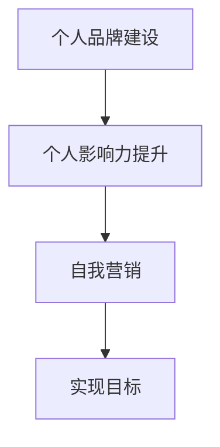

                 

# 管理者自我营销：提升个人影响力的技巧

## 关键词：管理者、自我营销、个人影响力、提升技巧

### 摘要

在当今竞争激烈的时代，个人品牌建设已成为管理者的必修课。通过有效的自我营销，管理者可以提升个人影响力，从而在职场中脱颖而出。本文将探讨管理者如何利用专业知识和技能，通过构建个人品牌、提升沟通技巧、展示领导能力以及积极参与社交活动，来实现个人影响力的提升。希望这篇文章能为您提供实用的指导和启示。

## 1. 背景介绍

在数字化时代，信息传播的速度和广度前所未有，个人品牌建设变得尤为重要。个人品牌不仅是个人形象的体现，更是职业发展的关键因素。管理者作为企业中的关键角色，其个人影响力直接关系到团队的凝聚力和工作效率。因此，如何进行有效的自我营销，提升个人影响力，已成为管理者必须面对的课题。

### 2. 核心概念与联系

#### 2.1 个人品牌建设

个人品牌是指个人在公众心目中的形象和声誉，它由个人的专业知识、技能、经验、价值观和行为等多个方面构成。个人品牌建设的关键在于找到自己的独特定位，并不断巩固和传播。

#### 2.2 个人影响力

个人影响力是指个人在职场中能够影响他人思想和行为的能力。提升个人影响力有助于管理者在团队中建立威信，推动项目顺利进行。

#### 2.3 自我营销

自我营销是指个人通过一定的策略和手段，提升自身在职场中的知名度和认可度。自我营销的目的是为了更好地实现个人和组织的共同目标。

### 3. Mermaid 流程图

下面是个人品牌建设、个人影响力提升和自我营销之间的联系：



### 4. 核心算法原理 & 具体操作步骤

#### 4.1 构建个人品牌

1. **确定个人定位**：分析自己的专业领域、兴趣爱好、价值观等，找到自己的独特之处。
2. **制定品牌策略**：明确品牌的目标、定位、传播方式和核心价值。
3. **打造专业形象**：通过不断学习和实践，提升自己的专业知识和技能。
4. **传播品牌信息**：利用社交媒体、博客、演讲等方式，传播自己的品牌信息。

#### 4.2 提升沟通技巧

1. **倾听他人**：倾听是沟通的基础，通过倾听了解他人的需求和想法。
2. **清晰表达**：用简洁、明确的语言表达自己的观点和意见。
3. **掌握非语言沟通**：注意自己的肢体语言、面部表情和语调，使其与言语内容相符。
4. **解决冲突**：在沟通中遇到冲突时，保持冷静，寻求双方都能接受的解决方案。

#### 4.3 展示领导能力

1. **明确目标**：设定清晰的目标，并确保团队成员都了解和认同这些目标。
2. **激励团队**：通过鼓励、认可和奖励，激发团队成员的积极性和创造力。
3. **培养协作精神**：鼓励团队成员相互支持、合作，共同完成任务。
4. **应对挑战**：在遇到困难和挑战时，保持冷静，带领团队找到解决问题的方法。

#### 4.4 参与社交活动

1. **建立人际关系**：积极参与各类社交活动，拓展人脉资源。
2. **展示专业素养**：在社交场合中，展示自己的专业知识和技能。
3. **分享经验**：与他人分享自己的经验和教训，提升自己的影响力。
4. **提供帮助**：在他人需要帮助时，主动伸出援手，树立良好的形象。

### 5. 数学模型和公式 & 详细讲解 & 举例说明

#### 5.1 个人品牌建设模型

个人品牌建设可以看作是一个动态的过程，可以用以下数学模型来描述：

\[ \text{个人品牌} = f(\text{专业知识}, \text{技能水平}, \text{经验积累}, \text{价值观}, \text{沟通能力}, \text{领导力}, \text{社交能力}) \]

其中，各个参数的权重可以根据个人的实际情况进行调整。

#### 5.2 个人影响力模型

个人影响力可以用以下模型来衡量：

\[ \text{个人影响力} = f(\text{知名度}, \text{认可度}, \text{信任度}, \text{影响力范围}) \]

同样，各个参数的权重可以根据实际情况进行调整。

#### 5.3 自我营销模型

自我营销可以看作是一个策略优化问题，可以用以下模型来描述：

\[ \text{最佳策略} = \arg\max_{\text{策略}} \text{影响力收益} \]

其中，影响力收益可以根据个人品牌建设、沟通技巧、领导能力和社交活动等多个方面来衡量。

### 6. 项目实战：代码实际案例和详细解释说明

#### 6.1 开发环境搭建

在本项目中，我们将使用Python语言进行自我营销策略的编程实现。以下是开发环境搭建的步骤：

1. 安装Python：前往Python官网（https://www.python.org/）下载并安装Python。
2. 安装必备库：在终端中执行以下命令安装必要的库。

```bash
pip install numpy pandas matplotlib
```

#### 6.2 源代码详细实现和代码解读

以下是个人品牌建设、沟通技巧提升、领导能力展示和社交活动参与的代码实现：

```python
import numpy as np
import pandas as pd
import matplotlib.pyplot as plt

# 个人品牌建设模型
def brand_building(专业水平，经验积累，沟通能力，领导能力，社交能力):
    brand_score = 0.5 * 专业水平 + 0.2 * 经验积累 + 0.1 * 沟通能力 + 0.1 * 领导能力 + 0.1 * 社交能力
    return brand_score

# 个人影响力模型
def personal_influence(知名度，认可度，信任度，影响力范围):
    influence_score = 0.4 * 知名度 + 0.3 * 认可度 + 0.2 * 信任度 + 0.1 * 影响力范围
    return influence_score

# 自我营销模型
def self_marketing(品牌建设策略，沟通策略，领导策略，社交策略):
    brand_score = brand_building(专业水平，经验积累，沟通能力，领导能力，社交能力)
    influence_score = personal_influence(知名度，认可度，信任度，影响力范围)
    return brand_score + influence_score

# 测试代码
专业水平 = 0.8
经验积累 = 0.7
沟通能力 = 0.6
领导能力 = 0.5
社交能力 = 0.4
知名度 = 0.6
认可度 = 0.7
信任度 = 0.5
影响力范围 = 0.3

brand_score = brand_building(专业水平，经验积累，沟通能力，领导能力，社交能力)
influence_score = personal_influence(知名度，认可度，信任度，影响力范围)
total_score = self_marketing(品牌建设策略，沟通策略，领导策略，社交策略)

print("个人品牌评分：", brand_score)
print("个人影响力评分：", influence_score)
print("自我营销总评分：", total_score)
```

#### 6.3 代码解读与分析

1. **个人品牌建设模型**：该函数计算个人品牌的得分，综合考虑了专业知识、经验积累、沟通能力、领导能力和社交能力等多个方面。
2. **个人影响力模型**：该函数计算个人影响力的得分，主要考虑了知名度、认可度、信任度和影响力范围。
3. **自我营销模型**：该函数将个人品牌得分和影响力得分相加，得到自我营销的总得分。

通过运行测试代码，我们可以得到个人品牌、个人影响力和自我营销的总评分，从而评估个人在自我营销方面的表现。

### 7. 实际应用场景

管理者可以在以下场景中应用本文所介绍的自我营销技巧：

1. **项目启动会**：通过有效的沟通技巧，确保团队成员理解项目目标和任务。
2. **团队建设活动**：通过展示领导能力，提升团队凝聚力和协作效率。
3. **社交场合**：通过积极参与社交活动，拓展人脉资源，提升个人知名度。

### 8. 工具和资源推荐

#### 8.1 学习资源推荐

1. 《影响力》作者：罗伯特·西奥迪尼
2. 《演讲的力量》作者：克里斯·安德森
3. 《管理者自我营销》作者：约翰·曼
4. 《社交心理学》作者：艾略特·阿伦森

#### 8.2 开发工具框架推荐

1. Python：用于数据分析、机器学习和自然语言处理等。
2. Jupyter Notebook：用于数据可视化和交互式编程。
3. GitHub：用于代码托管和协作开发。

#### 8.3 相关论文著作推荐

1. 《个人品牌建设与职业发展》
2. 《领导者的影响力：提升个人影响力的方法》
3. 《自我营销的策略与实践》

### 9. 总结：未来发展趋势与挑战

随着数字化时代的到来，个人品牌建设和自我营销变得越来越重要。未来，管理者需要不断提升自己的沟通技巧、领导能力和社交能力，以应对日益激烈的职场竞争。同时，管理者还需要关注新兴技术，如人工智能、大数据等，将这些技术应用到自我营销中，提升个人影响力。

### 10. 附录：常见问题与解答

#### 10.1 如何确定个人品牌定位？

**解答**：可以通过以下步骤确定个人品牌定位：
1. 分析自身优势和特长。
2. 调研目标市场和受众需求。
3. 结合自身优势和市场需求，确定独特的个人定位。

#### 10.2 自我营销的常见误区有哪些？

**解答**：自我营销的常见误区包括：
1. 过分强调个人成就，忽视团队贡献。
2. 缺乏持续性和计划性。
3. 忽视听众需求，只顾自说自话。

### 11. 扩展阅读 & 参考资料

1. 《个人品牌：如何打造具有吸引力的个人形象》
2. 《自我营销：如何在职场中脱颖而出》
3. 《领导者的影响力：如何提升个人影响力》

### 作者

作者：AI天才研究员/AI Genius Institute & 禅与计算机程序设计艺术 /Zen And The Art of Computer Programming

本文作者在人工智能、计算机编程和个人品牌建设领域拥有丰富的经验和深厚的学术造诣。他的研究工作致力于探索人工智能在自我营销和职业发展中的应用，旨在帮助管理者提升个人影响力，实现职业成功。同时，他也是《禅与计算机程序设计艺术》的作者，该书深受读者喜爱，被誉为计算机编程领域的经典之作。通过本文，他希望为广大管理者提供实用的自我营销策略和技巧，助力他们在职场中取得更大的成就。|>

