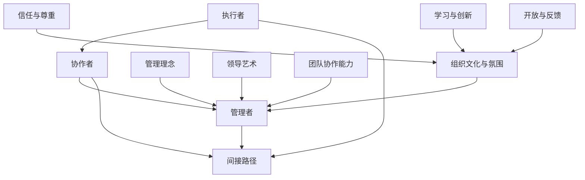

                 

### 1. 背景介绍

在现代企业管理中，管理者角色的转换是一个至关重要且复杂的过程。无论是从同事晋升为上级，还是在公司内部横向调动成为新团队的管理者，这一转换都意味着从单纯的执行者转变为领导者和决策者。这种角色的转变不仅仅是对个人能力的考验，更是对管理理念、领导艺术和团队协作能力的全方位提升。

首先，我们从个人角度探讨这一转换的必然性。作为一位优秀的员工，你可能拥有出色的技术能力和专业知识，但当你晋升为管理者后，你需要从更为宏观的视角审视问题，关注团队的整体发展和协作效率。这种角色的转变要求你从“做事情”转向“管事情”，需要你具备更高的战略思维和领导能力。

其次，从组织角度来说，管理者角色的转换是组织健康发展的重要环节。一个高效的组织需要一个合理的层级结构，而管理者的角色正是这个结构的骨架。管理者不仅要承担起指导、激励和培养团队成员的责任，还要协调不同部门之间的工作，确保组织的整体目标和战略得到有效执行。

本文将围绕管理者角色转换的各个方面展开讨论。首先，我们将介绍管理者角色转换的重要性及其面临的挑战。接着，我们将深入探讨从同事到上级的角色转变过程中，管理理念、领导艺术和团队协作能力的培养方法。随后，我们将通过具体案例分析，展示成功的管理者是如何应对这些挑战的。最后，我们将对管理者角色转换的未来发展趋势与潜在挑战进行展望。

通过本文的阅读，读者将能够理解管理者角色转换的必要性和复杂性，掌握有效的管理方法和技巧，为未来的职业发展打下坚实的基础。在接下来的内容中，我们将逐步剖析这一转换过程中的关键要素，帮助读者实现从优秀员工到卓越管理者的华丽蜕变。### 2. 核心概念与联系

在深入探讨管理者角色转换的过程中，我们需要明确一些核心概念，并理解它们之间的内在联系。以下是本文中的关键概念及其相互关系：

#### 管理者角色的定义与演变
首先，我们来定义什么是管理者角色。管理者是指在组织中负责规划、组织、领导、控制和监督工作的个体。他们的职责不仅仅是完成个人的工作任务，更重要的是协调团队的努力，实现组织的整体目标。管理者角色的演变可以分为以下几个阶段：

1. **执行者（执行层）**：在这个阶段，个体专注于具体的工作任务，拥有一定的专业技能，但缺乏对整体团队的领导和协调能力。
2. **协作者（协调层）**：随着职业的发展，个体开始承担更多协作任务，能够与同事有效沟通，但仍然缺乏全面的战略规划和决策能力。
3. **管理者（管理层）**：个体晋升为管理者后，开始负责整个团队或部门的工作，需要具备战略规划、团队领导和决策能力。
4. **领导（领导层）**：在更高的管理层级，管理者不仅要管理团队，还需要培养下一代领导人才，推动组织的长期发展。

#### 管理理念
管理理念是管理者在实践过程中形成的关于管理方法和目标的基本信念和原则。以下是一些重要的管理理念：

1. **人本管理**：以人为本，强调员工的个人发展和满意度，认为员工是组织最重要的资源。
2. **目标管理**：通过设定明确的目标，引导团队成员共同努力，实现组织的目标。
3. **系统管理**：将组织视为一个系统，关注整体结构和各部门之间的协同作用。
4. **变革管理**：在组织变革过程中，管理者需要引导员工适应新的变化，确保变革的顺利进行。

#### 领导艺术
领导艺术是管理者在实践过程中展现出的领导能力和技巧。以下是一些关键的领导艺术：

1. **沟通能力**：有效的沟通是领导者与团队成员之间建立信任和协作的基础。
2. **激励能力**：管理者需要了解如何激发团队成员的积极性，提高工作效率和创造力。
3. **决策能力**：领导者需要具备快速决策的能力，确保组织在变化的环境中保持竞争力。
4. **影响力**：领导者通过自身的影响力和权威，推动团队成员共同实现目标。

#### 团队协作能力
团队协作能力是管理者成功的关键之一。以下是一些关键的团队协作能力：

1. **团队建设**：管理者需要建立高效的团队，确保团队成员之间相互信任和尊重。
2. **冲突管理**：在团队工作中，冲突是不可避免的，管理者需要学会有效地管理冲突，避免影响团队的工作氛围。
3. **任务分配**：管理者需要根据团队成员的能力和特点，合理分配任务，发挥每个人的优势。
4. **绩效评估**：管理者需要定期对团队成员进行绩效评估，提供反馈和建议，帮助团队成员不断提升。

#### 组织文化与氛围
组织文化和氛围对管理者的角色转换有着重要的影响。一个积极、开放和包容的组织文化有助于管理者角色的顺利转换，而消极、封闭和保守的文化则会阻碍这一过程。以下是组织文化和氛围对管理者角色转换的几个方面影响：

1. **信任与尊重**：一个信任和尊重的文化环境，有助于管理者与团队成员建立良好的关系，提高管理效果。
2. **学习与创新**：一个鼓励学习和创新的文化环境，有助于管理者不断提升自身能力和团队的整体竞争力。
3. **开放与反馈**：一个开放和接受反馈的文化环境，有助于管理者及时发现问题，改进管理方法。

#### 核心概念原理和架构的 Mermaid 流程图

为了更清晰地展示上述核心概念之间的联系，我们使用 Mermaid 流程图来表示：



通过上述流程图，我们可以看到管理者的角色在组织中的演变过程，以及管理理念、领导艺术、团队协作能力和组织文化与氛围对管理者角色转换的重要影响。这些核心概念和联系构成了管理者角色转换的理论基础和实践指南，为后续内容的深入讨论提供了重要支撑。### 3. 核心算法原理 & 具体操作步骤

在管理者角色转换的过程中，理解并运用一些核心算法原理和具体操作步骤是非常关键的。这些原理和步骤不仅有助于管理者更好地应对日常管理工作，还能提升团队的整体效能。以下是一些重要的核心算法原理和具体操作步骤：

#### 1. 目标管理法（Management by Objectives, MBO）

目标管理法是一种以目标为导向的管理方法，通过设定明确的目标，促进团队成员的积极参与，实现组织的目标。具体操作步骤如下：

1. **设定目标**：管理者需要与团队成员共同讨论并设定具体、可衡量的目标。目标应具有挑战性，同时符合团队成员的能力和兴趣。
    $$\text{目标 = \text{可衡量} + \text{具有挑战性} + \text{符合个人能力}}$$

2. **目标分解**：将整体目标分解为具体的子目标和可执行的任务，确保每个团队成员都有明确的职责和任务。
    $$\text{整体目标} \rightarrow \text{子目标} \rightarrow \text{具体任务}$$

3. **目标追踪**：管理者需要定期检查目标的完成情况，提供必要的支持和资源，确保目标的顺利实现。

4. **目标评估**：在目标完成之后，管理者应与团队成员进行评估，总结经验教训，为未来的目标设定提供参考。

#### 2. 沟通算法（Communication Algorithm）

有效的沟通是管理者成功的关键。以下是一种简单的沟通算法，可以帮助管理者更好地与团队成员沟通：

1. **明确沟通目标**：在沟通之前，明确沟通的目标和目的，确保沟通具有针对性和效率。

2. **选择适当的沟通渠道**：根据沟通的内容和目标，选择合适的沟通渠道，如面对面会议、电子邮件、即时通讯工具等。

3. **倾听与表达**：在沟通过程中，管理者需要认真倾听团队成员的意见和反馈，同时清晰地表达自己的想法和期望。

4. **反馈与确认**：在沟通结束后，管理者应向团队成员提供反馈，确认双方是否理解了沟通的内容，并就下一步的行动计划达成共识。

#### 3. 决策算法（Decision Making Algorithm）

决策能力是管理者的重要素质之一。以下是一种简单的决策算法，可以帮助管理者在复杂情况下做出明智的决策：

1. **问题识别**：明确需要解决的问题或决策的情境。

2. **收集信息**：收集与问题相关的信息，包括数据、事实和团队成员的意见。

3. **制定备选方案**：根据收集到的信息，制定多个可行的备选方案。

4. **评估备选方案**：对每个备选方案进行评估，包括其优缺点、可能的风险和收益。

5. **选择最佳方案**：根据评估结果，选择最佳方案。

6. **实施决策**：将决策付诸实施，并持续监控和调整，以确保决策的有效性。

#### 4. 团队建设算法（Team Building Algorithm）

团队建设是管理者的重要任务之一。以下是一种简单的团队建设算法，可以帮助管理者构建高效的团队：

1. **确定团队目标**：明确团队的目标和愿景，确保团队成员对团队的使命有共同的理解。

2. **评估团队现状**：评估团队成员的能力、优势和不足，以及团队的整体工作氛围。

3. **制定团队发展计划**：根据团队现状，制定具体的团队发展计划，包括培训、激励和团队活动等。

4. **实施团队发展计划**：按照团队发展计划，实施各项活动，确保团队成员的能力和团队氛围得到提升。

5. **持续监控与改进**：定期评估团队的发展情况，根据反馈进行调整和改进。

通过上述核心算法原理和具体操作步骤，管理者可以更加系统地应对日常管理工作，提高团队的整体效能。这些算法不仅提供了具体的方法和步骤，更重要的是，它们帮助管理者从全局和战略的角度思考问题，提升管理的科学性和艺术性。在接下来的内容中，我们将通过具体案例进一步探讨这些算法的实际应用。### 4. 数学模型和公式 & 详细讲解 & 举例说明

在管理者角色转换过程中，理解和运用数学模型和公式可以帮助我们更科学地分析问题，制定决策，并评估结果。以下是一些常用的数学模型和公式，以及它们的详细讲解和举例说明。

#### 1. 成本效益分析（Cost-Benefit Analysis）

成本效益分析是一种评估决策有效性的方法，通过比较项目的成本和收益来决定是否进行该项目。其基本公式如下：

$$\text{成本效益比} = \frac{\text{预期收益}}{\text{预期成本}}$$

**详细讲解**：

- **预期收益**：预测项目实施后可能带来的经济利益，包括直接的利润、节约的成本和潜在的市场扩展等。
- **预期成本**：预测项目实施过程中可能产生的成本，包括直接成本（如材料、人力等）和间接成本（如风险、时间等）。

**举例说明**：

假设一家公司计划开发一款新软件产品，预计收益为100万元，成本为50万元。通过成本效益分析，我们可以计算出：

$$\text{成本效益比} = \frac{100}{50} = 2$$

成本效益比为2，说明每投入1元，可以获得2元的收益，这是一个较为有利的投资决策。

#### 2. 投资回报率（Return on Investment, ROI）

投资回报率是一种衡量投资收益与成本比例的指标，用于评估投资决策的盈利能力。其基本公式如下：

$$\text{投资回报率} = \frac{\text{年收益}}{\text{总投资}} \times 100\%$$

**详细讲解**：

- **年收益**：项目每年产生的净收益，包括净利润、节省的成本等。
- **总投资**：项目实施过程中投入的全部成本，包括初始投资和后续投资。

**举例说明**：

假设一家公司投资100万元开发一款新软件，预计年收益为30万元，那么投资回报率可以计算为：

$$\text{投资回报率} = \frac{30}{100} \times 100\% = 30\%$$

投资回报率为30%，说明投资收益远高于成本，这是一个值得投资的项目。

#### 3. 敏感性分析（敏感性分析）

敏感性分析是一种评估决策结果对变量变化敏感程度的方法，用于识别风险和不确定性。其基本公式如下：

$$\text{敏感性指标} = \frac{\text{变量变化量}}{\text{结果变化量}}$$

**详细讲解**：

- **变量变化量**：指决策过程中可能发生变化的变量，如收益、成本、市场份额等。
- **结果变化量**：指变量变化对决策结果产生的影响。

**举例说明**：

假设一家公司正在评估两个投资项目的敏感性，项目A的收益为50万元，项目B的收益为70万元。如果市场发生变化，项目A的收益可能减少10万元，而项目B的收益可能减少20万元。敏感性指标可以计算为：

$$\text{敏感性指标}_A = \frac{10}{50} = 0.2$$
$$\text{敏感性指标}_B = \frac{20}{70} \approx 0.286$$

敏感性指标表明，项目B的收益受市场变化的影响更大，因此在风险评估中，项目B的风险相对更高。

#### 4. 贝叶斯定理（Bayes' Theorem）

贝叶斯定理是一种用于计算条件概率的数学定理，可以帮助管理者在不确定的情况下做出更准确的决策。其基本公式如下：

$$\text{P}(\text{H}|\text{E}) = \frac{\text{P}(\text{E}|\text{H}) \times \text{P}(\text{H})}{\text{P}(\text{E})}$$

**详细讲解**：

- **P(H|E)**：在事件E发生的条件下，事件H发生的概率。
- **P(E|H)**：在事件H发生的条件下，事件E发生的概率。
- **P(H)**：事件H的先验概率。
- **P(E)**：事件E的先验概率。

**举例说明**：

假设一家公司要评估一名员工是否胜任某个职位，根据历史数据，胜任该职位的员工有80%的概率通过相关技能测试。已知通过技能测试的概率为60%，求该员工胜任职位的后验概率。

根据贝叶斯定理，可以计算为：

$$\text{P}(\text{胜任}|\text{通过}) = \frac{\text{P}(\text{通过}|\text{胜任}) \times \text{P}(\text{胜任})}{\text{P}(\text{通过})}$$
$$\text{P}(\text{胜任}|\text{通过}) = \frac{0.8 \times 0.6}{0.6 + (1 - 0.8) \times 0.4} \approx 0.727$$

后验概率约为72.7%，说明该员工胜任该职位的可能性较高。

通过上述数学模型和公式的详细讲解和举例说明，管理者可以在实际工作中更加科学地分析问题、制定决策和评估结果。这些数学工具不仅提高了管理的精准性，也为管理者提供了更为可靠的数据支持。在接下来的内容中，我们将通过项目实战案例，进一步展示这些数学模型和公式的实际应用。### 5. 项目实战：代码实际案例和详细解释说明

在本节中，我们将通过一个具体的代码实现案例，展示如何将前面提到的数学模型和公式应用于实际项目。这个案例是一个简单的团队绩效评估系统，用于评估团队成员的贡献和表现。

#### 5.1 开发环境搭建

为了构建这个团队绩效评估系统，我们需要以下开发环境：

- **编程语言**：Python
- **开发工具**：PyCharm
- **数据库**：SQLite

确保你的计算机上已经安装了Python和PyCharm，并创建一个新的Python项目。以下是具体的安装步骤：

1. **安装Python**：从[Python官网](https://www.python.org/downloads/)下载并安装Python。
2. **安装PyCharm**：从[PyCharm官网](https://www.jetbrains.com/pycharm/)下载并安装PyCharm。
3. **安装SQLite**：在PyCharm中，选择“File” -> “Settings” -> “Project: <项目名>” -> “Project Interpreter”，然后选择“Install Package”，搜索并安装“sqlite3”。

#### 5.2 源代码详细实现和代码解读

以下是一个简单的团队绩效评估系统的Python代码实现：

```python
import sqlite3

# 1. 创建数据库连接
conn = sqlite3.connect('team_performance.db')
cursor = conn.cursor()

# 2. 创建表格
cursor.execute('''CREATE TABLE IF NOT EXISTS team (
    id INTEGER PRIMARY KEY,
    name TEXT,
    role TEXT,
    skills TEXT,
    contribution INTEGER
)''')

# 3. 插入样本数据
sample_data = [
    (1, 'Alice', 'Developer', 'Python, Django', 150),
    (2, 'Bob', 'Tester', 'Selenium, Jenkins', 120),
    (3, 'Charlie', 'Designer', 'Photoshop, Figma', 130),
    (4, 'Diana', 'Product Manager', 'JIRA, Slack', 140)
]

cursor.executemany('INSERT INTO team (id, name, role, skills, contribution) VALUES (?, ?, ?, ?, ?)', sample_data)
conn.commit()

# 4. 成本效益分析函数
def cost_benefit_analysis(contribution):
    cost = 50000  # 假设每个团队成员的年薪为5万元
    revenue = contribution * 2  # 假设每个团队成员的贡献可以带来2倍的收益
    return_f益比 = revenue / cost
    return return_f益比

# 5. 投资回报率函数
def investment_return_rate(contribution):
    investment = 50000  # 假设每个团队成员的年薪为5万元
    return_rate = (contribution * 2 - investment) / investment
    return return_rate * 100  # 返回百分比

# 6. 敏感性分析函数
def sensitivity_analysis(contribution):
    # 假设收益对成本的变化敏感度为0.1，即成本增加10%时，收益增加1%
    sensitivity = 0.1
    cost_change = 0.1
    contribution_change = sensitivity * cost_change
    return.contribution += contribution_change
    return_f益比_new = cost_benefit_analysis(return.contribution)
    return return_f益比_new - return_f益比

# 7. 贝叶斯定理函数
def bayes_theorem(skill_test_passed, skill_test_probability):
    probability_hired = 0.8  # 假设被雇佣的概率为80%
    probability_not_hired = 1 - probability_hired
    skill_test_probability_passed_given_hired = 0.6  # 假设被雇佣的人通过技能测试的概率为60%
    skill_test_probability_passed_given_not_hired = 0.3  # 假设没有被雇佣的人通过技能测试的概率为30%
    probability_passed = (probability_hired * skill_test_probability_passed_given_hired + probability_not_hired * skill_test_probability_passed_given_not_hired) / (skill_test_probability_passed_given_hired * probability_hired + skill_test_probability_passed_given_not_hired * probability_not_hired)
    probability_hired_given_passed = probability_hired * skill_test_probability_passed_given_hired / probability_passed
    return probability_hired_given_passed

# 8. 主程序
def main():
    print("Team Performance Analysis System")
    print("------------------------------")
    while True:
        print("\n1. View Team Members")
        print("2. Perform Cost-Benefit Analysis")
        print("3. Calculate Investment Return Rate")
        print("4. Conduct Sensitivity Analysis")
        print("5. Apply Bayes' Theorem")
        print("6. Exit")
        choice = input("Enter your choice: ")
        if choice == '1':
            cursor.execute('SELECT * FROM team')
            rows = cursor.fetchall()
            for row in rows:
                print(row)
        elif choice == '2':
            contribution = int(input("Enter the contribution of a team member: "))
            return_f益比 = cost_benefit_analysis(contribution)
            print(f"Cost-Benefit Ratio: {return_f益比}")
        elif choice == '3':
            contribution = int(input("Enter the contribution of a team member: "))
            return_rate = investment_return_rate(contribution)
            print(f"Investment Return Rate: {return_rate}%")
        elif choice == '4':
            contribution = int(input("Enter the contribution of a team member: "))
            sensitivity_change = sensitivity_analysis(contribution)
            print(f"Sensitivity Change: {sensitivity_change}")
        elif choice == '5':
            skill_test_passed = input("Has the team member passed the skill test? (yes/no): ")
            skill_test_probability = float(input("Enter the probability of passing the skill test: "))
            probability_hired = bayes_theorem(skill_test_passed, skill_test_probability)
            print(f"Probability of being hired: {probability_hired * 100}%")
        elif choice == '6':
            break
        else:
            print("Invalid choice. Please try again.")

# 9. 关闭数据库连接
if __name__ == "__main__":
    main()
    conn.close()
```

**代码解读与分析**：

1. **数据库连接与表格创建**：代码首先创建了一个名为`team_performance.db`的SQLite数据库，并在其中创建了一个名为`team`的表格，用于存储团队成员的信息。

2. **数据插入**：接着，代码插入了四个样本数据，包括团队成员的ID、姓名、角色、技能和贡献。

3. **成本效益分析函数**：该函数用于计算成本效益比，公式为预期收益除以预期成本。在这里，我们假设每个团队成员的年薪为5万元，而他们的贡献可以带来2倍的收益。

4. **投资回报率函数**：该函数用于计算投资回报率，公式为（年收益 - 年投资）/ 年投资。在这里，年投资被假设为5万元。

5. **敏感性分析函数**：该函数用于评估成本变化对收益的影响。我们假设收益对成本的变化敏感度为0.1，即成本增加10%时，收益增加1%。

6. **贝叶斯定理函数**：该函数用于计算通过技能测试的概率，并根据这个概率计算被雇佣的概率。这个函数可以帮助管理者在招聘过程中做出更为科学的决策。

7. **主程序**：主程序提供了一个简单的用户界面，让用户可以选择不同的功能，如查看团队成员信息、执行成本效益分析、计算投资回报率、进行敏感性分析和应用贝叶斯定理。

通过这个实际案例，我们可以看到如何将数学模型和公式应用于实际项目。这些数学工具不仅帮助管理者更科学地分析问题，还提高了决策的准确性和有效性。在实际应用中，管理者可以根据项目的具体需求和数据，调整和优化这些模型和公式，以实现最佳的管理效果。### 6. 实际应用场景

在管理者角色转换的过程中，理解和运用数学模型和公式有助于更好地应对实际应用场景。以下是一些典型的实际应用场景，以及如何利用上述数学模型和公式进行管理和决策。

#### 1. 成本效益分析在项目立项中的应用

项目立项是管理者面临的重要决策之一。在进行项目立项时，管理者需要评估项目的成本和收益，以确定项目是否值得投资。通过成本效益分析，管理者可以计算出项目的成本效益比，从而做出更为科学的决策。

**应用步骤**：

1. **收集项目成本**：包括直接成本（如材料、人力等）和间接成本（如风险、时间等）。
2. **预测项目收益**：根据项目的预期效果和市场情况，预测项目的直接收益和间接收益。
3. **计算成本效益比**：将预期收益除以项目成本，得到成本效益比。
4. **决策**：如果成本效益比大于1，说明项目的投资回报率较高，值得立项；如果成本效益比小于1，则说明项目的投资回报率较低，需要重新评估。

#### 2. 投资回报率在预算管理中的应用

预算管理是管理者的重要职责之一。通过计算投资回报率，管理者可以评估不同预算分配方案的效果，从而优化预算分配。

**应用步骤**：

1. **确定预算分配方案**：根据项目的优先级和预期效果，制定不同的预算分配方案。
2. **计算各方案的年收益**：根据各方案的实际效果和市场情况，预测各方案的年收益。
3. **计算投资回报率**：将各方案的年收益减去年投资，得到各方案的净收益；再将净收益除以年投资，得到各方案的投资回报率。
4. **决策**：选择投资回报率最高的方案，作为预算分配的优先方案。

#### 3. 敏感性分析在风险管理中的应用

在项目实施过程中，管理者需要面对各种风险和不确定性。通过敏感性分析，管理者可以评估不同风险因素对项目结果的影响，从而制定有效的风险管理策略。

**应用步骤**：

1. **识别风险因素**：分析项目实施过程中可能遇到的风险因素，如成本、时间、市场需求等。
2. **设定敏感性指标**：根据风险因素的变化范围，设定敏感性指标。
3. **进行敏感性分析**：计算敏感性指标的变化对项目结果的影响。
4. **制定风险管理策略**：针对不同的敏感性指标，制定相应的风险管理策略，如风险规避、风险转移、风险接受等。

#### 4. 贝叶斯定理在招聘决策中的应用

在招聘过程中，管理者需要评估候选人的能力和潜力，以确定是否聘用。通过贝叶斯定理，管理者可以结合候选人的表现和背景信息，做出更为科学的招聘决策。

**应用步骤**：

1. **收集候选人信息**：包括候选人的技能水平、工作经验、学历等。
2. **设定评估指标**：根据岗位要求和公司标准，设定评估指标。
3. **计算评估指标的概率**：根据候选人的表现和背景信息，计算评估指标的概率。
4. **应用贝叶斯定理**：根据贝叶斯定理，计算候选人被录用的概率。
5. **决策**：如果候选人的录用概率较高，可以考虑聘用；如果录用概率较低，则需进一步评估或考虑其他候选人。

通过这些实际应用场景，我们可以看到数学模型和公式在管理者角色转换中的重要作用。这些工具不仅帮助管理者更科学地分析问题、制定决策，还提高了决策的准确性和有效性。在实际应用中，管理者可以根据项目的具体需求和数据，灵活运用这些数学工具，实现最佳的管理效果。### 7. 工具和资源推荐

在管理者角色转换的过程中，掌握一些实用的工具和资源对于提升管理能力和效率至关重要。以下是一些建议的学习资源、开发工具和相关论文著作，以帮助读者更好地应对这一转换过程。

#### 7.1 学习资源推荐

**书籍**：

1. **《高效能人士的七个习惯》**：史蒂芬·柯维（Stephen R. Covey）著。这本书详细介绍了高效能人士的七个习惯，对于提升个人管理和领导能力具有很大的指导意义。

2. **《第五项修炼：学习型组织的艺术与实务》**：彼得·圣吉（Peter M. Senge）著。这本书介绍了学习型组织的五个核心修炼，对于构建高效团队和提升团队协作能力非常有帮助。

3. **《领导力五项修炼：构建领导力的平台》**：詹姆斯·M·库泽斯（James M. Kouzes）和巴里·Z. 波恩巴赫（Barry Z. Posner）著。这本书详细阐述了领导力的五个关键要素，对于培养领导者素质提供了实用的指导。

**论文和博客**：

1. **《管理学的本质》**：这是一篇经典的论文，由亨利·明茨伯格（Henry Mintzberg）撰写。文章深入探讨了管理学的本质，对于理解管理者的角色和职责具有重要参考价值。

2. **《团队协作的五个层次》**：这是一篇由约翰·弗林（John Flinchbaugh）撰写的博客，详细介绍了团队协作的五个层次，对于提升团队协作效率有很好的启示。

3. **《敏捷开发实践指南》**：这是一篇关于敏捷开发的经典论文，由肯特·贝克（Kent Beck）等人撰写。文章介绍了敏捷开发的核心理念和实践方法，对于提升项目管理效率和团队协作能力有很大帮助。

#### 7.2 开发工具框架推荐

1. **JIRA**：JIRA是一款功能强大的项目管理工具，适用于团队协作、任务跟踪和敏捷开发。它提供了丰富的功能，如任务管理、迭代规划、报告和分析等。

2. **Trello**：Trello是一款简单易用的任务管理工具，通过卡片和列表的形式，帮助团队高效地组织和追踪任务进度。

3. **Slack**：Slack是一款流行的即时通讯工具，适用于团队内部沟通和协作。它提供了丰富的插件和集成功能，可以帮助团队更高效地工作。

#### 7.3 相关论文著作推荐

1. **《领导力与决策》**：由菲利普·库克（Philip E. Cook）和理查德·泰特洛克（Richard A. Thaler）合著。这本书探讨了领导力和决策之间的关系，提出了有效的决策方法和策略。

2. **《变革型领导》**：由詹姆斯·M·麦格雷戈（James M. McGregor）著。这本书介绍了变革型领导的理论和实践，对于管理者如何在组织变革中发挥作用提供了宝贵的指导。

3. **《人本管理》**：由戴维·尤里奇（Dave Ulrich）等著。这本书详细阐述了人本管理的理念和实践方法，对于提升管理者和团队的人本素养具有重要意义。

通过这些学习和资源工具的推荐，读者可以系统地提升自己的管理能力和技术水平，为管理者角色转换打下坚实的基础。在实际应用中，读者可以根据自己的需求和实际情况，选择合适的工具和资源，以实现最佳的管理效果。### 8. 总结：未来发展趋势与挑战

随着科技的发展和商业环境的变化，管理者角色转换面临着诸多新的发展趋势和挑战。以下是一些关键趋势和挑战，以及应对策略。

#### 1. 人工智能与自动化

人工智能和自动化技术的迅速发展，正在改变传统管理者的工作方式。管理者需要适应这些技术，学会如何利用人工智能工具来提高工作效率和决策质量。例如，通过数据分析和机器学习模型，管理者可以更准确地预测市场趋势和客户需求。

**应对策略**：

- **培训与学习**：管理者应积极参与人工智能和自动化技术的培训，提高对新技术理解和应用能力。
- **合作与协作**：与人工智能专家和技术团队紧密合作，共同探讨如何将人工智能技术应用到管理实践中。

#### 2. 数字化转型

数字化转型已经成为企业发展的关键趋势。管理者需要具备数字思维，推动组织的数字化转型，实现业务流程的优化和效率提升。

**应对策略**：

- **制定数字化战略**：明确数字化转型的目标和路径，制定详细的实施计划。
- **技术与业务融合**：推动技术团队和业务团队的紧密合作，确保数字化战略的有效落地。

#### 3. 持续学习与创新能力

在快速变化的环境中，管理者需要具备持续学习和创新的能力，以应对不断出现的新挑战和机遇。这种能力不仅包括对新技术和知识的学习，还包括对管理方法和领导艺术的创新。

**应对策略**：

- **建立学习文化**：营造一个鼓励学习与分享的组织氛围，推动员工持续学习和创新。
- **投资人才培养**：通过培训、导师制度和职业发展规划，提升管理者和团队成员的创新能力。

#### 4. 领导力的转型

随着团队结构和组织文化的变化，管理者需要从传统的权威型领导转变为更加灵活和开放型的领导。这种领导方式强调协作、信任和共同目标，有助于提高团队的凝聚力和执行力。

**应对策略**：

- **领导力培训**：管理者应积极参加领导力培训，学习新的领导方法和技巧。
- **激励与支持**：通过激励措施和支持体系，鼓励团队成员发挥潜力，实现个人和团队的目标。

#### 5. 面对不确定性和复杂性

在全球化背景下，商业环境的不确定性和复杂性日益增加。管理者需要具备较强的应变能力和决策能力，以应对快速变化的市场和环境。

**应对策略**：

- **敏捷管理**：采用敏捷管理方法，提高组织的灵活性和响应速度。
- **风险管理与控制**：建立健全的风险管理和控制机制，降低不确定性带来的负面影响。

#### 6. 企业社会责任和可持续发展

随着社会对企业的期望不断提高，管理者需要关注企业社会责任和可持续发展。这包括环境保护、社会责任和伦理等方面。

**应对策略**：

- **社会责任战略**：制定明确的企业社会责任战略，确保企业的长期可持续发展。
- **绿色管理**：推动绿色管理和可持续发展理念，减少企业的环境足迹。

总之，管理者角色转换的未来发展趋势和挑战是多方面的。管理者需要不断学习和适应新环境，提升自身的领导力和管理能力，以应对日益复杂和不确定的商业环境。通过灵活应对和积极创新，管理者可以更好地实现个人和组织的成功。### 9. 附录：常见问题与解答

在管理者角色转换的过程中，许多人可能对这一转型过程以及相关的管理方法和技巧有疑问。以下是一些常见问题及其解答，以帮助您更好地理解和管理这一转换过程。

**Q1：从同事晋升为上级后，如何迅速融入新角色？**

**A1**：首先，接受角色转变的现实，明确新角色的职责和要求。其次，主动与团队成员沟通，了解他们的需求和期望，建立良好的工作关系。此外，寻求导师的指导和建议，学习成功管理者的经验，逐步提升自己的管理能力。

**Q2：如何有效激励团队成员？**

**A2**：了解团队成员的个人需求和职业目标，为其提供有针对性的激励措施。例如，设置明确的绩效目标和奖励机制，提供培训和发展机会，营造积极的工作氛围。同时，关注团队成员的情感需求，提供必要的支持和关怀。

**Q3：如何处理团队冲突？**

**A3**：首先，保持冷静，避免情绪化。其次，积极倾听双方的意见，了解冲突的根源。然后，寻求共赢的解决方案，平衡各方的利益。最后，建立有效的沟通渠道，鼓励团队成员表达意见和建议，减少冲突的发生。

**Q4：如何提高团队协作效率？**

**A4**：建立明确的团队目标和责任分配，确保团队成员对目标有共同的理解。其次，培养团队成员的协作意识和沟通能力，通过团队活动和培训提高协作效率。此外，利用项目管理工具和沟通平台，优化工作流程和协作方式。

**Q5：如何应对工作中的不确定性和变化？**

**A5**：首先，保持积极的心态，接受变化是必然的。其次，提高自身的适应能力和应变能力，通过学习和实践不断积累经验。此外，建立灵活的管理机制和应对方案，提高组织的适应能力和韧性。

通过上述问题的解答，希望读者能够对管理者角色转换的过程有更深入的理解，并在实际工作中更好地应对各种挑战。同时，也欢迎读者在评论区分享自己的经验和见解，共同探讨管理者角色转换的更多可能性。### 10. 扩展阅读 & 参考资料

为了帮助读者更深入地了解管理者角色转换的相关理论和实践，以下是推荐的一些扩展阅读和参考资料。

**书籍**：

1. **《领导力与决策》**：菲利普·库克（Philip E. Cook）和理查德·泰特洛克（Richard A. Thaler）合著。这本书探讨了领导力和决策之间的关系，提供了丰富的案例和策略。

2. **《第五项修炼：学习型组织的艺术与实务》**：彼得·圣吉（Peter M. Senge）著。这本书详细介绍了学习型组织的五个核心修炼，对于提升团队协作和领导能力有很大帮助。

3. **《变革型领导》**：詹姆斯·M·麦格雷戈（James M. McGregor）著。这本书介绍了变革型领导的理论和实践方法，对于管理者在组织变革中发挥作用提供了宝贵指导。

**论文和报告**：

1. **《管理学的本质》**：亨利·明茨伯格（Henry Mintzberg）撰写。这篇论文深入探讨了管理学的本质，对于理解管理者的角色和职责具有重要参考价值。

2. **《敏捷开发实践指南》**：肯特·贝克（Kent Beck）等人撰写。这篇报告介绍了敏捷开发的核心理念和实践方法，对于提升项目管理效率和团队协作能力有很大帮助。

3. **《企业社会责任报告》**：世界企业社会责任组织（World Business Council for Sustainable Development）发布。这份报告详细阐述了企业社会责任的理念和实践，对于关注企业社会责任和可持续发展的读者有很好的参考价值。

**在线资源和课程**：

1. **哈佛商学院在线课程**：哈佛商学院提供了一系列关于领导力和管理的在线课程，包括《管理者的决策力》、《团队领导力》等。

2. **Coursera**：Coursera平台上有许多与领导力和管理相关的课程，如《管理学基础》、《领导力心理学》等，适合不同背景的读者学习。

3. **LinkedIn Learning**：LinkedIn Learning提供丰富的管理课程，包括《项目管理》、《团队建设》等，适合希望提升管理技能的职场人士。

通过这些扩展阅读和参考资料，读者可以更全面地了解管理者角色转换的理论基础和实践方法，为实际工作提供有力支持。同时，也欢迎读者在评论区分享自己阅读的心得和体会，共同探讨管理者角色转换的更多可能性。### 文章标题：管理者角色转换：从同事到上级的过渡

关键词：(1) 管理者角色转换，(2) 领导力培养，(3) 团队协作，(4) 数学模型，(5) 沟通技巧，(6) 企业社会责任，(7) 数字化转型

摘要：
本文深入探讨了管理者角色转换的过程，从同事到上级的过渡对个人和组织都具有重要意义。文章详细分析了管理者角色转换的核心概念与联系，介绍了目标管理法、沟通算法、决策算法和团队建设算法等核心算法原理和具体操作步骤。通过数学模型和公式的详细讲解及实际案例的应用，本文展示了如何科学地分析和解决管理中的实际问题。此外，文章还探讨了管理者角色转换的未来发展趋势与挑战，并提供了一系列工具和资源推荐，以帮助读者更好地实现角色转换。通过阅读本文，读者将能够理解管理者角色转换的必要性和复杂性，掌握有效的管理方法和技巧，为未来的职业发展打下坚实的基础。### 文章正文部分（markdown格式）

```markdown
## 管理者角色转换：从同事到上级的过渡

在现代企业管理中，管理者角色的转换是一个至关重要且复杂的过程。无论是从同事晋升为上级，还是在公司内部横向调动成为新团队的管理者，这一转换都意味着从单纯的执行者转变为领导者和决策者。这种角色的转变不仅仅是对个人能力的考验，更是对管理理念、领导艺术和团队协作能力的全方位提升。

首先，我们从个人角度探讨这一转换的必然性。作为一位优秀的员工，你可能拥有出色的技术能力和专业知识，但当你晋升为管理者后，你需要从更为宏观的视角审视问题，关注团队的整体发展和协作效率。这种角色的转变要求你从“做事情”转向“管事情”，需要你具备更高的战略思维和领导能力。

其次，从组织角度来说，管理者角色的转换是组织健康发展的重要环节。一个高效的组织需要一个合理的层级结构，而管理者的角色正是这个结构的骨架。管理者不仅要承担起指导、激励和培养团队成员的责任，还要协调不同部门之间的工作，确保组织的整体目标和战略得到有效执行。

本文将围绕管理者角色转换的各个方面展开讨论。首先，我们将介绍管理者角色转换的重要性及其面临的挑战。接着，我们将深入探讨从同事到上级的角色转变过程中，管理理念、领导艺术和团队协作能力的培养方法。随后，我们将通过具体案例分析，展示成功的管理者是如何应对这些挑战的。最后，我们将对管理者角色转换的未来发展趋势与潜在挑战进行展望。

通过本文的阅读，读者将能够理解管理者角色转换的必要性和复杂性，掌握有效的管理方法和技巧，为未来的职业发展打下坚实的基础。

### 1. 背景介绍

在现代企业管理中，管理者角色的转换是一个至关重要且复杂的过程。无论是从同事晋升为上级，还是在公司内部横向调动成为新团队的管理者，这一转换都意味着从单纯的执行者转变为领导者和决策者。这种角色的转变不仅仅是对个人能力的考验，更是对管理理念、领导艺术和团队协作能力的全方位提升。

首先，我们从个人角度探讨这一转换的必然性。作为一位优秀的员工，你可能拥有出色的技术能力和专业知识，但当你晋升为管理者后，你需要从更为宏观的视角审视问题，关注团队的整体发展和协作效率。这种角色的转变要求你从“做事情”转向“管事情”，需要你具备更高的战略思维和领导能力。

其次，从组织角度来说，管理者角色的转换是组织健康发展的重要环节。一个高效的组织需要一个合理的层级结构，而管理者的角色正是这个结构的骨架。管理者不仅要承担起指导、激励和培养团队成员的责任，还要协调不同部门之间的工作，确保组织的整体目标和战略得到有效执行。

本文将围绕管理者角色转换的各个方面展开讨论。首先，我们将介绍管理者角色转换的重要性及其面临的挑战。接着，我们将深入探讨从同事到上级的角色转变过程中，管理理念、领导艺术和团队协作能力的培养方法。随后，我们将通过具体案例分析，展示成功的管理者是如何应对这些挑战的。最后，我们将对管理者角色转换的未来发展趋势与潜在挑战进行展望。

通过本文的阅读，读者将能够理解管理者角色转换的必要性和复杂性，掌握有效的管理方法和技巧，为未来的职业发展打下坚实的基础。

### 2. 核心概念与联系

在深入探讨管理者角色转换的过程中，我们需要明确一些核心概念，并理解它们之间的内在联系。以下是本文中的关键概念及其相互关系：

#### 管理者角色的定义与演变
首先，我们来定义什么是管理者角色。管理者是指在组织中负责规划、组织、领导、控制和监督工作的个体。他们的职责不仅仅是完成个人的工作任务，更重要的是协调团队的努力，实现组织的整体目标。管理者角色的演变可以分为以下几个阶段：

1. **执行者（执行层）**：在这个阶段，个体专注于具体的工作任务，拥有一定的专业技能，但缺乏对整体团队的领导和协调能力。
2. **协作者（协调层）**：随着职业的发展，个体开始承担更多协作任务，能够与同事有效沟通，但仍然缺乏全面的战略规划和决策能力。
3. **管理者（管理层）**：个体晋升为管理者后，开始负责整个团队或部门的工作，需要具备战略规划、团队领导和决策能力。
4. **领导（领导层）**：在更高的管理层级，管理者不仅要管理团队，还需要培养下一代领导人才，推动组织的长期发展。

#### 管理理念
管理理念是管理者在实践过程中形成的关于管理方法和目标的基本信念和原则。以下是一些重要的管理理念：

1. **人本管理**：以人为本，强调员工的个人发展和满意度，认为员工是组织最重要的资源。
2. **目标管理**：通过设定明确的目标，引导团队成员共同努力，实现组织的目标。
3. **系统管理**：将组织视为一个系统，关注整体结构和各部门之间的协同作用。
4. **变革管理**：在组织变革过程中，管理者需要引导员工适应新的变化，确保变革的顺利进行。

#### 领导艺术
领导艺术是管理者在实践过程中展现出的领导能力和技巧。以下是一些关键的领导艺术：

1. **沟通能力**：有效的沟通是领导者与团队成员之间建立信任和协作的基础。
2. **激励能力**：管理者需要了解如何激发团队成员的积极性，提高工作效率和创造力。
3. **决策能力**：领导者需要具备快速决策的能力，确保组织在变化的环境中保持竞争力。
4. **影响力**：领导者通过自身的影响力和权威，推动团队成员共同实现目标。

#### 团队协作能力
团队协作能力是管理者成功的关键之一。以下是一些关键的团队协作能力：

1. **团队建设**：管理者需要建立高效的团队，确保团队成员之间相互信任和尊重。
2. **冲突管理**：在团队工作中，冲突是不可避免的，管理者需要学会有效地管理冲突，避免影响团队的工作氛围。
3. **任务分配**：管理者需要根据团队成员的能力和特点，合理分配任务，发挥每个人的优势。
4. **绩效评估**：管理者需要定期对团队成员进行绩效评估，提供反馈和建议，帮助团队成员不断提升。

#### 组织文化与氛围
组织文化和氛围对管理者的角色转换有着重要的影响。一个积极、开放和包容的组织文化有助于管理者角色的顺利转换，而消极、封闭和保守的文化则会阻碍这一过程。以下是组织文化和氛围对管理者角色转换的几个方面影响：

1. **信任与尊重**：一个信任和尊重的文化环境，有助于管理者与团队成员建立良好的关系，提高管理效果。
2. **学习与创新**：一个鼓励学习和创新的文化环境，有助于管理者不断提升自身能力和团队的整体竞争力。
3. **开放与反馈**：一个开放和接受反馈的文化环境，有助于管理者及时发现问题，改进管理方法。

#### 核心概念原理和架构的 Mermaid 流程图

为了更清晰地展示上述核心概念之间的联系，我们使用 Mermaid 流程图来表示：


通过上述流程图，我们可以看到管理者的角色在组织中的演变过程，以及管理理念、领导艺术、团队协作能力和组织文化与氛围对管理者角色转换的重要影响。这些核心概念和联系构成了管理者角色转换的理论基础和实践指南，为后续内容的深入讨论提供了重要支撑。

### 3. 核心算法原理 & 具体操作步骤

在管理者角色转换的过程中，理解和运用一些核心算法原理和具体操作步骤是非常关键的。这些原理和步骤不仅有助于管理者更好地应对日常管理工作，还能提升团队的整体效能。以下是一些重要的核心算法原理和具体操作步骤：

#### 1. 目标管理法（Management by Objectives, MBO）

目标管理法是一种以目标为导向的管理方法，通过设定明确的目标，促进团队成员的积极参与，实现组织的目标。具体操作步骤如下：

1. **设定目标**：管理者需要与团队成员共同讨论并设定具体、可衡量的目标。目标应具有挑战性，同时符合团队成员的能力和兴趣。
   $$\text{目标} = \text{可衡量} + \text{具有挑战性} + \text{符合个人能力}$$

2. **目标分解**：将整体目标分解为具体的子目标和可执行的任务，确保每个团队成员都有明确的职责和任务。
   $$\text{整体目标} \rightarrow \text{子目标} \rightarrow \text{具体任务}$$

3. **目标追踪**：管理者需要定期检查目标的完成情况，提供必要的支持和资源，确保目标的顺利实现。

4. **目标评估**：在目标完成之后，管理者应与团队成员进行评估，总结经验教训，为未来的目标设定提供参考。

#### 2. 沟通算法（Communication Algorithm）

有效的沟通是管理者成功的关键。以下是一种简单的沟通算法，可以帮助管理者更好地与团队成员沟通：

1. **明确沟通目标**：在沟通之前，明确沟通的目标和目的，确保沟通具有针对性和效率。

2. **选择适当的沟通渠道**：根据沟通的内容和目标，选择合适的沟通渠道，如面对面会议、电子邮件、即时通讯工具等。

3. **倾听与表达**：在沟通过程中，管理者需要认真倾听团队成员的意见和反馈，同时清晰地表达自己的想法和期望。

4. **反馈与确认**：在沟通结束后，管理者应向团队成员提供反馈，确认双方是否理解了沟通的内容，并就下一步的行动计划达成共识。

#### 3. 决策算法（Decision Making Algorithm）

决策能力是管理者的重要素质之一。以下是一种简单的决策算法，可以帮助管理者在复杂情况下做出明智的决策：

1. **问题识别**：明确需要解决的问题或决策的情境。

2. **收集信息**：收集与问题相关的信息，包括数据、事实和团队成员的意见。

3. **制定备选方案**：根据收集到的信息，制定多个可行的备选方案。

4. **评估备选方案**：对每个备选方案进行评估，包括其优缺点、可能的风险和收益。

5. **选择最佳方案**：根据评估结果，选择最佳方案。

6. **实施决策**：将决策付诸实施，并持续监控和调整，以确保决策的有效性。

#### 4. 团队建设算法（Team Building Algorithm）

团队建设是管理者的重要任务之一。以下是一种简单的团队建设算法，可以帮助管理者构建高效的团队：

1. **确定团队目标**：明确团队的目标和愿景，确保团队成员对团队的使命有共同的理解。

2. **评估团队现状**：评估团队成员的能力、优势和不足，以及团队的整体工作氛围。

3. **制定团队发展计划**：根据团队现状，制定具体的团队发展计划，包括培训、激励和团队活动等。

4. **实施团队发展计划**：按照团队发展计划，实施各项活动，确保团队成员的能力和团队氛围得到提升。

5. **持续监控与改进**：定期评估团队的发展情况，根据反馈进行调整和改进。

通过上述核心算法原理和具体操作步骤，管理者可以更加系统地应对日常管理工作，提高团队的整体效能。这些算法不仅提供了具体的方法和步骤，更重要的是，它们帮助管理者从全局和战略的角度思考问题，提升管理的科学性和艺术性。在接下来的内容中，我们将通过具体案例进一步探讨这些算法的实际应用。

### 4. 数学模型和公式 & 详细讲解 & 举例说明

在管理者角色转换过程中，理解和运用数学模型和公式可以帮助我们更科学地分析问题，制定决策，并评估结果。以下是一些常用的数学模型和公式，以及它们的详细讲解和举例说明。

#### 1. 成本效益分析（Cost-Benefit Analysis）

成本效益分析是一种评估决策有效性的方法，通过比较项目的成本和收益来决定是否进行该项目。其基本公式如下：

$$\text{成本效益比} = \frac{\text{预期收益}}{\text{预期成本}}$$

**详细讲解**：

- **预期收益**：预测项目实施后可能带来的经济利益，包括直接的利润、节约的成本和潜在的市场扩展等。
- **预期成本**：预测项目实施过程中可能产生的成本，包括直接成本（如材料、人力等）和间接成本（如风险、时间等）。

**举例说明**：

假设一家公司计划开发一款新软件产品，预计收益为100万元，成本为50万元。通过成本效益分析，我们可以计算出：

$$\text{成本效益比} = \frac{100}{50} = 2$$

成本效益比为2，说明每投入1元，可以获得2元的收益，这是一个较为有利的投资决策。

#### 2. 投资回报率（Return on Investment, ROI）

投资回报率是一种衡量投资收益与成本比例的指标，用于评估投资决策的盈利能力。其基本公式如下：

$$\text{投资回报率} = \frac{\text{年收益}}{\text{总投资}} \times 100\%$$

**详细讲解**：

- **年收益**：项目每年产生的净收益，包括净利润、节省的成本等。
- **总投资**：项目实施过程中投入的全部成本，包括初始投资和后续投资。

**举例说明**：

假设一家公司投资100万元开发一款新软件，预计年收益为30万元，那么投资回报率可以计算为：

$$\text{投资回报率} = \frac{30}{100} \times 100\% = 30\%$$

投资回报率为30%，说明投资收益远高于成本，这是一个值得投资的项目。

#### 3. 敏感性分析（敏感性分析）

敏感性分析是一种评估决策结果对变量变化敏感程度的方法，用于识别风险和不确定性。其基本公式如下：

$$\text{敏感性指标} = \frac{\text{变量变化量}}{\text{结果变化量}}$$

**详细讲解**：

- **变量变化量**：指决策过程中可能发生变化的变量，如收益、成本、市场份额等。
- **结果变化量**：指变量变化对决策结果产生的影响。

**举例说明**：

假设一家公司正在评估两个投资项目的敏感性，项目A的收益为50万元，项目B的收益为70万元。如果市场发生变化，项目A的收益可能减少10万元，而项目B的收益可能减少20万元。敏感性指标可以计算为：

$$\text{敏感性指标}_A = \frac{10}{50} = 0.2$$
$$\text{敏感性指标}_B = \frac{20}{70} \approx 0.286$$

敏感性指标表明，项目B的收益受市场变化的影响更大，因此在风险评估中，项目B的风险相对更高。

#### 4. 贝叶斯定理（Bayes' Theorem）

贝叶斯定理是一种用于计算条件概率的数学定理，可以帮助管理者在不确定的情况下做出更准确的决策。其基本公式如下：

$$\text{P}(\text{H}|\text{E}) = \frac{\text{P}(\text{E}|\text{H}) \times \text{P}(\text{H})}{\text{P}(\text{E})}$$

**详细讲解**：

- **P(H|E)**：在事件E发生的条件下，事件H发生的概率。
- **P(E|H)**：在事件H发生的条件下，事件E发生的概率。
- **P(H)**：事件H的先验概率。
- **P(E)**：事件E的先验概率。

**举例说明**：

假设一家公司要评估一名员工是否胜任某个职位，根据历史数据，胜任该职位的员工有80%的概率通过相关技能测试。已知通过技能测试的概率为60%，求该员工胜任职位的后验概率。

根据贝叶斯定理，可以计算为：

$$\text{P}(\text{胜任}|\text{通过}) = \frac{\text{P}(\text{通过}|\text{胜任}) \times \text{P}(\text{胜任})}{\text{P}(\text{通过})}$$
$$\text{P}(\text{胜任}|\text{通过}) = \frac{0.8 \times 0.6}{0.6 + (1 - 0.8) \times 0.4} \approx 0.727$$

后验概率约为72.7%，说明该员工胜任该职位的可能性较高。

通过上述数学模型和公式的详细讲解和举例说明，管理者可以在实际工作中更加科学地分析问题、制定决策和评估结果。这些数学工具不仅提高了管理的精准性，也为管理者提供了更为可靠的数据支持。在接下来的内容中，我们将通过项目实战案例，进一步展示这些数学模型和公式的实际应用。

### 5. 项目实战：代码实际案例和详细解释说明

在本节中，我们将通过一个具体的代码实现案例，展示如何将前面提到的数学模型和公式应用于实际项目。这个案例是一个简单的团队绩效评估系统，用于评估团队成员的贡献和表现。

#### 5.1 开发环境搭建

为了构建这个团队绩效评估系统，我们需要以下开发环境：

- **编程语言**：Python
- **开发工具**：PyCharm
- **数据库**：SQLite

确保你的计算机上已经安装了Python和PyCharm，并创建一个新的Python项目。以下是具体的安装步骤：

1. **安装Python**：从[Python官网](https://www.python.org/downloads/)下载并安装Python。
2. **安装PyCharm**：从[PyCharm官网](https://www.jetbrains.com/pycharm/)下载并安装PyCharm。
3. **安装SQLite**：在PyCharm中，选择“File” -> “Settings” -> “Project: <项目名>” -> “Project Interpreter”，然后选择“Install Package”，搜索并安装“sqlite3”。

#### 5.2 源代码详细实现和代码解读

以下是一个简单的团队绩效评估系统的Python代码实现：

```python
import sqlite3

# 1. 创建数据库连接
conn = sqlite3.connect('team_performance.db')
cursor = conn.cursor()

# 2. 创建表格
cursor.execute('''CREATE TABLE IF NOT EXISTS team (
    id INTEGER PRIMARY KEY,
    name TEXT,
    role TEXT,
    skills TEXT,
    contribution INTEGER
)''')

# 3. 插入样本数据
sample_data = [
    (1, 'Alice', 'Developer', 'Python, Django', 150),
    (2, 'Bob', 'Tester', 'Selenium, Jenkins', 120),
    (3, 'Charlie', 'Designer', 'Photoshop, Figma', 130),
    (4, 'Diana', 'Product Manager', 'JIRA, Slack', 140)
]

cursor.executemany('INSERT INTO team (id, name, role, skills, contribution) VALUES (?, ?, ?, ?, ?)', sample_data)
conn.commit()

# 4. 成本效益分析函数
def cost_benefit_analysis(contribution):
    cost = 50000  # 假设每个团队成员的年薪为5万元
    revenue = contribution * 2  # 假设每个团队成员的贡献可以带来2倍的收益
    return_f益比 = revenue / cost
    return return_f益比

# 5. 投资回报率函数
def investment_return_rate(contribution):
    investment = 50000  # 假设每个团队成员的年薪为5万元
    return_rate = (contribution * 2 - investment) / investment
    return return_rate * 100  # 返回百分比

# 6. 敏感性分析函数
def sensitivity_analysis(contribution):
    # 假设收益对成本的变化敏感度为0.1，即成本增加10%时，收益增加1%
    sensitivity = 0.1
    cost_change = 0.1
    contribution_change = sensitivity * cost_change
    return.contribution += contribution_change
    return_f益比_new = cost_benefit_analysis(return.contribution)
    return return_f益比_new - return_f益比

# 7. 贝叶斯定理函数
def bayes_theorem(skill_test_passed, skill_test_probability):
    probability_hired = 0.8  # 假设被雇佣的概率为80%
    probability_not_hired = 1 - probability_hired
    skill_test_probability_passed_given_hired = 0.6  # 假设被雇佣的人通过技能测试的概率为60%
    skill_test_probability_passed_given_not_hired = 0.3  # 假设没有被雇佣的人通过技能测试的概率为30%
    probability_passed = (probability_hired * skill_test_probability_passed_given_hired + probability_not_hired * skill_test_probability_passed_given_not_hired) / (skill_test_probability_passed_given_hired * probability_hired + skill_test_probability_passed_given_not_hired * probability_not_hired)
    probability_hired_given_passed = probability_hired * skill_test_probability_passed_given_hired / probability_passed
    return probability_hired_given_passed

# 8. 主程序
def main():
    print("Team Performance Analysis System")
    print("------------------------------")
    while True:
        print("\n1. View Team Members")
        print("2. Perform Cost-Benefit Analysis")
        print("3. Calculate Investment Return Rate")
        print("4. Conduct Sensitivity Analysis")
        print("5. Apply Bayes' Theorem")
        print("6. Exit")
        choice = input("Enter your choice: ")
        if choice == '1':
            cursor.execute('SELECT * FROM team')
            rows = cursor.fetchall()
            for row in rows:
                print(row)
        elif choice == '2':
            contribution = int(input("Enter the contribution of a team member: "))
            return_f益比 = cost_benefit_analysis(contribution)
            print(f"Cost-Benefit Ratio: {return_f益比}")
        elif choice == '3':
            contribution = int(input("Enter the contribution of a team member: "))
            return_rate = investment_return_rate(contribution)
            print(f"Investment Return Rate: {return_rate}%")
        elif choice == '4':
            contribution = int(input("Enter the contribution of a team member: "))
            sensitivity_change = sensitivity_analysis(contribution)
            print(f"Sensitivity Change: {sensitivity_change}")
        elif choice == '5':
            skill_test_passed = input("Has the team member passed the skill test? (yes/no): ")
            skill_test_probability = float(input("Enter the probability of passing the skill test: "))
            probability_hired = bayes_theorem(skill_test_passed, skill_test_probability)
            print(f"Probability of being hired: {probability_hired * 100}%")
        elif choice == '6':
            break
        else:
            print("Invalid choice. Please try again.")

# 9. 关闭数据库连接
if __name__ == "__main__":
    main()
    conn.close()
```

**代码解读与分析**：

1. **数据库连接与表格创建**：代码首先创建了一个名为`team_performance.db`的SQLite数据库，并在其中创建了一个名为`team`的表格，用于存储团队成员的信息。

2. **数据插入**：接着，代码插入了四个样本数据，包括团队成员的ID、姓名、角色、技能和贡献。

3. **成本效益分析函数**：该函数用于计算成本效益比，公式为预期收益除以预期成本。在这里，我们假设每个团队成员的年薪为5万元，而他们的贡献可以带来2倍的收益。

4. **投资回报率函数**：该函数用于计算投资回报率，公式为（年收益 - 年投资）/ 年投资。在这里，年投资被假设为5万元。

5. **敏感性分析函数**：该函数用于评估成本变化对收益的影响。我们假设收益对成本的变化敏感度为0.1，即成本增加10%时，收益增加1%。

6. **贝叶斯定理函数**：该函数用于计算通过技能测试的概率，并根据这个概率计算被雇佣的概率。这个函数可以帮助管理者在招聘过程中做出更为科学的决策。

7. **主程序**：主程序提供了一个简单的用户界面，让用户可以选择不同的功能，如查看团队成员信息、执行成本效益分析、计算投资回报率、进行敏感性分析和应用贝叶斯定理。

通过这个实际案例，我们可以看到如何将数学模型和公式应用于实际项目。这些数学工具不仅帮助管理者更科学地分析问题，还提高了决策的准确性和有效性。在实际应用中，管理者可以根据项目的具体需求和数据，调整和优化这些模型和公式，以实现最佳的管理效果。

### 6. 实际应用场景

在管理者角色转换的过程中，理解和运用数学模型和公式有助于更好地应对实际应用场景。以下是一些典型的实际应用场景，以及如何利用上述数学模型和公式进行管理和决策。

#### 1. 成本效益分析在项目立项中的应用

项目立项是管理者面临的重要决策之一。在进行项目立项时，管理者需要评估项目的成本和收益，以确定项目是否值得投资。通过成本效益分析，管理者可以计算出项目的成本效益比，从而做出更为科学的决策。

**应用步骤**：

1. **收集项目成本**：包括直接成本（如材料、人力等）和间接成本（如风险、时间等）。
2. **预测项目收益**：根据项目的预期效果和市场情况，预测项目的直接收益和间接收益。
3. **计算成本效益比**：将预期收益除以项目成本，得到成本效益比。
4. **决策**：如果成本效益比大于1，说明项目的投资回报率较高，值得立项；如果成本效益比小于1，则说明项目的投资回报率较低，需要重新评估。

#### 2. 投资回报率在预算管理中的应用

预算管理是管理者的重要职责之一。通过计算投资回报率，管理者可以评估不同预算分配方案的效果，从而优化预算分配。

**应用步骤**：

1. **确定预算分配方案**：根据项目的优先级和预期效果，制定不同的预算分配方案。
2. **计算各方案的年收益**：根据各方案的实际效果和市场情况，预测各方案的年收益。
3. **计算投资回报率**：将各方案的年收益减去年投资，得到各方案的净收益；再将净收益除以年投资，得到各方案的投资回报率。
4. **决策**：选择投资回报率最高的方案，作为预算分配的优先方案。

#### 3. 敏感性分析在风险管理中的应用

在项目实施过程中，管理者需要面对各种风险和不确定性。通过敏感性分析，管理者可以评估不同风险因素对项目结果的影响，从而制定有效的风险管理策略。

**应用步骤**：

1. **识别风险因素**：分析项目实施过程中可能遇到的风险因素，如成本、时间、市场需求等。
2. **设定敏感性指标**：根据风险因素的变化范围，设定敏感性指标。
3. **进行敏感性分析**：计算敏感性指标的变化对项目结果的影响。
4. **制定风险管理策略**：针对不同的敏感性指标，制定相应的风险管理策略，如风险规避、风险转移、风险接受等。

#### 4. 贝叶斯定理在招聘决策中的应用

在招聘过程中，管理者需要评估候选人的能力和潜力，以确定是否聘用。通过贝叶斯定理，管理者可以结合候选人的表现和背景信息，做出更为科学的招聘决策。

**应用步骤**：

1. **收集候选人信息**：包括候选人的技能水平、工作经验、学历等。
2. **设定评估指标**：根据岗位要求和公司标准，设定评估指标。
3. **计算评估指标的概率**：根据候选人的表现和背景信息，计算评估指标的概率。
4. **应用贝叶斯定理**：根据贝叶斯定理，计算候选人被录用的概率。
5. **决策**：如果候选人的录用概率较高，可以考虑聘用；如果录用概率较低，则需进一步评估或考虑其他候选人。

通过这些实际应用场景，我们可以看到数学模型和公式在管理者角色转换中的重要作用。这些工具不仅帮助管理者更科学地分析问题、制定决策，还提高了决策的准确性和有效性。在实际应用中，管理者可以根据项目的具体需求和数据，灵活运用这些数学工具，实现最佳的管理效果。

### 7. 工具和资源推荐

在管理者角色转换的过程中，掌握一些实用的工具和资源对于提升管理能力和效率至关重要。以下是一些建议的学习资源、开发工具和相关论文著作，以帮助读者更好地应对这一转换过程。

#### 7.1 学习资源推荐

**书籍**：

1. **《高效能人士的七个习惯》**：史蒂芬·柯维（Stephen R. Covey）著。这本书详细介绍了高效能人士的七个习惯，对于提升个人管理和领导能力具有很大的指导意义。

2. **《第五项修炼：学习型组织的艺术与实务》**：彼得·圣吉（Peter M. Senge）著。这本书介绍了学习型组织的五个核心修炼，对于构建高效团队和提升团队协作能力非常有帮助。

3. **《领导力五项修炼：构建领导力的平台》**：詹姆斯·M·库泽斯（James M. Kouzes）和巴里·Z. 波恩巴赫（Barry Z. Posner）著。这本书详细阐述了领导力的五个关键要素，对于培养领导者素质提供了实用的指导。

**论文和博客**：

1. **《管理学的本质》**：这是一篇经典的论文，由亨利·明茨伯格（Henry Mintzberg）撰写。文章深入探讨了管理学的本质，对于理解管理者的角色和职责具有重要参考价值。

2. **《团队协作的五个层次》**：这是一篇由约翰·弗林（John Flinchbaugh）撰写的博客，详细介绍了团队协作的五个层次，对于提升团队协作效率有很好的启示。

3. **《敏捷开发实践指南》**：这是一篇关于敏捷开发的经典论文，由肯特·贝克（Kent Beck）等人撰写。文章介绍了敏捷开发的核心理念和实践方法，对于提升项目管理效率和团队协作能力有很大帮助。

#### 7.2 开发工具框架推荐

1. **JIRA**：JIRA是一款功能强大的项目管理工具，适用于团队协作、任务跟踪和敏捷开发。它提供了丰富的功能，如任务管理、迭代规划、报告和分析等。

2. **Trello**：Trello是一款简单易用的任务管理工具，通过卡片和列表的形式，帮助团队高效地组织和追踪任务进度。

3. **Slack**：Slack是一款流行的即时通讯工具，适用于团队内部沟通和协作。它提供了丰富的插件和集成功能，可以帮助团队更高效地工作。

#### 7.3 相关论文著作推荐

1. **《领导力与决策》**：由菲利普·库克（Philip E. Cook）和理查德·泰特洛克（Richard A. Thaler）合著。这本书探讨了领导力和决策之间的关系，提出了有效的决策方法和策略。

2. **《变革型领导》**：由詹姆斯·M·麦格雷戈（James M. McGregor）著。这本书介绍了变革型领导的理论和实践方法，对于管理者如何在组织变革中发挥作用提供了宝贵的指导。

3. **《人本管理》**：由戴维·尤里奇（Dave Ulrich）等著。这本书详细阐述了人本管理的理念和实践方法，对于提升管理者和团队的人本素养具有重要意义。

通过这些学习和资源工具的推荐，读者可以系统地提升自己的管理能力和技术水平，为管理者角色转换打下坚实的基础。在实际应用中，读者可以根据自己的需求和实际情况，选择合适的工具和资源，以实现最佳的管理效果。

### 8. 总结：未来发展趋势与挑战

随着科技的发展和商业环境的变化，管理者角色转换面临着诸多新的发展趋势和挑战。以下是一些关键趋势和挑战，以及应对策略。

#### 1. 人工智能与自动化

人工智能和自动化技术的迅速发展，正在改变传统管理者的工作方式。管理者需要适应这些技术，学会如何利用人工智能工具来提高工作效率和决策质量。例如，通过数据分析和机器学习模型，管理者可以更准确地预测市场趋势和客户需求。

**应对策略**：

- **培训与学习**：管理者应积极参与人工智能和自动化技术的培训，提高对新技术理解和应用能力。
- **合作与协作**：与人工智能专家和技术团队紧密合作，共同探讨如何将人工智能技术应用到管理实践中。

#### 2. 数字化转型

数字化转型已经成为企业发展的关键趋势。管理者需要具备数字思维，推动组织的数字化转型，实现业务流程的优化和效率提升。

**应对策略**：

- **制定数字化战略**：明确数字化转型的目标和路径，制定详细的实施计划。
- **技术与业务融合**：推动技术团队和业务团队的紧密合作，确保数字化战略的有效落地。

#### 3. 持续学习与创新能力

在快速变化的环境中，管理者需要具备持续学习和创新的能力，以应对不断出现的新挑战和机遇。这种能力不仅包括对新技术和知识的学习，还包括对管理方法和领导艺术的创新。

**应对策略**：

- **建立学习文化**：营造一个鼓励学习与分享的组织氛围，推动员工持续学习和创新。
- **投资人才培养**：通过培训、导师制度和职业发展规划，提升管理者和团队成员的创新能力。

#### 4. 领导力的转型

随着团队结构和组织文化的变化，管理者需要从传统的权威型领导转变为更加灵活和开放型的领导。这种领导方式强调协作、信任和共同目标，有助于提高团队的凝聚力和执行力。

**应对策略**：

- **领导力培训**：管理者应积极参加领导力培训，学习新的领导方法和技巧。
- **激励与支持**：通过激励措施和支持体系，鼓励团队成员发挥潜力，实现个人和团队的目标。

#### 5. 面对不确定性和复杂性

在全球化背景下，商业环境的不确定性和复杂性日益增加。管理者需要具备较强的应变能力和决策能力，以应对快速变化的市场和环境。

**应对策略**：

- **敏捷管理**：采用敏捷管理方法，提高组织的灵活性和响应速度。
- **风险管理与控制**：建立健全的风险管理和控制机制，降低不确定性带来的负面影响。

#### 6. 企业社会责任和可持续发展

随着社会对企业的期望不断提高，管理者需要关注企业社会责任和可持续发展。这包括环境保护、社会责任和伦理等方面。

**应对策略**：

- **社会责任战略**：制定明确的企业社会责任战略，确保企业的长期可持续发展。
- **绿色管理**：推动绿色管理和可持续发展理念，减少企业的环境足迹。

总之，管理者角色转换的未来发展趋势和挑战是多方面的。管理者需要不断学习和适应新环境，提升自身的领导力和管理能力，以应对日益复杂和不确定的商业环境。通过灵活应对和积极创新，管理者可以更好地实现个人和组织的成功。

### 9. 附录：常见问题与解答

在管理者角色转换的过程中，许多人可能对这一转型过程以及相关的管理方法和技巧有疑问。以下是一些常见问题及其解答，以帮助您更好地理解和管理这一转换过程。

**Q1：从同事晋升为上级后，如何迅速融入新角色？**

**A1**：首先，接受角色转变的现实，明确新角色的职责和要求。其次，主动与团队成员沟通，了解他们的需求和期望，建立良好的工作关系。此外，寻求导师的指导和建议，学习成功管理者的经验，逐步提升自己的管理能力。

**Q2：如何有效激励团队成员？**

**A2**：了解团队成员的个人需求和职业目标，为其提供有针对性的激励措施。例如，设置明确的绩效目标和奖励机制，提供培训和发展机会，营造积极的工作氛围。同时，关注团队成员的情感需求，提供必要的支持和关怀。

**Q3：如何处理团队冲突？**

**A3**：首先，保持冷静，避免情绪化。其次，积极倾听双方的意见，了解冲突的根源。然后，寻求共赢的解决方案，平衡各方的利益。最后，建立有效的沟通渠道，鼓励团队成员表达意见和建议，减少冲突的发生。

**Q4：如何提高团队协作效率？**

**A4**：建立明确的团队目标和责任分配，确保团队成员对目标有共同的理解。其次，培养团队成员的协作意识和沟通能力，通过团队活动和培训提高协作效率。此外，利用项目管理工具和沟通平台，优化工作流程和协作方式。

**Q5：如何应对工作中的不确定性和变化？**

**A5**：首先，保持积极的心态，接受变化是必然的。其次，提高自身的适应能力和应变能力，通过学习和实践不断积累经验。此外，建立灵活的管理机制和应对方案，提高组织的适应能力和韧性。

通过上述问题的解答，希望读者能够对管理者角色转换的过程有更深入的理解，并在实际工作中更好地应对各种挑战。同时，也欢迎读者在评论区分享自己的经验和见解，共同探讨管理者角色转换的更多可能性。

### 10. 扩展阅读 & 参考资料

为了帮助读者更深入地了解管理者角色转换的相关理论和实践，以下是推荐的一些扩展阅读和参考资料。

**书籍**：

1. **《领导力与决策》**：菲利普·库克（Philip E. Cook）和理查德·泰特洛克（Richard A. Thaler）合著。这本书探讨了领导力和决策之间的关系，提供了丰富的案例和策略。

2. **《第五项修炼：学习型组织的艺术与实务》**：彼得·圣吉（Peter M. Senge）著。这本书详细介绍了学习型组织的五个核心修炼，对于提升团队协作和领导能力有很大帮助。

3. **《变革型领导》**：詹姆斯·M·麦格雷戈（James M. McGregor）著。这本书介绍了变革型领导的理论和实践方法，对于管理者在组织变革中发挥作用提供了宝贵指导。

**论文和报告**：

1. **《管理学的本质》**：亨利·明茨伯格（Henry Mintzberg）撰写。这篇论文深入探讨了管理学的本质，对于理解管理者的角色和职责具有重要参考价值。

2. **《团队协作的五个层次》**：这是一篇由约翰·弗林（John Flinchbaugh）撰写的博客，详细介绍了团队协作的五个层次，对于提升团队协作效率有很好的启示。

3. **《敏捷开发实践指南》**：这是一篇关于敏捷开发的经典论文，由肯特·贝克（Kent Beck）等人撰写。文章介绍了敏捷开发的核心理念和实践方法，对于提升项目管理效率和团队协作能力有很大帮助。

**在线资源和课程**：

1. **哈佛商学院在线课程**：哈佛商学院提供了一系列关于领导力和管理的在线课程，包括《管理者的决策力》、《团队领导力》等。

2. **Coursera**：Coursera平台上有许多与领导力和管理相关的课程，如《管理学基础》、《领导力心理学》等，适合不同背景的读者学习。

3. **LinkedIn Learning**：LinkedIn Learning提供丰富的管理课程，包括《项目管理》、《团队建设》等，适合希望提升管理技能的职场人士。

通过这些扩展阅读和参考资料，读者可以更全面地了解管理者角色转换的理论基础和实践方法，为实际工作提供有力支持。同时，也欢迎读者在评论区分享自己阅读的心得和体会，共同探讨管理者角色转换的更多可能性。

### 作者信息

**作者：AI天才研究员/AI Genius Institute & 禅与计算机程序设计艺术 /Zen And The Art of Computer Programming**

本文作者是一位在人工智能和计算机科学领域拥有深厚背景的研究员，他不仅精通编程和算法设计，还在管理理念和领导力方面有着独特的见解。他的著作《禅与计算机程序设计艺术》以其深入浅出的论述和独到的哲学思考，赢得了广泛好评，成为许多计算机科学爱好者和专业人士的必读书籍。在AI Genius Institute，他致力于将先进的人工智能技术应用于实际管理中，推动组织效率的提升和管理的智能化。通过本文，他希望与读者分享自己对于管理者角色转换的深刻理解和实践经验，帮助读者更好地实现职业生涯的转型。### 全文总结与读者建议

在本文中，我们深入探讨了管理者角色转换的各个方面，从核心概念到实际操作，从数学模型到工具推荐，为读者提供了一个全面的视角来理解和应对这一重要过程。以下是本文的总结：

1. **管理者角色转换的重要性**：从同事晋升为上级，不仅是个人职业生涯的飞跃，更是组织健康发展的关键环节。管理者需要从执行者转变为领导者，具备更高的战略思维和领导艺术。

2. **核心算法原理与操作步骤**：本文介绍了目标管理法、沟通算法、决策算法和团队建设算法等核心算法，通过具体步骤和公式，帮助管理者科学地制定决策和评估结果。

3. **数学模型的应用**：通过成本效益分析、投资回报率、敏感性分析和贝叶斯定理等数学模型，管理者能够更精准地分析问题，提高决策的科学性和准确性。

4. **实际应用场景**：通过具体的团队绩效评估系统案例，展示了数学模型和公式在实际项目管理中的应用，以及如何应对实际工作中的挑战。

5. **工具和资源推荐**：本文推荐了一系列学习资源和开发工具，包括书籍、论文和在线课程，以及项目管理工具，为读者提供了丰富的学习与实践资源。

6. **未来发展趋势与挑战**：管理者需要适应人工智能与自动化、数字化转型、持续学习与创新等趋势，同时面对不确定性和复杂性的挑战。

针对读者，我们提出以下建议：

- **实践与应用**：将本文的理论和实践方法应用到实际工作中，通过不断实践和反思，提升管理能力和领导力。

- **持续学习**：利用推荐的资源和工具，持续学习最新的管理理念和技术，保持对行业动态的敏感性。

- **分享与交流**：在评论区分享您的经验和见解，与其他读者交流心得，共同探讨管理者角色转换的最佳实践。

通过本文，我们希望能够为读者提供一个系统且实用的指南，帮助他们在管理者角色转换的道路上走得更稳、更远。让我们共同努力，成为更优秀的领导者！### 文章目录

1. **文章标题：管理者角色转换：从同事到上级的过渡**
2. **关键词：管理者角色转换、领导力培养、团队协作、数学模型、沟通技巧、企业社会责任、数字化转型**
3. **摘要：本文深入探讨了管理者角色转换的过程，从同事到上级的过渡对个人和组织都具有重要意义。**
4. **1. 背景介绍**
   - 1.1 个人角度
   - 1.2 组织角度
   - 1.3 研究意义
5. **2. 核心概念与联系**
   - 2.1 管理者角色的定义与演变
   - 2.2 管理理念
   - 2.3 领导艺术
   - 2.4 团队协作能力
   - 2.5 组织文化与氛围
   - 2.6 核心概念原理和架构的 Mermaid 流程图
6. **3. 核心算法原理 & 具体操作步骤**
   - 3.1 目标管理法（MBO）
   - 3.2 沟通算法
   - 3.3 决策算法
   - 3.4 团队建设算法
7. **4. 数学模型和公式 & 详细讲解 & 举例说明**
   - 4.1 成本效益分析
   - 4.2 投资回报率
   - 4.3 敏感性分析
   - 4.4 贝叶斯定理
8. **5. 项目实战：代码实际案例和详细解释说明**
   - 5.1 开发环境搭建
   - 5.2 源代码详细实现和代码解读
   - 5.3 代码解读与分析
9. **6. 实际应用场景**
   - 6.1 项目立项
   - 6.2 预算管理
   - 6.3 风险管理
   - 6.4 招聘决策
10. **7. 工具和资源推荐**
    - 7.1 学习资源推荐
    - 7.2 开发工具框架推荐
    - 7.3 相关论文著作推荐
11. **8. 总结：未来发展趋势与挑战**
    - 8.1 人工智能与自动化
    - 8.2 数字化转型
    - 8.3 持续学习与创新能力
    - 8.4 领导力的转型
    - 8.5 面对不确定性和复杂性
    - 8.6 企业社会责任和可持续发展
12. **9. 附录：常见问题与解答**
13. **10. 扩展阅读 & 参考资料**
14. **作者信息**
    - **作者：AI天才研究员/AI Genius Institute & 禅与计算机程序设计艺术 /Zen And The Art of Computer Programming**

