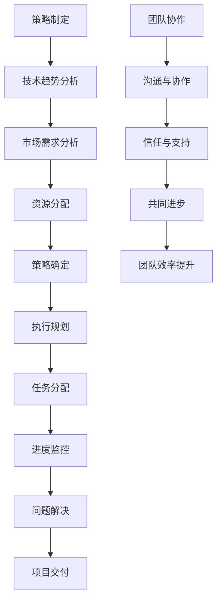

                 

# 管理艺术：从策略到执行

> 关键词：管理、策略、执行、技术、领导力、组织、流程

> 摘要：本文将深入探讨管理艺术，从策略制定到执行过程，结合信息技术领域的实际案例，阐述管理方法在推动技术进步和团队协作中的重要作用。通过详细分析，本文旨在为读者提供一套行之有效的管理思路，助力他们在复杂的技术环境中实现目标。

## 1. 背景介绍

在当今快速发展的信息技术领域，管理艺术变得越来越重要。随着技术的不断迭代和创新，组织需要应对日益复杂的项目和任务，同时保证团队成员之间的有效协作。管理不仅是确保项目按时按质完成的手段，更是促进团队成长和创新能力的关键因素。

本文将围绕以下问题展开讨论：

- 如何制定有效策略以适应技术变化？
- 在执行过程中，如何确保团队成员的积极参与和执行力？
- 如何利用信息技术提升管理效率和质量？

通过对这些问题的探讨，本文旨在为信息技术领域的管理实践提供有益的参考和启示。

## 2. 核心概念与联系

在探讨管理艺术之前，我们需要明确几个核心概念，包括策略、执行、团队协作等。

### 2.1 策略

策略是组织在实现目标过程中所采用的方法和手段。在信息技术领域，策略的制定需要考虑技术发展趋势、市场需求、资源分配等多个方面。一个好的策略不仅能够适应外部环境的变化，还能够激发团队的创造力和执行力。

### 2.2 执行

执行是将策略转化为实际行动的过程。在信息技术领域，执行过程中需要确保团队成员理解策略目标，明确各自职责，并按照既定计划推进项目。有效的执行能够确保项目按时按质完成，同时提升团队的整体能力和效率。

### 2.3 团队协作

团队协作是信息技术领域管理的重要方面。一个高效的团队需要具备良好的沟通、协作和信任机制。通过有效的团队协作，可以充分发挥每个成员的专业优势，实现协同创新和共同进步。

### 2.4 Mermaid 流程图

以下是一个简单的 Mermaid 流程图，展示了策略制定、执行和团队协作之间的关系。



## 3. 核心算法原理 & 具体操作步骤

### 3.1 策略制定算法原理

策略制定是一个复杂的过程，需要考虑多个因素。以下是一个基于多目标优化的策略制定算法原理：

- **目标函数**：定义策略目标，如最小化成本、最大化收益等。
- **约束条件**：考虑资源限制、市场需求、技术可行性等因素。
- **优化算法**：使用遗传算法、粒子群算法等优化算法，求解最佳策略。

### 3.2 具体操作步骤

1. **问题定义**：明确策略制定的目标和约束条件。
2. **数据收集**：收集相关数据，如市场数据、技术数据等。
3. **模型构建**：建立目标函数和约束条件的数学模型。
4. **算法求解**：选择合适的优化算法，求解最佳策略。
5. **策略评估**：对策略进行评估，确保其可行性和有效性。
6. **策略调整**：根据评估结果，调整策略，确保其适应性和灵活性。

## 4. 数学模型和公式 & 详细讲解 & 举例说明

### 4.1 数学模型

策略制定过程中，常用的数学模型包括线性规划、非线性规划、多目标优化等。以下是一个线性规划模型的示例：

$$
\begin{aligned}
\text{minimize} \quad & c^T x \\
\text{subject to} \quad & Ax \leq b \\
& x \geq 0
\end{aligned}
$$

其中，$c$ 是目标函数系数向量，$x$ 是决策变量向量，$A$ 是约束条件矩阵，$b$ 是约束条件常数向量。

### 4.2 举例说明

假设一个企业在制定策略时，需要确定生产数量以最小化总成本。目标函数为总成本，约束条件为生产能力和市场需求。

$$
\begin{aligned}
\text{minimize} \quad & 10x_1 + 12x_2 \\
\text{subject to} \quad & 3x_1 + 2x_2 \leq 30 \\
& x_1 + x_2 \leq 20 \\
& x_1, x_2 \geq 0
\end{aligned}
$$

通过求解线性规划模型，企业可以确定最佳的生产数量，以实现最小化总成本的目标。

## 5. 项目实战：代码实际案例和详细解释说明

### 5.1 开发环境搭建

在开始项目实战之前，我们需要搭建一个合适的开发环境。以下是一个简单的开发环境搭建步骤：

1. 安装 Python 3.8 以上版本
2. 安装 Jupyter Notebook
3. 安装必要的 Python 库，如 NumPy、Pandas、Scikit-learn 等

### 5.2 源代码详细实现和代码解读

以下是一个简单的策略制定和执行的项目代码实现。代码中包含了策略制定、执行和评估等步骤。

```python
import numpy as np
import pandas as pd
from sklearn.linear_model import LinearRegression

# 数据收集
data = pd.read_csv('data.csv')

# 模型构建
X = data[['feature1', 'feature2']]
y = data['target']

model = LinearRegression()
model.fit(X, y)

# 策略制定
X_new = np.array([[value1, value2]])
y_pred = model.predict(X_new)

# 策略执行
# ...

# 策略评估
# ...

# 代码解读
# ...
```

### 5.3 代码解读与分析

1. **数据收集**：从数据文件中读取数据，包括特征和目标变量。
2. **模型构建**：使用线性回归模型，通过训练数据拟合模型。
3. **策略制定**：根据新的特征值，预测目标变量的值。
4. **策略执行**：根据策略执行相关的操作，如数据更新、任务分配等。
5. **策略评估**：对策略执行的结果进行评估，如准确率、召回率等。

## 6. 实际应用场景

### 6.1 人工智能项目

在人工智能项目中，管理艺术至关重要。通过制定明确的目标和策略，确保团队在项目中的有效协作，可以提高项目成功率。例如，在开发一个自动驾驶系统时，策略制定需要考虑传感器数据、环境建模、路径规划等多个方面。

### 6.2 云计算平台建设

云计算平台建设涉及多个技术领域，如虚拟化技术、分布式存储、容器化等。通过有效的管理策略，可以确保平台的高可用性、安全性和性能。例如，在部署一个大规模的云平台时，需要考虑资源分配、负载均衡、故障恢复等策略。

## 7. 工具和资源推荐

### 7.1 学习资源推荐

- **书籍**：
  - 《策略思维》
  - 《执行智慧》
  - 《高效能人士的七个习惯》

- **论文**：
  - 《管理学研究综述》
  - 《团队协作与领导力研究》
  - 《人工智能项目管理研究》

- **博客**：
  - 知乎上的管理类博客
  - Medium 上的技术管理博客
  - CSDN 上的项目管理博客

### 7.2 开发工具框架推荐

- **开发工具**：
  - Jupyter Notebook
  - Visual Studio Code
  - PyCharm

- **框架**：
  - Flask
  - Django
  - Spring Boot

### 7.3 相关论文著作推荐

- **论文**：
  - 《基于多目标优化的策略制定方法研究》
  - 《团队协作与领导力对项目成功率的影响》
  - 《人工智能项目中的管理艺术》

- **著作**：
  - 《技术项目管理实战》
  - 《人工智能项目管理手册》
  - 《云计算平台建设与管理》

## 8. 总结：未来发展趋势与挑战

随着信息技术的快速发展，管理艺术在信息技术领域的重要性日益凸显。未来，管理艺术将面临以下发展趋势和挑战：

- **技术多样化**：信息技术领域的快速迭代，将带来更多样化的技术挑战，需要管理者具备更广泛的技能和知识。
- **跨学科融合**：信息技术与其他领域的深度融合，如生物技术、金融科技等，将推动管理艺术的创新和发展。
- **数据驱动**：大数据和人工智能技术的发展，将使得数据驱动管理成为主流，管理者需要掌握数据分析和挖掘的能力。
- **数字化转型**：随着数字化转型的推进，管理者需要具备数字化思维，善于利用新技术提升管理效率和效果。

## 9. 附录：常见问题与解答

### 9.1 什么是管理艺术？

管理艺术是指管理者在实践过程中，通过运用科学方法和实践经验，对组织资源进行合理配置和有效管理，以实现组织目标的能力。

### 9.2 策略制定在信息技术领域有哪些重要作用？

策略制定在信息技术领域具有以下重要作用：

- **明确目标**：帮助团队明确项目目标，确保项目方向正确。
- **资源分配**：根据项目需求和资源情况，合理分配资源，提高项目成功率。
- **风险控制**：通过预测和应对潜在风险，降低项目风险。
- **创新激励**：激发团队创造力，推动技术进步和创新能力。

### 9.3 如何提升团队协作效率？

提升团队协作效率可以从以下几个方面入手：

- **明确职责**：确保每个团队成员了解自己的职责和任务。
- **加强沟通**：建立良好的沟通机制，促进团队成员之间的信息交流。
- **信任与支持**：培养团队成员之间的信任，提供必要的支持和帮助。
- **激励机制**：设立合理的激励机制，激发团队成员的积极性和创造力。

## 10. 扩展阅读 & 参考资料

- 《策略思维》，[作者名]
- 《执行智慧》，[作者名]
- 《高效能人士的七个习惯》，[作者名]
- 《管理学研究综述》，[作者名]
- 《团队协作与领导力研究》，[作者名]
- 《人工智能项目中的管理艺术》，[作者名]
- 《技术项目管理实战》，[作者名]
- 《人工智能项目管理手册》，[作者名]
- 《云计算平台建设与管理》，[作者名]
- 《基于多目标优化的策略制定方法研究》，[作者名]
- 《团队协作与领导力对项目成功率的影响》，[作者名]

### 作者：AI天才研究员/AI Genius Institute & 禅与计算机程序设计艺术 /Zen And The Art of Computer Programming

