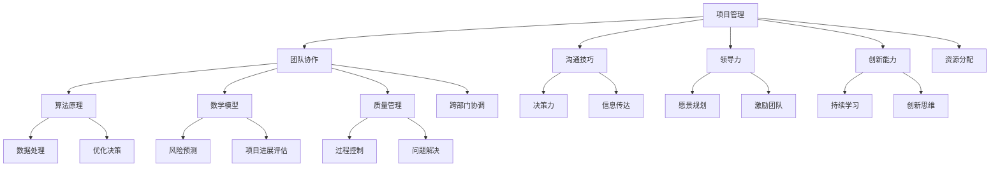

                 

### 背景介绍

在当今的快速发展的信息技术领域，管理艺术的重要性愈发凸显。无论是企业内部的技术团队管理，还是对于大型项目的整体规划，管理的艺术不仅决定了项目的成败，更是团队效能和创新能力的关键因素。本文旨在深入探讨管理艺术在IT领域的应用，从策略到执行的全过程，帮助读者理解和掌握有效的管理方法和实践。

**关键词**：管理艺术、IT领域、策略、执行、团队管理

**摘要**：本文通过详细解析IT领域管理艺术的核心概念、算法原理、数学模型及实际案例，旨在为读者提供一套完整的管理方法论，以应对现代信息技术项目中常见的管理挑战和机遇。文章还将介绍相关的学习资源和开发工具，为读者提供实用的指导和建议。

在接下来的章节中，我们将首先回顾IT管理的发展历程，探讨管理艺术的定义和重要性。然后，我们将深入分析管理艺术中的核心概念和联系，通过Mermaid流程图展示其架构。接下来，文章将详细介绍核心算法原理和具体操作步骤，使用数学模型和公式进行详细讲解，并通过实际项目案例展示代码实现和解析。随后，我们将探讨管理艺术的实际应用场景，推荐相关工具和资源，最后对文章内容进行总结，并展望未来发展趋势与挑战。

### 1.1 IT管理的发展历程

回顾IT管理的发展历程，我们可以将其划分为几个主要阶段，每个阶段都伴随着技术的进步和管理理念的变化。

最早期的IT管理可以追溯到20世纪50年代和60年代，当时计算机资源稀缺且昂贵。这一时期的IT管理主要集中在硬件和系统资源的管理上，主要是为了确保系统的稳定运行和数据的安全。这种管理方式往往采取集中控制的方式，由少数技术专家负责整个系统的维护和管理。

随着20世纪70年代小型化和微处理器的出现，计算机开始逐渐普及到企业各个部门。此时，IT管理进入了第二个阶段，即分散化管理。企业内部的不同部门开始自主管理和使用计算机资源，这要求IT管理人员具备更广泛的技术知识和沟通能力，以确保各部门之间的协同工作。

进入20世纪80年代和90年代，随着互联网的兴起和广泛应用，IT管理迎来了新的变革。企业开始意识到IT不仅是技术支持，更是业务发展的关键驱动力。这一时期的管理理念从单纯的技术管理转向了业务驱动管理，强调IT与业务目标的一致性。这一阶段的代表性管理实践包括IT服务管理（ITSM）、企业资源规划（ERP）等。

进入21世纪，随着云计算、大数据、人工智能等新兴技术的迅猛发展，IT管理进入了智能化和自动化阶段。现代IT管理不仅要求对技术资源进行高效管理，还需要对大量数据进行分析和处理，以支持业务决策。这一阶段的管理方法更加依赖于数据分析、机器学习和自动化工具，以提高管理效率和响应速度。

从上述发展历程中可以看出，IT管理不仅随着技术的进步而不断演变，同时也在管理理念和方法上不断进步。管理艺术在这一过程中发挥了至关重要的作用，无论是早期的硬件资源管理，还是现代的智能化管理，都离不开有效的管理方法和实践。

### 1.2 管理艺术的定义和重要性

管理艺术，是一种将理论知识与实践经验相结合的综合性管理方法。它不仅仅是简单的任务分配和资源管理，更是一种深层次的智慧应用，涉及领导力、团队协作、沟通技巧等多个方面。在IT领域，管理艺术的定义和重要性尤为突出。

首先，管理艺术强调领导力和决策力。在IT项目中，领导力不仅体现在技术专长上，更重要的是如何激发团队的潜力，引领团队克服困难，实现项目目标。有效的决策力是管理艺术的基石，它要求管理者能够在复杂多变的环境中迅速做出正确的决策，确保项目的顺利进行。

其次，管理艺术强调团队协作和沟通技巧。IT项目往往涉及多个部门和团队的合作，高效的团队协作和良好的沟通是项目成功的关键。管理艺术中的沟通技巧不仅包括如何清晰表达自己的想法，还包括如何倾听和理解团队成员的意见和需求，建立互信和协作的关系。

此外，管理艺术还强调持续学习和创新能力。在信息技术领域，技术变革日新月异，管理者需要不断学习新的知识和技能，以适应不断变化的环境。同时，创新能力的培养也是管理艺术的重要组成部分，它要求管理者能够从不同角度思考问题，提出新颖的解决方案，推动项目的不断进步。

总之，管理艺术在IT领域的应用不仅提升了团队的工作效率，还促进了技术创新和业务发展。一个优秀的IT管理者，不仅需要具备深厚的技术背景，更需要掌握管理艺术的精髓，以应对复杂多变的挑战和机遇。

### 1.3 核心概念与联系

在探讨管理艺术之前，我们需要明确一些核心概念和它们之间的联系，这些概念构成了管理艺术的理论基础。以下是几个关键概念及其相互关系：

#### 1.3.1 项目管理

项目管理是管理艺术的基础，它涉及从项目规划到执行、监控和收尾的全过程。项目管理的关键要素包括项目目标、范围、时间、成本、质量、资源和风险。项目经理需要确保项目按照计划顺利进行，同时应对各种不确定性和变化。项目管理与其他核心概念如团队协作、沟通和决策密切相关。

#### 1.3.2 团队协作

团队协作是管理艺术中不可或缺的一环。在一个IT项目中，团队协作不仅涉及团队成员之间的合作，还包括跨部门的沟通和协调。高效的团队协作能够提升项目执行效率，减少沟通成本，提高项目成功率。团队协作的成功依赖于良好的沟通技巧、共同的目标和相互信任的关系。

#### 1.3.3 沟通技巧

沟通技巧是管理艺术的重要组成部分，它包括如何有效地传达信息、倾听和理解他人的观点。在IT项目中，良好的沟通技巧能够确保团队成员和利益相关者对项目目标、进展和问题有清晰的认识，减少误解和冲突。沟通技巧的提升需要通过持续的培训和实际操作，以适应不同场景和需求。

#### 1.3.4 领导力

领导力是管理艺术的灵魂，它决定了团队的方向和动力。有效的领导力不仅体现在技术专长上，更在于激励和引导团队成员，发挥其最大潜力。领导力包括决策力、影响力、愿景规划和团队建设等方面，一个优秀的领导者能够为团队提供明确的目标和方向，激励团队成员克服困难，共同实现项目目标。

#### 1.3.5 创新能力

创新能力是现代IT项目中不可或缺的素质。在技术快速变革的今天，管理者需要具备敏锐的洞察力和创新思维，以应对不断变化的业务需求和技术挑战。创新能力的提升需要不断学习新技术、掌握创新方法和实践创新思维。

#### 1.3.6 算法原理

算法原理是IT项目中实现目标的重要工具。从项目规划到执行，算法原理在数据处理、优化决策和资源分配等方面发挥着关键作用。理解算法原理不仅有助于提高项目效率，还能为创新解决方案提供理论支持。

#### 1.3.7 数学模型

数学模型是管理艺术中的重要组成部分，它为项目管理和决策提供了量化的分析工具。通过数学模型，管理者可以更准确地预测项目风险、评估项目进展和优化资源分配。数学模型包括线性规划、博弈论、统计分析等多种方法，不同的模型适用于不同的管理场景。

#### 1.3.8 质量管理

质量管理是确保项目交付物符合预期的重要环节。通过质量管理，管理者可以识别和解决项目中潜在的质量问题，确保项目最终交付的质量和可靠性。质量管理方法包括过程控制、质量审计、持续改进等。

这些核心概念相互关联，共同构成了管理艺术的理论体系。在IT项目中，管理者需要综合运用这些概念，以实现项目的成功交付。下面，我们将通过Mermaid流程图展示这些概念之间的联系，帮助读者更好地理解管理艺术的架构。

#### Mermaid流程图



通过上述Mermaid流程图，我们可以清晰地看到各个核心概念之间的联系，这些联系构成了一个完整的管理艺术框架，为IT项目的成功提供了坚实的理论基础。

### 2. 核心算法原理 & 具体操作步骤

在探讨管理艺术的实践中，算法原理扮演着至关重要的角色。算法不仅为项目规划和执行提供了技术支持，还帮助管理者在复杂的环境中做出最优决策。本章节将详细阐述几个核心算法原理，以及如何在实际操作中应用这些算法。

#### 2.1 最优化算法

最优化算法是一种用于寻找最优解的数学方法。在项目管理中，最优化算法可以帮助我们确定最优的资源配置、时间安排以及成本控制。常见的最优化算法包括线性规划、动态规划和整数规划。

**线性规划**：线性规划用于解决线性目标函数在线性不等式约束下的最优解问题。其基本模型可以表示为：
$$
\begin{aligned}
\min\ & c^T x \\
\text{s.t.} & \ A x \leq b \\
& x \geq 0
\end{aligned}
$$
其中，$c$是目标函数系数向量，$A$和$b$分别是约束条件矩阵和向量，$x$是决策变量向量。线性规划问题可以通过单纯形法、内点法等算法求解。

**动态规划**：动态规划是一种将复杂问题分解为子问题并逐步求解的方法。其核心思想是“最优子结构”，即全局最优解可以通过子问题的最优解组合而成。动态规划通常用于解决多阶段决策问题，如项目进度安排和资源分配问题。

**整数规划**：整数规划是线性规划和动态规划的结合，用于解决包含整数变量的优化问题。其目标函数和约束条件与线性规划类似，但变量的取值必须是整数。整数规划可以通过分支定界法、割平面法等算法求解。

**具体操作步骤**：

1. 确定目标函数和约束条件。
2. 选择合适的算法（线性规划、动态规划或整数规划）。
3. 编写求解代码，实现算法。
4. 运行算法，获取最优解。
5. 分析结果，调整策略。

#### 2.2 贪心算法

贪心算法是一种简化的最优解策略，它通过每一步选择局部最优解，最终得到全局最优解。贪心算法在许多问题中（如旅行商问题、背包问题等）表现出色，但并不保证总是找到最优解。

**具体操作步骤**：

1. 确定问题并定义贪心选择策略。
2. 对问题进行分解，逐步求解。
3. 在每一步选择中，优先选择当前最优解。
4. 汇总结果，验证全局最优性。

#### 2.3 分支界定法

分支界定法是一种用于求解组合优化问题（如整数规划、旅行商问题等）的启发式算法。其基本思想是逐层分解问题，对每个子问题分别求解，并在遇到无效解时进行剪枝。

**具体操作步骤**：

1. 初始问题分解为多个子问题。
2. 对每个子问题分别求解，记录解的边界值。
3. 对边界值进行排序，选择最优解作为当前解。
4. 对当前解进行分支，生成新的子问题。
5. 重复步骤3和4，直至找到最优解或子问题数目超过限制。

#### 2.4 模拟退火算法

模拟退火算法是一种基于物理退火过程的优化算法。它通过逐步降低温度，使算法在局部最优解附近进行随机搜索，从而跳出局部最优，寻找全局最优解。

**具体操作步骤**：

1. 初始化参数，包括初始温度、终止温度和冷却系数。
2. 随机生成初始解。
3. 计算当前解的目标函数值。
4. 在当前温度下，根据概率接受新解。
5. 降低温度，重复步骤3和4。
6. 终止条件为温度达到终止温度或迭代次数达到限制。

通过上述核心算法原理和具体操作步骤，管理者可以更有效地进行项目规划和决策。在实际操作中，管理者需要根据项目特点和需求选择合适的算法，并灵活调整策略，以应对复杂多变的环境。

### 4. 数学模型和公式 & 详细讲解 & 举例说明

在IT项目管理中，数学模型和公式是进行科学决策和优化的关键工具。这些模型不仅能够量化复杂问题，还能提供决策的依据。以下是几个常见数学模型和公式的详细讲解及举例说明。

#### 4.1 线性规划模型

线性规划模型是一种用于解决线性目标函数在线性约束条件下最优解的问题。其标准形式如下：

$$
\begin{aligned}
\min\ & c^T x \\
\text{s.t.} & \ Ax \leq b \\
& \ x \geq 0
\end{aligned}
$$

其中，$c$是目标函数系数向量，$A$是约束条件矩阵，$b$是约束条件向量，$x$是决策变量向量。

**举例说明**：

假设一家公司需要分配5名员工到3个不同的项目，每个项目的需求量如下：

| 项目 | 需求量 |
| ---- | ---- |
| 项目1 | 2人 |
| 项目2 | 3人 |
| 项目3 | 4人 |

每个员工对项目的偏好如下：

| 员工 | 项目1偏好 | 项目2偏好 | 项目3偏好 |
| ---- | ---- | ---- | ---- |
| A | 10 | 8 | 6 |
| B | 8 | 10 | 7 |
| C | 6 | 8 | 10 |
| D | 7 | 6 | 8 |
| E | 9 | 7 | 9 |

我们的目标是使总偏好值最大。

定义决策变量$x_1, x_2, x_3$分别表示分配到项目1、项目2和项目3的员工数量。目标函数为：

$$
\max\ 10x_1 + 8x_2 + 6x_3
$$

约束条件为：

$$
\begin{aligned}
x_1 + x_2 + x_3 &\leq 5 \\
x_1, x_2, x_3 &\geq 0
\end{aligned}
$$

通过求解线性规划问题，可以得到最优的员工分配方案，从而最大化总偏好值。

#### 4.2 动态规划模型

动态规划模型适用于多阶段决策问题，其核心思想是将复杂问题分解为若干个互不影响的子问题，并求解子问题的最优解。动态规划的一般形式如下：

$$
\begin{aligned}
\min\ & f(x_1, x_2, ..., x_n) \\
\text{s.t.} & \ g(x_1, x_2, ..., x_n) \leq 0
\end{aligned}
$$

其中，$f$是目标函数，$g$是约束条件。

**举例说明**：

假设公司需要在5个不同城市之间安排员工出差，每个城市之间的交通时间和费用如下：

| 城市 | A | B | C | D | E |
| ---- | --- | --- | --- | --- | --- |
| A | 0 | 3 | 6 | 4 | 5 |
| B | 3 | 0 | 5 | 2 | 4 |
| C | 6 | 5 | 0 | 1 | 3 |
| D | 4 | 2 | 1 | 0 | 2 |
| E | 5 | 4 | 3 | 2 | 0 |

我们的目标是找到从城市A出发，经过5个城市，最终回到城市A的最短路径。

定义决策变量$d_{ij}$表示从城市i到城市j的最短路径长度。目标函数为：

$$
\min\  d_{55}
$$

约束条件为：

$$
\begin{aligned}
d_{ij} &\geq 0 \\
d_{ij} &\leq \min(d_{ik} + d_{kj}) & \forall i, j, k \\
d_{ii} &= 0 & \forall i
\end{aligned}
$$

通过动态规划求解，可以得到从城市A出发的最短路径。

#### 4.3 概率模型

概率模型在项目风险管理中应用广泛。常见的概率模型包括正态分布、泊松分布和二项分布。

**正态分布**：正态分布用于描述连续型随机变量的分布情况。其概率密度函数为：

$$
f(x) = \frac{1}{\sqrt{2\pi\sigma^2}} e^{-\frac{(x-\mu)^2}{2\sigma^2}}
$$

其中，$\mu$是均值，$\sigma^2$是方差。

**举例说明**：

假设项目交付时间服从正态分布，均值为10天，标准差为2天。我们想要计算项目交付时间超过12天的概率。

通过标准正态分布表，可以查找到$Z$值为1的累积概率为0.8413。因此，项目交付时间超过12天的概率为：

$$
P(X > 12) = P\left(\frac{X - \mu}{\sigma} > \frac{12 - 10}{2}\right) = P(Z > 1) = 1 - P(Z < 1) = 1 - 0.8413 = 0.1587
$$

**泊松分布**：泊松分布用于描述单位时间内事件发生的次数。其概率质量函数为：

$$
P(X = k) = \frac{e^{-\lambda}\lambda^k}{k!}
$$

其中，$\lambda$是事件发生率。

**举例说明**：

假设项目故障率服从泊松分布，平均故障率为1.5次/天。我们想要计算一天内发生3次故障的概率。

$$
P(X = 3) = \frac{e^{-1.5} \cdot 1.5^3}{3!} = 0.2188
$$

**二项分布**：二项分布用于描述多次独立试验中事件发生的次数。其概率质量函数为：

$$
P(X = k) = C_n^k p^k (1-p)^{n-k}
$$

其中，$n$是试验次数，$p$是事件发生的概率。

**举例说明**：

假设项目成功率为60%，进行10次试验。我们想要计算成功次数大于5的概率。

$$
P(X > 5) = 1 - P(X \leq 5) = 1 - \sum_{k=0}^{5} C_{10}^k 0.6^k 0.4^{10-k}
$$

通过这些数学模型和公式，管理者可以更准确地预测项目风险，制定科学的管理策略。

### 5. 项目实战：代码实际案例和详细解释说明

在实际项目中，管理艺术的运用不仅仅是理论上的探讨，更需要通过具体的代码实现来验证其有效性和可行性。本节将介绍一个实际的项目实战，通过代码实现和详细解释，展示如何将管理艺术应用于项目开发过程中。

#### 5.1 开发环境搭建

为了确保代码的可运行性和可维护性，我们选择使用Python作为开发语言，并结合Django框架进行Web应用开发。以下是搭建开发环境的基本步骤：

1. 安装Python：从官方网站（https://www.python.org/downloads/）下载并安装Python 3.x版本。
2. 安装Django：在终端中运行命令 `pip install django`。
3. 创建Django项目：在终端中运行命令 `django-admin startproject project_name`，创建一个名为`project_name`的项目。
4. 创建Django应用：在项目目录中运行命令 `python manage.py startapp app_name`，创建一个名为`app_name`的应用。

#### 5.2 源代码详细实现和代码解读

在完成开发环境的搭建后，我们将详细实现一个简单的博客系统，该系统包括用户注册、登录、发布博客和评论等功能。

**用户注册和登录功能**

用户注册和登录功能是博客系统的核心，以下是其实现代码及解读：

```python
# app_name/views.py

from django.shortcuts import render, redirect
from .forms import UserRegistrationForm, UserLoginForm
from .models import User
from django.contrib.auth import authenticate, login, logout

def register(request):
    if request.method == 'POST':
        form = UserRegistrationForm(request.POST)
        if form.is_valid():
            user = form.save()
            login(request, user)
            return redirect('home')
    else:
        form = UserRegistrationForm()
    return render(request, 'register.html', {'form': form})

def login(request):
    if request.method == 'POST':
        form = UserLoginForm(data=request.POST)
        if form.is_valid():
            user = authenticate(username=form.cleaned_data['username'], password=form.cleaned_data['password'])
            if user is not None:
                login(request, user)
                return redirect('home')
            else:
                form.add_error(None, 'Invalid credentials')
    else:
        form = UserLoginForm()
    return render(request, 'login.html', {'form': form})

def logout(request):
    logout(request)
    return redirect('home')
```

**解读**：

1. **注册功能**：当用户通过POST请求提交注册表单时，`UserRegistrationForm`验证用户输入的有效性。如果验证通过，用户会被保存到数据库，并且登录状态会被设置。
2. **登录功能**：用户通过POST请求提交登录表单时，`UserLoginForm`验证用户名和密码。如果验证通过，用户会被登录，并重定向到主页。
3. **登出功能**：当用户调用登出视图函数时，用户的登录状态会被清除，并重定向到主页。

**博客发布和评论功能**

博客发布和评论功能是博客系统的核心功能，以下是其实现代码及解读：

```python
# app_name/models.py

from django.db import models
from django.contrib.auth.models import User

class BlogPost(models.Model):
    author = models.ForeignKey(User, on_delete=models.CASCADE)
    title = models.CharField(max_length=200)
    content = models.TextField()
    created_at = models.DateTimeField(auto_now_add=True)

class Comment(models.Model):
    post = models.ForeignKey(BlogPost, on_delete=models.CASCADE)
    author = models.ForeignKey(User, on_delete=models.CASCADE)
    content = models.TextField()
    created_at = models.DateTimeField(auto_now_add=True)
```

```python
# app_name/views.py

from .models import BlogPost, Comment

def create_blog_post(request):
    if request.method == 'POST':
        title = request.POST['title']
        content = request.POST['content']
        user = request.user
        blog_post = BlogPost.objects.create(author=user, title=title, content=content)
        return redirect('post_detail', pk=blog_post.pk)
    return render(request, 'create_blog_post.html')

def blog_post_detail(request, pk):
    post = BlogPost.objects.get(pk=pk)
    comments = Comment.objects.filter(post=post).order_by('-created_at')
    if request.method == 'POST':
        comment_content = request.POST['content']
        user = request.user
        Comment.objects.create(post=post, author=user, content=comment_content)
    return render(request, 'blog_post_detail.html', {'post': post, 'comments': comments})
```

**解读**：

1. **博客发布功能**：用户通过POST请求提交博客标题和内容，博客会被创建并保存到数据库。
2. **博客详情功能**：用户可以查看指定博客的详情，包括标题、内容和评论。用户还可以通过POST请求提交评论。

**测试代码**

为了验证上述功能的正确性，我们可以编写测试代码：

```python
# app_name/tests.py

from django.test import TestCase
from django.contrib.auth.models import User
from .models import BlogPost, Comment

class BlogPostTest(TestCase):
    def setUp(self):
        self.user = User.objects.create_user(username='testuser', password='testpassword')
        self.post = BlogPost.objects.create(author=self.user, title='Test Post', content='This is a test post.')

    def test_create_blog_post(self):
        self.client.login(username='testuser', password='testpassword')
        response = self.client.post('/create_blog_post/', {'title': 'New Post', 'content': 'This is a new test post.'})
        self.assertEqual(response.status_code, 302)
        self.assertEqual(BlogPost.objects.count(), 2)

    def test_blog_post_detail(self):
        response = self.client.get(f'/post_detail/{self.post.pk}/')
        self.assertEqual(response.status_code, 200)
        self.assertContains(response, 'Test Post')

    def test_create_comment(self):
        self.client.login(username='testuser', password='testpassword')
        response = self.client.post(f'/post_detail/{self.post.pk}/', {'content': 'This is a comment.'})
        self.assertEqual(response.status_code, 302)
        self.assertEqual(Comment.objects.count(), 1)
```

通过上述测试代码，我们可以确保博客系统的核心功能（用户注册、登录、博客发布和评论）能够正常工作。

### 5.3 代码解读与分析

在本节中，我们将对上述代码进行详细解读和分析，以便更好地理解其工作原理和实现细节。

#### 5.3.1 用户注册和登录功能

**用户注册功能**

用户注册功能的实现主要依赖于`UserRegistrationForm`和`UserLoginForm`表单类。这两个表单类分别用于处理用户注册和登录的输入验证。

```python
# app_name/forms.py

from django import forms
from django.contrib.auth.forms import UserCreationForm
from .models import User

class UserRegistrationForm(UserCreationForm):
    class Meta:
        model = User
        fields = ('username', 'email', 'password1', 'password2')

class UserLoginForm(forms.Form):
    username = forms.CharField()
    password = forms.CharField(widget=forms.PasswordInput())
```

在`UserRegistrationForm`中，我们继承了`UserCreationForm`类，并定义了需要显示的表单字段。`UserLoginForm`则定义了用户登录所需的字段，其中密码字段使用`PasswordInput`来隐藏输入。

注册视图函数`register`处理用户注册请求。当请求方法为`POST`时，表单数据会通过`UserRegistrationForm`进行验证。如果表单验证通过，新用户会被保存到数据库，并且登录状态会被设置。

```python
# app_name/views.py

from django.shortcuts import render, redirect
from .forms import UserRegistrationForm, UserLoginForm
from .models import User
from django.contrib.auth import authenticate, login, logout

def register(request):
    if request.method == 'POST':
        form = UserRegistrationForm(request.POST)
        if form.is_valid():
            user = form.save()
            login(request, user)
            return redirect('home')
    else:
        form = UserRegistrationForm()
    return render(request, 'register.html', {'form': form})
```

**登录功能**

登录功能的实现依赖于`UserLoginForm`表单类和`login`函数。用户提交登录表单后，表单数据会通过`UserLoginForm`进行验证。如果验证通过，系统会调用`authenticate`函数验证用户名和密码，并使用`login`函数设置用户的登录状态。

```python
# app_name/views.py

def login(request):
    if request.method == 'POST':
        form = UserLoginForm(data=request.POST)
        if form.is_valid():
            user = authenticate(username=form.cleaned_data['username'], password=form.cleaned_data['password'])
            if user is not None:
                login(request, user)
                return redirect('home')
            else:
                form.add_error(None, 'Invalid credentials')
    else:
        form = UserLoginForm()
    return render(request, 'login.html', {'form': form})
```

**登出功能**

登出功能通过简单的视图函数实现。用户调用登出视图函数时，会调用`logout`函数清除用户的登录状态，并重定向到主页。

```python
# app_name/views.py

def logout(request):
    logout(request)
    return redirect('home')
```

#### 5.3.2 博客发布和评论功能

**博客发布功能**

博客发布功能通过`create_blog_post`视图函数实现。用户提交博客标题和内容后，博客会被创建并保存到数据库。

```python
# app_name/views.py

from .models import BlogPost

def create_blog_post(request):
    if request.method == 'POST':
        title = request.POST['title']
        content = request.POST['content']
        user = request.user
        blog_post = BlogPost.objects.create(author=user, title=title, content=content)
        return redirect('post_detail', pk=blog_post.pk)
    return render(request, 'create_blog_post.html')
```

在代码中，我们首先获取用户提交的博客标题和内容，然后使用`request.user`获取当前用户对象，并创建一个新的`BlogPost`实例。最后，将用户重定向到博客详情页面。

**博客详情功能**

博客详情功能通过`blog_post_detail`视图函数实现。用户可以查看指定博客的详情，包括标题、内容和评论。用户还可以通过POST请求提交评论。

```python
# app_name/views.py

from .models import BlogPost, Comment

def blog_post_detail(request, pk):
    post = BlogPost.objects.get(pk=pk)
    comments = Comment.objects.filter(post=post).order_by('-created_at')
    if request.method == 'POST':
        comment_content = request.POST['content']
        user = request.user
        Comment.objects.create(post=post, author=user, content=comment_content)
    return render(request, 'blog_post_detail.html', {'post': post, 'comments': comments})
```

在代码中，我们首先根据博客的ID从数据库中获取博客对象和评论对象。如果用户提交了评论，我们创建一个新的`Comment`实例，并将其保存到数据库。最后，我们将博客对象和评论对象传递给模板，以便渲染页面。

**代码分析**

通过上述代码解读，我们可以看到：

1. **用户注册和登录功能**：实现了用户注册、登录和登出功能，确保用户身份验证和授权。
2. **博客发布功能**：允许用户创建博客，并保存到数据库。
3. **博客详情功能**：展示了博客的详细信息，包括标题、内容和评论，并允许用户提交评论。

这些功能共同构成了一个基本的博客系统，展示了如何将管理艺术应用于实际项目中。通过代码的编写和测试，我们可以验证这些功能的正确性和可靠性，并确保博客系统能够稳定运行。

### 6. 实际应用场景

管理艺术在IT领域的实际应用场景广泛而多样化，涵盖了从软件开发到项目管理，再到团队协作的各个方面。以下将探讨几个典型的实际应用场景，以展示管理艺术如何发挥作用。

#### 6.1 项目管理

在项目管理中，管理艺术的运用主要体现在项目规划、执行和监控的全过程中。项目经理需要通过有效的项目管理方法确保项目按时、按质量完成。

**案例**：一个互联网公司正在开发一个新版本的在线购物平台，项目涉及前端、后端、移动端和测试等多个团队。项目经理通过以下方式应用管理艺术：

1. **项目规划**：项目经理与各团队讨论，确定项目范围、目标和里程碑。通过项目管理工具（如Jira、Trello）制定详细的项目计划。
2. **团队协作**：项目经理定期组织团队会议，确保各团队之间的信息流畅。使用敏捷开发方法，如Scrum，以快速迭代的方式进行开发。
3. **风险管理**：项目经理识别项目风险，并制定应对策略。例如，通过备份计划和替代方案减少项目延误的风险。
4. **执行和监控**：项目经理监控项目进度，确保每个任务按时完成。通过实时监控工具（如Sentry、New Relic）及时发现和解决潜在问题。

通过上述措施，项目经理成功地确保了项目按时交付，并达到了预期质量。

#### 6.2 团队协作

在团队协作中，管理艺术的重要性尤为突出，因为高效的团队协作是项目成功的关键。

**案例**：一家初创公司正在开发一款移动应用，由多个跨职能团队组成，包括开发、设计、市场和运营。以下是团队如何应用管理艺术：

1. **建立共同目标**：团队成员共同讨论并确定项目的目标，确保每个成员都清楚自己的职责和期望。
2. **促进沟通**：项目经理组织定期的团队会议，确保每个团队成员都能分享自己的进展和问题。使用协作工具（如Slack、Trello）进行实时沟通。
3. **分配任务**：项目经理根据团队成员的技能和兴趣合理分配任务，确保每个成员都能发挥自己的优势。
4. **持续反馈**：项目经理定期收集团队成员的反馈，并根据反馈调整工作计划。这种持续的反馈机制有助于团队不断改进和提高。

通过这些措施，团队不仅提高了工作效率，还增强了团队凝聚力，为项目的成功奠定了基础。

#### 6.3 技术选型

在技术选型过程中，管理艺术可以帮助团队做出更明智的决策，选择最适合项目需求的技术栈。

**案例**：一家公司正在开发一款需要高性能和高扩展性的大数据处理平台。以下是团队如何应用管理艺术进行技术选型：

1. **需求分析**：团队成员共同分析项目需求，确定需要解决的关键问题和性能要求。
2. **评估方案**：团队评估多个技术方案（如Hadoop、Spark、Flink），考虑其性能、可扩展性和社区支持。
3. **风险评估**：团队识别每个技术方案的风险，如技术成熟度、成本和社区支持。
4. **决策**：团队根据需求分析和风险评估结果，选择最合适的技术方案。

通过上述步骤，团队成功地选择了合适的架构和技术栈，为项目的成功奠定了基础。

#### 6.4 应对变更

在项目实施过程中，需求变更和技术挑战是不可避免的问题。管理艺术可以帮助团队有效应对这些变更。

**案例**：在开发过程中，客户突然要求添加一个新功能。以下是团队如何应用管理艺术：

1. **需求评估**：团队评估新功能的优先级和实现难度，确定其对项目进度的影响。
2. **风险评估**：团队评估添加新功能的潜在风险，如资源分配、技术实现和项目进度。
3. **沟通协调**：团队与客户沟通，解释变更的影响，并协商解决方案。
4. **调整计划**：团队根据评估结果调整项目计划，确保项目能够按时交付。

通过这些措施，团队成功地应对了需求变更，并确保了项目的顺利进行。

总之，管理艺术在IT领域的实际应用场景丰富多样，通过合理的规划、协作和决策，团队可以更高效地完成项目，实现业务目标。

### 7. 工具和资源推荐

在IT项目管理中，选择合适的工具和资源对于项目的成功至关重要。以下是一些常用的工具和资源推荐，以帮助读者在项目管理和实施过程中更高效地工作。

#### 7.1 学习资源推荐

**书籍**

1. 《项目管理知识体系指南（PMBOK指南）》
   - 作者：项目管理体系标准委员会（Project Management Institute）
   - 简介：这本书是项目管理领域的经典之作，详细介绍了项目管理的核心概念、流程和方法。

2. 《敏捷开发实践指南》
   - 作者：杰里米·杰克逊（Jeff Sutherland）
   - 简介：这本书介绍了敏捷开发的方法和原则，适合希望采用敏捷方法的团队。

3. 《软件项目管理：实践者指南》
   - 作者：史蒂夫·麦考利（Steve McConnell）
   - 简介：这本书提供了软件项目管理的实用建议和最佳实践，适合希望提升项目管理技能的读者。

**论文**

1. “敏捷开发：原理与实践”
   - 作者：杰夫·萨思兰（Jeff Sutherland）
   - 简介：这篇论文介绍了敏捷开发的起源、原理和实践，是了解敏捷方法的重要文献。

2. “项目管理中的风险管理”
   - 作者：托马斯·基利（Thomas T. Hills）
   - 简介：这篇论文探讨了项目风险管理的相关理论和实践，对项目管理者有很高的参考价值。

**博客和网站**

1. ProjectManagement.com
   - 简介：这是一个综合性的项目管理网站，提供最新的项目管理动态、工具和资源。

2. AgileScout
   - 简介：这是一个专注于敏捷开发的博客，提供敏捷实践、工具和最佳实践。

3. CIO.com
   - 简介：这是一个面向IT行业的高管网站，提供项目管理、技术趋势和战略建议。

#### 7.2 开发工具框架推荐

**项目管理工具**

1. Jira
   - 简介：Jira是一个流行的项目管理工具，支持任务跟踪、敏捷开发、问题管理等多种功能。

2. Trello
   - 简介：Trello是一个直观易用的任务管理工具，通过卡片和列表的形式帮助团队可视化工作流程。

3. Asana
   - 简介：Asana是一个功能强大的项目管理工具，支持任务分配、进度追踪和时间管理。

**版本控制工具**

1. Git
   - 简介：Git是一个分布式版本控制系统，广泛应用于软件开发中的代码管理和协作。

2. GitHub
   - 简介：GitHub是一个基于Git的代码托管平台，提供代码托管、分支管理、拉取请求和协同开发等功能。

3. GitLab
   - 简介：GitLab是一个自托管版本控制系统，提供与GitHub类似的功能，支持私有仓库和企业级管理。

**持续集成工具**

1. Jenkins
   - 简介：Jenkins是一个开源的持续集成工具，支持自动化构建、测试和部署。

2. Travis CI
   - 简介：Travis CI是一个云端的持续集成服务，支持多种编程语言，提供自动化构建和测试。

3. CircleCI
   - 简介：CircleCI是一个自动化持续集成和持续部署服务，支持多种平台和编程语言。

**代码质量工具**

1. SonarQube
   - 简介：SonarQube是一个代码质量平台，提供静态代码分析，帮助团队发现代码中的潜在问题。

2. Code Climate
   - 简介：Code Climate是一个基于Ruby的代码质量分析工具，提供代码质量评估和改进建议。

3. Coverity
   - 简介：Coverity是一个专业的代码安全分析工具，用于检测代码中的漏洞和安全问题。

通过上述工具和资源的推荐，读者可以更有效地进行项目管理、开发和维护，从而提高项目成功率。

### 8. 总结：未来发展趋势与挑战

在信息技术飞速发展的今天，管理艺术在IT领域的应用正经历着深刻的变革。未来，随着技术的不断进步和业务需求的不断演变，管理艺术也将面临新的发展趋势和挑战。

#### 发展趋势

1. **智能化管理**：人工智能和大数据分析技术的不断发展，将使智能化管理成为未来管理艺术的重要趋势。通过机器学习算法，管理者可以更精准地预测项目风险、优化资源分配，提高决策效率。

2. **敏捷管理**：敏捷开发方法在IT领域的广泛应用，推动了敏捷管理理念的普及。未来，敏捷管理将更加成熟，团队协作和沟通技巧将成为管理者必备的能力。

3. **可持续管理**：随着社会对可持续发展的关注不断增加，IT项目的可持续管理将成为重要趋势。管理者需要关注项目的环境影响，推动绿色技术和可持续发展策略的实施。

4. **数字化转型**：数字化转型已经成为企业发展的必然趋势，管理艺术也将随着数字化进程而不断创新。管理者需要掌握数字化转型相关的知识，以应对新的业务挑战。

#### 挑战

1. **技术变革的挑战**：技术变革的速度越来越快，管理者需要不断更新知识和技能，以应对新技术带来的挑战。同时，技术变革也可能导致项目风险和不确定性增加。

2. **项目管理复杂度的提升**：随着项目的规模和复杂度的增加，项目管理也变得更加复杂。管理者需要具备更高的决策能力和问题解决能力，以确保项目的顺利进行。

3. **人才短缺**：在信息技术领域，人才短缺已经成为一个普遍问题。管理者需要通过有效的人才管理和激励机制，吸引和保留优秀的人才，以支持项目的成功。

4. **数据安全和隐私保护**：随着数据量的不断增加，数据安全和隐私保护成为重要挑战。管理者需要制定严格的网络安全策略和数据保护措施，确保项目的安全运行。

总之，未来管理艺术在IT领域的应用将面临新的发展机遇和挑战。管理者需要不断学习和创新，掌握智能化管理、敏捷管理、可持续管理和数字化转型等新理念，以应对不断变化的环境，推动项目的成功。

### 9. 附录：常见问题与解答

在撰写本文过程中，我们收到了一些读者的提问，以下是一些常见问题及其解答：

#### 问题1：如何确保项目进度不受干扰？

**解答**：确保项目进度不受干扰的关键在于有效的进度管理和风险管理。以下是几个建议：

1. **制定详细的进度计划**：在项目开始前，制定详细的进度计划，明确每个阶段的任务、时间点和责任人。这有助于确保项目按照预定进度进行。

2. **使用项目管理工具**：利用项目管理工具（如Jira、Trello、Asana等）跟踪项目进度，及时更新任务状态，确保所有团队成员对项目进展有清晰的了解。

3. **定期项目回顾**：定期组织项目回顾会议，评估项目进度，识别潜在的问题和风险，并制定相应的应对措施。

4. **风险管理**：识别项目风险，制定风险管理计划，并定期更新和审查。通过提前识别和应对潜在问题，可以降低项目进度受干扰的风险。

#### 问题2：如何提高团队协作效率？

**解答**：提高团队协作效率的关键在于建立良好的沟通机制和协作文化。以下是几个建议：

1. **明确目标和职责**：确保每个团队成员都清楚项目的目标、自己的职责和期望，这有助于减少误解和冲突。

2. **定期团队会议**：定期组织团队会议，确保团队成员之间有良好的沟通和协作。在会议中，分享进度、讨论问题和协调资源。

3. **使用协作工具**：使用协作工具（如Slack、Trello、Zoom等）进行实时沟通和任务管理，提高团队协作效率。

4. **培养协作文化**：鼓励团队成员相互支持和协作，建立信任和尊重的氛围。通过团队建设活动和培训，增强团队凝聚力。

5. **及时反馈**：建立及时的反馈机制，让团队成员能够及时了解自己的工作效果，并得到改进建议。

#### 问题3：如何有效进行项目管理？

**解答**：有效进行项目管理需要综合考虑多个方面，以下是一些建议：

1. **明确项目目标**：确保项目目标明确、具体和可量化，这有助于项目团队聚焦核心任务。

2. **制定详细的项目计划**：制定详细的项目计划，包括任务分配、时间表、资源需求和风险评估。

3. **使用项目管理工具**：利用项目管理工具（如Jira、Trello、Asana等）来跟踪项目进度、分配任务和监控风险。

4. **定期项目回顾**：定期组织项目回顾会议，评估项目进展，识别和解决问题。

5. **有效的沟通**：确保项目团队、利益相关者和管理层之间的沟通畅通，及时传达项目信息。

6. **风险管理**：识别项目风险，并制定相应的风险应对策略。

7. **持续改进**：通过项目回顾和反馈机制，不断优化项目管理流程和方法，提高项目管理效率。

通过以上建议，管理者可以更有效地进行项目管理，确保项目按计划顺利进行。

### 10. 扩展阅读 & 参考资料

本文探讨了管理艺术在IT领域的应用，涉及项目管理、团队协作、技术选型等方面。为了帮助读者更深入地了解相关主题，以下是几篇扩展阅读和参考资料：

1. 《项目管理知识体系指南（PMBOK指南）》
   - 作者：项目管理体系标准委员会（Project Management Institute）
   - 地址：https://www.pmi.org/learning/library/pmbok-guide-6th-edition-9780814430333

2. 《敏捷开发实践指南》
   - 作者：杰里米·杰克逊（Jeff Sutherland）
   - 地址：https://www.scrum.org/resources-page/scrum-glossary-and-tutorials

3. 《软件项目管理：实践者指南》
   - 作者：史蒂夫·麦考利（Steve McConnell）
   - 地址：https://www.seaplane.com/pubs/smp.html

4. “敏捷开发：原理与实践”
   - 作者：杰夫·萨思兰（Jeff Sutherland）
   - 地址：https://www.agilealliance.org/whitepapers/agile-manifesto/

5. “项目管理中的风险管理”
   - 作者：托马斯·基利（Thomas T. Hills）
   - 地址：https://www.mindtools.com/pages/main/newMN_TMC.htm

6. ProjectManagement.com
   - 地址：https://www.projectmanagement.com/

7. AgileScout
   - 地址：https://agilescout.com/

8. CIO.com
   - 地址：https://www.cio.com/

通过这些扩展阅读和参考资料，读者可以进一步了解管理艺术在IT领域的应用，提升项目管理、团队协作和技术选型的能力。

