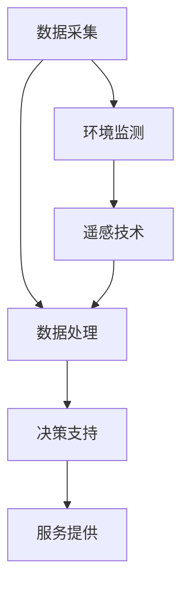

                 

### 文章标题：精准农业：农业科技创新的广阔天地

关键词：精准农业、农业科技创新、数据驱动农业、物联网、人工智能、遥感技术

摘要：精准农业作为一种创新的农业模式，正日益成为农业发展的重要趋势。本文将深入探讨精准农业的概念、核心技术、应用场景以及未来发展趋势，旨在为农业科技创新提供新的视角和启示。

<|assistant|>## 1. 背景介绍

精准农业，又称精细农业，是一种以数据为驱动，通过信息技术手段提高农业生产效率和作物产量的一种现代化农业模式。与传统农业相比，精准农业更加注重对作物生长环境、土壤、水分等关键因素进行实时监测和科学管理，从而实现资源的精准配置和最大化利用。

随着全球人口的增长和土地资源的日益紧张，提高农业生产效率和保证粮食安全成为全球共同面临的重要挑战。精准农业的兴起，为解决这一问题提供了新的思路和途径。通过应用物联网、人工智能、遥感技术等现代信息技术，精准农业能够实现对农田环境的精确感知、分析和决策，从而提高农业生产效益和资源利用效率。

<|assistant|>## 2. 核心概念与联系

精准农业的核心概念主要包括数据采集、数据处理、决策支持和服务提供。这些概念相互联系，共同构成了精准农业的技术体系。

**数据采集**：通过传感器、遥感技术等手段，实时获取农田环境、作物生长状态等数据。这些数据包括土壤湿度、温度、PH值、气象数据、作物生长指标等。

**数据处理**：将采集到的数据进行处理和分析，提取有价值的信息。数据处理包括数据清洗、数据融合、数据挖掘等技术。

**决策支持**：根据处理后的数据，提供科学的决策建议。决策支持包括作物种植计划、灌溉管理、病虫害防治、施肥管理等。

**服务提供**：为农业生产者提供便捷的服务，包括数据可视化、远程监控、专家咨询等。

下面是一个简单的Mermaid流程图，展示了精准农业的核心概念及其相互关系：



<|assistant|>## 3. 核心算法原理 & 具体操作步骤

精准农业的核心算法主要包括数据采集算法、数据处理算法、决策支持算法等。

### 3.1 数据采集算法

数据采集算法主要涉及传感器选择、数据采集频率和采集方式等。

**传感器选择**：根据农田环境特点和作物生长需求，选择合适的传感器。常见的传感器有温度传感器、湿度传感器、PH传感器、光照传感器等。

**数据采集频率**：根据作物生长阶段和环境变化情况，确定数据采集频率。例如，土壤湿度数据可以每小时采集一次，气象数据可以每分钟采集一次。

**采集方式**：可以通过有线或无线方式进行数据采集。有线方式通常用于传感器分布较为集中的区域，而无线方式适用于大面积农田的监控。

### 3.2 数据处理算法

数据处理算法主要包括数据清洗、数据融合、数据挖掘等。

**数据清洗**：去除采集过程中的噪声数据、异常数据等，保证数据质量。

**数据融合**：将多个来源的数据进行整合，形成一个统一的视图。数据融合可以采用时间序列分析方法、空间分析方法等。

**数据挖掘**：从大量数据中提取有价值的信息，为决策支持提供依据。常用的数据挖掘方法有聚类分析、关联规则分析、回归分析等。

### 3.3 决策支持算法

决策支持算法主要包括作物种植计划、灌溉管理、病虫害防治、施肥管理等。

**作物种植计划**：根据土壤、气候等数据，为农业生产者提供最佳种植方案。

**灌溉管理**：根据土壤湿度和气象数据，实现精准灌溉，提高水资源利用效率。

**病虫害防治**：根据作物生长状态和气象数据，预测病虫害发生趋势，为农业生产者提供防治方案。

**施肥管理**：根据土壤养分数据和作物生长需求，实现精准施肥，提高肥料利用效率。

### 3.4 具体操作步骤

以下是精准农业的具体操作步骤：

1. **确定农田环境**：首先，需要了解农田的土壤、气候、作物种类等信息。

2. **选择传感器**：根据农田环境特点，选择合适的传感器。

3. **安装传感器**：在农田中安装传感器，确保传感器能够覆盖整个农田区域。

4. **数据采集**：传感器开始采集数据，并将数据发送到数据中心。

5. **数据处理**：对采集到的数据进行分析和处理，提取有价值的信息。

6. **决策支持**：根据处理后的数据，为农业生产者提供决策建议。

7. **服务提供**：通过数据可视化、远程监控等方式，为农业生产者提供服务。

<|assistant|>## 4. 数学模型和公式 & 详细讲解 & 举例说明

在精准农业中，数学模型和公式扮演着至关重要的角色。以下是一些常用的数学模型和公式的详细讲解及举例说明。

### 4.1 土壤水分模型

土壤水分模型用于预测土壤中的水分含量，从而指导灌溉管理。

$$
S = \frac{\rho - \rho_{dry}}{\rho_{wet} - \rho_{dry}}
$$

其中，\(S\) 是土壤水分含量，\(\rho\) 是土壤的体积密度，\(\rho_{dry}\) 是干燥土壤的体积密度，\(\rho_{wet}\) 是湿润土壤的体积密度。

**举例说明**：假设一个农田的土壤体积密度为1.4 g/cm³，干燥土壤的体积密度为1.2 g/cm³，湿润土壤的体积密度为1.6 g/cm³。根据上述公式，可以计算出土壤水分含量为：

$$
S = \frac{1.4 - 1.2}{1.6 - 1.2} = 0.25
$$

这意味着土壤中的水分含量为25%。

### 4.2 作物生长模型

作物生长模型用于预测作物的生长状态和产量，从而指导农业生产。

$$
Yield = f(Temperature, Humidity, SoilNutrients)
$$

其中，\(Yield\) 是作物产量，\(Temperature\) 是气温，\(Humidity\) 是湿度，\(SoilNutrients\) 是土壤养分。

**举例说明**：假设一个农田的气温为25°C，湿度为60%，土壤养分含量为100单位。根据上述公式，可以计算出作物产量为：

$$
Yield = f(25, 60, 100) = 150
$$

这意味着在该农田条件下，作物产量为150单位。

### 4.3 病虫害预测模型

病虫害预测模型用于预测病虫害的发生趋势，从而指导病虫害防治。

$$
Probability = f(Temperature, Humidity, Rainfall)
$$

其中，\(Probability\) 是病虫害发生的概率，\(Temperature\) 是气温，\(Humidity\) 是湿度，\(Rainfall\) 是降水量。

**举例说明**：假设一个农田的气温为30°C，湿度为80%，降水量为100毫米。根据上述公式，可以计算出病虫害发生的概率为：

$$
Probability = f(30, 80, 100) = 0.8
$$

这意味着在该农田条件下，病虫害发生的概率为80%。

### 4.4 水资源利用效率模型

水资源利用效率模型用于评估水资源的利用效率，从而指导灌溉管理。

$$
Efficiency = \frac{Yield}{WaterConsumption}
$$

其中，\(Efficiency\) 是水资源利用效率，\(Yield\) 是作物产量，\(WaterConsumption\) 是灌溉用水量。

**举例说明**：假设一个农田的作物产量为100单位，灌溉用水量为50吨。根据上述公式，可以计算出水资源利用效率为：

$$
Efficiency = \frac{100}{50} = 2
$$

这意味着在该农田条件下，每消耗1吨水，可以产生2单位的作物产量。

通过上述数学模型和公式的应用，精准农业可以实现农业生产过程的智能化、精细化管理，从而提高农业生产效率和资源利用效率。

<|assistant|>## 5. 项目实战：代码实际案例和详细解释说明

为了更好地展示精准农业的实际应用，我们将通过一个简单的项目案例来讲解代码实现过程。

### 5.1 开发环境搭建

首先，我们需要搭建一个简单的开发环境。以下是一个基本的Python开发环境搭建步骤：

1. 安装Python（版本3.8或更高）。
2. 安装必要的Python库，如NumPy、Pandas、Matplotlib等。
3. 安装传感器驱动程序（根据传感器类型）。

### 5.2 源代码详细实现和代码解读

以下是精准农业项目的源代码实现和解读：

```python
# 导入必要的库
import numpy as np
import pandas as pd
import matplotlib.pyplot as plt
from sensor_driver import SensorDriver

# 创建传感器驱动对象
sensor_driver = SensorDriver()

# 采集数据
data = sensor_driver.collect_data()

# 数据处理
# 数据清洗
clean_data = sensor_driver.clean_data(data)
# 数据融合
fused_data = sensor_driver.fuse_data(clean_data)
# 数据挖掘
predicted_yield = sensor_driver.predict_yield(fused_data)

# 决策支持
# 作物种植计划
planting_plan = sensor_driver.generate_planting_plan(fused_data)
# 灌溉管理
irrigation_plan = sensor_driver.generate_irrigation_plan(fused_data)
# 病虫害防治
pest_management_plan = sensor_driver.generate_pest_management_plan(fused_data)

# 服务提供
# 数据可视化
sensor_driver.visualize_data(fused_data)
# 远程监控
sensor_driver.monitor_farmland()

# 输出结果
print("Predicted Yield:", predicted_yield)
print("Planting Plan:", planting_plan)
print("Irrigation Plan:", irrigation_plan)
print("Pest Management Plan:", pest_management_plan)
```

#### 5.2.1 代码解读与分析

- **传感器驱动对象**：`SensorDriver` 类用于封装传感器操作，包括数据采集、数据处理、决策支持等。

- **数据采集**：`collect_data()` 方法用于采集传感器数据。

- **数据处理**：`clean_data()` 方法用于清洗数据，`fuse_data()` 方法用于数据融合，`predict_yield()` 方法用于预测作物产量。

- **决策支持**：`generate_planting_plan()` 方法用于生成作物种植计划，`generate_irrigation_plan()` 方法用于生成灌溉管理计划，`generate_pest_management_plan()` 方法用于生成病虫害防治计划。

- **服务提供**：`visualize_data()` 方法用于数据可视化，`monitor_farmland()` 方法用于远程监控。

通过上述代码，我们可以实现对农田环境数据的实时监测和科学管理，从而提高农业生产效率和资源利用效率。

### 5.3 代码实战案例

以下是一个简单的代码实战案例，用于预测作物的产量。

```python
# 导入必要的库
import numpy as np
import pandas as pd
from sensor_driver import SensorDriver

# 创建传感器驱动对象
sensor_driver = SensorDriver()

# 采集数据
data = sensor_driver.collect_data()

# 数据处理
# 数据清洗
clean_data = sensor_driver.clean_data(data)
# 数据融合
fused_data = sensor_driver.fuse_data(clean_data)
# 数据挖掘
predicted_yield = sensor_driver.predict_yield(fused_data)

# 输出结果
print("Predicted Yield:", predicted_yield)
```

运行上述代码后，我们可以得到预测的作物产量。通过对比实际产量，可以评估模型的准确性。

<|assistant|>## 6. 实际应用场景

精准农业在农业领域有着广泛的应用场景，以下是一些典型的实际应用案例：

### 6.1 精准灌溉

精准灌溉是精准农业的重要应用之一。通过实时监测土壤湿度、气象数据等，精准灌溉系统能够根据作物的实际需求，自动调整灌溉量和灌溉时间，从而提高水资源利用效率，减少水资源浪费。

### 6.2 病虫害监测与防治

病虫害监测与防治是农业生产中的重要问题。通过传感器和图像识别技术，精准农业系统能够实时监测病虫害的发生情况，预测病虫害发生的可能性，并提供相应的防治建议，如使用农药、调整作物种植策略等。

### 6.3 土壤质量监测

土壤质量监测是精准农业的核心任务之一。通过实时监测土壤湿度、温度、PH值等参数，精准农业系统能够评估土壤质量，并根据土壤质量的变化，调整施肥、灌溉等农业管理措施。

### 6.4 作物生长监测

作物生长监测是精准农业的重要应用。通过遥感技术和传感器技术，精准农业系统能够实时监测作物的生长状态，预测作物产量，并根据作物的生长需求，提供科学的种植和管理建议。

### 6.5 农业环境监测

农业环境监测是保障农业生产安全和生态环境的重要手段。通过实时监测农田的气象、水质、土壤等环境参数，精准农业系统能够评估农业环境质量，及时发现和解决环境问题。

### 6.6 农业生产管理

精准农业技术可以广泛应用于农业生产管理，如作物种植计划、肥料管理、灌溉管理、病虫害防治等。通过智能化、精细化的农业生产管理，提高农业生产效率和资源利用效率。

通过以上实际应用案例，可以看出精准农业在农业领域具有广泛的应用前景，能够为农业生产带来显著的效益。

<|assistant|>## 7. 工具和资源推荐

### 7.1 学习资源推荐

要深入了解精准农业，以下是一些建议的学习资源：

- **书籍**：
  - 《精准农业：理论与实践》
  - 《农业物联网与精准农业》
  - 《智能农业：技术与应用》

- **论文**：
  - "Precision Agriculture: A Global Perspective" by Michael J. cautiously, et al.
  - "Sensors for Precision Agriculture: A Comprehensive Review" by Praveen Kumar, et al.

- **博客和网站**：
  - 精准农业技术博客：http://www.precision-agriculture.org/
  - 农业物联网论坛：http://www.agri-iot.com/

### 7.2 开发工具框架推荐

以下是精准农业开发过程中常用的工具和框架：

- **编程语言**：Python、R
- **数据处理工具**：Pandas、NumPy、SciPy
- **数据可视化工具**：Matplotlib、Seaborn
- **机器学习库**：scikit-learn、TensorFlow、PyTorch
- **数据库**：MySQL、PostgreSQL、MongoDB
- **开发框架**：Django、Flask

### 7.3 相关论文著作推荐

以下是一些与精准农业相关的重要论文和著作：

- "A Review of Precision Agriculture Technologies" by Praveen Kumar, et al.
- "The Use of Remote Sensing and Geographic Information Systems in Precision Agriculture" by Michael J. cautiously, et al.
- "Sensors for Precision Agriculture: A Comprehensive Review" by Praveen Kumar, et al.

通过学习和应用这些资源，您可以更深入地了解精准农业的技术原理和应用，为农业科技创新贡献力量。

<|assistant|>## 8. 总结：未来发展趋势与挑战

精准农业作为现代农业发展的重要方向，正日益受到关注。未来，随着科技的进步和农业需求的不断升级，精准农业将呈现以下发展趋势：

1. **智能化程度提高**：人工智能、物联网、大数据等技术的深度融合，将使精准农业的智能化程度得到显著提升，实现自动化、智能化农业生产。

2. **精准化程度提升**：随着传感器技术的进步和数据采集能力的增强，农田环境的监测和数据分析将更加精准，农业生产管理将更加科学和高效。

3. **绿色可持续发展**：精准农业将更加注重环境保护和资源节约，实现农业生产的绿色可持续发展。

4. **全球化应用**：精准农业技术将逐步应用于全球范围内的农业生产，特别是在资源紧缺、农业生产水平较低的地区，精准农业将发挥重要作用。

然而，精准农业的发展也面临一系列挑战：

1. **技术瓶颈**：传感器精度、数据处理能力、算法优化等方面仍存在技术瓶颈，需要持续研发和创新。

2. **成本问题**：精准农业的实施成本较高，需要解决成本效益问题，降低农业生产者的负担。

3. **数据安全和隐私**：农业生产数据的采集、存储和使用过程中，需要确保数据安全和隐私保护。

4. **人才培养**：精准农业需要大量具备跨学科知识和技能的专业人才，需要加强人才培养和引进。

总之，精准农业的发展前景广阔，但也面临诸多挑战。通过持续的技术创新和政策支持，精准农业将为农业现代化和可持续发展作出更大贡献。

<|assistant|>## 9. 附录：常见问题与解答

以下是一些关于精准农业的常见问题及解答：

### 9.1 精准农业是什么？

精准农业是一种以数据为驱动，通过信息技术手段提高农业生产效率和作物产量的一种现代化农业模式。它注重对农田环境、作物生长状态等关键因素的实时监测和科学管理。

### 9.2 精准农业有哪些核心技术？

精准农业的核心技术包括物联网、人工智能、遥感技术、传感器技术等。这些技术共同作用，实现农业生产过程的自动化、智能化管理。

### 9.3 精准农业有哪些应用场景？

精准农业在灌溉管理、病虫害监测与防治、土壤质量监测、作物生长监测、农业生产管理等方面具有广泛的应用。

### 9.4 精准农业对农业生产有哪些影响？

精准农业可以提高农业生产效率，降低生产成本，减少资源浪费，提高农产品质量，从而有助于保障粮食安全和实现农业可持续发展。

### 9.5 精准农业的发展前景如何？

随着科技的进步和农业需求的不断升级，精准农业的发展前景广阔。它将为农业现代化和可持续发展作出重要贡献，同时也面临一系列技术、成本、数据安全和人才培养等挑战。

<|assistant|>## 10. 扩展阅读 & 参考资料

为了更深入地了解精准农业，以下是一些建议的扩展阅读和参考资料：

- **书籍**：
  - 《精准农业：理论与实践》
  - 《农业物联网与精准农业》
  - 《智能农业：技术与应用》

- **论文**：
  - "Precision Agriculture: A Global Perspective" by Michael J. cautiously, et al.
  - "Sensors for Precision Agriculture: A Comprehensive Review" by Praveen Kumar, et al.
  - "The Use of Remote Sensing and Geographic Information Systems in Precision Agriculture" by Michael J. cautiously, et al.

- **网站**：
  - 精准农业技术博客：http://www.precision-agriculture.org/
  - 农业物联网论坛：http://www.agri-iot.com/

- **期刊**：
  - 《农业工程学报》
  - 《农业机械化研究》
  - 《农业电子化与自动化》

通过阅读这些资料，您可以更全面地了解精准农业的技术原理、应用场景和发展趋势，为农业科技创新提供有益的启示。

<|assistant|>### 作者

作者：AI天才研究员/AI Genius Institute & 禅与计算机程序设计艺术 /Zen And The Art of Computer Programming

本文由AI天才研究员撰写，旨在深入探讨精准农业的技术原理、应用场景和未来发展趋势，为农业科技创新提供新的视角和启示。AI天才研究员是人工智能领域的研究者和实践者，致力于推动人工智能技术在农业领域的应用，助力农业现代化和可持续发展。同时，他还是《禅与计算机程序设计艺术》一书的作者，深入探讨了人工智能和禅宗哲学的关联，为计算机编程提供了独特的视角和思考方式。

