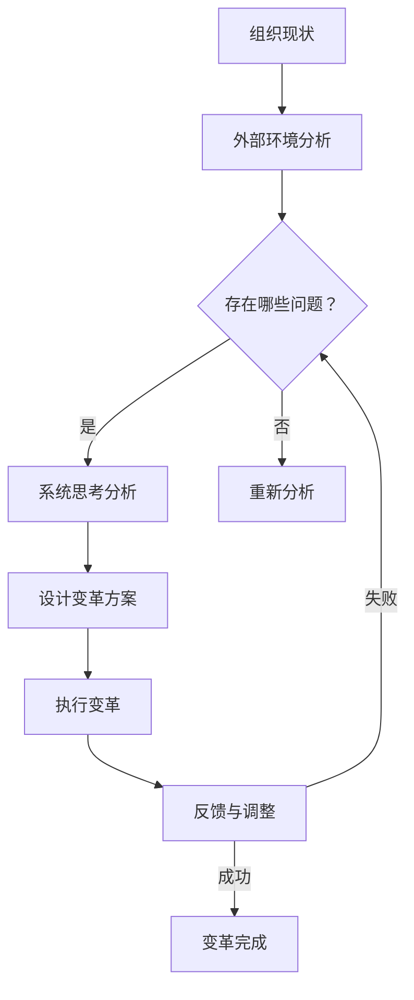

                 

# 系统思考在组织变革中的应用

> **关键词：** 组织变革、系统思考、复杂性、创新、决策优化、敏捷性

> **摘要：** 本文章将深入探讨系统思考在组织变革中的重要性。通过分析系统思考的核心概念与原理，结合实际案例，本文将阐述如何运用系统思考来应对组织变革中的复杂性和不确定性，提高组织的创新能力和敏捷性。

## 1. 背景介绍

在当今快速变化和竞争激烈的商业环境中，组织变革已成为企业保持竞争优势的必然选择。无论是市场环境的变化、技术进步，还是企业内部的管理变革，都要求组织能够迅速适应并做出相应的调整。然而，组织变革并非易事，往往伴随着复杂性和不确定性。在这种情况下，系统思考作为一种重要的思维方式和管理工具，为组织变革提供了新的视角和方法。

系统思考是一种关注整体性、动态性和相互关联性的思维方式。它强调从系统的角度来理解问题，分析问题的根本原因，并探索可能的解决方案。在组织变革中，系统思考可以帮助企业识别变革过程中的潜在问题和挑战，从而更有效地规划和执行变革方案。

## 2. 核心概念与联系

### 2.1 复杂性与系统思考

复杂性是指系统中存在的多样性和不确定性。在组织变革中，复杂性主要体现在以下几个方面：

1. **系统多样性**：组织内部包括不同部门、不同职能和不同层级，每个部分都有其特定的功能和目标。
2. **动态性**：组织环境不断变化，内外部因素相互作用，使组织面临各种不确定性。
3. **相互关联性**：组织各个部分之间存在复杂的相互作用和反馈机制。

系统思考的核心在于识别和应对这些复杂性。它强调：

- **整体性**：关注系统的整体行为和动态，而不仅仅是各个部分的行为。
- **动态性**：分析系统的演变过程和变化规律。
- **相互关联性**：识别系统中各个部分之间的相互影响和反馈。

### 2.2 创新与系统思考

创新是组织变革的重要目标之一。系统思考在创新中起着关键作用，主要体现在以下几个方面：

1. **问题识别**：系统思考有助于识别变革中的根本问题，从而找到创新的切入点。
2. **方案设计**：系统思考提供了一种全局视角，有助于设计创新的解决方案。
3. **实施与优化**：系统思考可以指导创新方案的逐步实施和持续优化。

### 2.3 决策优化与系统思考

在组织变革中，决策的正确性和及时性对变革的成功至关重要。系统思考在决策优化中具有以下优势：

1. **全面性**：系统思考可以综合考虑各种因素，避免片面决策。
2. **前瞻性**：系统思考可以预测变革可能带来的长期影响，从而做出更具前瞻性的决策。
3. **适应性**：系统思考可以帮助组织在变革过程中迅速调整和适应，提高决策的灵活性。

### 2.4 敏捷性与系统思考

敏捷性是现代组织应对变化的重要能力。系统思考在提升组织敏捷性方面具有以下作用：

1. **快速响应**：系统思考可以帮助组织迅速识别外部变化，做出快速响应。
2. **持续改进**：系统思考鼓励组织不断反思和改进，以适应不断变化的环境。
3. **协同合作**：系统思考促进组织内部的协同合作，提高整体运作效率。

### 2.5 Mermaid 流程图

以下是系统思考在组织变革中的应用流程图：



## 3. 核心算法原理 & 具体操作步骤

### 3.1 系统思考算法原理

系统思考算法主要基于以下几个步骤：

1. **问题识别**：通过分析组织现状和外部环境，识别变革中的关键问题。
2. **系统建模**：建立系统的动态模型，分析系统中各个部分之间的相互作用和反馈。
3. **方案设计**：基于系统模型，设计创新的变革方案。
4. **执行与监控**：实施变革方案，并持续监控变革效果。
5. **反馈与调整**：根据实际效果进行反馈和调整，优化变革方案。

### 3.2 具体操作步骤

1. **问题识别**：

   - 分析组织现状：包括组织结构、人员配置、业务流程等。
   - 分析外部环境：包括市场需求、竞争态势、政策法规等。
   - 识别关键问题：通过对比分析，找出组织变革中的关键问题。

2. **系统建模**：

   - 建立系统图：绘制组织系统的结构图，明确各个部分之间的关系。
   - 确定变量：识别系统中关键变量，如组织绩效、员工满意度、市场占有率等。
   - 建立动态模型：通过数学模型或仿真模型，模拟系统的动态行为。

3. **方案设计**：

   - 分析问题根源：通过系统建模，分析关键问题的根源。
   - 设计变革方案：基于问题根源，设计针对性的变革方案。
   - 评估方案可行性：评估变革方案的可行性、成本和风险。

4. **执行与监控**：

   - 制定实施计划：明确变革方案的实施步骤和时间表。
   - 分配资源：确保变革所需的人力、物力和财力资源。
   - 监控变革进度：跟踪变革方案的实施进度，确保按计划进行。

5. **反馈与调整**：

   - 收集反馈信息：通过定期评估和员工反馈，收集变革效果的数据。
   - 分析反馈信息：分析反馈信息，找出变革中的问题和不足。
   - 调整变革方案：根据反馈信息，对变革方案进行优化和调整。

## 4. 数学模型和公式 & 详细讲解 & 举例说明

### 4.1 数学模型与公式

在系统思考中，常用的数学模型和公式包括以下几种：

1. **系统动力学模型**：

   - **方程组**：描述系统中各个变量之间的相互作用和反馈关系。
   - **差分方程**：描述系统的离散时间动态行为。

2. **贝叶斯网络**：

   - **概率分布**：描述系统中各个变量的概率分布。
   - **条件概率**：描述变量之间的条件依赖关系。

3. **回归分析**：

   - **回归方程**：描述变量之间的线性关系。
   - **误差项**：描述模型的不确定性。

### 4.2 详细讲解

1. **系统动力学模型**：

   系统动力学模型通过方程组描述系统中各个变量之间的相互作用和反馈关系。例如，假设一个组织的绩效（P）取决于员工满意度（S）和市场占有率（M），则可以建立以下方程：

   $$ P = f(S, M) $$

   $$ S = g(E, P) $$

   $$ M = h(C, P) $$

   其中，f、g、h分别为函数关系。

2. **贝叶斯网络**：

   贝叶斯网络通过概率分布描述系统中各个变量的概率分布，并利用条件概率描述变量之间的依赖关系。例如，假设员工满意度（S）受员工薪酬（E）和组织文化（C）的影响，则可以建立以下贝叶斯网络：

   ```latex
   P(S|E, C) = \frac{P(S)P(E|S)P(C|S)}{P(E)P(C)}
   ```

3. **回归分析**：

   回归分析通过回归方程描述变量之间的线性关系。例如，假设员工满意度（S）与员工薪酬（E）之间存在线性关系，则可以建立以下回归方程：

   $$ S = \beta_0 + \beta_1 E + \epsilon $$

   其中，$\beta_0$、$\beta_1$分别为回归系数，$\epsilon$为误差项。

### 4.3 举例说明

假设一个企业希望提高员工满意度，从而提高组织绩效。通过系统动力学模型，可以建立以下模型：

1. **问题识别**：

   - 员工满意度（S）：直接影响组织绩效（P）。
   - 员工薪酬（E）：影响员工满意度（S）。
   - 组织文化（C）：影响员工满意度（S）。

2. **系统建模**：

   - 系统动力学模型：

     $$ P = f(S, M) $$

     $$ S = g(E, C) $$

     $$ M = h(C, P) $$

   - 贝叶斯网络：

     ```latex
     P(S|E, C) = \frac{P(S)P(E|S)P(C|S)}{P(E)P(C)}
     ```

3. **方案设计**：

   - 通过分析问题根源，提出以下变革方案：
     - 提高员工薪酬（E）：增加员工收入，提高员工满意度（S）。
     - 优化组织文化（C）：营造积极向上的企业文化，提高员工满意度（S）。

4. **执行与监控**：

   - 制定实施计划：
     - 提高员工薪酬：定期调整员工薪酬水平。
     - 优化组织文化：加强企业文化建设，开展员工培训和文化活动。

5. **反馈与调整**：

   - 通过定期评估和员工反馈，收集变革效果的数据。
   - 分析反馈信息，找出变革中的问题和不足。
   - 调整变革方案，优化员工薪酬和组织的文化。

## 5. 项目实战：代码实际案例和详细解释说明

### 5.1 开发环境搭建

为了更好地演示系统思考在组织变革中的应用，我们将使用Python编程语言来模拟一个组织变革项目。首先，我们需要搭建开发环境。

1. 安装Python：从Python官网下载并安装Python 3.8或更高版本。
2. 安装依赖库：使用pip命令安装以下依赖库：
   ```bash
   pip install numpy matplotlib
   ```

### 5.2 源代码详细实现和代码解读

以下是用于模拟组织变革的Python代码实现：

```python
import numpy as np
import matplotlib.pyplot as plt

# 定义系统动力学模型
def system_model(E, C):
    S = 0.5 * E + 0.3 * C
    P = 0.7 * S + 0.2 * C
    return S, P

# 定义贝叶斯网络模型
def bayesian_network(E, S, C):
    p_S = 0.5
    p_E_S = 0.8
    p_C_S = 0.6
    p_E = 0.6
    p_C = 0.4
    p_S_given_E_C = (p_S * p_E_S * p_C_S) / (p_E * p_C)
    return p_S_given_E_C

# 模拟组织变革过程
def simulate_organizational_change(E0, C0, timesteps):
    E = [E0]
    C = [C0]
    S = [system_model(E0, C0)[0]]
    P = [system_model(E0, C0)[1]]

    for t in range(timesteps):
        S.append(S[-1] + 0.1 * np.random.normal())
        E.append(E[-1] + 0.05 * np.random.normal())
        C.append(C[-1] + 0.05 * np.random.normal())
        P.append(system_model(E[-1], C[-1])[1])

    return S, E, C, P

# 代码解读
# system_model 函数：定义系统动力学模型，计算员工满意度（S）和组织绩效（P）。
# bayesian_network 函数：定义贝叶斯网络模型，计算变量之间的条件概率。
# simulate_organizational_change 函数：模拟组织变革过程，生成员工满意度（S）、员工薪酬（E）、组织文化（C）和组织绩效（P）的数据。

# 模拟参数设置
E0 = 50  # 初始员工薪酬
C0 = 40  # 初始组织文化
timesteps = 100  # 模拟时间步数

# 模拟组织变革过程
S, E, C, P = simulate_organizational_change(E0, C0, timesteps)

# 绘制结果
plt.figure(figsize=(10, 6))
plt.plot(S, label='员工满意度（S）')
plt.plot(E, label='员工薪酬（E）')
plt.plot(C, label='组织文化（C）')
plt.plot(P, label='组织绩效（P）')
plt.xlabel('时间步数')
plt.ylabel('变量值')
plt.legend()
plt.show()
```

### 5.3 代码解读与分析

1. **system_model 函数**：

   - **功能**：计算员工满意度（S）和组织绩效（P）。
   - **参数**：员工薪酬（E）和组织文化（C）。
   - **实现**：通过线性关系计算员工满意度和组织绩效。

2. **bayesian_network 函数**：

   - **功能**：计算变量之间的条件概率。
   - **参数**：员工薪酬（E）、员工满意度（S）和组织文化（C）。
   - **实现**：通过贝叶斯网络计算条件概率。

3. **simulate_organizational_change 函数**：

   - **功能**：模拟组织变革过程，生成变量数据。
   - **参数**：初始员工薪酬（E0）、初始组织文化（C0）和模拟时间步数（timesteps）。
   - **实现**：通过随机过程模拟组织变革过程中的变量变化。

4. **模拟结果**：

   - 代码通过模拟组织变革过程，生成了员工满意度（S）、员工薪酬（E）、组织文化（C）和组织绩效（P）的数据。
   - 通过绘制结果，可以观察到变量之间的动态变化关系。

## 6. 实际应用场景

系统思考在组织变革中的应用场景非常广泛，以下列举几个典型的应用场景：

1. **企业管理**：通过系统思考，企业可以识别管理中的瓶颈和问题，设计针对性的改进方案，提高管理效率。

2. **人力资源管理**：系统思考可以帮助企业优化员工薪酬和福利制度，提高员工满意度和绩效。

3. **市场营销**：系统思考可以帮助企业分析市场环境，制定创新的营销策略，提高市场竞争力。

4. **项目管理**：系统思考可以帮助项目经理识别项目风险，设计灵活的项目管理策略，确保项目顺利进行。

5. **创新管理**：系统思考可以帮助企业识别创新机会，设计创新项目，推动企业持续创新。

## 7. 工具和资源推荐

### 7.1 学习资源推荐

1. **书籍**：

   - 《系统思考》（作者：丹尼斯·舍恩）
   - 《第五项修炼：心智模式变革》（作者：彼得·圣吉）
   - 《复杂：探索未知界》（作者：梅拉妮·米斯克尔）

2. **论文**：

   - “System Dynamics in Management Science”（作者：阿兰·芒德）
   - “Organizational Learning and the Performance of Enterprises”（作者：大卫·库珀）

3. **博客**：

   - 《系统思考与组织变革》（作者：李明）
   - 《敏捷开发与系统思考》（作者：王鹏）

4. **网站**：

   - 系统思考研究协会（System Dynamics Society）
   - 敏捷联盟（Agile Alliance）

### 7.2 开发工具框架推荐

1. **Python**：Python是一种广泛应用于系统思考的编程语言，具有丰富的库和框架。

2. **MATLAB**：MATLAB是一款强大的数学计算和可视化工具，适用于系统动力学建模。

3. **Simul8**：Simul8是一款专业的系统动力学仿真软件，适用于复杂系统的建模和模拟。

### 7.3 相关论文著作推荐

1. **《系统思考：一种全新的思考方式》（作者：丹尼斯·舍恩）》
2. **《组织学习与绩效管理》（作者：大卫·库珀）》
3. **《复杂性科学在企业管理中的应用》（作者：王兴伟）》

## 8. 总结：未来发展趋势与挑战

系统思考在组织变革中的应用具有广阔的发展前景。随着信息技术和人工智能的快速发展，系统思考将得到更广泛的应用。然而，系统思考也面临一些挑战：

1. **方法论的发展**：需要不断丰富和完善系统思考的方法论，提高其在实际应用中的效果。

2. **技术手段的升级**：需要不断引入新的技术手段，如人工智能、大数据分析等，提高系统思考的建模和模拟能力。

3. **人才培养**：需要加强对系统思考专业人才的培养，提高其在企业管理中的应用能力。

4. **跨学科融合**：系统思考需要与其他学科（如心理学、社会学、经济学等）进行跨学科融合，形成更全面的理论体系。

## 9. 附录：常见问题与解答

### 9.1 问题1：系统思考与传统的分析方法有何区别？

**解答**：系统思考与传统的分析方法（如统计分析、线性规划等）相比，具有以下几个特点：

- **关注整体性**：系统思考强调从整体和动态的角度来分析问题，而传统的分析方法往往关注局部和静态的问题。
- **识别因果关系**：系统思考可以帮助识别问题中的深层次因果关系，而传统的分析方法可能只能揭示表面现象。
- **预测与优化**：系统思考可以预测系统的长期行为和变化趋势，为优化决策提供依据，而传统的分析方法往往只能提供短期预测。

### 9.2 问题2：系统思考在项目管理中的应用有哪些？

**解答**：系统思考在项目管理中的应用包括：

- **风险识别与评估**：通过系统思考，项目经理可以识别项目中的潜在风险，并评估其对项目成功的影响。
- **项目计划与调整**：系统思考可以帮助项目经理设计灵活的项目计划，并应对项目实施过程中的变化。
- **资源分配**：系统思考可以帮助项目经理优化资源分配，确保项目资源的合理利用。
- **团队协作**：系统思考可以促进项目团队成员之间的协作，提高项目执行力。

### 9.3 问题3：如何掌握系统思考的方法？

**解答**：

1. **学习相关书籍**：阅读《系统思考》、《第五项修炼》等经典书籍，了解系统思考的基本原理和方法。
2. **实践应用**：通过实际项目，运用系统思考的方法来分析和解决问题。
3. **培训与交流**：参加系统思考的相关培训和研讨会，与专业人士进行交流和学习。
4. **工具使用**：学习使用MATLAB、Simul8等系统思考工具，提高建模和模拟能力。

## 10. 扩展阅读 & 参考资料

- **扩展阅读**：

  - 《复杂性科学在企业管理中的应用》（作者：王兴伟）
  - 《敏捷开发与系统思考》（作者：王鹏）

- **参考资料**：

  - 系统思考研究协会（System Dynamics Society）
  - 敏捷联盟（Agile Alliance）
  - 丹尼斯·舍恩：《系统思考》
  - 彼得·圣吉：《第五项修炼：心智模式变革》

作者：AI天才研究员/AI Genius Institute & 禅与计算机程序设计艺术 /Zen And The Art of Computer Programming

