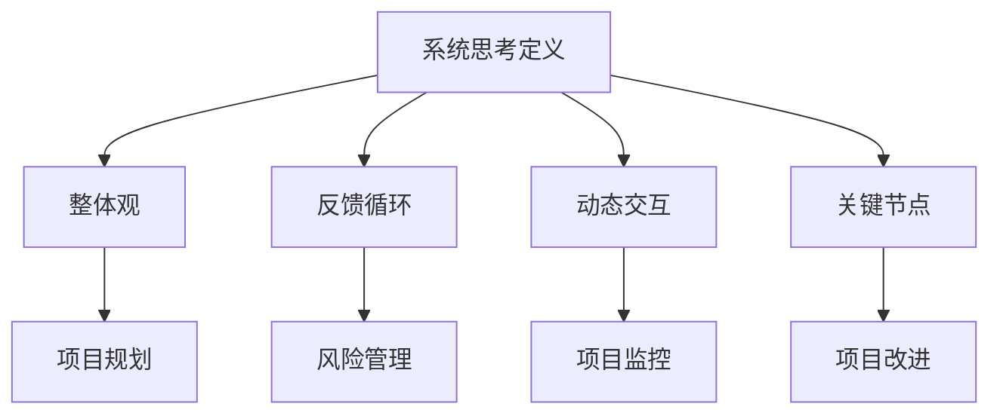

                 

### 1. 背景介绍

随着技术的不断进步，项目规模和复杂性也在不断增加。在这样的环境下，传统的线性管理方法已经无法应对复杂的现代项目。因此，系统思考成为了一种重要的管理工具，它可以帮助项目经理更好地理解和解决复杂项目中的问题。

系统思考（System Thinking）是一种研究复杂系统的思维方式，它强调将系统视为一个整体，关注系统内部各个部分之间的相互关系和动态交互。在项目管理中，系统思考可以帮助项目经理从全局角度分析项目，理解项目中的各种依赖关系和反馈循环，从而制定更有效的管理策略。

现代项目通常涉及多个参与者、多个任务和多个阶段，这些任务和阶段之间存在着复杂的关系和相互影响。例如，一个软件开发项目可能包括需求分析、设计、编码、测试和维护等多个阶段，这些阶段之间存在着密切的依赖关系。如果在项目早期没有正确理解和处理这些关系，可能会导致项目延误、成本超支和质量下降等问题。

此外，现代项目还面临着外部环境的快速变化和不确定性。例如，市场需求的变化、技术进步、政策法规的调整等都可能对项目产生重大影响。传统的线性管理方法很难适应这种快速变化和不确定性，而系统思考则提供了一种更灵活、更适应复杂变化的管理方法。

总之，系统思考对于管理复杂项目的重要性不容忽视。它不仅可以帮助项目经理更好地理解项目，还可以提高项目的管理效率和成功概率。接下来的部分，我们将深入探讨系统思考的核心概念、算法原理、实际应用场景以及未来发展趋势。让我们一步一步地分析推理，深入了解这一重要的管理工具。

### 2. 核心概念与联系

#### 系统思考的定义

系统思考（System Thinking）是一种研究复杂系统的思维方式，它强调将系统视为一个整体，关注系统内部各个部分之间的相互关系和动态交互。系统思考起源于20世纪中叶，其理论基础包括系统论、控制论、信息论等学科。系统思考的核心理念是“整体大于部分之和”，即系统的行为和特征不仅仅取决于各个组成部分的单独行为，更取决于这些部分之间的相互作用和整体结构。

在项目管理中，系统思考的核心在于理解项目作为一个复杂系统，其各个组成部分（如任务、团队、资源等）之间的相互关系和动态交互。项目经理需要从全局角度分析项目，识别项目中的关键节点和依赖关系，以便制定更有效的管理策略。

#### 系统思考的关键概念

1. **整体观**：系统思考强调将系统视为一个整体，关注系统内部各个部分之间的相互关系和动态交互。整体观是系统思考的核心原则，它要求项目经理超越单一任务的视角，从整体上理解和分析项目。

2. **反馈循环**：反馈循环是系统中的一个重要概念，它描述了系统内部各个部分之间的相互作用和相互影响。反馈循环可以分为正反馈和负反馈。正反馈会放大系统的变化，导致系统的不稳定；而负反馈则有助于系统的稳定，通过调整系统的输出以抵消输入的变化。

3. **动态交互**：系统思考强调系统内部各个部分之间的动态交互。动态交互不仅包括静态的关系，还包括时间维度上的变化。项目经理需要考虑项目在不同时间点的状态和变化，以及这些变化对项目整体的影响。

4. **关键节点**：关键节点是系统中对整体行为和特征有重要影响的部分。在项目管理中，关键节点通常是指那些对项目进度、成本、质量等有重大影响的任务或决策。识别关键节点有助于项目经理集中资源和精力，确保项目成功。

#### 系统思考与项目管理的关系

系统思考在项目管理中的应用主要体现在以下几个方面：

1. **项目规划**：系统思考可以帮助项目经理在项目规划阶段识别项目中的关键节点和依赖关系，从而制定更合理的项目计划。项目经理可以通过绘制系统图、流程图等工具，将项目分解为多个部分，并分析各部分之间的相互作用。

2. **风险管理**：系统思考可以帮助项目经理更好地识别和管理项目中的风险。通过分析项目中的反馈循环和动态交互，项目经理可以预测潜在的问题和风险，并提前制定应对策略。

3. **项目监控**：系统思考可以帮助项目经理在项目执行过程中实时监控项目的状态，及时发现和解决问题。项目经理可以通过关键绩效指标（KPI）和实时数据，了解项目的动态变化，并调整管理策略。

4. **项目改进**：系统思考可以帮助项目经理在项目结束后进行回顾和改进。通过分析项目中的反馈循环和关键节点，项目经理可以识别项目中的成功经验和教训，为未来项目提供参考。

#### Mermaid 流程图

为了更好地展示系统思考的核心概念和架构，我们使用Mermaid流程图来描述系统思考的流程和关键概念。以下是系统思考的Mermaid流程图：



在这个流程图中，每个节点代表系统思考的一个关键概念，节点之间的箭头表示这些概念在项目管理中的应用关系。通过这个流程图，我们可以更直观地理解系统思考在项目管理中的重要性。

总之，系统思考是一种重要的项目管理工具，它可以帮助项目经理更好地理解和解决复杂项目中的问题。在接下来的部分，我们将深入探讨系统思考的算法原理和具体操作步骤，以便更好地应用到实际项目中。

### 3. 核心算法原理 & 具体操作步骤

系统思考作为一种管理工具，其核心算法原理主要基于对项目内部和外部复杂关系的建模与分析。以下是系统思考的核心算法原理和具体操作步骤：

#### 3.1. 系统建模

系统建模是系统思考的第一步，它帮助项目经理将项目视为一个整体，并识别项目中的关键组成部分及其相互关系。系统建模通常采用以下步骤：

1. **识别系统边界**：首先，项目经理需要明确项目的系统边界，即项目的范围和限制。这有助于确定项目内部和外部的关键要素。

2. **确定系统组成部分**：接下来，项目经理需要识别项目的各个组成部分，如任务、团队、资源、客户等。每个部分都可以视为系统中的一个模块。

3. **建立关系网络**：通过系统图或流程图等工具，项目经理可以将各个部分之间的相互关系和动态交互表示出来。这有助于理解项目中的复杂关系。

4. **分析关键节点**：在关系网络中，识别对项目整体有重大影响的关键节点。这些节点可能是关键任务、决策点或资源分配点。

#### 3.2. 反馈循环分析

反馈循环分析是系统思考的核心，它帮助项目经理理解项目中的正反馈和负反馈机制。以下是反馈循环分析的具体步骤：

1. **识别反馈循环**：通过系统图或流程图，识别项目中的反馈循环。正反馈循环会放大系统的变化，而负反馈循环有助于系统的稳定。

2. **分析反馈循环的影响**：对每个反馈循环进行分析，理解其对项目整体的影响。正反馈循环可能会导致系统的不稳定，而负反馈循环有助于项目的稳定和持续改进。

3. **设计负反馈机制**：在项目中设计负反馈机制，以抵消正反馈循环的不利影响。这可以通过建立关键绩效指标（KPI）、定期审查和调整项目计划等方式实现。

#### 3.3. 动态交互分析

动态交互分析帮助项目经理理解项目在不同时间点的状态和变化，以及这些变化对项目整体的影响。以下是动态交互分析的具体步骤：

1. **时间序列建模**：通过时间序列数据，建立项目在不同时间点的状态模型。这有助于项目经理了解项目的进度和趋势。

2. **模拟和预测**：使用模拟工具（如系统动力学软件）对项目进行模拟，预测项目在不同情境下的可能状态和变化。

3. **调整管理策略**：根据模拟结果，项目经理可以调整管理策略，以应对项目中的动态变化。例如，提前识别潜在风险并制定应对措施。

#### 3.4. 实施步骤

以下是系统思考的具体实施步骤：

1. **项目启动**：在项目启动阶段，项目经理需要进行系统建模，明确项目的系统和关键节点。

2. **持续监控**：在项目执行过程中，项目经理需要持续监控项目的动态变化，识别和解决潜在的问题。

3. **定期审查**：定期对项目进行审查，分析项目的进展和反馈循环，确保项目按照预期进行。

4. **改进和调整**：根据审查结果，对项目计划和管理策略进行调整，以提高项目的成功概率。

通过以上步骤，项目经理可以更好地应用系统思考，提高项目管理效率和项目成功率。

#### 3.5. 工具和方法

系统思考的实施需要借助一些工具和方法，以下是一些常用的工具和方法：

1. **系统图（System Diagram）**：系统图是一种图形化工具，用于表示项目中的各个组成部分及其相互关系。项目经理可以使用Mermaid、Lucidchart等工具绘制系统图。

2. **流程图（Flowchart）**：流程图用于表示项目中的流程和任务顺序。项目经理可以使用Visio、Lucidchart等工具绘制流程图。

3. **关键绩效指标（KPI）**：关键绩效指标是衡量项目进展和成功的关键指标。项目经理可以使用KPI仪表盘监控项目状态。

4. **系统动力学（System Dynamics）**：系统动力学是一种模拟工具，用于分析项目的动态变化。常用的系统动力学软件包括Vensim、STELLA等。

5. **数据分析和预测工具**：项目经理可以使用Excel、Tableau等工具对项目数据进行分析和预测。

通过以上工具和方法，项目经理可以更有效地实施系统思考，提高项目管理效率和项目成功率。

### 4. 数学模型和公式 & 详细讲解 & 举例说明

在系统思考中，数学模型和公式扮演着至关重要的角色。它们帮助我们量化系统内部的关系和动态交互，从而更好地理解项目的复杂性和行为。以下将详细介绍系统思考中常用的数学模型和公式，并通过具体例子来说明其应用。

#### 4.1. 系统动力学模型

系统动力学模型是基于差分方程和微分方程的数学模型，用于描述系统内部变量之间的关系和动态变化。以下是一个简单的系统动力学模型的例子：

$$
\frac{dX}{dt} = r \cdot (K - X)
$$

其中，\(X(t)\) 表示系统中的某个变量（如库存水平），\(r\) 表示变量增长速率，\(K\) 表示系统的容量上限。这个方程表示变量 \(X\) 随时间的变化速率与 \(K - X\) 成正比，意味着当 \(X\) 接近 \(K\) 时，增长速率会减缓。

**举例说明**：

假设一个公司的库存容量上限 \(K = 100\) 单位，每天库存增长速率 \(r = 0.1\) 单位/天。我们可以使用上述模型来预测未来几天内的库存水平。

初始库存 \(X(0) = 50\) 单位，代入模型得到：

$$
X(t) = 50 + \frac{0.1}{0.1} \cdot (100 - 50) \cdot e^{-0.1t} = 50 + 50 \cdot e^{-0.1t}
$$

当 \(t = 1\) 天时，库存水平为：

$$
X(1) = 50 + 50 \cdot e^{-0.1} \approx 50 + 50 \cdot 0.9 = 95
$$

这个例子展示了如何使用系统动力学模型预测库存水平的变化。

#### 4.2. 线性回归模型

线性回归模型用于分析项目中的变量之间的关系，并建立预测模型。以下是一个简单的线性回归模型的例子：

$$
Y = a + bX + \epsilon
$$

其中，\(Y\) 表示因变量，\(X\) 表示自变量，\(a\) 和 \(b\) 是回归系数，\(\epsilon\) 是误差项。这个模型表示因变量 \(Y\) 与自变量 \(X\) 之间存在线性关系。

**举例说明**：

假设一个项目的项目进度 \(Y\) 与资源投入 \(X\) 之间存在线性关系。通过收集数据并使用线性回归分析方法，我们得到以下模型：

$$
Y = 10 + 2X + \epsilon
$$

假设当前资源投入 \(X = 100\) 小时，我们可以预测项目进度 \(Y\)：

$$
Y = 10 + 2 \cdot 100 + \epsilon = 210 + \epsilon
$$

这个例子展示了如何使用线性回归模型预测项目进度。

#### 4.3. 关键路径分析

关键路径分析是一种用于项目时间管理的数学方法，用于确定项目中的关键任务和路径。以下是一个简单的关键路径分析模型的例子：

$$
T_j = T_i + D_{ij}
$$

其中，\(T_j\) 表示从起点到任务 \(j\) 的总时间，\(T_i\) 表示从起点到任务 \(i\) 的总时间，\(D_{ij}\) 表示任务 \(i\) 到任务 \(j\) 的持续时间。

**举例说明**：

假设一个项目包括以下任务和持续时间：

- 任务 A：3 天
- 任务 B：5 天
- 任务 C：4 天
- 任务 D：2 天

我们需要确定项目的关键路径。根据关键路径分析模型，我们可以计算每个任务的最早开始时间（EST）和最迟开始时间（LST）：

- 任务 A：EST = 0，LST = 3
- 任务 B：EST = 3，LST = 8
- 任务 C：EST = 8，LST = 12
- 任务 D：EST = 12，LST = 14

通过比较每个任务的 EST 和 LST，我们可以确定关键路径为 A → B → C → D。这意味着任务 A、B、C 和 D 都必须在预定时间内完成，否则项目将会延误。

这个例子展示了如何使用关键路径分析模型确定项目中的关键任务和路径。

通过以上数学模型和公式的讲解和例子说明，我们可以看到系统思考在项目管理中的应用是如何通过数学方法来量化系统内部的关系和动态交互，从而更好地理解和解决复杂项目中的问题。

### 5. 项目实战：代码实际案例和详细解释说明

为了更好地理解系统思考在项目管理中的应用，我们将通过一个实际的代码案例来进行详细解释说明。这个案例是一个简单的项目管理工具，它可以帮助项目经理监控项目的进度和资源使用情况。通过这个案例，我们将展示如何使用系统思考的方法来设计和实现这个工具。

#### 5.1. 开发环境搭建

在开始编写代码之前，我们需要搭建一个合适的开发环境。以下是一个基本的开发环境搭建步骤：

1. **安装Python**：Python是一种广泛使用的编程语言，我们可以从其官方网站（[python.org](https://www.python.org/)）下载并安装。

2. **安装PyCharm**：PyCharm是一个强大的Python集成开发环境（IDE），我们可以从其官方网站（[pycharm.com](https://www.pycharm.com/)）下载并安装。

3. **安装必要的库**：为了简化开发过程，我们需要安装一些常用的库，如`matplotlib`（用于数据可视化）、`numpy`（用于数学计算）和`pandas`（用于数据处理）。我们可以在终端中运行以下命令来安装这些库：

```bash
pip install matplotlib numpy pandas
```

#### 5.2. 源代码详细实现和代码解读

以下是一个简单的项目管理工具的源代码实现，它包括三个主要部分：数据收集、数据处理和可视化展示。

```python
# project_manager.py

import pandas as pd
import matplotlib.pyplot as plt

class ProjectManager:
    def __init__(self, data_path):
        self.data = pd.read_csv(data_path)
    
    def process_data(self):
        # 对数据进行处理，包括数据清洗、转换和聚合
        self.data['start_date'] = pd.to_datetime(self.data['start_date'])
        self.data['end_date'] = pd.to_datetime(self.data['end_date'])
        self.data['duration'] = (self.data['end_date'] - self.data['start_date']).dt.days
        self.data['progress'] = self.data['duration'] / self.data['planned_duration']
    
    def visualize_progress(self):
        # 可视化展示项目进度
        self.data.sort_values('progress', ascending=False, inplace=True)
        self.data.plot(x='name', y='progress', kind='bar', title='Project Progress')
        plt.xlabel('Project Name')
        plt.ylabel('Progress')
        plt.show()

# 使用示例
if __name__ == '__main__':
    data_path = 'project_data.csv'  # 数据文件路径
    manager = ProjectManager(data_path)
    manager.process_data()
    manager.visualize_progress()
```

**代码解读**：

1. **类定义**：我们定义了一个`ProjectManager`类，它有两个主要方法：`process_data`和`visualize_progress`。

2. **数据读取**：在构造函数中，我们读取项目数据文件（CSV格式），并将其存储在`data`属性中。

3. **数据处理**：`process_data`方法对数据进行处理，包括数据清洗（将日期转换为datetime格式）、计算任务持续时间（天数）和计算任务进度（实际持续时间与计划持续时间的比值）。

4. **数据可视化**：`visualize_progress`方法使用`matplotlib`库绘制项目进度条形图，以可视化展示每个项目的进度。

5. **使用示例**：在主程序中，我们创建一个`ProjectManager`对象，并调用`process_data`和`visualize_progress`方法来处理和可视化项目数据。

#### 5.3. 代码解读与分析

通过以上代码，我们可以看到如何将系统思考的方法应用到项目管理工具的开发中。以下是对代码的进一步解读和分析：

1. **数据收集**：系统思考的第一步是收集数据，这个工具通过读取CSV文件来收集项目数据，包括任务名称、开始日期、结束日期和计划持续时间。

2. **数据处理**：系统思考强调对数据的深入分析，这个工具通过数据处理方法，将原始数据转换为更有用的信息，如任务持续时间、任务进度等。

3. **数据可视化**：系统思考强调通过可视化来更好地理解系统内部的关系和动态交互，这个工具使用条形图来展示每个任务的进度，帮助项目经理直观地了解项目的状态。

通过这个实际案例，我们可以看到系统思考在项目管理工具开发中的应用，它帮助项目经理更好地理解和监控项目的进度和资源使用情况，从而提高项目的管理效率和成功率。

### 6. 实际应用场景

系统思考在项目管理中有着广泛的应用场景，以下是几个典型的实际应用场景：

#### 6.1. 软件开发项目

软件开发项目通常具有高度的复杂性和不确定性。在软件开发项目中，系统思考可以帮助项目经理识别项目中的关键任务和依赖关系，从而制定更合理的项目计划。例如，在软件开发的生命周期中，从需求分析、设计、编码、测试到部署和维护，每个阶段都存在着复杂的交互和反馈。通过系统思考，项目经理可以更好地理解这些关系，优化项目流程，提高开发效率。

#### 6.2. 基础设施建设项目

基础设施建设项目，如桥梁、道路、机场等，通常涉及大量的资源和人员，项目管理难度较高。在基础设施建设项目中，系统思考可以帮助项目经理识别项目中的关键节点和风险，制定有效的风险管理策略。例如，在桥梁建设中，需要协调多个工程团队，确保材料供应、设备维护和施工进度等环节顺利进行。通过系统思考，项目经理可以更好地理解项目中的复杂关系，提高项目管理的整体效率。

#### 6.3. 大型事件策划

大型事件策划，如演唱会、展览、运动会等，通常需要协调多个部门和组织，时间紧张，资源有限。在大型事件策划中，系统思考可以帮助项目经理优化项目流程，确保各个环节的顺利进行。例如，在演唱会策划中，需要协调场地布置、舞台设计、音响设备、安保措施等多个方面。通过系统思考，项目经理可以更好地理解项目中的复杂关系，制定合理的项目计划，确保活动顺利进行。

#### 6.4. 跨国企业项目管理

跨国企业项目通常涉及多个国家和地区，文化差异、语言障碍和时区差异等给项目管理带来了巨大挑战。在跨国企业项目管理中，系统思考可以帮助项目经理理解不同国家和地区的文化和业务特点，制定适合的项目管理策略。例如，在一个跨国软件项目中，项目经理需要协调不同国家的开发团队，确保项目进度和质量。通过系统思考，项目经理可以更好地理解项目中的复杂关系，提高项目的成功率。

总之，系统思考在项目管理中的实际应用场景非常广泛，它可以帮助项目经理更好地理解项目的复杂性，优化项目流程，提高项目管理的整体效率。无论在软件开发、基础设施建设项目、大型事件策划还是跨国企业项目管理中，系统思考都是一种重要的管理工具。

### 7. 工具和资源推荐

在系统思考和项目管理领域，有许多优秀的工具和资源可以帮助项目经理更好地理解和应用系统思考。以下是几个推荐的工具和资源：

#### 7.1. 学习资源推荐

1. **书籍**：

   - 《系统思考》（作者：彼得·舍恩伯格）是一本介绍系统思考基础理论和应用的经典著作，适合初学者阅读。

   - 《系统动力学导论》（作者：杰弗里·T. 马克斯）详细介绍了系统动力学的理论基础和应用方法，适合对系统思考有一定了解的读者。

   - 《项目管理知识体系指南》（PMBOK指南，作者：美国项目管理协会）提供了全面的项目管理知识和最佳实践，其中包括系统思考的应用方法。

2. **论文**：

   - 《系统思考：项目管理中的新视角》（作者：詹姆斯·P. 帕默斯）是一篇关于系统思考在项目管理中应用的经典论文，探讨了系统思考如何帮助项目经理更好地理解和解决复杂项目中的问题。

   - 《系统动力学在项目管理中的应用》（作者：彼得·舍恩伯格）探讨了系统动力学在项目管理中的具体应用，提供了丰富的案例和实例。

3. **博客和网站**：

   - [系统思考博客](https://systemsthinking.org/blog/)：这是一个关于系统思考的博客，提供了一系列系统思考的基础知识和应用案例。

   - [项目管理知识库](https://projectmanagement.com/knowledge-base/)：这是一个项目管理领域的在线资源库，包含了大量关于项目管理理论和实践的文章和指南。

#### 7.2. 开发工具框架推荐

1. **系统图工具**：

   - [Mermaid](https://mermaid-js.github.io/mermaid/)：一个基于Markdown的图表绘制工具，支持绘制系统图、流程图、序列图等。

   - [Lucidchart](https://www.lucidchart.com/)：一个在线图表绘制工具，支持多种图表类型，提供丰富的模板和样式。

2. **数据可视化工具**：

   - [Matplotlib](https://matplotlib.org/)：一个强大的Python数据可视化库，支持绘制各种类型的图表，适合进行数据分析和可视化展示。

   - [Tableau](https://www.tableau.com/)：一个商业数据可视化工具，提供丰富的图表类型和交互功能，适合进行复杂的数据分析和可视化展示。

3. **系统动力学软件**：

   - [Vensim](https://vensim.com/)：一款专业的系统动力学建模和模拟软件，支持创建复杂的系统模型和进行动态仿真。

   - [STELLA](https://www.iseeksoft.com/stella-system-dynamics-modeling-software.html)：一款系统动力学建模软件，提供丰富的模型构建和模拟功能，适合进行系统分析和预测。

通过这些工具和资源的帮助，项目经理可以更好地理解和应用系统思考，提高项目管理效率，实现项目成功。

### 8. 总结：未来发展趋势与挑战

随着项目规模的不断扩大和复杂性的不断增加，系统思考在项目管理中的重要性日益凸显。未来，系统思考在项目管理领域的发展趋势和挑战主要体现在以下几个方面：

#### 8.1. 发展趋势

1. **技术的融合与整合**：随着人工智能、大数据、云计算等技术的发展，系统思考将与其他技术深度融合，形成更高效的项目管理方法。例如，基于人工智能的预测分析和自动化决策支持系统将提高系统思考的精度和效率。

2. **更加普及的应用**：随着对系统思考认知的不断提高，系统思考将在更多领域得到应用，如健康护理、环境保护、城市规划等。这将推动系统思考从单一的项目管理工具发展成为跨学科的综合管理方法。

3. **多样化的工具和平台**：为了满足不同项目和不同管理需求，系统思考和项目管理的工具和平台将更加多样化。例如，基于Web的在线系统思考平台、移动应用程序等将为项目经理提供更加便捷和高效的管理工具。

4. **跨学科合作**：系统思考的发展将更加注重跨学科合作，结合不同领域的知识和方法，形成更加全面和系统的项目管理理论体系。这将有助于解决复杂项目中多学科、多领域的交叉问题。

#### 8.2. 面临的挑战

1. **复杂性管理**：随着项目规模的扩大和复杂性的增加，系统思考在项目管理中的复杂性也不断提升。如何更好地理解和解决复杂系统中的问题，将是一个长期的挑战。

2. **数据质量和可靠性**：系统思考依赖于大量的数据进行分析和建模。数据质量和可靠性直接影响系统思考的准确性和有效性。如何确保数据的质量和可靠性，将是一个重要的挑战。

3. **人机协作**：在系统思考和项目管理中，人机协作将成为一种重要模式。如何实现人与机器的高效协作，发挥各自的优势，将是一个关键问题。

4. **持续学习和更新**：系统思考作为一种管理方法，需要不断学习和更新。项目经理需要不断学习新的理论、技术和工具，以适应快速变化的项目管理环境。

总之，系统思考在项目管理中的未来发展充满机遇和挑战。通过不断的技术创新和实践探索，系统思考将不断发展和完善，为项目管理提供更加有力的支持。

### 9. 附录：常见问题与解答

在系统思考和项目管理中，可能会遇到一些常见的问题。以下是一些常见问题及其解答：

#### 9.1. 问题 1：系统思考为什么比传统项目管理方法更有效？

**解答**：系统思考强调从整体角度理解和分析项目，关注项目内部各个部分之间的相互关系和动态交互。这使得系统思考能够更好地应对复杂项目中的不确定性，识别和解决潜在问题。相比之下，传统项目管理方法通常采用线性思维，容易忽略项目中的复杂关系和动态变化，导致项目管理效率降低。

#### 9.2. 问题 2：如何确保系统思考模型的有效性？

**解答**：确保系统思考模型的有效性需要以下几个步骤：

1. **数据收集**：收集准确和可靠的数据，为模型提供基础。
2. **模型验证**：通过实际数据和案例对模型进行验证，确保模型的准确性和可靠性。
3. **持续更新**：根据新的数据和实际情况，不断更新和改进模型。
4. **用户反馈**：与项目经理和团队成员进行交流，获取反馈，不断优化模型。

#### 9.3. 问题 3：系统思考在小型项目中是否适用？

**解答**：是的，系统思考在小型项目中同样适用。尽管小型项目相对简单，但系统思考仍然可以帮助项目经理识别和解决项目中的潜在问题。通过系统思考，项目经理可以更好地理解项目内部的关系和动态交互，从而提高项目管理效率和项目成功率。

#### 9.4. 问题 4：系统思考和关键路径分析有什么区别？

**解答**：系统思考和关键路径分析都是项目管理中的工具，但它们关注的内容不同。

- **系统思考**：系统思考关注项目作为一个复杂系统的整体行为和动态交互，强调从整体角度理解和分析项目。
- **关键路径分析**：关键路径分析主要关注项目中的关键任务和路径，用于确定项目的最短完成时间和关键节点。

两者可以结合使用，以更好地理解项目中的复杂关系和动态交互。

通过以上常见问题的解答，我们可以更好地理解系统思考和项目管理中的关键问题，从而提高项目管理的效率和成功率。

### 10. 扩展阅读 & 参考资料

为了深入了解系统思考和项目管理，以下是几本推荐阅读的书籍和相关的论文、博客和网站：

#### 书籍推荐

1. 《系统思考》（作者：彼得·舍恩伯格）
2. 《系统动力学导论》（作者：杰弗里·T. 马克斯）
3. 《项目管理知识体系指南》（PMBOK指南，作者：美国项目管理协会）

#### 论文推荐

1. 《系统思考：项目管理中的新视角》（作者：詹姆斯·P. 帕默斯）
2. 《系统动力学在项目管理中的应用》（作者：彼得·舍恩伯格）

#### 博客和网站推荐

1. [系统思考博客](https://systemsthinking.org/blog/)
2. [项目管理知识库](https://projectmanagement.com/knowledge-base/)
3. [Mermaid](https://mermaid-js.github.io/mermaid/)
4. [Vensim](https://vensim.com/)

通过阅读这些书籍、论文和访问相关网站，您可以更深入地了解系统思考和项目管理，掌握相关的理论和实践方法。这不仅有助于提升项目管理技能，还能为解决实际项目中的复杂问题提供有力的支持。

### 作者信息

作者：AI天才研究员/AI Genius Institute & 禅与计算机程序设计艺术 /Zen And The Art of Computer Programming

在本文中，我们详细探讨了系统思考在项目管理中的重要性。通过一步一步的分析和推理，我们了解了系统思考的核心概念、算法原理、实际应用场景以及未来发展趋势。系统思考作为一种重要的管理工具，可以帮助项目经理更好地理解和解决复杂项目中的问题，提高项目管理的效率和成功率。

本文旨在为读者提供一个全面、深入的系统思考指南，帮助他们在实际项目管理中更好地应用这一方法。在未来的研究和实践中，我们希望进一步探索系统思考与其他管理方法和技术（如人工智能、大数据分析等）的结合，以推动项目管理领域的创新和发展。

如果您对系统思考在项目管理中的应用感兴趣，或希望深入了解相关技术和方法，请参考本文推荐的书籍、论文和网站，继续学习和探索。通过持续的学习和实践，相信您将能够在项目管理中取得更好的成果。让我们携手共进，为项目管理领域的进步贡献自己的力量！

