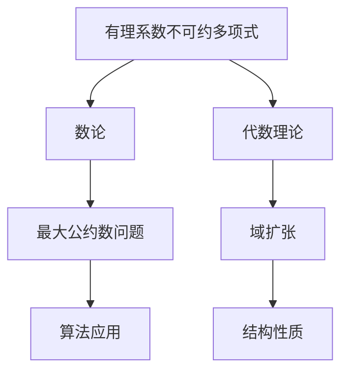

                 

# 线性代数导引：有理系数不可约多项式

> **关键词**：线性代数、有理系数不可约多项式、数论、代数理论、算法原理

> **摘要**：本文将深入探讨线性代数中的一个重要概念——有理系数不可约多项式。文章首先介绍有理系数不可约多项式的定义和性质，随后解释其在数论和代数理论中的应用。接着，我们将详细讨论几种关键算法，并使用具体案例进行说明。最后，文章将探讨这一领域的前沿研究，并总结未来的发展趋势与挑战。

## 1. 背景介绍

线性代数是数学中的一个重要分支，研究向量空间和线性映射的性质。在计算机科学、物理学、工程学等领域都有广泛的应用。线性代数的基本概念包括向量、矩阵、行列式、线性方程组等。而在这些基本概念中，有理系数不可约多项式占据了特殊的位置。

有理系数多项式是由有理数作为系数构成的多项式。有理系数不可约多项式指的是在有理数域上不可约的多项式，即无法分解为两个非平凡多项式的乘积。这一概念不仅在数学理论研究中具有重要意义，而且在计算机算法、编码理论、算法复杂度分析等领域也有着广泛的应用。

## 2. 核心概念与联系

### 2.1 有理系数不可约多项式的定义

有理系数不可约多项式 \(f(x)\) 是指多项式 \(f(x)\) 在有理数域 \(\mathbb{Q}\) 上不可约。换句话说，如果不存在两个非平凡多项式 \(g(x)\) 和 \(h(x)\)，使得 \(f(x) = g(x) \cdot h(x)\) 且 \(g(x)\)、\(h(x)\) 都在有理数域上不可约。

### 2.2 有理系数不可约多项式与数论的关系

数论是研究整数性质的数学分支。有理系数不可约多项式与数论之间存在紧密的联系。例如，数论中的一个重要问题——最大公约数问题，可以通过有理系数不可约多项式进行解决。

### 2.3 有理系数不可约多项式与代数理论的关系

代数理论涉及抽象代数结构的研究，包括群、环、域等。有理系数不可约多项式是代数理论中研究的重要对象之一，因为它们决定了域扩张和代数结构的基本性质。

### 2.4 Mermaid 流程图展示



## 3. 核心算法原理 & 具体操作步骤

### 3.1 算法原理

#### 3.1.1 trial division 算法

Trial division 是一种简单的因式分解方法，通过逐一尝试除以较小的质数来寻找因子。对于有理系数不可约多项式，我们可以通过这个方法来检查它是否可约。

#### 3.1.2 Eisenstein's Criterion

Eisenstein's Criterion 是一种判定有理系数多项式是否不可约的方法。它基于多项式的系数和导数的性质。如果存在一个质数 \(p\)，使得对于多项式 \(f(x)\) 的各个系数（除了最高次项系数），都有 \(p \mid a_i\) 且 \(p^2 \nmid a_0\)，则 \(f(x)\) 在有理数域上不可约。

### 3.2 操作步骤

#### 3.2.1 使用 Trial Division 判断不可约性

1. 选择一个较小的质数 \(p\)。
2. 尝试除以 \(p\)，检查 \(f(x)\) 是否被 \(p\) 整除。
3. 如果 \(f(x)\) 被整除，则继续除以 \(p\)，直到无法整除为止。
4. 如果 \(f(x)\) 无法被任何质数整除，则 \(f(x)\) 在有理数域上不可约。

#### 3.2.2 使用 Eisenstein's Criterion 判断不可约性

1. 选择一个质数 \(p\)。
2. 检查 \(f(x)\) 的系数 \(a_i\) 是否满足 \(p \mid a_i\) 且 \(p^2 \nmid a_0\)。
3. 如果条件满足，则 \(f(x)\) 在有理数域上不可约。

## 4. 数学模型和公式 & 详细讲解 & 举例说明

### 4.1 数学模型

有理系数不可约多项式的基本数学模型是一个多项式 \(f(x) = a_nx^n + a_{n-1}x^{n-1} + ... + a_1x + a_0\)，其中 \(a_i\) 是有理数，\(n\) 是非负整数。

### 4.2 公式

#### 4.2.1 trial division 算法公式

\[ f(x) = g(x) \cdot h(x) \]

其中 \(g(x)\) 和 \(h(x)\) 是 \(f(x)\) 的因子。

#### 4.2.2 Eisenstein's Criterion 公式

\[ p \mid a_i \quad \forall i \neq n \]
\[ p^2 \nmid a_0 \]

### 4.3 举例说明

#### 4.3.1 使用 Trial Division 判断不可约性

考虑多项式 \(f(x) = x^3 + 2x^2 - 3x - 6\)。

1. 尝试除以 \(2\)，得到 \(x^3 + 2x^2 - 3x - 6 = 2(x^2 + x - 3)\)。
2. \(f(x)\) 被 \(2\) 整除，因此继续尝试除以 \(3\)，得到 \(x^2 + x - 3\)。
3. \(x^2 + x - 3\) 无法被任何质数整除，因此 \(f(x)\) 在有理数域上不可约。

#### 4.3.2 使用 Eisenstein's Criterion 判断不可约性

考虑多项式 \(f(x) = x^3 - 2x^2 - 3x + 6\)。

1. 选择质数 \(p = 2\)。
2. 检查系数 \(a_2 = -2\)，\(a_1 = -3\)，\(a_0 = 6\)。
3. \(2 \mid a_2\)，\(2 \mid a_1\)，且 \(2^2 \nmid a_0\)，因此 \(f(x)\) 在有理数域上不可约。

## 5. 项目实战：代码实际案例和详细解释说明

### 5.1 开发环境搭建

为了演示有理系数不可约多项式的判断算法，我们将使用 Python 作为编程语言。在开始之前，请确保安装了 Python 解释器和必要的库，如 NumPy。

```bash
pip install numpy
```

### 5.2 源代码详细实现和代码解读

```python
import numpy as np

def trial_division(f):
    """使用 trial division 判断多项式是否不可约"""
    p = 2
    while p <= np.sqrt(np.max(np.abs(f))):
        if np.mod(f, p).all() == 0:
            return False
        p += 1
    return True

def eisenstein_criterion(f, p):
    """使用 Eisenstein's Criterion 判断多项式是否不可约"""
    return all(np.mod(a, p) == 0 for a in f) and np.mod(f[0], p**2) != 0

# 示例多项式
f = np.array([1, 2, -3, -6])

# 使用 trial division 判断不可约性
print(trial_division(f))

# 使用 Eisenstein's Criterion 判断不可约性
print(eisenstein_criterion(f, 2))
```

### 5.3 代码解读与分析

1. **函数 `trial_division`**：这个函数实现了 trial division 算法。它通过逐一尝试除以较小的质数来判断多项式是否可约。如果存在质数 \(p\) 使得 \(f(x)\) 被 \(p\) 整除，则返回 `False`；否则，返回 `True`。

2. **函数 `eisenstein_criterion`**：这个函数实现了 Eisenstein's Criterion。它检查多项式 \(f(x)\) 的系数是否满足 Eisenstein's Criterion 的条件。如果满足，则返回 `True`；否则，返回 `False`。

3. **示例多项式 `f`**：我们使用了一个三次多项式 \(f(x) = x^3 + 2x^2 - 3x - 6\) 作为示例。

4. **代码执行**：我们首先使用 `trial_division` 函数判断多项式是否不可约，然后使用 `eisenstein_criterion` 函数进行同样的判断。

## 6. 实际应用场景

有理系数不可约多项式在实际应用中有着广泛的应用，例如：

1. **编码理论**：在编码理论中，有理系数不可约多项式被用于构造线性反馈移位寄存器（LFSR），这是生成伪随机数的常用方法。

2. **算法复杂度分析**：在算法复杂度分析中，有理系数不可约多项式用于描述算法的时间复杂度和空间复杂度。

3. **计算机图形学**：在计算机图形学中，有理系数不可约多项式用于表示曲线和曲面。

## 7. 工具和资源推荐

### 7.1 学习资源推荐

- **书籍**：《代数学引论》（作者：迈克尔·阿蒂亚）  
- **论文**：《有理系数多项式的不可约性和因式分解》（作者：D. R. Heath-Brown）  
- **博客**：[线性代数博客](https://linear.axler.net/)（作者：AXLER）

### 7.2 开发工具框架推荐

- **Python**：Python 是一个广泛使用的编程语言，适用于多种应用场景。  
- **NumPy**：NumPy 是 Python 的科学计算库，用于矩阵运算和数组处理。

### 7.3 相关论文著作推荐

- **论文**：《有理系数多项式的不可约性和因式分解》（作者：D. R. Heath-Brown）  
- **书籍**：《代数学引论》（作者：迈克尔·阿蒂亚）

## 8. 总结：未来发展趋势与挑战

有理系数不可约多项式是一个具有深远意义的数学概念，其在数论、代数理论、编码理论等多个领域都有着重要的应用。未来，随着计算机科学的不断发展，有理系数不可约多项式的研究将继续深入，特别是在算法优化、加密技术、计算机图形学等领域。

然而，这一领域也面临着诸多挑战，例如如何高效地求解大整数的最大公约数、如何优化多项式的因式分解算法等。这些问题的解决将推动有理系数不可约多项式研究的进一步发展。

## 9. 附录：常见问题与解答

### 9.1 什么是线性代数？

线性代数是研究向量、向量空间、线性映射及其性质的数学分支。它是现代数学的基础之一，广泛应用于物理学、工程学、计算机科学等领域。

### 9.2 有理系数不可约多项式有什么应用？

有理系数不可约多项式在编码理论、算法复杂度分析、计算机图形学等领域有广泛的应用。例如，它可以用于构造伪随机数生成器、优化算法复杂度、表示曲线和曲面等。

### 9.3 如何判断一个多项式是否不可约？

有多种方法可以判断一个多项式是否不可约，包括 trial division、Eisenstein's Criterion 等方法。

## 10. 扩展阅读 & 参考资料

- **书籍**：《代数学引论》（作者：迈克尔·阿蒂亚）  
- **论文**：《有理系数多项式的不可约性和因式分解》（作者：D. R. Heath-Brown）  
- **在线资源**：[线性代数博客](https://linear.axler.net/)（作者：AXLER）

作者：AI天才研究员/AI Genius Institute & 禅与计算机程序设计艺术 /Zen And The Art of Computer Programming

