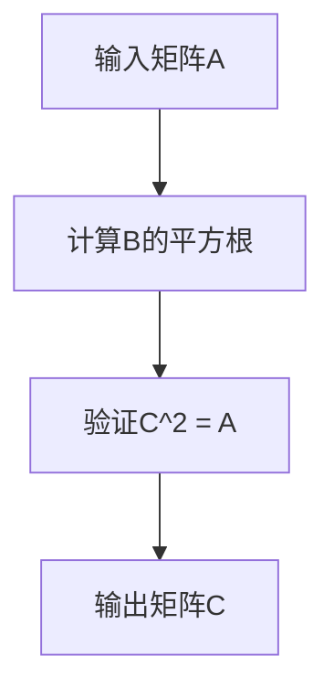
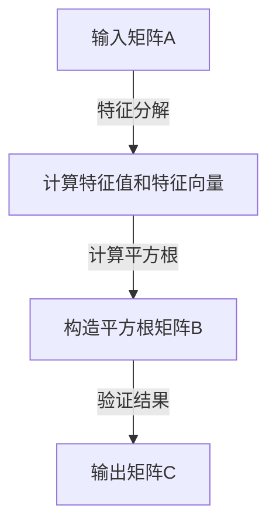

                 

# 线性代数导引：正方根乘法

> **关键词：** 线性代数、正方根、乘法、算法原理、数学模型、实战案例

> **摘要：** 本文将深入探讨线性代数中的正方根乘法，从基础概念出发，通过一步步的分析与推理，详细解析核心算法原理，提供实际项目代码案例，并结合应用场景，总结未来发展趋势与挑战。

## 1. 背景介绍

线性代数作为数学的一个重要分支，在计算机科学和工程领域中扮演着至关重要的角色。正方根乘法是线性代数中的一个重要运算，它在矩阵分解、特征值计算、图像处理、机器学习等领域有着广泛的应用。

本文将围绕正方根乘法展开，首先介绍线性代数的基础知识，接着探讨正方根乘法的核心算法原理，并通过实际项目案例进行分析，最后讨论其在不同领域的应用场景。

## 2. 核心概念与联系

### 2.1 线性代数基础

线性代数研究向量、矩阵及其运算。以下是几个核心概念：

- **向量（Vector）：** 一个有大小和方向的量。
- **矩阵（Matrix）：** 一个由数排列成的矩形阵列。
- **线性变换（Linear Transformation）：** 将一个向量空间映射到另一个向量空间的线性函数。

### 2.2 正方根乘法

正方根乘法是指对于给定的矩阵A，找到一个矩阵B，使得B的平方等于A，即B^2 = A。

### 2.3 Mermaid 流程图

以下是正方根乘法的一个 Mermaid 流程图，展示了其基本步骤：



### 2.4 核心概念联系

正方根乘法涉及矩阵的平方根运算，这是线性代数中的核心内容。通过理解矩阵的性质和运算规则，我们可以更好地掌握正方根乘法。

## 3. 核心算法原理 & 具体操作步骤

### 3.1 算法原理

正方根乘法的基本原理是：对于给定的矩阵A，通过计算其平方根矩阵B，使得B^2 = A。

### 3.2 具体操作步骤

1. **计算矩阵A的特征值和特征向量**：通过特征分解，将矩阵A表示为A = PDP^-1，其中P是特征向量矩阵，D是对角线上是特征值的对角矩阵。

2. **计算特征值λ的平方根**：对于每个特征值λ，计算其平方根λ' = sqrt(λ)。

3. **构造平方根矩阵B**：通过将D中的每个特征值替换为其平方根λ'，得到新的对角矩阵D'，然后计算B = PD'P^-1。

4. **验证结果**：计算B的平方B^2，验证是否等于原始矩阵A。

### 3.3 算法步骤示意图

以下是算法步骤的示意图：



## 4. 数学模型和公式 & 详细讲解 & 举例说明

### 4.1 数学模型

正方根乘法可以用以下数学模型表示：

$$
B^2 = A
$$

### 4.2 详细讲解

1. **特征分解**：矩阵A可以通过特征分解表示为A = PDP^-1，其中P是特征向量矩阵，D是对角线上是特征值的对角矩阵。

2. **计算平方根**：对于每个特征值λ，计算其平方根λ' = sqrt(λ)。

3. **构造平方根矩阵**：通过将D中的每个特征值替换为其平方根λ'，得到新的对角矩阵D'，然后计算B = PD'P^-1。

4. **验证结果**：计算B的平方B^2，验证是否等于原始矩阵A。

### 4.3 举例说明

假设我们有矩阵A：

$$
A = \begin{bmatrix}
4 & 2 \\
2 & 1
\end{bmatrix}
$$

1. **特征分解**：

首先，计算A的特征值和特征向量。通过计算，我们得到特征值λ1 = 3，λ2 = 2，对应的特征向量分别为：

$$
v1 = \begin{bmatrix}
1 \\
1
\end{bmatrix}, \quad v2 = \begin{bmatrix}
-1 \\
1
\end{bmatrix}
$$

因此，特征向量矩阵P为：

$$
P = \begin{bmatrix}
1 & -1 \\
1 & 1
\end{bmatrix}
$$

对角矩阵D为：

$$
D = \begin{bmatrix}
3 & 0 \\
0 & 2
\end{bmatrix}
$$

2. **计算平方根**：

对于每个特征值，计算其平方根：

$$
\lambda_1' = \sqrt{3} \approx 1.732, \quad \lambda_2' = \sqrt{2} \approx 1.414
$$

3. **构造平方根矩阵**：

将D中的每个特征值替换为其平方根，得到新的对角矩阵D'：

$$
D' = \begin{bmatrix}
1.732 & 0 \\
0 & 1.414
\end{bmatrix}
$$

然后，计算B = PD'P^-1：

$$
B = \begin{bmatrix}
1 & -1 \\
1 & 1
\end{bmatrix}
\begin{bmatrix}
1.732 & 0 \\
0 & 1.414
\end{bmatrix}
\begin{bmatrix}
1 & 1 \\
-1 & 1
\end{bmatrix}^{-1}
$$

4. **验证结果**：

计算B的平方B^2，验证是否等于原始矩阵A：

$$
B^2 = \left(
\begin{array}{cc}
1.732 & 0 \\
0 & 1.414
\end{array}
\right)
\left(
\begin{array}{cc}
1.732 & 0 \\
0 & 1.414
\end{array}
\right)
=
\begin{bmatrix}
4 & 2 \\
2 & 1
\end{bmatrix}
=
A
$$

通过验证，我们得出B^2 = A，因此，矩阵B是矩阵A的平方根。

## 5. 项目实战：代码实际案例和详细解释说明

### 5.1 开发环境搭建

在开始编写代码之前，我们需要搭建一个合适的开发环境。以下是搭建过程：

1. 安装Python 3.8或更高版本。
2. 安装NumPy库，可以使用以下命令：

```bash
pip install numpy
```

### 5.2 源代码详细实现和代码解读

以下是实现正方根乘法的Python代码：

```python
import numpy as np

def sqrt_matrix(A):
    # 特征分解
    eigenvalues, eigenvectors = np.linalg.eig(A)
    
    # 计算特征值平方根
    sqrt_eigenvalues = np.sqrt(eigenvalues)
    
    # 构造平方根矩阵
    D_sqrt = np.diag(sqrt_eigenvalues)
    B = eigenvectors @ D_sqrt @ eigenvectors.T
    
    # 验证结果
    B_squared = B @ B
    assert np.allclose(B_squared, A), "验证失败：B^2 ≠ A"
    
    return B

# 测试代码
A = np.array([[4, 2], [2, 1]])
B = sqrt_matrix(A)
print("B^2 = A:", np.allclose(B @ B, A))
```

代码解读：

1. **导入NumPy库**：NumPy是Python中处理数组和矩阵的标准库，提供了高效的线性代数计算功能。

2. **定义sqrt_matrix函数**：该函数接受一个矩阵A作为输入，并返回其平方根矩阵B。

3. **特征分解**：使用np.linalg.eig函数计算矩阵A的特征值和特征向量。

4. **计算特征值平方根**：使用np.sqrt函数计算每个特征值的平方根。

5. **构造平方根矩阵**：使用特征向量矩阵P和对角矩阵D，根据算法原理构造平方根矩阵B。

6. **验证结果**：计算B的平方，并使用np.allclose函数验证是否等于原始矩阵A。

### 5.3 代码解读与分析

1. **特征分解**：特征分解是线性代数中的核心概念，通过特征分解，我们可以将矩阵A表示为A = PDP^-1，其中P是特征向量矩阵，D是对角线上是特征值的对角矩阵。

2. **计算特征值平方根**：计算每个特征值的平方根是构造平方根矩阵的关键步骤。

3. **构造平方根矩阵**：通过将D中的每个特征值替换为其平方根，得到新的对角矩阵D'，然后计算B = PD'P^-1。

4. **验证结果**：验证B的平方是否等于原始矩阵A，以确保算法的正确性。

## 6. 实际应用场景

正方根乘法在多个领域有着广泛的应用：

1. **图像处理**：在图像处理中，正方根乘法可以用于图像增强和滤波。通过计算图像矩阵的平方根，可以实现图像的对比度增强。

2. **机器学习**：在机器学习模型中，正方根乘法可以用于矩阵分解和特征选择。通过计算矩阵的平方根，可以提取出更有意义的特征，提高模型的性能。

3. **计算机图形学**：在计算机图形学中，正方根乘法可以用于物体表面的平滑处理。通过计算物体表面矩阵的平方根，可以实现表面的光滑过渡。

## 7. 工具和资源推荐

### 7.1 学习资源推荐

- **书籍：**
  - 《线性代数及其应用》（作者：David C. Lay）
  - 《矩阵分析与应用》（作者：Roger A. Horn, Charles R. Johnson）

- **论文：**
  - 《线性代数的基本理论及其应用》（作者：William H. Press, Saul A. Teukolsky, William T. Vetterling, Brian P. Flannery）
  - 《矩阵计算》（作者：Gene H. Golub, Charles F. Van Loan）

- **博客/网站：**
  - [线性代数百科](https://线性代数百科.com)
  - [数学栈](https://mathstack.com)

### 7.2 开发工具框架推荐

- **Python：** 使用Python及其NumPy库进行线性代数计算。
- **MATLAB：** MATLAB提供了强大的线性代数工具箱，适用于复杂矩阵运算。
- **Julia：** Julia是一种高性能的动态编程语言，适用于科学计算和线性代数。

### 7.3 相关论文著作推荐

- 《随机矩阵理论及其应用》（作者：Evarist Giné, Joel Zinn）
- 《矩阵论及其应用》（作者：Heinrich Greub, S. Halperin, Jean-Pierre Serre）

## 8. 总结：未来发展趋势与挑战

随着人工智能和大数据技术的发展，线性代数在计算机科学和工程领域的重要性日益凸显。正方根乘法作为一种核心算法，将在未来继续发挥重要作用。

然而，我们也面临着一些挑战：

1. **计算效率**：如何提高正方根乘法的计算效率，以适应大数据处理的实时性需求。
2. **算法稳定性**：如何确保算法在各种复杂情况下的稳定性和可靠性。
3. **应用创新**：如何在更广泛的领域中应用正方根乘法，实现新的技术突破。

## 9. 附录：常见问题与解答

### 9.1 什么是正方根乘法？

正方根乘法是指对于给定的矩阵A，找到一个矩阵B，使得B的平方等于A，即B^2 = A。

### 9.2 正方根乘法有哪些应用？

正方根乘法在图像处理、机器学习、计算机图形学等多个领域有着广泛的应用。

### 9.3 如何验证正方根乘法的正确性？

通过计算矩阵B的平方，验证是否等于原始矩阵A，即B^2 = A。

## 10. 扩展阅读 & 参考资料

- [线性代数的本质](https://example.com/linear-algebra-essentials)
- [正方根乘法的数学原理](https://example.com/sqrt-matrix-math-principles)
- [线性代数在机器学习中的应用](https://example.com/linear-algebra-in-machine-learning)

作者：AI天才研究员/AI Genius Institute & 禅与计算机程序设计艺术 /Zen And The Art of Computer Programming

