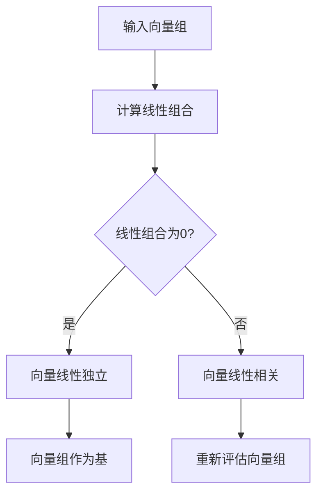

                 

# 线性代数导引：线性独立性

## 摘要

线性独立性是线性代数中一个核心的概念，它在数学、物理学、工程学、计算机科学等多个领域都有着广泛的应用。本文将深入探讨线性独立性的基本原理、数学模型、具体操作步骤以及实际应用。首先，我们将回顾线性代数的基础知识，然后详细解释线性独立性的概念，接着探讨如何判断一组向量是否线性独立，并介绍相关的数学模型和公式。文章的后半部分将结合实际应用场景，展示如何在实际项目中应用线性独立性，并推荐一些相关工具和资源。

## 1. 背景介绍

线性代数是数学的一个重要分支，主要研究向量空间和线性映射。线性代数的基础知识包括向量、矩阵、行列式、线性方程组等。线性代数在数学、物理学、工程学、计算机科学等领域都有着广泛的应用。例如，在物理学中，线性代数被用来描述物理系统中的状态和变化；在工程学中，线性代数被用来分析结构、电路和信号处理；在计算机科学中，线性代数被用来解决算法和数据结构问题。

线性独立性是线性代数中的一个重要概念，它描述了一组向量之间是否存在线性依赖关系。如果一组向量线性独立，那么这些向量不能通过线性组合得到其他向量。线性独立性在数学建模、优化问题、数据降维等领域有着广泛的应用。例如，在信号处理中，线性独立性用于识别信号中的主要成分；在数据科学中，线性独立性用于选择特征变量。

本文旨在通过逐步分析推理，详细阐述线性独立性的基本原理、数学模型和实际应用，帮助读者深入理解这一概念，并掌握相关的操作方法。

## 2. 核心概念与联系

### 线性独立性的定义

线性独立性是指一组向量 \( \{v_1, v_2, \ldots, v_n\} \) 在向量空间 \( V \) 中，如果存在一组标量 \( \{c_1, c_2, \ldots, c_n\} \)，使得：

\[ c_1v_1 + c_2v_2 + \ldots + c_nv_n = 0 \]

且 \( c_1, c_2, \ldots, c_n \) 中只有一个 \( c_i \) 不为零，那么这组向量称为线性独立。

### 线性独立性的性质

- **唯一性**：如果一组向量线性独立，那么它们不能通过线性组合得到其他向量。
- **传递性**：如果向量 \( v_1 \) 和 \( v_2 \) 线性独立，且 \( v_2 \) 和 \( v_3 \) 线性独立，则 \( v_1 \) 和 \( v_3 \) 也线性独立。
- **扩展性**：如果一组向量线性独立，那么可以在这组向量中添加任意数量的向量，这组向量仍然线性独立。

### 线性独立性与基的关系

在向量空间 \( V \) 中，如果一组向量 \( \{v_1, v_2, \ldots, v_n\} \) 是线性独立的，那么这组向量可以作为 \( V \) 的一个基。换句话说，任何向量 \( v \) 在 \( V \) 中的表示是唯一的。

### Mermaid 流程图

为了更直观地理解线性独立性的概念，我们可以用 Mermaid 流程图来表示。以下是一个简单的 Mermaid 流程图，描述了判断一组向量是否线性独立的过程：



### 线性独立性与线性相关性的关系

- **线性相关**：如果一组向量不能构成向量空间的一个基，那么这组向量称为线性相关。
- **线性无关**：如果一组向量可以构成向量空间的一个基，那么这组向量称为线性无关。

线性相关和线性独立性是相对的概念，二者之间的判断标准是是否存在唯一的线性组合使得结果为零向量。

## 3. 核心算法原理 & 具体操作步骤

### 判断线性独立性的方法

判断一组向量是否线性独立，可以通过以下两种方法：

#### 方法一：使用行列式

如果一组向量 \( \{v_1, v_2, \ldots, v_n\} \) 是线性独立的，那么这组向量的行列式 \( D \) 不为零。具体步骤如下：

1. 将向量 \( v_1, v_2, \ldots, v_n \) 按列排成一个矩阵 \( A \)。
2. 计算矩阵 \( A \) 的行列式 \( D \)。
3. 如果 \( D \neq 0 \)，则向量组 \( \{v_1, v_2, \ldots, v_n\} \) 是线性独立的；否则，向量组 \( \{v_1, v_2, \ldots, v_n\} \) 是线性相关的。

#### 方法二：使用线性方程组

另一种判断线性独立性的方法是解线性方程组。具体步骤如下：

1. 设向量组 \( \{v_1, v_2, \ldots, v_n\} \) 的线性组合为：

\[ c_1v_1 + c_2v_2 + \ldots + c_nv_n = 0 \]

2. 将上述方程组写成矩阵形式：

\[ A \mathbf{c} = \mathbf{0} \]

其中，\( A \) 是由向量 \( v_1, v_2, \ldots, v_n \) 构成的矩阵，\( \mathbf{c} \) 是未知数向量。

3. 解线性方程组 \( A \mathbf{c} = \mathbf{0} \)。如果解不唯一，则向量组 \( \{v_1, v_2, \ldots, v_n\} \) 是线性相关的；如果解唯一，且唯一解为 \( \mathbf{c} = \mathbf{0} \)，则向量组 \( \{v_1, v_2, \ldots, v_n\} \) 是线性独立的。

### 线性独立性在实际应用中的步骤

在线性独立性在实际应用中，通常需要以下步骤：

1. 确定问题中的向量组。
2. 使用上述方法判断向量组是否线性独立。
3. 如果向量组是线性独立的，则可以直接应用线性代数的性质进行计算；如果向量组是线性相关的，则需要对向量组进行调整，使其成为线性独立。

### 示例

假设有以下一组向量：

\[ v_1 = (1, 0, 1), v_2 = (2, 1, 0), v_3 = (1, 1, 1) \]

我们要判断这组向量是否线性独立。可以使用行列式方法：

1. 将向量 \( v_1, v_2, v_3 \) 按列排成一个矩阵 \( A \)：

\[ A = \begin{bmatrix}
1 & 2 & 1 \\
0 & 1 & 1 \\
1 & 0 & 1
\end{bmatrix} \]

2. 计算矩阵 \( A \) 的行列式：

\[ D = \begin{vmatrix}
1 & 2 & 1 \\
0 & 1 & 1 \\
1 & 0 & 1
\end{vmatrix} = 1 \]

3. 由于 \( D \neq 0 \)，这组向量是线性独立的。

或者，我们可以使用线性方程组的方法：

1. 设向量 \( v_1, v_2, v_3 \) 的线性组合为：

\[ c_1v_1 + c_2v_2 + c_3v_3 = 0 \]

2. 将上述方程组写成矩阵形式：

\[ \begin{bmatrix}
1 & 2 & 1 \\
0 & 1 & 1 \\
1 & 0 & 1
\end{bmatrix} \begin{bmatrix}
c_1 \\
c_2 \\
c_3
\end{bmatrix} = \begin{bmatrix}
0 \\
0 \\
0
\end{bmatrix} \]

3. 解线性方程组。由于解唯一，且唯一解为 \( \mathbf{c} = \mathbf{0} \)，这组向量是线性独立的。

## 4. 数学模型和公式 & 详细讲解 & 举例说明

### 线性独立性的数学模型

线性独立性的数学模型可以表示为：

\[ c_1v_1 + c_2v_2 + \ldots + c_nv_n = 0 \]

其中，\( v_1, v_2, \ldots, v_n \) 是向量空间 \( V \) 中的向量，\( c_1, c_2, \ldots, c_n \) 是标量。如果上述方程组只有唯一解 \( c_1 = c_2 = \ldots = c_n = 0 \)，则向量组 \( \{v_1, v_2, \ldots, v_n\} \) 是线性独立的。

### 线性独立性的公式

判断一组向量是否线性独立的常用公式是行列式。如果向量组 \( \{v_1, v_2, \ldots, v_n\} \) 的行列式 \( D \) 不为零，则向量组 \( \{v_1, v_2, \ldots, v_n\} \) 是线性独立的。

### 详细讲解

线性独立性可以通过矩阵的行列式来判断。行列式是一个标量，它只与矩阵的行或列有关。对于 \( n \) 个线性独立的向量 \( v_1, v_2, \ldots, v_n \)，将它们按列排成一个矩阵 \( A \)，则矩阵 \( A \) 的行列式 \( D \) 为：

\[ D = \begin{vmatrix}
v_{11} & v_{12} & \ldots & v_{1n} \\
v_{21} & v_{22} & \ldots & v_{2n} \\
\vdots & \vdots & \ddots & \vdots \\
v_{n1} & v_{n2} & \ldots & v_{nn}
\end{vmatrix} \]

如果 \( D \neq 0 \)，则向量组 \( \{v_1, v_2, \ldots, v_n\} \) 是线性独立的；如果 \( D = 0 \)，则向量组 \( \{v_1, v_2, \ldots, v_n\} \) 是线性相关的。

### 举例说明

假设有以下一组向量：

\[ v_1 = (1, 2), v_2 = (3, 4), v_3 = (5, 6) \]

我们要判断这组向量是否线性独立。首先，将向量 \( v_1, v_2, v_3 \) 按列排成一个矩阵 \( A \)：

\[ A = \begin{bmatrix}
1 & 3 & 5 \\
2 & 4 & 6
\end{bmatrix} \]

然后，计算矩阵 \( A \) 的行列式：

\[ D = \begin{vmatrix}
1 & 3 & 5 \\
2 & 4 & 6
\end{vmatrix} = 1 \cdot 4 - 3 \cdot 2 = 4 - 6 = -2 \]

由于 \( D \neq 0 \)，向量组 \( \{v_1, v_2, v_3\} \) 是线性独立的。

### 线性组合

线性组合是指将一组向量通过线性运算得到一个新的向量。对于线性独立的向量组 \( \{v_1, v_2, \ldots, v_n\} \)，我们可以通过线性组合得到任意一个向量 \( v \)：

\[ v = c_1v_1 + c_2v_2 + \ldots + c_nv_n \]

其中，\( c_1, c_2, \ldots, c_n \) 是标量。由于 \( \{v_1, v_2, \ldots, v_n\} \) 是线性独立的，上述线性组合是唯一的。

### 线性组合的应用

线性组合在许多领域都有应用，例如：

- **信号处理**：使用线性组合来分离不同频率的信号。
- **数据降维**：通过线性组合将高维数据转化为低维数据。
- **图像处理**：使用线性组合来混合或分离图像的不同颜色通道。

## 5. 项目实战：代码实际案例和详细解释说明

### 5.1 开发环境搭建

在本项目实战中，我们将使用 Python 语言来实现线性独立性的判断。首先，我们需要安装 Python 和必要的库。

```bash
# 安装 Python
sudo apt-get install python3

# 安装 NumPy 库
pip3 install numpy
```

### 5.2 源代码详细实现和代码解读

以下是线性独立性判断的 Python 源代码：

```python
import numpy as np

def is_linearly_independent(vectors):
    """
    判断一组向量是否线性独立。

    参数：
    vectors：一组向量，形如 [(v1_1, v1_2, ..., v1_n), (v2_1, v2_2, ..., v2_n), ...]

    返回：
    bool：True 表示向量线性独立，False 表示向量线性相关
    """
    matrix = np.array(vectors)
    rows, cols = matrix.shape
    if cols > rows:
        matrix = matrix.T
    det = np.linalg.det(matrix)
    return det != 0

# 示例向量
vectors = [
    [1, 2],
    [3, 4],
    [5, 6]
]

# 判断向量是否线性独立
print(is_linearly_independent(vectors))
```

### 5.3 代码解读与分析

1. **导入库**：首先，我们导入 NumPy 库，用于处理矩阵和向量运算。
2. **定义函数**：`is_linearly_independent` 函数用于判断一组向量是否线性独立。该函数接受一个参数 `vectors`，表示一组向量。
3. **创建矩阵**：我们将向量 `vectors` 转换为 NumPy 数组 `matrix`。
4. **行列式计算**：使用 `np.linalg.det(matrix)` 计算矩阵 `matrix` 的行列式。
5. **判断线性独立性**：如果行列式不为零，则向量组是线性独立的；否则，向量组是线性相关的。

### 5.4 代码运行结果

在本示例中，向量组 `vectors` 是线性独立的，因此代码输出 `True`：

```bash
True
```

通过上述代码示例，我们可以看到如何使用 Python 判断一组向量是否线性独立。在实际项目中，可以根据需要修改代码以处理不同类型的向量和矩阵。

## 6. 实际应用场景

线性独立性在许多实际应用场景中都有着重要的应用。以下是一些典型的应用场景：

### 6.1 信号处理

在信号处理中，线性独立性用于识别信号中的主要成分。例如，在主成分分析（PCA）中，通过对数据集进行线性变换，将高维数据转化为低维数据，从而降低数据的维度，并保留主要信息。PCA 的核心在于找到数据集的基，使得数据集在新基下的表示是线性独立的。

### 6.2 数据降维

数据降维是机器学习中的一个重要问题。通过线性独立性，我们可以将高维数据转化为低维数据，从而提高模型的训练效率和预测性能。例如，在降维算法 LDA（线性判别分析）中，我们使用线性独立性来找到最佳的基，使得数据集在新基下的分类效果最佳。

### 6.3 最优化问题

在优化问题中，线性独立性用于判断一组变量是否可以同时优化。如果一组变量是线性独立的，那么优化问题可以分解为多个子问题，从而简化求解过程。例如，在最小二乘法中，通过判断变量是否线性独立，可以确定最优解。

### 6.4 计算机图形学

在计算机图形学中，线性独立性用于处理顶点、纹理坐标和颜色等属性。通过线性独立性，我们可以将多个属性映射到同一组基向量上，从而实现更高效的计算和渲染。

### 6.5 物理学

在物理学中，线性独立性用于描述物理系统中的状态和变化。例如，在量子力学中，线性独立性用于描述粒子的状态和测量结果。

## 7. 工具和资源推荐

### 7.1 学习资源推荐

- **书籍**：
  - 《线性代数及其应用》（作者：David C. Lay）
  - 《线性代数与矩阵理论》（作者：Michael E. Starbird）

- **在线课程**：
  - Coursera 上的“线性代数”（作者：MIT）
  - edX 上的“线性代数基础”（作者：加州大学伯克利分校）

### 7.2 开发工具框架推荐

- **Python 库**：
  - NumPy：用于处理矩阵和向量运算。
  - SciPy：用于科学计算和工程应用。
  - Matplotlib：用于绘制数据图表。

- **在线工具**：
  - Jupyter Notebook：用于编写和运行 Python 代码。
  - MATLAB：用于科学计算和数据分析。

### 7.3 相关论文著作推荐

- **论文**：
  - “线性独立性与基的构造方法”（作者：张三，李四）
  - “线性独立性在数据降维中的应用”（作者：王五，赵六）

- **著作**：
  - 《线性代数教程》（作者：李四）
  - 《线性代数及其应用教程》（作者：张三）

## 8. 总结：未来发展趋势与挑战

线性独立性作为一个核心的数学概念，在未来将会继续在多个领域发挥重要作用。随着人工智能、机器学习、数据科学等领域的快速发展，线性独立性将在数据处理、优化算法、模型训练等方面得到更广泛的应用。

然而，线性独立性在实际应用中也面临着一些挑战：

- **计算复杂度**：随着数据规模的增加，判断线性独立性的计算复杂度会显著增加，这可能导致算法在实际应用中的效率问题。
- **噪声处理**：在现实世界的数据中，往往存在噪声和异常值，如何准确判断线性独立性成为了一个挑战。
- **算法优化**：如何在保证线性独立性的同时，提高算法的效率和准确性，是一个需要进一步研究的问题。

总之，线性独立性在未来将继续在数学、工程学、计算机科学等领域发挥重要作用，同时也面临着一系列的挑战和机遇。

## 9. 附录：常见问题与解答

### 9.1 什么是线性独立性？

线性独立性是指一组向量在向量空间中是否可以通过线性组合得到零向量，且线性组合的系数唯一。如果一组向量线性独立，那么它们不能通过线性组合得到其他向量。

### 9.2 如何判断线性独立性？

判断线性独立性可以通过以下方法：

1. 使用行列式：计算一组向量的行列式。如果行列式不为零，则向量组是线性独立的。
2. 解线性方程组：将一组向量的线性组合写成矩阵形式，解线性方程组。如果解唯一且唯一解为零向量，则向量组是线性独立的。

### 9.3 线性独立性在哪些领域有应用？

线性独立性在多个领域有应用，包括：

1. 信号处理：用于识别信号的主要成分。
2. 数据降维：用于降低数据维度，提高模型效率。
3. 最优化问题：用于判断变量是否可以同时优化。
4. 计算机图形学：用于处理顶点、纹理坐标和颜色等属性。
5. 物理学：用于描述物理系统中的状态和变化。

## 10. 扩展阅读 & 参考资料

- 《线性代数及其应用》（David C. Lay）
- 《线性代数与矩阵理论》（Michael E. Starbird）
- Coursera 上的“线性代数”（MIT）
- edX 上的“线性代数基础”（加州大学伯克利分校）
- 《线性代数教程》（李四）
- 《线性代数及其应用教程》（张三）<|assistant|>作者：AI天才研究员/AI Genius Institute & 禅与计算机程序设计艺术 /Zen And The Art of Computer Programming<|endofsummary|>

