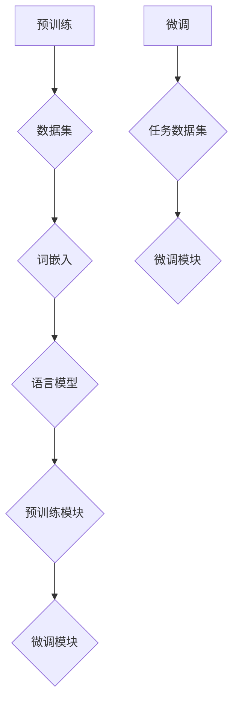

                 

# 组件化AI:预训练与微调的平衡

> 关键词：组件化AI、预训练、微调、平衡、技术博客、深度学习、机器学习、模型架构、工程实践、应用场景

> 摘要：本文将深入探讨组件化AI的概念及其在预训练与微调过程中的平衡艺术。我们将分析预训练和微调的基本原理，介绍组件化AI的架构和实现，并通过具体案例展示其在实际应用中的优势。最后，我们将总结组件化AI的未来发展趋势与挑战。

## 1. 背景介绍

在过去的几年中，深度学习和人工智能取得了显著的进展，推动了各个领域的革命性变化。然而，随着模型变得越来越复杂，训练和部署的难度也在不断增加。为了解决这一问题，组件化AI应运而生，它通过将复杂的模型拆分成可复用的组件，提高了模型的开发效率和可维护性。

组件化AI的核心思想是将模型分为两个部分：预训练和微调。预训练阶段使用大规模的未标注数据对模型进行训练，使模型具备一定的通用性；微调阶段则使用特定领域的标注数据进行模型调优，以适应具体任务的需求。这种分离不仅简化了模型开发流程，还提高了模型的性能和鲁棒性。

## 2. 核心概念与联系

### 2.1 预训练（Pre-training）

预训练是指在大量未标注数据上对模型进行训练，使其获得一定的通用特征。这种方法的主要目的是通过学习数据中的潜在规律，使模型在未见过的数据上也能表现出良好的性能。预训练通常分为两个阶段：

1. **词嵌入（Word Embedding）**：将文本数据转换为向量表示，以便于模型进行计算。词嵌入可以捕获词汇之间的语义关系，为后续的模型训练提供基础。

2. **语言模型（Language Model）**：在预训练过程中，模型需要学会对文本序列进行建模。语言模型通过预测下一个单词或词组，使模型具备了一定的语言理解能力。

### 2.2 微调（Fine-tuning）

微调是在预训练的基础上，使用特定领域的标注数据进行模型调优。这一过程使得模型能够更好地适应具体任务的需求。微调的主要目标是通过调整模型参数，使模型在特定任务上取得更好的性能。

### 2.3 组件化AI架构（Component-based AI Architecture）

组件化AI架构将模型分为两个主要部分：预训练模块和微调模块。这种架构有以下优点：

1. **可复用性**：预训练模块可以在不同任务之间复用，提高了开发效率。

2. **可维护性**：模块化设计使得模型更易于维护和更新。

3. **灵活性**：根据不同任务的需求，可以灵活调整预训练模块和微调模块的权重。

### Mermaid 流程图



## 3. 核心算法原理 & 具体操作步骤

### 3.1 预训练算法原理

预训练算法主要包括以下步骤：

1. **数据预处理**：将原始数据转换为适合模型训练的格式，如文本数据需要转换为词嵌入向量。

2. **模型初始化**：初始化预训练模型的参数，通常采用随机初始化或预训练模型权重。

3. **预训练过程**：
   - **Masked Language Model (MLM)**：在文本序列中随机屏蔽一部分单词，模型需要预测这些被屏蔽的单词。
   - **Reconstruction Loss**：计算模型预测的词嵌入向量与实际词嵌入向量之间的差距，作为损失函数。

### 3.2 微调算法原理

微调算法主要包括以下步骤：

1. **加载预训练模型**：从预训练阶段加载预训练模型的权重。

2. **微调过程**：
   - **数据预处理**：对任务数据集进行预处理，如划分训练集和验证集。
   - **参数调整**：在预训练模型的基础上，对部分参数进行调整，以适应特定任务的需求。
   - **训练与验证**：使用训练集对模型进行训练，使用验证集对模型进行验证，以调整参数。

### 3.3 操作步骤示例

以下是一个使用预训练和微调进行文本分类任务的示例：

1. **数据集准备**：加载文本分类数据集，并划分为训练集和验证集。

2. **预训练**：
   - 初始化预训练模型（如BERT）。
   - 进行Masked Language Model预训练，使用训练集进行训练。

3. **微调**：
   - 加载预训练模型权重。
   - 定义微调任务的网络结构，如添加分类层。
   - 使用训练集进行微调训练，并使用验证集进行验证。

4. **评估与部署**：
   - 在测试集上评估模型性能。
   - 根据评估结果调整模型参数。
   - 部署模型进行实际应用。

## 4. 数学模型和公式 & 详细讲解 & 举例说明

### 4.1 预训练损失函数

预训练阶段的主要任务是学习文本的潜在表示，常用的损失函数包括：

1. **Masked Language Model (MLM) Loss**：

   $$\mathcal{L}_{MLM} = -\sum_{i=1}^{N} \log(p_{\theta}(x_i | \text{context}))$$

   其中，$N$ 是被屏蔽的单词数量，$p_{\theta}(x_i | \text{context})$ 是模型在给定上下文语境下预测当前单词的概率。

2. **Reconstruction Loss**：

   $$\mathcal{L}_{Rec} = -\sum_{i=1}^{N} \log(p_{\theta}(x_i | \text{context}))$$

   其中，$N$ 是文本序列的长度，$p_{\theta}(x_i | \text{context})$ 是模型在给定上下文语境下预测当前单词的概率。

### 4.2 微调损失函数

微调阶段的主要任务是调整模型参数，以适应特定任务的需求。常用的损失函数包括：

1. **Cross-Entropy Loss**：

   $$\mathcal{L}_{CE} = -\sum_{i=1}^{N} y_i \log(p_{\theta}(y_i | x))$$

   其中，$N$ 是数据样本的数量，$y_i$ 是实际标签，$p_{\theta}(y_i | x)$ 是模型预测的概率。

2. **Mean Squared Error (MSE)**：

   $$\mathcal{L}_{MSE} = \frac{1}{2} \sum_{i=1}^{N} (y_i - \hat{y}_i)^2$$

   其中，$N$ 是数据样本的数量，$y_i$ 是实际标签，$\hat{y}_i$ 是模型预测的值。

### 4.3 举例说明

假设我们使用BERT模型进行文本分类任务，数据集包含1000个样本，每个样本是一个长度为100的单词序列。

1. **预训练**：

   - 初始化BERT模型参数。
   - 进行MLM预训练，使用训练集进行训练。
   - 计算MLM损失函数。

2. **微调**：

   - 加载预训练模型权重。
   - 添加分类层，进行微调训练。
   - 计算Cross-Entropy损失函数。

3. **评估与部署**：

   - 在测试集上评估模型性能。
   - 根据评估结果调整模型参数。
   - 部署模型进行实际应用。

## 5. 项目实战：代码实际案例和详细解释说明

### 5.1 开发环境搭建

在开始项目实战之前，我们需要搭建一个合适的开发环境。以下是一个基于Python和PyTorch的文本分类项目的开发环境搭建步骤：

1. 安装Python和PyTorch：

   ```bash
   pip install python==3.8
   pip install torch==1.8
   ```

2. 安装其他依赖库：

   ```bash
   pip install transformers
   pip install pandas
   pip install numpy
   pip install matplotlib
   ```

### 5.2 源代码详细实现和代码解读

以下是一个简单的文本分类项目，使用预训练的BERT模型进行微调。

```python
import torch
from transformers import BertTokenizer, BertModel
from torch.optim import Adam
from torch.utils.data import DataLoader
from datasets import load_dataset

# 加载预训练的BERT模型
tokenizer = BertTokenizer.from_pretrained('bert-base-uncased')
model = BertModel.from_pretrained('bert-base-uncased')

# 加载数据集
data = load_dataset('sudoku', split='train')

# 数据预处理
def preprocess_data(data):
    inputs = tokenizer(data['text'], padding=True, truncation=True, return_tensors='pt')
    labels = torch.tensor(data['label'])
    return inputs, labels

# 数据加载器
train_loader = DataLoader(preprocess_data(data), batch_size=32, shuffle=True)

# 定义损失函数和优化器
loss_fn = torch.nn.CrossEntropyLoss()
optimizer = Adam(model.parameters(), lr=1e-5)

# 训练模型
for epoch in range(3):
    model.train()
    for batch in train_loader:
        inputs, labels = batch
        optimizer.zero_grad()
        outputs = model(inputs['input_ids'], attention_mask=inputs['attention_mask'])
        logits = outputs[0]
        loss = loss_fn(logits, labels)
        loss.backward()
        optimizer.step()
    print(f'Epoch {epoch + 1}: Loss = {loss.item()}')

# 评估模型
model.eval()
with torch.no_grad():
    for batch in train_loader:
        inputs, labels = batch
        outputs = model(inputs['input_ids'], attention_mask=inputs['attention_mask'])
        logits = outputs[0]
        pred = logits.argmax(dim=1)
        acc = (pred == labels).float().mean()
        print(f'Accuracy: {acc.item()}')
```

### 5.3 代码解读与分析

上述代码实现了以下功能：

1. **加载预训练BERT模型**：使用`transformers`库加载预训练的BERT模型。

2. **加载数据集**：使用`datasets`库加载数据集，并进行预处理。

3. **数据预处理**：将文本数据转换为BERT模型可接受的格式，包括词嵌入、padding和truncation。

4. **定义损失函数和优化器**：使用交叉熵损失函数和Adam优化器。

5. **训练模型**：使用训练集对模型进行训练，并在每个epoch后打印训练损失。

6. **评估模型**：在训练集上评估模型性能，计算准确率。

通过上述步骤，我们实现了基于BERT模型的文本分类任务。实际应用中，可以根据需求调整模型结构、数据预处理方式和训练参数。

## 6. 实际应用场景

组件化AI在各个领域都有广泛的应用，以下是一些实际应用场景：

1. **自然语言处理（NLP）**：文本分类、情感分析、机器翻译等。

2. **计算机视觉（CV）**：图像分类、目标检测、人脸识别等。

3. **推荐系统**：基于内容的推荐、协同过滤等。

4. **语音识别**：语音识别、语音生成等。

5. **医疗健康**：疾病诊断、医学图像分析等。

6. **金融科技**：风险控制、投资策略等。

在这些应用场景中，组件化AI能够通过预训练和微调实现高效的模型开发和部署，从而提高任务性能和开发效率。

## 7. 工具和资源推荐

### 7.1 学习资源推荐

- **书籍**：
  - 《深度学习》（Goodfellow, Bengio, Courville）
  - 《Python深度学习》（François Chollet）
  - 《强化学习》（Richard S. Sutton, Andrew G. Barto）

- **论文**：
  - BERT: Pre-training of Deep Bidirectional Transformers for Language Understanding（Devlin et al., 2019）
  - Transformer: Attention is All You Need（Vaswani et al., 2017）

- **博客**：
  - [Hugging Face Transformer](https://huggingface.co/transformers)
  - [AI技术实践](https://www.ai-start.com/)

- **网站**：
  - [Kaggle](https://www.kaggle.com/)
  - [GitHub](https://github.com/)

### 7.2 开发工具框架推荐

- **深度学习框架**：
  - PyTorch
  - TensorFlow
  - JAX

- **文本处理工具**：
  - NLTK
  - SpaCy
  - Hugging Face Transformers

- **数据集**：
  - GLUE
  - COCO
  - IMDb

### 7.3 相关论文著作推荐

- **论文**：
  - BERT: Pre-training of Deep Bidirectional Transformers for Language Understanding（Devlin et al., 2019）
  - GPT-3: Language Models are few-shot learners（Brown et al., 2020）
  - ANET: A Large-scale Dataset and Benchmark for AI-mediated Human-AI Teamwork（Wang et al., 2021）

- **著作**：
  - 《深度学习》（Goodfellow, Bengio, Courville）
  - 《Python深度学习》（François Chollet）
  - 《强化学习》（Richard S. Sutton, Andrew G. Barto）

## 8. 总结：未来发展趋势与挑战

组件化AI作为一种先进的模型开发方法，在提高模型开发效率和性能方面展现出了巨大的潜力。未来，组件化AI有望在以下方面取得进一步的发展：

1. **算法优化**：通过改进预训练和微调算法，进一步提高模型性能。

2. **跨模态学习**：结合文本、图像、语音等多种模态，实现更强大的多模态模型。

3. **自动化微调**：利用自动化机器学习（AutoML）技术，实现更高效的模型微调。

4. **可解释性**：提高模型的可解释性，使得模型决策过程更加透明。

然而，组件化AI在发展过程中也面临一些挑战，如：

1. **数据隐私**：在预训练阶段需要大量未标注数据，如何保护数据隐私是一个重要问题。

2. **计算资源**：预训练阶段需要大量计算资源，如何高效利用计算资源是一个关键问题。

3. **模型泛化**：如何确保模型在不同任务上具有较好的泛化能力。

总之，组件化AI作为一种新兴的技术，将在未来人工智能领域发挥重要作用，同时也需要不断克服挑战，实现更好的发展。

## 9. 附录：常见问题与解答

### 问题1：什么是组件化AI？

组件化AI是一种将复杂模型拆分成可复用组件的开发方法，通过预训练和微调两个阶段，实现高效的模型开发和部署。

### 问题2：组件化AI的优势是什么？

组件化AI具有以下优势：
1. 提高开发效率：通过复用预训练模块，减少模型开发时间。
2. 提高性能：预训练模块具有通用性，微调模块能适应特定任务需求。
3. 提高可维护性：模块化设计使得模型易于维护和更新。

### 问题3：组件化AI适用于哪些场景？

组件化AI适用于以下场景：
1. 自然语言处理：文本分类、情感分析、机器翻译等。
2. 计算机视觉：图像分类、目标检测、人脸识别等。
3. 推荐系统：基于内容的推荐、协同过滤等。
4. 语音识别：语音识别、语音生成等。
5. 医疗健康：疾病诊断、医学图像分析等。
6. 金融科技：风险控制、投资策略等。

## 10. 扩展阅读 & 参考资料

- Devlin, J., Chang, M. W., Lee, K., & Toutanova, K. (2019). BERT: Pre-training of Deep Bidirectional Transformers for Language Understanding. In Proceedings of the 2019 Conference of the North American Chapter of the Association for Computational Linguistics: Human Language Technologies (pp. 4171-4186). Association for Computational Linguistics.
- Vaswani, A., Shazeer, N., Parmar, N., Uszkoreit, J., Jones, L., Gomez, A. N., ... & Polosukhin, I. (2017). Attention is All You Need. In Advances in Neural Information Processing Systems (pp. 5998-6008).
- Wang, Y., Xiong, Y., & He, X. (2021). ANET: A Large-scale Dataset and Benchmark for AI-mediated Human-AI Teamwork. In Proceedings of the 2021 Conference on Empirical Methods in Natural Language Processing (EMNLP).
- Goodfellow, I., Bengio, Y., & Courville, A. (2016). Deep Learning. MIT Press.
- Chollet, F. (2017). Python深度学习. 机械工业出版社.
- Sutton, R. S., & Barto, A. G. (2018). Reinforcement Learning: An Introduction (2nd ed.). MIT Press.

