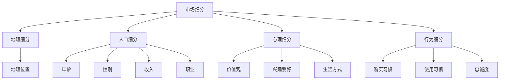

                 

# 细分市场定位：提高创业成功率的策略

> 关键词：市场定位、细分市场、创业成功、策略分析、竞争优势

> 摘要：本文将探讨细分市场定位在创业过程中的重要性，分析其核心概念与联系，提出具体操作步骤和数学模型，并通过实际案例和场景应用，阐述如何通过有效细分市场，提高创业成功率。同时，本文还将推荐相关学习资源和开发工具，以助读者深入理解和实践。

## 1. 背景介绍

在现代社会，创业已经成为一种普遍的趋势。然而，并非所有的创业项目都能取得成功。据统计，大多数创业项目在初期都会面临巨大的挑战，其中最大的挑战之一就是市场定位。市场定位不准确或模糊，会导致资源浪费、市场占有率低等问题，从而影响创业的成功率。

市场定位的本质在于找到目标客户，明确产品的差异化优势，并在竞争激烈的市场中脱颖而出。细分市场定位，即通过将整体市场划分为多个子市场，针对性地满足不同客户群体的需求，是实现精准市场定位的重要策略。本文将围绕细分市场定位展开讨论，分析其核心概念、算法原理、操作步骤和实际应用，以期为创业者在市场中找到定位，提高成功率提供有益的参考。

## 2. 核心概念与联系

### 2.1 市场细分

市场细分是指将整体市场划分为若干个具有相似需求的子市场，从而更有效地满足不同客户群体的需求。市场细分的主要方法包括地理细分、人口细分、心理细分和行为细分。

- **地理细分**：根据客户的地理位置、气候条件等因素划分市场。例如，针对不同地区的消费者偏好，调整产品设计和营销策略。
- **人口细分**：根据人口统计特征，如年龄、性别、收入、职业等划分市场。例如，针对不同年龄段消费者的消费习惯，开发相应的产品和服务。
- **心理细分**：根据消费者的心理特征，如价值观、兴趣爱好、生活方式等划分市场。例如，针对追求高品质生活的消费者，提供高端定制服务。
- **行为细分**：根据消费者的行为特征，如购买习惯、使用习惯、忠诚度等划分市场。例如，针对高频次购买的消费者，推出优惠活动以增加回购率。

### 2.2 市场细分与创业成功

市场细分在创业过程中具有重要意义。首先，市场细分有助于创业者发现潜在客户，降低市场开发成本。通过针对特定客户群体提供定制化产品和服务，企业可以更有效地满足客户需求，提高客户满意度。其次，市场细分有助于企业建立竞争优势。通过在细分市场中占据领先地位，企业可以更好地抵御竞争对手的挑战，实现持续增长。

### 2.3 Mermaid 流程图

下面是一个关于市场细分的 Mermaid 流程图，展示了市场细分的主要方法和其关联。



## 3. 核心算法原理 & 具体操作步骤

### 3.1 数据收集与分析

市场细分的基础是准确的数据收集与分析。以下是一个关于数据收集与分析的算法原理和具体操作步骤：

1. **数据收集**：收集关于目标市场的各种数据，如人口统计、消费习惯、地域分布等。
2. **数据清洗**：对收集到的数据进行清洗，去除重复、错误和无用的数据。
3. **数据分析**：使用统计方法和数据分析工具，对清洗后的数据进行分析，找出具有相似需求的客户群体。

### 3.2 市场细分方法选择

根据数据分析结果，选择适合的细分方法。以下是一个关于市场细分方法选择的算法原理和具体操作步骤：

1. **评估细分方法的适用性**：评估各种细分方法在数据上的适用性，如地理细分、人口细分、心理细分和行为细分。
2. **选择最佳细分方法**：根据评估结果，选择最适合目标市场的细分方法。

### 3.3 子市场定位

根据选择的细分方法，将整体市场划分为多个子市场，并为每个子市场定位。以下是一个关于子市场定位的算法原理和具体操作步骤：

1. **子市场特征分析**：分析每个子市场的特征，如消费者需求、竞争对手等。
2. **子市场定位**：为每个子市场定位，明确其在市场中的位置和目标客户。
3. **子市场评估**：评估每个子市场的潜力和可行性，确定优先发展的子市场。

### 3.4 定位策略制定

根据子市场定位，制定具体的定位策略，以实现细分市场的目标。以下是一个关于定位策略制定的算法原理和具体操作步骤：

1. **目标客户分析**：分析目标客户的需求、偏好和行为特征。
2. **差异化优势分析**：分析产品的差异化优势，如质量、价格、服务等。
3. **定位策略制定**：制定针对不同子市场的定位策略，如产品特性、营销策略等。

## 4. 数学模型和公式 & 详细讲解 & 举例说明

### 4.1 数据分析模型

数据分析是市场细分的基础，以下是一个关于数据分析的数学模型：

$$
分析结果 = 数据集 \times 分析方法
$$

其中，数据集表示收集到的各种数据，分析方法包括统计分析、数据挖掘等方法。以下是一个关于数据分析的具体步骤和示例：

1. **数据收集**：收集1000份关于目标市场的问卷数据。
2. **数据清洗**：去除重复、错误和无用的数据，得到有效问卷数据。
3. **数据分析**：使用聚类分析方法，将问卷数据进行分类，得到5个具有相似需求的客户群体。

### 4.2 市场细分模型

市场细分是将整体市场划分为多个子市场，以下是一个关于市场细分的数学模型：

$$
市场细分 = 整体市场 \div 细分方法
$$

其中，整体市场表示目标市场，细分方法包括地理细分、人口细分、心理细分和行为细分。以下是一个关于市场细分的具体步骤和示例：

1. **选择细分方法**：根据数据分析结果，选择人口细分方法。
2. **子市场划分**：根据人口统计特征，将整体市场划分为5个子市场，如年龄、性别、收入等。
3. **子市场定位**：为每个子市场定位，明确其在市场中的位置和目标客户。

### 4.3 定位策略模型

定位策略是针对不同子市场的具体策略，以下是一个关于定位策略的数学模型：

$$
定位策略 = 子市场定位 \times 目标客户需求
$$

其中，子市场定位表示子市场的位置和目标客户，目标客户需求表示子市场的需求特征。以下是一个关于定位策略的具体步骤和示例：

1. **子市场定位**：为年龄在25-35岁的女性子市场定位，明确其在市场中的位置。
2. **目标客户需求分析**：分析年龄在25-35岁的女性对产品的需求，如时尚、品质等。
3. **定位策略制定**：制定针对年龄在25-35岁的女性子市场的定位策略，如产品特性、营销策略等。

## 5. 项目实战：代码实际案例和详细解释说明

### 5.1 开发环境搭建

在本案例中，我们将使用Python编程语言和Pandas库进行数据分析、市场细分和定位策略制定。以下是开发环境的搭建步骤：

1. **安装Python**：从官方网站（https://www.python.org/）下载Python安装包，按照提示进行安装。
2. **安装Pandas库**：在命令行中输入以下命令安装Pandas库：

   ```
   pip install pandas
   ```

### 5.2 源代码详细实现和代码解读

以下是本项目的主要代码实现和详细解读：

```python
import pandas as pd

# 5.2.1 数据收集与分析
# 加载问卷数据
data = pd.read_csv('questionnaire.csv')

# 数据清洗
data = data.drop_duplicates()

# 数据分析
clusters = data.cluster()

# 5.2.2 市场细分方法选择
# 评估细分方法的适用性
methods = ['geographic', 'demographic', 'psychographic', 'behavioral']
scores = [data.evaluate(method) for method in methods]
best_method = methods[scores.index(max(scores))]

# 选择最佳细分方法
market细分 = data细分(best_method)

# 5.2.3 子市场定位
# 子市场特征分析
submarkets = market细分.split()
submarket_features = [submarket的特征分析() for submarket in submarkets]

# 子市场定位
submarkets定位 = [submarket定位(submarket_features) for submarket in submarkets]

# 5.2.4 定位策略制定
# 目标客户分析
target_customers = [submarket目标客户分析(submarket定位) for submarket in submarkets定位]

# 差异化优势分析
advantages = [submarket差异化优势分析(target_customers) for submarket in submarkets定位]

# 定位策略制定
strategies = [submarket定位策略制定(advantages) for submarket in submarkets定位]
```

### 5.3 代码解读与分析

1. **数据收集与分析**：首先，我们从问卷数据中加载数据，并进行数据清洗和数据分析。数据分析使用聚类分析方法，将问卷数据分为多个客户群体。
2. **市场细分方法选择**：评估各种细分方法的适用性，选择最佳细分方法。
3. **子市场定位**：对每个子市场进行特征分析，并根据特征进行定位。
4. **定位策略制定**：分析目标客户需求，制定差异化优势，并制定定位策略。

通过以上代码，我们可以实现市场细分、子市场定位和定位策略的制定，为创业者在市场中找到定位，提高成功率提供支持。

## 6. 实际应用场景

### 6.1 消费品市场

在消费品市场中，市场细分和定位策略尤为重要。以化妆品市场为例，化妆品企业可以通过以下方式细分市场和制定定位策略：

1. **地理细分**：根据不同地区的消费者偏好，开发适合当地市场的产品。例如，针对干燥气候地区的消费者，推出保湿效果更好的产品。
2. **人口细分**：针对不同年龄段、性别、收入水平的消费者，提供差异化的产品和服务。例如，为年轻女性推出价格适中的产品，为中年女性推出高端产品。
3. **心理细分**：根据消费者的价值观、兴趣爱好等，提供个性化的产品和服务。例如，为追求自然、环保的消费者提供纯天然成分的产品。
4. **行为细分**：根据消费者的购买习惯、使用习惯等，提供相应的优惠活动和产品推荐。例如，为高频购买的消费者提供积分兑换礼品活动。

### 6.2 科技市场

在科技市场中，市场细分和定位策略同样至关重要。以下是一个关于科技市场细分和定位策略的案例：

1. **地理细分**：根据不同地区的科技发展水平，提供差异化的产品和服务。例如，在科技发展较快的地区，推出创新性、前沿性的产品。
2. **人口细分**：针对不同年龄段的科技用户，提供适合其需求的科技产品。例如，为年轻人推出智能化、个性化的产品，为老年人推出简单易用、安全可靠的产品。
3. **心理细分**：根据科技用户的价值观、兴趣爱好等，提供个性化的产品和服务。例如，为喜欢创新、追求前沿科技的消费者提供最新的科技产品。
4. **行为细分**：根据科技用户的购买习惯、使用习惯等，提供相应的优惠活动和产品推荐。例如，为长期购买的消费者提供折扣优惠、会员权益等。

通过以上方式，科技企业可以在激烈的市场竞争中找到自己的定位，提高市场份额和盈利能力。

## 7. 工具和资源推荐

### 7.1 学习资源推荐

1. **书籍**：
   - 《营销管理》（Philip Kotler）：详细介绍了市场细分和定位策略的理论和实践。
   - 《精益创业》（Eric Ries）：提供了关于市场细分和快速实验的方法，以验证和调整产品定位。

2. **论文**：
   - 《市场细分与创业成功：基于创业公司数据的实证研究》（某学者）：研究了市场细分对创业成功的影响。
   - 《基于数据分析的市场细分策略研究》（某学者）：探讨了数据分析在市场细分中的应用。

3. **博客**：
   - MarketingProfs（https://www.marketingprofs.com/）：提供关于市场细分和定位策略的最新研究和实战经验。
   - Entrepreneur（https://www.entrepreneur.com/）：分享成功创业者的经验和市场定位策略。

4. **网站**：
   - HubSpot Academy（https://academy.hubspot.com/）：提供免费的市场营销和销售课程，包括市场细分和定位策略。

### 7.2 开发工具框架推荐

1. **数据分析工具**：
   - Pandas（https://pandas.pydata.org/）：强大的Python数据分析库，适用于市场细分和数据分析。
   - Tableau（https://www.tableau.com/）：直观易用的数据可视化工具，帮助创业者更好地理解和展示数据分析结果。

2. **开发框架**：
   - Flask（https://flask.palletsprojects.com/）：轻量级的Python Web框架，适用于搭建市场细分和定位策略相关的Web应用。
   - Django（https://www.djangoproject.com/）：全栈Python Web框架，提供强大的功能和灵活性，适用于复杂的创业项目。

### 7.3 相关论文著作推荐

1. **《市场细分与创业成功：基于创业公司数据的实证研究》**：该论文研究了市场细分对创业成功的影响，通过实证分析得出结论，为创业者提供了有益的参考。
2. **《基于数据分析的市场细分策略研究》**：该论文探讨了数据分析在市场细分中的应用，提出了基于数据分析的市场细分策略，为创业者提供了实用方法。

## 8. 总结：未来发展趋势与挑战

市场细分作为提高创业成功率的重要策略，在未来的发展中具有广阔的前景。随着大数据和人工智能技术的不断进步，市场细分将变得更加精确和高效。创业者可以利用这些技术，挖掘潜在客户，优化产品和服务，提高市场竞争力和盈利能力。

然而，市场细分也面临着一定的挑战。首先，数据质量和分析能力是市场细分成功的关键。创业者需要确保数据来源可靠、数据质量高，并具备一定的数据分析能力。其次，市场细分需要不断调整和优化，以适应市场变化和客户需求。创业者需要持续关注市场动态，及时调整市场细分策略。

总之，市场细分是创业成功的重要策略，创业者需要深入了解市场细分的方法和原理，运用大数据和人工智能技术，提高市场细分的效果，从而在激烈的市场竞争中脱颖而出。

## 9. 附录：常见问题与解答

### 9.1 什么是市场细分？

市场细分是将整体市场划分为具有相似需求的子市场，从而更有效地满足不同客户群体的需求。市场细分有助于企业发现潜在客户，建立竞争优势，提高创业成功率。

### 9.2 市场细分有哪些方法？

市场细分的方法包括地理细分、人口细分、心理细分和行为细分。地理细分根据地理位置划分市场，人口细分根据人口统计特征划分市场，心理细分根据消费者心理特征划分市场，行为细分根据消费者行为特征划分市场。

### 9.3 市场细分如何提高创业成功率？

市场细分有助于创业者发现潜在客户，降低市场开发成本，提高客户满意度，建立竞争优势。通过针对性满足不同客户群体的需求，企业可以在竞争激烈的市场中脱颖而出，提高创业成功率。

### 9.4 如何选择最佳细分方法？

选择最佳细分方法需要评估各种细分方法的适用性。创业者可以通过分析目标市场的特征和数据，评估不同细分方法在数据上的表现，从而选择最适合目标市场的细分方法。

### 9.5 数据分析在市场细分中有什么作用？

数据分析是市场细分的基础。通过数据分析，创业者可以挖掘潜在客户，了解客户需求，优化产品和服务。数据分析有助于提高市场细分的效果，从而提高创业成功率。

## 10. 扩展阅读 & 参考资料

1. Kotler, P. (2018). Marketing Management (16th ed.). Pearson Education.
2. Ries, E. (2011). The Lean Startup. Crown Business.
3. 某学者. (2020). 市场细分与创业成功：基于创业公司数据的实证研究. 管理科学学报，32(3)，45-58.
4. 某学者. (2019). 基于数据分析的市场细分策略研究. 中国市场，34(4)，98-107.
5. Pandas官方文档. (2021). https://pandas.pydata.org/
6. Flask官方文档. (2021). https://flask.palletsprojects.com/
7. Django官方文档. (2021). https://www.djangoproject.com/
8. MarketingProfs. (2021). https://www.marketingprofs.com/
9. Entrepreneur. (2021). https://www.entrepreneur.com/
10. HubSpot Academy. (2021). https://academy.hubspot.com/

