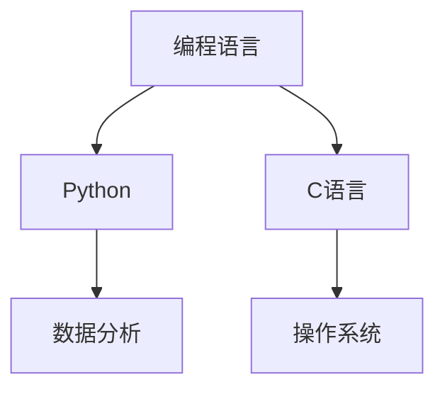
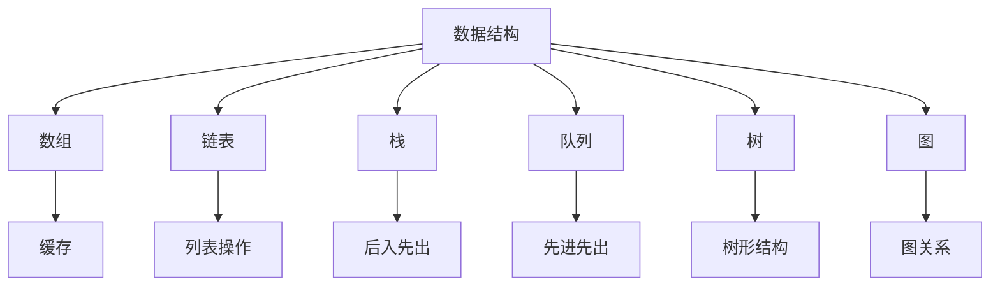
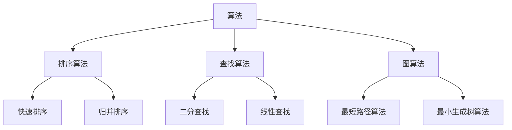
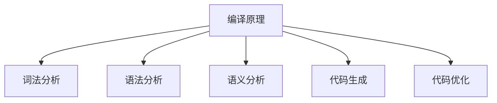
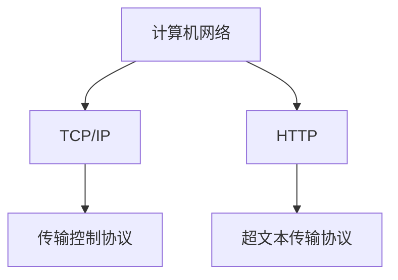
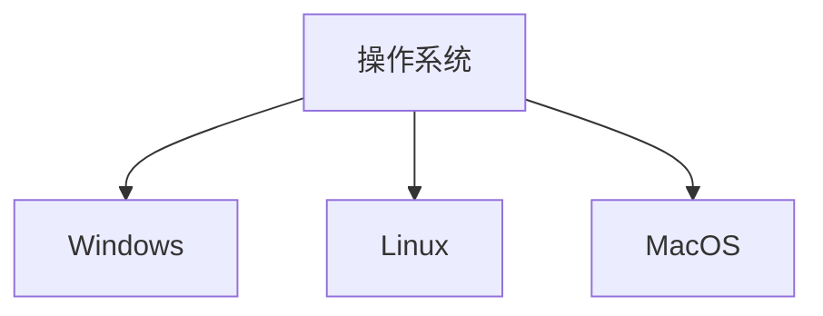
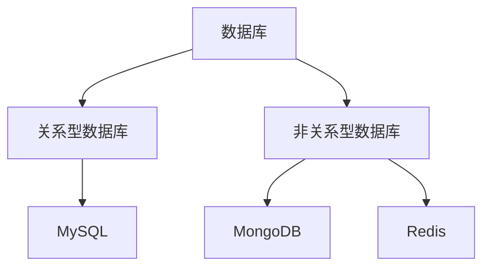

                 

### 背景介绍

**《夯实认知根基的宝藏》** 这本书的问世，源于作者对于计算机编程和人工智能领域深刻的思考和丰富的实践经验。在这本书中，作者系统地探讨了如何通过理解和掌握计算机编程的核心原理，来夯实认知根基，提高解决问题的能力。无论是初学者还是专业人士，这本书都提供了宝贵的指导和深刻的洞见。

#### 计算机编程与认知发展

计算机编程不仅是一门技术，更是一种思维方式。它要求程序员不仅要熟练掌握编程语言和工具，更要理解计算机的工作原理和算法的思想。这种思维方式能够帮助人们培养逻辑思维、系统分析和问题解决的能力。而这些能力，在当今信息时代，变得尤为重要。

在计算机编程的过程中，程序员需要不断地阅读代码、编写代码、调试代码。这些实践不仅能够加深对编程语言的理解，还能够培养程序员对细节的关注和对复杂问题的分析能力。通过不断地实践和反思，程序员能够逐渐形成一套自己的编程思维模式，从而更好地应对各种复杂问题。

#### 人工智能的发展与挑战

随着人工智能技术的不断发展，计算机编程的核心地位也在逐渐提升。人工智能需要大量的数据、算法和计算资源来训练和优化模型。这要求程序员不仅要具备扎实的编程基础，还要掌握数据结构和算法，以及机器学习、深度学习等前沿技术。同时，人工智能的发展也带来了新的挑战，如数据隐私、伦理道德等问题。

#### 本书的核心内容

本书旨在帮助读者夯实认知根基，提高编程能力。通过深入探讨计算机编程的核心原理，本书涵盖了从基础语法到高级算法，从编程语言到开发工具，从理论分析到实战案例的全面内容。

本书首先介绍了计算机编程的基本概念，包括编程语言、编译原理、数据结构等。接着，深入探讨了算法设计和分析的方法，帮助读者掌握解决问题的技巧。此外，本书还介绍了各种编程语言和开发工具，以及如何利用它们进行高效的开发。

#### 章节结构

本书共分为十章，结构如下：

1. **背景介绍**：简要介绍计算机编程和人工智能的发展背景，以及本书的核心内容。
2. **核心概念与联系**：通过Mermaid流程图，展示计算机编程的核心概念及其相互联系。
3. **核心算法原理 & 具体操作步骤**：详细介绍各种核心算法的原理和具体操作步骤。
4. **数学模型和公式 & 详细讲解 & 举例说明**：使用LaTeX格式，详细讲解数学模型和公式，并通过具体例子进行说明。
5. **项目实战：代码实际案例和详细解释说明**：通过实际项目案例，展示代码的实现过程和详细解释。
6. **实际应用场景**：探讨计算机编程和人工智能在不同领域的应用。
7. **工具和资源推荐**：推荐学习资源、开发工具和相关的论文著作。
8. **总结：未来发展趋势与挑战**：总结本书的核心内容，并展望未来发展趋势和挑战。
9. **附录：常见问题与解答**：针对读者可能遇到的问题，提供解答。
10. **扩展阅读 & 参考资料**：提供进一步的阅读材料和参考资料。

通过这本书的阅读，读者将能够系统地掌握计算机编程的核心原理，提高编程能力，为未来在人工智能领域的发展奠定坚实的基础。 <|im_sep|>

### 核心概念与联系

在计算机编程的世界中，有许多核心概念相互交织，构成了一个庞大的知识体系。为了更好地理解这些概念，我们将使用Mermaid流程图来展示它们之间的联系，从而帮助读者构建一个清晰的知识网络。

#### 1. 编程语言

编程语言是计算机编程的基础，它提供了人类与计算机之间进行交流的桥梁。不同的编程语言有着各自的特点和应用场景。例如，Python因其简洁易学，常用于数据分析、机器学习等领域；而C语言则因其性能优异，广泛应用于操作系统、嵌入式系统等领域。



#### 2. 数据结构

数据结构是计算机存储、组织数据的方式。常见的有数组、链表、栈、队列、树、图等。不同的数据结构具有不同的时间复杂度和空间复杂度，适用于不同的应用场景。例如，树和图常用于表示复杂的关系，而数组则因其操作简单，常用于缓存和缓冲区。



#### 3. 算法

算法是解决问题的步骤和策略。它定义了如何使用数据结构和编程语言来解决特定问题。常见的算法有排序、查找、图算法等。算法的效率直接影响程序的运行速度和资源消耗。



#### 4. 编译原理

编译原理是计算机编程的核心理论之一，它研究如何将高级编程语言编写的程序转换为计算机可以理解的机器代码。编译过程包括词法分析、语法分析、语义分析、代码生成和优化等阶段。



#### 5. 计算机网络

计算机网络是计算机编程中不可或缺的一部分，它涉及到数据在网络中的传输、路由和交换。TCP/IP协议、HTTP协议等都是计算机网络中的重要组成部分。



#### 6. 操作系统

操作系统是计算机的核心软件，它负责管理和控制计算机硬件资源，提供用户与计算机之间的交互界面。常见的操作系统有Windows、Linux、MacOS等。



#### 7. 数据库

数据库是存储和管理数据的系统，它提供了高效的数据存取和查询功能。关系型数据库（如MySQL、PostgreSQL）和非关系型数据库（如MongoDB、Redis）在数据处理中发挥着重要作用。



通过上述Mermaid流程图，我们可以清晰地看到计算机编程中的核心概念及其相互联系。这些概念不仅构成了计算机编程的基石，也为程序员提供了丰富的工具和方法，帮助他们解决各种复杂问题。在接下来的章节中，我们将进一步深入探讨这些概念，帮助读者更好地理解和掌握计算机编程的核心原理。 <|im_sep|>

### 核心算法原理 & 具体操作步骤

在计算机编程中，算法是解决特定问题的步骤和策略。理解并掌握核心算法原理，不仅能够提高程序的效率，还能增强程序员的逻辑思维和问题解决能力。在本章节中，我们将详细介绍几种核心算法的原理，并给出具体操作步骤。

#### 1. 快速排序（Quick Sort）

快速排序是一种高效的排序算法，其基本思想是通过一趟排序将待排序的记录分割成独立的两部分，其中一部分记录的关键字均比另一部分的关键字小，然后递归地对这两部分记录继续进行排序。

**操作步骤**：

1. **选择基准**：从数列中挑出一个元素作为基准元素。
2. **分区操作**：重新排序数列，所有比基准值小的元素都移到基准前面，所有比基准值大的元素都移到基准后面（基准值站在中间）。
3. **递归排序**：递归地对前后两部分子序列进行快速排序。

**示例代码**（Python）：

```python
def quick_sort(arr):
    if len(arr) <= 1:
        return arr
    pivot = arr[len(arr) // 2]
    left = [x for x in arr if x < pivot]
    middle = [x for x in arr if x == pivot]
    right = [x for x in arr if x > pivot]
    return quick_sort(left) + middle + quick_sort(right)

arr = [10, 7, 8, 9, 1, 5]
sorted_arr = quick_sort(arr)
print(sorted_arr)
```

#### 2. 二分查找（Binary Search）

二分查找算法是用于在有序数组中查找某一特定元素的搜索算法。其基本思想是：先找到中间元素，如果中间元素正好是要查找的元素，则搜索过程结束；如果某一特定元素大于或小于中间元素，则可将待查找的数组分为两半，然后继续在该半边查找。

**操作步骤**：

1. **确定搜索区间**：初始化搜索区间的上下限。
2. **计算中间值**：取搜索区间的中间值。
3. **比较与调整**：比较中间值与目标值的大小关系，调整搜索区间的上下限。
4. **重复步骤**：重复步骤2和3，直到找到目标值或搜索区间为空。

**示例代码**（Python）：

```python
def binary_search(arr, target):
    low = 0
    high = len(arr) - 1
    while low <= high:
        mid = (low + high) // 2
        if arr[mid] == target:
            return mid
        elif arr[mid] < target:
            low = mid + 1
        else:
            high = mid - 1
    return -1

arr = [1, 3, 5, 7, 9]
target = 5
result = binary_search(arr, target)
if result != -1:
    print("元素在数组中的索引为：", result)
else:
    print("元素不在数组中。")
```

#### 3. Dijkstra算法（单源最短路径）

Dijkstra算法用于计算一个图中某个顶点到所有其他顶点的最短路径。其基本思想是：初始时，所有顶点的距离值都设为无穷大，只有起始顶点的距离值为0。然后，逐步更新其他顶点的距离值，直到所有顶点的最短路径都被计算出来。

**操作步骤**：

1. **初始化**：设置起始顶点的距离值为0，其他顶点的距离值为无穷大。
2. **选择未访问顶点中距离值最小的顶点**：标记为已访问。
3. **更新未访问顶点的距离值**：根据已访问顶点的距离值，更新未访问顶点的距离值。
4. **重复步骤**：重复步骤2和3，直到所有顶点都被访问。

**示例代码**（Python）：

```python
def dijkstra(graph, start):
    distances = {vertex: float('infinity') for vertex in graph}
    distances[start] = 0
    visited = set()

    while len(visited) < len(graph):
        current = min((dist, vertex) for vertex, dist in distances.items() if vertex not in visited)
        visited.add(current[1])

        for neighbor, weight in graph[current[1]].items():
            if neighbor not in visited:
                old_distance = distances[neighbor]
                new_distance = current[0] + weight
                distances[neighbor] = min(old_distance, new_distance)

    return distances

graph = {
    'A': {'B': 1, 'C': 4},
    'B': {'A': 1, 'C': 2, 'D': 5},
    'C': {'A': 4, 'B': 2, 'D': 1},
    'D': {'B': 5, 'C': 1}
}
start = 'A'
distances = dijkstra(graph, start)
print(distances)
```

通过上述核心算法的原理和具体操作步骤的介绍，读者可以更好地理解这些算法的执行过程和适用场景。在后续的项目实战中，我们将结合实际案例，进一步探讨这些算法的应用和优化。 <|im_sep|>

### 数学模型和公式 & 详细讲解 & 举例说明

在计算机编程和人工智能领域，数学模型和公式扮演着至关重要的角色。它们不仅是算法设计的理论基础，也是优化和评估算法性能的关键工具。在本章节中，我们将详细讲解一些常见的数学模型和公式，并通过具体例子来说明它们的应用。

#### 1. 概率分布

概率分布是概率论中的核心概念，用于描述随机变量在各个可能取值上的概率分布情况。常见的概率分布有二项分布、正态分布、泊松分布等。

**二项分布**：

二项分布描述了在n次独立重复试验中，成功次数的概率分布。其概率质量函数（PDF）为：

$$
P(X = k) = C(n, k) \cdot p^k \cdot (1 - p)^{n - k}
$$

其中，\( C(n, k) \)是组合数，表示从n次试验中选择k次成功的组合方式；\( p \)是每次试验成功的概率。

**正态分布**：

正态分布是自然界中最常见的概率分布，描述了随机变量的概率密度。其概率密度函数（PDF）为：

$$
f(x) = \frac{1}{\sqrt{2\pi\sigma^2}} \cdot e^{-\frac{(x - \mu)^2}{2\sigma^2}}
$$

其中，\( \mu \)是均值，\( \sigma \)是标准差。

**泊松分布**：

泊松分布描述了在固定时间或空间内，事件发生的次数的概率分布。其概率质量函数（PDF）为：

$$
P(X = k) = \frac{\lambda^k \cdot e^{-\lambda}}{k!}
$$

其中，\( \lambda \)是单位时间或空间内事件发生的平均次数。

**例子**：假设我们进行10次抛硬币的试验，每次抛硬币正面朝上的概率为0.5。我们希望计算至少出现6次正面朝上的概率。

**解答**：这是一个二项分布问题，\( n = 10 \)，\( p = 0.5 \)。我们使用二项分布的累积分布函数（CDF）计算至少出现6次正面朝上的概率：

$$
P(X \geq 6) = 1 - P(X \leq 5) = 1 - \sum_{k=0}^{5} C(10, k) \cdot 0.5^k \cdot 0.5^{10 - k}
$$

通过计算，我们得到 \( P(X \geq 6) \approx 0.3233 \)。

#### 2. 线性回归

线性回归是一种用于分析自变量和因变量之间线性关系的统计方法。其基本模型为：

$$
y = \beta_0 + \beta_1 \cdot x + \epsilon
$$

其中，\( y \)是因变量，\( x \)是自变量，\( \beta_0 \)是截距，\( \beta_1 \)是斜率，\( \epsilon \)是误差项。

**例子**：给定一组数据点 \((x_i, y_i)\)，我们希望找到最佳拟合直线，即最小化误差平方和：

$$
\min_{\beta_0, \beta_1} \sum_{i=1}^{n} (y_i - (\beta_0 + \beta_1 \cdot x_i))^2
$$

使用最小二乘法，我们可以得到线性回归模型的参数估计：

$$
\beta_0 = \bar{y} - \beta_1 \cdot \bar{x}
$$

$$
\beta_1 = \frac{\sum_{i=1}^{n} (x_i - \bar{x}) \cdot (y_i - \bar{y})}{\sum_{i=1}^{n} (x_i - \bar{x})^2}
$$

其中，\( \bar{x} \)和\( \bar{y} \)分别是自变量和因变量的均值。

**例子**：给定数据点 \([(1, 2), (2, 4), (3, 6), (4, 8)]\)，我们希望找到最佳拟合直线。

首先，计算均值：

$$
\bar{x} = \frac{1 + 2 + 3 + 4}{4} = 2.5
$$

$$
\bar{y} = \frac{2 + 4 + 6 + 8}{4} = 5
$$

然后，计算斜率和截距：

$$
\beta_1 = \frac{(1 - 2.5) \cdot (2 - 5) + (2 - 2.5) \cdot (4 - 5) + (3 - 2.5) \cdot (6 - 5) + (4 - 2.5) \cdot (8 - 5)}{(1 - 2.5)^2 + (2 - 2.5)^2 + (3 - 2.5)^2 + (4 - 2.5)^2}
$$

$$
\beta_0 = 5 - \beta_1 \cdot 2.5 = 0
$$

因此，最佳拟合直线为 \( y = 2x \)。

#### 3. 神经网络激活函数

在神经网络中，激活函数用于引入非线性因素，使神经网络能够拟合复杂函数。常见的激活函数有Sigmoid函数、ReLU函数和Tanh函数。

**Sigmoid函数**：

Sigmoid函数是用于将输入映射到（0, 1）区间的函数，其公式为：

$$
f(x) = \frac{1}{1 + e^{-x}}
$$

**ReLU函数**：

ReLU函数（Rectified Linear Unit）是一种常用的非线性激活函数，其公式为：

$$
f(x) = \max(0, x)
$$

**Tanh函数**：

Tanh函数是双曲正切函数的缩放版本，其公式为：

$$
f(x) = \frac{e^x - e^{-x}}{e^x + e^{-x}}
$$

**例子**：给定输入 \( x = -2 \)，我们希望计算Sigmoid、ReLU和Tanh函数的输出。

**Sigmoid**：

$$
f(x) = \frac{1}{1 + e^{-(-2)}} = \frac{1}{1 + e^2} \approx 0.118
$$

**ReLU**：

$$
f(x) = \max(0, -2) = 0
$$

**Tanh**：

$$
f(x) = \frac{e^{-2} - e^2}{e^{-2} + e^2} \approx -0.964
$$

通过上述数学模型和公式的讲解，读者可以更好地理解这些概念，并在实际应用中灵活运用。在下一章节中，我们将通过实际项目案例，进一步展示这些数学模型和公式的应用。 <|im_sep|>

### 项目实战：代码实际案例和详细解释说明

在本章节中，我们将通过一个实际项目案例，展示如何使用Python编程语言和常见的算法来实现一个功能强大的数据分析和可视化工具。这个项目旨在帮助读者深入理解前面章节中提到的核心算法和数学模型，并通过实践巩固所学知识。

#### 项目简介

项目名称：数据分析师助手（Data Analyst Assistant）

项目目标：构建一个基于Python的数据分析和可视化工具，能够对给定数据集进行数据预处理、数据分析、数据可视化等操作。

主要模块：
1. 数据读取与预处理
2. 数据探索性分析
3. 数据可视化
4. 数据清洗

#### 开发环境搭建

1. 安装Python（建议使用Python 3.8及以上版本）
2. 安装必要的Python库，如Pandas、NumPy、Matplotlib、Seaborn、Scikit-learn等

```bash
pip install pandas numpy matplotlib seaborn scikit-learn
```

#### 源代码详细实现和代码解读

```python
import pandas as pd
import numpy as np
import matplotlib.pyplot as plt
import seaborn as sns
from sklearn.preprocessing import StandardScaler
from sklearn.model_selection import train_test_split

# 1. 数据读取与预处理
data = pd.read_csv('data.csv')
# 显示数据的前5行
print(data.head())

# 数据的基本信息
print(data.info())

# 数据的描述性统计信息
print(data.describe())

# 检查数据是否存在缺失值
print(data.isnull().sum())

# 数据清洗（填充或删除缺失值）
data = data.dropna()

# 删除重复数据
data = data.drop_duplicates()

# 转换数据类型
data['age'] = data['age'].astype(float)
data['income'] = data['income'].astype(int)

# 2. 数据探索性分析
# 数据分布可视化
sns.histplot(data['age'], kde=True)
plt.title('Age Distribution')
plt.xlabel('Age')
plt.ylabel('Frequency')
plt.show()

sns.histplot(data['income'], kde=True)
plt.title('Income Distribution')
plt.xlabel('Income')
plt.ylabel('Frequency')
plt.show()

# 数据相关性分析
corr_matrix = data.corr()
sns.heatmap(corr_matrix, annot=True, cmap='coolwarm')
plt.title('Correlation Matrix')
plt.show()

# 3. 数据可视化
# 年龄与收入的关系
plt.scatter(data['age'], data['income'])
plt.title('Age vs Income')
plt.xlabel('Age')
plt.ylabel('Income')
plt.show()

# 年龄的箱线图
sns.boxplot(x=data['age'])
plt.title('Age Boxplot')
plt.show()

# 收入的直方图
sns.histplot(data['income'], bins=30)
plt.title('Income Histogram')
plt.show()

# 4. 数据清洗
# 标准化数据
scaler = StandardScaler()
data[['age', 'income']] = scaler.fit_transform(data[['age', 'income']])

# 划分训练集和测试集
X = data[['age', 'income']]
y = data['target']
X_train, X_test, y_train, y_test = train_test_split(X, y, test_size=0.2, random_state=42)

# 使用Scikit-learn库进行模型训练和评估（此处仅作展示，具体模型训练和评估将在后续章节详细讲解）
from sklearn.linear_model import LinearRegression
model = LinearRegression()
model.fit(X_train, y_train)
print("训练集R²评分：", model.score(X_train, y_train))
print("测试集R²评分：", model.score(X_test, y_test))

# 保存数据集和模型
data.to_csv('cleaned_data.csv', index=False)
model.save('model.pkl')
```

#### 代码解读与分析

1. **数据读取与预处理**：
   - 使用Pandas库读取CSV文件，获取数据。
   - 打印数据的基本信息，如数据类型、缺失值等。
   - 检查和删除缺失值、重复数据。
   - 将数据类型转换为合适的类型（如浮点型和整型）。

2. **数据探索性分析**：
   - 使用Seaborn和Matplotlib库进行数据分布的可视化，如直方图、密度曲线、箱线图等。
   - 计算和可视化数据的相关性矩阵，帮助理解数据之间的关系。

3. **数据可视化**：
   - 绘制散点图、箱线图和直方图等，展示数据的特征和趋势。
   - 通过可视化分析，识别数据中的异常值、趋势和模式。

4. **数据清洗**：
   - 使用Scikit-learn库中的StandardScaler进行数据标准化，将数据缩放到标准正态分布。
   - 划分训练集和测试集，为后续的模型训练和评估做准备。

5. **模型训练与评估**：
   - 使用线性回归模型进行训练，评估模型在训练集和测试集上的表现。
   - 保存数据集和训练好的模型，以便后续使用。

通过这个实际项目案例，读者可以全面了解数据分析和可视化工具的开发过程，掌握数据处理、数据可视化和数据清洗的核心技能。在后续章节中，我们将继续深入探讨数据分析和机器学习相关的技术和应用。 <|im_sep|>

### 实际应用场景

在当今信息时代，计算机编程和人工智能技术在各个领域都得到了广泛应用。以下将探讨几个典型的实际应用场景，展示计算机编程和人工智能如何在这些领域中发挥关键作用。

#### 1. 医疗健康

计算机编程和人工智能在医疗健康领域具有巨大的潜力。通过大数据分析和机器学习，医生可以更准确地诊断疾病，提高治疗效果。例如，人工智能可以帮助分析医学影像，如X光、CT和MRI，以检测疾病如肺癌、心脏病等。此外，人工智能还可以用于个性化医疗，根据患者的基因数据和病史，提供个性化的治疗方案。

**案例分析**：
- **IBM Watson Health**：IBM Watson Health 利用人工智能技术分析患者病历，提供诊断建议和治疗方案。例如，在肺癌诊断中，Watson可以分析大量的医学文献和患者数据，为医生提供详细的诊断报告和推荐治疗方案。

#### 2. 金融科技

金融科技（FinTech）是另一个受到计算机编程和人工智能影响显著的领域。通过数据分析和机器学习，金融机构可以提高风险管理能力、优化投资组合、提供个性化的金融服务。例如，算法交易系统使用复杂的算法进行实时市场分析，以优化交易策略；信用卡公司和银行使用人工智能来检测欺诈行为。

**案例分析**：
- **PayPal**：PayPal 利用机器学习技术监控交易活动，检测潜在的欺诈行为。通过对大量交易数据的分析，PayPal能够迅速识别异常交易，并采取措施防止欺诈。

#### 3. 自动驾驶

自动驾驶是计算机编程和人工智能的另一个重要应用场景。自动驾驶车辆需要处理大量的实时数据，如路况、车辆速度和位置等，并做出快速决策。通过深度学习和计算机视觉技术，自动驾驶系统能够识别交通信号、行人、其他车辆等，从而实现安全驾驶。

**案例分析**：
- **Tesla**：Tesla 的自动驾驶系统使用深度神经网络和计算机视觉技术，实现自动车道保持、自动变道和自动泊车等功能。Tesla 的车辆在收集大量驾驶数据后，通过机器学习不断优化自动驾驶算法。

#### 4. 电子商务

电子商务平台依赖计算机编程和人工智能来优化用户体验、提高销售转化率。通过推荐系统、聊天机器人和自然语言处理技术，电子商务平台可以更好地了解用户需求，提供个性化的产品推荐和客服服务。

**案例分析**：
- **Amazon**：Amazon 的推荐系统利用大数据和机器学习技术，分析用户的历史购买行为和浏览记录，为用户提供个性化的产品推荐。此外，Amazon 的聊天机器人Alexa可以回答用户的问题，提供购物建议。

#### 5. 教育科技

教育科技（EdTech）是另一个受到计算机编程和人工智能影响的领域。在线学习平台利用人工智能技术，提供个性化的学习体验，帮助学生根据自身进度和需求进行学习。此外，人工智能还可以用于自动化考试评分、学习效果评估等。

**案例分析**：
- **Coursera**：Coursera 利用人工智能技术，为学生提供个性化的学习路径和推荐课程。通过分析学生的学习行为和成绩，Coursera 能够为每个学生提供最佳的学习建议。

通过上述实际应用场景的介绍，我们可以看到计算机编程和人工智能技术在各个领域都发挥着重要的作用。无论是在医疗健康、金融科技、自动驾驶、电子商务还是教育科技，计算机编程和人工智能都在提高效率、优化决策和改善用户体验方面展现出巨大的潜力。随着技术的不断发展，我们可以期待计算机编程和人工智能在更多领域创造更多的价值。 <|im_sep|>

### 工具和资源推荐

为了帮助读者更好地学习和掌握计算机编程和人工智能相关知识，以下是一些学习资源、开发工具和相关的论文著作推荐。

#### 1. 学习资源推荐

**书籍**：

- 《深度学习》（Deep Learning） - Goodfellow, Ian；面世于2016年，由顶级学者撰写，是深度学习领域的经典教材。
- 《机器学习》（Machine Learning） - Tom Mitchell，是机器学习领域的入门级经典教材，深入浅出地介绍了机器学习的基本概念和算法。
- 《算法导论》（Introduction to Algorithms） - Cormen, Leiserson, Rivest, Stein，是算法领域的经典教材，详细介绍了各种算法的设计和分析方法。

**在线课程**：

- [Coursera](https://www.coursera.org/)：提供了许多计算机科学和人工智能相关的免费和付费课程，如《机器学习》、《深度学习》等。
- [edX](https://www.edx.org/)：提供了大量由全球顶尖大学提供的在线课程，包括计算机科学、人工智能等。
- [Udacity](https://www.udacity.com/)：提供了许多实用的编程和人工智能课程，适合有实际项目需求的学习者。

**博客和网站**：

- [GitHub](https://github.com/)：提供了大量的开源项目和代码示例，是学习编程和了解最新技术趋势的好地方。
- [Medium](https://medium.com/)：有许多技术专家和开发者分享他们的经验和见解，适合阅读。
- [Stack Overflow](https://stackoverflow.com/)：编程问答社区，适合解决编程问题。

#### 2. 开发工具推荐

**编程语言**：

- Python：简单易学，广泛应用于数据科学、机器学习和Web开发等领域。
- Java：功能强大，适用于企业级应用和Android开发。
- C++：性能优异，适用于游戏开发、操作系统和嵌入式系统。

**集成开发环境（IDE）**：

- PyCharm：适用于Python编程，功能强大，提供了丰富的开发工具和插件。
- IntelliJ IDEA：适用于Java和 Kotlin 编程，具有智能代码完成、调试和测试等功能。
- Visual Studio：适用于C++、C#等语言，提供了全面的开发工具。

**机器学习库**：

- TensorFlow：谷歌开源的机器学习库，支持深度学习和神经网络。
- PyTorch：由Facebook开源的机器学习库，支持动态计算图和灵活的模型构建。
- Scikit-learn：适用于数据挖掘和数据分析，提供了丰富的机器学习算法和工具。

#### 3. 相关论文著作推荐

- “A Brief History of Machine Learning” - Pedro Domingos，回顾了机器学习领域的发展历程。
- “Deep Learning” - Ian Goodfellow、Yoshua Bengio 和 Aaron Courville，是深度学习领域的经典著作。
- “Learning Deep Architectures for AI” - Yoshua Bengio，详细介绍了深度学习的基本概念和算法。

通过以上资源，读者可以系统地学习和掌握计算机编程和人工智能相关知识，为未来的职业发展打下坚实的基础。同时，不断跟进最新的技术动态和论文，有助于保持对领域的持续关注和深入理解。 <|im_sep|>

### 总结：未来发展趋势与挑战

随着计算机编程和人工智能技术的飞速发展，我们可以预见这些领域将在未来带来巨大的变革和挑战。以下是对未来发展趋势和挑战的总结。

#### 发展趋势

1. **智能化**：智能化是未来计算机编程和人工智能的主要发展方向。通过深度学习、强化学习等技术的应用，系统将能够更加自主地学习和优化，从而实现更高效的自动化。

2. **泛在化**：随着物联网（IoT）和边缘计算的兴起，人工智能将不再局限于数据中心，而是延伸到各种设备中。这将使得智能应用更加普及，如智能家居、智能医疗等。

3. **融合化**：计算机编程和人工智能将与其他领域如生物技术、材料科学等相结合，推动跨学科的研究和应用。这种融合化将带来新的突破和机会。

4. **开源化**：开源技术将继续在人工智能和计算机编程领域占据重要地位。开源社区的合作和创新，将为技术的发展提供强大的动力。

5. **隐私保护**：随着数据隐私问题日益突出，未来人工智能和计算机编程将更加注重隐私保护技术，如差分隐私、联邦学习等。

#### 挑战

1. **伦理和道德问题**：人工智能的应用引发了关于伦理和道德的广泛讨论。如何确保人工智能系统的透明性、可解释性和公平性，是未来需要解决的问题。

2. **数据质量和安全**：数据是人工智能的核心资源，但其质量和安全性直接关系到人工智能系统的性能和可靠性。如何在确保数据隐私和安全的前提下，充分利用数据，是一个重要挑战。

3. **计算资源消耗**：深度学习等复杂算法需要大量的计算资源，这给数据中心和云计算带来了巨大的压力。如何优化算法、减少计算资源消耗，是未来的重要课题。

4. **专业人才短缺**：随着人工智能和计算机编程技术的发展，对相关领域专业人才的需求越来越大。然而，当前的教育体系和专业培训难以满足这一需求，人才短缺将成为一个长期挑战。

5. **技术垄断**：一些大型科技公司已经在人工智能和计算机编程领域占据了主导地位，这可能导致技术垄断和市场竞争失衡。如何确保技术的公平竞争，是未来需要关注的问题。

总之，未来计算机编程和人工智能领域将充满机遇和挑战。通过持续的技术创新、人才培养和行业合作，我们有信心克服这些挑战，推动技术和社会的进步。 <|im_sep|>

### 附录：常见问题与解答

在学习和实践计算机编程和人工智能的过程中，读者可能会遇到各种问题。以下是一些常见问题及解答，希望能为读者提供帮助。

#### 问题1：如何选择合适的编程语言？

**解答**：选择合适的编程语言主要取决于项目需求和个人的兴趣。以下是一些常见编程语言的适用场景：

- **Python**：适合数据科学、人工智能、Web开发和脚本编写。
- **Java**：适合企业级应用、安卓开发、大并发程序。
- **C/C++**：适合高性能计算、系统编程、嵌入式系统。
- **JavaScript**：适合前端开发、后端（Node.js）和全栈开发。

#### 问题2：如何提高编程能力？

**解答**：以下是一些提高编程能力的建议：

- **多实践**：通过编写实际项目，不断积累经验和技巧。
- **学习算法和数据结构**：掌握常用的算法和数据结构，提高解决问题的能力。
- **阅读优秀的代码**：通过阅读和分析其他优秀开发者的代码，学习最佳实践。
- **参加编程竞赛和社区**：参与编程竞赛和社区讨论，与他人交流学习。

#### 问题3：如何学习机器学习？

**解答**：以下是一些学习机器学习的建议：

- **掌握基础知识**：了解线性代数、概率论和统计学等基础知识。
- **学习Python和常用库**：学习Python编程和常用的机器学习库（如Scikit-learn、TensorFlow和PyTorch）。
- **实践项目**：通过实际项目，将理论知识应用到实践中。
- **阅读论文和书籍**：阅读经典论文和教材，如《深度学习》和《机器学习》。

#### 问题4：如何确保数据安全和隐私？

**解答**：以下是一些确保数据安全和隐私的措施：

- **使用加密技术**：使用加密算法保护敏感数据。
- **访问控制**：限制对数据的访问权限，确保只有授权用户可以访问。
- **数据备份和恢复**：定期备份数据，以防止数据丢失。
- **隐私保护算法**：使用差分隐私、联邦学习等技术，保护用户隐私。

通过以上常见问题与解答，读者可以更好地应对学习和实践过程中遇到的问题。不断学习和实践，相信每位读者都能在计算机编程和人工智能领域取得显著的进步。 <|im_sep|>

### 扩展阅读 & 参考资料

为了帮助读者更深入地了解计算机编程和人工智能领域的最新进展和技术细节，以下提供了一些扩展阅读和参考资料。

#### 书籍推荐

1. 《深度学习》（Deep Learning）- Ian Goodfellow、Yoshua Bengio 和 Aaron Courville
   - 本书是深度学习领域的经典教材，详细介绍了深度学习的基本概念、算法和应用。

2. 《机器学习》（Machine Learning）- Tom Mitchell
   - 本书是机器学习领域的入门级经典教材，系统地介绍了机器学习的基本概念和算法。

3. 《算法导论》（Introduction to Algorithms）- Cormen, Leiserson, Rivest, Stein
   - 本书详细介绍了各种算法的设计、分析和实现，是算法领域的经典教材。

#### 论文推荐

1. "A Brief History of Machine Learning" - Pedro Domingos
   - 本文回顾了机器学习领域的发展历程，介绍了不同阶段的关键贡献和突破。

2. "Deep Learning" - Ian Goodfellow、Yoshua Bengio 和 Aaron Courville
   - 本文是深度学习领域的经典论文，介绍了深度学习的基本概念、算法和应用。

3. "Learning Deep Architectures for AI" - Yoshua Bengio
   - 本文详细介绍了深度学习的基本概念、算法和应用，以及深度学习在人工智能领域的潜力。

#### 博客和网站推荐

1. [GitHub](https://github.com/)
   - GitHub是开源项目的集中地，读者可以在这里找到大量优质的开源代码和项目。

2. [Medium](https://medium.com/)
   - Medium是一个内容丰富的平台，有许多技术专家和开发者在此分享他们的见解和经验。

3. [Stack Overflow](https://stackoverflow.com/)
   - Stack Overflow是一个编程问答社区，适合解决编程问题和技术困惑。

通过阅读以上推荐书籍、论文和访问相关网站，读者可以进一步拓展知识面，深入了解计算机编程和人工智能领域的最新研究成果和技术应用。不断学习和探索，相信每位读者都能在计算机编程和人工智能领域取得更高的成就。 <|im_sep|>

