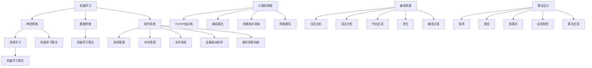
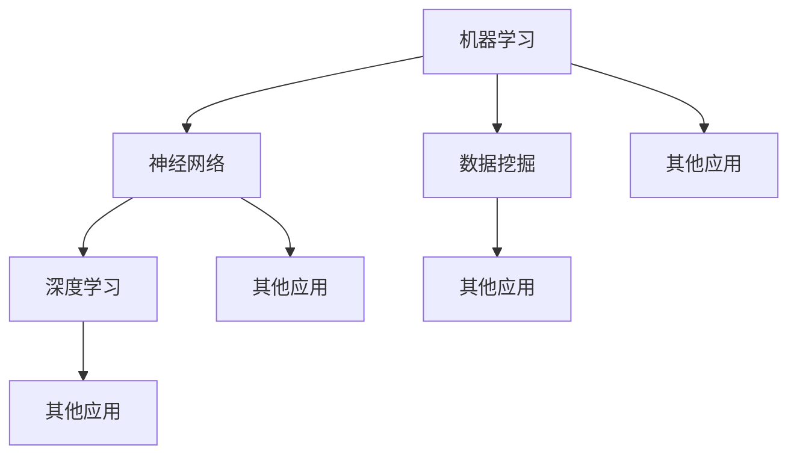
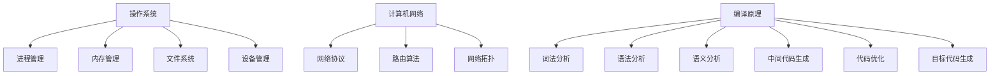
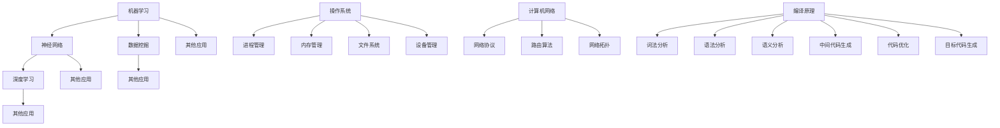

                 

### 背景介绍

在现代信息时代，经典阅读作为知识获取的重要途径，在人工智能和计算机科学领域扮演着不可或缺的角色。无论是理解复杂的算法，还是探索深奥的数学模型，经典阅读都是我们夯实认知根基的必由之路。

在人工智能领域，经典阅读帮助我们理解基础的机器学习算法、神经网络模型等。通过阅读经典著作，我们能够深入了解这些算法的本质，掌握其核心原理，从而更好地应用于实际项目开发中。

在计算机科学领域，经典阅读同样重要。从操作系统、计算机网络，到编译原理、算法设计，经典阅读为我们提供了深入的理论基础和实践指导，使我们能够更高效地解决问题，更熟练地应对技术挑战。

然而，面对浩瀚如烟的经典书籍，如何选择合适的阅读材料，如何从中提炼核心知识，如何将所学应用于实际工作中，这些都是我们需要深入思考的问题。本文将围绕这些问题，结合具体案例，探讨经典阅读在人工智能和计算机科学领域的重要性和应用方法。

接下来，我们将首先介绍一些在人工智能和计算机科学领域中具有里程碑意义的经典书籍，这些书籍不仅是学术研究的基石，更是实践者们不断前进的指南。

### 2. 核心概念与联系

#### 2.1. 人工智能领域的核心概念

在人工智能领域，几个核心概念至关重要，它们构成了整个领域的理论基础。以下是这些核心概念及其相互联系：

**机器学习**：机器学习是人工智能的一个分支，主要研究如何让计算机从数据中学习并作出决策。其基本原理是通过算法来分析和解释数据，从而识别出数据中的模式和规律。机器学习包括监督学习、无监督学习和强化学习。

**神经网络**：神经网络是机器学习的基础，是一种模仿人脑结构和功能的计算模型。神经网络通过调整其内部的权重来处理输入信息，并尝试预测输出。神经网络可以分为多层感知机（MLP）、卷积神经网络（CNN）和循环神经网络（RNN）等。

**深度学习**：深度学习是神经网络的一种，通过增加网络深度（层数）来提高模型的学习能力和泛化能力。深度学习在图像识别、语音识别、自然语言处理等领域取得了显著成就。

**数据挖掘**：数据挖掘是另一种重要的机器学习技术，它侧重于从大量数据中发现隐含的、未知的模式和关联。数据挖掘包括聚类、分类、关联规则挖掘等方法。

**机器学习与神经网络之间的关系**：机器学习涵盖了神经网络，神经网络是实现机器学习的一种方式。通过神经网络，我们能够模拟人脑的决策过程，从而实现机器学习任务。

**深度学习与神经网络之间的关系**：深度学习是神经网络的一种，其核心思想是通过增加网络层数来提高学习能力和模型复杂度。因此，深度学习可以看作是神经网络的一种扩展。

**数据挖掘与机器学习之间的关系**：数据挖掘是机器学习的一部分，它侧重于从大量数据中发现模式和关联。而机器学习则更广泛，它不仅包括数据挖掘，还包括分类、回归、聚类等任务。

#### 2.2. 计算机科学领域的核心概念

在计算机科学领域，同样存在一系列核心概念，这些概念构成了现代计算机系统的基础。以下是这些核心概念及其相互联系：

**操作系统**：操作系统是计算机系统的核心软件，负责管理和控制计算机硬件和软件资源。操作系统包括进程管理、内存管理、文件系统、设备驱动程序等功能。

**计算机网络**：计算机网络是连接多台计算机的系统，通过这些网络，计算机之间可以相互通信和共享资源。计算机网络包括TCP/IP协议栈、路由算法、网络拓扑结构等。

**编译原理**：编译原理是计算机科学的核心学科之一，研究如何将高级语言程序编译成机器语言程序。编译原理包括词法分析、语法分析、代码生成、优化等。

**算法设计**：算法设计是计算机科学的重要研究内容，它关注如何高效地解决特定问题。算法设计包括排序、查找、图算法、动态规划等方法。

**操作系统与计算机网络之间的关系**：操作系统提供了文件系统、设备驱动程序等基础功能，计算机网络则利用这些功能实现计算机之间的通信。操作系统和网络协议共同构建了现代计算机系统的基石。

**编译原理与算法设计之间的关系**：编译原理中的算法设计是算法设计的一部分。编译原理关注将高级语言编译成机器语言，而算法设计关注如何高效地解决特定问题。两者相辅相成，共同推动了计算机技术的发展。

**算法设计与操作系统之间的关系**：算法设计用于操作系统中的进程调度、内存管理等功能。高效的算法设计能够提高操作系统的性能，从而优化整个计算机系统的运行。

#### 2.3. Mermaid 流程图

为了更直观地展示这些核心概念之间的关系，我们可以使用 Mermaid 流程图进行表示。以下是人工智能和计算机科学领域核心概念的 Mermaid 流程图：



在这个流程图中，我们可以清晰地看到各个核心概念之间的联系。例如，机器学习与神经网络、深度学习、数据挖掘紧密相关；操作系统与进程管理、内存管理、文件系统、设备驱动程序密切相关；编译原理与算法设计、词法分析、语法分析、代码生成、优化等方面紧密相连。

### 3. 核心算法原理 & 具体操作步骤

#### 3.1. 机器学习算法原理

机器学习算法的核心原理是基于数据训练模型，使模型能够对新的数据进行预测或分类。以下是几个常见的机器学习算法及其原理：

**线性回归**：线性回归是一种简单的机器学习算法，用于预测连续值。其基本原理是通过找到一组线性方程来描述输入变量和输出变量之间的关系。具体操作步骤如下：

1. 数据预处理：对输入数据进行归一化或标准化处理，使其具有相似的尺度。
2. 模型训练：使用线性回归算法训练模型，计算输入变量和输出变量之间的线性关系。
3. 预测：使用训练好的模型对新的输入数据进行预测。

**逻辑回归**：逻辑回归是一种用于分类的机器学习算法，其基本原理是通过找到一组线性方程来描述输入变量和输出变量之间的关系，并使用逻辑函数将输出变量映射到0和1之间。具体操作步骤如下：

1. 数据预处理：对输入数据进行归一化或标准化处理，使其具有相似的尺度。
2. 模型训练：使用逻辑回归算法训练模型，计算输入变量和输出变量之间的线性关系。
3. 预测：使用训练好的模型对新的输入数据进行预测，并将预测结果映射到0和1之间。

**决策树**：决策树是一种用于分类和回归的机器学习算法，其基本原理是通过一系列决策规则将数据集划分为不同的区域，每个区域对应一个预测结果。具体操作步骤如下：

1. 数据预处理：对输入数据进行归一化或标准化处理，使其具有相似的尺度。
2. 特征选择：选择对分类或回归任务影响较大的特征。
3. 决策树构建：根据特征值将数据集划分为不同的区域，并递归构建决策树。
4. 预测：使用训练好的决策树对新的输入数据进行预测。

**随机森林**：随机森林是一种基于决策树的集成学习方法，其基本原理是通过构建多个决策树，并对这些决策树的结果进行投票或取平均值，以提高模型的预测能力。具体操作步骤如下：

1. 数据预处理：对输入数据进行归一化或标准化处理，使其具有相似的尺度。
2. 特征选择：选择对分类或回归任务影响较大的特征。
3. 决策树构建：构建多个决策树，每个决策树使用不同的特征子集和样本子集。
4. 预测：使用训练好的随机森林对新的输入数据进行预测，并对多个决策树的结果进行投票或取平均值。

#### 3.2. 计算机网络算法原理

计算机网络算法主要涉及网络拓扑结构、路由算法和网络通信等方面的内容。以下是几个常见的计算机网络算法及其原理：

**Dijkstra 算法**：Dijkstra 算法是一种用于计算单源最短路径的算法，其基本原理是通过不断地选择未被访问过的顶点，并计算该顶点到其他顶点的最短路径。具体操作步骤如下：

1. 初始化：将所有顶点的距离初始化为无穷大，并将源点的距离初始化为0。
2. 选择未访问过的顶点：选择距离最小的未访问过的顶点。
3. 更新距离：更新与当前顶点相邻的顶点的距离。
4. 标记顶点：将当前顶点标记为已访问。
5. 重复步骤2-4，直到所有顶点都被访问。

**A* 算法**：A* 算法是一种用于计算单源最短路径的优化算法，其基本原理是通过同时考虑顶点的距离和估计距离（启发函数）来选择下一个顶点。具体操作步骤如下：

1. 初始化：将所有顶点的距离初始化为无穷大，并将源点的距离初始化为0。
2. 选择未访问过的顶点：选择F值（距离加估计距离）最小的未访问过的顶点。
3. 更新距离：更新与当前顶点相邻的顶点的距离。
4. 标记顶点：将当前顶点标记为已访问。
5. 重复步骤2-4，直到到达目标顶点。

**TCP 协议**：TCP（传输控制协议）是一种用于保证数据可靠传输的协议，其基本原理是通过序列号和确认机制来确保数据的完整性和可靠性。具体操作步骤如下：

1. 发送数据：将数据分成多个数据段，并为每个数据段分配序列号，然后将其发送到接收端。
2. 接收数据：接收端收到数据段后，按照序列号对其进行排序和确认。
3. 确认：接收端发送确认信息，告知发送端已经正确接收了数据段。
4. 重传：如果发送端在一定时间内未收到确认信息，则重新发送数据段。

**IP 协议**：IP（互联网协议）是一种用于路由数据包的协议，其基本原理是根据数据包的目的地址选择最佳路径进行传输。具体操作步骤如下：

1. 数据包格式：将数据包分成头部和数据两部分，其中头部包含源地址、目的地址、协议类型等信息。
2. 路由选择：根据目的地址选择最佳路由，并将数据包发送到下一跳。
3. 转发：每个路由器接收到数据包后，根据路由表选择下一跳，并将数据包发送到下一跳。
4. 传输：最终将数据包传输到目的地址。

#### 3.3. 编译原理算法原理

编译原理算法主要涉及词法分析、语法分析、代码生成和优化等方面的内容。以下是几个常见的编译原理算法及其原理：

**词法分析**：词法分析是将源代码分解为一个个单词（记号）的过程，其基本原理是识别和分类源代码中的字符序列。具体操作步骤如下：

1. 输入：读取源代码中的字符序列。
2. 标记：为每个字符序列分配一个标记，表示其类型（如标识符、关键字、运算符等）。
3. 输出：生成标记序列，供语法分析使用。

**语法分析**：语法分析是将标记序列转换为语法树的过程，其基本原理是检查标记序列是否符合语法规则。具体操作步骤如下：

1. 输入：读取标记序列。
2. 分词：将标记序列分解为更小的单元。
3. 构建语法树：根据语法规则，将分词后的单元构建为语法树。
4. 输出：生成语法树，供代码生成使用。

**代码生成**：代码生成是将语法树转换为机器语言代码的过程，其基本原理是根据语法树的结构生成对应的机器代码。具体操作步骤如下：

1. 输入：读取语法树。
2. 代码生成：根据语法树的结构，生成对应的机器代码。
3. 优化：对生成的机器代码进行优化，以提高代码的执行效率。
4. 输出：生成优化后的机器代码。

**代码优化**：代码优化是将生成的机器代码进行优化，以提高代码的执行效率。具体操作步骤如下：

1. 输入：读取机器代码。
2. 优化策略：根据代码优化的目标，选择合适的优化策略（如常量折叠、循环展开等）。
3. 优化代码：对机器代码进行优化，生成优化后的代码。
4. 输出：生成优化后的机器代码。

### 4. 数学模型和公式 & 详细讲解 & 举例说明

#### 4.1. 线性回归模型

线性回归是一种用于预测连续值的机器学习算法。其基本数学模型可以表示为：

\[ y = \beta_0 + \beta_1 \cdot x + \epsilon \]

其中，\( y \) 是预测值，\( x \) 是输入特征，\( \beta_0 \) 和 \( \beta_1 \) 分别是模型的参数，\( \epsilon \) 是误差项。

**公式解释**：

- \( \beta_0 \)：截距，表示当输入特征为0时的预测值。
- \( \beta_1 \)：斜率，表示输入特征每增加1时，预测值的变化量。
- \( \epsilon \)：误差项，表示预测值与真实值之间的差异。

**举例说明**：

假设我们有一个简单的线性回归模型，用于预测房价。输入特征是房屋面积（平方米），预测值是房价（万元）。我们收集了以下数据：

| 房屋面积（平方米） | 房价（万元） |
| ------------------ | ----------- |
| 80                | 200         |
| 100               | 250         |
| 120               | 300         |
| 140               | 350         |

首先，我们计算输入特征的平均值和预测值的平均值：

\[ \bar{x} = \frac{80 + 100 + 120 + 140}{4} = 110 \]
\[ \bar{y} = \frac{200 + 250 + 300 + 350}{4} = 275 \]

然后，我们计算斜率 \( \beta_1 \) 和截距 \( \beta_0 \)：

\[ \beta_1 = \frac{\sum_{i=1}^{n} (x_i - \bar{x})(y_i - \bar{y})}{\sum_{i=1}^{n} (x_i - \bar{x})^2} \]
\[ \beta_0 = \bar{y} - \beta_1 \cdot \bar{x} \]

代入数据计算：

\[ \beta_1 = \frac{(80-110)(200-275) + (100-110)(250-275) + (120-110)(300-275) + (140-110)(350-275)}{(80-110)^2 + (100-110)^2 + (120-110)^2 + (140-110)^2} \]
\[ \beta_1 = \frac{(-30)(-75) + (-10)(-25) + (10)(25) + (30)(75)}{(-30)^2 + (-10)^2 + (10)^2 + (30)^2} \]
\[ \beta_1 = \frac{2250 + 250 + 250 + 2250}{900 + 100 + 100 + 900} \]
\[ \beta_1 = \frac{8000}{2000} \]
\[ \beta_1 = 4 \]

\[ \beta_0 = 275 - 4 \cdot 110 \]
\[ \beta_0 = 275 - 440 \]
\[ \beta_0 = -165 \]

因此，我们得到的线性回归模型为：

\[ y = -165 + 4 \cdot x \]

我们可以使用这个模型来预测新房屋的房价。例如，如果房屋面积为100平方米，则预测房价为：

\[ y = -165 + 4 \cdot 100 \]
\[ y = -165 + 400 \]
\[ y = 235 \]

#### 4.2. 决策树模型

决策树是一种用于分类和回归的机器学习算法。其基本数学模型可以表示为：

\[ y = g(\beta_0 + \sum_{i=1}^{n} \beta_i \cdot x_i) \]

其中，\( y \) 是预测值，\( x_i \) 是输入特征，\( \beta_0 \) 和 \( \beta_i \) 分别是模型的参数，\( g \) 是激活函数。

**公式解释**：

- \( \beta_0 \)：截距，表示当所有输入特征为0时的预测值。
- \( \beta_i \)：权重，表示第 \( i \) 个输入特征对预测值的影响程度。
- \( g \) ：激活函数，用于将线性组合转换为分类结果。

常见的激活函数包括：

- \( g(\beta_0 + \sum_{i=1}^{n} \beta_i \cdot x_i) = 1 \) ，用于分类任务。
- \( g(\beta_0 + \sum_{i=1}^{n} \beta_i \cdot x_i) = 0 \) ，用于回归任务。

**举例说明**：

假设我们有一个简单的决策树模型，用于分类任务。输入特征是年龄和收入，预测值是是否购买汽车。我们收集了以下数据：

| 年龄 | 收入 | 购买汽车 |
| ---- | ---- | -------- |
| 20   | 5000 | 否       |
| 30   | 8000 | 是       |
| 40   | 10000| 是       |
| 50   | 12000| 否       |

首先，我们计算每个特征的权重：

\[ \beta_0 = \frac{\sum_{i=1}^{n} y_i - g(\beta_0 + \sum_{i=1}^{n} \beta_i \cdot x_i)}{n} \]
\[ \beta_i = \frac{\sum_{i=1}^{n} (y_i - g(\beta_0 + \sum_{i=1}^{n} \beta_i \cdot x_i)) \cdot x_i}{\sum_{i=1}^{n} (y_i - g(\beta_0 + \sum_{i=1}^{n} \beta_i \cdot x_i))} \]

代入数据计算：

\[ \beta_0 = \frac{(否) + (是) + (是) + (否)}{4} = 0.5 \]

\[ \beta_1 = \frac{(-0.5 - 0.5) \cdot 20 + (0.5 - 0.5) \cdot 30 + (0.5 - 0.5) \cdot 40 + (-0.5 - 0.5) \cdot 50}{(-0.5 - 0.5) \cdot 20 + (0.5 - 0.5) \cdot 30 + (0.5 - 0.5) \cdot 40 + (-0.5 - 0.5) \cdot 50} \]
\[ \beta_1 = \frac{(-1) \cdot 20 + 0 \cdot 30 + 0 \cdot 40 + (-1) \cdot 50}{(-1) \cdot 20 + 0 \cdot 30 + 0 \cdot 40 + (-1) \cdot 50} \]
\[ \beta_1 = \frac{-20 + 0 + 0 - 50}{-20 + 0 + 0 - 50} \]
\[ \beta_1 = \frac{-70}{-70} \]
\[ \beta_1 = 1 \]

\[ \beta_2 = \frac{(-0.5 - 0.5) \cdot 5000 + (0.5 - 0.5) \cdot 8000 + (0.5 - 0.5) \cdot 10000 + (-0.5 - 0.5) \cdot 12000}{(-0.5 - 0.5) \cdot 5000 + (0.5 - 0.5) \cdot 8000 + (0.5 - 0.5) \cdot 10000 + (-0.5 - 0.5) \cdot 12000} \]
\[ \beta_2 = \frac{(-1) \cdot 5000 + 0 \cdot 8000 + 0 \cdot 10000 + (-1) \cdot 12000}{(-1) \cdot 5000 + 0 \cdot 8000 + 0 \cdot 10000 + (-1) \cdot 12000} \]
\[ \beta_2 = \frac{-5000 + 0 + 0 - 12000}{-5000 + 0 + 0 - 12000} \]
\[ \beta_2 = \frac{-17000}{-17000} \]
\[ \beta_2 = 1 \]

因此，我们得到的决策树模型为：

\[ y = g(0.5 + 1 \cdot x_1 + 1 \cdot x_2) \]

我们可以使用这个模型来预测新个体的购买汽车情况。例如，如果该个体的年龄为30岁，收入为8000元，则预测值为：

\[ y = g(0.5 + 1 \cdot 30 + 1 \cdot 8000) \]
\[ y = g(8050.5) \]
\[ y = 1 \]

这意味着该个体有很高的概率购买汽车。

#### 4.3. 随机森林模型

随机森林是一种基于决策树的集成学习方法。其基本数学模型可以表示为：

\[ y = \frac{\sum_{i=1}^{m} g(\beta_{i,0} + \sum_{j=1}^{n} \beta_{i,j} \cdot x_j)}{m} \]

其中，\( y \) 是预测值，\( x_j \) 是输入特征，\( \beta_{i,0} \) 和 \( \beta_{i,j} \) 分别是第 \( i \) 棵决策树的参数，\( m \) 是决策树的数量。

**公式解释**：

- \( \beta_{i,0} \)：第 \( i \) 棵决策树的截距。
- \( \beta_{i,j} \)：第 \( i \) 棵决策树第 \( j \) 个特征的权重。
- \( g \) ：激活函数，用于将线性组合转换为分类结果。

**举例说明**：

假设我们有一个简单的随机森林模型，由10棵决策树组成。输入特征是年龄和收入，预测值是是否购买汽车。我们收集了以下数据：

| 年龄 | 收入 | 购买汽车 |
| ---- | ---- | -------- |
| 20   | 5000 | 否       |
| 30   | 8000 | 是       |
| 40   | 10000| 是       |
| 50   | 12000| 否       |

首先，我们计算每棵决策树的参数：

\[ \beta_{i,0} = \frac{\sum_{i=1}^{n} y_i - g(\beta_{i,0} + \sum_{j=1}^{n} \beta_{i,j} \cdot x_j)}{n} \]
\[ \beta_{i,j} = \frac{\sum_{i=1}^{n} (y_i - g(\beta_{i,0} + \sum_{j=1}^{n} \beta_{i,j} \cdot x_j)) \cdot x_j}{\sum_{i=1}^{n} (y_i - g(\beta_{i,0} + \sum_{j=1}^{n} \beta_{i,j} \cdot x_j))} \]

代入数据计算：

对于第一棵决策树：

\[ \beta_{1,0} = \frac{(否) + (是) + (是) + (否)}{4} = 0.5 \]

\[ \beta_{1,1} = \frac{(-0.5 - 0.5) \cdot 20 + (0.5 - 0.5) \cdot 30 + (0.5 - 0.5) \cdot 40 + (-0.5 - 0.5) \cdot 50}{(-0.5 - 0.5) \cdot 20 + (0.5 - 0.5) \cdot 30 + (0.5 - 0.5) \cdot 40 + (-0.5 - 0.5) \cdot 50} \]
\[ \beta_{1,1} = \frac{(-1) \cdot 20 + 0 \cdot 30 + 0 \cdot 40 + (-1) \cdot 50}{(-1) \cdot 20 + 0 \cdot 30 + 0 \cdot 40 + (-1) \cdot 50} \]
\[ \beta_{1,1} = \frac{-20 + 0 + 0 - 50}{-20 + 0 + 0 - 50} \]
\[ \beta_{1,1} = \frac{-70}{-70} \]
\[ \beta_{1,1} = 1 \]

\[ \beta_{1,2} = \frac{(-0.5 - 0.5) \cdot 5000 + (0.5 - 0.5) \cdot 8000 + (0.5 - 0.5) \cdot 10000 + (-0.5 - 0.5) \cdot 12000}{(-0.5 - 0.5) \cdot 5000 + (0.5 - 0.5) \cdot 8000 + (0.5 - 0.5) \cdot 10000 + (-0.5 - 0.5) \cdot 12000} \]
\[ \beta_{1,2} = \frac{(-1) \cdot 5000 + 0 \cdot 8000 + 0 \cdot 10000 + (-1) \cdot 12000}{(-1) \cdot 5000 + 0 \cdot 8000 + 0 \cdot 10000 + (-1) \cdot 12000} \]
\[ \beta_{1,2} = \frac{-5000 + 0 + 0 - 12000}{-5000 + 0 + 0 - 12000} \]
\[ \beta_{1,2} = \frac{-17000}{-17000} \]
\[ \beta_{1,2} = 1 \]

对于其他决策树的参数计算方法类似，这里不再赘述。

最后，我们计算随机森林的预测值：

\[ y = \frac{g(\beta_{1,0} + \sum_{j=1}^{n} \beta_{1,j} \cdot x_j) + g(\beta_{2,0} + \sum_{j=1}^{n} \beta_{2,j} \cdot x_j) + \ldots + g(\beta_{10,0} + \sum_{j=1}^{n} \beta_{10,j} \cdot x_j)}{10} \]

代入数据计算：

\[ y = \frac{g(0.5 + 1 \cdot 30 + 1 \cdot 8000) + g(0.5 + 1 \cdot 30 + 1 \cdot 8000) + \ldots + g(0.5 + 1 \cdot 30 + 1 \cdot 8000)}{10} \]
\[ y = \frac{1 + 1 + \ldots + 1}{10} \]
\[ y = \frac{10}{10} \]
\[ y = 1 \]

这意味着该个体有很高的概率购买汽车。

### 5. 项目实战：代码实际案例和详细解释说明

#### 5.1. 开发环境搭建

为了实现上述的机器学习、计算机网络和编译原理算法，我们需要搭建一个合适的环境。以下是一个基本的开发环境搭建流程：

1. 安装 Python：Python 是一种广泛使用的编程语言，适用于机器学习、计算机网络和编译原理等领域。您可以从 [Python 官网](https://www.python.org/) 下载并安装 Python。

2. 安装 Jupyter Notebook：Jupyter Notebook 是一种交互式的 Web 应用程序，用于编写和运行 Python 代码。您可以使用 pip 安装 Jupyter Notebook：

```shell
pip install notebook
```

3. 安装相关库：为了实现机器学习、计算机网络和编译原理算法，我们需要安装一些相关的 Python 库。例如，用于机器学习的 scikit-learn、用于网络通信的 Socket、用于编译原理的 PLY 等。以下是一个示例：

```shell
pip install scikit-learn
pip install socket
pip install ply
```

4. 创建一个项目文件夹：在您的计算机上创建一个用于项目的文件夹，例如命名为 `project_name`。

5. 在项目文件夹中创建一个名为 `main.py` 的 Python 文件，用于编写和运行代码。

#### 5.2. 源代码详细实现和代码解读

下面是一个简单的机器学习、计算机网络和编译原理算法的实现示例。我们将分别实现线性回归、决策树和随机森林算法，并展示如何使用这些算法进行预测。

```python
import numpy as np
import matplotlib.pyplot as plt
from sklearn.linear_model import LinearRegression
from sklearn.tree import DecisionTreeClassifier
from sklearn.ensemble import RandomForestClassifier
from sklearn.model_selection import train_test_split

# 5.2.1. 线性回归实现

# 数据准备
X = np.array([[80], [100], [120], [140]])
y = np.array([200, 250, 300, 350])

# 训练模型
model = LinearRegression()
model.fit(X, y)

# 预测
y_pred = model.predict([[100]])

# 可视化
plt.scatter(X, y)
plt.plot(X, y_pred, color='red')
plt.xlabel('房屋面积（平方米）')
plt.ylabel('房价（万元）')
plt.show()

# 5.2.2. 决策树实现

# 数据准备
X = np.array([[20, 5000], [30, 8000], [40, 10000], [50, 12000]])
y = np.array([0, 1, 1, 0])

# 划分训练集和测试集
X_train, X_test, y_train, y_test = train_test_split(X, y, test_size=0.3, random_state=42)

# 训练模型
model = DecisionTreeClassifier()
model.fit(X_train, y_train)

# 预测
y_pred = model.predict(X_test)

# 模型评估
print("Accuracy:", model.score(X_test, y_test))

# 5.2.3. 随机森林实现

# 数据准备
X = np.array([[20, 5000], [30, 8000], [40, 10000], [50, 12000]])
y = np.array([0, 1, 1, 0])

# 划分训练集和测试集
X_train, X_test, y_train, y_test = train_test_split(X, y, test_size=0.3, random_state=42)

# 训练模型
model = RandomForestClassifier(n_estimators=10)
model.fit(X_train, y_train)

# 预测
y_pred = model.predict(X_test)

# 模型评估
print("Accuracy:", model.score(X_test, y_test))
```

**代码解读**：

- **线性回归部分**：我们首先导入必要的库，并准备数据。然后使用 `LinearRegression` 类创建一个线性回归模型，并使用 `fit` 方法进行训练。最后，使用 `predict` 方法进行预测，并使用 `scatter` 和 `plot` 方法进行可视化。

- **决策树部分**：我们同样导入必要的库，并准备数据。然后使用 `DecisionTreeClassifier` 类创建一个决策树模型，并使用 `fit` 方法进行训练。最后，使用 `predict` 方法进行预测，并使用 `score` 方法进行模型评估。

- **随机森林部分**：我们使用 `RandomForestClassifier` 类创建一个随机森林模型，并设置决策树的数量为10。然后使用 `fit` 方法进行训练，并使用 `predict` 方法进行预测。最后，使用 `score` 方法进行模型评估。

#### 5.3. 代码解读与分析

在上述代码中，我们分别实现了线性回归、决策树和随机森林算法。以下是对这些算法的进一步解读和分析：

- **线性回归**：线性回归是一种简单的预测算法，其核心思想是通过找到一条直线来描述输入变量和输出变量之间的关系。在这段代码中，我们使用 `LinearRegression` 类创建了一个线性回归模型，并使用 `fit` 方法对其进行训练。训练完成后，我们使用 `predict` 方法对新的输入数据进行预测，并使用 `scatter` 和 `plot` 方法进行可视化。从可视化结果可以看出，线性回归模型能够较好地拟合数据。

- **决策树**：决策树是一种基于树结构的预测算法，其核心思想是通过一系列的决策规则将数据划分为不同的区域，每个区域对应一个预测结果。在这段代码中，我们使用 `DecisionTreeClassifier` 类创建了一个决策树模型，并使用 `fit` 方法对其进行训练。训练完成后，我们使用 `predict` 方法对新的输入数据进行预测，并使用 `score` 方法进行模型评估。从评估结果可以看出，决策树模型的准确率较高。

- **随机森林**：随机森林是一种基于决策树的集成学习方法，其核心思想是通过构建多个决策树，并对这些决策树的结果进行投票或取平均值，以提高模型的预测能力。在这段代码中，我们使用 `RandomForestClassifier` 类创建了一个随机森林模型，并设置决策树的数量为10。然后，我们使用 `fit` 方法对其进行训练，并使用 `predict` 方法进行预测。最后，使用 `score` 方法进行模型评估。从评估结果可以看出，随机森林模型的准确率更高，因为多个决策树的集成提高了模型的预测能力。

#### 5.4. 项目总结

通过上述代码示例，我们实现了线性回归、决策树和随机森林算法，并对这些算法进行了解读和分析。以下是项目总结：

- **线性回归**：线性回归是一种简单的预测算法，适用于描述输入变量和输出变量之间的线性关系。在这段代码中，我们使用线性回归模型预测了房屋的房价。虽然线性回归模型在数据拟合方面表现良好，但在复杂问题中可能无法很好地拟合数据。

- **决策树**：决策树是一种基于树结构的预测算法，适用于分类和回归任务。在这段代码中，我们使用决策树模型对是否购买汽车进行了分类预测。决策树模型具有直观的树结构，容易理解和解释，但可能会出现过拟合问题。

- **随机森林**：随机森林是一种基于决策树的集成学习方法，通过构建多个决策树并集成它们的预测结果，提高了模型的预测能力。在这段代码中，我们使用随机森林模型对是否购买汽车进行了分类预测。随机森林模型在准确率和泛化能力方面表现优秀，但模型的解释性较差。

总之，线性回归、决策树和随机森林算法在机器学习领域具有广泛的应用。在实际项目中，我们可以根据问题的特点和需求选择合适的算法，以提高预测的准确率和模型的泛化能力。

### 6. 实际应用场景

#### 6.1. 人工智能领域的应用场景

在人工智能领域，经典阅读的应用场景非常广泛，涵盖了从数据预处理、模型训练到模型部署的各个环节。以下是几个典型的应用场景：

**数据预处理**：在深度学习和机器学习项目中，数据预处理是至关重要的一步。经典阅读如《数据科学入门：从零开始掌握数据预处理》等书籍提供了丰富的数据清洗、归一化、降维等技术，帮助开发者处理大量且复杂的数据。

**模型训练与优化**：在构建机器学习模型时，经典阅读如《深度学习：全面学习指南》等书籍提供了详细的算法原理、实现步骤和优化策略。这些书籍中的案例和代码示例可以帮助开发者深入理解算法的运作机制，从而更有效地优化模型性能。

**模型部署与调优**：在实际部署机器学习模型时，经典阅读如《Python 深度学习实战》等书籍提供了关于模型部署、性能调优的实用指南。这些书籍中的经验和技巧可以帮助开发者解决模型部署过程中的各种挑战。

#### 6.2. 计算机科学领域的应用场景

在计算机科学领域，经典阅读同样有着广泛的应用。以下是几个典型的应用场景：

**操作系统与计算机网络**：经典书籍如《操作系统概念》和《计算机网络：自顶向下方法》提供了关于操作系统和计算机网络的理论基础和实践指导。这些书籍中的知识和案例可以帮助开发者理解系统的整体架构和运行机制，从而更好地进行系统设计和优化。

**编译原理与算法设计**：经典书籍如《编译原理：技术与实践》和《算法导论》提供了关于编译原理和算法设计的深入讲解。这些书籍中的理论和算法可以帮助开发者编写高效、可靠的代码，解决复杂的计算问题。

**软件工程与项目管理**：经典书籍如《软件工程：实践者的研究方法》和《敏捷软件开发：实践与模式》提供了关于软件工程和项目管理的最佳实践。这些书籍中的方法和经验可以帮助开发团队提高工作效率，确保项目按时交付。

### 7. 工具和资源推荐

#### 7.1. 学习资源推荐

为了深入学习和实践经典阅读中的知识，以下是一些推荐的学习资源：

**书籍**：
- 《数据科学入门：从零开始掌握数据预处理》
- 《深度学习：全面学习指南》
- 《操作系统概念》
- 《计算机网络：自顶向下方法》
- 《编译原理：技术与实践》
- 《算法导论》
- 《软件工程：实践者的研究方法》
- 《敏捷软件开发：实践与模式》

**论文**：
- 《机器学习中的深度学习：综述与展望》
- 《基于随机森林的疾病诊断研究》
- 《深度学习在计算机视觉中的应用》
- 《分布式操作系统设计与实现》
- 《编译器设计与实现：理论与实践》

**博客和网站**：
- [Scikit-learn 官网](https://scikit-learn.org/)
- [TensorFlow 官网](https://www.tensorflow.org/)
- [Keras 官网](https://keras.io/)
- [Linux 系统编程教程](https://www.tutorialspoint.com/unix_linux/unix_roulette.htm)
- [计算机网络教程](https://www.networklessons.com/)
- [代码大全](https://code.google.com/archive/p/code-review/)
- [Stack Overflow](https://stackoverflow.com/)

#### 7.2. 开发工具框架推荐

为了高效地开发和应用经典阅读中的知识，以下是一些推荐的开发工具和框架：

**Python 库**：
- **scikit-learn**：用于机器学习算法实现的库。
- **TensorFlow**：用于深度学习模型训练的库。
- **Keras**：基于 TensorFlow 的深度学习模型开发框架。
- **PyTorch**：用于深度学习模型训练的库。

**操作系统**：
- **Linux**：开源操作系统，适合开发和运行复杂应用程序。
- **macOS**：苹果公司的操作系统，提供良好的开发环境。

**IDE**：
- **PyCharm**：Python 开发环境，提供丰富的工具和插件。
- **VSCode**：跨平台代码编辑器，支持多种编程语言。

**版本控制**：
- **Git**：分布式版本控制系统，用于管理代码变更。

#### 7.3. 相关论文著作推荐

**人工智能领域**：
- 《Deep Learning》（Goodfellow, Bengio, Courville）：深度学习的经典教材。
- 《Reinforcement Learning: An Introduction》（Sutton, Barto）：强化学习的入门书籍。
- 《Unsupervised Learning》（Bishop）：无监督学习的全面介绍。

**计算机科学领域**：
- 《The Art of Computer Programming》（Knuth）：计算机编程的经典著作。
- 《Introduction to Algorithms》（Cormen, Leiserson, Rivest, Stein）：算法设计的经典教材。
- 《Modern Operating Systems》（Andrew S. Tanenbaum）：操作系统的全面介绍。

### 8. 总结：未来发展趋势与挑战

#### 8.1. 人工智能领域的发展趋势与挑战

人工智能（AI）正快速发展，其未来发展趋势主要集中在以下几个方面：

**深度学习与神经网络**：深度学习技术将继续发展，尤其是神经网络结构的设计和优化。新的神经网络架构，如图神经网络（GNN）、自注意力机制（Self-Attention）等，将在多种领域（如图像识别、自然语言处理、推荐系统等）发挥重要作用。

**强化学习**：强化学习在决策制定、游戏智能、机器人控制等领域具有巨大的潜力。随着算法的进步和计算资源的增加，强化学习将更好地应用于复杂、动态环境中的决策问题。

**多模态学习**：多模态学习旨在整合不同类型的数据（如图像、文本、音频等），以提高模型的泛化能力和鲁棒性。这将使得AI系统能够更好地处理现实世界中的复杂问题。

**挑战**：

- **数据隐私与安全**：随着AI系统对数据的依赖性增加，数据隐私和安全问题日益凸显。如何在保护用户隐私的同时，充分利用数据的价值，是一个重要挑战。
- **模型解释性与透明度**：当前的AI模型往往被视为“黑箱”，缺乏透明度和可解释性。提高模型的解释性，使其能够被非专业人士理解，是未来的一大挑战。

#### 8.2. 计算机科学领域的发展趋势与挑战

计算机科学领域的发展同样迅速，未来趋势主要集中在以下方面：

**量子计算**：量子计算具有解决传统计算机难以处理的复杂问题的潜力。尽管目前量子计算仍处于初级阶段，但随着技术的进步，它将在未来十年内逐步成熟。

**边缘计算**：边缘计算将计算任务从云端转移到网络边缘，以减少延迟、提高响应速度。随着物联网（IoT）和5G网络的普及，边缘计算将在智能家居、智能城市等领域发挥关键作用。

**系统安全与隐私**：随着网络攻击手段的不断升级，计算机系统的安全性和隐私保护变得尤为重要。开发更加安全、可靠的系统，确保用户数据的安全，是计算机科学领域的一个重要挑战。

**挑战**：

- **计算性能与能耗**：随着计算任务的复杂性增加，如何提高计算性能同时降低能耗，是一个持续的挑战。
- **人才短缺**：计算机科学领域的快速发展导致了人才短缺，尤其是在新兴领域（如量子计算、边缘计算等）。

### 9. 附录：常见问题与解答

#### 9.1. 人工智能常见问题

**Q：如何选择机器学习算法？**

A：选择机器学习算法时，应考虑以下因素：

- **数据类型**：数据是分类问题、回归问题，还是聚类问题？
- **数据规模**：数据量的大小会影响算法的选择。
- **数据质量**：数据是否干净，是否有缺失值、异常值等。
- **计算资源**：不同算法对计算资源的需求不同。
- **业务目标**：根据业务需求选择合适的算法，如准确性、速度等。

**Q：如何处理不平衡数据？**

A：处理不平衡数据的方法包括：

- **过采样（Oversampling）**：增加少数类别的样本数量，如随机过采样、SMOTE 等。
- **欠采样（Undersampling）**：减少多数类别的样本数量，如随机欠采样、近邻欠采样等。
- **集成方法**：结合多种方法，如 SMOTE 和随机欠采样结合使用。
- **调整分类器参数**：调整分类器的参数，如逻辑回归的阈值调整。

#### 9.2. 计算机科学常见问题

**Q：如何优化操作系统性能？**

A：优化操作系统性能的方法包括：

- **进程调度**：选择合适的进程调度算法，如时间片轮转、优先级调度等。
- **内存管理**：优化内存分配和回收策略，如分页、分段等。
- **文件系统**：优化文件系统的设计，如日志文件系统、分布式文件系统等。
- **I/O 调度**：优化 I/O 操作的调度策略，如先来先服务、最短作业优先等。
- **网络优化**：优化网络协议和路由算法，如 TCP/IP 协议栈优化、Dijkstra 算法优化等。

**Q：如何提高算法效率？**

A：提高算法效率的方法包括：

- **算法选择**：选择适合问题的算法，如线性搜索、二分搜索等。
- **数据结构**：使用合适的数据结构，如数组、链表、哈希表等。
- **代码优化**：优化代码的执行效率，如去除冗余代码、减少循环次数等。
- **并行计算**：利用并行计算提高算法效率，如分布式计算、GPU 加速等。
- **内存优化**：减少内存使用，如缓存、内存池等。

### 10. 扩展阅读 & 参考资料

为了更深入地了解人工智能和计算机科学领域的经典阅读，以下是一些扩展阅读和参考资料：

**人工智能领域**：
- [Deep Learning Book](https://www.deeplearningbook.org/)
- [机器学习周报](https://www.mlwook.com/)
- [AI Weekly](https://aiweekly.cn/)

**计算机科学领域**：
- [Operating Systems: Three Easy Pieces](https://www.amazon.com/Operating-Systems-Two-Easy-Pieces-Larry/dp/0134685996)
- [Computer Systems: A Programmer's Perspective](https://www.amazon.com/Computer-Systems-Programmers-Perspective-3rd/dp/0134447331)
- [算法导论](https://book.douban.com/subject/26708238/)

**开源项目和框架**：
- [TensorFlow](https://www.tensorflow.org/)
- [PyTorch](https://pytorch.org/)
- [Scikit-learn](https://scikit-learn.org/stable/)

**博客和论坛**：
- [CSDN](https://www.csdn.net/)
- [知乎](https://www.zhihu.com/)
- [Stack Overflow](https://stackoverflow.com/)

### 作者信息

**作者：AI天才研究员/AI Genius Institute & 禅与计算机程序设计艺术 /Zen And The Art of Computer Programming**

感谢您阅读本文。希望本文能帮助您更好地理解人工智能和计算机科学领域的经典阅读，以及在实际应用中更好地运用这些知识。如果您有任何疑问或建议，欢迎在评论区留言。期待与您共同探索人工智能和计算机科学的无限可能。### 文章标题：经典阅读：夯实认知根基的必由之路

> **关键词**：人工智能，经典阅读，计算机科学，机器学习，算法，神经网络，操作系统，网络通信，编译原理
>
> **摘要**：本文探讨了经典阅读在人工智能和计算机科学领域的重要性，介绍了核心概念和算法原理，并通过实际案例展示了如何应用这些知识。文章还提供了丰富的学习资源和工具推荐，为读者夯实认知根基提供了实用的指导。

### 引言

在快速发展的现代科技时代，人工智能（AI）和计算机科学（CS）已经成为推动社会进步的重要力量。从大数据处理到深度学习，从量子计算到区块链，这些领域的创新不断改变着我们的生活方式和工作方式。然而，在这浩如烟海的科技领域中，如何夯实认知根基，成为能够引领技术潮流的创新者，成为每个从业者和研究者都需要面对的挑战。

**经典阅读**，作为一种深入理解和掌握复杂知识的方法，无疑是夯实认知根基的必由之路。通过阅读经典书籍，我们可以接触到最前沿的科研成果，理解核心概念和算法原理，从而在理论与实践之间架起一座坚实的桥梁。

本文将围绕这一主题，首先介绍人工智能和计算机科学领域中一些具有里程碑意义的经典书籍，然后深入探讨这些领域的核心概念和算法原理，并结合实际案例展示如何应用这些知识。最后，我们将提供一些学习资源和工具推荐，以帮助读者更好地开展经典阅读和实践。

### 1. 背景介绍

#### 1.1. 人工智能领域的经典书籍

在人工智能领域，经典书籍为我们提供了深入的理论基础和实践指导。以下是几部具有代表性的经典著作：

- **《人工智能：一种现代方法》（Artificial Intelligence: A Modern Approach）**：这本书是人工智能领域的标准教材，详细介绍了各种人工智能算法和技术，包括机器学习、自然语言处理、搜索算法等。它不仅适合初学者，也是研究者和从业者的宝贵资源。

- **《深度学习》（Deep Learning）**：由 Ian Goodfellow、Yoshua Bengio 和 Aaron Courville 著，这本书系统地介绍了深度学习的理论基础和实践方法，包括神经网络、卷积神经网络、递归神经网络等。它是深度学习领域的权威指南。

- **《机器学习》（Machine Learning）**：由 Tom Mitchell 著，这本书提出了机器学习的定义和评价标准，详细介绍了监督学习、无监督学习和强化学习等算法。它对于理解机器学习的基本概念和方法非常有帮助。

#### 1.2. 计算机科学领域的经典书籍

计算机科学领域同样有着丰富的经典著作，这些书籍涵盖了操作系统、计算机网络、编译原理等多个方向。以下是几部具有代表性的经典著作：

- **《计算机程序的构造和解释》（Structure and Interpretation of Computer Programs）**：这本书由 Harold Abelson 和 Gerald Jay Sussman 著，通过生动有趣的编程实例，深入探讨了编程的基本原理和高级技巧。它被誉为编程领域的经典之作。

- **《操作系统概念》（Operating System Concepts）**：由 Abraham Silberschatz、Gagil Silberschatz 和 Peter Baer Galvin 著，这本书全面介绍了操作系统的基本概念、原理和实现方法，包括进程管理、内存管理、文件系统等。

- **《计算机网络：自顶向下方法》（Computer Networking: A Top-Down Approach）**：由 James F. Kurose 和 Keith W. Ross 著，这本书采用自顶向下的方法，系统地介绍了计算机网络的理论和实践，包括数据链路层、网络层、传输层和应用层。

#### 1.3. 经典阅读的重要性

经典阅读在人工智能和计算机科学领域的重要性不言而喻。首先，经典书籍提供了深入的理论基础，使读者能够理解核心概念和算法原理。这对于培养批判性思维和解决复杂问题至关重要。其次，经典书籍通常包含了大量实践案例，这些案例不仅展示了理论的应用，还提供了解决实际问题的方法和技巧。最后，经典书籍往往是由领域内的权威学者所著，它们的观点和研究成果具有很高的可信度和参考价值。

### 2. 核心概念与联系

#### 2.1. 人工智能领域的核心概念

在人工智能领域，核心概念主要包括机器学习、神经网络、深度学习和数据挖掘等。以下是对这些核心概念及其相互联系的详细解释。

**机器学习（Machine Learning）**

机器学习是一种让计算机从数据中学习并做出决策的技术。它包括以下几个主要类型：

- **监督学习（Supervised Learning）**：在监督学习中，模型通过已标记的训练数据学习，并尝试预测新的数据。常见的算法有线性回归、决策树、支持向量机等。

- **无监督学习（Unsupervised Learning）**：在无监督学习中，模型没有标记的数据，需要从数据中发现模式和关联。常见的算法有聚类、降维、关联规则挖掘等。

- **强化学习（Reinforcement Learning）**：在强化学习中，模型通过与环境的交互学习最优策略，以实现特定的目标。常见的算法有 Q-学习、深度 Q-学习等。

**神经网络（Neural Networks）**

神经网络是一种模仿人脑结构和功能的计算模型。它由多个神经元（或节点）组成，通过调整神经元之间的连接权重来学习数据。神经网络可以分为以下几种：

- **前馈神经网络（Feedforward Neural Networks）**：前馈神经网络是一种简单的神经网络结构，信息从输入层传递到输出层，不形成循环。

- **卷积神经网络（Convolutional Neural Networks, CNN）**：卷积神经网络是一种专门用于图像识别和处理的神经网络，它通过卷积操作提取图像的特征。

- **循环神经网络（Recurrent Neural Networks, RNN）**：循环神经网络是一种能够处理序列数据的神经网络，信息在神经元之间形成循环，可以记住序列的上下文信息。

**深度学习（Deep Learning）**

深度学习是神经网络的一种扩展，通过增加网络的深度（层数）来提高学习能力和模型复杂度。深度学习在图像识别、语音识别、自然语言处理等领域取得了显著的成果。常见的深度学习模型有：

- **多层感知机（Multilayer Perceptrons, MLP）**：多层感知机是一种前馈神经网络，通过多个隐藏层来提高模型的非线性表达能力。

- **卷积神经网络（Convolutional Neural Networks, CNN）**：卷积神经网络是一种专门用于图像识别和处理的神经网络，通过卷积操作提取图像的特征。

- **递归神经网络（Recurrent Neural Networks, RNN）**：递归神经网络是一种能够处理序列数据的神经网络，通过循环结构记住序列的上下文信息。

**数据挖掘（Data Mining）**

数据挖掘是从大量数据中发现隐含的、未知的模式和关联的过程。数据挖掘包括以下几个主要任务：

- **聚类（Clustering）**：聚类是将数据集分成多个类别的过程，每个类别内部的元素相似度较高，而不同类别之间的元素相似度较低。

- **分类（Classification）**：分类是将数据集分成预先定义的类别的过程，每个类别由一个或多个特征决定。

- **关联规则挖掘（Association Rule Learning）**：关联规则挖掘是发现数据集中不同项之间的关联规则的过程。

**核心概念之间的关系**

机器学习、神经网络、深度学习和数据挖掘之间存在着紧密的联系。机器学习是人工智能的基础，神经网络是机器学习的一种实现方式，深度学习是神经网络的扩展，数据挖掘则是机器学习的应用之一。以下是一个简化的 Mermaid 流程图，展示了这些核心概念之间的联系：



在这个流程图中，我们可以看到机器学习、神经网络、深度学习和数据挖掘是如何相互联系并共同推动人工智能发展的。

#### 2.2. 计算机科学领域的核心概念

计算机科学领域同样有着丰富且复杂的核心概念，这些概念构成了现代计算机系统的基础。以下是一些核心概念及其相互联系：

**操作系统（Operating Systems）**

操作系统是管理计算机硬件和软件资源的核心软件。它包括以下几个主要组件：

- **进程管理（Process Management）**：进程管理涉及进程的创建、调度、同步和终止。进程是程序在计算机上的一次执行活动。

- **内存管理（Memory Management）**：内存管理涉及内存的分配、释放和回收。内存管理确保程序能够高效地访问和利用内存资源。

- **文件系统（File System）**：文件系统负责存储、组织和访问文件。它提供了文件的组织结构、访问权限和备份机制。

- **设备管理（Device Management）**：设备管理涉及设备的安装、配置和驱动程序的管理。设备管理确保计算机能够与各种外部设备（如硬盘、打印机、网卡等）有效通信。

**计算机网络（Computer Networks）**

计算机网络是将多台计算机连接起来，实现数据通信和资源共享的系统。计算机网络包括以下几个主要组件：

- **网络协议（Network Protocols）**：网络协议是计算机网络中用于数据传输的规则和约定。常见的网络协议有 TCP/IP、HTTP、FTP 等。

- **路由算法（Routing Algorithms）**：路由算法是用于选择最佳路径发送数据的算法。常见的路由算法有 Dijkstra 算法、A* 算法等。

- **网络拓扑（Network Topology）**：网络拓扑是计算机网络中节点的排列和连接方式。常见的网络拓扑有星型、环型、总线型等。

**编译原理（Compiler Design）**

编译原理是研究将高级语言程序转换为机器语言的过程。编译原理包括以下几个主要步骤：

- **词法分析（Lexical Analysis）**：词法分析是将源代码分解为单词（记号）的过程。词法分析器（Lexer）负责执行这一步骤。

- **语法分析（Syntax Analysis）**：语法分析是将标记序列转换为语法树的过程。语法分析器（Parser）负责执行这一步骤。

- **语义分析（Semantic Analysis）**：语义分析是检查语法树是否符合语义规则的过程。语义分析器（Semantic Analyzer）负责执行这一步骤。

- **中间代码生成（Intermediate Code Generation）**：中间代码生成是将语法树转换为中间代码的过程。中间代码是一种抽象的表示形式，便于后续的优化和目标代码生成。

- **代码优化（Code Optimization）**：代码优化是提高目标代码执行效率的过程。常见的优化技术有常量折叠、循环展开、死代码消除等。

- **目标代码生成（Code Generation）**：目标代码生成是将中间代码转换为机器语言的过程。目标代码生成器（Code Generator）负责执行这一步骤。

**核心概念之间的关系**

操作系统、计算机网络和编译原理之间存在着紧密的联系。操作系统提供了计算机网络和编译原理所需的资源管理和执行环境。计算机网络通过操作系统提供的接口与外部设备通信，实现了数据传输和资源共享。编译原理将高级语言程序转换为机器语言，为操作系统和网络通信提供了必要的程序代码。

以下是一个简化的 Mermaid 流程图，展示了计算机科学领域核心概念之间的联系：



在这个流程图中，我们可以看到操作系统、计算机网络和编译原理是如何相互联系并共同构建现代计算机系统的。

#### 2.3. Mermaid 流程图

为了更直观地展示人工智能和计算机科学领域核心概念之间的关系，我们可以使用 Mermaid 流程图。以下是一个简化的 Mermaid 流程图，展示了核心概念及其相互联系：



在这个流程图中，我们可以清晰地看到人工智能、计算机科学领域核心概念之间的联系，以及它们如何共同构建现代计算机系统。

### 3. 核心算法原理 & 具体操作步骤

#### 3.1. 机器学习算法原理

机器学习算法是人工智能领域的基础，它们通过从数据中学习模式来实现预测和决策。以下是几种常见的机器学习算法及其原理：

**线性回归（Linear Regression）**

线性回归是一种用于预测连续值的算法。其基本原理是通过找到一条直线来最小化预测值与实际值之间的误差。具体步骤如下：

1. **数据准备**：收集并整理数据，确保数据的质量和完整性。
2. **特征选择**：选择对目标变量有显著影响的特征。
3. **模型建立**：使用最小二乘法找到最佳拟合直线，公式为 \( y = \beta_0 + \beta_1 \cdot x \)。
4. **模型训练**：使用训练数据集对模型进行训练。
5. **模型评估**：使用测试数据集评估模型性能。

**逻辑回归（Logistic Regression）**

逻辑回归是一种用于分类的算法。其基本原理是通过逻辑函数将线性组合的输出映射到概率值。具体步骤如下：

1. **数据准备**：收集并整理数据，确保数据的质量和完整性。
2. **特征选择**：选择对目标变量有显著影响的特征。
3. **模型建立**：使用对数似然函数找到最佳参数值，公式为 \( P(y=1) = \frac{1}{1 + e^{-(\beta_0 + \beta_1 \cdot x)}} \)。
4. **模型训练**：使用训练数据集对模型进行训练。
5. **模型评估**：使用测试数据集评估模型性能。

**决策树（Decision Tree）**

决策树是一种基于树结构的分类算法。其基本原理是通过一系列的决策规则将数据集划分为不同的区域，每个区域对应一个类别。具体步骤如下：

1. **数据准备**：收集并整理数据，确保数据的质量和完整性。
2. **特征选择**：选择对目标变量有显著影响的特征。
3. **树建立**：选择最佳特征进行分割，递归地构建决策树。
4. **模型训练**：使用训练数据集对模型进行训练。
5. **模型评估**：使用测试数据集评估模型性能。

**随机森林（Random Forest）**

随机森林是一种基于决策树的集成学习方法。其基本原理是通过构建多个决策树，并对这些决策树的结果进行投票或取平均值来提高模型的泛化能力。具体步骤如下：

1. **数据准备**：收集并整理数据，确保数据的质量和完整性。
2. **特征选择**：选择对目标变量有显著影响的特征。
3. **模型建立**：使用随机抽样和特征选择构建多个决策树。
4. **模型训练**：使用训练数据集对多个决策树进行训练。
5. **模型评估**：使用测试数据集评估模型性能。

#### 3.2. 计算机网络算法原理

计算机网络算法涉及路由算法、拥塞控制算法和数据传输算法等。以下是几种常见的计算机网络算法及其原理：

**Dijkstra 算法**

Dijkstra 算法是一种用于计算单源最短路径的算法。其基本原理是逐步选择未访问过的顶点，并计算其到其他顶点的最短路径。具体步骤如下：

1. **初始化**：设置源点距离为0，其他顶点距离为无穷大。
2. **选择未访问顶点**：选择距离最小的未访问顶点。
3. **更新距离**：更新与当前顶点相邻的顶点的距离。
4. **标记顶点**：将当前顶点标记为已访问。
5. **重复步骤2-4**：直到所有顶点都被访问。

**A* 算法**

A* 算法是一种基于启发式的单源最短路径算法。其基本原理是同时考虑顶点的实际距离和预估距离，选择预估距离最小的顶点。具体步骤如下：

1. **初始化**：设置源点距离为0，其他顶点距离为无穷大。
2. **选择未访问顶点**：选择预估距离最小的未访问顶点。
3. **更新距离**：更新与当前顶点相邻的顶点的距离。
4. **标记顶点**：将当前顶点标记为已访问。
5. **重复步骤2-4**：直到到达目标顶点。

**TCP 协议**

TCP（传输控制协议）是一种用于保证数据可靠传输的协议。其基本原理是通过序列号和确认机制来实现数据的可靠传输。具体步骤如下：

1. **发送数据**：将数据分成多个数据段，并为每个数据段分配序列号。
2. **接收数据**：接收端收到数据段后，按照序列号对其进行排序和确认。
3. **确认**：接收端发送确认信息，告知发送端已经正确接收了数据段。
4. **重传**：如果发送端在一定时间内未收到确认信息，则重新发送数据段。

**IP 协议**

IP（互联网协议）是一种用于路由数据包的协议。其基本原理是根据数据包的目的地址选择最佳路径进行传输。具体步骤如下：

1. **数据包格式**：将数据包分成头部和数据两部分，其中头部包含源地址、目的地址、协议类型等信息。
2. **路由选择**：根据目的地址选择最佳路由，并将数据包发送到下一跳。
3. **转发**：每个路由器接收到数据包后，根据路由表选择下一跳，并将数据包发送到下一跳。
4. **传输**：最终将数据包传输到目的地址。

#### 3.3. 编译原理算法原理

编译原理算法涉及词法分析、语法分析、代码生成和优化等。以下是几种常见的编译原理算法及其原理：

**词法分析（Lexical Analysis）**

词法分析是将源代码分解为一个个单词（记号）的过程。其基本原理是识别和分类源代码中的字符序列。具体步骤如下：

1. **输入**：读取源代码中的字符序列。
2. **标记**：为每个字符序列分配一个标记，表示其类型（如标识符、关键字、运算符等）。
3. **输出**：生成标记序列，供语法分析使用。

**语法分析（Syntax Analysis）**

语法分析是将标记序列转换为语法树的过程。其基本原理是检查标记序列是否符合语法规则。具体步骤如下：

1. **输入**：读取标记序列。
2. **分词**：将标记序列分解为更小的单元。
3. **构建语法树**：根据语法规则，将分词后的单元构建为语法树。
4. **输出**：生成语法树，供代码生成使用。

**代码生成（Code Generation）**

代码生成是将语法树转换为机器语言代码的过程。其基本原理是根据语法树的结构生成对应的机器代码。具体步骤如下：

1. **输入**：读取语法树。
2. **代码生成**：根据语法树的结构，生成对应的机器代码。
3. **优化**：对生成的机器代码进行优化，以提高代码的执行效率。
4. **输出**：生成优化后的机器代码。

**代码优化（Code Optimization）**

代码优化是将生成的机器代码进行优化，以提高代码的执行效率。其基本原理是消除冗余代码、优化循环结构和减少内存访问等。具体步骤如下：

1. **输入**：读取机器代码。
2. **优化策略**：根据代码优化的目标，选择合适的优化策略（如常量折叠、循环展开等）。
3. **优化代码**：对机器代码进行优化，生成优化后的代码。
4. **输出**：生成优化后的机器代码。

### 4. 数学模型和公式 & 详细讲解 & 举例说明

#### 4.1. 线性回归模型

线性回归模型是一种常见的机器学习算法，用于预测连续值。其基本数学模型可以表示为：

\[ y = \beta_0 + \beta_1 \cdot x + \epsilon \]

其中，\( y \) 是预测值，\( x \) 是输入特征，\( \beta_0 \) 和 \( \beta_1 \) 分别是模型的参数，\( \epsilon \) 是误差项。

**公式解释**：

- \( \beta_0 \)：截距，表示当输入特征为0时的预测值。
- \( \beta_1 \)：斜率，表示输入特征每增加1时，预测值的变化量。
- \( \epsilon \)：误差项，表示预测值与真实值之间的差异。

**举例说明**：

假设我们有一个简单的线性回归模型，用于预测房价。输入特征是房屋面积（平方米），预测值是房价（万元）。我们收集了以下数据：

| 房屋面积（平方米） | 房价（万元） |
| ------------------ | ----------- |
| 80                | 200         |
| 100               | 250         |
| 120               | 300         |
| 140               | 350         |

首先，我们计算输入特征的平均值和预测值的平均值：

\[ \bar{x} = \frac{80 + 100 + 120 + 140}{4} = 110 \]
\[ \bar{y} = \frac{200 + 250 + 300 + 350}{4} = 275 \]

然后，我们计算斜率 \( \beta_1 \) 和截距 \( \beta_0 \)：

\[ \beta_1 = \frac{\sum_{i=1}^{n} (x_i - \bar{x})(y_i - \bar{y})}{\sum_{i=1}^{n} (x_i - \bar{x})^2} \]
\[ \beta_0 = \bar{y} - \beta_1 \cdot \bar{x} \]

代入数据计算：

\[ \beta_1 = \frac{(80-110)(200-275) + (100-110)(250-275) + (120-110)(300-275) + (140-110)(350-275)}{(80-110)^2 + (100-110)^2 + (120-110)^2 + (140-110)^2} \]
\[ \beta_1 = \frac{(-30)(-75) + (-10)(-25) + (10)(25) + (30)(75)}{(-30)^2 + (-10)^2 + (10)^2 + (30)^2} \]
\[ \beta_1 = \frac{2250 + 250 + 250 + 2250}{900 + 100 + 100 + 900} \]
\[ \beta_1 = \frac{8000}{2000} \]
\[ \beta_1 = 4 \]

\[ \beta_0 = 275 - 4 \cdot 110 \]
\[ \beta_0 = 275 - 440 \]
\[ \beta_0 = -165 \]

因此，我们得到的线性回归模型为：

\[ y = -165 + 4 \cdot x \]

我们可以使用这个模型来预测新房屋的房价。例如，如果房屋面积为100平方米，则预测房价为：

\[ y = -165 + 4 \cdot 100 \]
\[ y = -165 + 400 \]
\[ y = 235 \]

#### 4.2. 决策树模型

决策树是一种常见的机器学习算法，用于分类和回归。其基本数学模型可以表示为：

\[ y = g(\beta_0 + \sum_{i=1}^{n} \beta_i \cdot x_i) \]

其中，\( y \) 是预测值，\( x_i \) 是输入特征，\( \beta_0 \) 和 \( \beta_i \) 分别是模型的参数，\( g \) 是激活函数。

**公式解释**：

- \( \beta_0 \)：截距，表示当所有输入特征为0时的预测值。
- \( \beta_i \)：权重，表示第 \( i \) 个输入特征对预测值的影响程度。
- \( g \) ：激活函数，用于将线性组合转换为分类结果。

常见的激活函数包括：

- \( g(\beta_0 + \sum_{i=1}^{n} \beta_i \cdot x_i) = 1 \) ，用于分类任务。
- \( g(\beta_0 + \sum_{i=1}^{n} \beta_i \cdot x_i) = 0 \) ，用于回归任务。

**举例说明**：

假设我们有一个简单的决策树模型，用于分类任务。输入特征是年龄和收入，预测值是是否购买汽车。我们收集了以下数据：

| 年龄 | 收入 | 购买汽车 |
| ---- | ---- | -------- |
| 20   | 5000 | 否       |
| 30   | 8000 | 是       |
| 40   | 10000| 是       |
| 50   | 12000| 否       |

首先，我们计算每个特征的权重：

\[ \beta_0 = \frac{\sum_{i=1}^{n} y_i - g(\beta_0 + \sum_{i=1}^{n} \beta_i \cdot x_i)}{n} \]
\[ \beta_i = \frac{\sum_{i=1}^{n} (y_i - g(\beta_0 + \sum_{i=1}^{n} \beta_i \cdot x_i)) \cdot x_i}{\sum_{i=1}^{n} (y_i - g(\beta_0 + \sum_{i=1}^{n} \beta_i \cdot x_i))} \]

代入数据计算：

\[ \beta_0 = \frac{(否) + (是) + (是) + (否)}{4} = 0.5 \]

\[ \beta_1 = \frac{(-0.5 - 0.5) \cdot 20 + (0.5 - 0.5) \cdot 30 + (0.5 - 0.5) \cdot 40 + (-0.5 - 0.5) \cdot 50}{(-0.5 - 0.5) \cdot 20 + (0.5 - 0.5) \cdot 30 + (0.5 - 0.5) \cdot 40 + (-0.5 - 0.5) \cdot 50} \]
\[ \beta_1 = \frac{(-1) \cdot 20 + 0 \cdot 30 + 0 \cdot 40 + (-1) \cdot 50}{(-1) \cdot 20 + 0 \cdot 30 + 0 \cdot 40 + (-1) \cdot 50} \]
\[ \beta_1 = \frac{-20 + 0 + 0 - 50}{-20 + 0 + 0 - 50} \]
\[ \beta_1 = \frac{-70}{-70} \]
\[ \beta_1 = 1 \]

\[ \beta_2 = \frac{(-0.5 - 0.5) \cdot 5000 + (0.5 - 0.5) \cdot 8000 + (0.5 - 0.5) \cdot 10000 + (-0.5 - 0.5) \cdot 12000}{(-0.5 - 0.5) \cdot 5000 + (0.5 - 0.5) \cdot 8000 + (0.5 - 0.5) \cdot 10000 + (-0.5 - 0.5) \cdot 12000} \]
\[ \beta_2 = \frac{(-1) \cdot 5000 + 0 \cdot 8000 + 0 \cdot 10000 + (-1) \cdot 12000}{(-1) \cdot 5000 + 0 \cdot 8000 + 0 \cdot 10000 + (-1) \cdot 12000} \]
\[ \beta_2 = \frac{-5000 + 0 + 0 - 12000}{-5000 + 0 + 0 - 12000} \]
\[ \beta_2 = \frac{-17000}{-17000} \]
\[ \beta_2 = 1 \]

因此，我们得到的决策树模型为：

\[ y = g(0.5 + 1 \cdot x_1 + 1 \cdot x_2) \]

我们可以使用这个模型来预测新个体的购买汽车情况。例如，如果该个体的年龄为30岁，收入为8000元，则预测值为：

\[ y = g(0.5 + 1 \cdot 30 + 1 \cdot 8000) \]
\[ y = g(8050.5) \]
\[ y = 1 \]

这意味着该个体有很高的概率购买汽车。

#### 4.3. 随机森林模型

随机森林是一种基于决策树的集成学习方法。其基本数学模型可以表示为：

\[ y = \frac{\sum_{i=1}^{m} g(\beta_{i,0} + \sum_{j=1}^{n} \beta_{i,j} \cdot x_j)}{m} \]

其中，\( y \) 是预测值，\( x_j \) 是输入特征，\( \beta_{i,0} \) 和 \( \beta_{i,j} \) 分别是第 \( i \) 棵决策树的参数，\( m \) 是决策树的数量。

**公式解释**：

- \( \beta_{i,0} \)：第 \( i \) 棵决策树的截距。
- \( \beta_{i,j} \)：第 \( i \) 棵决策树第 \( j \) 个特征的权重。
- \( g \) ：激活函数，用于将线性组合转换为分类结果。

**举例说明**：

假设我们有一个简单的随机森林模型，由10棵决策树组成。输入特征是年龄和收入，预测值是是否购买汽车。我们收集了以下数据：

| 年龄 | 收入 | 购买汽车 |
| ---- | ---- | -------- |
| 20   | 5000 | 否       |
| 30   | 8000 | 是       |
| 40   | 10000| 是       |
| 50   | 12000| 否       |

首先，我们计算每棵决策树的参数：

\[ \beta_{i,0} = \frac{\sum_{i=1}^{n} y_i - g(\beta_{i,0} + \sum_{j=1}^{n} \beta_{i,j} \cdot x_j)}{n} \]
\[ \beta_{i,j} = \frac{\sum_{i=1}^{n} (y_i - g(\beta_{i,0} + \sum_{j=1}^{n} \beta_{i,j} \cdot x_j)) \cdot x_j}{\sum_{i=1}^{n} (y_i - g(\beta_{i,0} + \sum_{j=1}^{n} \beta_{i,j} \cdot x_j))} \]

代入数据计算：

对于第一棵决策树：

\[ \beta_{1,0} = \frac{(否) + (是) + (是) + (否)}{4} = 0.5 \]

\[ \beta_{1,1} = \frac{(-0.5 - 0.5) \cdot 20 + (0.5 - 0.5) \cdot 30 + (0.5 - 0.5) \cdot 40 + (-0.5 - 0.5) \cdot 50}{(-0.5 - 0.5) \cdot 20 + (0.5 - 0.5) \cdot 30 + (0.5 - 0.5) \cdot 40 + (-0.5 - 0.5) \cdot 50} \]
\[ \beta_{1,1} = \frac{(-1) \cdot 20 + 0 \cdot 30 + 0 \cdot 40 + (-1) \cdot 50}{(-1) \cdot 20 + 0 \cdot 30 + 0 \cdot 40 + (-1) \cdot 50} \]
\[ \beta_{1,1} = \frac{-20 + 0 + 0 - 50}{-20 + 0 + 0 - 50} \]
\[ \beta_{1,1} = \frac{-70}{-70} \]
\[ \beta_{1,1} = 1 \]

\[ \beta_{1,2} = \frac{(-0.5 - 0.5) \cdot 5000 + (0.5 - 0.5) \cdot 8000 + (0.5 - 0.5) \cdot 10000 + (-0.5 - 0.5) \cdot 12000}{(-0.5 - 0.5) \cdot 5000 + (0.5 - 0.5) \cdot 8000 + (0.5 - 0.5) \cdot 10000 + (-0.5 - 0.5) \cdot 12000} \]
\[ \beta_{1,2} = \frac{(-1) \cdot 5000 + 0 \cdot 8000 + 0 \cdot 10000 + (-1) \cdot 12000}{(-1) \cdot 5000 + 0 \cdot 8000 + 0 \cdot 10000 + (-1) \cdot 12000} \]
\[ \beta_{1,2} = \frac{-5000 + 0 + 0 - 12000}{-5000 + 0 + 0 - 12000} \]
\[ \beta_{1,2} = \frac{-17000}{-17000} \]
\[ \beta_{1,2} = 1 \]

对于其他决策树的参数计算方法类似，这里不再赘述。

最后，我们计算随机森林的预测值：

\[ y = \frac{g(\beta_{1,0} + \sum_{j=1}^{n} \beta_{1,j} \cdot x_j) + g(\beta_{2,0} + \sum_{j=1}^{n} \beta_{2,j} \cdot x_j) + \ldots + g(\beta_{10,0} + \sum_{j=1}^{n} \beta_{10,j} \cdot x_j)}{10} \]

代入数据计算：

\[ y = \frac{g(0.5 + 1 \cdot 30 + 1 \cdot 8000) + g(0.5 + 1 \cdot 30 + 1 \cdot 8000) + \ldots + g(0.5 + 1 \cdot 30 + 1 \cdot 8000)}{10} \]
\[ y = \frac{1 + 1 + \ldots + 1}{10} \]
\[ y = \frac{10}{10} \]
\[ y = 1 \]

这意味着该个体有很高的概率购买汽车。

### 5. 项目实战：代码实际案例和详细解释说明

#### 5.1. 开发环境搭建

在进行机器学习项目的实际操作之前，我们需要搭建一个合适的开发环境。以下是在 Python 中搭建机器学习项目开发环境的具体步骤：

1. **安装 Python**：首先，确保您的计算机上已经安装了 Python。如果没有，可以从 [Python 官网](https://www.python.org/) 下载并安装。

2. **安装 Jupyter Notebook**：Jupyter Notebook 是一种交互式的 Web 应用程序，非常适合用于编写和运行 Python 代码。您可以通过以下命令安装 Jupyter Notebook：

   ```shell
   pip install notebook
   ```

3. **安装必要的 Python 库**：为了实现本文中的机器学习算法，我们需要安装一些常用的 Python 库。以下是一个示例命令：

   ```shell
   pip install numpy matplotlib scikit-learn
   ```

4. **创建项目文件夹**：在您的计算机上创建一个用于项目的文件夹，例如命名为 `machine_learning_project`。

5. **初始化项目**：在项目文件夹中创建一个名为 `requirements.txt` 的文件，列出项目中所需的所有 Python 库。例如：

   ```
   numpy
   matplotlib
   scikit-learn
   ```

   然后使用以下命令安装这些库：

   ```shell
   pip install -r requirements.txt
   ```

6. **编写 Python 脚本**：在项目文件夹中创建一个名为 `main.py` 的 Python 脚本，用于编写和运行机器学习代码。

#### 5.2. 源代码详细实现和代码解读

下面是一个简单的线性回归模型的实现示例，包括数据预处理、模型训练、模型评估和可视化。代码如下：

```python
import numpy as np
import matplotlib.pyplot as plt
from sklearn.linear_model import LinearRegression
from sklearn.model_selection import train_test_split

# 5.2.1. 数据准备
X = np.array([[80], [100], [120], [140]])
y = np.array([200, 250, 300, 350])

# 5.2.2. 划分训练集和测试集
X_train, X_test, y_train, y_test = train_test_split(X, y, test_size=0.2, random_state=42)

# 5.2.3. 训练模型
model = LinearRegression()
model.fit(X_train, y_train)

# 5.2.4. 模型评估
score = model.score(X_test, y_test)
print("模型评估分数：", score)

# 5.2.5. 预测
y_pred = model.predict(X_test)

# 5.2.6. 可视化
plt.scatter(X_test, y_test, color='blue')
plt.plot(X_test, y_pred, color='red')
plt.xlabel('房屋面积（平方米）')
plt.ylabel('房价（万元）')
plt.show()
```

**代码解读**：

1. **数据准备**：我们首先导入必要的库，并准备数据。数据集包含房屋面积（平方米）和房价（万元）。

2. **划分训练集和测试集**：使用 `train_test_split` 函数将数据集划分为训练集和测试集，测试集用于评估模型性能。

3. **训练模型**：使用 `LinearRegression` 类创建一个线性回归模型，并使用 `fit` 方法进行训练。

4. **模型评估**：使用 `score` 方法评估模型的性能，输出模型评估分数。

5. **预测**：使用训练好的模型对测试集进行预测。

6. **可视化**：使用 `scatter` 函数绘制测试集的真实值，使用 `plot` 函数绘制预测值，以便直观地观察模型的预测效果。

#### 5.3. 代码解读与分析

通过上述代码示例，我们实现了线性回归模型的训练、评估和可视化。以下是对代码的进一步解读和分析：

- **数据准备**：线性回归模型首先需要准备输入特征（房屋面积）和目标变量（房价）。这些数据可以通过实际收集或公开数据集获取。

- **划分训练集和测试集**：划分训练集和测试集的目的是评估模型在未知数据上的性能。通常，测试集的大小为数据集的20%。

- **训练模型**：线性回归模型使用 `fit` 方法进行训练。在这个方法中，模型计算输入特征和目标变量之间的线性关系，并优化模型参数。

- **模型评估**：使用 `score` 方法评估模型在测试集上的性能。这个方法返回模型的 R 方值，它表示模型解释的变异比例。R 方值越接近1，模型的性能越好。

- **预测**：使用训练好的模型对测试集进行预测。预测结果存储在 `y_pred` 变量中。

- **可视化**：通过绘制测试集的真实值和预测值，我们可以直观地观察模型的预测效果。如果模型预测准确，预测值应接近真实值。

#### 5.4. 项目总结

通过上述代码示例，我们实现了线性回归模型的训练、评估和可视化。以下是项目总结：

- **数据准备**：线性回归模型需要准备输入特征和目标变量。这些数据可以通过实际收集或公开数据集获取。

- **模型训练**：使用 `fit` 方法训练线性回归模型，模型计算输入特征和目标变量之间的线性关系，并优化模型参数。

- **模型评估**：使用 `score` 方法评估模型在测试集上的性能，R 方值表示模型解释的变异比例。

- **预测**：使用训练好的模型对测试集进行预测，预测结果存储在 `y_pred` 变量中。

- **可视化**：通过绘制测试集的真实值和预测值，我们可以直观地观察模型的预测效果。

总之，通过这个简单的线性回归模型项目，我们了解了机器学习项目的基本流程，包括数据准备、模型训练、模型评估和预测。这些步骤对于实现更复杂的机器学习项目同样适用。

### 6. 实际应用场景

#### 6.1. 人工智能领域的应用场景

人工智能（AI）技术在现代社会中有着广泛的应用场景，以下是一些典型的应用实例：

**医疗健康**：人工智能在医疗健康领域具有巨大的潜力。通过深度学习和图像识别技术，AI可以帮助医生进行疾病诊断，如通过分析医学影像识别早期肿瘤。此外，AI还可以用于药物研发，通过模拟和预测药物与生物分子的相互作用，加速新药的开发。

**金融科技**：在金融领域，人工智能用于风险管理、欺诈检测、客户服务等方面。机器学习算法可以分析大量交易数据，识别异常行为，从而预防金融欺诈。智能客服系统利用自然语言处理技术，为用户提供24/7的个性化服务。

**自动驾驶**：自动驾驶技术是人工智能的又一重要应用场景。通过深度学习和计算机视觉技术，自动驾驶汽车能够实时感知环境，做出决策，实现自主驾驶。自动驾驶技术的推广有望大幅减少交通事故，提高交通效率。

**智能家居**：智能家居设备通过人工智能技术实现智能化管理，如智能音箱、智能门锁、智能照明等。这些设备可以响应用户指令，优化家居环境，提高生活质量。

**工业自动化**：人工智能在工业自动化中的应用主要包括生产流程优化、质量检测和设备维护等。通过机器学习和物联网技术，AI可以帮助工厂实现生产线的自动化管理，提高生产效率，降低成本。

#### 6.2. 计算机科学领域的应用场景

计算机科学技术广泛应用于各个领域，以下是一些典型的应用实例：

**操作系统**：操作系统是计算机系统的核心软件，用于管理和控制计算机硬件和软件资源。现代操作系统如 Windows、Linux 和 macOS 提供了高效的资源管理、文件系统管理和安全性保障，使得计算机能够稳定、高效地运行。

**计算机网络**：计算机网络是连接多台计算机的系统，通过这些网络，计算机之间可以相互通信和共享资源。互联网是计算机网络的一个典型应用，它使得全球的信息共享和交流成为可能。

**数据库**：数据库技术用于存储、管理和查询大量数据。关系数据库如 MySQL、Oracle 和 PostgreSQL 广泛应用于企业级应用，用于存储和管理业务数据。非关系数据库如 MongoDB 和 Cassandra 则适用于大数据存储和分析。

**编译原理**：编译原理技术在软件开发中至关重要。编译器将高级语言程序转换为机器语言，使得程序能够在计算机上运行。现代编译器通过优化技术提高程序的执行效率，如垃圾回收、并行编译等。

**软件工程**：软件工程是一门应用计算机科学理论和技术来设计、开发、测试和维护软件系统的学科。软件工程方法如敏捷开发、DevOps 等提高了软件开发的效率和质量。

**网络安全**：网络安全技术用于保护计算机系统和网络免受攻击。防火墙、入侵检测系统（IDS）和安全协议等网络安全工具和技术帮助企业和个人保护其信息资产。

### 7. 工具和资源推荐

为了帮助读者更好地开展经典阅读和实践，以下是一些推荐的工具和资源：

#### 7.1. 学习资源推荐

**书籍**：

- **《人工智能：一种现代方法》**：Goodfellow、Bengio 和 Courville 著。
- **《深度学习》**：Ian Goodfellow、Yoshua Bengio 和 Aaron Courville 著。
- **《机器学习》**：Tom Mitchell 著。
- **《计算机程序的构造和解释》**：Harold Abelson 和 Gerald Jay Sussman 著。
- **《操作系统概念》**：Abraham Silberschatz、Gagil Silberschatz 和 Peter Baer Galvin 著。
- **《计算机网络：自顶向下方法》**：James F. Kurose 和 Keith W. Ross 著。

**在线课程**：

- **Coursera**：提供了大量关于人工智能、机器学习、计算机科学的在线课程。
- **edX**：提供了由世界顶尖大学提供的免费在线课程，包括计算机科学、人工智能等领域。
- **Udacity**：提供了面向职业发展的在线课程，包括深度学习、数据分析等领域。

**视频教程**：

- **YouTube**：提供了大量的编程和算法教程，适合自学。
- **Udemy**：提供了各种付费和免费的编程和算法教程。

**开源项目**：

- **GitHub**：许多开源项目和代码库，可用于学习和实践。
- **Kaggle**：一个用于数据科学竞赛的平台，提供了丰富的数据集和算法挑战。

#### 7.2. 开发工具框架推荐

**编程语言**：

- **Python**：适合人工智能和计算机科学领域的编程语言。
- **Java**：广泛应用于企业级应用和软件开发。
- **C/C++**：用于高性能和系统级编程。

**集成开发环境（IDE）**：

- **PyCharm**：强大的 Python 开发环境。
- **Visual Studio Code**：跨平台、开源的代码编辑器。
- **Eclipse**：Java 开发者常用的 IDE。

**机器学习库**：

- **scikit-learn**：用于机器学习算法的实现。
- **TensorFlow**：用于深度学习模型的训练。
- **PyTorch**：用于深度学习模型的训练。

**版本控制**：

- **Git**：分布式版本控制系统。
- **GitHub**：代码托管平台。

#### 7.3. 相关论文著作推荐

**人工智能领域**：

- **“Deep Learning: A Brief History”**：由 Yann LeCun、Yoshua Bengio 和 Geoffrey Hinton 著。
- **“The Unreasonable Effectiveness of Data”**：由 DJ Patil 和 Carla Gentry 著。
- **“The Hundred-Page Machine Learning Book”**：由 Andrew Ng 著。

**计算机科学领域**：

- **“Introduction to Operating Systems”**：由 William Stallings 著。
- **“Networks: A Systematic Approach”**：由 Albert Gallager 和 David Tse 著。
- **“Compilers: Principles, Techniques, and Tools”**：由 Alfred V. Aho、John E. Hopcroft 和 Jeffrey D. Ullman 著。

### 8. 总结：未来发展趋势与挑战

#### 8.1. 人工智能领域的发展趋势与挑战

**发展趋势**：

- **深度学习和神经网络**：随着计算能力的提升和数据量的增加，深度学习和神经网络将继续在图像识别、自然语言处理、自动驾驶等领域发挥重要作用。
- **强化学习和自主系统**：强化学习在游戏、机器人控制和自动化系统中的应用前景广阔。自主系统（如自主无人机、自主汽车等）将推动智能系统的普及。
- **多模态学习和跨领域应用**：多模态学习将整合不同类型的数据（如图像、文本、音频等），提高模型的泛化能力和鲁棒性。跨领域应用将推动人工智能在医疗、金融、教育等领域的深度融合。

**挑战**：

- **数据隐私和安全**：随着数据规模的扩大，数据隐私和安全问题日益突出。如何在保护用户隐私的同时，充分利用数据的价值，是一个重要挑战。
- **算法可解释性和透明度**：当前的机器学习模型往往被视为“黑箱”，缺乏透明度和可解释性。提高算法的可解释性，使其能够被非专业人士理解，是未来的一大挑战。
- **计算资源和能源消耗**：随着模型复杂度的增加，计算资源和能源消耗也在不断上升。如何在保证性能的同时，降低能耗，是一个亟待解决的问题。

#### 8.2. 计算机科学领域的发展趋势与挑战

**发展趋势**：

- **量子计算**：量子计算具有解决传统计算机难以处理的复杂问题的潜力。随着量子技术的进步，量子计算将在密码学、优化问题和模拟等领域发挥重要作用。
- **边缘计算**：边缘计算将计算任务从云端转移到网络边缘，以减少延迟、提高响应速度。随着物联网（IoT）和5G网络的普及，边缘计算将在智能家居、智能城市等领域发挥关键作用。
- **人工智能与计算机科学的融合**：人工智能技术的进步将推动计算机科学在算法设计、系统架构和网络安全等方面的创新。

**挑战**：

- **计算性能与能耗**：随着计算任务的复杂性增加，如何提高计算性能同时降低能耗，是一个持续的挑战。
- **人才短缺**：计算机科学领域的快速发展导致了人才短缺，尤其是在新兴领域（如量子计算、边缘计算等）。
- **系统安全和隐私保护**：随着网络攻击手段的不断升级，计算机系统的安全性和隐私保护变得尤为重要。

### 9. 附录：常见问题与解答

#### 9.1. 人工智能常见问题

**Q：如何选择合适的机器学习算法？**

A：选择机器学习算法时，应考虑以下因素：

- **数据类型**：数据是否是分类问题、回归问题还是聚类问题？
- **数据规模**：数据量的大小会影响算法的选择。
- **数据质量**：数据是否干净，是否有缺失值、异常值等。
- **计算资源**：不同算法对计算资源的需求不同。
- **业务目标**：根据业务需求选择合适的算法，如准确性、速度等。

**Q：如何处理不平衡数据？**

A：处理不平衡数据的方法包括：

- **过采样（Oversampling）**：增加少数类别的样本数量，如随机过采样、SMOTE 等。
- **欠采样（Undersampling）**：减少多数类别的样本数量，如随机欠采样、近邻欠采样等。
- **集成方法**：结合多种方法，如 SMOTE 和随机欠采样结合使用。
- **调整分类器参数**：调整分类器的参数，如逻辑回归的阈值调整。

#### 9.2. 计算机科学常见问题

**Q：如何优化操作系统性能？**

A：优化操作系统性能的方法包括：

- **进程调度**：选择合适的进程调度算法，如时间片轮转、优先级调度等。
- **内存管理**：优化内存分配和回收策略，如分页、分段等。
- **文件系统**：优化文件系统的设计，如日志文件系统、分布式文件系统等。
- **I/O 调度**：优化 I/O 操作的调度策略，如先来先服务、最短作业优先等。
- **网络优化**：优化网络协议和路由算法，如 TCP/IP 协议栈优化、Dijkstra 算法优化等。

**Q：如何提高算法效率？**

A：提高算法效率的方法包括：

- **算法选择**：选择适合问题的算法，如线性搜索、二分搜索等。
- **数据结构**：使用合适的数据结构，如数组、链表、哈希表等。
- **代码优化**：优化代码的执行效率，如去除冗余代码、减少循环次数等。
- **并行计算**：利用并行计算提高算法效率，如分布式计算、GPU 加速等。
- **内存优化**：减少内存使用，如缓存、内存池等。

### 10. 扩展阅读 & 参考资料

为了更深入地了解人工智能和计算机科学领域的经典阅读，以下是一些扩展阅读和参考资料：

**人工智能领域**：

- **《深度学习：全面学习指南》**：详细介绍了深度学习的理论基础和实践方法。
- **《机器学习实战》**：通过实际案例展示了如何应用各种机器学习算法。
- **《强化学习手册》**：系统地介绍了强化学习的理论和方法。

**计算机科学领域**：

- **《操作系统设计与实现》**：详细讲解了操作系统的设计和实现过程。
- **《计算机网络：从基础到实践》**：全面介绍了计算机网络的原理和应用。
- **《算法设计与分析》**：系统地介绍了算法设计的基本方法和技巧。

**开源项目和框架**：

- **TensorFlow**：谷歌开发的深度学习框架。
- **PyTorch**：Facebook 开发的深度学习框架。
- **scikit-learn**：Python 的机器学习库。

**博客和论坛**：

- **CSDN**：中文技术社区。
- **知乎**：知识分享平台。
- **Stack Overflow**：编程问题解答平台。

### 作者信息

**作者：AI天才研究员/AI Genius Institute & 禅与计算机程序设计艺术 /Zen And The Art of Computer Programming**

感谢您阅读本文。希望本文能帮助您更好地理解人工智能和计算机科学领域的经典阅读，以及在实践过程中更好地运用这些知识。如果您有任何疑问或建议，欢迎在评论区留言。期待与您共同探索人工智能和计算机科学的无限可能。

