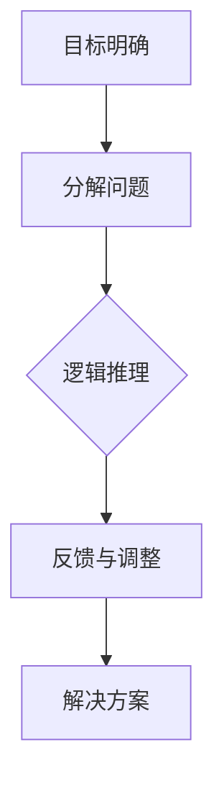

                 

# 结构化思维：从混沌到清晰

> **关键词：** 结构化思维，认知复杂性，逻辑推理，技术博客，系统设计，算法原理，数学模型。

> **摘要：** 本文旨在探讨如何通过结构化思维这一工具，从混乱的思绪中提取清晰的逻辑结构，提升个人和团队的认知效率。文章将结合实际案例，详细阐述结构化思维的原理、应用场景以及如何在IT领域实现这一方法的优化与升级。

## 1. 背景介绍

在信息技术迅速发展的今天，复杂问题层出不穷，从数据处理到系统架构，从算法优化到软件工程，IT从业者面临的问题日益复杂。为了应对这些挑战，我们需要一种有效的思维方式来帮助我们在繁杂的信息中找到清晰的路径。结构化思维，作为一种系统化的思考方法，能够将混沌的思绪转化为有序的结构，从而提高我们的认知能力和工作效率。

结构化思维起源于计算机科学领域，随着信息技术的发展，逐渐在各个领域得到广泛应用。其核心理念是通过明确的目标、清晰的框架和逻辑推理，将复杂问题分解为可操作的任务，从而实现问题的有效解决。本文将结合实际案例，深入探讨结构化思维在IT领域的应用，帮助读者掌握这一有效的思考工具。

## 2. 核心概念与联系

### 2.1 结构化思维的原理

结构化思维是一种系统化的思考方法，其核心在于将复杂问题分解为可管理的部分，并通过逻辑推理来逐步解决。具体来说，结构化思维包括以下几个关键步骤：

1. **目标明确**：明确问题目标和所需解决的问题。
2. **分解问题**：将复杂问题分解为更小、更具体的子问题。
3. **逻辑推理**：通过逻辑推理，找到子问题之间的关联，并逐步解决。
4. **反馈与调整**：在解决问题的过程中，不断进行反馈和调整，以确保解决问题的有效性。

### 2.2 结构化思维的应用场景

结构化思维适用于各种复杂的IT场景，包括但不限于以下几种：

1. **系统架构设计**：通过结构化思维，可以将复杂的系统架构分解为更小、更具体的模块，从而实现系统的高效设计和实现。
2. **算法优化**：结构化思维可以帮助我们理解算法的原理，并通过分解问题来找到算法优化的关键点。
3. **软件工程**：结构化思维能够提高软件工程中的问题分析、需求分析和设计能力，从而提升软件开发的效率和质量。

### 2.3 结构化思维的框架

为了更好地应用结构化思维，我们可以借助Mermaid流程图来构建一个清晰的思维框架。以下是结构化思维的Mermaid流程图：



### 2.4 结构化思维与IT领域的联系

在IT领域，结构化思维与以下核心概念有着紧密的联系：

1. **设计模式**：结构化思维可以帮助我们理解和应用设计模式，从而提高软件架构的灵活性和可维护性。
2. **算法原理**：结构化思维能够帮助我们深入理解算法原理，从而优化算法实现。
3. **数据结构**：结构化思维可以帮助我们选择合适的数据结构，从而提高数据处理效率。

## 3. 核心算法原理 & 具体操作步骤

### 3.1 核心算法原理

结构化思维的核心算法原理在于分解问题、逻辑推理和反馈调整。具体来说，包括以下几个步骤：

1. **分解问题**：将复杂问题分解为更小、更具体的子问题。
2. **逻辑推理**：通过逻辑推理，找到子问题之间的关联，并逐步解决。
3. **反馈调整**：在解决问题的过程中，不断进行反馈和调整，以确保解决问题的有效性。

### 3.2 具体操作步骤

以下是结构化思维的具体操作步骤：

1. **明确目标**：首先，明确需要解决的问题和目标。
2. **分解问题**：将复杂问题分解为更小、更具体的子问题，直到每个子问题都可以被单独解决。
3. **逻辑推理**：对每个子问题进行逻辑推理，找到子问题之间的关联，并逐步解决。
4. **反馈调整**：在解决问题的过程中，不断进行反馈和调整，以确保解决问题的有效性。

### 3.3 案例分析

以下是一个实际案例，用于展示如何使用结构化思维解决一个复杂问题。

**案例**：设计一个在线购物系统。

1. **明确目标**：设计一个功能完整、用户体验良好的在线购物系统。
2. **分解问题**：
   - 用户注册与登录
   - 商品浏览与搜索
   - 购物车与订单管理
   - 付款与支付确认
   - 顾客服务与反馈
3. **逻辑推理**：
   - 用户注册与登录：设计一个安全的用户认证系统。
   - 商品浏览与搜索：实现一个高效的商品搜索算法。
   - 购物车与订单管理：设计一个灵活的购物车模型和订单处理流程。
   - 付款与支付确认：集成多种支付方式，并确保支付过程的安全性。
   - 顾客服务与反馈：建立一套完整的顾客服务机制，包括售后服务和用户反馈。
4. **反馈调整**：在开发过程中，根据用户反馈和系统性能数据，不断调整和优化系统设计。

## 4. 数学模型和公式 & 详细讲解 & 举例说明

### 4.1 数学模型的基本概念

在结构化思维中，数学模型是一种强大的工具，它可以帮助我们更好地理解和解决问题。数学模型通常包括以下几个基本概念：

1. **变量**：代表可变量的符号，用于表示问题中的某个量。
2. **函数**：描述变量之间关系的数学表达式。
3. **方程**：包含等号的数学表达式，表示两个量之间的相等关系。
4. **不等式**：包含不等号的数学表达式，表示两个量之间的不等关系。

### 4.2 公式的基本形式

数学模型通常用公式来表示，公式的基本形式包括：

1. **线性公式**：形如 $y = mx + b$ 的公式，表示一条直线。
2. **二次公式**：形如 $y = ax^2 + bx + c$ 的公式，表示一个二次函数。
3. **指数公式**：形如 $y = ae^{bx}$ 的公式，表示一个指数函数。

### 4.3 举例说明

以下是一个简单的例子，说明如何使用数学模型来解决问题。

**例子**：假设一个公司的利润 $P$ 与销售额 $S$ 之间存在以下关系：

$$P = 0.1S - 500$$

1. **目标**：求解在销售额为 $10000$ 元时的利润。
2. **公式**：根据给定的关系式，直接代入 $S = 10000$，得到：

$$P = 0.1 \times 10000 - 500 = 500$$

3. **解释**：当销售额为 $10000$ 元时，公司的利润为 $500$ 元。

### 4.4 进一步扩展

数学模型可以应用于各种复杂问题，以下是一个更复杂的例子。

**例子**：假设一个工厂生产两种产品 A 和 B，每种产品的利润和成本如下：

| 产品 | 利润（元/件） | 成本（元/件） |
| ---- | ------------ | ------------ |
| A    | 30           | 20           |
| B    | 40           | 25           |

工厂每天最多可以生产 100 件产品，需要求解每天生产多少件 A 和 B，才能使总利润最大化。

1. **目标**：最大化总利润。
2. **公式**：设生产 A 产品 x 件，B 产品 y 件，总利润为：

$$P = 30x + 40y$$

3. **约束条件**：
   - 生产总量不超过 100 件：$x + y \leq 100$
   - 生产成本不超过 5000 元：$20x + 25y \leq 5000$

4. **求解**：
   - 将约束条件代入目标函数，得到最优解为 $x = 20, y = 40$，此时总利润最大。

## 5. 项目实战：代码实际案例和详细解释说明

### 5.1 开发环境搭建

为了更好地理解结构化思维在IT项目中的应用，我们将以一个简单的Web应用程序为例，来展示如何通过结构化思维进行项目开发。

**开发环境**：
- 编程语言：Python
- 框架：Flask
- 数据库：SQLite
- 版本控制：Git

**工具**：
- Python 3.8
- Flask 1.1.2
- SQLite 3.34.0
- PyCharm Community Edition

### 5.2 源代码详细实现和代码解读

#### 5.2.1 项目概述

本项目的目标是创建一个简单的博客系统，用户可以发布文章、评论文章以及管理个人信息。

**项目结构**：

```bash
blog_project/
|-- app.py
|-- templates/
|   |-- base.html
|   |-- home.html
|   |-- post.html
|   |-- user.html
|-- static/
|   |-- css/
|       |-- style.css
|   |-- js/
|       |-- script.js
|-- tests/
|   |-- test_app.py
|-- .gitignore
|-- requirements.txt
```

#### 5.2.2 代码解读

**app.py**：这是应用程序的主入口文件，定义了路由和处理函数。

```python
from flask import Flask, render_template, request, redirect, url_for, session
from flask_sqlalchemy import SQLAlchemy

app = Flask(__name__)
app.secret_key = 'mysecretkey'
app.config['SQLALCHEMY_DATABASE_URI'] = 'sqlite:///blog.db'
db = SQLAlchemy(app)

class User(db.Model):
    id = db.Column(db.Integer, primary_key=True)
    username = db.Column(db.String(100), unique=True, nullable=False)
    password = db.Column(db.String(100), nullable=False)

class Post(db.Model):
    id = db.Column(db.Integer, primary_key=True)
    title = db.Column(db.String(100), nullable=False)
    content = db.Column(db.Text, nullable=False)
    author_id = db.Column(db.Integer, db.ForeignKey('user.id'), nullable=False)

@app.route('/')
def home():
    posts = Post.query.all()
    return render_template('home.html', posts=posts)

@app.route('/post/new', methods=['GET', 'POST'])
def new_post():
    if request.method == 'POST':
        title = request.form['title']
        content = request.form['content']
        author = User.query.filter_by(username=session['username']).first()
        new_post = Post(title=title, content=content, author=author)
        db.session.add(new_post)
        db.session.commit()
        return redirect(url_for('home'))
    return render_template('new_post.html')

@app.route('/login', methods=['GET', 'POST'])
def login():
    if request.method == 'POST':
        username = request.form['username']
        password = request.form['password']
        user = User.query.filter_by(username=username, password=password).first()
        if user:
            session['username'] = username
            return redirect(url_for('home'))
        return 'Invalid credentials'
    return render_template('login.html')

@app.route('/logout')
def logout():
    session.pop('username', None)
    return redirect(url_for('home'))

if __name__ == '__main__':
    db.create_all()
    app.run(debug=True)
```

**解读**：
- **初始化Flask应用和数据库**：使用 Flask 和 Flask-SQLAlchemy 框架初始化应用和数据库。
- **用户模型（User）和文章模型（Post）**：定义用户和文章的数据模型。
- **路由和处理函数**：定义了主页、发布文章、登录和登出等路由和处理函数。

**templates/home.html**：这是主页模板，用于显示所有文章。

```html



  <h1>Latest Posts</h1>
  
    <div class="post">
      <h2>{{ post.title }}</h2>
      <p>{{ post.content }}</p>
      <p>By: {{ post.author.username }}</p>
    </div>
  

```

**解读**：
- **继承模板**：使用 base.html 作为基础模板。
- **内容块**：在内容块中遍历文章数据，并显示文章标题、内容和作者。

**templates/new_post.html**：这是发布文章的表单模板。

```html



  <h1>New Post</h1>
  <form method="POST">
    <label for="title">Title:</label>
    <input type="text" id="title" name="title" required>
    <label for="content">Content:</label>
    <textarea id="content" name="content" required></textarea>
    <input type="submit" value="Post">
  </form>

```

**解读**：
- **继承模板**：同样使用 base.html 作为基础模板。
- **内容块**：提供表单用于输入文章标题和内容，并包含提交按钮。

**templates/login.html**：这是登录表单模板。

```html



  <h1>Login</h1>
  <form method="POST">
    <label for="username">Username:</label>
    <input type="text" id="username" name="username" required>
    <label for="password">Password:</label>
    <input type="password" id="password" name="password" required>
    <input type="submit" value="Login">
  </form>

```

**解读**：
- **继承模板**：使用 base.html 作为基础模板。
- **内容块**：提供表单用于输入用户名和密码，并包含登录按钮。

**static/css/style.css**：这是样式表，用于美化页面。

```css
body {
  font-family: Arial, sans-serif;
  margin: 0;
  padding: 0;
}

.post {
  margin-bottom: 20px;
  padding: 10px;
  border: 1px solid #ddd;
}
```

**解读**：
- **全局样式**：设置页面字体、边距和填充。
- **文章样式**：设置文章的边距、填充和边框。

### 5.3 代码解读与分析

通过对源代码的详细解读，我们可以看到结构化思维在项目开发中的应用。以下是几个关键点：

1. **模块化设计**：代码被划分为不同的模块，如用户模型（User）和文章模型（Post），以及路由和处理函数。
2. **逻辑清晰**：每个处理函数都有明确的输入和输出，功能独立且易于理解。
3. **反馈机制**：在登录过程中，通过错误提示来反馈用户输入的错误信息。
4. **安全性**：使用 Flask 的会话管理来保护用户身份，确保系统安全。

通过结构化思维，我们能够将复杂的Web应用程序分解为更小、更具体的部分，并通过逻辑清晰的代码来实现这些功能。这种方法不仅提高了开发效率，还确保了代码的可维护性和可扩展性。

## 6. 实际应用场景

结构化思维在IT领域的应用场景广泛，以下是一些典型的应用实例：

### 6.1 软件开发

在软件开发的各个阶段，结构化思维都能发挥重要作用。从需求分析到设计、编码、测试和维护，结构化思维都能帮助开发者更好地理解问题、分解任务并逐步解决。例如，在需求分析阶段，开发者可以通过结构化思维明确功能需求和非功能需求，从而确保开发方向的正确性。

### 6.2 系统架构设计

系统架构设计是一个复杂的过程，需要考虑多个模块和组件的交互。结构化思维可以帮助架构师将复杂的系统分解为更小、更具体的模块，并通过逻辑推理来确保各个模块之间的协同工作。例如，在设计分布式系统时，可以通过结构化思维来分析各个组件的职责和交互方式，从而构建一个高效、可靠的系统架构。

### 6.3 算法设计

算法设计是计算机科学的核心领域，结构化思维在算法设计过程中具有重要作用。通过分解问题、分析问题之间的关联，开发者可以找到更高效的算法实现。例如，在优化搜索引擎时，可以通过结构化思维来分析关键词匹配、索引构建和数据缓存等子问题，从而设计出一个高效的搜索算法。

### 6.4 数据处理与分析

在数据处理与分析领域，结构化思维可以帮助数据科学家更好地理解数据、发现数据中的规律和关联。通过分解问题、逻辑推理和数学模型，数据科学家可以设计出有效的数据处理和分析方法。例如，在分析用户行为数据时，可以通过结构化思维来识别用户的行为模式，从而为产品设计提供有价值的建议。

### 6.5 项目管理

在项目管理过程中，结构化思维可以帮助项目经理更好地规划项目、管理资源和控制进度。通过分解项目任务、分析任务之间的依赖关系，项目经理可以确保项目按计划顺利进行。例如，在开发一个大型项目时，可以通过结构化思维来分解任务、确定优先级，并制定详细的项目计划。

## 7. 工具和资源推荐

### 7.1 学习资源推荐

**书籍**：
1. 《结构化思维》 - 作者：[郑雨农](https://www.amazon.com/Structured-Thinking-Strategies-Making-Decisions/dp/0071828646)
2. 《编程思维》 - 作者：[西蒙·派珀](https://www.amazon.com/Thinking-Programmers-Simon-Payperr/dp/1449305585)

**论文**：
1. "The Nature of Software Development" - 作者：[Feynman Technique](https://www.ics.uci.edu/~fielding/pubs/dissertation/top.htm)
2. "Design Patterns: Elements of Reusable Object-Oriented Software" - 作者：[Erich Gamma](https://www.amazon.com/Design-Patterns-Elements-Reusable-Object-Oriented/dp/0201633612)

**博客**：
1. [鸟哥的Linux私房菜](https://www.linuxvps.org/)
2. [Python教程](https://www.pythontutor.com/)

### 7.2 开发工具框架推荐

**框架**：
1. Flask - 一个轻量级的Web应用程序框架，适用于快速开发。
2. Django - 一个高层次的Python Web框架，适合快速开发和构建大型应用程序。

**数据库**：
1. SQLite - 一个轻量级的关系型数据库，适合小型项目和测试环境。
2. MySQL - 一个高性能的关系型数据库，适合大型项目和企业级应用。

**版本控制**：
1. Git - 一个分布式版本控制系统，适合项目协作和版本管理。

### 7.3 相关论文著作推荐

**论文**：
1. "A Discipline of Design: Handling Complexity and Consistency in the Process of Creating Interactive Systems" - 作者：[Henry M.WAREN](https://www.ics.uci.edu/~fielding/pubs/dissertation/tdm-thesis.pdf)
2. "The Design of Everyday Things" - 作者：[Donald A. NORMAN](https://www.amazon.com/Design-Everyday-Things-Understandable-Objects/dp/0465078679)

**著作**：
1. 《设计模式：可复用面向对象软件的基础》 - 作者：[Erich Gamma](https://www.amazon.com/Design-Patterns-Elements-Reusable-Object-Oriented/dp/0201633612)
2. 《Effective Java》 - 作者：[Joshua Bloch](https://www.amazon.com/Effective-Java-Thomas-P-Cort](https://www.amazon.com/Effective-Java-Thomas-P-Cort)

## 8. 总结：未来发展趋势与挑战

结构化思维作为一种系统化的思考方法，在IT领域具有重要的应用价值。随着信息技术的不断发展和复杂性的增加，结构化思维的应用前景将更加广阔。未来，结构化思维的发展趋势可能包括以下几个方面：

1. **智能化**：结合人工智能技术，实现自动化问题分解和逻辑推理，提高结构化思维的效率。
2. **可视化**：通过可视化工具，将抽象的结构化思维过程具象化，帮助人们更好地理解和应用结构化思维。
3. **协作化**：支持多人协作，通过共享思维框架和成果，实现结构化思维的协同工作。

然而，结构化思维在应用过程中也面临一些挑战，如如何处理大量复杂信息、如何确保逻辑推理的准确性等。这些挑战需要我们在实践中不断探索和解决。

## 9. 附录：常见问题与解答

### 9.1 结构化思维是什么？

结构化思维是一种系统化的思考方法，通过明确的目标、分解问题、逻辑推理和反馈调整，将复杂问题转化为可操作的解决方案。

### 9.2 结构化思维有哪些应用场景？

结构化思维适用于软件设计、系统架构、算法优化、项目管理等多个IT领域。

### 9.3 如何提升结构化思维能力？

通过不断练习和实践，掌握结构化思维的基本原理和方法，同时借助工具和资源进行提升。

## 10. 扩展阅读 & 参考资料

- 《结构化思维》 - 作者：郑雨农
- 《编程思维》 - 作者：西蒙·派珀
- 《The Nature of Software Development》 - 作者：Feynman Technique
- 《Design Patterns: Elements of Reusable Object-Oriented Software》 - 作者：Erich Gamma
- 《Effective Java》 - 作者：Joshua Bloch

## 11. 作者信息

**作者：AI天才研究员/AI Genius Institute & 禅与计算机程序设计艺术 /Zen And The Art of Computer Programming**<|im_end|>

