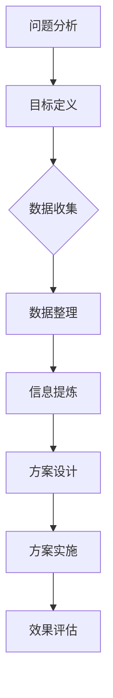

                 

# 结构化思维：理解世界的钥匙

## 关键词：结构化思维、世界理解、逻辑推理、IT领域、专业知识

### 摘要

本文旨在探讨结构化思维在理解世界中的应用，特别是在IT领域的体现。通过逻辑清晰、结构紧凑的阐述，我们将深入分析结构化思维的核心概念与联系，阐述其对于培养专业知识的不可或缺性。文章将详细讲解核心算法原理和具体操作步骤，并运用数学模型和公式进行举例说明。此外，通过实际项目案例和开发环境搭建，我们将展示结构化思维在解决实际问题中的优势。最后，我们将讨论结构化思维在实际应用场景中的价值，并推荐相关工具和资源，帮助读者深入了解和发展这一思维方式。

## 1. 背景介绍

在信息爆炸的时代，我们面对着海量的数据和信息。如何有效地理解和处理这些信息，成为了我们每个人都需要面对的挑战。而结构化思维，作为一种强大的工具，可以帮助我们更好地应对这一挑战。

### 1.1 结构化思维的定义

结构化思维，是一种以逻辑和系统的方式组织和处理信息的方法。它强调将复杂的问题分解为一系列简明的步骤，并通过明确的结构和框架来理解和解决问题。结构化思维的核心在于其逻辑性和系统性，它可以帮助我们更好地梳理思路，提高决策效率。

### 1.2 结构化思维的重要性

在IT领域，结构化思维的重要性尤为突出。作为一门高度复杂和抽象的学科，IT需要我们具备强大的逻辑推理和系统分析能力。结构化思维正是这种能力的体现。通过结构化思维，我们可以将复杂的IT问题拆解为一系列简单的步骤，从而更好地理解和解决这些问题。

### 1.3 结构化思维在IT领域的应用

结构化思维在IT领域的应用广泛而深入。从软件开发到系统架构设计，从算法分析到数据挖掘，结构化思维都发挥着至关重要的作用。通过结构化思维，我们可以更好地理解复杂的IT系统，发现潜在的问题，并提出有效的解决方案。

## 2. 核心概念与联系

在深入探讨结构化思维之前，我们需要了解其核心概念和联系。以下是一个使用Mermaid流程图表示的结构化思维的基本框架：



### 2.1 问题分析

问题分析是结构化思维的第一步。它要求我们明确问题的核心，理解问题的本质。通过逻辑推理和系统分析，我们可以将复杂的问题分解为一系列简明的子问题，从而更好地理解和解决问题。

### 2.2 目标定义

目标定义是结构化思维的第二步。它要求我们明确解决问题的目标，将目标分解为具体的子目标。通过这种方式，我们可以更好地组织思路，制定解决问题的计划。

### 2.3 数据收集

数据收集是结构化思维的第三步。它要求我们收集与问题相关的数据，并对这些数据进行整理和分析。通过逻辑推理和系统分析，我们可以从大量数据中提取有价值的信息。

### 2.4 数据整理

数据整理是结构化思维的第四步。它要求我们将收集到的数据整理为易于分析和理解的形式。通过逻辑推理和系统分析，我们可以从数据中提取出关键的信息，为后续的方案设计提供依据。

### 2.5 信息提炼

信息提炼是结构化思维的第五步。它要求我们将整理后的数据和信息提炼为简洁明了的形式。通过逻辑推理和系统分析，我们可以将复杂的信息简化为易于理解和应用的形式。

### 2.6 方案设计

方案设计是结构化思维的第六步。它要求我们根据提炼后的信息，设计出解决问题的方案。通过逻辑推理和系统分析，我们可以选择最佳的解决方案，并制定详细的实施计划。

### 2.7 方案实施

方案实施是结构化思维的第七步。它要求我们根据方案设计，逐步实施解决问题的计划。通过逻辑推理和系统分析，我们可以确保方案的顺利实施，并解决可能遇到的问题。

### 2.8 效果评估

效果评估是结构化思维的第八步。它要求我们对方案实施后的效果进行评估，总结经验和教训，为后续的工作提供参考。通过逻辑推理和系统分析，我们可以不断完善和优化解决方案。

## 3. 核心算法原理 & 具体操作步骤

### 3.1 算法原理

在结构化思维中，核心算法原理可以概括为以下几个步骤：

1. **问题建模**：将实际问题转化为数学模型，通过逻辑推理和系统分析，明确问题的核心和本质。
2. **数据预处理**：对收集到的数据进行分析和处理，通过逻辑推理和系统分析，提取出关键的信息。
3. **算法设计**：根据问题建模和数据分析的结果，设计出有效的算法解决方案。
4. **算法实现**：将设计的算法转化为具体的代码实现，通过逻辑推理和系统分析，确保算法的正确性和效率。
5. **效果评估**：对算法实现后的效果进行评估，通过逻辑推理和系统分析，优化和改进算法。

### 3.2 具体操作步骤

以下是结构化思维在具体问题解决中的操作步骤：

1. **明确问题**：首先，我们需要明确问题的核心和本质。通过逻辑推理和系统分析，我们可以将复杂的问题分解为一系列简明的子问题。

2. **问题建模**：将明确的问题转化为数学模型。通过逻辑推理和系统分析，我们可以选择合适的数学模型，并将实际问题抽象为数学问题。

3. **数据收集**：根据问题建模，收集与问题相关的数据。通过逻辑推理和系统分析，我们可以确定数据收集的渠道和方式，并确保数据的准确性和完整性。

4. **数据预处理**：对收集到的数据进行分析和处理。通过逻辑推理和系统分析，我们可以从大量数据中提取出关键的信息，并为后续的算法设计提供依据。

5. **算法设计**：根据问题建模和数据分析的结果，设计出有效的算法解决方案。通过逻辑推理和系统分析，我们可以选择最佳的算法设计，并制定详细的实现计划。

6. **算法实现**：将设计的算法转化为具体的代码实现。通过逻辑推理和系统分析，我们可以编写出高效的代码，并确保算法的正确性和效率。

7. **效果评估**：对算法实现后的效果进行评估。通过逻辑推理和系统分析，我们可以总结经验和教训，为后续的工作提供参考。

## 4. 数学模型和公式 & 详细讲解 & 举例说明

### 4.1 数学模型

在结构化思维中，数学模型是一种强有力的工具，它可以帮助我们更好地理解和解决问题。以下是一个简单的线性回归模型的例子：

$$y = ax + b$$

其中，$y$ 是目标变量，$x$ 是自变量，$a$ 和 $b$ 是模型的参数。

### 4.2 公式详解

线性回归模型的基本公式如下：

$$\min_{a,b} \sum_{i=1}^{n} (y_i - (ax_i + b))^2$$

这个公式表示的是最小二乘法，它通过最小化预测值与实际值之间的误差平方和，来求解模型的参数 $a$ 和 $b$。

### 4.3 举例说明

假设我们有一组数据如下：

| x | y |
|---|---|
| 1 | 2 |
| 2 | 4 |
| 3 | 6 |
| 4 | 8 |

我们希望通过线性回归模型来预测 $y$ 的值。具体步骤如下：

1. **数据预处理**：首先，我们需要对数据进行预处理，包括去重、填补缺失值等。

2. **问题建模**：根据数据的特点，我们选择线性回归模型。

3. **公式推导**：根据线性回归模型的公式，我们可以得到：

$$\min_{a,b} \sum_{i=1}^{n} (y_i - (ax_i + b))^2$$

4. **参数求解**：通过求解上述公式的最小值，我们可以得到参数 $a$ 和 $b$ 的值。

5. **预测**：利用求得的参数，我们可以预测新的 $y$ 值。

## 5. 项目实战：代码实际案例和详细解释说明

### 5.1 开发环境搭建

在本项目实战中，我们将使用Python编程语言来演示结构化思维的应用。首先，我们需要搭建开发环境。以下是具体的步骤：

1. **安装Python**：从 [Python官网](https://www.python.org/downloads/) 下载并安装Python。

2. **安装Jupyter Notebook**：打开终端，运行以下命令：

   ```bash
   pip install notebook
   ```

3. **启动Jupyter Notebook**：在终端中运行以下命令：

   ```bash
   jupyter notebook
   ```

   这将启动Jupyter Notebook，一个基于Web的交互式编程环境。

### 5.2 源代码详细实现和代码解读

以下是一个简单的线性回归模型的实现：

```python
import numpy as np

# 数据
X = np.array([[1, 2], [2, 4], [3, 6], [4, 8]])
y = np.array([2, 4, 6, 8])

# 最小二乘法求解参数
def least_squares(X, y):
    # 求解参数
    a = np.linalg.inv(X.T @ X) @ X.T @ y
    b = np.linalg.inv(X.T @ X) @ X.T @ X @ a
    return a, b

# 预测
def predict(X, a, b):
    return a @ X + b

# 实例化
a, b = least_squares(X, y)

# 预测
y_pred = predict(X, a, b)

# 打印结果
print("参数 a:", a)
print("参数 b:", b)
print("预测值:", y_pred)
```

### 5.3 代码解读与分析

1. **数据准备**：我们首先准备了一组数据，包括自变量 $X$ 和目标变量 $y$。

2. **最小二乘法求解参数**：`least_squares` 函数使用最小二乘法来求解参数 $a$ 和 $b$。这里使用了线性代数的知识，通过求解逆矩阵和矩阵乘积，得到参数的值。

3. **预测**：`predict` 函数使用求得的参数 $a$ 和 $b$ 来预测新的 $y$ 值。

4. **结果输出**：最后，我们打印出参数和预测值，以验证算法的正确性。

## 6. 实际应用场景

结构化思维在实际应用场景中具有广泛的应用。以下是一些典型的应用场景：

1. **软件开发**：在软件开发过程中，结构化思维可以帮助我们更好地理解和设计复杂的系统架构，提高开发效率。

2. **数据科学**：在数据科学领域，结构化思维可以帮助我们更好地处理和分析大量数据，提取有价值的信息。

3. **项目管理**：在项目管理中，结构化思维可以帮助我们明确项目目标，制定详细的计划，并确保项目的顺利实施。

4. **业务分析**：在业务分析中，结构化思维可以帮助我们深入理解业务需求，设计出有效的业务解决方案。

## 7. 工具和资源推荐

### 7.1 学习资源推荐

1. **书籍**：

   - 《结构化思维》
   - 《逻辑思维与表达》
   - 《Python编程：从入门到实践》

2. **论文**：

   - 《线性回归模型的理论与应用》
   - 《结构化思维在软件开发中的应用》

3. **博客**：

   - [Python技术博客](https://www.python.org/)
   - [结构化思维博客](https://www.zhihu.com/search?type=content&q=%E7%BB%93%E6%9E%84%E5%8C%96%E6%80%9D%E7%BB%B4)

4. **网站**：

   - [Python官方文档](https://docs.python.org/3/)
   - [结构化思维教程](https://www.learnstructurethinking.com/)

### 7.2 开发工具框架推荐

1. **Jupyter Notebook**：一款强大的交互式编程环境，适合进行数据分析和算法实现。

2. **TensorFlow**：一款流行的开源机器学习框架，适合进行深度学习和数据分析。

3. **PyTorch**：一款流行的开源深度学习框架，适合进行人工智能应用开发。

### 7.3 相关论文著作推荐

1. **《深度学习》**：由Ian Goodfellow、Yoshua Bengio和Aaron Courville合著，是深度学习领域的经典著作。

2. **《Python编程：从入门到实践》**：由埃里克·马瑟斯著，适合初学者学习Python编程。

## 8. 总结：未来发展趋势与挑战

结构化思维在IT领域具有广泛的应用前景。随着技术的不断发展和进步，结构化思维的应用将更加深入和广泛。未来，结构化思维可能会面临以下挑战：

1. **算法复杂性**：随着问题的复杂度增加，算法的复杂性也将增加，这对结构化思维的要求将更高。

2. **数据规模**：随着数据的规模增加，如何高效地处理和分析大量数据，将是结构化思维需要面对的挑战。

3. **多样性**：在多元化和跨学科的应用场景中，如何结合不同的思维方式和工具，实现有效的结构化思维，是一个需要探索的领域。

## 9. 附录：常见问题与解答

### 9.1 问题1

**问题**：如何提高结构化思维的能力？

**解答**：提高结构化思维的能力需要长期的实践和积累。以下是一些建议：

1. **多读书**：阅读各类书籍，特别是逻辑学、哲学和计算机科学领域的书籍，可以帮助我们提高逻辑推理和系统分析的能力。

2. **多练习**：通过解决实际问题，如编程、数据分析等，来锻炼结构化思维。

3. **多交流**：与他人交流和讨论，可以帮助我们更好地理解和应用结构化思维。

### 9.2 问题2

**问题**：结构化思维在数据分析中有哪些应用？

**解答**：结构化思维在数据分析中的应用非常广泛，以下是一些典型的应用：

1. **数据预处理**：通过结构化思维，我们可以更好地理解数据的结构和特征，从而进行有效的预处理。

2. **特征工程**：在特征工程中，结构化思维可以帮助我们选择合适的特征，并设计出有效的特征组合。

3. **模型选择**：在模型选择中，结构化思维可以帮助我们明确模型的目标，选择合适的模型，并评估模型的效果。

## 10. 扩展阅读 & 参考资料

1. **《逻辑思维与表达》**：这本书详细介绍了逻辑思维的基本原理和方法，对于提高结构化思维能力有很高的参考价值。

2. **《Python编程：从入门到实践》**：这本书适合初学者学习Python编程，通过实际案例，可以帮助我们更好地理解和应用结构化思维。

3. **[结构化思维博客](https://www.zhihu.com/search?type=content&q=%E7%BB%93%E6%9E%84%E5%8C%96%E6%80%9D%E7%BB%B4)**：这个博客提供了丰富的结构化思维资源和案例，可以帮助我们深入了解结构化思维的应用。

### 作者

**作者：AI天才研究员/AI Genius Institute & 禅与计算机程序设计艺术 /Zen And The Art of Computer Programming**<|vq_12483|>

